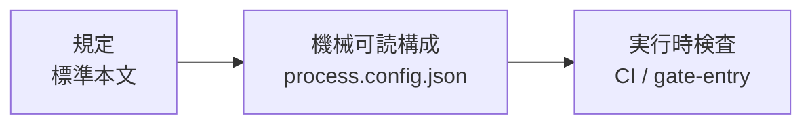

## ステータス

採用(2026-08-12)

## コンテキスト

本標準は「作成者と承認者を分離する」ことを前提に組み立てられています。第3章 3.5 の兼務禁止表、G-6 の判定基準「作成を指示した本人でない」、[ADR-0028](/process-compass/adr/0028-unmet-gate-distinct-from-omitted/)の未達の定義は、いずれもこの前提の上にあります。

**にもかかわらず、この原則そのものを決めた記録がありません**。第3章 3.5.1 はこれを ADR-0022 として引用していますが、[ADR-0022](/process-compass/adr/0022-handover-deadlines-relative-to-notice/)はコンテキスト移管の期限に関する決定であり、内容が一致しません。標準全体が乗っている原則が、参照先を持たない状態にあります。

### 現場で分離が崩れた

案件 P-001 で、次の事象が報告されました([#216](https://github.com/Takenori-Kusaka/process-compass/issues/216))。

- PO のセッションが、自ら `state:needs-dev` を付けて開発者の受信箱へ入れた仕事を、自ら拾って実装した
- 成果物を自ら判定する直前で人が気づいて止めた
- **ロール別のディレクトリ分離は行われており、ラベルも仕様どおり動いていた**

第5章の[Label Mailbox](/process-compass/phase5-implementation/label-mailbox/)にも、第3章 3.5.1 の物理隔離にも、違反はありません。それでも分離は崩れました。

### 崩れた理由は定義の単位にある

本標準は兼務を**人の属性**として定義しています。3.5 の表はすべて「役割 × 役割」であり、暗黙の単位は人です。人間の組織ではこれで足ります。1人が2つの役割を持てば、その人の頭の中で独立性が失われるからです。

実行主体が生成AIのセッションになると、独立性を壊すものが変わります。P-001 では**人は兼務していません**。1つのセッションが2つのレーンの文脈を取り込んだ時点で、独立性が消えました。壊れたのは人の兼務ではなく、**文脈の同一性**です。

### 統制の連鎖がロールだけ2段目で切れている

本標準の統制は3段で成立します。

ゲートはこの3段が通っています。ロールは2段目で切れています。

| 段 | ゲート | ロール |
| --- | --- | --- |
| 規定 | 第4章 ゲート基準 | 第3章 役割と責任 |
| 知識ベース | `tailoring-kb.json` の `gates[]` | `tailoring-kb.json` の `roles[]` |
| 案件の構成 | `process.config.json` の `gates` | **なし** |
| 実行時検査 | `verify-gate-contract` / `check-d0` | **なし** |

知識ベースにはロールの定義があります。プロファイル生成器がこれを読まないため、案件へ渡る前に落ちています。案件に届くロールの情報は D-0 体制図の人間可読の表だけであり、実行主体はそれを参照する手段を持ちません。P-001 でロール別セッションの定義が D-0 の承認を反映していなかったのは、反映する経路が存在しないためです。

### 物理隔離だけでは権限は分離しない

第3章 3.5.1 は、ディレクトリの分離により「Dev 用セッションの AI はマージ権限に物理的にアクセスできなくなる」と述べています。**全レーンが同一アカウントの認証情報を共有する運用では成立しません**。分離が実際に遮断するのは、文脈の汚染とインデックスの競合、および証跡を経由する強制の2点です。

## 決定

3つを決めます。

### 決定1: 作成者と承認者の分離を本標準の原則として明文化する

同一の成果物について、作成を指示した主体は、その成果物の判定者になりません。この原則は体制の規模、自律の水準、実行主体が人か AI かによって変わりません。本 ADR をこの原則の参照先とします。第3章 3.5.1 の ADR-0022 への参照は誤りであり、本 ADR へ差し替えます。

### 決定2: 分離の単位を「人」から「実行主体の文脈」へ拡張する

兼務の禁止を、次の2つの単位で判定します。**いずれか一方でも同一であれば、分離は成立していません**。

| 単位 | 対象 | 判定 |
| --- | --- | --- |
| 人 | 役割を担う自然人 | 従来どおり第3章 3.5 の表による |
| **実行主体の文脈** | 作業を実行するセッション・作業領域・認証情報の組 | **同一の文脈が、禁止された2つの役割の作業を実行してはならない** |

人の単位で成立していても、文脈の単位で成立していなければ、分離は成立していません。逆も同様です。3.5 の兼務禁止表は変更せず、判定の単位を追加します。

**文脈の分離は、次の3つがすべて分かれている場合にのみ成立します**。

| # | 分離する対象 |
| --- | --- |
| 1 | 作業領域(clone または worktree) |
| 2 | セッション(会話文脈。1セッションが複数の役割を担わない) |
| 3 | 認証情報(トークン。共有する場合は、権限の分離が成立していないものとして扱う) |

3 を満たせない体制では、権限の分離を代償措置つきの逸脱として記録します。[ADR-0029](/process-compass/adr/0029-shipping-approver-merge-exception/)の出荷判定者の例外と同じ扱いであり、独立性の回復ではありません。

### 決定3: ロールをテーラリングの出力へ含める

知識ベースの `roles[]` を案件の機械可読構成へ出力します。統制の連鎖の2段目を、ゲートと同じ形でロールにも通します。

| 出力に含める項目 | 用途 |
| --- | --- |
| ロールの識別子と名称 | 実行主体が自らの役割を宣言する |
| そのロールが判定者となるゲート | 判定してよい対象を限定する |
| **そのロールが実行してはならない工程** | 兼務禁止表と未達の記録から**導出する**。手で書かせない |
| 参照した D-0 の版 | 体制図の改訂に追随しているかを検査する |

導出物を手入力させません。禁止工程は兼務禁止表と `unmet[]` から機械的に導き、D-0 体制図には導出結果を表示します。

**ファイルの形式と配置は標準では規定しません**。標準が規定するのは、実行主体が自らのロールを宣言し、その宣言が検査可能であることまでです。具体的な形式は準拠テンプレートが定めます。

## 検討した選択肢

| 案 | 採らなかった理由 |
| --- | --- |
| ロール別セッションの定義を新しい成果物として標準へ追加する | 成果物を1つ増やしても、それを埋める情報の出所が D-0 の人間可読の表のままでは、同じ乖離が再発する。切れているのは成果物の有無ではなく統制の連鎖である |
| D-0 体制図に「実行してはならない工程」の記入欄を設ける | 兼務禁止表から導出できるものを手で書かせることになり、二重管理になる。導出結果の表示は行うが、入力欄にはしない |
| 第3章 3.5.1 のディレクトリ構成を規定へ格上げする | 例示されている5つのレーンは1案件の構成であり、標準が固定すべき対象ではない。固定すべきは写像の制約であって、レーンの数と名称ではない |
| 兼務の定義を文脈の単位へ**置き換える**(人の単位を廃止する) | 人の単位は人間だけで実行する案件で依然として有効である。置き換えると、AI を用いない体制で兼務の統制が消える |
| P-001 の事象を運用の逸脱として扱い、標準を変更しない | 同じ構造の破れが独立に3件ある。原則の決定記録の不在、ロールが構成へ出力されない点、ラベルの取得側に制約がない点であり、いずれも1案件の事情ではない |

## 影響

- 第3章 3.5 に判定の単位が1つ増える。既存の兼務禁止表は変更しない
- 第3章 3.5.1 の統制上の理由1(権限の機械的強制)は、認証情報の分離を伴う場合に限って成立する記述へ改める
- 準拠テンプレートは `process.config.json` にロールを出力する。スキーマの変更を伴う
- 認証情報を共有する1人体制では、権限の分離が逸脱として表示され続ける。**未達と逸脱の表示が増える**
- ラベルの取得側の制約([第5章 Label Mailbox](/process-compass/phase5-implementation/label-mailbox/))は本 ADR の範囲外とし、別に扱う

:::caution[暫定 EV-0020 / 見直し 2027-02]
**対象**: 文脈の同一性によって分離が崩れるという診断、および分離の成立条件3項目。
**根拠の水準**: E2(単一事例)。
**差し替え条件**: 3案件以上での分離の崩れの記録と、崩れた時点で3項目のどれが同一であったかの集計。

案件 P-001 の1件から導いた診断です。3項目が必要十分であることは確認できていません。
:::
