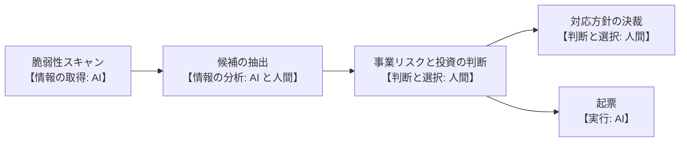

:::note[このページの鮮度について]
本ページの記述は **2026-08-06 時点**のものです。AI エージェントの能力は短期間で変化するため、記述には見直しの手続を伴わせています(末尾「見直しの手続」)。**将来の予測は書きません**。
:::

「AI が人の仕事を置き換える」という粗い言い方では、要員計画や責任設計に落とし込めません。実際に必要なのは、**作業を機能の段階へ分解し、どの段階を AI へ寄せられるか、人間の関与をどこまで下げてはならないかを見極める**ことです。

## 本ページの位置づけ

本ページは**現状の記述**であり、規定ではありません。どこまで AI に任せてよいかの**規定は[フェーズ4 第5章](/process-compass/phase4-process-design/human-ai-boundary/)にあります**。

| | 本ページ(フェーズ3) | [フェーズ4 第5章](/process-compass/phase4-process-design/human-ai-boundary/) |
| --- | --- | --- |
| 書くこと | 作業がどう変形しつつあるか。要員計画と責任設計への影響 | AI自律レベル L1〜L3、リスク区分による上限、独立性の要求事項 |
| 書かないこと | 「〜すべき」という規範、閾値 | 現場の実態の記述 |

**分類の語彙は第5章の AI自律レベル L1〜L3 を用います**。本ページ独自の分類記号は設けません。調査層が独自の語彙を持つと、規範層の改訂が伝わらず、両者の記述が食い違うためです。

## 「置き換え」という捉え方をやめる

**作業を AI へ寄せても、その作業が消えるわけではありません**。指示の作成、文脈の供給、出力の検証、失敗時の回復という**新しい作業が人間の側に生まれます**。

人と機械の得手不得手を並べて役割を割り振る方式は、1950年代から用いられてきました。しかし、その前提には誤りがあると指摘されています。「人が不得意なことを機械へ差し替えても、仕事の他の性質は変わらない」という想定が成立しないためです。自動化の効果は**量的でなく質的**であり、人間の作業そのものを変形させます。

したがって本ページは「誰が何割やるか」を書きません。書くのは**作業の中のどの段階が誰に寄るか**と、**人間の関与をどこまで下げてはならないか**です。

## 作業を4つの機能段階へ分解する

1つの作業は、次の4段階を含みます。**段階ごとに AI への寄りやすさが異なります**。

| 段階 | 内容 | 2026-08-06 時点の傾向 |
| --- | --- | --- |
| 情報の取得 | 仕様・既存資産・履歴を集める | 寄りやすい |
| 情報の分析 | 何が問題か、何が不足かを導く | 部分的に寄る |
| 判断と選択 | 何を正解とするか、どれを採るかを決める | **寄らない** |
| 実行 | 決めたものを形にする | 寄りやすい |

段階で分けると、作業名だけでは表せなかったことが表せます。

**例: テストの作成**

| 段階 | 担い手 | 理由 |
| --- | --- | --- |
| 情報の取得 | AI | 仕様・受入基準・既存テストの収集 |
| 情報の分析 | AI と人間 | 検証の不足箇所の特定 |
| 判断と選択 | **人間** | 何を正解とするかの決定。AI が決めると、実装の誤りをそのまま正解とするテストになる |
| 実行 | AI | テストコードの記述と実行 |

この分解は[第5章 5.8.4](/process-compass/phase4-process-design/human-ai-boundary/)の「R1 では人間が受入基準を事前定義する」という規定と一致します。

## 分担を決める4つの条件

段階を AI へ寄せられるかは、作業の種類ではなく**その現場に何が用意されているか**で決まります。

| # | 条件 | 問い |
| --- | --- | --- |
| 1 | 判定器の存在 | 正しさを機械的に判定する手段があるか |
| 2 | 判定器の独立性 | その判定手段は、検証の対象を作った主体と独立に用意されているか |
| 3 | 判定の帯域 | その判定を、生成の速度に対して人間の時間を追加で使わずに実行できるか |
| 4 | 責任の所在 | 結果に対して誰が責任を負うか |

条件2 が満たされない例が、**AI が実装とテストの両方を書く構成**です。テストは判定器そのものであるため、同じ主体が作ると判定器としての独立性を失います。

条件3 は 2026年に顕在化した制約です。生成の速度が上がっても、人間が検証できる量は増えません。**判定に人間の読解が必要な作業は、AI へ寄せても全体の速度が上がりません**。

:::note
判断基準に「可逆性」は含めません。[リスク区分 R1〜R3](/process-compass/phase4-process-design/roles-responsibilities/)が「決定の取り消し可能性と影響範囲」として既に定義しており、二重に管理しないためです。
:::

## 「人が結果確認のみでよい」作業はあるか

あります。ただし**作業名では特定できません**。

上の4条件のうち、条件1・2・3 を満たす場合に限り、人間の関与を事後の確認まで下げられます。具体的には次のような状況です。

- 型定義と既存のテストが揃っている箇所への定型的な生成
- 機械的に検証できる変換(書式の統一、命名規約の一括適用)
- 生成物が即座にコンパイルや既存テストで弾かれる種類の変更

いずれも「その作業だから」ではなく、**その現場にその判定器が実在するから**成立します。同じ作業でも、判定器のない現場では成立しません。

**テストの作成は、この条件を構造的に満たしません**。テストコードは判定器そのものであり、その正しさを機械的に判定する手段は原理的に限られます。

## ロール別の整理

各ロールについて、AI へ寄せられる段階と、人間が担う段階を示します。**関与の下限**は、それ以上は下げてはならない水準です。

| ロール | AI へ寄せられる段階 | 人間が担う段階 | 関与の下限 |
| --- | --- | --- | --- |
| 開発者 | 情報の取得、実行 | 受入基準の解釈、設計の選択 | L1〜L3(対象のリスク区分による) |
| QA / 品質保証 | 情報の取得、回帰の実行 | 何を検証するかの決定、出荷可否の判定 | **L1**(判定は委譲しない) |
| セキュリティ | 情報の取得、定型の診断 | リスク受容の判断、対応方針の決定 | **L1**(受容の判断は委譲しない) |
| プロダクトオーナー | 情報の取得、下書きの作成 | 価値の優先順位、作る理由の決定 | **L1** |
| PM / 決裁者 | 情報の取得、報告の生成 | 決裁、責任の引き受け | **L1** |
| ドメインエキスパート | 用語や模型の下書き | 業務ルールの正しさの保証 | **L1** |

L1〜L3 の定義は[第5章 5.4.2](/process-compass/phase4-process-design/human-ai-boundary/)によります。リスク区分による上限(R1→L1、R2→L2、R3→L3)も同章に規定しています。

**1つのロールが複数の段階にまたがります**。「このロールは AI に置き換わる」ではなく、「このロールの作業を段階に分け、段階ごとに担い手を決める」と考えます。

### 例: セキュリティの脆弱性対応

スキャンは AI が回し、危険度の高い候補も AI が挙げます。しかし「どのリスクを受容し、どこに投資するか」の判断は人間が担います。**この判断こそが、削ってはならない核心です**。

## 自動化が進むと人間の仕事は難しくなる

段階を AI へ寄せるほど、人間に残る仕事の難易度は上がります。これは 1983年から知られている構造的な帰結であり、AI に固有の新しい現象ではありません。

| 帰結 | 内容 |
| --- | --- |
| 技能の減退 | 日常業務のなかで技能を練習する機会が失われる |
| 仕事の質の変化 | 作業が、消耗を伴う監視へ変わる |
| 訓練の必要量の増加 | 稀にしか起きない介入に備えるため、**訓練は減るのではなく増やす必要がある** |
| 残る仕事の難化 | 人間には「自動化できなかった仕事」が残る |

**「AI へ任せた範囲について、人の教育を減らせる」という想定は成立しません**。フェーズ4では、この帰結に対して能力維持措置([第5章 5.4.7](/process-compass/phase4-process-design/human-ai-boundary/))と欠陥注入による検出能力の測定(5.6.2)を規定しています。

また、定型を AI が処理し例外を人間が処理する構成では、**最も難しい仕事が、易しい事例を解いた経験のない人へ回ります**。要員計画では、経験を積む機会をどこに残すかを設計する必要があります。

## 日本の組織文化への注意

この整理は理想的な分担です。日本の現場に載せるときは、フェーズ1・2で見たギャップに注意が必要です。

- **人間の担う段階が職位ゲートで滞留しやすい**(ギャップG3・G5)。決裁承認を AI で速くできない以上、承認の実効性を保ちつつ滞留させない設計が要る
- **説明責任を一意化する必要がある**(ギャップG2)。AI が出した候補を人が選んだとき、その選択の責任は誰にあるかを明示する。曖昧なままだと責任が拡散する
- **兼務でロールが揺れる**(ギャップG4)。分担はロールでなく作業の段階に紐づけると、兼務や異動があっても崩れにくい

## 見直しの手続

本ページの記述は、次の手続で見直します。**予測を書かない代わりに、見直しの契機を定めます**。

| 層 | 対象 | 周期 |
| --- | --- | --- |
| 層1 | どの作業がどの段階に入るかの一覧 | 四半期ごと |
| 層2 | 分担を決める4条件そのもの | 年次 |

周期を待たずに見直す契機は次のとおりです。

- 自組織の計測で、ある作業の自動承認の割合が定めた水準を超えた(監督が形骸化している兆候)
- AI が起因となった事象、または差し戻しの割合が上昇した
- **判定器の性質が変わった**(検査の追加または撤去)。分担の前提そのものの変化にあたる
- 用いるモデルの主要な版が更新された

見直しの結果は、**確認(変更なし) / 改正 / 廃止**の3つから選び、記録します。「確認」を明示的な決定として記録することで、**見直したうえで変えなかった場合と、見直していない場合を区別できます**。

## 次のページへ

この整理は「1つの組織の中での分担」です。しかし生成AIは、従来「外注」に出していた作業の担い手も変えます。その事業継続性リスクと打ち手は[内製/外注の再構成とBCP](/process-compass/phase3-gap-analysis/insourcing-bcp/)で扱います。
