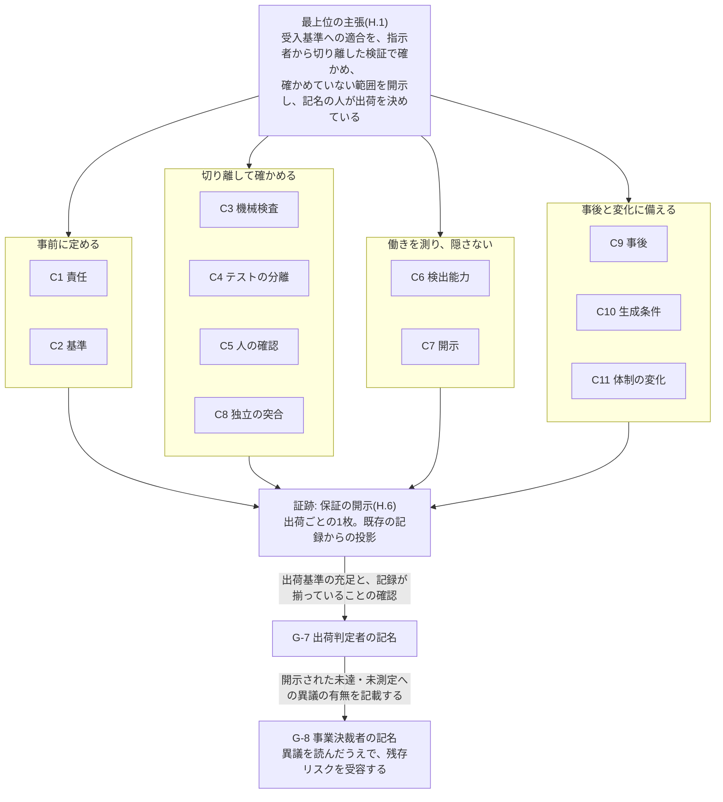

本附属書は、「AI を介した開発成果物を、どう担保するのか」という品質保証部門の問いへ1ページで答えます。決定の根拠は[ADR-0056](/process-compass/adr/0056-assurance-argument/)です。

> 本標準が示せるのは、何をどの独立性で確かめ、何を確かめていないか、です。

**本附属書は既存の条項からの投影です**。要求事項の正本は各章にあり、本附属書を第2の正本として扱いません。本附属書が自ら定めるのは、次の4つです。AI による確認の数え方(H.4)、保証の開示の読み方と定型の文(H.6)、形骸化していないことの示し方(H.7)、対外的に使う表現(H.8)です。案件には論証を書かせません。案件が出すのは、H.6 の保証の開示だけです。

品質保証部門が時点ごとに行うことは、H.12 の1か所にまとめています。導入時、体制の変化点、出荷ごと、委任の期間ごと、四半期、対外の6つの時点です。時点から条項を引くときは、H.12 から読んでください。



## H.1 最上位の主張

> 本標準に従って出荷した変更は、事前に人が合意した受入基準への適合を、作成の指示者から切り離された検証によって確かめている。検証の独立性が成立しなかった範囲、実施しなかった検証、検証の検出能力の実測値(または未測定である事実)は、出荷の時点で一覧として開示され、記名の自然人がそれを見たうえで出荷を決めている。

**これは工程についての主張であり、製品に欠陥が無いことの主張ではありません**。要約は[第1章 1.9](/process-compass/phase4-process-design/overview/)にあります。この論証が品質保証部門への説明として機能するかは実証していません(ADR-0056 の EV-0044、E0)。

### 「切り離された検証」が指すもの

主張の「作成の指示者から切り離された検証」は、1つの手段を指しません。人の独立、文脈の分離、入力の分離の3つがあり、**変更のリスク区分によって、どれを求めるかが違います**。語の定義は[第3章 3.5.4](/process-compass/phase4-process-design/roles-responsibilities/)、テスト生成の段階は[第5章 5.8.4](/process-compass/phase4-process-design/human-ai-boundary/)、変異試験の適用は[AI生成テストの検出力検証](/process-compass/phase5-implementation/test-effectiveness/)が正本です。

| 変更のリスク区分 | 人の独立(G-6) | テスト生成での文脈の分離 | テスト生成での入力の分離 | 変異試験 |
| --- | --- | --- | --- | --- |
| R1 | 作成を指示した者と別の人が、出荷前に確認する。未達のまま出荷するには例外承認を要する | 求める | 求める。テストを実装より先に生成し、生成へ実装を渡さない。加えて、人が受入基準を事前に定め、テストの十分性を判定する(段階「強」) | 必須。当該範囲を変更するたびに実行する |
| R2 | 同上。置けなければ未達とし、件数を開示する | 求める | 求める。テストを実装より先に生成し、生成へ実装を渡さない(段階「中」) | 週次の定期実行。合否条件にしない |
| R3 | 同上。委任の7条件を満たし、独立レビュアの席の機械の規則に該当する変更は、事後の抜き取りへ移る | 求める(段階「弱」) | **求めない**。テストの生成へ実装を渡すことを禁じていない | 任意。実行しない場合も記録を要しない |
| 安全関連ソフトウェア | 組織上の独立を重ねる。独立した安全性の評価を G-6 に加える | 求める | R1 と同じ。加えて、検証の担当者を実装の責任者から組織的に独立させる(段階「最強」) | [附属書F](/process-compass/phase4-process-design/safety-verification/) F.6 による |

- 本附属書が「テストの生成へ実装を渡していない」「検出力を測っている」と述べるとき、その範囲は上表による。**R3 の変更について、この2つは主張しない**
- 人の独立が成立しなかった変更と、事後の抜き取りへ移った変更は、件数を保証の開示(H.6)へ載せる
- AI の確認は、どの区分でも人の独立に数えない(H.4)

### 「品質保証」という語の意味

品質マネジメントの用語規格(ISO 9000)は、品質保証を「品質要求事項が満たされるという確信を与えることに焦点を合わせた、品質マネジメントの一部」と定義します(訳は本標準による。2026-09 時点。定義は二次情報で確認しており、規格の本文は読了していません)。品質保証は、欠陥が無いことの約束ではなく、**確信を与える活動**です。

本標準が対外的に示す品質保証の在り方は、この意味のものです。AI を介した開発成果物について、確信の根拠を次の4つに置きます。

| # | 確信の根拠 | 対応する主張 |
| --- | --- | --- |
| 1 | 合否の基準は人が先に定め、AI の出力は未検証の入力として扱う | C2、C3 |
| 2 | 作成を指示した者から切り離して確かめる。人の独立と、文脈・入力の分離を区別する | C4、C5、C8 |
| 3 | 確認が働いていたかを測り、成立しなかった統制を隠さない | C6、C7 |
| 4 | 残ったリスクは、記名の人が見たうえで受け入れる | C1、H.5 |

担い手が人か AI かによって、この4つは変わりません。変わるのは、2 のうち「独立」が成立する範囲と、3 で開示する内容です(C11)。

日本語の「保証」は、結果の約束と読まれることがあります。対外の文書では H.8 の表現に従います。

## H.2 主張しないこと

| 主張しないこと | 代わりに示すもの | 既に明記している箇所 |
| --- | --- | --- |
| 欠陥が無いこと、残存する欠陥の数 | 実施した検証と、実施しなかった検証の一覧 | [第5章 5.6.2](/process-compass/phase4-process-design/human-ai-boundary/)(注入の結果を残存欠陥数の推定に用いない) |
| 受入基準と試験計画が十分であること | 基準を生成より前に人が定めた記録 | [第4章 G-7](/process-compass/phase4-process-design/gate-criteria/)(消化率は計画の十分性を示さない)、[ADR-0041](/process-compass/adr/0041-scope-is-not-exhaustive/) |
| AI による確認が、独立した人の確認と同等であること | AI の層の検出率、または「未測定」 | H.4、[ADR-0054](/process-compass/adr/0054-seat-accountable-performer/) 決定7 |
| 人のレビューが全行を読んだこと | 受入基準との突合と、挙動の説明を行った記録 | [附属書C](/process-compass/phase4-process-design/review-guide/) |
| 抜き取られなかった範囲に逸脱が無いこと | 抽出した対象と、確認した内容 | [プロセス内部監査](/process-compass/phase6-operation/process-audit/)「この手続の限界」 |
| 他者の著作物・秘匿情報の混入が無いこと | 定めた検査を実施した記録 | 第4章 G-5・G-7 基準8、[ADR-0021](/process-compass/adr/0021-ip-clearance-evidence-not-guarantee/) |
| 生成の再現、モデルそのものの適合性 | 生成の条件を特定できる記録 | 第5章 5.8.1・5.8.2、[エージェントの操作の統制](/process-compass/phase5-implementation/agent-trace-control/) |
| 既存規格への適合 | 対応関係(H.10) | 第1章 1.3、[QMS 文書管理との対応](/process-compass/phase5-implementation/qms-document-control/) |
| 契約上の責任の帰結 | なし(本標準は答えを持たない) | [第8章 軸D](/process-compass/phase4-process-design/tailoring-guide/) |
| 使いやすさ | なし(判定の対象にしない) | [ADR-0051](/process-compass/adr/0051-usability-out-of-scope/) |

## H.3 論証

各主張に、支える条項、品質保証部門が受け取る証跡、主張の崩れを示す観測を対応させます。章節番号の指す章は次のとおりです。

- 1.x は[第1章 総則](/process-compass/phase4-process-design/overview/)、3.x は[第3章 体制・会議体](/process-compass/phase4-process-design/roles-responsibilities/)
- G-1〜G-8 は[第4章 ゲートと判定基準](/process-compass/phase4-process-design/gate-criteria/)、5.x は[第5章 役割境界](/process-compass/phase4-process-design/human-ai-boundary/)
- テンプレ0〜10 は[第6章 成果物](/process-compass/phase4-process-design/deliverable-templates/)、7.x は[第7章 例外](/process-compass/phase4-process-design/exception-escalation/)
- 軸A〜E と禁止事項は[第8章 テーラリング](/process-compass/phase4-process-design/tailoring-guide/)

| 主張 | 支える条項 | 受け取る証跡 | 主張の崩れを示す観測 |
| --- | --- | --- | --- |
| **C1 責任**: すべての成果物と判定に、記名の責任者が1名対応する。AI は責任者にならない | 3.2、3.3、5.2、5.4.3、5.5.1、テンプレ0 | 承認済みの D-0(現行版と改訂履歴)、所有者定義、承認アカウントと実在する人物の対応表 | 権限のない者の承認、名簿に実在しない人、1人による複数のアカウントの使用(内部監査 観点6)、責任者の欄が空の席、委任の範囲を定めない責任者 |
| **C2 基準**: 合否の基準は、生成より前に人が定めている | 第4章 G-1 基準4・G-2・G-4、欠陥トリアージ基準 | 承認済みの仕様(受入基準)、G-2・G-4 の判定記録、G-1 の閾値の記録 | 受入基準の承認日時が実装より後、7.3 の例外承認を経ない閾値の変更(内部監査 観点15) |
| **C3 機械検査**: AI の出力は未検証の入力として扱われ、合意済みの検査を全件通過している | 5.8.1、第4章 G-5 基準1〜8・「検査対象が存在しない場合の扱い」 | 変更ごとの必須検査の実行記録(未実施・対象なし・通過の区別つき)、除外設定と閾値の変更履歴 | 実装の開始後も続く「対象なし」(内部監査 観点16)、承認を経ない除外設定の追加(同 観点4) |
| **C4 テストの分離**: テストの生成は、変更のリスク区分に応じた段階で実装から切り離されている(H.1 の表)。R1・R2 の変更では、テストの生成へ実装を渡していない | 5.8.4、[AI生成テストの検出力検証](/process-compass/phase5-implementation/test-effectiveness/)、[附属書F](/process-compass/phase4-process-design/safety-verification/) F.6 | 受入基準とテストの対応。変異スコアと生存した変異の一覧(R1 は変更ごと、R2 は週次。R3 は任意であり、無い場合がある) | 変異スコアの低下、G-7 以降で検出される欠陥の比率の上昇 |
| **C5 人の確認**: 作成を指示した者と別の人が、挙動を理解したうえで確認している。成立しなかった変更は一覧に出る | 5.2、5.5、第4章 G-6、3.5、3.5.3、3.5.4、[附属書C](/process-compass/phase4-process-design/review-guide/) | 承認記録(人・日時・確定の形態)、承認したアカウントと名簿の人の対応、作成を指示した者の記載、挙動要約、ブランチ保護の設定、成立しなかった変更の一覧(未達・委任・例外) | 承認者と指示者が同一の人または同一の文脈、名簿と対応づけられない承認者、挙動要約の欠落と複製(内部監査 観点1)、委任の範囲を逸脱した変更(同 観点10) |
| **C6 検出能力**: 人の確認と AI の確認の検出能力は測定され、低下は権限の制限として作動する | 5.6.1、5.6.2、5.4.6、7.9、[運用メトリクス](/process-compass/phase6-operation/metrics/) | 工程単位の検出率(人の層と AI の層。件数・類型・測定時点つき)または「未測定」、7.9 の発動と解除の記録 | 差し戻し率 0% の継続と検出率の低下の同時発生、見逃しが続く期間に発動の記録が無い |
| **C7 開示**: 実施しなかったこと、成立しなかったことが、通過と区別して残っている | [ADR-0028](/process-compass/adr/0028-unmet-gate-distinct-from-omitted/)、[ADR-0029](/process-compass/adr/0029-shipping-approver-merge-exception/)、第8章「調整は宣言を伴う」、7.3、7.8、第4章 G-7 基準1 | テーラリングの宣言、未達と逸脱の一覧、未消化のテストと残存リスク、既知の不具合、未回収の例外 | 宣言に無い省略、事後処理の滞留と期限超過(内部監査 観点2・3・5)、保証の開示の欠落(同 観点13) |
| **C8 独立の突合**: 出荷基準の充足と、記録と開示の完備を、開発ラインの外の人が突合して記名している。残存リスクは、事業決裁者が出荷判定者の異議を読んだうえで、記名で受容している | G-7 基準1〜9 と「出荷判定者の署名の意味」、G-8、3.4.1、3.5、3.5.2、5.7.2 | G-7 の判定記録、エビデンス集約の出力、G-8 の決断の記録(受容したリスクと、出荷判定者の異議の有無)、兼務の場合は代償措置の記録 | 判定記録の欠落、D-0 に無い兼務、G-8 の決断の記録に受容したリスクまたは異議の有無の記載が無い、理由の記載を要する開示に理由が無い(内部監査 観点14) |
| **C9 事後**: 出荷後の欠陥は原因のゲートへ戻り、運用の逸脱は内部監査が拾う | [インシデント対応](/process-compass/phase6-operation/incident-response/)、[プロセス内部監査](/process-compass/phase6-operation/process-audit/)、5.4.6、5.5.7 | ポストモーテム、欠陥の検出工程の集計、監査記録(所見 0 件の期は確認した内容)、取り消しと引き下げの記録 | 重大な欠陥の流出に原因ゲートの特定が無い、2期連続の所見 0 件 |
| **C10 生成条件**: 成果物がどの条件で生成されたかを特定でき、問題の影響範囲を絞れる | 5.8.2、3.12.3、3.12.5、[エージェントの操作の統制](/process-compass/phase5-implementation/agent-trace-control/) | 変更ごとのモデルの版・指示資産の版・実行の識別子、モデルの適合性評価と差し替えの記録 | 版を特定できない変更、宣言した担い手の識別と実際に動いたモデルの不一致(内部監査 観点17) |
| **C11 体制の変化**: 体制の変化点の後も、C1〜C10 が保たれる | 3.13、3.4.2、第8章「再テーラリングの契機」、テンプレ0 | D-0 の改訂履歴、判定記録と構成が参照する D-0 の版の一致、失効した適合性確認と再確認の記録 | D-0 の改訂を経ずに成立した判定(内部監査 観点11)、失効した担い手の確認を検出の層に数えた記録(同 観点12) |

- 未達と未測定は、証跡として有効な値である。**差し戻すのは記載の欠落だけである**
- 論証のどの主張も支えない検査と記録は、[改善サイクル](/process-compass/phase6-operation/improvement-cycle/)で廃止の候補に挙げる。統制を外すときは理由を記録する
- 論証のために、新しいゲート・検査・様式を足さない

### 主張の崩れを、誰がいつ観測するか

観測には担当を置きます。担当の無い観測は、崩れが起きても誰にも届きません。時点は3つです。出荷ごとは、保証の開示を読む出荷判定者が見ます。四半期は、[プロセス内部監査](/process-compass/phase6-operation/process-audit/)の観点が見ます。その他は、通知と定例の確認です。

| 主張 | 出荷ごと(保証の開示を読む出荷判定者) | 四半期(内部監査の観点) | その他の時点 |
| --- | --- | --- | --- |
| C1 責任 | 項目1。責任者が未記入の席、名簿と対応づけられない承認者 | 観点6 | — |
| C2 基準 | G-7 基準5 の突合。G-2・G-4 の判定記録の欠落 | 観点15 | — |
| C3 機械検査 | 項目4。未実施と「対象なし」の区別 | 観点4・16 | — |
| C4 テストの分離 | 項目4。変異試験の実施の有無 | — | 月次。[運用メトリクス](/process-compass/phase6-operation/metrics/)の欠陥の検出工程を、[改善サイクル](/process-compass/phase6-operation/improvement-cycle/)で確認する |
| C5 人の確認 | 項目1・3。独立した人の確認を経ていない変更の件数、挙動要約が無い変更の件数 | 観点1・10 | — |
| C6 検出能力 | 項目6。値、測定時点、未測定が続いている期間 | 観点12。未測定の継続は抽出条件 | 即時。権限の一時制限の発動の通知(3.13.6) |
| C7 開示 | G-7 基準9 の突合。記載の欠落 | 観点2・3・5・13 | — |
| C8 独立の突合 | 事業決裁者が、異議の欄と受容の対象を読む(G-8) | 観点14。当該案件の出荷判定者でない者が監査する | — |
| C9 事後 | — | 監査記録の報告を受ける者が、所見 0 件の継続を見る(プロセス内部監査「監査自体の形骸化を検知する」) | 随時。重大な欠陥の流出時のポストモーテム |
| C10 生成条件 | 項目7。宣言した担い手と、コミットに記録された共著者の不一致 | 観点17 | — |
| C11 体制の変化 | 項目7。期間中の体制の変化点 | 観点11・12 | 即時。人数の境界の通過、運用形態の変更、担い手の識別の変更の通知(3.13.6) |

- 「—」は、その時点に観測の担当を置いていないことを示す。出荷ごとと四半期のどちらかを欠く主張は、C4(四半期)と C9(出荷ごと)である
- 出荷判定者が見るのは、記載の有無と値の推移である。値の良否で差し戻さない(H.5)。気づいたことは、異議として G-8 の決断の記録へ書く
- 観点13・14 は、当該案件の出荷判定者の席の責任者であった者が監査しない(プロセス内部監査「実施者の要件」)

## H.4 AI による確認の数え方

「AI が確認した」は3種の別のものを指します。種別ごとに数え方を分けます。

| 種別 | 例 | 扱い |
| --- | --- | --- |
| 決定論的な検査 | AI が書いたテストの実行、静的解析、変異試験 | 検証に数える。条件は、期待値が人の承認した受入基準に由来することである。R1・R2 の変更では、テストの生成へ実装を渡していないことを条件に加える。R1 の変更では、変異試験で検出力を測っていることも条件に加える。R3 の変更では、この2つを条件にしない(H.1 の表) |
| AI の推定による判定 | AI レビュー、AI による受入基準の充足判定 | **判定に数えない**。検出の層としてのみ数える |
| 人の判定 | G-6、G-7 | 判定に数える |

**検出の層**とは、欠陥や逸脱を見つけるために置く確認のうち、ゲートの判定に数えないものを指します。通過しても判定は成立せず、人の確認を減らす理由にもなりません。働きは検出率で示し、値または「未測定」を開示します。

AI の推定による判定を検出の層として数える条件は、次の5つです。

| # | 条件 |
| --- | --- |
| 1 | 欠陥注入による検出率を測り、値を開示する。未測定は「未測定」と開示する。担い手の識別が変わったら測り直す(第5章 5.6.2、第3章 3.4.2) |
| 2 | 検証側へ、生成側の文脈と作成者の主張を渡さない(第3章 3.5.3・3.5.4 の入力の分離) |
| 3 | 検証側の指示を、検証の対象となる変更から書き換えられない |
| 4 | 通過を理由に人の確認を減らさない。合否条件に入れない |
| 5 | 記録には「AI レビュー通過」ではなく、指摘の内容と採否を残す |

5条件のうち、確かめる時点と者を条項が定めているのは、条件1 の一部だけです。

| 条件 | 確かめる時点と者 | 規定 |
| --- | --- | --- |
| 1 のうち、担い手の識別ごとの欠陥注入による検出の記録 | AI を担い手に置くとき、および担い手の識別が変わったとき。AI維持管理者が適合性確認を実施し、当該の席の責任者が承認する。席の責任者が交代したときは承認が失効し、新しい責任者が承認し直すまで協働を上限とする | 第3章 3.4.2 の要求事項2・7・9 |
| 1 のうち、検出率の測定と開示 | 測定の周期と方法は第5章 5.6.2 による。開示は出荷ごとの保証の開示の項目6 に出る | 第5章 5.6.2、H.6 |
| 2〜5 | **確かめる時点と者を定めた条項は無い**。条件2 と3 が求める設計は、第3章 3.5.3・3.5.4 の分離と、AI維持管理者が保守する指示資産と強制層(第3章 3.11.2)に当たる。条件4・5 は、実行主体への指示として `CLAUDE.md` へ降ろしている(下記の実装マーク) | 第3章 3.5.3・3.5.4・3.11.2 |
| 事後(四半期) | 内部監査。失効した担い手の確認が、検出の層に数えられていないかを見る。条件2〜5 の充足は、観点として置いていない | プロセス内部監査 観点12 |

条件2〜5 を誰がいつ確かめるかは、本標準は定めていません。組織が定めます。定めていない組織では、条件2〜5 を満たしていることを示す記録が無く、AI の確認を検出の層に数える根拠は条件1 の測定だけになります。

条件4 に、委任の範囲という除外はありません。委任の変更で人の事前確認が無いのは、AI の確認を通過したためではなく、第5章 5.5.4 の7条件を満たすためです。委任の根拠は、壊れたことを検出でき、取り消せることに置きます。

<!-- impl IMPL-0031 target=claude-md state=delivered note="AI の推定による判定を判定に数えず、記録には指摘の内容と採否を残す" -->

次のものを、検出の層または独立した確認として数えてはなりません。

- 生成と同じセッション・作業領域・認証情報で行った確認(第3章 3.5.3)
- エージェントを分けた、提供元やモデルの系統を変えた、役割名を与えた、のいずれかだけを根拠にした「独立」の表示
- 検出率が未測定の層を、検出能力を確かめた層として示すこと
- 適合性確認が失効した担い手の確認(第8章 禁止事項)。確認の記録の失効と、承認の失効のどちらも含む(第3章 3.4.2)
- 複数の AI の合議や多数決の一致、および外部の観測を持たない自己修正
- AI の要約だけを入力にした人の承認を、人の判定として数えること(第3章 3.10.12)

文脈を切り離した新しいセッションでの再レビューでも、注入した欠陥の約 73% を見逃した測定があります(2026-09 時点。単一のモデルを用いた1件の測定)。モデルの系統を混ぜる効果は、測定によって向きが分かれています(2026-09 時点。根拠の水準は E2)。入力の分離の根拠の水準は ADR-0054 の EV-0041(E2)に開示しています。

:::caution[暫定 EV-0059 / 見直し 2027-03]
**対象**: 5つの条件を満たした AI の確認を、検出の層として数えるという判断。
**根拠の水準**: E1(間接)。
**差し替え条件**: 自組織のリポジトリで測った、人の層と AI の層の注入欠陥の検出率と、条件を欠いた構成との差。AI の層が、人の層の見逃した注入欠陥を1件も検出しない場合は、検出の層として数えるのをやめる。ある条件を欠いても検出率に差が無い場合は、その条件を外す。

個々の条件に隣接する測定はありますが、5つの組が検出の層として働くことを測った資料はありません。出典の所在は `research/282-survey-2026-09/` です。
:::

## H.5 署名の意味

> 出荷判定者の署名は、成果物の正しさの承認ではない。事前に定めた出荷基準を満たしていることと、定めた検証の記録および成立しなかった統制の一覧が揃っていることの確認である。一覧に載った残存リスクの受容は、リリース決裁(G-8)の決断の記録に事業決裁者が記名する。

正本は[第4章 G-7・G-8](/process-compass/phase4-process-design/gate-criteria/)です。署名ごとの意味は次のとおりです。

| 署名 | 意味すること | 意味しないこと |
| --- | --- | --- |
| 独立レビュア(G-6) | 受入基準との一致を確かめ、挙動を自分の言葉で説明できる | 全行を読んだこと、欠陥が無いこと |
| 出荷判定者(G-7) | (1) 事前に定めた出荷基準を満たしている。出荷基準は、欠陥トリアージ基準や安定性の閾値など、G-7 の基準を指す (2) 定めた検証の記録と、保証の開示が揃っている | 成果物の正しさ、数値の十分性、開示された残存リスクの受容 |
| 事業決裁者(G-8) | 開示された未達・未測定という事実と、出荷判定者が記載した異議の有無を読んだうえで、残存リスクを受容した | 設計の良否の承認、技術品質の再判定 |

G-7 へ内容の十分性の判定を戻しません。読解力を前提としない判定という設計を保つためです。出荷基準の充足は、基準として定めた値との突合であり、その値が十分かどうかの判定ではありません。

### 出荷判定者の異議

出荷判定者は、未達・未測定の多さを理由に G-7 を差し戻せません。差し戻せるのは、出荷基準を満たさない場合と、記載が欠落している場合です。その代わりに、**出荷判定者は、開示された未達・未測定についての異議の有無を、G-8 の決断の記録へ必ず記載します**。正本は第4章 G-8「出荷判定者の異議」です。

| 項目 | 規定 |
| --- | --- |
| 記載する者 | 出荷判定者 |
| 異議の対象 | 保証の開示に載った未達・未測定。設計の良否と技術品質は対象にしない |
| 記載する場所 | G-8 の決断の記録の欄(第5章 5.7.2)。新しい様式を設けない |
| 記載する内容 | 異議の有無。異議がある場合は、開示されたどの事実への異議かを書く。異議が無い場合も「異議なし」と書く |
| 理由の記載 | 開示が次のいずれかに当たる場合は、異議の有無とあわせて理由を書く。「異議なし」とする場合も同じである。(1) 独立した人の確認を経ていない R1 の変更がある (2) 検出能力が、前回の出荷に続いて未測定である (3) 独立した人の確認を経ていない変更の件数、または構成上の未達のゲートと逸脱の数が、前回の出荷より増えた。2つの量を別々に比べ、どちらか一方の増加で当たる (4) 事後の抜き取りを、作成を指示した本人が行っている |
| 委任の期間の開示 | 期間ごとの保証の開示にも、出荷判定者の異議の記載と、事業決裁者の受容の記名を要する(第5章 5.5.4) |
| 空欄の扱い | 記載の欠落として扱う。空欄のままでは、事業決裁者は受容を記名しない。理由の記載を要する事項に当たるのに理由が無い記載も、同じ扱いとする |
| 事業決裁者の扱い | 記載を読んだうえで、受容を記名する。受容できないときは G-8 を差し戻す。異議を受けて受容する場合は、異議の扱いを書く |
| 事後の確認 | 内部監査の観点14 が、受容と異議の扱いの記載、および理由の記載を確かめる([プロセス内部監査](/process-compass/phase6-operation/process-audit/)) |

出荷を止める権限は、出荷基準と記載の欠落については出荷判定者に、開示された残存リスクについては事業決裁者にあります。**異議は、出荷を止める権限ではありません**。後者の決定へ、品質保証部門の見解を残す経路です。

異議の経路は、異議を書く者と、読んで受容する者が別の自然人であることを前提にしています。同じ人が兼ねると、受容が自己完結します。

| 体制 | 出荷判定者の席と事業決裁者の席の責任者 |
| --- | --- |
| 3名以上 | 同一人物にしない([第3章 3.5](/process-compass/phase4-process-design/roles-responsibilities/)の兼務禁止) |
| 3名未満 | 同一人物になる場合は、逸脱として D-0 体制図へ記録する。保証の開示の項目1 へ「異議を書く者と、残存リスクを受容する者が同一である」と表示する。異議の欄の記載と受容の記名は省かない |

3名未満の体制で兼務を禁じないのは、禁じると1名の体制を宣言できなくなるためです。成立しない統制は、未達・逸脱として表示します([ADR-0028](/process-compass/adr/0028-unmet-gate-distinct-from-omitted/))。

理由の記載は、異議を書かせる基準ではありません。開示を読まずに書いた「異議なし」を、記録の上で判別できるようにするためのものです。4つの事項に当たるかどうかは、保証の開示の値から機械的に読み取れます。値の良否の判定を、出荷判定者へ求めるものではありません。4つの事項で足りるかは検証していません。根拠の水準と差し替え条件は、第4章 G-8 の暫定マーク EV-0063(E0)に開示しています。

## H.6 保証の開示

出荷ごとに、次の7項目を1枚で示します。**既存の記録からの投影であり、人に新しい記述を書かせません**。項目の正本は[第4章 G-7](/process-compass/phase4-process-design/gate-criteria/)「保証の開示」で、G-7 の基準9 が記載の完備を突合します。本節は、各項目の出所と読み方、定型の文を示します。第6章に様式を置かないのは、保証の開示が生成物だからです。

| # | 項目 | 出所(投影元の記録) | 読み方 |
| --- | --- | --- | --- |
| 1 | 体制と独立性の成立状況(G-6・G-7 それぞれ、成立 / 外部依頼 / 事後の抜き取り / 未達 / 兼務と代償措置) | D-0 体制図(テンプレ0)、構成の未達と逸脱の一覧、承認の記録と人の名簿の対応、変更ごとの「作成を指示した者」の記載 | 作成を指示した者と別の人が確かめた範囲と、確かめていない範囲。承認の記録の件数ではない(後掲「独立した人の確認の数え方」)。前回の出荷の値と並べて読む |
| 2 | テーラリングの宣言(外した項目と理由) | 第8章「調整は宣言を伴う」の差分の一覧 | 標準のどの要求を外して運用したか |
| 3 | リスク区分ごとの変更の件数と、確定の形態(人確定・協働・委任)の内訳 | 変更ごとのリスク区分と、区分を確定した者の記名(3.8.1)、判定記録の「確定の形態」(5.7.1) | 委任で先へ進めた変更の件数と、そのうち G-6 の判定を事後へ移した変更の件数。**人の事前確認を経ていない変更とは、後者を指す**。開発者の席の規則にだけ該当し、独立レビュアが事前に承認した変更は、独立した人の確認を経た変更に数える(第5章 5.5.4 の条件7)。委任の変更のうち独立した人の事前の承認が無いものは、「独立した人の事前の承認が無い委任の変更」と呼び分け、G-6 を事後へ移した変更と、それ以外(未確認)に分けて示す。委任の変更は、G-7・G-8 を変更ごとには行っていない。前回の出荷の値と並べて読む |
| 4 | 機械検査の結果。未実施と通過を区別する | G-5 の証跡(「対象なし」を含む) | 実施していない検査が、通過として数えられていないか |
| 5 | 残存リスク、既知の不具合、未回収の例外 | G-7 基準1〜3 の記録、7.8 の記録 | 事業決裁者が G-8 で受容する対象 |
| 6 | 検出能力の測定値と測定時点(人の層・AI の層)。未測定は「未測定」 | 5.6.2 の記録。3.4.2 の適合性確認の結果は、検出能力の測定値に含めず、別の行に示す | 確認が働いていたかを確かめた範囲。測定時点の後に担い手の識別が変わっていれば、値は失効している。「未測定」は、続いている期間と並べて読む |
| 7 | 生成の条件(モデルの版・指示資産の版)と、期間中の体制の変化点 | 5.8.2 の記録、D-0 体制図の改訂履歴(3.13.4) | 問題が出たときに影響範囲を絞る手がかりと、期間中に統制の前提が動いた時点。AI が使えなかった期間と、その間の扱い(人へ戻した / 止めた)を含む |

<!-- impl IMPL-0032 target=evidence-aggregation state=delivered note="保証の開示を既存の記録からの投影として出力し、未達と未測定を値として表示する。承認は、名簿の人へ対応づき、作成を指示した者でない場合にだけ、独立した人の確認に数える" -->

- 未達と未測定は正当な値として受け入れる。**差し戻すのは記載の欠落だけである**。値の良否で落とすと、形式を満たすための記入が起きる
- 保証の水準を等級で表さない。等級は「満たした」という主張として読まれる
- 導出は機械的な集約に限る。AI が作った要約と評価を項目の値にしない(5.8.1)
- 出所を持たない項目を加えない。投影を正本として保管しない([附属書G](/process-compass/phase4-process-design/executive-projection/) G.1 と同じ条件)
- **開示したことは、出荷してよい理由にならない**。受容は G-8 の決断の記録に記名で残す
- 項目の過不足は検証していない(ADR-0056 の EV-0045、E0)

### 値の推移と、値の出所を併記する

開示は出荷ごとの1枚ですが、1枚だけでは、悪化しているのか、同じ状態が続いているのかを読めません。次を併記します。いずれも機械的に導ける値であり、人に新しい記述を書かせません。

| 対象 | 併記するもの | 理由 |
| --- | --- | --- |
| 項目1・3・6 | 前回の出荷の値。併記するのは値だけとし、良否の評価を付けない | 未達の件数や検出率が悪化しているかを読めるようにする |
| 項目6 が「未測定」のとき | 未測定が続いている期間(最初の出荷からの経過) | 未測定は正当な値である。続いていることは見えるようにする |
| 項目3 のリスク区分 | 区分を確定した者の記名の有無。区分が、作成を指示した者の自己記載だけに依る場合は、その旨 | 低い区分への自己記載で、人の確認を経ない変更が増える経路を見えるようにする |
| 項目1・3 の委任の変更 | 期間中に委任で先へ進めた変更の件数。事後の抜き取りを責任者本人が実施した場合は、その旨 | 委任の変更は G-7・G-8 を変更ごとには行わない。登録時の事前承認と、期間ごとの開示への計上で扱う。期間は、事後の抜き取りの周期で区切る(第4章 G-7、第5章 5.5.4)。期間の開示にも、出荷判定者の異議の記載と、事業決裁者の受容の記名を要する |

### 独立した人の確認の数え方(項目1・3)

項目1・3 の「独立した人の確認」は、承認の記録の件数ではありません。承認したアカウントが人のものであっても、作成を指示した本人の承認は、独立した確認ではありません。

| 扱い | 承認 |
| --- | --- |
| 数える | 承認したアカウントが人の名簿の人へ対応づき、その人が当該変更の作成を指示した者でなく、承認にレビュアの挙動要約が伴う |
| 数えない | 作成を指示した本人の承認 |
| 数えない | レビュアの挙動要約を伴わない承認。G-6 では差し戻しとして扱う |
| 数えない | 承認の後に、同じ人が変更要求を出した承認。レビュアごとの最後の状態で数える |
| 数えない | 名簿の人へ対応づけられないアカウントの承認。「承認者を名簿と対応づけられない」と表示する |
| 数えない | 作成を指示した者を、名簿の人へ対応づけられない変更への承認。別の人による確認であることを示せないため。「作成を指示した者を名簿と対応づけられない」と表示する |
| 数えない | 2名体制で、2人とも作成の指示に関与した変更への、相互の承認(第3章 3.5) |
| 数えない | G-6 が未達、または責任者が同一人物である構成での承認。承認した人が名簿で外部の確認者である場合を除く |
| 数えない | AI と bot のアカウントの承認(H.4) |

- 作成を指示した者は、変更ごとの記載から取る。記載が無い変更は、変更の作成者と開発者の席の責任者を指示した者とみなし、「指示した者は既定値による」と表示する
- 数えられる承認が無い変更は、独立した人の確認を経ていない変更の件数へ入る。**1件でもあれば、定型の文を出す**
- 挙動要約が無いために数えなかった承認は、件数で示す。作成側が書く検証の記載は、挙動要約に数えない
- G-6 を適用する体制では、独立した人の確認を経ていない変更は、記録の欠落として扱う。G-6 を事後へ移した変更と、第7章 7.3 の例外承認の記録が対応づく変更は除く(第4章 G-6)。G-6 が未達の体制では、件数で開示する
- 名簿の記載が正しいかは、機械で確かめない。実在しない2人目を名簿へ書けば、相互の確認として数えられる。名簿の記載は、内部監査の観点6 が確かめる
- 判定の正本は第4章 G-6 の基準4、集計の規則は[CI/CD ゲート構成リファレンス](/process-compass/phase5-implementation/ci-gates/)「保証の開示の出力」である

### 組織の外へ渡すとき

対外文書へ添える保証の開示と、受託で納品ごとに受け渡す保証の開示では、項目6 と人を指す記載の示し方を変えます。

| 渡す先 | 項目6 の示し方 |
| --- | --- |
| 組織の内側(出荷判定者、事業決裁者、内部監査) | 検出率の値と測定時点。未測定は「未測定」と、続いている期間 |
| 組織の外側(顧客、発注者、対外文書) | 値を出さない。測定している事実、測定時点、推移の向きで示す。未測定は「未測定」と、続いている期間 |

値を外へ出さない理由は H.7 のとおりです。値が契約の条件になると、測定は目標になります。

- 受託では、納品ごとに保証の開示を受け渡す。受領する記録として契約に定める([第8章 軸D](/process-compass/phase4-process-design/tailoring-guide/)、[第6章 テンプレ8](/process-compass/phase4-process-design/deliverable-templates/))
- 委任(第5章 5.5.4)を適用するかどうかは、契約で合意する。合意の無い委任の変更を納品へ含めない
- 示し方を変えるのは項目6 と、人を指す記載だけである。責任者・承認した者・通知先は、氏名でなく席の名前と件数で示す。変化点の理由など人が書いた自由記述は渡さず、変化点の種別と日付で示す。他の項目は、内側と同じ内容を渡す
- 外へ渡す形の開示は、機械で出力する。人が値を差し替える手順を置かない(CI/CD ゲート構成リファレンス「保証の開示の出力」)

### 独立性の表示の例(項目1)

| 体制 | G-6 の表示 | G-7 の表示 | 対外的に言えること |
| --- | --- | --- | --- |
| 3名以上 | 成立(作成を指示した者と別の人) | 成立(開発ラインの外の人) | 指示者と別の人が確認し、開発ラインの外の人が記録を突合した |
| 2名 | 成立(相互)。相手も作成の指示に関与した変更は外部依頼、置けなければ**未達** | 兼務(第3章 3.5.2 の代償措置) | 指示者と別の人が確認した。未達の変更は件数で示す。出荷判定は兼務であり、リリース後の抜き取りで補っている |
| 1名 | 外部依頼(R1 の変更へ集中させてよい)。置けない変更は**未達** | 兼務(同上) | 外部依頼の無い変更は、独立した人の確認を経ていない。機械検査と事後の確認に依っている |

AI を何体に分けても、責任者が同一人物であれば独立は成立しません(第3章 3.5.4)。代償措置は未達の解消として扱いません。

### 件数の表示の例(項目1・3・6。1名体制・数値は例示)

準拠テンプレートの品質レポートが出す形に合わせた例です(2026-10-01 時点の出力。行名は出力のとおり)。1名の体制で、R1 の変更だけを外部の確認者へ依頼しています。内訳の行は、件数が 0 のものを一部省き、字下げを省いています。

項目1 の件数です。

| 項目 | 値 | 前回の出荷の値 |
| --- | --- | --- |
| G-6 の事後の抜き取り | G-6 を事後の抜き取りへ移した変更 31 件(抜き取りは責任者本人が実施する。独立した確認に数えない) | G-6 を事後の抜き取りへ移した変更 22 件(抜き取りは責任者本人が実施する。独立した確認に数えない) |
| 出荷判定者の異議と、残存リスクの受容 | **異議を書く者と、残存リスクを受容する者が同一である**(出荷判定者の席と事業決裁者の席の責任者が同一人物) | 同一 |
| 変更の件数 | 47 | 34 |
| うち、独立した人の確認を経ていない変更 | 45 | 31 |
| 内訳: 人のアカウントによる承認がない | 45 | 31 |
| 内訳: 承認者が、作成を指示した者である | 0 | 0 |
| 内訳: 承認者を名簿と対応づけられない(承認者の同一性は未確認) | 0 | 0 |
| 内訳: PR を経ていないコミット(独立した人の G-6 の判定記録が対応づかない) | 0 | 0 |
| 独立した人の確認に数えた変更のうち、承認した者に独立レビュアの席の責任者を含む | 含む 0 件 / 含まない 2 件 | 含む 0 件 / 含まない 3 件 |
| 独立した人の確認を経ていない R1 の変更 | 0 件(例外承認の記録あり 0 件 / 記録なし 0 件) | 0 件 |
| 挙動要約を伴わないため、独立した人の確認に数えなかった承認 | 0 件 | 0 件 |

項目3 の件数です。

```text
- リスク区分(PR の記載): R1 2 / R2 14 / R3 31 / 記載なし 0(R1 3 / R2 9 / R3 22 / 記載なし 0)
- リスク区分の出所: PR 本文の自己記載だけに依る。区分を確定した者の記名は無い
- 確定の形態(当該出荷の範囲の判定記録の記載): 人確定 2 / 協働 14 / 委任(事後の抜き取り) 0 / 記載なし 0
- 変更ごとの検証を担い手へ委ねた変更(トレーラ `Delegated`): 31 件 / うち独立した人が事前に承認 0 件 / 独立した人の事前の承認が無い委任の変更 31 件(内訳: G-6 を事後の抜き取りへ移した変更=人の事前確認を経ていない変更 31 件 / それ以外=独立した人の確認を経ていない変更 0 件) / 範囲の逸脱 0 件(22 件 / 独立した人の事前の承認が無い 22 件 / 範囲の逸脱 0 件)
```

| リスク区分 | 変更の件数 | 独立した人の確認あり | うち、レビュアの挙動要約あり | G-6 を事後の抜き取りへ移した |
| --- | --- | --- | --- | --- |
| R1 | 2 | 2 | 2 | 0 |
| R2 | 14 | 0 | 0 | 0 |
| R3 | 31 | 0 | 0 | 31 |
| 記載なし | 0 | 0 | 0 | 0 |

項目6 の値です。

- 人の層(欠陥注入): 未測定(2026-03-02 の出荷から 5 回連続)
- AI の層(欠陥注入): 未測定(測定時点の後に担い手の識別が変わり、値は失効している。測定時点の記録が無い値も同じ扱い)
- 適合性確認の結果(独立レビュア): 10件中9件で期待どおり(2026-08-01 実施)

品質レポートの別の節「出荷判定者の異議で検討する事項」には、次が出ます。

- 事項2: 前回の出荷に続いて、検出能力が未測定である(連続: 人の層 5 回 / AI の層 2 回)
- 事項3: 独立した人の確認を経ていない変更の件数が増えた(前回 31 件 / 今回 45 件)
- 事項4: 事後の抜き取りを、作成を指示した本人が行っている(G-6 を事後の抜き取りへ移した変更 31 件)

この例の読み方は次のとおりです。

- R1 の 2 件は、外部の確認者が承認している。独立した人の確認を経ていない R1 の変更は無く、例外承認を要しない
- R2 の 14 件は、独立した人の確認を経ずに出荷している。G-6 は未達である
- R3 の 31 件は委任で先へ進め、G-6 の判定を事後へ移している。人の事前確認を経ていない変更である。抜き取りを本人が行っているため、独立した確認には数えない。31 件は、項目1 の「独立した人の確認を経ていない変更」45 件に含まれる
- 確定の形態の「委任(事後の抜き取り) 0」は、当該出荷の範囲に、確定の形態を「委任」と書いた判定記録(事後の抜き取りの記録)が無いためである。判定記録の記載から数えるため、委任で先へ進めた変更の件数は現れない。委任の件数は、トレーラ `Delegated` から数えた次の行で読む
- 出荷判定者は、異議の有無に理由を書く。検出能力が前回の出荷に続いて未測定であり、独立した人の確認を経ていない変更が前回より増え、事後の抜き取りを本人が行っているためである(H.5 の事項2・3・4)。事項3 は、構成上の未達のゲートと逸脱の数が前回と同じでも、変更の件数の増加だけで当たる。理由の無い記載は、記載の欠落として扱う
- 委任の 31 件は、第5章 5.4.6 の検知条件を計測できていることを前提とする。検知条件とは、自動承認の比率、差し戻し率、重複率と手戻り率を指す。**この計測と、項目6 の検出能力の測定は別の量である**。前者は判定の履歴の集計であり、後者は欠陥注入による検出率である。前者を計測できない体制は、変更種別を登録できず、委任の件数は 0 になる

### 定型の文

独立した人の確認を経ていない変更が1件でもある成果物には、次の文をそのまま書きます。言い換えません。

> 本成果物は、作成を指示した者から独立した人による確認を経ていません。

一部の変更だけが該当する場合は、件数を入れます。

> 本リリースの変更 47 件のうち 45 件は、作成を指示した者から独立した人による確認を経ていません。

## H.7 形骸化していないことの示し方

承認の件数と署名では示しません。次の4つで示します。

| 示すもの | 出所 | 証拠になる理由 | 保証の開示に載るか | 内部監査で見るもの |
| --- | --- | --- | --- | --- |
| 検出能力の実測(工程単位。件数・類型・測定時点つき) | 第5章 5.6.2 | 読んだかどうかではなく、見つけられたかどうかを測っている | 載る(項目6)。未測定は「未測定」と、続いている期間 | 観点12。未測定が続く案件は、抽出条件で選ぶ |
| 統制が作動した記録(差し戻しと基準番号、権限の一時制限の発動と解除、自動の引き下げ) | 第4章、第7章 7.9.6、第5章 5.4.6・5.5.7 | 一度も作動しない統制は、機能している統制と区別できない | 一部が載る(項目7)。運用形態の引き下げと、D-0 の改訂履歴へ記録した権限の一時制限の発動である。ゲートの差し戻しの件数は載らない | 観点10・12。引き下げが働いていたか |
| 内部監査の所見と是正の完了。所見 0 件の期は確認した内容 | [プロセス内部監査](/process-compass/phase6-operation/process-audit/) | 開発ラインの外の人が、内容と実態の一致を見ている | 載らない | 監査記録そのもの。未完了の所見は、次回の監査の対象に含める |
| 欠陥の検出工程の分布 | [運用メトリクス](/process-compass/phase6-operation/metrics/) | 下流での検出が増えれば、上流の確認が働いていない | 載らない | 監査の観点には無い。運用メトリクスで見る |

出荷ごとの開示で読めるのは、4つのうち1つと、もう1つの一部です。残りは、四半期の内部監査と運用メトリクスで読みます。**出荷ごとの1枚だけでは、形骸化していないことを示せません**。

- 差し戻し・発動・所見を「悪い数字」として扱う組織では、この示し方は成立しない。所見ゼロを求めた時点で、4つとも出なくなる
- 件数が足りない体制では「未測定」と開示する。少件数の値を載せてはならない。何件から値を載せるかは、組織が定める。**本標準は件数を定めない**
- 適合性確認(第3章 3.4.2)の結果を、AI の層の検出能力の測定値として示さない。「適合性確認の結果」として別に示す(H.6)。確認に用いた事例への合否であり、工程での検出率ではない
- 未測定が続く場合に、是正へつなぐ契機は2つである。出荷判定者が出荷ごとに書く理由(H.5)と、内部監査の抽出条件(プロセス内部監査「対象の抽出」)である
- 検出率を対外へ出すときは、値ではなく、測定している事実・測定時点・推移の向きに限る。値が契約の条件になると、測定は目標になる。対外文書へ添える保証の開示の項目6 も、この示し方による(H.6「組織の外へ渡すとき」)

:::caution[暫定 EV-0062 / 見直し 2027-03]
**対象**: 検出能力の実測と統制の作動の記録を、形骸化していないことの対外的な証跡とする判断。
**根拠の水準**: E1(間接)。
**差し替え条件**: 注入欠陥の検出率の推移と、G-7 以降で検出された欠陥の比率の推移の、四半期ごとの対応。検出率が上がった期に下流での検出の比率が下がらない場合は、検出率を証跡から外す。2つが逆の向きに動く場合は、維持する。

注入した欠陥と実際の欠陥は、見つけやすさが一致しません。ソフトウェアのレビューで検出率を対外の証跡に用いた先例は見つかっていません。
:::

## H.8 対外的に使う表現

書いてよいのは、**実施した事実と、記録から確かめられる状態**までです。本節は保守側に倒した手引きであり、法的助言ではありません。対外文書の文言は、各組織の法務部門が確認します。

| 使ってよい表現 | 条件 |
| --- | --- |
| 「本標準の要求事項に従って運用した。適用した版、調整、未達は次のとおり」 | 組織による自己宣言として書く。記名の自然人が署名し、未達と逸脱を併記する |
| 「出荷した各変更について、責任者、リスク区分、経た検証、確認しなかった事項を記録から再構成できる」 | 記録が実在し、抜き取りで突合できる |
| 「AI の出力は、決定論的な検証と、作成を指示していない者の確認を経て成果物にしている」 | 確認の時点(事前・事後の抜き取り)と、独立性の成立状況を併記する |
| 「次の規格の構成を参照している」 | 「適合を主張しない」を同じ文に書く |
| 「品質保証の活動として、要求事項が満たされるという確信の根拠を、保証の開示のとおり示す」 | 保証の開示(H.6)を添える。項目6 は、検出率の値ではなく、測定している事実・測定時点・推移の向きで示す(H.6「組織の外へ渡すとき」)。欠陥が無いことの約束と読める書き方をしない |

| 使ってはならない表現 | 理由 |
| --- | --- |
| 「品質を保証する」「欠陥が無いことを保証する」 | 結果の約束になる。工程の実施からは導けない |
| 「承認した人間が品質を保証する」 | 署名の意味(H.5)と食い違う。対外的な責任の主体は組織である |
| 「規格に適合」「規格に準拠」 | 第1章 1.3 が適合性を主張しないと定めている。読了していない条文が残る |
| 「独立検証済み」「第三者レビュー済み」 | 文脈の分離や、同一ラインの別の人による確認には使えない(H.10) |
| 「AI がレビューしたので検証済み」 | AI の推定による判定は、判定に数えない(H.4) |
| 「人が確認済み」(AI の要約だけを見た承認) | 何を見て承認したかを書く |
| 本標準への「認証」「認定」 | 第三者認証の制度は無い。言えるのは自己宣言までである |
| 安全規格の記号(SIL・ASIL など)を本標準の区分へ併記する | [附属書F](/process-compass/phase4-process-design/safety-verification/) F.1「用語を安易に併記しない」 |

## H.9 品質保証部門の問いと回答

水準の記号は[根拠水準のマーク規約](/process-compass/community/evidence-marking/)の E0〜E3 です。水準は「答えが効くこと」の根拠の強さを示します。条項が存在することの確かさではありません。

問いは 23 あります。体制と責任に関する問いと、検証と記録に関する問いの2つの表に分けます。**番号は問いの識別子です**。[附属書D](/process-compass/phase4-process-design/proposal-template/)が番号で引くため、表をまたいで通しで振り、既存の番号を振り直しません。

### 体制と責任に関する問い

| # | 問い | 本標準の答え | 根拠の条項 | 根拠の水準と理由 | 受け取る証跡 |
| --- | --- | --- | --- | --- | --- |
| 1 | AI が作った成果物の責任は、誰が負うのか | 席ごとに記名の責任者1名が負う。AI は責任者にならない。対外的な責任の主体は組織である | 3.2、3.3、5.2、5.5.1 | E1。説明責任を人と組織に置く点は、公的な指針の間で一致する(2026-09 時点)。効果の測定ではない | D-0、判定記録の判定者欄 |
| 7 | 出荷判定で何を見るのか。署名は何を意味するのか | 事前に定めた出荷基準を満たしていることと、定めた検証の記録と保証の開示が揃っていることを突合する。署名は成果物の正しさの承認ではない。残存リスクの受容は、G-8 で事業決裁者が記名する。出荷判定者は、未達・未測定への異議の有無を G-8 の決断の記録へ記載する | G-7、G-8、5.7.2、H.5 | E0(ADR-0056 の EV-0044)。この分担が監査で通用した実績が無い | G-7 の判定記録、保証の開示、G-8 の決断の記録 |
| 8 | 1名・2名の体制で作った成果物を、受け入れてよいのか | 可否は受け入れる側が決める。2名体制では、作成を指示していない側の確認で G-6 が成立する。1名体制の変更と、2名とも作成の指示に関与した変更は、外部に置けなければ未達になる。出荷判定者の兼務は、3名未満では逸脱のまま表示する。本標準は、独立した人の確認を経ていない範囲を件数と定型の文で示す。件数は、承認したアカウントを名簿の人へ対応づけ、作成を指示した者の承認を除いて数える。CL1 以上の案件と規制業では、1〜2名の構成そのものを認めない | 3.5、3.5.2、3.5.4、第8章 軸A・軸E、ADR-0028、ADR-0029、H.6 | E1。小さな体制の扱いは、規範の間で「課さない・外部に置く・代償措置で維持する」に分かれる(2026-09 時点)。代償措置の効果の測定は無い | 保証の開示 項目1・3 |
| 10 | 体制や AI の構成が変わったら、品質保証部門へ知らされるのか | 期間中の変化点は、出荷ごとの保証の開示(項目7)で届く。即時に届くのは6つである。人数の境界の通過、運用形態の変更、検出の層に数えている AI の担い手の識別の変更、権限の一時制限の発動、独立レビューが成立から未達へ変わる変化、出荷判定者の席の責任者の交代である。通知先は、出荷判定者の席の責任者である。責任者の交代では前任者へも通知し、前任者が離脱済みなら D-0 表1 の決定者へ通知する。D-0 に部門の通知先を定めた組織では、すべての即時の通知を部門へも送る(任意)。通知するのは、変化点を起票する責任を持つ者である。通知先と通知日を、変化点の記録へ書く | 3.13.3、3.13.5、3.13.6 | E1(ADR-0055 の EV-0043)。製造と労働安全の変更管理からの類推である。起票されない変化点のうち機械で検出できるのは、人数・担い手の識別・版の不一致に限る | D-0 の改訂履歴、保証の開示 項目7 |
| 15 | 委託先が AI で作った納品物を、どう受け入れるのか | 判定の置き先、強制層の所有者、受領する記録が示す範囲を契約で定める。納品ごとに保証の開示を受領する。委任を適用するかどうかは、契約で合意する。受領する記録は判定の手がかりであり、確認できない状態は契約の記録へ残す | 第8章 軸D、テンプレ8、H.6 | E1。AI の利用の開示を契約で求める実例はあるが、この構成の効果の測定は無い | AI-SLA 合意確認書、納品ごとの保証の開示、受領した記録の一覧 |
| 16 | 事故が起きたとき、契約上・賠償上の責任はどうなるのか | **本標準は答えを持たない**。本標準が定めるのは、組織内の責任者と記録までである。契約不適合と賠償の帰結は、各組織の法務部門が契約と法令に基づいて扱う | 1.9、H.2、第8章 軸D | 水準なし。公的な手引き(2026-04)は不法行為責任を中心に扱い、請負と検収を扱っていない(2026-09 時点) | なし |
| 18 | 判断を担う人と AI の力量は、どう確かめているのか | 人は、任命の前に、実務の成果物または演習の記録で任命基準の充足を確かめる。確認には有効期間を置く。確認を経ない任命は期限付きの暫定任命とし、単独で判定を確定させない。AI の担い手は、担い手の識別ごとに適合性確認を経る。経ていない担い手は協働を上限とする。確認の記録は担い手の識別の変化で、承認は席の責任者の交代で失効する。全構成員への一律の教育は求めない | 3.4、3.4.1、3.4.2 | E0(ADR-0054 の EV-0042)。AI の担い手の適合性を確かめる方法に先例が無い。人の確認の有効期間と合格の基準は組織が定め、本標準は値を持たない | 任命基準の確認の記録(判定者・判定日・用いた成果物)、適合性確認の記録、D-0 |
| 19 | モデルの提供者を、供給者としてどう管理しているのか | AI運用担当者が、導入の前に回帰評価を実施し、記名で承認する。承認していないモデルを開発ラインで使わせない。可用性と品質を分けて監視し、切り替えと廃止への追随を記録する。学習利用の有無と保持期間は、契約で確認して記録する。**提供者の内部の工程と、モデルそのものの適合性は確かめていない**。確かめるのは、自組織の基準集合に対する出力である | 3.12.2〜3.12.6、3.12.8、5.8.1 | E1。応答が正常なまま出力の品質だけが劣化した事後分析が公開されている(2025 年)。この管理の効果の測定は無い | モデルの適合性評価と差し替えの記録、品質の監視の結果、切り替えの記録 |
| 20 | 変更のリスク区分は、誰が確定するのか | 観測可能な条件で判定する。AI は草案を作れるが、確定は人が行い、確定した者を判定記録へ記名する。委任の範囲への該当は、事前に登録した機械の規則が判定する。行為する AI 自身には判定させない。規則で分類できない変更は、人が確定する。区分が、作成を指示した者の自己記載だけに依る場合は、保証の開示へその旨を表示する | 3.8.1、5.5.4、5.5.5、H.6 | E1(ADR-0054 の EV-0040)。機械の規則の分類を人が判定し直した件数は、まだ無い | 判定記録の確定者、機械の規則、保証の開示 項目3 |
| 21 | 未達が多いとき、品質保証部門は出荷を止められるのか | 出荷判定者が G-7 を差し戻せるのは、出荷基準を満たさない場合と、記載が欠落している場合である。未達・未測定の多さでは差し戻せない。出荷判定者は、未達・未測定への異議の有無を G-8 の決断の記録へ必ず記載する。事業決裁者は、その記載を読んだうえで受容を記名する。開示が H.5 の4つの事項に当たる場合は、理由をあわせて書く。理由の無い記載は、空欄と同じ記載の欠落として扱う。**残存リスクを理由に止めるかどうかを決めるのは、事業決裁者である**。R1 の変更を G-6 未達のまま出荷するには、例外承認を要する。出荷判定者は、独立した人の確認を経ていない R1 の変更ごとに、例外承認の記録があることを G-7 の基準5 で突合する。無ければ差し戻す | G-6、G-7、G-8、7.3、H.5 | E0(ADR-0056 の EV-0044)。異議の記録が出荷の判断を変えた実績は無い | G-8 の決断の記録(受容と、異議の扱い)、内部監査 観点14 の所見 |
| 23 | 委任の範囲を広げるなど、統制を緩める変更は、誰が決められるのか | 2つの記名を要する。委任するという決定は、対象の席の責任者、または D-0 表1「体制と運用形態」の決定者が記名する。委任の該当を判定する機械の規則の追加と範囲の拡大は、統制の弱化として扱い、AI維持管理者が承認を記名する。経路は既存の `state:needs-platform` であり、新しいラベルとゲートを足さない。登録されていない変更種別へ広げるには、登録の判定を要する。登録するのは B-4 で、B-4 を置かない体制では D-0 表1「体制と運用形態」の決定者である。席の責任者は、登録された種別の内側で、自席の範囲を宣言する。AI は決めず、AI の名義の記名を受け付けない。検知した者は、差分が変更の主張と一致するかの確認までに留め、許容可否を判断しない。席の責任者と AI維持管理者が同一人物である体制でも、引き渡しと、どの席で判断したかを記録する。範囲の縮小と規則の削除は、即時に適用する | 5.5.4、5.5.7、3.11.2、ADR-0038 | E2(ADR-0038 の EV-0023)。統制の弱化の定義は単一の事例に基づく。委任の規則へ適用した実績は無い | D-0 の改訂履歴(決定した者と理由)、規則の変更の承認の記録、構成の変更記録 |

### 検証と記録に関する問い

| # | 問い | 本標準の答え | 根拠の条項 | 根拠の水準と理由 | 受け取る証跡 |
| --- | --- | --- | --- | --- | --- |
| 2 | AI が書いたコードを、誰が見たのか。全行を見たのか | 作成を指示した者と別の人が、受入基準との突合と挙動の説明を行う。全行を読んだことは主張しない。人の事前確認を経ていない変更は、件数で開示する | 5.2、G-6、附属書C、H.6 | E1。規範は作成者以外の確認を定めるが、効果の測定値を示していない | 承認記録、挙動要約、保証の開示 項目1・3 |
| 3 | AI のレビューは、レビューに数えてよいのか | 判定には数えない。5つの条件を満たすとき、検出の層として数える。「独立レビュー」「第三者レビュー」とは呼ばない | H.4、3.5.4、5.5.4 | E1(EV-0059)。5条件の組の効果を測った資料が無い | AI の層の検出率または「未測定」、指摘の内容と採否 |
| 4 | テストも AI が書いたなら、テストは何を確かめているのか | 期待値を、人が承認した受入基準から取る。テストの生成を実装から切り離す段階は、変更のリスク区分で違う。R1・R2 では、テストを実装より先に生成し、生成へ実装を渡さない。R3 では文脈の分離までで、実装を渡すことを禁じていない。変異試験は R1 で必須、R2 で週次、R3 で任意である。網羅率を根拠にしない。仕様そのものの誤りは検出しない | 5.8.4、フェーズ5 AI生成テストの検出力検証、H.1 | E3(網羅率が検出力の代理として弱い点。独立した複数の測定が一致)。分離の段階とリスク区分の対応は測定を欠く | 受入基準とテストの対応、変異スコア(R1 は変更ごと、R2 は週次) |
| 5 | 人は本当に読んだのか | 承認の件数では示さない。検出能力の実測、統制が作動した記録、内部監査の所見、欠陥の検出工程の分布で示す。件数が足りない体制は「未測定」と、続いている期間を開示する。未測定のまま出荷が続く案件は、内部監査の抽出条件で選ぶ | 5.6.2、7.9、内部監査 観点1、H.7 | E1(EV-0062)。注入した欠陥と実際の欠陥は見つけやすさが違う | 検出率または「未測定」、7.9 の発動記録、監査記録 |
| 6 | 全数か、抜き取りか | 機械検査は全件である。人の確認は変更ごとである。事後の抜き取りへ移るのは、登録した変更種別に当たり、委任の7条件を満たす R3 の変更のうち、独立レビュアの席の機械の規則に該当するものだけである。開発者の席の規則にだけ該当する変更は、G-6 を事前に判定する。事後へ移した変更は、G-6 を事後の抜き取りで判定し、G-7・G-8 を変更ごとには行わない。抜き取った変更には、事前の判定と同じ G-6 の基準1〜5 を当てる。登録時の事前承認と、期間ごとの保証の開示への計上で扱う。抜き取りの数に統計上の根拠は無く、ロットの抜取検査とは別のものである | G-5、G-6、3.7.4、5.5.4、第8章、内部監査 | E0〜E1。抜き取りの数は EV-0004 と EV-0010(E0)、委任の線引きは ADR-0054 の EV-0040(E1) | G-5 の実行記録、抜き取りの記録、保証の開示 項目3 |
| 9 | モデルが変わったら、再検証は要るのか | 出荷済みの成果物の再検証は求めない。成果物の正しさの根拠は検証の記録であり、生成の条件ではない。担い手の適合性確認は失効し、AI の層の検出率を測り直す | 3.12.3、3.13、3.4.2 | E0〜E1。変化点の手続は ADR-0055 の EV-0043(E1)、適合性確認の方法は ADR-0054 の EV-0042(E0) | 適合性確認の記録、保証の開示 項目6・7 |
| 11 | 生成 AI の利用について、何を記録しているのか。生成を再現できるのか | モデルの版、指示資産の版、検証の記録を変更ごとに残す。**この記録は全案件で必須であり、CL0 でも外せない**。第8章 軸E の「AI生成箇所の追跡」(CL0 は任意)は、どの箇所を生成し誰が承認したかを辿る別の要求である。記録の目的は生成条件の特定と影響範囲の絞り込みであり、生成の再現は主張しない。**保管期間について、本標準は答えを持たない**(組織の文書管理規程による) | 5.8.2、第8章 軸E、フェーズ5 エージェントの操作の統制 | E0。この記録が影響範囲の絞り込みに使えた実績は無い | 変更ごとの生成条件の記録 |
| 12 | AI の完了報告や、AI が作った証跡を信じてよいのか | 判定の入力にしない。入力は、決定論的な検査の結果と、人が確かめた記録に限る。保証の開示の値に AI の要約を使わない | 5.8.1、H.6、ADR-0023 | E3。読んでいない対象を完了と報告する現象は、独立した複数の測定で観測されている(2026-09 時点) | G-5 の実行記録、エビデンス集約の出力 |
| 13 | 欠陥密度・テスト密度・レビュー工数で、合否を判定してよいのか | 出荷の合否に使わない。AI は件数と分量を増やせるため、密度の分母と分子が動く。合否は、事前に定めた基準の機械判定(G-5)と記録の突合(G-7)で決める | G-7「出荷判定者へ数値の十分性を判定させない」、「AI 品質指標の扱い」 | E1。網羅率の弱さは E3 だが、密度の指標を外す判断そのものの測定は無い | G-1 の閾値の記録、G-5 の実行記録 |
| 14 | 機密情報や他者の著作物の混入は無いと言えるのか | 無いとは言わない。定めた検査を実施し、記録したことを示す。検出されなかったことを潔白の根拠にしない | G-5 基準5・7、G-7 基準8、3.12.8、ADR-0021 | E0。検知の精度を測った独立の評価を特定できていない | 検査の実施記録、判定できなかった項目の台帳 |
| 17 | このプロセスで欠陥が減る証拠はあるのか。既存の規格に適合するのか | 証拠は無い。本標準の運用が欠陥の流出を減らしたという測定は、外部の資料にも実証案件にも無い。既存規格への適合は主張しない | 1.3、1.9、H.2 | E0。措置ごとの水準は[根拠水準の台帳](/process-compass/community/evidence-ledger/)に開示している | 根拠水準の台帳 |
| 22 | 欠陥が流出したとき、同じ条件で作った出荷済みの成果物をどう扱うのか | 変更ごとの記録から、同じ条件(モデルの版・指示資産の版)で生成した成果物を特定できる。遡って点検する範囲は、[インシデント対応](/process-compass/phase6-operation/incident-response/)で決める。**本標準は、一律の遡及点検を課していない**。モデルが変わったことだけを理由にした再検証も求めない(問9) | 5.8.2、3.13.3、インシデント対応 | E0。この記録で影響範囲を絞り込めた実績は無い | 変更ごとの生成条件の記録、ポストモーテム |

:::caution[暫定 EV-0058 / 見直し 2027-03]
**対象**: 上表の 23 の問いが、品質保証部門の実際の問いと合っているという判断。
**根拠の水準**: E0(なし)。
**差し替え条件**: 実在の品質保証部門・顧客監査・QMS 審査で受けた問いの記録3件。上表に無い問いが1件でも出た場合は、その問いを足す。3件のいずれでも尋ねられなかった問いは、表から外す候補に挙げる。

問いは、会議体で品質保証部門の立場を想定して挙げたものです。稟議・検収・品質保証部門との折り合いを記した国内の一次事例は見つかっていません(2026-09 時点)。
:::

## H.10 既存の枠組みとの対応

**適合は主張しません**。示すのは、既存の枠組みで問われることと、本標準の対応する箇所です。QMS の要求と本標準の機構との対応は、[QMS 文書管理との対応](/process-compass/phase5-implementation/qms-document-control/)の表で保守します。

ISO 9001 との対応には、箇条の番号と題を添えます。品質保証部門が、自組織の QMS と突き合わせる入口にするためです。

- 番号と題は、2015 年版(ISO 9001:2015、JIS Q 9001:2015)の公開されている目次による
- 確かめたのは箇条の題までである。要求事項の本文との照合は行っていない
- 2026 年版(2026-09 発行)の本文は確認していない。箇条1〜10 の構成は保たれると発行元が案内している(2026-09 時点)。細分箇条の番号と題が変わっている場合は、題で引き直す

| 既存の枠組み | ISO 9001:2015 の箇条(題) | 問われること | 本標準で対応するもの | 対応の弱い点 |
| --- | --- | --- | --- | --- |
| 出荷判定会議(品質保証部門の拒否権) | — | 基準を満たさない出荷を止められるか | G-7 の差し戻し(出荷基準を満たさない場合と、記載の欠落)、開発ラインとの兼務禁止と、事業決裁者との兼務禁止(第3章 3.5)、G-8 の決断の記録へ記載する異議(H.5) | 未達・未測定の多さでは差し戻せない。止めるかどうかは事業決裁者が決める。3名未満では兼務になる(3.5・3.5.2)。拒否権と受容が自己判定になり、逸脱として表示する |
| 内部監査 | 箇条 9.2 内部監査 | 監査する者は、対象から独立しているか | [プロセス内部監査](/process-compass/phase6-operation/process-audit/)の実施者の要件。当該案件の出荷判定者であった者は、観点13・14 を監査しない | 頻度と抽出数の根拠は E0(EV-0010)。要件を満たす者を置けない体制では、当該の観点が未実施になる |
| QMS: リリースの許可と記録 | 箇条 8.6 製品及びサービスのリリース | 誰が出荷を許可したかを辿れるか | G-7・G-8 の判定記録、第5章 5.4.3・5.5.5 | 出荷判定者と事業決裁者の席は委任しない。委任すると対応が切れる |
| QMS: 変更の管理 | 箇条 8.5.6 変更の管理 | 変更を確認し、許可した人を記録しているか | 第3章 3.12.3・3.13、D-0 の改訂履歴 | 起票されない変化点は検出できない場合がある |
| QMS: 識別とトレーサビリティ | 箇条 8.5.2 識別及びトレーサビリティ | どの条件で作られたかを辿れるか | 第5章 5.8.2、エージェントの操作の統制 | 保管期間を定めていない |
| QMS: 基準を満たさないものの管理 | 箇条 8.7 不適合なアウトプットの管理 | 基準を満たさないものを識別し、受け入れを許可した人を記録しているか | 欠陥トリアージ基準、既知の不具合、第7章 7.3 の例外承認 | — |
| QMS: 力量と教育 | 箇条 7.2 力量 | 業務に必要な力量を定め、確かめ、記録しているか | 第3章 3.4(任命基準)、3.4.1(充足の確認、暫定任命、有効期間、教育の対象範囲)、3.4.2(AI の担い手の適合性確認) | 確認の有効期間と合格の基準は組織が定め、本標準は値を持たない。AI の担い手の適合性を確かめる方法に先例が無い(ADR-0054 の EV-0042、E0) |
| QMS: 外部から提供されるものの管理(供給者管理) | 箇条 8.4 外部から提供されるプロセス、製品及びサービスの管理 | 外部の提供者を評価し、提供されるものの変更と不具合を管理しているか | 第3章 3.12.3(モデルの適合性評価)、3.12.4(可用性と品質の監視)、3.12.5(障害と切り替え)、3.12.6(廃止への追随)、3.12.8(契約での確認) | 提供者の内部の工程を確かめる手段を持たない。確かめるのは、自組織の基準集合に対する出力である。モデルそのものの適合性は主張しない(H.2) |
| QMS: 設計・開発の管理 | 箇条 8.3.4 設計・開発の管理 | 設計・開発のレビュー・検証・妥当性確認を実施し、記録しているか | 第4章 G-2(要件合意)・G-3(技術設計判断)・G-4(機能仕様承認)・G-5・G-6 の判定記録 | 利用者の要求に合うかの妥当性確認は、本標準のゲートでは確かめない。仕様の誤りには歯止めが無い(H.11) |
| QMS: 設計・開発の変更 | 箇条 8.3.6 設計・開発の変更 | 変更を識別し、レビューし、許可した人を記録しているか | 変更ごとのリスク区分と確定した者の記名(3.8.1)、G-6、判断記録(ADR)、第7章 7.3 | G-6 を事後へ移した委任の変更は、変更ごとの事前のレビューを持たない(5.5.4)。件数で開示する |
| QMS: 文書化した情報 | 箇条 7.5 文書化した情報 | 文書を識別し、承認し、変更を管理し、保持しているか | [QMS 文書管理との対応](/process-compass/phase5-implementation/qms-document-control/)の表 | 保管期間を定めていない |
| QMS: マネジメントレビュー | 箇条 9.3 マネジメントレビュー | トップマネジメントが、定めた間隔で QMS をレビューしているか | 第3章 3.7 の会議体(B-1・B-2)、[運用メトリクス](/process-compass/phase6-operation/metrics/)、[改善サイクル](/process-compass/phase6-operation/improvement-cycle/) | レビューの間隔、入力と出力の項目を、本標準は定めない。組織の QMS による |
| QMS: 不適合と是正処置 | 箇条 10.2 不適合及び是正処置 | 不適合に対処し、原因を除く処置をとり、その有効性をレビューしているか | [インシデント対応](/process-compass/phase6-operation/incident-response/)のポストモーテム(原因のゲートの特定)、改善サイクルの3区分、内部監査の所見と是正の追跡、第7章 7.9 | 是正処置の有効性を測る方法を定めていない。確かめるのは、未完了の所見を次回の監査の対象に含めることまでである(H.7) |
| 検査だけでは確かめきれない工程の扱い | 箇条 8.5.1 製造及びサービス提供の管理 | 出力を後の検査で確かめきれない工程を、工程の能力の確認で補っているか | 第5章 5.6.2(検出能力の測定)、AI生成テストの検出力検証、第3章 3.4.2 | 日本の製造業でいう特殊工程の考え方に当たる。箇条の題までの対応であり、本文との照合は行っていない |
| 第三者検証(IV&V) | —(ISO 9001 の箇条との対応ではない) | 検証する組織は、技術・管理・財務の面で独立しているか | 第5章 5.8.4 の最も強い段階、[附属書F](/process-compass/phase4-process-design/safety-verification/) | G-6 の独立は「作成を指示した者と別の人」までである。**G-6 を第三者検証と呼ばない** |

上表に無い ISO 9001 の箇条は、**対応を示しません**。箇条4〜6、7.1、7.3、7.4、8.1、8.2、8.5.3〜8.5.5、9.1、10.1、10.3 と、8.3 のうち 8.3.4・8.3.6 以外の細分箇条が当たります。本標準の機構と照合していないためです。対応が無いという意味ではありません。<!-- ref-ok: ISO 9001 の箇条番号であり、本標準の節番号ではない -->

[第1章 1.3](/process-compass/phase4-process-design/overview/)が参照する文書のうち、対応を示すものと、示さないものは次のとおりです。**示さないものは、「書かれていない」のではなく、示さないと決めたものです**。

| 第1章 1.3 が参照する文書 | 対応 | 理由 |
| --- | --- | --- |
| ISO 9001 / JIS Q 9001 | 示す(上表) | 品質保証部門が自組織の QMS と突き合わせる入口になる。確かめたのは箇条の題までである |
| ISO/IEC 90003 | 示さない | ISO 9001 をソフトウェアへ適用する手引であり、対応は ISO 9001 の箇条で示す。本文を読了していない |
| ISO/IEC/IEEE 12207:2017 | 示さない | 第1章での用途は、プロセスを成果で定義する構成の根拠である。品質保証に関わる箇条との照合は行っていない |
| ISO/IEC 42001:2023 / JIS Q 42001:2025 | 示さない | 条文の読了が部分にとどまる。第1章での用途は、AI の統制・責任・トレーサビリティの要求の参照である。関わる本標準の箇所は第3章 3.12 と第5章 5.8 だが、箇条との照合は行っていない |
| AI事業者ガイドライン | 示さない | 規格ではなく指針である。責任を人と組織に置く点の根拠として、H.9 の問1 で参照する |
| ISO 12100 / JIS B 9700、ISO/IEC TR 5469:2024 | 示さない | 安全の規格である。安全関連ソフトウェアの検証は附属書F が扱う。安全規格の記号を本標準の区分へ併記しない(H.8) |

- 第三者検証の独立を技術・管理・財務の3つで定義する記述は、公開されている航空宇宙分野の標準(2022 年)による。IEEE 1012 の本文は読了していない
- 品質特性の規格との対応表は作らない。本標準は特性の網羅を検査しておらず、対応表は確かめていない範囲まで覆って見せる
- 内部統制の規準との対応は示さない。第1章が参照しておらず、条文を読了していない

## H.11 残るリスク

| リスク | 内容 | 現時点の歯止め |
| --- | --- | --- |
| 誤りの相関 | 実装・テスト・レビューを同系統の AI が担う限り、順序と入力を切り離しても共通の誤認が残る | 人が承認した受入基準、決定論的な検査、人の確認。相関そのものは消えない |
| 人の慣れ | AI の生成品質が上がるほど欠陥は稀になり、人の確認は形骸化しやすくなる(第5章 5.6.1) | 検出能力の測定と権限の一時制限(第7章 7.9)。人へ届く件数をリスク区分で絞る |
| 注入欠陥と実欠陥の差 | 検出率は工程の推移を示すが、実際の欠陥の検出率ではない | 残存欠陥数の推定に用いない(第5章 5.6.2) |
| 挙動要約の代筆 | 人が書いたか AI が書いたかを、記録から区別できない | 内部監査 観点1 と検出能力の測定。C5 は C6 の測定なしには立たない |
| 仕様の誤り | 受入基準の誤りは、全主張を成立させたまま誤った製品を通す | 歯止めは無い。仕様の正しさを判定できるのは利用者である |
| 開示が免罪符になること | 「未達と開示したから出荷してよい」という運用が定着する | G-8 の受容を記名にする。出荷判定者の異議の有無を G-8 の決断の記録へ必ず記載し、H.5 の4つの事項に当たる場合は理由を書く。未達の件数と未測定の継続を内部監査の抽出条件へ加え、前回の出荷の値と未測定の継続期間を併記する |
| 名簿と指示者の記載 | 独立した人の確認の件数は、人の名簿と、変更ごとの「作成を指示した者」の記載に依る。実在しない2人目を名簿へ書いても、指示に関与した人を記載から外しても、独立した確認の件数は増える | 機械では防げない。内部監査 観点6 が名簿を確かめる。記載が無い変更は既定値で判定し、その旨を表示する |
| 異議を書く者と受容する者の兼務 | 3名未満の体制では、出荷判定者と事業決裁者の責任者が同一人物になりうる。異議を書く者が、自ら受容を記名する | 3名以上では兼務を禁じる(第3章 3.5)。3名未満では逸脱として記録し、保証の開示の項目1 へ表示する(H.5)。受容の自己完結そのものは消えない |
| リスク区分の自己記載 | 低い区分へ記載すれば、人の確認を経ない変更が増える | 委任の範囲への該当は機械の規則で判定する。区分を確定した者を記名し、自己記載だけに依る場合は開示する。内部監査 観点10 が規則の分類を見る |
| 論証そのものの形骸化 | 論証があること自体が安心の材料になり、証跡の欄が「未測定」のまま固定する | 各行が指すページの実在は、リンクの検査で確かめる。節番号、ゲートと基準の番号、様式の番号、監査の観点の番号、問いの番号、ADR の番号の実在は、機械で検査する(`npm run lint:refs`)。対象は、本附属書、附属書D、プロセス内部監査の3ページである。リンクを伴わずに名前だけで引いた見出し、様式の中の表、条件の番号、ADR の決定の番号は検査しない。引いた条項が主張を支えているかも検査しない。内容の妥当性は根拠水準の見直しで扱う |

**1名体制では、独立は成立しないままです**。本附属書は開示を整えるだけで、独立を作りません。

## H.12 品質保証部門が行うこと

本節は、品質保証部門が行うことを、時点ごとに1か所へ集めた索引です。**規範は各章にあり、本節が持つのは、条項への参照と作業の1行だけです**。本節と各章が食い違う場合は、各章を正とします。

### 語の対応

| 語 | 指すもの | 本標準での位置 |
| --- | --- | --- |
| 品質保証部門 | 組織の部門。既存の出荷判定制度を担う | 本標準は部門の設置を要求しない。出荷判定者の席の責任者を出すことを想定する |
| 出荷判定者の席 | 本標準のロール。G-7 の判定者 | 第3章 3.3・3.5。責任者は記名の自然人1名である。3名未満の体制では兼務になり、逸脱として表示する(3.5.2) |
| 品質保証 | 活動。品質要求事項が満たされるという確信を与えること | H.1 |
| 品質保証の機能 | 見逃しと逸脱の区分を判別する役割。直属の上位者から切り離して置く | 第5章 5.6.3、プロセス内部監査「所見の扱い」。品質保証部門を置く組織では、同部門が担うことを想定する。本標準は担う部門を定めない |
| 内部監査の実施者 | 開発ラインの外の担い手。品質保証部門の者とは限らない | プロセス内部監査「実施者の要件」 |

### 時点ごとに行うこと

| 時点 | 行うこと | 担う者 | 条項 |
| --- | --- | --- | --- |
| 導入時 | 出荷判定の規程を改定する。署名の意味を、出荷基準の充足と、記録と開示の完備の確認へ改める | 品質保証部門 | 第4章 G-7「出荷判定者の署名の意味」、附属書D |
| 導入時 | 出荷基準(G-1 で定める閾値)と欠陥トリアージ基準を定める場へ関与する。関与の形は、本標準は定めない。組織が定める | 組織が定める | 第4章 G-1 基準4、第4章「欠陥トリアージ基準」 |
| 導入時 | 対外文書で使ってよい表現と、使ってはならない表現を周知する。周知の作業は、本標準は定めない。組織が定める | 組織が定める。文言は法務部門が確認する | H.8(表現の定め) |
| 導入時 | 出荷判定者の席の責任者について、任命基準の充足を確かめる | 任命する者 | 第3章 3.4・3.4.1 |
| 導入時 | 内部監査の実施者を定める。当該案件の出荷判定者であった者が、観点13・14 を監査しない体制にする | 内部監査を所管する者 | プロセス内部監査「実施者の要件」 |
| 導入時 | 欠陥注入(検出能力の測定)の実施主体と、値を載せる件数を定める。本標準は定めない。組織が定める | 組織が定める | 第5章 5.6.2、H.7 |
| 導入時 | 人の名簿とアカウントの対応を、初回に確かめる。初回の確認は、本標準は定めない。組織が定める。定期の確認は内部監査の観点6 が行う | 組織が定める | プロセス内部監査 観点6 |
| 体制の変化点 | 即時の通知を受領する。検出の層に数えている担い手の識別が変わった通知では、検出率の値を失効したものとして扱う | 出荷判定者の席の責任者。責任者の交代では前任者も受領する。D-0 に部門の通知先を定めた組織では、部門も受領する(任意) | 第3章 3.13.6 |
| 体制の変化点 | 権限の一時制限(第7章 7.9)の発動の通知を受けた後の作業。本標準は定めない。組織が定める | 組織が定める | 第3章 3.13.6 の事象4、第7章 7.9.6 |
| 出荷ごと | 出荷基準の充足と、記録の完備を突合する。独立した人の確認を経ていない R1 の変更に、例外承認の記録が対応していることを含む | 出荷判定者 | 第4章 G-7 基準1〜9 |
| 出荷ごと | 保証の開示の7項目に、記載の欠落が無いことを突合する。未達・未測定は値として受け入れる | 出荷判定者 | 第4章 G-7 基準9、H.6 |
| 出荷ごと | 開示された未達・未測定への異議の有無を、G-8 の決断の記録へ書く。理由の記載を要する開示では、理由を書く。理由の無い記載は、記載の欠落になる | 出荷判定者 | 第4章 G-8「出荷判定者の異議」、H.5 |
| 出荷ごと | G-8 の決断の記録を書いた後に、出荷の証跡を集約し直す。異議の欄の検査は、集約し直したときに働く。集約し直す者は、本標準は定めない。組織が定める | 組織が定める | [CI/CD ゲート構成リファレンス](/process-compass/phase5-implementation/ci-gates/)「実装の制約」 |
| 委任の期間ごと | 期間の保証の開示を突合して記名し、異議の有無を書く。期間は月次を既定とする | 出荷判定者 | 第5章 5.5.4、第8章「事後監査の手続」 |
| 受託の納品ごと(受け入れる側) | 納品ごとの保証の開示と、契約で定めた受領する記録を受け取る。確認できない状態は契約の記録へ残す | 受け入れる側の組織が定める | 第8章 軸D、第6章 テンプレ8、H.6「組織の外へ渡すとき」、H.9 の問15 |
| 四半期 | 内部監査の観点1〜17 を確かめる。独立した人の確認を経ていない変更の件数、構成上の未達のゲートと逸脱の数、未測定の継続を、抽出条件に用いる | 内部監査の実施者 | プロセス内部監査 |
| 四半期 | 監査の所見と、検出した見逃しが、意図的な逸脱に当たるかを判別する。見逃しを検出した都度にも行う | 品質保証の機能 | 第5章 5.6.3(見逃しの区分)、プロセス内部監査「所見の扱い」 |
| 欠陥が流出したとき | 重大度を判定し、ポストモーテムで原因のゲートを特定する。見逃しの区分を判別し、発動の条件に当たれば権限の一時制限を記録する | ポストモーテムはインシデント対応の定めによる。区分の判別と発動の記録は品質保証の機能 | [インシデント対応](/process-compass/phase6-operation/incident-response/)、第5章 5.6.3、第7章 7.9.1・7.9.6 |
| 対外 | 保証の開示を外へ渡すときは、項目6 を外向けの形で渡す | 組織が定める | H.6「組織の外へ渡すとき」 |
| 対外 | 対外文書の文言が H.8 の表現に従っているかを確かめる | 法務部門(H.8) | H.8 |
| 随時 | 記録の保管期間を定める。本標準は定めない。自組織の文書管理規程による | 組織が定める | H.9 の問11、[QMS 文書管理との対応](/process-compass/phase5-implementation/qms-document-control/) |

### 行わないこと

次は、品質保証部門の作業に含めないと決めたものです。

- 出荷判定者は、値の良否で G-7 を差し戻さない。再テストと再レビューを始めない(第4章 G-7)
- 出荷判定者は、開示された残存リスクを受容しない。受容は、事業決裁者が記名する(H.5)
- 内部監査は、出荷を止めない。止める機能はゲートが持つ(プロセス内部監査)
- 案件ごとの論証を書かない。案件が出すのは、保証の開示だけである
