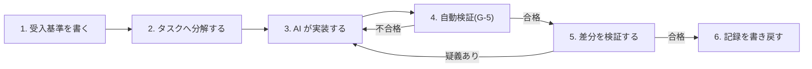

本附属書は、[第5章](/process-compass/phase4-process-design/human-ai-boundary/)が規定する役割境界を、開発者の日々の作業手順へ落としたものです。要求事項の正本は本文各章であり、本附属書は実施の手引きです。

## E.1 作業の重心

AIエージェントが実装を主導する前提では、開発者の作業の重心が移動します。

| 従来の作業 | 本標準での扱い |
| --- | --- |
| 実装コードを1行ずつ記述する | AIエージェントへ委譲する |
| 仕様を作業者の記憶に保持する | 検証可能な受入基準として外部化する |
| 生成された変更を全行読む | 検証の順序に従い、範囲を絞って読む |
| 動作確認を手作業で繰り返す | 自動検証へ移し、人は不合格時の判断に集中する |
| 設計判断を暗黙に処理する | 判断記録(ADR)として残す |

委譲するのは実装であり、判断ではありません。何を作るか、どこまでを正しいとするかを決める作業は移譲の対象になりません。

## E.2 1機能あたりの作業サイクル

工程3と工程4の往復はエージェントが自律的に回します。人が関与するのは工程1・2・5・6です。

## E.3 受入基準を書く

- 受入基準は「条件 + 期待動作」の形式で書く([附属書B](/process-compass/phase4-process-design/ears-guide/))
- 曖昧語(「適切に」「柔軟に」「可能な限り」「〜など」「必要に応じて」「基本的に」)を使用しない
- スコープ外の事項を明記する。書かれていない事項は実装されるか否かが不定になる

**完了の条件を曖昧さなく書けない機能は、書けるところまで分解してからAIへ渡します**。エージェントが停滞する原因の多くは、能力の不足ではなく完了条件の不在です。

AIエージェントに受入基準の草案を生成させてよいものの、生成された基準をそのまま承認してはなりません。基準の確定は価値判断であり、[第5章 5.5](/process-compass/phase4-process-design/human-ai-boundary/)の価値判断に該当します。

## E.4 タスクへ分解する

- 1タスクは、独立レビューが単独で完結できる大きさに収める([第4章 G-4](/process-compass/phase4-process-design/gate-criteria/))
- 各タスクが、どの受入基準に対応するかを明記する
- 依存のないタスクは並列可と明示する

### 分解しすぎない

事前に細かく割り切ると、かえって手戻りが増えます。実行時の状況に応じて構造化する分解のほうが、静的に決め打ちした分解より再試行の費用を抑えたという報告があります(2026年)。**分解は、依存関係と検証の単位が決まる粒度で止めます**。

### 並行して実行する場合

複数のエージェントを同時に走らせる場合、次を満たさなければなりません。

- 作業ツリーを分離する。同一の作業ディレクトリで複数エージェントを並行実行しない
- 共有される設定・登録・経路定義のファイルを、同時に変更する組み合わせを避ける
- 完了後に、同一機能の重複実装が生じていないかを確認する

同一ディレクトリでの並行実行は、ファイルの上書きと版管理の索引破損を即座に引き起こします。

## E.5 差分を検証する

### 検証の順序

**上から順に確認し、不合格が出た時点で以降を見ずに差し戻します**。

| 順 | 見るもの | 確認する内容 |
| --- | --- | --- |
| 1 | 受入基準とテストの対応 | 受入基準ごとに、違反すると失敗するテストが1つ以上存在するか |
| 2 | 外部インタフェースの差分 | API・データ構造・権限・設定の変更が、仕様の範囲に収まっているか |
| 3 | 差分の性質 | 追加か、移動か、複製か。既存の実装を再発明していないか |
| 4 | 実行トレース | エージェントが読んだ範囲と実行した操作に、想定外のものがないか |
| 5 | 実装コード | 順1〜4で疑義が生じた箇所に限定して読む |

### 全行を読むことを求めない理由

エージェントは人間が読める速度を超えて変更を生成します。規模の大きい差分に対する逐行確認は、時間の制約のもとで実質的な承認操作へ縮退します。判断の質は、読んだ行数ではなく確認した観点の数で決まります。

順1〜4は、いずれも確認の範囲が有界です。受入基準の数、外部インタフェースの変更数、実行したツールの数はすべて数え上げられます。順5だけが範囲の定まらない作業であり、だからこそ最後に置き、対象を限定します。

### テストで担保できないもの

テストは、書かれた基準しか守りません。**基準そのものの欠落はテストでは検出できません**。順1で受入基準を数え上げるのは、この欠落を人が確認するためです。

受入基準に現れない性質(性能・セキュリティ・可用性)は、[第4章 G-5](/process-compass/phase4-process-design/gate-criteria/)の機械検査と[フェーズ5(非機能の検証)](/process-compass/phase5-implementation/nonfunctional-verify/)で扱います。

## E.6 実行トレースの確認

エージェントが何を読み、何を実行したかについて、次の事象を検出します。

**検出を目視の作業として行いません**。1回のタスクで数十から数百の操作が実行される環境では、痕跡を遡って探す作業は確認済みの印を付ける操作へ縮退します。検出は、実行時の遮断と差分に対する機械判定へ割り当てます。開発者が確認するのは、遮断が働いた記録と機械判定が付けたラベルに限られます。割り当ての設計は[フェーズ5(エージェントの操作の統制)](/process-compass/phase5-implementation/agent-trace-control/)に規定します。

以下は、検出すべき事象と、検出した場合の扱いです。

| 事象 | 扱い |
| --- | --- |
| 仕様の範囲外のファイルを変更した | 差し戻す |
| 認証情報・秘密情報へ接触した | 差し戻し、影響を確認する |
| 想定していない外部への通信を行った | 差し戻し、影響を確認する |
| 失敗したテストを、テスト側の変更で通過させた | 差し戻す |
| 検証を無効化する設定変更を含めた | 差し戻す |

最後の2項目は必ず確認します。テストを通すためにテストを書き換える変更は、実装の完了ではなく検証の放棄です。この操作は差分の見た目では正常な変更と区別が付きにくく、意識して探さなければ通過します。

基準値そのものの変更(カバレッジ基準の引き下げ、検査の除外設定の追加)は、機能の変更とは別の変更として分離し、技術判断者の承認を得なければなりません。この分離は G-5 の検査で強制します。

なお、上の表の最初の3項目は**起きてから探すのではなく、実行時に拒否します**。書き込み範囲・ネットワーク・コマンドの許可範囲を設定で定め、範囲外を既定で拒否する構成によります。拒否された操作は記録に残り、確認の対象になります。

## E.7 自己修正ループの回し方

自動検証(G-5)の失敗をエージェントへ入力し、修正させる往復には上限を設けます。

- 反復回数の上限を定める(初期値: 3回)
- 上限に達した場合、人が仕様へ戻る。実装の再試行を続けない
- 同じ失敗を3回繰り返す場合、原因は実装ではなく受入基準の不備であることが多い

上限を設けない自己修正ループは、費用を消費しながら同種の失敗を反復します。反復回数と消費した実行費用は記録し、[第7章 7.7.2](/process-compass/phase4-process-design/exception-escalation/)の指標へ算入します。

### 修正の対象からテストを除外する

自己修正ループの書き込み範囲に、テストを含めません。渡された失敗を、テスト側の変更で解消する経路が残るためです。

- 除外は指示ではなく、[エージェントの操作の統制](/process-compass/phase5-implementation/agent-trace-control/)の書き込み範囲の設定による
- テストの修正を要すると判明した場合、ループを終了して人が受入基準へ戻る。ループの内側で続けて行わない
- 除外の解除は人間の操作による。解除した状態での反復は、E.9 の禁止事項3 に該当しうる

E.9 の禁止事項3 と[第5章 5.8.4](/process-compass/phase4-process-design/human-ai-boundary/)は、この経路を禁止と独立性の設計で扱っています。**本項はこれを強制層へ降ろします**。差分からの事後検出だけでは、指摘の確認を省いた運用で層が働きません([第3章 3.11.3](/process-compass/phase4-process-design/roles-responsibilities/))。

## E.8 記録を書き戻す

サイクルの終わりに、次を記録します。

- 設計上の選択を伴った場合は判断記録(ADR)。採らなかった選択肢とその理由を含める
- 受容した妥協・仮実装は技術負債台帳へ
- 恒久層コンテキストに反映すべき規約・用語の変更

採らなかった選択肢を書き残すことは、後任者が同じ検討を繰り返さないための唯一の手段です([第2章 2.9.4](/process-compass/phase4-process-design/lifecycle/))。

## E.9 行ってはならない作業

| # | 禁止事項 | 理由 |
| --- | --- | --- |
| 1 | 受入基準を確定せずに実装を依頼する | 何をもって完了とするかが不定になる |
| 2 | AIが生成した受入基準をそのまま承認する | 価値判断を委譲したことになる |
| 3 | テストの失敗を、テスト側の変更で解消する | 検証の放棄であり、実装の完了ではない |
| 4 | 差分を確認せずに承認する | 独立レビューの前提が崩れる |
| 5 | 独立レビューの挙動要約を、AIに生成させる | 要約は理解の証拠であり、生成物は証拠にならない |

禁止事項5は、形骸化の防止手段そのものを無効化する操作です。挙動要約は文書の体裁を整えるための欄ではなく、承認者が対象を理解したことの記録です。

## E.10 認知負荷の管理

- 1つのタスクは1つの変更単位に対応させる。複数の関心事を1つの変更へ混ぜない
- レビューに要した時間と変更規模の比を継続して計測する([第4章](/process-compass/phase4-process-design/gate-criteria/))
- 判断の対象が大きくなったと感じた時点で、分割して差し戻す

判断の質を保つ最も確実な方法は、1回の判断対象を小さくすることです。承認者の人数を増やしても、この効果は代替できません。

## E.11 関連する章

- 役割境界と自律レベルは[第5章](/process-compass/phase4-process-design/human-ai-boundary/)に規定する
- 受入基準の記法は[附属書B](/process-compass/phase4-process-design/ears-guide/)に規定する
- 独立レビューの実施手順は[附属書C](/process-compass/phase4-process-design/review-guide/)に規定する
- 変更単位の運用は[フェーズ5(PR 運用リファレンス)](/process-compass/phase5-implementation/pr-workflow/)に規定する
