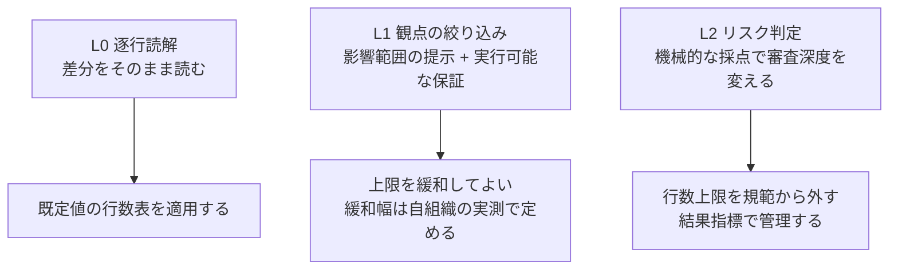

本章は、本標準が置く8つの工程ゲートについて、運用に載せられる粒度まで判定基準を規定します。各ゲートの判定は、このページのチェックリストとの突合で行います。

ゲートの識別子・順序・成果物との関係は、[ピットイン方式参照モデル](/process-compass/phase4-process-design/process-model/)(本標準の構造の機械可読表現)が保持します。本章はその判定基準の正本です([ADR-0010](/process-compass/adr/0010-data-doc-interface/))。

## ゲートの2系統

本標準のゲートは2系統に分かれます。本章が規定するのは工程ゲート(G-1〜G-8)です。

| 系統 | 記号 | 判断の対象 | 規定する章 |
| --- | --- | --- | --- |
| ステージ移行ゲート | SG-0〜SG-2 | 投資を継続するか、次ステージへ進むか | [第2章](/process-compass/phase4-process-design/lifecycle/) |
| 工程ゲート | G-1〜G-8 | この成果物を次工程へ進めてよいか | 本章 |

各事業ステージで有効化する工程ゲートの組は、[第2章 2.5](/process-compass/phase4-process-design/lifecycle/)に規定します。

## 前提条件と判定基準の区別

ゲートは2種類の条件を持ちます。両者を混同してはなりません。

| 区分 | 定義 | 満たさない場合 |
| --- | --- | --- |
| 前提条件 | 判定を開始するために整っていなければならない状態 | 判定を開始せず、提出者へ差し戻す |
| 判定基準 | 判定において合否を評価する基準 | 判定の結果として差し戻す |

前提条件を判定基準に含めると、他の基準の評価と相殺されて通過します。前提条件は機械的に検査し、人の判断を介在させません。

## 全ゲートに共通する通過条件

各ゲートの判定基準に加えて、次を全ゲートの通過条件とします。**新しいゲートは設けません**。

> 当該の工程に関係する前提の充足状態が台帳に記録されており、AC-1 以上のものについて受容の決裁が取られていること

前提の一覧は[理想モデルの前提条件一覧](/process-compass/phase2-aidlc/assumptions/)、手続は[第7章 7.10](/process-compass/phase4-process-design/exception-escalation/)、様式は[第6章 テンプレ10](/process-compass/phase4-process-design/deliverable-templates/)によります。

**前提が崩れていることを理由に判定を停止しません**。可視化し、受容の決裁を求めます。停止する設計は申告そのものを止め、測定を無効にします。

## ゲート運用の共通ルール

すべてのゲートに共通する運用原則です(設計原則の実装)。

1. **単独判定**: 判定者は1人。関係者の意見は判定前の**非同期コメント期間**(公開された期限まで)に集め、判定会議は開かない
2. **期限付き**: 各ゲートに判定期限を設ける。期限超過は「自動承認」にはせず、**エスカレーション**(判定者の上位への通知と代理判定者の指名)とする
3. **差し戻しは理由付き**: 差し戻す場合、どの基準を満たさないかをチェックリストの項目番号で示す。「なんとなく不安」での差し戻しを認めない
4. **記録をもって成立する**: 判定結果・判定者・日時・差し戻し理由を判定記録へ書く。**記録の作成が判定の成立要件である**(次節)

## 判定の成立

工程ゲートの判定は、**判定記録の作成をもって成立します**([第6章 テンプレ4](/process-compass/phase4-process-design/deliverable-templates/))。記録の無い状態は、判定基準がすべて充足していても**未判定**です。

<!-- impl IMPL-0008 target=gate-record-template state=delivered note="判定記録の作成をもって判定が成立する" -->

判定の成立要件と、成立に伴う事務を混同してはなりません。

| 区分 | 該当するもの |
| --- | --- |
| 判定の成立要件 | 判定記録の作成。判定者・判定日時・結果・確認した項目・差し戻し理由が埋まっていること |
| 成立に伴う事務 | Issue のクローズ、PR のマージ、[状態ラベル](/process-compass/phase5-implementation/label-mailbox/)の遷移、関係者への通知 |

記録を判定の成立要件に置く理由は、**記録がなければ判定の存在そのものが自己申告になる**ためです。判定材料が揃い、レビューが済み、課題が閉じられた状態は、判定が行われた証拠になりません。判定の有無を後から確かめられる痕跡は記録だけです([ADR-0036](/process-compass/adr/0036-gate-closure-by-record/))。

事務を成立要件に置かない理由は、案件の課題管理ツールに依存するためです。ツールを変えると判定の成立要件が変わる構成にしてはなりません。

**記録を書かないまま次工程へ進んだ場合は、判定の時点を事後へ移した委任の変更を除き、未判定のまま進んだものとして扱います**。[第7章 7.3](/process-compass/phase4-process-design/exception-escalation/)の例外承認を経ていないため、逸脱にあたります。出荷判定(G-7)における判定記録の完備確認で検出します。

独立レビュー(G-6)の判定を事後へ移した委任の変更は、人の事前確認を経ていない変更として、変更単位で識別された記録を持ちます([第5章 5.5.4](/process-compass/phase4-process-design/human-ai-boundary/)の条件7)。この記録を持つ変更は、判定の時点が事後へ移った変更であり、逸脱として扱いません。識別の記録を持たない変更は、委任の範囲に当たる変更であっても逸脱です。開発者の席だけが委任で、G-6 を事前に判定した変更は、G-6 の判定記録を持ちます。

## 工程ゲートの判定の語彙

工程ゲートの判定は、次の2値のいずれかです。

<!-- impl IMPL-0009 target=gate-record-template state=delivered note="工程ゲートの判定の語彙を通過と差し戻しの2値に限る" -->

| 判定 | 意味 | 判定と同時に確定させる事項 |
| --- | --- | --- |
| 通過 | この成果物を次工程へ進めてよい | なし。次工程の資源配分は工程ゲートの判断対象ではない |
| 差し戻し | この成果物を次工程へ進めない | 満たさない判定基準の項目番号、再提出の期限 |

**中止と保留を用いません**。工程ゲートの問いは「この成果物を次工程へ進めてよいか」だけです。投資を継続するかどうかはステージ移行ゲート(SG)が判断します([第2章 2.4](/process-compass/phase4-process-design/lifecycle/))。

:::note
[第3章 3.7.3](/process-compass/phase4-process-design/roles-responsibilities/)の4値(継続 / 中止 / 保留 / 差し戻し)は**会議体の語彙であり、工程ゲートへ適用しません**。工程ゲートは会議体ではなく、判定者1人による単独判定だからです。同章 3.7.4 の B-2 ステアリングコミッティも、決定しない事項として工程ゲートの判定を挙げています。
:::

**「条件付き通過」を設けません**。条件を付して先へ進める手続は[第7章 7.3](/process-compass/phase4-process-design/exception-escalation/)の例外承認です。回収の期限と回収責任者を伴わない通過の経路を作らないためです(ADR-0036 決定3)。

## 判定の範囲

判定者が評価するのは、**当該ゲートの判定基準と、全ゲート共通の通過条件だけです**。

<!-- impl IMPL-0010 target=gate-skill state=delivered note="判定は当該ゲートの判定基準のみで行い次工程の材料の未完成を理由にしない" -->

次のものを判定へ持ち込んではなりません。

| 持ち込んではならないもの | 扱う場所 |
| --- | --- |
| 次工程で作る成果物の未完成 | 次工程のゲート |
| 当該ゲートの判定基準に無い懸念 | 判定前の非同期コメント期間。基準に加えるなら本章の改訂 |
| 投資を続けるかどうか | ステージ移行ゲート([第2章 2.4](/process-compass/phase4-process-design/lifecycle/)) |
| 判定者の所属組織の内規 | テーラリング([第8章](/process-compass/phase4-process-design/tailoring-guide/)) |

基準を満たしているにもかかわらず、次工程の材料が揃っていないことを理由に判定を保留すると、**工程は止まり、その停止はどの記録にも残りません**。判定基準を満たさないまま進める必要がある場合に限り、7.3 の例外承認を用います。

## 各ゲートの判定チェックリスト

### G-1 企画承認(事業決裁者・既存規程どおり)

**前提条件**(満たさない場合、審議を開始しない):

| # | 前提条件 | 確認方法 |
| --- | --- | --- |
| 1 | 意思決定・エスカレーション体制図(D-0)が承認済みである | 承認者と承認日時の記録([第2章 2.8](/process-compass/phase4-process-design/lifecycle/)) |

判定基準:

| # | 判定基準 | 確認方法 |
| --- | --- | --- |
| 1 | 投資対効果が事業基準を満たす | 企画書の効果試算と社内基準の突合。算定根拠・参照した過去案件・効果が出ない条件の3欄が埋まっていること |
| 2 | リスクと受容方針が明示されている | 企画書のリスク欄。区分・顕在化しうる時期・方針・判断者が埋まっていること。AI 利用に伴うリスクを1行以上含むこと |
| 3 | コンテキスト基盤の初期整備コストが予算に含まれる | 予算内訳(明文化コストの予算化) |
| 4 | 指標の閾値と予算区分が合意され記録されている | 安定性指標、エスカレーション閾値([第7章 7.6](/process-compass/phase4-process-design/exception-escalation/))、予算の4区分([第7章 7.7](/process-compass/phase4-process-design/exception-escalation/)) |

**戦略整合と自社が勝てる理由の欄が空である企画書は、基準1の判定へ進みません**。案件を始める理由を書かないまま、費用と効果の数字だけで判定する経路を作らないためです。欄の空白は機械的に検査します(記述の内容は機械が判定しません。[第5章 5.7.4](/process-compass/phase4-process-design/human-ai-boundary/))。

企画で評価する6観点と様式は[第6章 テンプレ6](/process-compass/phase4-process-design/deliverable-templates/)に規定します。

期限: 既存の稟議運用どおり(このゲートは低頻度のため既存の速度を許容する)。

### G-2 要件合意(価値責任者・48時間)

| # | 判定基準 | 確認方法 |
| --- | --- | --- |
| 1 | 受入基準が検証可能な形式で書かれている | 「条件+期待動作」形式([EARS 記法ガイド](/process-compass/phase4-process-design/ears-guide/))への準拠 |
| 2 | 曖昧語が残っていない | 禁止語リストとの突合(下記) |
| 3 | 暗黙の前提が案件層コンテキストに登録済み | コンテキスト基盤の案件層の差分確認 |
| 4 | スコープ外事項が明記されている | 仕様書の「やらないこと」欄 |
| 5 | 合意した範囲がスコープ3層へ割り当てられている | SC-M・SC-P・SC-B の別が記入されていること([第2章 2.10.1](/process-compass/phase4-process-design/lifecycle/)) |

基準5で合意した範囲が、G-4 における範囲内外の判定の基準になります。**G-2 で層を割り当てていない案件では、G-4 の判定が成立しません**。

基準1の確認では、**企画書 観点3(受益者と価値)に書いた価値のうち、受入基準へ対応するものが1件も無い項目が残っていないか**を併せて確認します。**受入基準の内容そのものは判定しません**。対応の有無だけを見ます。

**本標準は、成果物の使いやすさ・学びやすさを判定基準としません**。理由と限界は[ADR-0051](/process-compass/adr/0051-usability-out-of-scope/)によります。

**曖昧語の禁止リスト(初期値)**: 「適切に」「柔軟に」「可能な限り」「〜など」「必要に応じて」「基本的に」。これらは受入基準に使用不可とし、AI によるチェックを CI に組み込みます(フェーズ5)。

### G-3 技術設計判断(技術判断者・48時間)

| # | 判定基準 | 確認方法 |
| --- | --- | --- |
| 1 | 非機能要件の充足見込みが示されている | 設計案の非機能欄(性能・可用性・セキュリティ) |
| 2 | 既存資産・コンテキスト基盤と整合している | 恒久層(設計標準)との突合 |
| 3 | 選択の可逆性が評価されている | ADR の「戻せない選択」欄の記載 |
| 4 | 代替案が最低1つ比較されている | ADR の比較表 |
| 5 | 事業影響が観測可能な事象で記述されている | ADR の事業影響欄5項目([第6章 テンプレ2](/process-compass/phase4-process-design/deliverable-templates/))に空欄がないこと |

#### 事業影響を金額で定量化しない

**事業影響の記載に、金額での定量化を義務づけません**。復旧の費用や賠償の見積りは、置いた前提によって桁が変わります。義務づければ、**精度を装った数字が決裁を通ります**。金額を書くことは禁じませんが、書く場合は算定根拠・参照した過去案件・その額にならない条件の3点を併記します([第6章 テンプレ6](/process-compass/phase4-process-design/deliverable-templates/)と同じ作法)。

**発生確率と影響度の格付けを掛け合わせた順位づけを、判定の根拠にしてはなりません**。リスクマトリクスの数学的性質を分析した研究(2008年)は、**量的に小さいリスクへ高い定性評価を与えうること**、発生頻度と深刻度が負に相関する場合には無作為な判断より悪くなりうること、無作為に選んだ危険源の対のうち正しく明確に比較できるのは1割に満たないことを報告しています。

:::note
リスク区分 R1〜R3([第3章 3.8.1](/process-compass/phase4-process-design/roles-responsibilities/))は、格付けの掛け合わせではなく**該当条件による判定**であるため、上記の批判の対象になりません。事業影響の記述でも、取り消しの可否は R の軸を流用します。
:::

記述は[第4章の重大度](#欠陥トリアージ基準)と同じ作法をとります。**観測可能な事象で書き、主観的な深刻さの表現を用いません**。

#### 記載の検査

記述の質を機械判定して承認可否を決めてはなりません([第5章 5.7.4](/process-compass/phase4-process-design/human-ai-boundary/))。機械が検査してよいのは形式的な欠落です。

| 検査の対象 | 機械 | 人間 |
| --- | --- | --- |
| 欄が空である | 検査する | — |
| 「回復に要する時間」が幅ではなく単一の値である | 検査する | — |
| 「顕在化が分かる兆候」が「なし」と記載されている | 検査する | — |
| 前の判断記録と記述が一致している | 検査する | — |
| 記述の内容が妥当である | しない | 判定する |

「顕在化が分かる兆候」に「なし」を認めない作法は、決断の記録における「確認していない事項」と同じものです。

#### 事業決裁者が受容を拒否した場合

差し戻し先を3つに分けます。**新しい経路を設けません**。

| 拒否の理由 | 差し戻し先 |
| --- | --- |
| 別の技術的選択で回避しうる | **G-3 へ差し戻す**(代替案の再検討。基準4) |
| どの技術的選択でも受容できない | **G-2 へ差し戻す**。要件そのものが実現不能である |
| 案件の前提が崩れている | **中止の判断へ上程する**([第7章 7.7.3](/process-compass/phase4-process-design/exception-escalation/)) |

**「受容できないが進める」を通常の経路として認めません**。認める場合は[第7章 7.3](/process-compass/phase4-process-design/exception-escalation/)の例外承認によります。

### G-4 機能仕様承認(価値責任者または委譲先・24時間)

| # | 判定基準 | 確認方法 |
| --- | --- | --- |
| 1 | 機能仕様に検証可能な受入基準が含まれる | G-2 と同じ形式チェック |
| 2 | タスク分解の粒度が1タスク=1レビュー単位 | 実装計画のタスク一覧(1タスクのPRが独立レビュー可能なサイズ) |
| 3 | 対象機能のコア/非コア指定が明示されている | 機能一覧のコア指定欄 |
| 4 | 各タスクの規模が分割基準の範囲内である | 下記「タスクの分割基準」との突合 |
| 5 | 合意した範囲の内か外かの判定が記入されている | 判定欄に SC-M / SC-P / SC-B / 範囲外 のいずれかが記入されていること。**空欄の場合、判定を開始しない** |

#### 範囲内外の判定を機械が行わない理由

基準5について、**機械が判定してよいのは記入の有無だけです**。範囲の内か外かの判断そのものを機械に委ねてはなりません。

自動生成した要求トレーサビリティ行列を人手で検証させた実験(2010年)では、初期の精度が低い候補を与えられた分析者は品質を大きく改善した一方、**初期の精度が高い候補を与えられた分析者は品質を下げました**。分析者の最終結果は、初期状態によらず一点へ収束する傾向を示しています。機械の出力を人が追認する構成は、人の判断を機械の出力へ引き寄せます。

この結論は、記述の質を機械判定して承認可否を自動決定しないという[第5章 5.7.4](/process-compass/phase4-process-design/human-ai-boundary/)の原則と同じものです。AI エージェントは判定の**草案**を作成できます。確定は判定者が行います。

#### 範囲外と判定した場合

内側のループを止めません。影響の範囲に応じて経路を分けます。手続は[第2章 2.10.8](/process-compass/phase4-process-design/lifecycle/)に規定します。

判定の総数は増えません。基準5は G-4 の記載事項であり、独立した判定を追加するものではありません。あわせて[第7章 7.6](/process-compass/phase4-process-design/exception-escalation/)のスコープに関する発火条件を確約範囲(SC-M)の変動へ限定したため、**通常運転で発生する報告の件数は減ります**。

### G-5 自動検証 CI(機械判定・即時)

| # | 判定基準 | 初期値 |
| --- | --- | --- |
| 1 | 全テストが GREEN | 例外なし |
| 2 | 静的解析・脆弱性スキャンの重大指摘 | Critical / High = 0 件(Medium 以下は台帳記録で通過可) |
| 3 | テストカバレッジ | 企画時に設定した基準値以上(目安: 新規コード 80%。数値は組織で調整) |
| 4 | 曖昧語チェック(仕様変更を含むPRの場合) | 禁止語 0 件 |
| 5 | 依存関係のライセンス検査 | 禁止ライセンスの検出 0 件。ライセンスを判定できない依存 0 件(台帳へ記録すれば通過可) |
| 6 | 文脈ファイルの形式検査 | リポジトリ内の参照切れ 0 件。1ファイルの分量の上限超過 0 件([第3章 3.11.4](/process-compass/phase4-process-design/roles-responsibilities/)) |
| 7 | 秘匿情報の混入検査 | 検出 0 件。**台帳への記録による通過を認めない** |
| 8 | 依存関係の追加・更新の識別 | 追加・更新がある場合、その一覧が PR の記述に機械的に出力されている |

**基準6にコードと文脈の乖離を含めません**。乖離の判定は対応関係の推定を含み、実効的な偽陽性が生じます。**落とすと、内容のない形式的な更新が入ります**。乖離は記録し、四半期の棚卸しで扱います(手続は[コンテキスト基盤](/process-compass/phase5-implementation/context-base/))。

このゲートの原則は「**合意済みルールはすべて機械化して載せる**」です。人間のレビューで毎回指摘していることがあれば、それはこのゲートへ移す候補です。

#### 検査対象が存在しない場合の扱い

本標準では、実装の開始は G-4 の通過後です。したがって案件の最初の数件の変更は文書のみになり、テスト・静的解析・カバレッジ・ライセンス検査は検査の対象そのものを持ちません。この局面でも、**判定基準は8つのまま変えません**。段階やステージで基準の数が変わると、どの段階のどの基準によって通過したのかを後から追えなくなります。

検査の対象が存在しない基準は、「対象なし」として証跡へ記録したうえで通過させます。**通過の根拠は、検査の結果が0件であったことではなく、対象が存在しない事実を記録したことです**。0件の合格として残すと、実施していない検査を実施したという記録が残ります。

| 基準 | 「対象なし」による通過 | 理由 |
| --- | --- | --- |
| 1 全テストが GREEN | 認める | 実装が存在しない段階では、実行するテストを持たない |
| 2 静的解析・脆弱性スキャン | 認める | 解析の対象となるコードが存在しない |
| 3 テストカバレッジ | 認める | 測定の対象となるコードが存在しない |
| 4 曖昧語チェック | 用いない | 適用の有無は基準表の「仕様変更を含むPRの場合」という条件で決まる。条件に当たる変更では、文書の側に対象が存在する |
| 5 依存関係のライセンス検査 | 認める | 依存関係を追加していない段階では、検査する部品が存在しない |
| 6 文脈ファイルの形式検査 | **認めない** | 文書のみの変更では、むしろ文脈ファイルが主たる変更対象になる |
| 7 秘匿情報の混入検査 | **認めない** | リポジトリ全体が常に対象である。実装がなくても対象は存在する |
| 8 依存関係の追加・更新の識別 | 認める | 追加も更新もない場合、出力すべき一覧が存在しない |

基準7の「**台帳への記録による通過を認めない**」は、この局面でも動きません。資格情報は文書へも混入します。基準4は「対象なし」の扱いを用いません。条件に当たらない変更では基準表の条件によって適用の対象から外れ、条件に当たる変更では検査すべき文書が存在するためです。

「対象なし」の記録には、次の項目を含めます。

- 対象なしとして通過させた基準の識別
- 対象が存在しない理由
- 判定の時刻

**実装が存在する段階で、この扱いを用いてはなりません**。テストコードがあるにもかかわらず0件で通過する経路を作らないためです。実装の開始後に「対象なし」の記録が現れた場合、それは検査の不備を示します。

「対象なし」は、未達および省略のいずれとも異なります。

| 状態 | 意味 |
| --- | --- |
| 未達 | 目的を達成する構成を示せていない状態 |
| 省略 | 適用しないと決めた状態 |
| 対象なし | 適用しているが、現時点で対象が存在しない状態 |

未達と省略の区別は[ADR-0028](/process-compass/adr/0028-unmet-gate-distinct-from-omitted/)に規定します。「対象なし」をこの2区分へ加えません。G-5 の証跡が持つ属性として扱います。

#### 知財潔白性の検査

**成果物へ他者の著作物が混入していないことの検査を、AI の利用の有無で変えてはなりません**。人が書いた場合にも混入は起こります。要求は全件へ一律に適用します。

検査の対象は2つに分かれます。**同じ「知財チェック」として扱ってはなりません**。

| 対象 | 調べること | 本標準における扱い |
| --- | --- | --- |
| 依存関係のライセンス | 取り込んだ部品のライセンスと、その条件(表示義務、派生物の開示義務など) | **合否条件**(基準5) |
| 生成物と既存の著作物の類似 | 出力が既存の表現と一致または高度に類似するか | **合否条件にしない**。実施と結果を記録し、出荷判定(G-7)のエビデンスとする |

類似の検知を合否条件にしてはならない理由は3つあります。

- 検知は完全でない。検出されなかったことは、混入がないことの証明にならない
- 合否条件にすると、**検出されなかったという結果が「潔白である」という記録として残る**。後述の推認に対して、この記録は防御にならない
- 検知の機能は事業者が提供するものであり、位置づけが変わる。2026-04-03 に、ある事業者の知財補償において複製検知機能の利用が要件から外れた実例がある

:::danger
**「AI が生成したので既存の著作物を知らなかった」は抗弁になりません**。日本の著作権法における侵害の要件は**類似性と依拠性**であり、生成 AI の学習段階に当該の著作物が含まれていた場合、利用者が認識していなくても**通常は依拠性が推認される**とされています(文化審議会 著作権分科会の法制度に関する小委員会「AIと著作権に関する考え方について」、令和6年)。

したがって、**利用者の側で制御できるのは類似性の側と、講じた措置の記録だけです**。
:::

:::caution
上記の「考え方」は**法的な拘束力を持ちません**。同資料自身が、公表時点における小委員会としての一定の考え方であり、確定的な法的評価をするものではないと明記しています。**本標準は「著作権法に準拠する」とは書きません**。規定するのは、侵害が主張された場合に提示できる記録を残す手続です。
:::

検査の実装は[フェーズ5(CI/CD ゲート)](/process-compass/phase5-implementation/ci-gates/)に規定します。**判定の場は増えません**。基準5は機械判定であり、判定者の帯域を消費しません。

#### 類似が検知された場合の措置

合否条件にしないことと、**検知を未処理のまま先へ進めてよいこと**は別です。本標準は後者を認めません。検知が出た箇所は、当該の変更単位の中で処理します。

| 選択肢 | 内容 |
| --- | --- |
| 書き直す | 当該箇所を別の表現へ置き換える |
| 許諾の条件を満たす | 出典とライセンスを特定し、表示義務などの条件を満たした形で取り込む |
| 取り除く | 当該の機能ごと落とす |

当該の変更単位で処理を完了できない場合に限り、台帳へ記録して先へ進めます。記録には期限を付します。**期限のない記録を認めません**。

出荷判定(G-7)の基準8が見るのは記録の欠落ですが、**期限を超過した未処理項目が残る場合、出荷を止めます**。持ち越すのは判定であって、対処ではありません。

書き直した結果を、潔白が確認された記録として残しません。残せるのは、検知に対して措置を講じた事実だけです。**再検査で検出されなくなったことを、混入がないことの根拠として提示してはなりません**。前掲のとおり、検出されなかったことは証明になりません。

#### 法的な評価を本標準が示さない理由

本節は手続を規定します。個々の検知が権利侵害に当たるかどうかの評価は含みません。評価の担い手は法務です。**開発ラインの判定者へ法的評価を求めてはなりません**。判定者に求めるのは、定めた措置を採ったかどうかの確認だけです。

「検知が出たまま先へ進めた履歴が残る」ことへの懸念には、前段の措置が答えになります。残るのは未処理の検知ではなく、**検知ごとに、いつどの措置を採ったかの記録**です。措置を規定しない運用のほうが、説明の材料を失います。

#### 秘匿情報の混入(基準7)

他の基準と違い、基準7は**台帳への記録による通過を認めません**。混入した資格情報は履歴に残り、削除するコミットを重ねても履歴からは消えないためです。是正は当該資格情報の無効化と再発行によります。

検出した場合の手順は次のとおりです。

| # | 手続 |
| --- | --- |
| 1 | 当該の資格情報を無効化する。**コードの修正より先に行う** |
| 2 | 無効化の完了を確認したうえで、参照方法を秘匿情報の管理機構へ置き換える |
| 3 | 履歴に残った値を、無効化済みの値として台帳へ記録する |

**検出されなかったことは、混入がないことの証明になりません**。検査は既知の様式に一致する文字列を見つける手続であり、独自の様式を持つ資格情報は捕捉できません。この点は類似の検知と同じ構造です。

#### 依存関係の追加(基準8)

依存の追加は、差分の行数に対して影響が非対称です。1行の追加で、外部の任意のコードが実行対象へ入ります。**逐行の読解では捕捉されにくく、規模を基準にした審査深度の調整とも整合しません**。

基準8が求めるのは、追加・更新の一覧を機械的に出力させることだけです。ライセンスの適合そのものは基準5で機械判定します。**人間が確認するのは「その依存を追加する必要があるか」であり、ライセンスの読解ではありません**。この確認は G-6 の判定に含めます。

AI が追加した依存と人間が追加した依存を、扱いの上で区別しません。区別すると、申告の有無が検査の範囲を決めることになります。エージェントに与えるツールと権限の統治は[第3章 3.11.6](/process-compass/phase4-process-design/roles-responsibilities/)によります。

#### 許可リストが判定を妨げた場合の救済

基準5の許可リストに存在しないライセンスが現れた場合、開発は停止します。停止したまま放置すると、検査を迂回する運用が生まれます。次の手続を置きます。

| # | 手続 | 担い手 |
| --- | --- | --- |
| 1 | 当該ライセンスと利用形態(静的結合・動的結合・改変の有無)を記載して申請する | 起案者 |
| 2 | 期限を付した暫定の許可を判断する | 法務またはその委任先 |
| 3 | 期限内に恒久の可否を判断し、許可リストへ反映する | 同上 |

- 暫定の許可には**必ず期限を付す**。期限のない暫定は恒久の許可と区別できない
- 恒久の追加を、技術判断者および AI維持管理者の裁量で行わない。許可リストは法務の所管である
- 期限を超過した暫定の許可は失効させる。失効後は基準5で再び停止する

### G-6 独立レビュー(独立レビュア・応答1営業日 / 判定2営業日)

| # | 判定基準 | 確認方法 |
| --- | --- | --- |
| 1 | 仕様(受入基準)と実装が一致している | 受入基準の項目ごとに挙動を確認 |
| 2 | レビュアが挙動を自分の言葉で説明できる | 承認コメントに1〜2文の挙動要約を必須記載 |
| 3 | (コア機能のみ)設計意図の記録が完備 | ADR・判断記録の添付確認 |
| 4 | レビュアが作成の指示者本人でない | 作成者本人の承認は、ブランチ保護で機械強制。作成者が AI・bot の変更は、出荷の証跡の集約で確認(下記) |
| 5 | (依存の追加・更新を含む場合)追加の必要性を確認した | G-5 基準8の出力に対する確認の記載 |

基準2の「挙動要約の必須記載」は、見ずに承認する状態の抑止装置です。要約が書けない承認は差し戻し扱いにします。

基準4 は、人の単位で判定します。2名体制では、作成を指示していない側の人が確認すれば、基準4 を満たします。相手も作成の指示に関与した変更と、1名体制では、外部の確認者を要します。置けなければ、このゲートは未達です([第3章 3.5](/process-compass/phase4-process-design/roles-responsibilities/))。

**基準4 を、ブランチ保護だけでは強制できません**。ブランチ保護が止めるのは、変更の作成者本人による承認です。変更の作成者が AI または bot である場合、リポジトリの上では、作成を指示した者は作成者ではありません。ブランチ保護は、指示した者の承認を止めません。この承認を止めるのは、出荷の証跡の集約です。下表の条件2 で数えず、後掲 G-7 の基準5 で差し戻します。

承認を**独立した人の確認**に数えるのは、次の条件をすべて満たす場合に限ります。承認の操作があったことだけでは数えません。

| # | 条件 | 満たさない承認の扱い |
| --- | --- | --- |
| 1 | 承認した者が、D-0 体制図の表5 に記載した人(外部の確認者を含む)へ対応づく | 数えない。「承認者を名簿と対応づけられない」として、独立した人の確認を経ていない変更に計上する |
| 2 | その人が、当該の変更の作成を指示した者でない | 数えない。2名体制で2人とも指示に関与した変更は、相互の承認では成立しない |
| 3 | このゲートが未達の体制では、承認した人が外部の確認者である | 数えない。未達の体制の内側の人による承認は、独立した人の確認に当たらない |
| 4 | 承認した者自身の書いた挙動要約を、承認に伴っている(基準2) | 数えない。「レビュアの挙動要約が無い」として、独立した人の確認を経ていない変更に計上する。作成側が書く検証の記載は、挙動要約に数えない |

- 承認は、承認者ごとの最後の状態で数える。承認の後に同じ人が変更要求を出した場合、取り下げられた承認は数えない
- 作成を指示した者は、変更ごとに記録する。複数いる場合は全員を書く
- 記録が無い変更は、変更の作成者と、開発者の席の責任者を、作成を指示した者とみなす。みなした旨を保証の開示へ表示する
- AI と bot の名義による承認は数えない(第3章 3.5.4)
- 独立した人の確認を経ていない変更が1件でもあれば、保証の開示へ定型の文を出す(後掲 G-7「保証の開示」)
- 独立した人の確認を経ていない変更の扱いは、体制によって分かれる。このゲートを適用する体制では、記録の欠落として差し戻す。このゲートが未達の体制では、件数として開示する(後掲 G-7 の基準5 の表)
- **表5 の記載が正しいかは、機械で確かめない**。実在しない確認者を書く形は、この条件では止まらない。[プロセス内部監査](/process-compass/phase6-operation/process-audit/)の観点6 で確かめる

このゲートの検出能力は、意図的に混入させた欠陥の検出率によって継続的に測定します。手続は[第5章 5.6.2](/process-compass/phase4-process-design/human-ai-boundary/)に規定します。測定の対象は工程であり、個人ではありません。

期限の運用は下記「レビュー SLA と滞留の措置」に規定します。

安全関連ソフトウェアを含む変更では、このゲートに加えて**独立した安全性の評価を重ねます**。既存のゲートへ吸収してはなりません。評価者は実装の責任者から組織的に独立している必要があり、独立レビュアとは要件が異なるためです。手順は[附属書F](/process-compass/phase4-process-design/safety-verification/)によります。

#### 委任の変更は判定の時点を事後へ移す(適用: CL0・R3 の変更)

[第5章 5.5.4](/process-compass/phase4-process-design/human-ai-boundary/)の7条件をすべて満たし、独立レビュアの席が委任を宣言している変更は、このゲートの判定の時点を、リリース後の抜き取りへ移せます。**判定の省略ではありません。判定の主体も移りません**。判定者は、独立レビュアの席の責任者のままです。

| 項目 | 規定 |
| --- | --- |
| 対象 | 標準変更カタログ([第3章 3.7.4](/process-compass/phase4-process-design/roles-responsibilities/))に登録した変更種別に当たり、7条件をすべて満たす変更 |
| 判定の時点を移せる場合 | 次の3つをすべて満たす場合に限る。独立レビュアの席が委任を宣言している。変更が、その席の機械の規則に該当する。変更のリスク区分が R3 である。**開発者の席の規則にだけ該当する変更は、事後へ移さない**。このゲートを事前に判定する。事前に判定し、前掲の条件を満たす承認を得た変更は、独立した人の確認を経た変更に数える。人の事前確認を経ていない変更に数えない |
| 判定基準 | 基準1〜5 を変えない。移るのは、基準を評価する時点と対象範囲である。抜き取った変更には、基準1〜5 を当てる |
| 事前に置く AI の確認 | 検出の層として置いてよい。承認として扱わず、合否条件にも用いない。基準4 の充足に数えない |
| 事後の抜き取り | 独立レビュアの席の責任者が行う。作成を指示した者と別の自然人とする。頻度・抜き取り数・確認すること・記録は、[第8章「事後監査の手続」](/process-compass/phase4-process-design/tailoring-guide/)による。**別の手続を設けない** |
| 抜き取りの実施者を、作成を指示した者と別の人にできないとき | 独立レビュアの席の責任者本人が抜き取り、その旨を保証の開示へ表示する。本人による抜き取りを、独立した確認として数えない |
| 逸脱を検知したとき | 該当範囲を協働へ引き下げ、事前の判定へ戻す(第5章 5.5.7) |
| 判定の時点を移す変更で、開発者の席が協働である場合 | 開発者の席の人による検証が、変更ごとに要る(第5章 5.5.4・5.5.6)。判定の時点が事後へ移っても、この検証は省けない |
| 委任の識別を持つ変更が R3 でない場合 | 委任の範囲の逸脱として扱う。記録の欠落として差し戻す(後掲 G-7 の基準5) |
| 記録 | 判定の時点を事後へ移した変更は、このゲートを通過した変更として記録しない。人の事前確認を経ていない変更として、変更単位で識別できる形で残す |
| G-7 と G-8 | 個別の変更ごとには行わない。登録時の事前承認と、期間ごとの保証の開示への計上で扱う(第5章 5.5.4)。期間ごとの保証の開示にも、出荷判定者の突合と記名、事業決裁者の受容の記名、出荷判定者の異議の記載を要する(後掲 G-8) |
| 開示 | 期間ごとの件数を、保証の開示(G-7 基準9)へ載せる |

<!-- impl IMPL-0027 target=gate-skill-g6 state=delivered note="G-6 の判定を事後へ移した変更を G-6 の通過として記録せず、人の事前確認を経ていない変更として変更単位で識別する。開発者の席だけが委任で、独立レビュアが事前に承認した変更は G-6 の承認の記録を持ち、委任の識別を別に残す" -->

委任は、このゲートの未達を解消しません。作成を指示した者以外の確認者を置けない変更は、委任を宣言しても未達のまま表示します([ADR-0028](/process-compass/adr/0028-unmet-gate-distinct-from-omitted/))。

#### 未達のまま出荷する場合の例外承認(適用: R1 の変更)

作成を指示した者以外の確認者を置けず、このゲートが未達の変更は、未達を表示したうえで出荷します。ただし **R1 の変更を未達のまま出荷する場合は、[第7章 7.3](/process-compass/phase4-process-design/exception-escalation/)の例外承認を要します**。

- R1 は、事後の取り消しを前提にできない([第3章 3.8.1](/process-compass/phase4-process-design/roles-responsibilities/))。事後に検出して取り消すという前提が成立しない
- リスク区分は変更ごとに判定する。案件の属性から、この要求の適用外を導かない([ADR-0039](/process-compass/adr/0039-scope-in-heading-and-unit-of-judgement/))
- 例外承認は未達を解消しない。未達の表示と、保証の開示への記載は残る

外部の確認者を R1 の変更へ集中させる調整は、[第8章 軸A](/process-compass/phase4-process-design/tailoring-guide/)によります。

:::caution[暫定 EV-0051 / 見直し 2027-03]
**対象**: R1 の変更を G-6 未達のまま出荷する場合に、7.3 の例外承認を課すという判断。
**根拠の水準**: E1(間接)。
**差し替え条件**: G-6 未達のまま出荷した R1 の変更の件数と、そのうち出荷後に欠陥が見つかった件数。例外承認の段階で出荷を取りやめた件数。取りやめが0件のまま、未達で出荷した R1 の変更から欠陥が1件でも見つかった場合、例外承認は歯止めとして働いていないことになり、R1 の未達の出荷を認めない形へ改める。取りやめが生じており、出荷した変更から欠陥が見つかっていない場合、この判断を確定させる。

自己による妥当性確認の難しさを述べる規範はありますが、例外承認という代償措置の効果を測った資料は、2026-09 時点の外部調査(`research/282-survey-2026-09/`)で見つかっていません。
:::

### G-7 出荷判定(QA・3営業日)

| # | 判定基準 | 初期値 |
| --- | --- | --- |
| 1 | 計画したテストの消化率 | 100%(未消化は理由と代替、および**残存リスク**の記録が必要) |
| 2 | 未解決の欠陥 | 事業ステージ別の欠陥トリアージ基準(下記)を満たす |
| 3 | 受容した負債の台帳記録 | 記録漏れ 0 件 |
| 4 | 運用引き継ぎ文書 | 完備(監視項目・障害時連絡先・復旧手順) |
| 5 | 全ゲートの通過記録 | 欠落 0 件 |
| 6 | AI 品質指標の確認 | 下記「AI 品質指標の扱い」に従う |
| 7 | (安全関連ソフトウェアのみ)安全適合性の検証記録 | [附属書F](/process-compass/phase4-process-design/safety-verification/) F.7 の項目に欠落がない |
| 8 | 知財潔白性の検査記録 | 依存関係のライセンス検査の結果、類似の検知の実施記録と結果、判定できなかった項目の台帳記録。**欠落 0 件** |
| 9 | 保証の開示の完備 | 下記「保証の開示」の7項目に、記載の**欠落 0 件**。未達・未測定は値として受け入れる |

基準8を G-5 と別に置く理由は、**生成の時点で適法であることと、出荷する成果物として適法であることが別の場面だから**です。前掲の「考え方」も、生成が適法に行える場合でも生成物の利用まで直ちに適法となるものではなく、場面ごとの判断が必要であるとしています。

**基準8で判定するのは「検出されなかったこと」ではなく「定めた検査を実施し記録したこと」です**。検知に完全さを期待できない以上、検出されなかったことを潔白の根拠にできません。集約の実装は[フェーズ5](/process-compass/phase5-implementation/ci-gates/)によります。

**基準5の突合では、「対象なし」の記録を記録の欠落と区別します**。対象が存在しない事実を残した通過は G-5 の証跡として有効であり、欠落として扱いません(規定は前掲「検査対象が存在しない場合の扱い」)。

同じく基準5の突合では、**G-6 の判定を事後へ移した委任の変更を、G-6 の通過記録の欠落と区別します**。人の事前確認を経ていない変更として識別された記録は、欠落として扱いません。件数を保証の開示の項目1・3 へ載せます(規定は前掲 G-6「委任の変更は判定の時点を事後へ移す」)。識別の記録を持たない変更は、欠落として扱います。委任の識別を持つ変更のリスク区分が R3 でない場合は、委任の範囲の逸脱であり、欠落として扱います。

基準5の突合では、**独立した人の確認を経ていない変更**を、体制と変更によって次のとおり扱います。独立した人の確認の条件は、前掲 G-6 の表によります。

| 体制と変更 | 独立した人の確認を経ていない変更の扱い |
| --- | --- |
| G-6 を適用する体制の、G-6 の判定を事後へ移した変更 | 欠落として扱わない。人の事前確認を経ていない変更として、件数を開示する |
| G-6 を適用する体制の、上記以外の変更 | **記録の欠落として扱い、差し戻す**。件数の表示だけで通さない。作成を指示した本人だけが承認した変更、名簿と対応づけられない者が承認した変更、挙動要約を伴わない承認だけの変更が当たる。ただし、[第7章 7.3](/process-compass/phase4-process-design/exception-escalation/)の例外承認の記録が対応づく変更は、リスク区分を問わず欠落として扱わない。独立した人の確認を経ていない変更の件数には数えたまま、未回収の例外として保証の開示の項目5 へ載せる |
| G-6 が未達の体制の、R2・R3 の変更 | 欠落として扱わない。独立した人の確認を経ていない変更として、件数を開示する |
| G-6 が未達の体制の、R1 の変更 | [第7章 7.3](/process-compass/phase4-process-design/exception-escalation/)の例外承認の記録が対応づく場合に限り、欠落として扱わない。対応する記録の無い変更が1件でもあれば、差し戻す |

G-6 を適用する体制は、作成を指示した者以外の確認者を置ける体制です。差し戻された変更は、独立した人が確認し、G-6 の判定記録を残したうえで突合し直します。緊急の修正などで確認を待てない変更は、例外承認を経て出荷できます。正規の経路を置かないと、記録を偽る動機が生じるためです。例外は、回収の期限までに独立した人が事後に確認して回収します。承認した者は、作成を指示した者であってはなりません。G-6 が未達の体制の R1 の変更についての規定は、前掲 G-6「未達のまま出荷する場合の例外承認」によります。

例外承認の記録が変更に**対応づく**のは、次の条件をすべて満たす場合に限ります。

| # | 対応づく条件 | 満たさない記録の扱い |
| --- | --- | --- |
| 1 | 記録が、当該の変更を対象として明示している。PR の番号、またはコミットの識別子で示す | 対応づけない。番号の文字列が、他の行や他の欄に含まれるだけでは足りない |
| 2 | 記録の状態が有効(未回収)である。回収済み、取り下げ、失効の記録でない | 対応づけない |
| 3 | 承認した者の記名、理由、回収の期限が記入されている(第7章 7.3 の要求事項1・2・4) | 対応づけない。空欄の記録は、例外承認の成立を示さない |
| 4 | 承認した者が、当該の変更の作成を指示した者でない。承認した者と作成を指示した者を、いずれも名簿の人へ対応づけて、人として比べる | 対応づけない。自らの変更を自ら例外とする記録は、例外承認の成立を示さない。作成を指示した者のうち1人でも名簿の人へ対応づけられない場合も、別の人であることを示せないため対応づけない |

- 出荷判定者が確かめるのは、記録の有無と、上の条件の充足である。例外承認の当否を判定しない
- 承認した者が例外承認の権限を持つかは、この突合では確かめない。[プロセス内部監査](/process-compass/phase6-operation/process-audit/)で確かめる

<!-- impl IMPL-0039 target=evidence-aggregation state=delivered note="G-6 を適用する体制で、独立した人の確認を経ておらず G-6 を事後へ移してもいない変更を記録の欠落として扱う。挙動要約を伴わない承認を独立した人の確認に数えない。例外承認は、対象の明示・有効な状態・承認した者と理由と期限の記入がある記録だけを対応づける。委任の識別を持つ R3 でない変更を範囲の逸脱として扱う。テンプレート担当の実装後に主担当が改める" -->

**委任で先へ進めた変更には、このゲートを個別の変更ごとには行いません**。登録時の事前承認と、期間ごとの保証の開示への計上で扱います([第5章 5.5.4](/process-compass/phase4-process-design/human-ai-boundary/))。出荷判定者は、期間の開示を基準9 で突合し、記名します。この突合と記名は委任しません。

#### 保証の開示

出荷ごとに、次の7項目を1枚で示します。これを**保証の開示**と呼びます。基準9 は、この7項目の記載が揃っていることを突合します。委任で先へ進めた変更は、期間ごとに同じ7項目で示します。期間は、事後の抜き取りの周期で区切ります。

| # | 項目 | 導出元 |
| --- | --- | --- |
| 1 | 体制と独立性の成立状況(G-6・G-7 それぞれ、成立 / 外部依頼 / 事後の抜き取り / 未達 / 兼務と代償措置) | D-0 体制図、構成 |
| 2 | テーラリングの宣言(外した項目と理由) | [第8章](/process-compass/phase4-process-design/tailoring-guide/)の宣言 |
| 3 | リスク区分ごとの変更の件数と、確定の形態(人確定・協働・委任)の内訳 | 判定記録([第5章 5.7.1](/process-compass/phase4-process-design/human-ai-boundary/)) |
| 4 | 機械検査の結果。未実施と通過を区別する | G-5 の証跡 |
| 5 | 残存リスク、既知の不具合、未回収の例外 | 基準1〜3 の記録、[第7章 7.8](/process-compass/phase4-process-design/exception-escalation/) |
| 6 | 検出能力の測定値と測定時点(人の層・AI の層)。未測定は「未測定」とし、未測定が続いている期間(最初の出荷からの経過)を併記する | 第5章 5.6.2 の記録 |
| 7 | 生成の条件(モデルの版・指示資産の版)と、期間中の体制の変化点。AI が使えなかった期間と、その間の扱いを含む | 第5章 5.8.2 の記録、D-0 体制図の改訂履歴 |

保証の開示には、次を要求します。

- **既存の記録からの投影とする**。人に新しい記述を書かせない。導出は機械的な集約に限り、要約と評価を含めない
- 未達・未測定は、正当な値として受け入れる。**差し戻すのは記載の欠落だけとする**
- 項目6 が「未測定」のときは、未測定が続いている期間を併記する。未測定は正当な値だが、続いていることを見えるようにする
- 項目1・3・6 には、前回の出荷の値を併記する。悪化しているかを読めるようにするためである。併記するのは値だけとし、良否の評価を付けない
- 項目3 のリスク区分には、区分を確定した者の記名を判定記録に持たせる([第3章 3.8.1](/process-compass/phase4-process-design/roles-responsibilities/))。区分が、作成を指示した者の自己記載だけに依る場合は、その旨を表示する
- 対外文書へ添える保証の開示では、項目6 を検出率の値で示さない。測定している事実・測定時点・推移の向きで示す
- 受託では、納品ごとに保証の開示を受け渡す([第8章 軸D](/process-compass/phase4-process-design/tailoring-guide/))
- 保証の水準を等級で表さない。等級は「満たした」という主張として読まれる
- 独立した人の確認を経ていない成果物には、その旨を定型の文で書く
- 項目1・3 の「人の事前確認を経ていない変更」は、G-6 の判定を事後へ移した変更を指す。開発者の席だけが委任で、独立レビュアが事前に承認した変更は、これに数えない。項目1 では独立した人の確認を経た変更に数え、項目3 では確定の形態を委任として数える
- 委任の識別を持つ変更のうち、独立した人の事前の承認が無いものは、内訳を分けて示す。G-6 の判定を事後へ移した変更と、それ以外である。後者を「人の事前確認を経ていない変更」と呼ばない。独立した人の確認を経ていない変更として扱う(基準5)
- 出荷判定者の席と事業決裁者の席の責任者が同一人物である体制では、項目1 へ「異議を書く者と、残存リスクを受容する者が同一である」と表示する(後掲 G-8「出荷判定者の異議」)

基準9 が差し戻す**記載の欠落**は、次のとおり定めます。

| 区分 | 該当するもの |
| --- | --- |
| 欠落に当たる | 7項目のいずれかが開示に無い。空欄を含む |
| 欠落に当たる | 本標準が作成を求める記録(判定記録、D-0 体制図、構成の変更記録、例外承認の記録)が無く、項目を導けない |
| 欠落に当たる | 当該の出荷の範囲についての判定記録が無い。過去の出荷の判定記録で代えない |
| 欠落に当たらない | 「未測定」「記録なし」と記載された項目。実施しなかった事実の開示であり、値として受け入れる |

欠落に当たらない項目は、このゲートでは差し戻しません。G-8 の受容と、出荷判定者の異議の対象です(後掲 G-8「出荷判定者の異議」)。

値の良否で差し戻さない理由は、値で落とすと、形式を満たすための記入が起きるためです。未達の多さを理由に出荷を止める判断は、このゲートではなくリリース決裁(G-8)が行います。出荷判定者は、開示された未達・未測定についての異議の有無を、G-8 の決断の記録へ記載します(後掲 G-8「出荷判定者の異議」)。

**開示したことは、出荷してよい理由になりません**。開示は、残存リスクを受容する者へ事実を渡す手段です。受容は G-8 の決断の記録に記名で残します。

各項目の読み方、表示の例、定型の文は、[附属書H H.6](/process-compass/phase4-process-design/assurance-case/)によります。7項目の過不足は検証していません。根拠の水準と差し替え条件は、[ADR-0056](/process-compass/adr/0056-assurance-argument/)の暫定マーク EV-0045 によります。

#### 出荷判定者の署名の意味

> 出荷判定者の署名は、成果物の正しさの承認ではない。事前に定めた出荷基準を満たしていることと、定めた検証の記録および成立しなかった統制の一覧が揃っていることの確認である。一覧に載った残存リスクの受容は、リリース決裁(G-8)の決断の記録に事業決裁者が記名する。

署名が意味するのは、次の2点です。

- 事前に定めた出荷基準を満たしていること。出荷基準とは、欠陥トリアージ基準、安定性の閾値など、このゲートの基準を指す
- 定めた検証の記録と、保証の開示が揃っていること

成果物の正しさと、数値の十分性は意味しません。このゲートへ、内容の十分性の判定を戻しません。読解力を前提としない判定という設計(後掲「出荷判定者へ数値の十分性を判定させない」)を保つためです。決定が技術的な正しさの承認ではないという[第3章 3.8.4](/process-compass/phase4-process-design/roles-responsibilities/)と、同じ形の定義です。

| 署名が意味すること | 署名が意味しないこと |
| --- | --- |
| 事前に定めた出荷基準(基準1〜9)を満たしている | 成果物が正しい。成果物に欠陥が無い |
| 定めた検証の記録が揃っている | 受入基準と試験計画が十分である |
| 成立しなかった統制の一覧が揃っている | 基準に定めた数値が十分である |
| 保証の開示に記載の欠落が無い | 開示された残存リスクを受容した |

出荷判定者の署名を、品質の保証として対外文書へ書いてはなりません。対外的に使う表現は附属書H H.8 によります。

署名を品質の承認として定めている出荷判定の規程は、この定義に合わせて改定を要します。既存制度への変更点は、[附属書D](/process-compass/phase4-process-design/proposal-template/)によります。

#### 未消化が残る場合に書くもの

**未消化が1件も無い場合、この節は適用されません**。

未消化が残る場合、理由と代替に加えて**残存リスク**を記録します。**未消化のテストが担っていた検出対象のうち、代替で覆えなかったものを書きます**。

理由と残存リスクを別に求めるのは、**代替を実施した事実が、代替で覆えた事実を意味しないため**です。「未消化3件、代替として探索的テストを実施」は理由の記録として成立しますが、**その3件が担っていた検出対象が覆われたかどうかを表しません**。

書き手は**未消化を生じさせた側**とします。出荷判定者に書かせません。出荷判定者は記録の存在を確認します。**内容の十分性を判定させません**(前掲「出荷判定者へ数値の十分性を判定させない」と同じ理由)。

**消化率は、計画の十分性を保証しません**。基準8で「検出されなかったこと」を潔白の根拠にできないとしたのと同じ構造です。分母にあたる計画の妥当性を判定する検査は置きません([ADR-0041](/process-compass/adr/0041-scope-is-not-exhaustive/))。

**このゲートで再テスト・再レビューを始めないこと**。判定は記録と基準の突合に限定します(滞留防止)。突合で疑義が出た場合のみ、対象を絞って確認します。

#### 出荷判定者へ数値の十分性を判定させない

基準1〜9のうち、カバレッジのように数値で表される条件は、**すべて G-5 で機械判定を終えています**。同じ数値を G-7 で見直し、十分かどうかを判断させてはなりません。

| 判断 | 担い手 | 時点 |
| --- | --- | --- |
| その数値を条件として妥当か | 価値責任者・技術判断者 | 企画承認(G-1) |
| 条件を満たしたか | 自動検査 | G-5 |
| 定めた検査が実施され、記録が揃っているか | 出荷判定者 | G-7 |

この分担が崩れると、出荷判定者は数値の意味を評価する立場へ置かれます。評価に必要な読解力を備えない場合、判定は閾値との比較だけになり、**閾値を満たす経路が、そのまま判定を通過する経路になります**。テストの生成を AI へ委ねる構成では、この経路は容易に成立します。

したがって G-7 の判定記録には、数値そのものを合格の根拠として書きません。書くのは、**どの検査が実施され、どの記録が揃っているか**です。カバレッジの値が十分かどうかを G-7 で議論している状態は、G-1 の条件設定が済んでいないことを示します。

#### テストの中身に対する検査を G-5 へ置く

数値だけを満たすテストが増える経路には、出荷判定者の読解ではなく機械検査で歯止めを置きます。手続は[AI生成テストの検出力検証](/process-compass/phase5-implementation/test-effectiveness/)によります。

生存した変異の一覧は G-7 のエビデンスへ集約しますが、**その一覧の読解を出荷判定者へ求めません**。差し戻しの判断は G-5 と G-6 で終えます。エビデンスは、検査が実施された事実を示す材料です。

出荷判定者の任命基準と、その充足の確認に用いる成果物は[第3章 3.4.1](/process-compass/phase4-process-design/roles-responsibilities/)によります。**読解力を前提としない判定を設計したうえで、突合そのものの力量は確認します**。

### G-8 リリース決裁(事業決裁者・48時間)

| # | 判定基準 | 確認方法 |
| --- | --- | --- |
| 1 | 出荷判定(G-7)を通過している | 判定記録 |
| 2 | 事業リスクの受容判断 | リリースタイミング・市場影響の観点と、保証の開示に載った残存リスクの受容。決断の記録([第5章 5.7.2](/process-compass/phase4-process-design/human-ai-boundary/))に記名する |

**技術品質を蒸し返さない**ことを運用規程に明記します。G-8 の差し戻し理由に技術品質を挙げることは、G-7 との役割分担違反です。

#### 残存リスクの受容を決断の記録に含める

事業決裁者は、保証の開示(G-7 基準9)に載った残存リスクを読み、その受容を決断の記録の「受容したリスク」欄へ記名で残します。

- 受容の対象は、開示された事実である。独立レビューの未達、実施しなかった検証、検出能力の未測定、未回収の例外を含む
- 設計の良否と技術品質は、受容の対象にしない。技術品質を蒸し返さない規定は変えない
- 受容できないときは、基準2 を理由に差し戻す。理由には、開示されたどの事実を受容できないかを書く
- 人が新たに書くのは、この欄と、下記の異議の有無だけとする。保証の開示そのものは書かせない

受容を記名にする理由は、**開示が免罪符になりうる**ためです。未達を開示しただけで出荷できる構成では、未達を解消する動機が失われます。未達の一覧を読み、受容した自然人を記録に残します。

#### 出荷判定者の異議

**出荷判定者は、開示された未達・未測定についての異議の有無を、決断の記録へ必ず記載します**。異議が無い場合も、「異議なし」と記載します。事業決裁者は、この記載を読んだうえで受容を記名します。

| 項目 | 規定 |
| --- | --- |
| 異議の対象 | 保証の開示に載った未達・未測定。設計の良否と技術品質は対象にしない |
| 記載する場所 | G-8 の決断の記録の欄([第5章 5.7.2](/process-compass/phase4-process-design/human-ai-boundary/))。新しい様式を足さない。G-7 の判定記録は、基準との突合の結果だけを持つ |
| 記載する者と内容 | 出荷判定者が、異議の有無を記載する。異議がある場合は、開示されたどの事実への異議かを書く。**異議が無い場合は「異議なし」と記載する**。下表の事項に当たる場合は、理由をあわせて書く |
| 空欄の扱い | 記載の欠落として扱う。**空欄のままでは、事業決裁者は受容を記名しない**。下表の事項に当たるのに理由が無い記載も、同じ扱いとする |
| G-7 の判定との関係 | 異議は G-7 の差し戻し理由にならない。G-7 が差し戻すのは、基準の未充足と記載の欠落である |
| 事業決裁者の扱い | 記載を読み、受容するか、基準2 を理由に差し戻すかを決める。異議を受けて受容する場合は、異議の扱いを「受容したリスク」欄へ書く |
| 前提(適用: 3名以上の体制) | 異議を書く者と、読んで受容する者は、別の自然人とする。出荷判定者の席と事業決裁者の席の責任者を、同一人物にする構成を認めない([第3章 3.5](/process-compass/phase4-process-design/roles-responsibilities/)) |
| 前提が成立しない場合(適用: 3名未満の体制) | 兼務を逸脱として記録し、保証の開示の項目1 へ「異議を書く者と、残存リスクを受容する者が同一である」と表示する。異議の欄の記載と受容の記名は省かない |

異議の仕組みは、書く者と受容する者が別の人であることを前提にしています。同じ人が兼ねると、受容が自己完結します。3名未満の体制でも兼務を禁止する案は、採りませんでした。1名体制を宣言できなくなり、未達と逸脱を隠さずに表示するという[ADR-0028](/process-compass/adr/0028-unmet-gate-distinct-from-omitted/)の方針に合わないためです。

「異議なし」の記載まで求めるのは、空欄が2つの状態を区別できないためです。異議が無かった状態と、書かなかった状態です。区別できなければ、異議の経路が働いているかを監査で確かめられません。

保証の開示が次のいずれかに当たる場合、出荷判定者は、異議の有無とあわせて**理由**を書きます。「異議なし」とする場合も同じです。

| # | 理由の記載を要する事項 | 読み取る項目 |
| --- | --- | --- |
| 1 | 独立した人の確認を経ていない R1 の変更がある | 項目1・3 |
| 2 | 検出能力が、前回の出荷に続いて未測定である | 項目6 |
| 3 | 独立した人の確認を経ていない変更の件数、または構成上の未達のゲートと逸脱の数が、前回の出荷より増えた | 項目1 |
| 4 | 事後の抜き取りを、作成を指示した本人が行っている | 項目1 |

事項3 は、次の2つの量を別々に比べます。どちらか一方が増えれば当たります。合算して比べません。

| 量 | 数えるもの |
| --- | --- |
| 独立した人の確認を経ていない変更の件数 | 当該の出荷の範囲の変更のうち、前掲 G-6 の条件を満たす承認を持たないもの。人の事前確認を経ていない変更(G-6 の判定を事後へ移した変更)を含む |
| 構成上の未達のゲートと逸脱の数 | 構成が未達として表示するゲートの数と、代償措置つきの逸脱の数の合計 |

- 前回の出荷の値が無い場合(最初の出荷)は、事項3 を判定しない。判定していない旨を表示する
- この表は、異議を書かせる基準ではない。異議の有無は、出荷判定者が決める
- 求めるのは理由の記載である。開示を読まないままの「異議なし」を、記録の上で判別できるようにする
- 4つの事項に当たるかどうかは、保証の開示の値から機械的に読み取れる。値の良否の判定を、出荷判定者へ求めるものではない
- 事項に当たらない事実への異議を妨げない

:::caution[暫定 EV-0063 / 見直し 2027-03]
**対象**: 出荷判定者に理由の記載を求める4つの事項の選定。
**根拠の水準**: E0(なし)。
**差し替え条件**: 4つの事項のいずれかに当たった出荷の件数と、そのうち理由の記載が直前の記録と同じ文面であった件数。あわせて、4つの事項に当たらない事実へ異議が記載された件数。同じ文面の理由が1件でも生じた場合、理由の記載は読んだことの判別に働いていないことになり、求め方を改める。事項に当たらない事実への異議が1件でも生じた場合、その事実を事項へ加える。見直しの時点まで一度も当たらなかった事項は、廃止の候補に挙げる。

異議を検討する事項を定めた先例は見つかっていません。4つの事項は、品質保証の立場からの再検証(2026-09)の指摘に基づいて置いたものです。
:::

異議は、出荷を止める権限ではありません。止めるかどうかを決めるのは事業決裁者です。G-7 は値の良否で差し戻さないため、この経路が無いと、品質保証部門は未達の多さに意見を述べる場を失います。異議の扱いが記載されているかは、[プロセス内部監査](/process-compass/phase6-operation/process-audit/)で確かめます。判断の根拠は[ADR-0056](/process-compass/adr/0056-assurance-argument/)の決定5 によります。

委任で先へ進めた変更には、このゲートを個別の変更ごとには行いません。登録時の事前承認と、期間ごとの保証の開示への計上で扱います([第5章 5.5.4](/process-compass/phase4-process-design/human-ai-boundary/))。**期間ごとの保証の開示にも、残存リスクの受容の記名と、出荷判定者の異議の記載を要します**。変更ごとに行わないのは判定であり、受容と異議は期間の単位で残します。リリース決裁の席は委任しません。

| 項目 | 期間ごとの保証の開示についての規定(適用: 委任で先へ進めた変更がある体制) |
| --- | --- |
| 開示の区切り | 出荷の範囲によらず、期間の起点と終点で区切る。期間は、事後の抜き取りの周期に合わせる |
| 開示に載せるもの | 委任で先へ進めた変更と、事後の抜き取りの結果。項目は出荷ごとの開示と同じ7項目とする |
| 受容と異議の記録 | 決断の記録を持つ判定記録([第6章 テンプレ4](/process-compass/phase4-process-design/deliverable-templates/))の「対象」へ、期間の起点と終点を書く。期間のための様式を足さない |
| 記録が無い場合 | 期間の開示に対応する受容と異議の記録が無い状態は、記載の欠落として扱う。異議の欄の空欄と、事項に当たるのに理由が無い記載も、出荷ごとの記録と同じ扱いとする |

## タスクの分割基準

AIエージェントは人間のレビュー帯域を超える量の変更を生成します。分割の基準は、生成側の都合ではなく**レビューする側の帯域**で決めます。

ただし「レビューする側の帯域」は行数では決まりません。行数が帯域の代理として機能するのは、**レビュアーが差分をテキストのまま逐行読解する場合だけ**です。影響範囲を機械的に提示する、正しさを実行可能な保証で担保する、リスクに応じて審査深度を変える。こうした手段を備えるほど、同じ帯域で扱える変更は大きくなります。

したがって本節は、**規範をレビュー可能性に置き、行数はその代理指標として扱います**。

### 規範

分割について本標準が要求するのは、次の1点です。

> **レビュアーが、変更の意図・影響範囲・正しさの根拠を、判定に耐える負荷で確認できること**

以降に示す行数・ファイル数・層数は、この規範を満たすための**代理指標**であり、規範そのものではありません。代理指標を満たしても規範を満たさない場合、判定は差し戻しです。逆に、代理指標を超えていても規範を満たすことを示せる場合、後述の手続によって上限を動かせます。

### 行数を代理指標として扱う根拠と、その限界

- 変更規模は測りやすく、レビュー依頼の時点で自動的に判定できる。運用コストが最も低い代理指標である
- 一方、レビュー指標が事後欠陥をどれだけ説明するかを Qt と Chrome で追試した研究(2020年)は、**レビュー指標を含まないモデルのほうが同等以上の適合度を示した**と報告している。事後欠陥をより強く説明するのは、先行する欠陥・モジュールサイズ・著者の属性である
- したがって行数は独立した原因ではなく、**モジュールサイズ・欠陥履歴・著者属性の代理**である可能性が高い
- 行数と並んで実証的な支持を持つのは**変更の分散度**である。変更が多数のファイルへ散らばるほど欠陥傾向が高まることを、変更エントロピーの研究群が示している

この追試を過剰に一般化しないための線引きも置きます。「レビュー指標が事後欠陥を予測しない」ことと「分割基準として行数が無意味である」ことは、別の主張です。対象は2プロジェクトであり、無作為化実験ではなく相関の推定です。**行数を捨てる根拠にはならず、行数を単独の根拠にできないことの根拠にとどまります**。

**この節の数値を「守れば品質が上がる基準」として提示しません**。逐行読解しか手段がないときに、レビュアーの負荷を予測可能な範囲へ収めるための既定値として提示します。

:::caution
この分野では、原典に存在しない数値が二次資料を通じて広まっています。上限400行の出典についても、「200行未満なら欠陥検出率87%、1000行超で28%へ低下」という数値が広く引用されていますが、**原典を精読した結果、この記述は存在しないことを確認しました**。数値を引用する際は、二次資料ではなく原典で確認してください。
:::

:::note
認知負荷理論(Sweller)をこの基準の理論的根拠として引用しません。コードレビューへの直接適用を実証した査読研究を、2026-08-07 時点で確認できていないためです。コード理解を対象とした生理指標の研究は存在しますが、レビューという判断行為を対象としたものではありません。
:::

### レビュー可能性の担保水準(L0〜L2)

何によってレビュー可能性を担保しているかで、変更規模の扱いが変わります。

| 水準 | この水準を名乗るための条件 | 変更規模の扱い |
| --- | --- | --- |
| L0 | 下記のいずれも備えない | 既定値の表(後述)を適用する |
| L1 | 変更の影響範囲を機械的に提示できる。かつ、確認すべき範囲を実行可能な保証で限定できる | 上限を緩和してよい。緩和幅は自組織の実測で定める |
| L2 | 変更のリスクを機械的に採点し、閾値で審査深度を変える運用が稼働している。かつ、取り消し可能性が担保されている | 行数上限を規範から外す。リスクスコアと結果指標で管理する |

**水準は自己申告ではなく、条件の充足を記録で示します**。示せない場合の既定は L0 です。

:::caution[暫定 EV-0006 / 見直し 2027-08]
**対象**: L2 において行数上限を規範から外せるという判断。
**根拠の水準**: E2(単一事例)。
**差し替え条件**: モノレポ・大規模テスト基盤を前提としない組織からの一次事例。

依拠する一次事例は1件であり、特定企業の前提条件に強く依存します。限界は下記に示します。
:::

L2 が机上の設計ではないことは、公開された一次事例で確認できます。ある大規模事業者は、変更のリスクスコアに基づいて低リスク変更のレビューを自動化する仕組みを本番運用し、53.5万件超の変更を評価して33.1万件超を自動的に着地させたと報告しています(2026年)。同社は導入の動機として、コード増加の大半をAIエージェントが担うようになり、供給とレビュー能力の差が開いたことを挙げています。

この事例で重要なのは、**人間のレビューを省いたのではなく、別の保証へ置き換えた**という点です。原文は、対象となった変更について人間のレビューを一切要さない(延期でもない)と明示しています。ただし対象は、リスクの最も低い上位5%かつ確信度が一定以上のものに限られます。代替する保証として自動テスト・段階的ロールアウト・本番監視を置いています。**置き換える先を持たずにレビューを省く運用は、L2 ではありません**。

:::caution
L2 の一次事例は、モノレポ・大規模な自動テスト基盤・高い自動化網羅率を前提とする特定企業のものです。論文自身も、これを一般化可能性の限界として挙げています。さらに、対象変更を無作為に割り付けていないことを内的妥当性の限界として認めています。**リバート率やインシデント率の差には、低リスクな変更を選んだ効果が含まれます**。この前提を持たない組織で水準だけを模倣すると、リスク採点の外れ値がそのまま本番へ出ます。L2 を名乗る条件に「取り消し可能性の担保」を含めているのはこのためです。
:::

### 行数上限が成立しない類型

リスク採点とは別に、**変更の生成過程が決定論的であることを根拠に、規模と無関係な承認を認める類型**があります。ある大規模事業者は、機械的な一括変換について、リポジトリ全体を承認できる担当者がパターン単位で承認し、文脈の理解を要する箇所だけを個別の所有者へ回す制度を運用しています。1日700件超の変更・15,000ファイル超に及んだ事例が公開されています。

この類型で品質を担保しているのは、行数ではなく次の3点です。

- 変換が機械的であり、同じ入力から同じ出力が決定論的に得られる
- 変換の正しさをテストが検出でき、そのテストが信頼できる
- 独立してコミットできる単位へ分割でき、問題があれば部分的に取り消せる

**この3点を満たす変更に行数上限を適用しません**。一括整形・リネーム・機械的な移行がこれに該当します。逆に、3点のいずれかを満たさない変更をこの類型として扱ってはなりません。人手による判断が混じった時点で、通常の水準判定へ戻します。

リスク採点による深度可変(前項)と本項は、行数から自由になる根拠が異なります。前者は**統計的な予測**、後者は**変換過程の決定論性**です。混同すると、予測の外れ値を決定論と誤認します。

### L0 の既定値

逐行読解しか手段がない場合の既定値です。

| 項目 | 目安 | 上限 |
| --- | --- | --- |
| 変更行数 | 100行程度 | 400行 |
| 変更ファイル数 | 10ファイル未満 | 15ファイル |
| 1つの変更が扱う関心事 | 1つ | 1つ |
| スタックの層数 | 3層まで | — |

各数値が何に依拠するかを明示します。**依拠する前提が崩れた時点で、その数値は見直しの対象になります**。

| 数値 | 根拠 | 成立の前提 |
| --- | --- | --- |
| 目安 100行 | 広く参照される実務ガイドラインの「100行は妥当、1000行は大きすぎる。ただし判断はレビュアーに委ねられる」という記述 | レビュアーが差分をテキストで読む。但し書きを含めて採用する |
| 上限 400行 | 2,500件のレビュー・320万行を対象とした調査(2006年)の「200行未満が望ましく、400行を超えない」。原典の記述を確認済み。併記される時間の上限(60分・90分)は、単一研究ではなく1991年・2000年・2006年の3件の異なる調査の収束として原典が提示している | 2006年当時のC系プロダクトコードとツール支援レビュー。**2010年代以降に独立して再検証した研究を確認できていない** |
| ファイル数 10/15 | 数値自体の実証はない。変更の分散度を見るという設計思想が変更エントロピー研究群で支持される | 分散度が負荷と相関する。**具体的な区切り位置は自組織で較正する対象である** |
| 層数 3層 | 実証的根拠はない。スタック管理と文脈の分断のコストに対する実務上の判断 | 積み直しの操作コストが現在の水準にとどまる |

:::caution[暫定 EV-0005 / 見直し 2027-08]
**対象**: L0 の既定値(変更行数・ファイル数・層数)。
**根拠の水準**: E1(間接)。
**差し替え条件**: 自組織の実測4四半期分、または行数上限そのものを検証した研究。

上限 400行はレビューの継続時間に関する調査からの導出であり、行数上限を直接検証した測定ではありません。ファイル数と層数には実証がありません。較正の手続は本節の後半に規定します。
:::

- 自動生成ファイル・ロックファイル・一括整形は行数の算定から除外する
- 一括整形やリネームは、実質的な変更と別の変更単位に分ける
- **判断記録・機能仕様・設計文書は行数の算定から除外し、判定完了時間の SLA で判定する**。上限400行の根拠はソースコードのレビューに関する調査であり、散文の成果物は原典の適用範囲外である
- 上限を超える変更は、**差し戻しを既定とする**。[第7章 7.3](/process-compass/phase4-process-design/exception-escalation/)の例外承認を経た場合に限り、超過したままレビューを実施してよい
- **例外承認を経て実施した超過レビューは、判定完了時間と変更規模を必ず記録する。この記録は較正の母集団に含める**
- レビューを分割して対処しない

<!-- impl IMPL-0049 target=pr-checks state=delivered note="上限を超える変更を差し戻しの既定とし、例外承認の記録(基底ブランチの台帳の行)がある場合だけ超過を通す。ロックファイル・印のある自動生成ファイル・空白だけの一括整形と、判断記録・機能仕様・設計文書を算定から除く。印の無い生成物と機械的な変換は機械で識別しない" -->

**上限を遮断として運用してはなりません**。上限で差し戻し続けると、上限を超える変更がレビューへ到達せず、**較正の母集団が上限で打ち切られます**。打ち切られた分布から上限を導けば、据え置きではなく毎期の収縮が起こります。規定は[ADR-0047](/process-compass/adr/0047-limit-is-default-not-cutoff/)によります。

### 上限を緩和できる手段と、できない手段

L1・L2 を名乗る条件に数えられるのは、**レビュー負荷の削減効果が公開された一次事例または実証研究で確認できる手段に限ります**。効果が実務上そう信じられているだけの手段は、推奨には値しますが上限の緩和根拠にはなりません。

| 手段 | 何を代替するか | 上限の緩和根拠 |
| --- | --- | --- |
| リスクスコアによる審査深度の可変化 | 逐行読解そのもの | **認める**(L2)。本番規模の一次事例がある |
| 変異テスト・プロパティテスト・契約による保証 | 正しさの根拠の確認 | **認める**(L1)。担保範囲を機械的に画定できる |
| 構造差分・影響範囲解析による提示 | 影響範囲の把握 | **認める**(L1)。提示範囲が機械的に定まる場合に限る |
| アーキテクチャ図・UML等による可視化 | 構造の理解 | **認めない**。推奨手段として扱う |
| 仕様レベルレビューへの前倒し(ADR・形式化された要求記述) | 設計妥当性の判断 | **認めない**。推奨手段として扱う |
| AIによる差分要約・自動レビューコメント | 読解の一次スクリーニング | **認めない**。下記の理由による |

可視化と仕様レベルレビューを緩和根拠から外すのは、有効でないからではありません。**レビュー負荷の削減量を測った一次資料を 2026-08-07 時点で確認できていない**ためです。効果が測定できれば、後述の手続で緩和根拠へ移せます。

AIによる差分要約を緩和根拠から外す理由は別にあります。承認シグナルを出す仕組みを加えると人間の吟味が減る傾向(自動化バイアス)は、訓練や指示では抑えにくいと報告されています。**負荷が下がったように見えて、確認そのものが減ります**。要約は推奨しますが、上限を動かす根拠にはしません。

### 上限を自組織の実測で較正する

上の数値は外部の調査に由来する初期値です。**運用開始後は自組織の実測へ置き換えます**。

1. レビュー1件あたりの所要時間と、変更規模・分散度・レビュアーの当該コードへの馴染みを併せて記録する
2. 四半期ごとに、**レビューを実施したすべての変更**(例外承認による超過を含む)について、変更規模と判定完了時間の対応を出す
3. **規模の区間ごとに SLA の充足率を出し、充足率が8割を下回らない最大の区間の上端を新しい上限とする**
4. 差し戻し率・リバート率・本番インシデント率が悪化していないことを併せて確認する。悪化している場合、上限を戻す

**当該四半期に上限を超える観測が1件も無い場合、上限を変更しません。引き下げも行いません**。観測が無いことは、上限が高すぎることの証拠でも低すぎることの証拠でもありません。この但し書きが、収縮の止め金です。

手順3で分位点ではなく充足率を用いるのは、**分位点が母集団の形に依存するのに対し、充足率は規模と負荷の関係そのものを測るため**です。上限の定義(レビュアーが判定に耐える負荷で確認できる規模)と、測る量が一致します。

手段ごとの効果を分離して測る設計は、[フェーズ5(レビュー負荷削減手段の効果測定)](/process-compass/phase5-implementation/review-burden-measurement/)に規定します。記録する項目は共通であり、1つの記録から本節の較正と手段の区分の双方を導きます。

**手続3を自動化してはなりません**。実績の分布から基準値が自動で決まると知られた時点で、実績を出し切らない動機が生じます。較正に共通する歯止め(更新は人の判断を経る、引き上げには実績以外の根拠を要する、更新の周期を観測の周期より長く取る、基準の更新と未達への措置を同じ場で決めない)は[フェーズ6(運用メトリクス)](/process-compass/phase6-operation/metrics/)に規定します。

この手続は、外部の固定値を規格限界として使うのではなく、自工程の実測から管理限界を導く考え方によります。組織が自らの実績値を基準の基礎に置く設計は、成熟度モデルにおけるプロセス性能ベースラインとしても標準化されています。

参考値の扱いにも注意が必要です。開発生産性のフレームワークは、示す指標を「例示であり規範的な標準ではない」と自ら位置づけています。広く引用されるベンチマークが上位・下位のティア区分を取りやめ、分布としての提示へ改めたという報告もあります(第三者による記述であり、発行元の一次資料では未確認)。いずれにせよ、**外部ベンチマークを目標値として本標準へ取り込みません**。

### 分割しすぎない

小さくすることと、意味を成さないほど切り刻むことは別です。次を満たさない分割を認めません。

- 各変更が単独で意味を持ち、それだけでビルドと自動検証(G-5)が通る
- 新しいインタフェースを追加する変更は、その利用箇所を同じ変更に含める

細かく分けるほど良いわけではありません。異なる問題領域をまたぐ切り替えは復帰に時間を要するという実務上の指摘があります。ただし**分割による総待ち時間の増加を直接測定した研究は確認できていません**。この項は定量基準ではなく、定性的な歯止めとして置きます。

分割の実際の手順は[フェーズ5(スタック型 PR の運用)](/process-compass/phase5-implementation/stacked-pr/)に規定します。

### この基準の見直し

本節は、レビュー負荷を削減する手段の普及度に依存します。手段が普及するほど L0 の既定値は現場から外れます。

| 見直しの契機 | 見直す対象 |
| --- | --- |
| 上表の「認めない」手段について、負荷削減量を測った一次資料が確認できたとき | 緩和根拠の区分 |
| L2 の一次事例が、モノレポ・大規模テスト基盤を前提としない組織から報告されたとき | L2 を名乗る条件 |
| 自組織の実測が4四半期分そろったとき | L0 の既定値すべて |
| 400行の根拠(2006年の調査)を再検証した研究が現れたとき | 上限 400行 |

**目安として 2027-08 に本節全体を棚卸しします**。基準そのものを変更する場合は、本文を直接書き換えずに ADR を起票し、決定後に本文と ADR 番号の参照を更新します。

:::caution
2026-08-05 時点で、大きな変更をAIエージェントが依存関係付きの複数の変更単位へ自動分割する実装は確認できていません。分割は実装計画(G-4)の段階で人が設計します。変更を意図ごとに自動分解する研究は活発ですが、実運用製品への組み込みは確認できていません。
:::

## レビュー SLA と滞留の措置

AIによる生成の速度が上がるほど、待ち行列はレビュー側へ移ります。**変更を小さくするだけで総待ち時間を改善できません**。割り当てと滞留時の措置を併せて設計します。

### 2つの時刻を分ける

| 指標 | 定義 | 初期値 |
| --- | --- | --- |
| 応答時間 | レビュー依頼から、最初の応答(承認・差し戻し・着手の表明)まで | 1営業日以内 |
| 判定完了時間 | レビュー依頼から、判定の確定まで | 2営業日以内 |

「1営業日以内に応答する」は、広く参照される実務ガイドが明示する基準です。参考として、約900万件の変更を対象とした実測ではレビュー全体の所要時間の中央値は4時間未満であり、2026年の業界ベンチマークでは着手までが1時間未満を最上位帯、1〜4時間を良好帯としています。**4時間は規範ではなく上位帯の参考値**として扱います。

集中作業の中断は求めません。作業の切れ目で対応します。全体の速さよりも、**個々の応答が速いこと**を優先します。

### 割り当て

- レビュー依頼は**個人へ指名する**。チーム宛てのままにしない
- 指名は所有者定義から導出してよい。ただし所有者定義は静的な対応であり、負荷・不在・専門性の変化を反映しない

チーム宛ての依頼は着手が遅れます。個人への明示的な割り当てが遅延を有意に減らしたという比較実験の報告があります(2023年)。一方、チーム宛てのほうが品質と作業の分配に優れるという逆向きの報告もあります(2026年)。**速度と分配はトレードオフの関係にあります**。本標準は速度を優先し、分配は下記の偏りの監視で担保します。

### 滞留したときの措置

| 経過 | 措置 |
| --- | --- |
| 応答時間の超過 | 指名したレビュアへ自動で催促する |
| 応答時間の2倍を超過 | 判定者の上位へ通知する |
| 判定完了時間の超過 | [第7章 7.5](/process-compass/phase4-process-design/exception-escalation/)の措置(代理判定者の指名)を適用する |

自動催促の効果は実証されています。停滞した変更へ自動で通知する仕組みを大規模に導入した比較試験では、解決までの時間が約60%短縮されたと報告されています。

**自動的な再割り当てを第一の手段にしてはなりません**。理由は2つです。

- 標準機能の自動割り当ては、対象者が多忙の状態を設定していると選ばれない。全員が多忙の場合、依頼はチームへ割り当てられたまま残る。滞留を検知して人へ落とす役割が別途必要になる
- 期限の超過を契機に別のレビュアーへ機械的に再割り当てする運用の実例は、2026-08-05 時点で確認できていない

したがって措置の順序は「**催促 → 上位への通知 → 人による代理の指名**」とします。

### 偏りの監視

| 指標 | 警戒サイン |
| --- | --- |
| レビュアあたりの依頼件数の分布 | 特定の担当者への集中 |
| レビュアごとの応答時間の分布 | 特定の担当者だけが長い |
| 差し戻し率のレビュア間の差 | 極端な差 |

推薦を自動化する場合、専門性・作業負荷・離職リスクを同時に扱うと負荷の集中を減らせたという報告(2023年)がある一方で、推薦回数に属性による偏りが生じたという報告もあります(2022年・2023年)。**自動化を導入する場合、偏りの計測を同時に開始します**。

### 流入を絞る

変更を小さくすると、1件あたりの負荷は下がりますが**件数は増えます**。総負荷は下がりません。分割は帯域の配分を変える手段であり、帯域を増やす手段ではありません。

したがって**分割の総量は、レビュー帯域の関数として決まります**。帯域を超える件数を生成した時点で、分割は分割基準の充足ではなく違反です。

流入を絞る制御を2つ置きます。

| # | 制御 | 内容 |
| --- | --- | --- |
| 1 | レビュアあたりの同時保有数の上限 | 判定待ちとして同時に抱える件数に上限を置く。上限に達したレビュアへ新たに指名しない |
| 2 | 指名先が確保できない場合の措置 | 新たな判定依頼を作らず、**実装計画へ差し戻す** |

制御2が要点です。指名先の埋まった状態で依頼を積み増すと、待ち行列は伸び、1件あたりの滞留時間も伸びます。**待ち行列へ積む代わりに、生成を止めます**。

:::caution[暫定 EV-0011 / 見直し 2027-08]
**対象**: レビュアあたりの同時保有数の上限を置くという制御と、その初期値(1人あたり3件)。
**根拠の水準**: E0(なし)。
**差し替え条件**: 自組織で測った、同時保有数と審査時間・差し戻し率の関係。
:::

初期値は1人あたり3件とし、[レビュー負荷削減手段の効果測定](/process-compass/phase5-implementation/review-burden-measurement/)の記録から較正します。較正の歯止めは[フェーズ6(運用メトリクス)](/process-compass/phase6-operation/metrics/)によります。

### 帯域を理由に判定を省略しない

レビュア側の帯域が不足していることは、**独立レビュー(G-6)を省略する理由になりません**。判定の時点を事後へ移せるかどうかは、変更の性質によって決まります。判定者の忙しさによって変わりません。

判定の時点を事後へ移せる場合は、[第5章 5.5.4(委任の条件)](/process-compass/phase4-process-design/human-ai-boundary/)に規定済みです。[第8章(事後監査への切替)](/process-compass/phase4-process-design/tailoring-guide/)は、5.5.4 の委任を 1〜2名体制へ適用したものです。切替の条件は 5.5.4 の7条件により、事後監査の手続は第8章によります。**判定の時点を移す別の経路を新設しません**。同じ結果を導く手続を2つ持つと、条件の緩いほうだけが使われます。

帯域の不足に対する手段は次の順です。

- 分割の総量を減らす(上記「流入を絞る」)
- 判定に要する労力を下げる([レビューパッケージ](/process-compass/phase5-implementation/review-package/)の提示)
- 判定できる人数を増やす(任命基準の充足を進める)

**AI による事前審査を合否条件として挿入する手段は採りません**。規約・脆弱性・網羅率はすでに G-5 の決定論的な検査であり、判定の間に推定を挟む必要がありません。挟むと、偽陽性が正当な変更を止め、偽陰性が「事前審査を通過した」という記録として残ります。AI の指摘は[事前レビューの自動化](/process-compass/phase5-implementation/pre-review-automation/)の高リスク事項のラベルと同様、**注意を向ける材料として提示し、合否には用いません**。

## 欠陥トリアージ基準

「未解決の重大欠陥をゼロにする」を全ステージへ一律に適用すると、探索段階の速度が失われます。本標準は、露出する利用者の性質に応じて許容水準を変えます。

### 重大度と優先度の分離

重大度と優先度は別の概念であり、決める主体が異なります。

| 概念 | 性質 | 決める主体 |
| --- | --- | --- |
| 重大度(Severity) | 技術的な影響の大きさ | 技術側。観測可能な事実で判定する |
| 優先度(Priority) | いつ直すかの順序 | 事業側。市場・契約・利用者影響で判定する |

重大度の判定には AI エージェントが参加できます。判定材料を観測可能な事象に限定しているためです。優先度は事業判断であり、人間が決めます。

### 重大度の定義

重大度は次の3段階とします。定義には主観的表現を用いません。

| 重大度 | 定義(観測可能な事象) |
| --- | --- |
| Sev1 | システムまたは主要機能が停止する。データが破損または消失する。認証・認可が破られる。いずれかに該当し、かつ回避策が存在しない |
| Sev2 | 主要機能に障害があるが、記述可能な回避策が存在する。または副次機能が停止する |
| Sev3 | 機能は動作するが、表示・操作性・性能が仕様を満たさない。業務は継続できる |

Sev1 と Sev2 を分ける唯一の境界は「回避策が存在するか」です。**回避策は文書化されていなければ存在しないものとして扱います**。

### 事業ステージ別のトリアージマトリクス

判断の基準はステージ名ではなく、**露出する利用者の性質**です。

| 事業ステージ | 露出する利用者 | Sev1 | Sev2 | Sev3 |
| --- | --- | --- | --- | --- |
| S0 探索 | 社内・実験参加者 | 回避策を文書化すれば継続可 | 記録のみ | 記録のみ |
| S1 価値確立 | 限定した実利用者 | コア機能は出荷不可。非コアは既知の不具合として公開すれば可 | 記録し次サイクルで返却 | 記録のみ |
| S2 スケール | 一般利用者 | 出荷不可(例外なし) | 出荷不可。例外承認の対象 | 記録し計画返却 |

S0 で Sev1 を許容できるのは、影響が実験参加者に限定され、かつ回避策を直接伝達できるためです。露出が広がると、同じ欠陥でも許容できなくなります。

### 既知の不具合の要求事項

Sev1 または Sev2 を残したまま次段階へ進む場合、既知の不具合の一覧を成果物として作成しなければなりません。

- 現象・影響範囲・回避策・解消予定を1件ずつ記載する
- 回避策が書けない項目は、既知の不具合として公開してはならない
- ステージ移行ゲート(SG)において、未解消の既知の不具合を一覧として提出する

台帳への記録だけでは利用者へ伝わりません。公開する一覧と、内部の技術負債台帳は別の成果物として扱います。

### 定量指標の設定義務

本標準は、安定性の閾値そのものを規定しません。業種・製品形態によって妥当な水準が異なるためです。規定するのは次の3点です。

1. 企画承認(G-1)の時点で、ステージごとの安定性指標と閾値を合意し記録する
2. 閾値を下回った場合、出荷判定(G-7)を不合格とする
3. 閾値の変更は、[第7章](/process-compass/phase4-process-design/exception-escalation/)の例外承認手続を経る

参考値として、2026年時点で観測されているクラッシュフリーセッション率の水準を示します。自組織の値を決める際の出発点として用います。

| 区分 | 参考値 |
| --- | --- |
| 全体の中央値 | 99.95% |
| 上位25% | 99.99% |
| 一般消費者向けの目安 | 99.5% 以上 |
| 金融・医療の目安 | 99.9% 以上 |

## AI 品質指標の扱い

出荷判定(G-7)および委託契約において、AI が関与した成果物の品質を定量的に扱う際の要求事項を規定します。

### 指標の定義

本標準は、次の2指標を**本標準の定義として**用います。外部の確立した標準指標ではないため、名称と定義を必ず併記して用いなければなりません。

| 指標 | 本標準における定義 |
| --- | --- |
| AI起因の手戻り率 | 作成から14日以内に取り消された、または書き換えられた行数 ÷ 期間内に AI が生成した行数 |
| 一発承認率 | 差し戻しを受けずに承認された変更の件数 ÷ 期間内に承認された変更の件数 |

AI起因の手戻り率は、大規模な変更履歴の分析で用いられる「短期間で書き換えられた行の比率」を、AI が生成した範囲に限定したものです。**独自の指標名を、業界の標準指標であるかのように用いてはなりません**。根拠のない権威を与えることになります。

### 閾値の設定と較正

| # | 要求事項 |
| --- | --- |
| 1 | 閾値は企画承認(G-1)の時点で組織が定め、記録する |
| 2 | 初期値は暫定とし、2四半期の実測分布へ基づいて自組織の値へ置き換える |
| 3 | 母数の下限を定める。下限を満たさない期間の値を判定に用いてはならない |

要求事項3が実務上の要です。比率は母数が小さいほど不安定になります。例えば期間内の変更が10件しかない場合、1件の増減で比率は10ポイント動き、閾値との比較は統計的な意味を持ちません。**母数の下限(初期値: 30件)または観測窓(初期値: 四半期)のいずれかを必ず定めます**。

### 合否条件にしてよい指標、してはならない指標

| 指標 | 扱い |
| --- | --- |
| 新規に変更した範囲に限定した機械判定(G-5 の基準) | **合否条件**とする |
| AI起因の手戻り率 | 閾値を G-1 で確定した場合に限り合否条件とする。未確定なら傾向の確認に留める |
| 一発承認率 | **合否条件にしてはならない**。傾向の確認に留める |

**一発承認率を合否条件にしてはならない理由**は次のとおりです。

- 承認は「対象が改善されたか」の判定であり、「指摘がなかったか」の判定ではない。広く参照される実務標準も、完璧でなくとも全体の健全性を改善するなら承認を優先すべきとしている
- したがって、この指標を上げる最短の経路は**指摘を控えること**になる
- さらに、変更の大きさとレビュー時間で機械的に操作できる。1回のレビューで欠陥検出率が高く保たれるのは200〜400行を60〜90分で読む場合とされており、**大きな変更を短時間で通せば一発承認率は容易に上がります**

一発承認率は、差し戻し率および欠陥の検出工程と対で確認します。単独では判断材料になりません。

### 新規に変更した範囲へ限定する

定量条件の対象を、既存のコード全体ではなく**新規に追加・変更した範囲**へ限定します。全体の絶対値を条件にすると、既存の負債によって恒常的に不合格となり、閾値の意味が失われます。

## ゲートの健全性を計測する

ゲートが機能しているか・形骸化していないかを、次の指標で継続計測します(フェーズ6の運用テーマ)。

| 指標 | 何が分かるか | 警戒サイン |
| --- | --- | --- |
| ゲート滞留時間(提出→判定) | 承認がボトルネックになっていないか(G5) | 期限超過率が10%を超える |
| 差し戻し率 | ゲートが機能しているか | 0%が続く(=素通しの疑い)または50%超(=手前の品質問題) |
| レビュー所要時間 | rubber stamp の検知 | 変更規模に対して極端に短い承認が続く |
| エスカレーション発生数 | 判定者の帯域不足 | 特定判定者に集中(委譲・増員の判断材料) |

差し戻し率の「0%が続くのは良い状態ではない」という点が重要です。すべて素通しになっているゲートは、存在しないのと同じです。

## 判定の滞留および基準の逸脱

判定が滞留した場合の措置、判定基準を満たさないまま次工程へ進める場合の例外承認手続、および上位への報告基準は、[第7章(例外・エスカレーション)](/process-compass/phase4-process-design/exception-escalation/)に規定します。

判定の帯域が不足した場合、委譲・機械化・分割のいずれかによる帯域の確保を優先します。判定基準の緩和による対処は、第7章の例外承認手続を経た場合に限り認めます。
