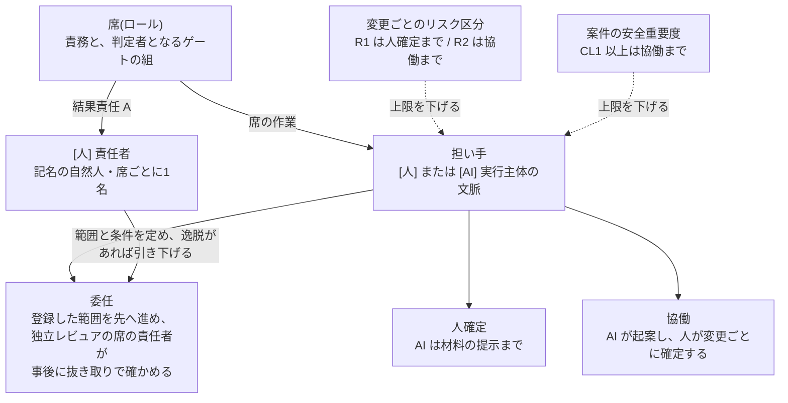

本章は、生成AIエージェントと人間の役割境界を規定します。境界は固定ではなく、AI の能力向上に応じて見直す対象として扱います。

## 5.1 本章が達成すべき成果

本章の要求事項を満たしたとき、次の成果が得られます。

- どの作業を AI が担い、どの判断を人間が担うかが、時点を明示した形で定義されている
- 人間が担う判断について、その判断が実質的に行われたことを確認できる
- AI の能力向上に伴って役割境界を見直す手続が定められている

## 5.2 責任の原則

役割境界がどのように変化しても、次の原則は変更しません。

- 結果責任(A)は常に人間に紐づく。AIエージェントは実行(R)のみを担う
- 結果責任は成果物ごとに1名とする。複数名への分散を認めない
- AI が生成した成果物は、その生成を指示した者と別の自然人を責任者とする席が確認する。確定の担い手の上限は 5.5 による

3点目が定めるのは、確認の責任です。確認する席の責任者は、記名の自然人です(5.5.1)。同一人物が別の席を兼ねて確認しても、3点目は満たせません。満たせない体制は、独立レビュー(G-6)を未達として表示します([第3章 3.5](/process-compass/phase4-process-design/roles-responsibilities/))。確認の時点と範囲は、担い手の運用形態によって変わります(5.5.2、5.5.4)。

## 5.3 役割境界の時点表記

AI の能力は短期間で変化するため、役割境界の定義には必ず妥当な時点を併記します。

**2026-08-05 時点の前提**: 生成AIエージェントは、仕様を入力として実装・テスト生成・自己修正を主導的に実行できます。人間の主たる作業は、コードの記述ではなく、仕様の設計・コンテキストの整備・差分の検証へ移っています。

## 5.4 AI自律レベル

### 5.4.1 レベルを定義する3変数

自律の水準は、番号そのものではなく次の3変数で定義します。この3変数は、運転自動化の水準を定義する国際規格(ISO/IEC で参照される SAE J3016)が用いる構造と同型です。

| 変数 | 問い |
| --- | --- |
| 監視者 | エージェントの動作を、誰が、どの時点で見ているか |
| フォールバックの担い手 | 期待どおりに動作しなかったとき、誰が回復させるか |
| 適用範囲 | エージェントが動作してよい領域はどこまでか |

このうち**適用範囲が動的境界の実体**です。レベルを上げ下げすることは、適用範囲を広げること、狭めることと同義です。

適用範囲は次の4軸で記述します。

| 軸 | 記述する内容 |
| --- | --- |
| 対象 | リポジトリ、ディレクトリ、機能の単位 |
| 環境 | 開発環境 / 検証環境 / 本番環境 |
| 変更種別 | 実装 / テスト / 設定 / データ構造 / 権限 |
| リスク区分 | R1〜R3([第3章 3.8.1](/process-compass/phase4-process-design/roles-responsibilities/)) |

### 5.4.2 3つのレベル

| レベル | 名称 | 監視者 | フォールバック | 典型的な適用範囲 |
| --- | --- | --- | --- | --- |
| L1 | 主導実装 | 人間が全ての変更を確認する | 人間 | 1機能単位。開発環境で実装・テストを生成する |
| L2 | 仕様駆動の並行実行 | 人間が統合点を確認する | 人間および自己修正ループ | 複数機能の並行実装。検証環境まで |
| L3 | 自己修復 | 機械が常時監視し、人間が事後に確認する | 自動的な切り戻し | 事前に登録した変更種別に限定する |

**2026-08-05 時点のベースラインは L1 です**。生成AIエージェントは、仕様を入力として実装・テスト生成・自己修正を主導的に実行できます。人間の主たる作業は、コードの記述ではなく仕様の設計・コンテキストの整備・差分の検証です。

### 5.4.3 レベルによらない不変条件

次の要求事項は、レベルがどこまで上がっても変更しません。

| # | 不変条件 |
| --- | --- |
| 1 | 結果責任(A)は人間に紐づく。AIエージェントは実行(R)のみを担う |
| 2 | 本番環境への反映の承認は、人間が記名で行う |
| 3 | 認証・認可・個人データ・外部との契約に関わる変更は、レベルにかかわらず人間が判断する |
| 4 | 適用範囲の拡大そのものを、AIエージェントが決定してはならない |

要求事項2は、2026-08-05 時点の実務における到達点でもあります。エージェントによる変更の提案までを自律化し、反映の判断を人間が保持する構成は、主要な開発基盤で標準となっています。

### 5.4.4 リスク区分による上限

実績が良好であっても、レベルの上限はリスク区分で固定します。担い手の運用形態(5.5.2)の上限も、同じ区分で固定します。

| リスク区分 | 適用できる最大レベル | 運用形態の上限 |
| --- | --- | --- |
| R1 | L1 | 人確定 |
| R2 | L2 | 協働 |
| R3 | L3(5.5.4 で登録した変更種別に限る) | 委任(5.5.4 の条件をすべて満たす変更に限る) |

2つの上限は、掛かる対象が異なります。AI自律レベルは、実装作業を誰が監視し、誰が回復させるかを定めます。運用形態は、席の判断を誰がどの時点で確定するかを定めます。

両者は、登録した変更種別で重なります。関係は次のとおりです。

- 委任の範囲として登録した変更種別には、L3 を適用する。**登録した変更種別への L3 の適用は、5.5.4 による**
- 委任の範囲、L3 の適用範囲、標準変更カタログ([第3章 3.7.4](/process-compass/phase4-process-design/roles-responsibilities/))は、同じ登録を指す。別々に登録しない
- 登録した変更種別のほかでは、一方を引き上げても、他方は引き上がらない
- 委任で先へ進める変更にも、L3 の監視(機械による常時監視)とフォールバック(自動的な切り戻し)が掛かる

この上限は実績によって緩和されません。取り消せない決定に対して、成功の積み重ねを根拠に監督を薄くする経路を作らないためです。

**安全関連ソフトウェアは無条件に R1 として扱います**。人身への危害につながりうる制御を担う部分は、事業上の可逆性にかかわらず最上位のリスク区分になります。

ただし範囲を限定します。安全関連システムに含まれるコードのすべてが安全関連ソフトウェアではありません。

| 区分 | 適用 |
| --- | --- |
| 安全関連部(安全機能を実現する部分) | R1 固定、L1 固定、人確定 |
| それ以外の部分 | 通常どおり R2 / R3 と L2 / L3 を適用してよい。運用形態の上限は 5.5.3 による |

切り分けを定めずに全体を安全関連として扱うと、安全機器を扱う組織で AI の活用が全面的に停止します。切り分けの判定手順は[附属書F](/process-compass/phase4-process-design/safety-verification/)によります。

### 5.4.5 レベルの引き上げ

引き上げは判定を要します。次の条件をすべて満たしたとき、技術判断者が申請し、ステアリングコミッティ(B-2)が判定します。

| # | 条件 | 初期値 |
| --- | --- | --- |
| 1 | 現在のレベルでの連続運用期間 | 3か月以上 |
| 2 | 独立レビューの差し戻し率が基準の範囲内にある | 上下いずれの逸脱もない |
| 3 | 変更失敗率が基準を超えていない | 組織が G-1 で定めた値 |
| 4 | AI が起因となった是正を要する事象の発生 | 期間内に0件 |
| 5 | 5.4.7 の能力維持措置が実施済みである | 実施記録がある |
| 6 | 引き下げの検知と切り戻しの手順が整備されている | 手順書と実行記録がある |

条件6を欠いた引き上げを認めてはなりません。戻せない拡大は、拡大ではなく放棄です。

5.5.4 で登録する変更種別には、上表の手続に代えて次を適用します。

- 登録した変更種別への L3 の適用は、5.5.4 の登録の判定による。**登録の判定が、当該種別についての本節の引き上げの判定を兼ねる**
- 登録の根拠は、条件1 の連続運用期間ではなく、5.5.4 の条件3・4(既存のテストで検出できること、取り消しを実行した実績)に置く
- 登録するのは、リリース判定会(B-4)である。B-4 を置かない体制では、D-0 体制図の決定の権限を持つ者(人)である([第3章 3.7.4](/process-compass/phase4-process-design/roles-responsibilities/))。この者が誰を指すかは、5.5.4 で特定する
- 登録の判定では、当該の種別について 5.4.6 の検知条件を計測できることを確かめる。計測できない種別は登録しない(5.5.4)
- 5.4.6 の引き下げと 5.4.7 の能力維持措置は、登録した変更種別にも適用する

同じ範囲について引き上げの判定を2つ持つと、条件の緩いほうだけが使われます。登録した変更種別の判定は、登録の判定の1つに揃えます([ADR-0054](/process-compass/adr/0054-seat-accountable-performer/) 決定4)。

### 5.4.6 レベルの引き下げ

引き下げは判定を待たず、検知した時点で自動的に発火します。**引き上げは判定を要し、引き下げは自動で行う**という非対称を意図的に設けます。監督の劣化は静かに進み、申告されないためです。

| 検知する状態 | 初期値 | 措置 |
| --- | --- | --- |
| 自動承認の比率が急上昇した | 前月比2倍 | 該当範囲を1段階引き下げる |
| AI が起因となった Sev1 または Sev2 が発生した | 1件 | 該当範囲を1段階引き下げる |
| 独立レビューの差し戻し率が0%のまま推移した | 2か月継続 | 形骸化の疑いとして引き下げる |
| 変更の重複率または手戻り率が基準を超えた | 組織が定めた値 | 引き下げを検討する |
| コア機能の理解保持者数が1名になった | — | 該当機能を L1 へ引き下げる |

引き下げた範囲は、5.4.5 の条件を再度満たすまで戻しません。

#### 計測できない検知条件がある場合

上表の検知は、いずれも常時の計測を前提とします。計測の基盤を持たない組織では、引き下げは発火しません。**発火しない引き下げを、備えているものとして扱ってはなりません**。

検知条件は、必要な計測の水準で2つに分かれます。

| 区分 | 検知条件 | 必要なもの |
| --- | --- | --- |
| 記録の存在で判定できる | AI が起因となった Sev1 または Sev2 の発生、コア機能の理解保持者数 | 障害記録、要員の名簿 |
| 継続的な集計を要する | 自動承認の比率、差し戻し率、重複率および手戻り率 | 判定の履歴を期間で集計する仕組み |

第2区分の計測ができない範囲へ、**L2 以上を適用しません**。5.4.5 の条件6(引き下げの検知と切り戻しの手順が整備されている)を満たさないためです。

この制約は、導入の可否を分けるものではありません。L1 は第1区分の記録だけで運用でき、全変更を人間が確認する構成のため、比率の集計を要しません。**計測の基盤が整うまでは L1 で運用します**。段階は、基盤の成熟に従って進みます。

代替として、月次の点検でレベルを引き下げる手順は置きません。人間の点検を挟むと、引き下げは判定になります。5.4.6 が自動を求める理由は、監督の劣化が申告されないことにあります。**点検する側が同じ劣化の当事者である構成では、非対称は成立しません**。

### 5.4.7 能力維持措置

レベルを上げるほど、人間が対象を自力で扱う機会は減ります。監督する能力は、監督だけを続けても維持されません。

したがって、L2 以上を適用する範囲には、次の措置を併せて義務づけます。

- 対象領域について、AIエージェントを用いずに実装または調査する機会を、定められた頻度で確保する
- コア機能の理解保持者数を維持する([第2章 2.9.4](/process-compass/phase4-process-design/lifecycle/))。1名以下の状態は逸脱として扱う([第3章 3.4.3](/process-compass/phase4-process-design/roles-responsibilities/))。判断を担う席の AI を使わない力量の確認は、自律レベルに依らず第3章 3.4.3 による
- 独立レビューにおける挙動要約の記載を、レベルにかかわらず継続する

AI 支援を用いた群が、支援なしの後続作業で著しく高い失敗率を示したという実験結果が複数報告されています(2026年前半)。監督者の能力低下は、レベルを上げた組織が数年後に直面する固有のリスクです。個人の心構えではなく、プロセス上の措置として扱います。

### 5.4.8 見直しの頻度

- 本節の記述には、妥当な時点(YYYY-MM-DD)を必ず併記する
- 記載時点から1年を経過した場合、内容の妥当性を再評価しなければならない
- 外部の性能指標(ベンチマークのスコア)のみを根拠として引き上げてはならない。自組織の実測値を根拠とする

外部指標を単独の根拠にしない理由は、公開ベンチマークに評価データの混入や設問不備が繰り返し報告されており、2026年前半には主要な提供者がその一部の使用を取りやめているためです。

## 5.5 判断の席と、確定の担い手

本節は、人が確定する判断と、席で作業する担い手を分けて規定します。**人に固定するのは判断の確定であり、席の作業ではありません**。

席は、責任者と担い手を別々に持ちます。担い手の運用形態は席ごとに宣言し、その上限を、変更ごとのリスク区分と案件の安全重要度が下げます。

### 5.5.1 席・責任者・担い手

判断は次の4種類に分類し、種類ごとに席を分けます。1名に集中させません。

| 判断の種類 | 内容 | 席 |
| --- | --- | --- |
| 価値判断 | 何を作るか、どの順序で作るか | 価値責任者 |
| 技術判断 | どの設計を採るか、何を捨てるか | 技術判断者 |
| 理解の確認 | 成果物が仕様どおりに動くか | 独立レビュア |
| 記録の確認 | 判断と検証の記録が完備しているか | 出荷判定者 |

席について、次の3語を分けます。

| 語 | 定義 | 変わるとき |
| --- | --- | --- |
| 席 | ロールの別称。責務と、判定者となるゲートの組 | 体制が変わっても変わらない |
| 責任者 | 席の結果責任(A)を負う記名の自然人。席ごとに1名 | 体制の変化点([第3章 3.13](/process-compass/phase4-process-design/roles-responsibilities/))でのみ変わる |
| 担い手 | 席の作業を実際に行う実行主体。人、または AI の実行主体の文脈 | 運用形態の宣言(5.5.2)で変わる |

責任者と担い手には、次を要求します。

- 各席に責任者を1名置く。**AI を責任者にしてはならない**
- 席の作業を複数の人で担う場合(開発者5名、独立レビュア2名など)も、席の責任者は席ごとに1名とする。成果物ごとの結果責任者は、担当表(D-0 体制図)で1名に定める([第3章 3.2](/process-compass/phase4-process-design/roles-responsibilities/))
- 4種類の判断の確定は、席の責任者が記名で行う。確定とは、ゲートの判定と、R1・R2 の決定を指す
- AI を担い手に置くときは、適合性確認([第3章 3.4.2](/process-compass/phase4-process-design/roles-responsibilities/))を経る。確認を経ない担い手は、協働を上限とする
- 協働または委任で運用する席の責任者は、範囲と条件を定め、逸脱を検知したら運用形態を引き下げる
- 委任の変更に対する事後の抜き取りは、独立レビュー(G-6)の判定である。独立レビュアの席の責任者が行う。作成を指示した者と別の自然人とする(5.5.4 の条件6)

席の作業は、担い手が行います。**承認済みの受入基準とスコープの内側にある作業上の選択は、担い手が決めて記録します**。運用形態が協働の席でも同じです。

| 作業上の選択 | 扱い |
| --- | --- |
| 承認済みの受入基準とスコープの内側にある選択 | 担い手が決めて記録する。**選択のたびに人へ戻さない**。人は、変更ごとの確定の場で、記録された選択をまとめて確認する。委任の変更では、事後の抜き取りで確かめる |
| 5.5.5 の、人が確定する判断に当たる選択 | 人へ戻す |
| 受入基準・スコープ・公開インタフェース・データ形式を変える選択 | 人へ戻す |
| 取り消せない操作 | 人へ戻す |

人へ戻す経路は、担い手へ明示します。

<!-- impl IMPL-0024 target=claude-md state=delivered note="承認済みの受入基準とスコープの内側にある作業上の選択は、協働の席でも担い手が決めて記録する。人へ戻す場合(人が確定する判断、基準・公開インタフェース・データ形式を変える選択、取り消せない操作)と経路を担い手へ明示する" -->

決めてよい範囲と、人へ戻す場合は、対で示します。禁止だけを示して決めてよい範囲を示さない構成では、担い手は自分で決めてよい選択を判別できません。決めてよい範囲を委任の範囲だけに限ると、協働の席の担い手は、小さな選択まで人へ戻し続けます。

5.8.3 との違いは、**禁止の理由**です。5.8.3 の4項目は、AI へ担わせると**安全または検証の成立そのものが崩れる**ため禁じます。本節が判断の確定を人に固定するのは、**結果責任(A)を負う者の確定でなければ責任の所在を失う**ためです。**どちらも自律レベルによって変わりません**。責任の所在は、席を人が占めることではなく、責任者の記名と関与で守ります([ADR-0054](/process-compass/adr/0054-seat-accountable-performer/))。

### 5.5.2 運用形態

担い手の運用形態は、次の3つです。席ごとに D-0 体制図で宣言します([第6章 テンプレ0](/process-compass/phase4-process-design/deliverable-templates/))。

| 運用形態 | AI が行うこと | 人が行うこと | 人が確定する時点 |
| --- | --- | --- | --- |
| 人確定 | 材料・複数案・リスク見積の提示まで | 判断し、理由を自分で書く | 変更ごと。先へ進める前 |
| 協働 | 判断の案と根拠を起案する | 変更ごとに確認し、確定する | 変更ごと。先へ進める前 |
| 委任 | 登録した範囲の変更を、人の事前確認なしに先へ進める | 委任した席の責任者が、範囲と条件を事前に定め、逸脱があれば引き下げる。独立レビュアの席の責任者が、事後に抜き取りで確かめる | 事後。抜き取りによる |

- 宣言は上限である。変更ごとのリスク区分の判定が、それを下げる(5.5.3)
- 人確定を残すのは、R1 の決定で AI に結論を起案させないためである(5.7.3)
- AI が判定を確定する形態は置かない。委任でも、判定者は席の責任者のままである(5.5.4)
- 委任の行の「人の事前確認なしに」は、委任した席についての記述である。開発者の席だけが委任の変更は、独立レビュアが G-6 を事前に判定する。「人の事前確認を経ていない変更」と呼ぶのは、G-6 の判定を事後へ移した変更に限る(5.5.4)

体制を「人と協働する AI」と「完全自律の AI」の2つで語る場合、前者は協働に、後者は委任に当たります。**本標準は「完全自律」の語を使いません**。公的な分類が全自律型と呼ぶ形も、事前に定めた目的・制約・監督の下での運用を前提にしているためです(2026-09 時点)。

### 5.5.3 リスク区分による上限

運用形態の上限は、変更ごとのリスク区分([第3章 3.8.1](/process-compass/phase4-process-design/roles-responsibilities/))で決まります。

| リスク区分 | 運用形態の上限 |
| --- | --- |
| R1(安全関連部を含む) | 人確定 |
| R2 | 協働 |
| R3 | 委任。5.5.4 の条件をすべて満たす変更に限る。満たさない変更は協働 |

上限は、次の要因でさらに下がります。複数に当たるときは、最も厳しいものを採ります。

| 要因 | 判定の単位 | 上限 |
| --- | --- | --- |
| 案件の安全重要度が CL1 以上である。または規制業に該当する | 案件ごと | 協働。委任を適用しない |
| AI の担い手が適合性確認を経ていない。または確認か承認が失効している(第3章 3.4.2) | 担い手の識別ごと | 協働 |
| 席が委任の対象でない(5.5.6) | 席ごと | 5.5.6 の表による |

- 席ごとの宣言から「この席は人の確認が要らない」を導いてはならない。リスク区分は変更ごとに判定する([ADR-0039](/process-compass/adr/0039-scope-in-heading-and-unit-of-judgement/))
- 案件の安全重要度を根拠に、リスク区分による上限を緩めてはならない。CL0 の案件でも、R1 の変更は人確定とする
- **上限を案件単位で引き上げる経路はない**。実績によっても緩和しない(5.4.4 と同じ理由)

<!-- impl IMPL-0025 target=config-seats state=delivered note="席ごとの運用形態の宣言は上限であり、変更ごとのリスク区分が下げる。案件単位で引き上げない" -->

この線引き(R2 は協働、R3 は条件つきの委任)に、実測の裏づけはありません。根拠の水準と差し替え条件は、[ADR-0054](/process-compass/adr/0054-seat-accountable-performer/)の暫定マーク EV-0040 によります。

### 5.5.4 委任の条件(適用: CL0・R3 の変更)

**委任で移るのは判定の時点です。判定の主体は移りません**。

- ゲートの判定者は、席の責任者(人)のままである。判定は記名の判定記録で成立する([第4章「判定の成立」](/process-compass/phase4-process-design/gate-criteria/))
- AI の確認は検出の層である。**承認として扱わず、合否条件にも用いない**
- 委任の根拠を「AI が代わりに読んだこと」に置かない。**壊れたことを検出でき、壊れたら取り消せること**に置く

委任を適用できるのは、次の7条件をすべて満たす変更です。1つでも満たさない変更は、協働で扱います。

| # | 条件 | 判定の単位 |
| --- | --- | --- |
| 1 | 案件の安全重要度が CL0 で、規制業に該当しない | 案件ごと |
| 2 | 変更がリスク区分 R3 で、登録した変更種別に当たる。**該当の判定は機械の規則で行い、行為する AI 自身に判定させない**。規則で分類できない変更は協働へ落とす | 変更ごと |
| 3 | 機械検査(G-5)の全項目を通過し、変更箇所の挙動を既存のテストで検出できる | 変更ごと |
| 4 | 単独で取り消せ、取り消しを実行した実績がある | 変更ごと |
| 5 | 確約範囲(SC-M)とコア指定の機能に触れない | 変更ごと |
| 6 | 独立レビュアの席の責任者が、事後に抜き取りで確かめる。逸脱を検知したら、該当範囲を協働へ自動で引き下げる | 席ごと |
| 7 | 記録の上で、委任で先へ進めた変更として変更単位で識別できる。G-6 の判定を事後へ移した変更は、人の事前確認を経ていない変更として識別できる | 変更ごと |

- [第8章「極小規模での事後監査への切替」](/process-compass/phase4-process-design/tailoring-guide/)は、本節の委任を 1〜2名体制へ適用したものである。切替の条件は、本節の7条件による。条件の緩い別の経路を置かない
- 条件2 の変更種別は、観測できる属性で登録する。属性の定め方は、同章「対象にできる変更の境界」による
- 条件2 の該当の判定は、**行為する側が書き換えられない形で行う**。判定の規則と構成は、判定の対象となる変更を取り込む先の版(基底ブランチ)から読む。変更の側に含まれる規則と構成で判定する構成は、条件2 を満たさない
- 条件6 の主語を分ける。委任した席の責任者が行うのは、範囲と条件を定めることと、逸脱を検知したときの引き下げである。事後の抜き取りは独立レビュー(G-6)の判定であり、独立レビュアの席の責任者が行う。作成を指示した者と別の自然人とする
- 条件6 の頻度・抜き取り数・確認すること・記録は、同章「事後監査の手続」による。**新しい手続を設けない**
- 条件6 で、作成を指示した者と別の人を抜き取りの実施者に置けないときは、独立レビュアの席の責任者本人が抜き取り、その旨を保証の開示へ表示する。本人による抜き取りを、独立した確認として数えない
- 条件7 の「人の事前確認を経ていない変更」は、G-6 の判定を事後へ移した変更を指す。開発者の席の規則にだけ該当し、独立レビュアが人として事前に承認した変更は、これに数えない。G-6 については、独立した人の確認を経た変更に数える([第4章 G-6](/process-compass/phase4-process-design/gate-criteria/)の条件を満たす場合)
- 開発者の席の委任は、変更ごとの検証を担い手へ委ねたことの識別として、別に数える
- 委任の識別を持つ変更のうち、独立した人の事前の承認が無いものには、2つの場合がある。G-6 の判定を事後へ移した変更と、それ以外である。後者は、人の事前確認を経ていない変更と呼ばず、独立した人の確認を経ていない変更として扱う(第4章 G-6)
- 委任の識別を持つ変更のリスク区分が R3 でない場合は、**委任の範囲の逸脱**として扱う。条件2 を満たさない変更が、委任で先へ進めた変更として記録されているためである。記録の欠落として差し戻す([第4章 G-7](/process-compass/phase4-process-design/gate-criteria/))
- G-6 の判定を事後へ移した変更を、人の判定と同じ語(承認、通過、独立レビュー済み)で記録しない

<!-- impl IMPL-0026 target=config-delegation state=undelivered note="委任の該当は機械の規則で判定し、行為する AI 自身に判定させない。判定の規則と構成は基底ブランチから読む。AI の確認を承認にも合否条件にもしない。該当の判定は実装、マージの実行は既定で無効、実環境で未確認" -->

#### 登録と、登録した変更種別の経路

条件2 の「登録した変更種別」は、**標準変更カタログ([第3章 3.7.4](/process-compass/phase4-process-design/roles-responsibilities/))に登録した変更種別**と同じものです。委任の範囲、標準変更、AI自律レベル L3 の適用範囲を、別々の登録にしません。

| 項目 | 規定 |
| --- | --- |
| 登録する者 | リリース判定会(B-4)。B-4 を置かない体制では、D-0 体制図の決定の権限を持つ者(人)。AI の名義の登録を受け付けない |
| D-0 体制図の決定の権限を持つ者 | D-0 表1「体制と運用形態」の決定者を指す([第6章 テンプレ0](/process-compass/phase4-process-design/deliverable-templates/))。決定者は1名である。本章と第3章の以降の箇所でも、同じ者を指す |
| 席の責任者が定めるもの | 登録された種別の内側で、自席の委任の範囲と条件を定め、D-0 体制図で宣言する(5.5.2)。登録されていない種別を、席の宣言だけで委任の範囲に入れない |
| 機械の規則の変更 | 条件2 の規則の追加と範囲の拡大は、統制の弱化として扱う。AI維持管理者の承認を要する(5.5.7) |
| 登録の根拠 | 条件3・4(既存のテストで検出できること、取り消しを実行した実績)に置く。連続運用の期間を根拠にしない |
| 登録の根拠の記録 | 種別ごとに、次の3点を登録とあわせて記録する。5.4.6 の検知条件を何で計測するか。取り消しを実行した実績の所在。既存のテストで検出できることの根拠。**3点の記録が無い種別は登録しない**。機械で確かめるのは記入の有無までとし、内容は登録する者が判定する |
| 登録の判定で確かめる計測 | 当該の種別について、5.4.6 の検知条件を計測できること。継続的な集計を要する検知条件(自動承認の比率、差し戻し率、重複率および手戻り率)を含む。**計測できない種別は登録しない**。7条件を満たすだけでは、登録の判定として足りない |
| AI自律レベル | 登録した種別には、L3(機械が常時監視し、人が事後に確認する)を適用する。**登録の判定が、当該種別についての 5.4.5 の引き上げの判定を兼ねる** |
| G-5 | 登録した種別の個別の変更は、G-5 の通過をもって先へ進む |
| G-6 | 事後の抜き取りで判定する(条件6)。判定の時点を事後へ移すのは、次の3つをすべて満たす場合に限る。独立レビュアの席が委任を宣言している。変更が、その席の機械の規則に該当する。変更のリスク区分が R3 である。**開発者の席の規則にだけ該当する変更は、事後へ移さない**。G-6 を事前に判定する。この場合は、事前の判定が条件6 の確認に当たる |
| G-6 を事後へ移す変更で、開発者の席が協働である場合 | 開発者の席が委任でない変更と、開発者の席の機械の規則に該当しない変更が当たる。**開発者の席の人による検証が、変更ごとに要る**(5.5.6)。機械が変更を先へ進める条件に、開発者の席の責任者(人)の承認を含める。独立レビュアの席の委任だけで、人の確認が一切無い変更を作らない |
| G-7・G-8 | 個別の変更ごとには行わない。登録時の事前承認と、期間ごとの保証の開示([第4章 G-7](/process-compass/phase4-process-design/gate-criteria/))への計上で扱う。期間ごとの保証の開示にも、出荷判定者の突合と記名、事業決裁者の受容の記名、出荷判定者の異議の記載を要する(第4章 G-8) |
| 期間の開示への受容と異議の記録 | 判定記録([第6章 テンプレ4](/process-compass/phase4-process-design/deliverable-templates/))の「対象」へ、期間の起点と終点を書いて記録する。期間のための様式を足さない。異議の欄の扱いは、出荷ごとの記録と同じである(5.7.2) |
| 本番環境への反映の承認 | 登録時の記名による事前承認が、5.4.3 の不変条件2 の承認に当たる |
| 委任しない席 | 期間の開示を突合して記名する出荷判定者の席と、リリース決裁の席(5.5.5) |

<!-- impl IMPL-0035 target=config-delegation state=delivered note="変更種別の登録に、登録の根拠(5.4.6 の検知条件の計測手段、取り消しの実績の所在、既存のテストで検出できることの根拠)を持たせ、未記入の種別は登録を受け付けない。機械が確かめるのは記入の有無まで。テンプレート担当の実装後に主担当が改める" -->

期間ごとの保証の開示は、条件6 の事後の抜き取りと同じ周期で区切ります。抜き取りの結果と、人の事前確認を経ていない変更の件数を、同じ開示で読めるようにするためです。期間の開示は、出荷の範囲によらず、期間の起点と終点で区切って出します。載せるのは、委任で先へ進めた変更と、事後の抜き取りの結果です。期間の開示に対応する受容と異議の記録が無い状態は、記載の欠落として扱います(第4章 G-8)。

登録の判定で確かめる計測は、5.4.6 の引き下げを発火させるための集計です。保証の開示の項目6 に載る検出能力の測定(5.6.2 の欠陥注入)とは、別の量です。項目6 が「未測定」であることは、それだけでは登録を妨げません。逆に、項目6 を測定していても、5.4.6 の検知条件を計測できない種別は登録できません。

委任は、独立性の未達を解消しません。責任者が作成を指示した者と同一人物であれば、AI を何体に分けても独立は成立しません([第3章 3.5.4](/process-compass/phase4-process-design/roles-responsibilities/))。独立レビュー(G-6)が未達の体制は、委任を宣言しても未達のまま表示します([ADR-0028](/process-compass/adr/0028-unmet-gate-distinct-from-omitted/))。

7条件の根拠の水準と差し替え条件は、5.5.3 と同じく [ADR-0054](/process-compass/adr/0054-seat-accountable-performer/)の暫定マーク EV-0040 によります。

### 5.5.5 運用形態にかかわらず人が確定する判断

次の判断は、委任の対象にしません。席の宣言と変更のリスク区分にかかわらず、人が確定します。

| # | 人が確定する判断 | 関連する規定 |
| --- | --- | --- |
| 1 | R1 の決定と例外承認、およびその理由の記入 | 5.7.3、[第7章 7.3](/process-compass/phase4-process-design/exception-escalation/) |
| 2 | 委任の範囲と条件の決定、およびその拡大 | 5.4.3 の不変条件4 |
| 3 | 機械の規則で判定できないリスク区分の確定 | 第3章 3.8.1 |
| 4 | 出荷判定(G-7)の記名、リリース決裁(G-8)、本番環境への反映の承認 | [第4章](/process-compass/phase4-process-design/gate-criteria/)、5.4.3 の不変条件2 |
| 5 | AI を担い手に置くときの適合性確認の承認 | 第3章 3.4.2 |
| 6 | コア機能の理解の確認、安全に関する最終的な判断 | 5.4.7、5.8.3 |

- 1 は人確定とする。AI は結論を起案しない
- 出荷判定者・事業決裁者・AI運用担当者の席は委任しない。出荷判定者に残るのは記名と停止権であり、責任を負えない主体へ置くと「止めなかった」責任の所在が消える
- 出荷判定者の停止権の範囲は、出荷基準の未充足と、記載の欠落による差し戻しに限る([第4章 G-7](/process-compass/phase4-process-design/gate-criteria/))。開示された未達・未測定の多さを理由に出荷を止める権限ではない。それらへの意見は、異議として G-8 の決断の記録へ記載する。止めるかどうかは事業決裁者が決める
- 登録した変更種別では、G-7 と G-8 を個別の変更ごとに行わない(5.5.4)。これは席の委任ではない。登録時の事前承認と、期間の開示を突合したうえでの記名は、人が行う。期間の開示に載った残存リスクの受容の記名と、出荷判定者の異議の記載も同じである
- AI維持管理者の判断も委任しない。AI が自らを規定する指示資産を確定すると、適用範囲の拡大を AI が決めることになる

**本節と 5.5.3 の上限を、初期値や推奨として読まないでください**。案件が判断記録(ADR)を書けば緩和できる、という規定ではありません。役割境界の見直しは 5.9 によります。**見直しの結果は本章へ反映するものであり、案件側の記録で本章の要求を緩和する経路はありません**。案件が選べるのは、上限の内側での運用形態だけです。

### 5.5.6 席ごとの上限

席ごとの上限は次のとおりです。**どの席でも、責任者は記名の自然人です**。

| 席 | 委任できる範囲(適用: 5.5.4 の7条件をすべて満たす変更) | 協働で AI が起案できるもの(適用: R2 までの変更) | 委任せず、人が確定する判断 |
| --- | --- | --- | --- |
| 事業決裁者 | なし | なし。AI は判断材料([附属書G](/process-compass/phase4-process-design/executive-projection/)の投影)の作成まで | すべての決定。決断の記録(5.7.2)は決裁者が書く |
| 価値責任者 | 承認済みの受入基準の内側にある仕様上の選択 | 受入基準の草案、機能仕様承認(G-4)の判定の草案、優先順位の案 | 要件合意(G-2)と G-4 の判定、確約範囲(SC-M)に触れる変更、R1 の決定 |
| 技術判断者 | 定型的な技術選定。第3章 3.6 が開発者への委譲を認める範囲に限る | 設計案と判断記録(ADR)の起案 | 技術設計判断(G-3)の判定、コア指定、AI自律レベルの引き上げの申請(5.4.5) |
| 開発者(検証) | 登録した変更種別の実装と挙動検証。完了は実行結果の証拠で示す | 実装とテスト生成。挙動の検証は人が変更ごとに行う | コア機能の理解の記録、安全関連コードの変更の確認(5.8.3) |
| 独立レビュア | この席が委任を宣言し、変更がこの席の機械の規則に該当する場合に限り、判定の時点が事後へ移る(5.5.4)。席の責任者が抜き取りで確かめる。事前の検出の層として AI を置いてよい | 指摘の列挙まで。挙動要約は人が書く([附属書C](/process-compass/phase4-process-design/review-guide/)) | G-6 の判定の記名、R1・R2 の変更の判定、コア機能の理解の確認 |
| 出荷判定者 | なし | 突合表の機械的な作成まで | 出荷判定(G-7)の記名と差し戻し |
| 文脈オーナー | 書き戻しの実行と、整合の機械検査 | 恒久層への書き戻しの採否の案 | 用語・規約の正本の変更の採否 |
| AI維持管理者 | なし | 矛盾の検出、分割・削除の案 | 指示資産の変更の承認、外部ツールの採否、適合性確認の実施 |
| AI運用担当者 | なし | なし。AI は監視と集計の実行まで | モデルの適合性の記名承認(第3章 3.12.3)、予算上限、停止条件 |

- R1 の決定と例外承認は、どの席でも人確定とする(5.5.3)
- 独立レビュアの席で委任が移すのは、判定の時点である。**AI の確認を、独立した人の確認に数えない**
- 委任の列に書かれた範囲でも、5.5.4 の条件を満たさない変更は協働で扱う
- 独立レビュアの席だけが委任で、開発者の席が協働である変更は、開発者の席の人による挙動の検証が変更ごとに要る。G-6 の判定の時点が事後へ移っても、この検証は省けない(5.5.4)
- 協働の列に書かれた起案の内側でも、承認済みの受入基準とスコープの内側にある作業上の選択は、担い手が決めて記録する(5.5.1)

開発者の席では、検証の記載を書く者と、変更をレビュー可能(Ready)にする者が、確定の形態によって変わります。

| 変更の確定の形態(開発者の席) | 検証の記載を書く者 | レビュー可能(Ready)にする者 | 独立レビュアの扱い |
| --- | --- | --- | --- |
| 人確定・協働 | 開発者の席の人。AI に代筆させない | 開発者の席の人 | 検証の記載が AI の出力であれば、差し戻してよい |
| 委任(開発者の席の機械の規則に該当する R3 の変更) | 担い手。実行結果の証拠として書く | 担い手 | 検証の記載が担い手によるものであることを理由に、差し戻さない。挙動要約と3パスの確認は、事前に承認する独立レビュア(人)が行う |

- 委任の行は、開発者の席の委任の範囲に限る。範囲の外の変更は、人確定・協働の行による
- 担い手が Ready にした変更でも、G-6 の判定者は独立レビュアの席の責任者である。独立レビュアの席も委任を宣言し、5.5.4 の3つを満たす変更に限り、判定の時点が事後へ移る
- PR の上での手順は[フェーズ5(PR ワークフロー)](/process-compass/phase5-implementation/pr-workflow/)による

:::caution[暫定 EV-0050 / 見直し 2027-03]
**対象**: 席ごとの上限の表のうち、委任できる範囲と、協働で AI が起案できるものの割当て。
**根拠の水準**: E0(なし)。
**差し替え条件**: 席ごとの、委任で先へ進めた変更の件数と事後の抜き取りで逸脱と判定された件数。協働で AI の起案を人が覆した件数。ある席で逸脱が1件でも生じた場合、その席の委任できる範囲から当該の変更種別を外す。覆した件数が0件のまま推移した席は、追認の疑いとして、AI が起案できるものの割当てを狭める。

AI が席の担い手として判断を引き受け続けた運用報告は、2026-09 時点の外部調査(`research/282-survey-2026-09/`)で見つかっていません。割当ては、既存の条項が人に固定している判断を除いた残りとして置いたものです。
:::

### 5.5.7 運用形態の引き上げと引き下げ

統制を緩める向きは判定を要し、厳しくする向きは即時に適用します。5.4.5・5.4.6 と同じ非対称です。

| 向き | 該当する変更 | 手続 |
| --- | --- | --- |
| 緩める | 人確定から協働、協働から委任、委任の範囲の拡大 | 対象の席の責任者、または D-0 体制図の決定の権限を持つ者が記名し、理由を記録する。**AI の名義の記名を受け付けない**。登録されていない変更種別へ委任の範囲を広げるには、5.5.4 の登録の判定を要する。委任の該当を判定する機械の規則の追加と範囲の拡大には、あわせて AI維持管理者の承認を要する(下記)。体制の変化点として D-0 体制図を改訂する(第3章 3.13) |
| 厳しくする | 委任から協働、協働から人確定、委任の範囲の縮小 | 検知した時点で適用する。判定を待たない。D-0 体制図へは事後に反映する |
| 未達の発生 | 人の離脱で、独立レビューや兼務禁止が成立しなくなる。体制内の人が実際に減った場合、または席の責任者が体制から外れた場合に限る | 向きの決定として扱わない。記名を待たず、即時に未達として構成へ反映し、表示する。旧い構成のまま止めない(第3章 3.13.3)。人が減っていないのに人の確認を減らす変更は、緩める向きとして扱う |

- 緩める向きの決定を、AI が行ってはならない(5.4.3 の不変条件4)
- 委任の範囲を狭める変更は、厳しくする向きである。登録からの削除と、機械の規則の削除も同じ扱いとし、会議体の定例を待たない
- 登録した変更種別への L3 の適用は、5.5.4 の登録の判定による。それ以外の AI自律レベルの適用範囲の拡大は、5.4.5 の判定による。いずれも、D-0 体制図への記載で代替しない
- 事後の抜き取りで逸脱を検知したら、該当範囲を協働へ引き下げる(5.5.4 の条件6)
- 担い手の識別(モデルの版・指示資産の版・権限の組)が変わったら、適合性確認は失効する。再確認まで協働を上限とする
- 識別を変える前に新しい識別の確認を済ませ、席の責任者が委任を続ける決定として記名した場合は、協働へ下げずに切り替えられる。条件は第3章 3.4.2 の4つによる。1つでも欠ければ、協働へ下げる
- 適合性確認を承認した席の責任者が交代したら(離脱を含む)、承認は失効する。新しい責任者が承認し直すまで、協働を上限とする。確認の記録は有効なまま残り、確認の再実施は要しない(第3章 3.4.2)
- 新しい責任者が承認し直して委任へ戻すのは、緩める向きである。承認し直しと、その席の委任を続ける決定の記名を、新しい責任者の記名と理由によって、1つの変化点で同時に行ってよい
- 確認の実施者が交代しても、または体制から外れても、確認の記録は有効なまま残る。承認し直しのときに、記録の実施者を現在の体制と照合しない(第3章 3.4.2)
- 提供者の障害による一時的な切り替えの間は、委任を協働へ下げる(第3章 3.12.5)
- 安全重要度が上がり、委任を適用できなくなったときは、抜き取り待ちの委任の変更を、協働の手続で全件確認し直す
- 未達のまま出荷するかどうかは、既存の規定による。R1 の変更は[第7章 7.3](/process-compass/phase4-process-design/exception-escalation/)の例外承認を要する。安全重要度 CL1 以上と規制業では出荷できない
- 引き下げた範囲は、緩める向きの手続を再度経るまで戻さない

委任の該当を判定する機械の規則(5.5.4 の条件2)は、強制層です([第3章 3.11.3](/process-compass/phase4-process-design/roles-responsibilities/))。**規則の追加と範囲の拡大は、事前の承認という遮断を外す変更であり、統制の弱化として扱います**。[ADR-0038](/process-compass/adr/0038-detection-handoff-of-control-weakening/) 決定1 の「遮断の解除」に当たるためです。

| 項目 | 規定 |
| --- | --- |
| 委任するという決定 | 対象の席の責任者、または D-0 体制図の決定の権限を持つ者が記名する(上表)。AI維持管理者の記名だけでは、決定にならない |
| 規則そのものの変更の承認 | AI維持管理者が記名する(第3章 3.11.2 の承認権限)。委任へ緩める手続は、この2つの記名を要する |
| 経路 | 既存の `state:needs-platform` を用いる([フェーズ5 ラベル運用 4.3](/process-compass/phase5-implementation/label-mailbox/))。新しいラベルとゲートを足さない |
| 検知した者 | 出荷判定者と AI の担い手を含む。差分が変更の主張と一致するかの確認までに留め、許容可否を判断しない |
| 席の責任者と AI維持管理者が同一人物である場合(1〜2名体制) | 引き渡しと、どの席で判断したかを記録する。同一人物であることを理由に、記録を省かない |
| 委任を決定した者と AI維持管理者が同一人物である場合(3名以上の体制) | 上の行と同じく、どの席で判断したかを記録して受け付ける。ただし2つの記名が1人に集まり、1つの変化点で1人が委任を有効にできる。この事実を変化点の記録・D-0 体制図の改訂履歴・次の一手・保証の開示に出す。別の自然人で行うには、対象の席の責任者が委任を決定し、AI維持管理者が承認する(事業決裁者が AI維持管理者を兼ねる3名の体制。確約範囲の最初の宣言は D-0 体制図の決定の権限を持つ者が別に行う)。同一人物の承認を拒否する形は、本版では採らない([ADR-0057](/process-compass/adr/0057-organizational-quality-assurance/) 補足 S50) |
| 層1(テンプレ11)の項目4「AI の利用の拡大」の受容できる水準が「認めない」で始まる組織 | 委任の登録(席を委任にする、委任の規則と変更種別を足す、規則を承認する)を構成で受け付けない。トップマネジメントの定めが構成に優先する。委任を認めるには、層1 の記名者が水準を改めて版を上げる(体制の変化点)。委任を解く変更は受け付ける(厳しくする向き) |
| 範囲の縮小と規則の削除 | 弱化に当たらない。厳しくする向きとして、即時に適用する |
| 規則の範囲を広げた場合 | 承認待ちになるのは、広げた部分だけである。承認済みの範囲は有効なまま残る。承認済みの範囲まで承認待ちへ戻すと、範囲の拡大のたびに席が協働へ落ちる |
| AI維持管理者の席の責任者が交代した場合(離脱を含む) | 前任者が承認した規則は、承認待ちへ戻る。承認を新しい責任者へ引き継がない。新しい責任者は、既存の規則を読んで承認し直す。**規則を削除して登録し直すことを要しない**。承認し直すまで、当該の規則に該当する変更は協働で扱う |

委任の決定を AI維持管理者だけへ寄せません。席の結果責任を負う者が決めない形になるためです。事業決裁者の決裁を常に要する形も採りません。判断の要らない事項まで決裁へ集まる形は、ADR-0038 が退けています。

<!-- impl IMPL-0097 target=process-change-skill state=delivered note="委任を決定した者(decidedBy。保持していた宣言・規則の決定者を含む)と規則の承認者(ruleApprovedBy)が同一人物の変化点を、/process-change(generate-profile --change)が人数に依らず記録つきで受け付け、[注意] として出す。D-0 節13 に「決定した者と同一人物」、next.mjs と出荷の集約の項目1 に同一人物の変化点を出す。拒否は採らない(ADR-0057 補足 S50)(#288 第8巡 Y7)" -->
<!-- impl IMPL-0098 target=config-delegation state=delivered note="層1 項目4「AI の利用の拡大」の受容できる水準が「認めない」で始まる組織では、/process-change(種別 mode・performer)が委任の登録(席の委任・規則・変更種別・規則の承認)を拒否する(構成の錠)。出荷の証跡の集約は、錠のもとで構成に委任の登録が残っていれば記載の欠落にし、next.mjs が注記に出す。語を含むだけで欄の先頭でない層1 は錠にせず「人が確かめる」と出す(#288 第8巡 Y7)" -->

<!-- impl IMPL-0019 target=claude-md state=delivered note="4種類の判断の確定は席の責任者(人)が行い、AI の担い手へ移さないことを実行層へ書く" -->

## 5.6 判断の深さに関する要求事項

人間の判断が承認操作のみに縮退した状態(以下、形骸化)は、本標準が防止すべき主要なリスクです。形骸化は個人の怠慢ではなく、正答率の高い自動化に接した人間が示す認知上の傾向として扱います。

判断の深さは、次の3水準で識別します。

| 水準 | 内容 | 本標準での扱い |
| --- | --- | --- |
| 知識 | 文法・API 仕様・定型手順の知識 | AI へ委譲してよい |
| 見識 | 複数案のトレードオフを自分の言葉で説明できる状態 | 人間が保持しなければならない |
| 胆識 | リスクを認識したうえで決定の責任を引き受ける状態 | ゲート判定において人間が到達すべき水準 |

本標準が規定する基本の防止手段は次のとおりです。

- 独立レビューの承認には、対象の挙動を承認者自身の言葉で記述した要約を必須とする
- 要約を伴わない承認は差し戻しとして扱う。独立した人の確認にも数えない([第4章 G-6](/process-compass/phase4-process-design/gate-criteria/))
- 承認に要した時間と変更規模の比を継続して計測する

### 5.6.1 形骸化が生じる条件

形骸化は個人の努力によって防げる現象ではありません。稀にしか現れない対象を探す作業では、見逃しが構造的に増えます。視覚探索の実験では、対象の出現率が50%のとき見逃し率は0.07でしたが、出現率1%では0.30へ上昇しました(2005年)。この劣化は注意力の低下によるものではなく、**判定の基準そのものが移動する**ことによって生じます。

ここから、本標準にとって重要な帰結が導かれます。**AIの生成品質が上がるほど、レビューで見つかる欠陥は稀になり、レビューはより形骸化しやすくなります**。品質の向上と監督の劣化は同時に進みます。

### 5.6.2 欠陥注入による検出能力の測定

意図的に欠陥を混入させ、レビューが検出できるかを記録する手続を規定します。

#### 目的の限定

| 用いてよい目的 | 用いてはならない目的 |
| --- | --- |
| レビュー工程の検出能力の推移を測る | 個人の成績を評価する |
| 見逃されやすい欠陥の類型を特定する | 人事評価および処遇の材料にする |
| 対象の出現率を引き上げ、判定基準の移動を抑える | 残存する欠陥の総数を推定する |

残存欠陥数の推定に用いない理由は、その推定が「注入した欠陥と実際の欠陥が同じ見つけやすさを持つ」という前提に立つためです。この前提は現実にはほぼ成立しません。

委託による開発では、**受注側の評価および契約上のペナルティの根拠にも用いません**。禁止の理由は個人の場合と同じで、測定の対象が工程であることによります。評価へ接続した時点で、注入の告知は不利益の予告になります。受注側は検出しやすい対象へ最適化し、実務で問題になる欠陥は測定から外れます。委託時の役割分担は[第8章 軸D](/process-compass/phase4-process-design/tailoring-guide/)によります。

#### 事前の周知

| # | 要求事項 |
| --- | --- |
| 1 | 注入を実施することを、対象となる全員へ事前に周知する |
| 2 | 個々の注入の時期・箇所は知らせない |
| 3 | 周知なしに注入してはならない |
| 4 | 注入した欠陥が組織の外部へ到達しない経路を確保する |

要求事項1の周知には、実施の告知だけでなく、**測定の対象が工程であること、個人の検出率を算出しないこと、結果を人事評価に用いないこと**を含めます。含める事項の一覧は[フェーズ5(欠陥注入の隔離設計)](/process-compass/phase5-implementation/seeded-error-safety/)に規定します。実施の告知だけでは、試されているという受け取りがそのまま残ります。

要求事項3と4を欠いた注入は、統制の手段ではなく事故です。2021年には、外部のオープンソースプロジェクトに対して周知のない欠陥混入が行われ、当該組織からの投稿禁止措置と研究の停止に至った事例があります。

#### 注入する欠陥の要件

| # | 要件 |
| --- | --- |
| 1 | 本番環境へ到達しない経路で注入する |
| 2 | 検出されなかった場合に自動的に取り消される |
| 3 | 規約上、指摘されるべきであることが明確な性質を持つ |
| 4 | 難度を較正し、見分けやすさの偏りを避ける |
| 5 | 単純な字句の置換に偏らせず、記述の欠落を含める |
| 6 | 動作に致命的な影響を与える欠陥を含めない |

要件5が重要です。自動生成しやすい欠陥は字句の置換に偏りますが、実務で問題になる欠陥の多くは**書かれていないこと**です。欠落を含めなければ、検出能力の一部しか測れません。

注入する欠陥の類型は次のとおりです。

| 類型 | 例 |
| --- | --- |
| 規約違反 | 使用を禁止した関数・記法の使用 |
| 検査の欠落 | 境界値・異常系に対する検証の省略 |
| 名称と実体の不一致 | 名称が示す動作と実装内容の相違 |
| 統制の緩和 | 検査の除外設定、基準値の引き下げ |
| 記録の欠落 | 必要な判断記録の省略 |

#### 頻度と集計の単位

- 頻度は、測定として意味のある件数を蓄積できる水準に設定する
- 頻度が低すぎる場合、件数を蓄積できず測定が成立しない。あわせて 5.6.1 の基準の移動も抑えられない
- 頻度が高すぎる場合、注入への反応が鈍化し、レビュー工数が純増する

参考として、航空保安検査における同種の仕組みでは、測定の信頼性を確保するために対象者あたり約100件の事象が必要であり、かつ平均検出率が0.9を下回る難度が必要であると報告されています(2025年)。

**多くの組織では、個人単位でこの件数を蓄積できません。したがって集計はチーム単位および工程単位に限り、個人単位の検出率を算出してはなりません**。件数の不足した個人単位の値は、能力の差ではなく偶然の変動を表します。

注入の難度を前期の検出率から機械的に決めません。較正に共通する歯止めは[フェーズ6(運用メトリクス)](/process-compass/phase6-operation/metrics/)によります。

#### AIによるレビュー層も対象とする

注入は、人間のレビューだけでなく、AIによるレビューにも同一の条件で適用します。2026年前半の評価では、モデルによって欠陥の検出率に20〜40ポイントの差があり、特定の類型で系統的に低下することが報告されています。**AIのレビューを通したという事実は、検出されたことの保証になりません**。

#### 結果の反映

- 検出率と、見逃された欠陥の類型を記録する
- 見逃された類型を、レビューの観点および自動検査へ反映する
- 反映の経路を持たない注入を実施してはならない

測定した結果を訓練と手順の改善へ結び付けていないことは、同種の仕組みを運用する組織に対する監査で繰り返し指摘されています。**測定して終わりにする注入は、工数の浪費です**。

#### 実装上の要求

要件1(本番環境へ到達しない経路)と要件2(自動的な取り消し)を満たす実装は、[フェーズ5(欠陥注入の隔離設計)](/process-compass/phase5-implementation/seeded-error-safety/)に規定します。**注入した欠陥を後から取り除く設計を採ってはなりません**。除去処理の成功を安全性の根拠に置くと、処理が一度飛んだ時点で製品へ流出します。

### 5.6.3 見逃しが生じた場合の区分

見逃しを検出した場合、まず次の3区分のいずれに該当するかを判別します。判別は直属の上位者ではなく、品質保証の機能が行います。

| 区分 | 状態 | 対応 |
| --- | --- | --- |
| 過失によらない見逃し | 定められた手順に従って確認したが、気づかなかった | 是正の対象はプロセス。個人への措置を行わない |
| 危険な習慣 | 手順の一部を省略していた。省略に伴うリスクを認識していない | 対話による是正と、省略を招いた要因の除去 |
| 意図的な逸脱 | 確認していないことを認識したうえで承認した | 規程に基づく措置の対象とする |

**大半の見逃しは第1区分に該当します**。第3区分にのみ懲戒的な措置を適用します。

この区別を置かない運用は、測定の目的そのものを損ないます。模擬的な攻撃メールによる訓練を対象とした大規模な無作為化比較(2025年、約19,500名・8か月)では、訓練による失敗率の低下は約2%にとどまり、教材の75%が1分以下しか閲覧されませんでした。**測定を個人の成績表として運用すると、形式的な通過だけが最適化されます**。

検出能力が基準を下回った場合の承認権限の扱いは、[第7章 7.9](/process-compass/phase4-process-design/exception-escalation/)に規定します。

:::note
判断の深さを指標化して可視化する仕組みは、[フェーズ6(運用メトリクス)](/process-compass/phase6-operation/metrics/)に規定します。
:::

## 5.7 ゲート承認における判断の要求事項

5.6 の3水準のうち、ゲート判定で人間が到達すべき水準は胆識です。本節は、その到達を確認できる形で記録する要求事項を規定します。

### 5.7.1 ゲートごとに求める水準

| ゲート | 求める水準 | 承認時に記録する内容 |
| --- | --- | --- |
| G-6 独立レビュー | 見識 | 対象の挙動を自分の言葉で記述した要約。確定の形態 |
| G-7 出荷判定 | 記録の確認 | 基準との突合結果。確定の形態 |
| G-8 リリース決裁・SG・例外承認 | 胆識 | 5.7.2 の決断の記録 |

確定の形態は、人確定・協働・委任のいずれかです(5.5.2)。変更単位で記録します。決断の記録(5.7.2)の確定の形態は、人確定に限ります。

- 協働で確定した判定でも、挙動要約と判定の記名は人が行う。AI が起案した文面を、人の要約として残さない
- G-6 の判定を事後へ移した変更は、事前の承認の記録を持たない。人の事前確認を経ていない変更として識別できる形で残す(5.5.4 の条件7)
- 開発者の席だけが委任で、独立レビュアが事前に承認した変更は、G-6 の承認の記録を持つ。委任の識別は、これとは別に残す
- 事後の抜き取りの記録は、[第8章「事後監査の手続」](/process-compass/phase4-process-design/tailoring-guide/)の書式による

確定の形態を記録する理由は、どの変更を人が事前に見て、どの変更を見ていないかを、出荷の時点で数えられる状態にするためです。件数は保証の開示([第4章 G-7](/process-compass/phase4-process-design/gate-criteria/))へ集約します。

### 5.7.2 決断の記録の構造

**自由記述による「決断の理由を1行」という形式を採りません**。記述の実質性を機械的に判定する手段が現時点で存在せず(5.7.4)、形式だけが残るためです。代わりに、記入すべき**構造**を規定します。

| 欄 | 記載する内容 |
| --- | --- |
| 確認した事項 | 判断の根拠として実際に確認したもの |
| 確認していない事項 | 確認しなかった範囲。「なし」を認めない |
| 判断が変わる条件 | どの事実が異なれば、別の判断になるか |
| 受容したリスク | 受容した内容と、顕在化した場合の対処。リリース決裁(G-8)では、保証の開示に載った残存リスクを含める |
| 確定の形態 | 人確定に限る。協働と委任を記入しない。リリース決裁(G-8)と例外承認は、運用形態にかかわらず人が確定する(5.5.5)。ステージ移行ゲートは、会議体の決定者が確定する([第3章 3.7](/process-compass/phase4-process-design/roles-responsibilities/)) |
| 出荷判定者の異議(リリース決裁 G-8 の記録に限る) | 保証の開示に載った未達・未測定についての異議の有無。出荷判定者が記載する。異議が無い場合も「異議なし」と記載する。保証の開示が[第4章 G-8](/process-compass/phase4-process-design/gate-criteria/)の4つの事項のいずれかに当たる場合は、理由をあわせて書く。「異議なし」とする場合も同じである。空欄と、事項に当たるのに理由が無い記載は、記載の欠落として扱う。事業決裁者は受容を記名しない |

**「確認していない事項」を必須の欄とすることが、この様式の要です**。すべてを確認したうえでの承認は存在しません。この欄が空欄、または「なし」と記載された記録は、確認の範囲を把握しないまま承認したことを示します。

「判断が変わる条件」は、決定を後から検証可能にします。記載した条件が実際に生じた場合、再判定へ戻す経路になります。

### 5.7.3 選択肢の比較(適用: R1 の決定・例外承認)

**本節は、リスク区分 R1 の決定と例外承認にのみ適用します**。それ以外の決定では、提示された案を読んで承認することで足ります。単一の案に対する承認が追認になるのは、取り消せない決定においてです。

R1 の該当条件は[第3章 3.8.1](/process-compass/phase4-process-design/roles-responsibilities/)によります。**リスク区分は変更ごとに判定します**。案件の安全重要度(CL)から本節の適用外を導いてはなりません([ADR-0039](/process-compass/adr/0039-scope-in-heading-and-unit-of-judgement/))。

R1 の決定および例外承認では、2案以上の比較を経た記録を求めます。

- AIエージェントは、複数の案と、それぞれのリスクの見積を提示できる
- **R1 の決定および例外承認において、どの案を選ぶかの理由は、人間が記入しなければならない**。この記入をAIに生成させてはならない

<!-- impl IMPL-0016 target=gate-record-template state=delivered note="選択肢の比較を求める範囲を R1 と例外承認に限る" -->

### 5.7.4 記述の質を機械的に判定しない

| # | 要求事項 |
| --- | --- |
| 1 | 記述の実質性を機械的に判定して、承認の可否を自動的に決めてはならない |
| 2 | 自動的な判定は、人間への提示(注意の喚起)に限って用いる |
| 3 | 欄の形式的な欠落は機械検査してよい |

要求事項1の根拠は次のとおりです。文章の自動採点は、内容を伴わない記述に高い評価を与えることが繰り返し示されており、最も強い予測因子は文章の長さでした。大規模言語モデルによる判定にも、提示順序・冗長さ・自らの生成物への選好といった系統的な偏りが報告されています。**判定を自動化すると、長く書けば通るという新しい形の形骸化を生みます**。

要求事項3で機械検査してよい形式的な欠落は次のとおりです。

- 欄が空欄である
- 「確認していない事項」に「なし」と記載されている
- 直前の同種の記録と、記述が一致している

3点目の検査は実務上有効です。同じ文面の複製を検出できます。

記述の内容そのものは、四半期ごとに人が抽出して確認します。

### 5.7.5 形骸化を遅らせる提示の設計

承認の様式を固定すると、2回目以降に急速に慣れが生じます。警告に対する脳活動を計測した研究では、**2回目の呈示ですでに反応が大きく低下し、以降さらに低下**しました。さらに、警告の文言を変えても慣れは防げず、**外観を変えた場合にのみ耐性が生じた**と報告されています(2015年)。

したがって次を規定します。

- 承認時に確認を求める項目の並び・表現・強調を、周期的に変更する
- 摩擦をすべてのゲートへ一律に課さない。リスク区分に応じて配分する
- 摩擦の総量を管理する。総量が増えるほど、個々の摩擦は無視される

同じ文面の確認欄を毎回同じ位置に置く運用は、最短で形骸化します。

### 5.7.6 承認設計の評価指標

**承認設計の良否を、利用する側の満足度で判断してはなりません**。過度な依存を最も減らした設計が、最も低い主観評価を受けたことが対照実験で報告されています(2021年)。満足度を主たる指標に置くと、効く仕組みほど廃止の圧力を受けます。

| 区分 | 指標 |
| --- | --- |
| 主指標 | AIまたは前工程が誤っていた事例を、人間が捕捉した割合 |
| 副次指標 | 承認記録の欄の欠落率、直前の記録との一致率 |
| 用いない指標 | 承認手続に対する満足度・使いやすさの評価 |

満足度は、手続の設計を見直す際の材料としては記録します。可否の判断材料にしないという意味です。

なお、認知的な負荷を求める介入の効果は、対象者によって均一ではありません。同じ研究では、熟慮への動機づけが高い者ほど効果は大きいと報告されています。**単一の仕組みで全員の判断の質が揃うことを期待してはなりません**。

## 5.8 AI が生成した成果物の統制

本節は、AI が生成した成果物を開発工程へ取り込む際の統制を規定します。安全関連ソフトウェアに限らず、すべての案件に適用します。

### 5.8.1 未検証の入力として扱う

**AI の出力は、それ自体では成果物になりません**。人間または機械による決定論的な検証を経て初めて成果物になります。この原則を「未検証の入力として扱う」と表現します。

機能安全の分野では、開発を支援するツールの信頼性要求は、そのツールの誤りを後段で検出できる度合いに応じて下がるという枠組みが確立しています。生成モデルは仕様書をもたず、同じ入力に対して同じ出力を返さず、版が変わると挙動が変わるため、ツール自体の適合性を立証する経路は現実的に成立しません。したがって**後段の検証で誤りを捕捉しきる構成を採ることが、唯一の成立経路**になります。

この原則は、リスク区分 R1 に対して AI自律レベルを L1 に固定する規定(5.4.4)と同じ結論に至ります。本標準の体系は、この点で機能安全の枠組みと整合しています。

### 5.8.2 記録の要求事項

AI の支援を受けて作成した成果物には、次を記録します。

| 項目 | 内容 |
| --- | --- |
| モデルの識別 | 用いたモデルまたはサービスの名称と版 |
| 指示の保存 | 生成に用いた指示を構成管理の対象とし、成果物から参照できる状態にする |
| 検証の記録 | どの検証によって誤りを捕捉したか |

**記録の目的は、生成の再現ではありません**。生成は非決定的であり、同じ版と同じ指示を与えても、同じ出力は得られません。記録が支えるのは次の2点です。

- 当該の成果物が、どの条件のもとで生成されたかの特定
- 同じ条件で生成された他の成果物の一覧。ある条件の問題が判明したとき、影響範囲の絞り込みに用いる

版を記録しない生成は、生成の条件を特定できません。**条件を特定できない成果物は、ある条件の問題が判明したときに、影響範囲へ含まれるかを判定できません**。

「指示の保存」が求めるのは、生成時に参照した指示資産の版を特定できる状態です。指示の全文の保存は求めません。成果物が正しいことの根拠は、生成の条件ではなく検証の記録です。記録する項目と導出元は、[フェーズ5(操作証跡の統制)](/process-compass/phase5-implementation/agent-trace-control/)によります。

### 5.8.3 AI に担わせない領域

次の4項目は、AI自律レベルにかかわらず AI が担ってはなりません。

- 安全に関する最終的な判断
- 人間のレビューを経ない安全関連コードの変更
- 形式的な検証活動そのものの代替
- 挙動の非決定性を隠す目的の実装

### 5.8.4 テスト生成における分離の段階

**実装とテストの両方を、同一の AI が同一の文脈で書いてはなりません**。テスト駆動開発が有効であった理由は、仕様と実装が切り離されていたことにあります。実装を読んだうえでテストを書かせると、その切り離しが失われ、実装の誤りをそのまま正解とみなすテストが生成されます。

実装と検証の切り離しを4段階に区分し、リスク区分に応じて適用します。

| 段階 | 呼び分け | 内容 | 適用 |
| --- | --- | --- | --- |
| 弱 | 分離(文脈) | 実装と検証を別のセッション・別の文脈で実行する | R3 |
| 中 | 分離(文脈と入力) | テストを実装より先に生成し、テスト生成に実装コードを渡さない | R2 |
| 強 | 分離(文脈と入力) | 中に加え、人間が受入基準を事前に定義し、生成されたテストの十分性を人間が判定する | R1 |
| 最強 | 独立 | 強に加え、検証の担当者を実装の責任者から組織的に独立させる | 安全関連ソフトウェア |

弱・中・強の3段階は**分離**と呼び、最強の段階だけを**独立**と呼びます。独立は人と組織の単位でだけ成立し、分離は実行主体の文脈と入力の単位で成立します([第3章 3.5.4](/process-compass/phase4-process-design/roles-responsibilities/))。呼び分けるのは語だけで、段階の内容と適用は変わりません。

同一のモデルを用いる限り、担当のエージェントを分けても事前学習の知識という共通の原因が残ります。**エージェントを分けたことをもって独立を確保したとみなしてはなりません**。段階「中」以上では、順序と入力による分離を必ず併用します。

段階「最強」で組織的な独立を求めるのは、機能安全の分野で安全性の評価者に実施者からの独立が要求されるためです。要求される独立の水準は、安全度の要求に応じて同一組織内の別の担当者から別の組織まで段階的に上がります。

分離の効果を機械で確認する手続(変異試験、受入基準とテストの突合)は、[フェーズ5(AI生成テストの検出力検証)](/process-compass/phase5-implementation/test-effectiveness/)に規定します。**これらの検査は、実装が仕様から乖離していることを検出しません**。検出できるのは、テストが実装の変更に反応しない状態だけです。

## 5.9 役割境界の見直し

役割境界は、次のいずれかに該当した場合に見直します。

- AI エージェントの能力に関する前提が、記載された時点の内容と乖離した場合
- 人間の判断における形骸化の指標が、定めた警戒水準を超えた場合
- 事業フェーズまたは規制要件が変化した場合
- 体制の変化点([第3章 3.13](/process-compass/phase4-process-design/roles-responsibilities/))が生じた場合。見直す対象は、席ごとの運用形態の宣言と委任の範囲とする

見直しの結果は、時点を併記して本章へ反映し、変更履歴を残します。

体制の変化点で見直すのは、案件の宣言です。本章が定める上限(5.5.3、5.5.5)は、案件の体制が変わっても動きません。

## 5.10 関連する章

- 開発者の具体的な作業手順は[附属書E](/process-compass/phase4-process-design/developer-guide/)に示す
- 安全関連ソフトウェアの検証手順は[附属書F](/process-compass/phase4-process-design/safety-verification/)に示す
- 各ロールの任命基準と兼務規則は[第3章](/process-compass/phase4-process-design/roles-responsibilities/)に規定する。AI を担い手に置くときの適合性確認、独立と分離の語の定義、体制の変化点も同章による
- 判断の制御点は[第4章](/process-compass/phase4-process-design/gate-criteria/)に規定する
- 席ごとの責任者・担い手・運用形態を宣言する様式は[第6章 テンプレ0](/process-compass/phase4-process-design/deliverable-templates/)に規定する
- 本章の規定が品質保証の論証のどの主張を支えるかは[附属書H](/process-compass/phase4-process-design/assurance-case/)に示す
- 指標の測定方法は[フェーズ6(プロセス運用)](/process-compass/phase6-operation/metrics/)に規定する
