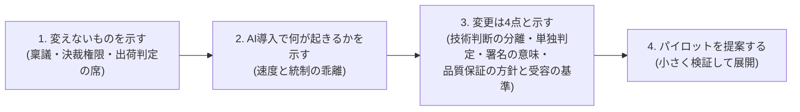

本プロジェクトの成果は、最終的に**各企業の品質管理部門・プロセス部門に提案し、承認を得て運用してもらう**ことを想定しています。このページは、そのための提案書テンプレートと進め方です。

品質統制に関する記述(提案書の5節と想定問答)は、[附属書H 品質保証の論証](/process-compass/phase4-process-design/assurance-case/)からの投影です。**本ページで回答を独自に書きません**。問答を単独で増やすと、条項の改訂に追随せず、互いに食い違うためです([ADR-0056](/process-compass/adr/0056-assurance-argument/)決定9)。

提案書は、**組織として品質を保証すると言える形**で書きます。品質を保証するのは本標準ではなく、本標準を適用する組織です([ADR-0057](/process-compass/adr/0057-organizational-quality-assurance/))。採用を判断する者が問う18の問い(品質保証と組織継続)への本標準の回答は、[附属書I 採用判断の手引き](/process-compass/phase4-process-design/adoption-guide/)にあります。提案書の §5 と想定問答から、附属書I を引いてください。

## 提案の戦略: 「変えない」から入る

品質管理部門への提案で最も効くのは、**何を変えないかを最初に示す**ことです。ピットイン方式は既存制度(稟議・決裁権限規程・出荷判定の席・作成を指示した者以外によるレビュー)を壊さない設計なので、提案書もその順で構成します。

**変える点を小さく見せません**。変更は4点あり、3点目は出荷判定の規程の改定を要します。品質保証部門の署名が何を意味するかを改める変更だからです。4点目は、トップマネジメントの記名を要します。組織として品質を保証すると主張するための方針と受容の基準を、トップマネジメントが定める変更だからです。「出荷判定の手続は変わらない」とは説明しません。



## 提案書テンプレート

```markdown
# 開発プロセス改定の提案: ピットイン方式の導入

- 提案者: <氏名・部署> / 提案日: YYYY-MM-DD
- 承認をお願いする事項: 本提案書 §7

## 1. 要旨(1ページ)
- 生成AIの開発利用が進む中、現行プロセスのままでは「無統制な野良利用」か
  「統制優先でAIの価値を殺す」かの二択になりつつある
- 本提案は、既存の品質統制の枠組み(出荷判定の席、作成を指示した者以外による
  レビュー、決裁制度)を保ったまま、AI利用を統制下に置く開発プロセスの導入を提案する
- 当社は、宣言した保証範囲について、組織として品質を保証すると主張できるようになる。
  主張は、トップマネジメントが記名する方針と受容の基準、案件ごとの保証範囲、
  出荷ごとの記名の3層で支え、成立条件を満たさない範囲は「品質保証の対象外」と示す
- 既存制度への変更点は4点(§4)。うち1点は出荷判定の規程の改定を要し、
  1点はトップマネジメントの記名を要する

## 2. 現状の課題
- <自社の実態を記載: AI利用の現状(野良利用の有無)、承認リードタイム、
  レビュー負荷、技術負債の状況など。定量データがあれば添付>

## 3. 提案するプロセスの概要
- 外殻: 現行の決裁制度と、出荷判定の席・判定者・時点をそのまま使用。
  出荷判定者の署名の意味は改める(§4 の3点目)
- 内側: AIが生成し人間が承認する協調ループ(仕様承認→AI実装→自動検証→独立レビュー)
- 全成果物に単一の人間の責任者(A)を割り当てる。AIは実行(R)のみで
  結果責任(A)を負わない
- 参照: <ピットイン方式参照モデルの資料を添付>

## 4. 既存制度への変更点(3点)
| # | 変更 | 理由 | 影響範囲 |
| --- | --- | --- | --- |
| 1 | 技術設計の判断を決裁階層から分離し、技術判断者(単独)へ委譲 | 決裁者の専門性と判断対象の乖離解消、滞留防止 | 対象案件の技術判断のみ。予算決裁は従来どおり |
| 2 | ゲート判定を合議から「単独判定+事前の非同期コメント」へ | 責任の一意化、判定の迅速化 | 対象案件のゲート運用のみ |
| 3 | 出荷判定者の署名の意味を定め、残存リスクの受容を事業決裁者の記名へ置く | 成立しなかった統制を誰が受容したかを記録に残す | **出荷判定の規程の改定を要する**。出荷判定者は、開示された未達・未測定への異議の有無を、決裁の記録へ記載する |
| 4 | トップマネジメントが品質保証の方針と受容の基準(1ページ・5項目)を記名し、残存リスクの受容をそれに照らす | 組織として品質を保証すると主張する根拠と、受容の基準を事前に定める。異議を退けた受容を一段上へ届ける | **トップマネジメントの記名を要する**。既存の品質方針の文書へ5項目を加える形でよい |

## 5. 品質統制の観点(品質保証部門への回答)
<!-- 本節は附属書H「品質保証の論証」からの投影。文言を独自に書き換えない -->
- 主張すること: 当社は、[保証範囲]について、組織として品質を保証する。
  保証の主体は本標準ではなく当社であり、最終責任はトップマネジメントが負う。
  主張は、出荷ごとに6つの成立条件を満たした変更に限る(附属書H H.1)。
  満たさない範囲は「品質保証の対象外として出荷した」と顧客へ伝える。
  欠陥が無いことの約束と、契約上の担保は含まない(H.2)
- 主張の構造: 層1 トップマネジメントが記名する品質保証の方針と受容の基準(テンプレ11)、
  層2 案件ごとの品質の約束と保証範囲(G-1)、層3 出荷ごとの記名(G-7・G-8)。
  法令・契約は受容の対象ではなく前提条件(H.3)
- 主張の根拠: AI を信頼することに置かない。AI と独立した検証、測った検出能力、
  確かめていない範囲の開示、受容の基準に照らした記名の受容に置く(H.1)
- 出荷判定: 品質保証部門が開発ラインの外から署名する点は変えない。署名の意味は
  改める。署名は、事前に定めた出荷基準を満たしていることと、定めた検証の記録
  および成立しなかった統制の一覧が揃っていることの確認である(H.5)。
  一覧に載った残存リスクの受容は、リリース決裁で事業決裁者が記名する。
  出荷判定者は、開示された未達・未測定への異議の有無を、決裁の記録へ記載する
- AI生成物の統制: AI の出力は未検証の入力として扱う。合意済みルールは自動検証(CI)
  で全件を検査し、作成を指示した者と別の人が確認する。AI によるレビューは
  判定に数えない(H.4)
- 成立しなかった統制の開示: 出荷ごとに「保証の開示」(H.6 の7項目)を提出する。
  <独立した人の確認を経ていない変更がある場合は、件数と H.6 の定型の文を記載>
- 調整の宣言: <テーラリングで外した項目・簡略化した項目と、その理由>
- 監査対応: 全ゲートの判定記録と、変更ごとの生成の条件(モデルの版・指示資産の版)
  を残す。提示する証跡は H.3 の「受け取る証跡」の列による
- 組織継続: AI が止まったときの縮退の能力、提供者を替えたときに残る資産と退出の予行、
  AI を使わない判断の力量と後継、止める権限、有事の決定者を示す。
  回答は附属書I の Q10〜Q18 から引く
- 懸念と対策: <想定問答から自組織で問われるものを選ぶ。回答は H.9 と附属書I から引く>

## 6. パイロット計画
- 対象: <1プロジェクト・3〜9名規模を推奨>
- 期間: <2〜3か月>
- 成功基準(事前に合意):
  - ゲート滞留時間: 現行の承認リードタイム比で悪化しない
  - 品質: 重大欠陥の流出 0 件
  - 記録: 全成果物に責任者が紐づき、判定記録の欠落 0 件
- 中止基準: <重大欠陥の流出、滞留の大幅悪化など>
- 計測: ゲート滞留時間・差し戻し率・レビュー所要時間を自動集計
- 記録: 保証の開示のうち、出荷判定と監査で参照された項目、参照されなかった項目、
  追加を求められた項目。保証の主張の成立判定(成立・対象外の件数と理由)
- 採用判断: パイロットの記録を附属書I の回答に当て、品質保証判定と組織継続判定を
  採用者が行う

## 7. 承認をお願いする事項
1. §4 の4点の変更を、パイロット対象案件に限り適用すること
   (3点目は、出荷判定の規程の改定を要する。4点目は、トップマネジメントの記名を要する)
2. パイロット結果の評価会(終了時)の設置
3. <必要な予算・体制があれば記載>
```

## 提案書で使わない表現

提案書は対外文書に準じて扱います。次の表現を使いません。理由と、代わりに使える表現は[附属書H](/process-compass/phase4-process-design/assurance-case/) H.8 によります。範囲・根拠・証拠を伴う「当社は、[保証範囲]について品質を保証する」は使えます。

- 範囲・根拠・証拠を伴わない「品質を保証する」
- 「本標準が品質を保証する」「ピットイン方式に準拠しているので品質保証済み」
- 「欠陥が無いことを保証する」「承認した人間が品質を保証する」「リスクを最小化している」
- 「独立検証済み」「第三者レビュー済み」「規格に適合」
- 「AI がレビューしたので検証済み」

「第三者レビュー」の語は、開発ラインの外の組織による検証に限って使います。同じ開発ラインの別の人による確認(G-6)は、「作成を指示した者以外によるレビュー」と書きます。既存制度を指して「第三者レビューを維持する」と書くと、G-6 を第三者検証として示す表現と紛れるためです(附属書H H.8・H.10)。

## 想定問答(提案時に必ず出る質問)

### 品質保証に関する問い(附属書H からの投影)

回答は[附属書H](/process-compass/phase4-process-design/assurance-case/) H.9 の該当する問いから引きます。H.9 に無い問いを受けたときは、附属書H の側へ問いを足し、本表はそこから引き直します。

| 質問 | 回答の骨子 | 出所 |
| --- | --- | --- |
| AIが作ったコードの品質は、誰が保証するのか | 本標準を適用した組織が保証する。保証の主体は本標準ではない。最終責任はトップマネジメントにある。席ごとに記名の責任者1名が結果責任を負い、AI は責任者にならない | H.1、H.9 問1 |
| 組織として「品質を保証する」と言えるのか | 言える。出荷ごとに、保証範囲に入る変更が6つの成立条件を満たす場合に限る。満たさない範囲は「品質保証の対象外として出荷した」と伝える。1名体制は、外部の確認者を置かない限り言えない | H.1、H.8、H.9 問24 |
| 承認した人の署名は、何を意味するのか | 独立レビュアは受入基準との一致と挙動の理解を示す。出荷判定者は、事前に定めた出荷基準の充足と、記録と保証の開示の完備を示す。事業決裁者は、開示された残存リスクの受容を記名する。いずれも成果物の正しさの承認ではない | H.5、H.9 問7 |
| AI のレビューは、レビューに数えるのか | 判定には数えない。条件を満たすとき検出の層として数え、検出率または「未測定」を開示する | H.4、H.9 問3 |
| レビューが形骸化しないか | 挙動要約は必要条件にとどまる。検出能力の実測、統制が作動した記録、内部監査の所見、欠陥の検出工程の分布で示す。差し戻し率 0% を良い状態と見なさない | H.7、H.9 問5 |
| 既存の出荷判定はどうなるか | 席・判定者・時点は変わらない。**署名の意味が変わり、出荷判定の規程の改定を要する**。署名は出荷基準の充足と、記録と開示の完備の確認になる。残存リスクの受容は、事業決裁者の記名へ置く。突合の対象に保証の開示が加わる | H.5、H.6、H.9 問7 |
| 未達が多いとき、品質保証部門は出荷を止められるのか | 出荷基準を満たさない場合と、記載が欠落している場合は差し戻せる。未達・未測定の多さでは差し戻せない。異議の有無を決裁の記録へ記載し、事業決裁者がそれを読んだうえで受容を記名する | H.5、H.9 問21 |
| 少人数の体制で作った成果物は、どう扱うのか | 独立した人の確認を経ていない範囲を、件数と定型の文で開示する。2名体制では、作成を指示していない側の確認で独立レビューが成立する。受け入れの可否は受け入れる側が決める | H.6、H.9 問8 |
| このプロセスで欠陥は減るのか | 減るという測定は無い。パイロットで自組織の値を測る | H.9 問17 |
| 事故が起きたときの契約上の責任はどうなるのか | 本標準は答えを持たない。各組織の法務部門が、契約と法令に基づいて扱う。社内の受容は、外部への責任を限定しない | H.9 問16 |

### 採用の判断と組織継続に関する問い(附属書I からの投影)

回答は[附属書I](/process-compass/phase4-process-design/adoption-guide/)の該当する問いから引きます。採否の判定は採用者が行います。

| 質問 | 回答の骨子 | 出所 |
| --- | --- | --- |
| 採用してよいかを、何で判断すればよいか | 18の問いへの回答の5要素(主張・範囲・根拠・証拠・限界と責任)と、即時保留・不採用の8条件で、採用者が判定する。本標準の回答は作成者の自己評価(E0)である | I.3〜I.5 |
| AI やベンダーが止まったら、事業は続くのか | 席ごとに人へ戻すか止めるかを決め、人へ戻したときに処理できる量を実測で示す。実測が無い間は「未確認」と表示し、期限つきで受容する | I.7 の Q13 |
| ベンダーを替えたら、何が残るのか | 仕様・受入基準・テスト・指示資産などを自組織のリポジトリに置き、別の提供者で回帰評価して退出を予行する | I.7 の Q14 |
| 10年後に、AI なしで判断できる人は残るのか | 判断を担う席の責任者は、AI を使わない判断の力量の確認を周期ごとに受ける。後継の状態を表示する | I.7 の Q16 |
| 速度を優先する圧力の中で、誰が止められるのか | 誰でも停止を申し立てられ、申し立てた時点で保留になる。件数を評価の減点に使わないことを、トップマネジメントが記名する | I.7 の Q17 |

### 提案の進め方に関する問い

| 質問 | 回答の骨子 | 出所 |
| --- | --- | --- |
| 単独判定は独断にならないか | 判定前の非同期コメント期間で関係者の意見を集める(根回しの構造化)。判定記録が残るため事後検証も可能 | [第4章](/process-compass/phase4-process-design/gate-criteria/)「ゲート運用の共通ルール」 |
| 失敗したらどうするか | パイロット限定・中止基準つき。従来プロセスへの切り戻しはいつでも可能 | 提案書 §6 |

## 提案の進め方

1. **事前の非同期共有**: 提案書を関係者へ事前配布し、コメントを集めて反映する(このプロセス自体が「単独判定+非同期コメント」の実演になる)
2. **パイロットで実証**: 小さく始めて計測データで語る。成功基準は事前合意しておく
3. **展開時にテーラリング**: パイロット後の展開では[テーラリングガイド](/process-compass/phase4-process-design/tailoring-guide/)で部署ごとの条件に調整する

:::note
このテンプレートは汎用の雛形です。実際の提案では §2(現状の課題)に自社の定量データを入れることが説得力を左右します。承認リードタイム・レビュー負荷・AI利用実態の3つは、提案前に必ず測っておくことを推奨します。
:::
