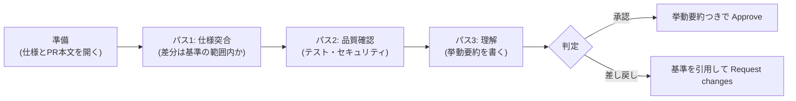

独立レビュー(G-6)の**実施手順**です。[ゲート判定チェックリスト](/process-compass/phase4-process-design/gate-criteria/)が「何を満たせば通過か」を定めるのに対し、このページは「レビュアが何をどの順に行うか」を定めます。PR の作成側の手順は[PR 運用リファレンス](/process-compass/phase5-implementation/pr-workflow/)を参照してください。

## レビューの目的(2つ)

1. **統制**: 仕様(受入基準)にない変更が main に入らないことを、作成を指示した本人以外の目で保証する
2. **理解の分散**: AI が書いたコードを人間側が理解している状態を、組織に複数人分つくる(事業継続性)

目的2があるため、「動くから承認」は独立レビューでは不合格です。**レビュアが挙動を自分の言葉で説明できること**が通過条件に入っています。

## 実施手順: 3パス方式

1つの PR を3回、目的を変えて読みます。1パスで全部見ようとすると、指摘の粒度が混ざって見落としが増えます。



### 準備(5分)

- PR 本文の「対応タスク」から機能仕様・受入基準を開き、隣に並べる
- PR 本文の「検証方法と結果」欄を読む。**空欄・AI 出力のコピペならこの時点で差し戻す**(読み進めない)
- [レビューパッケージ](/process-compass/phase5-implementation/review-package/)を用いる場合、**索引部だけを開く**。注意喚起部はパス1の完了後に開く

:::caution
レビューパッケージの**注意喚起部をパス1の前に開いてはなりません**。手がかりを最初に提示すると挙げられていない箇所の確認が薄くなると、別分野の視覚的な探索課題を対象とした実験で報告されています。提示の順序の規定は[レビューパッケージの自動生成](/process-compass/phase5-implementation/review-package/)によります。
:::

### パス1: 仕様突合(10分)

- 差分を受入基準と突き合わせ、**基準にない変更が混ざっていないか**を見る(無関係のリファクタ・仕様外の「ついで実装」は AI 生成で最頻の混入物)
- 受入基準のうち、この PR が満たすはずの項目をチェックリストとして書き出す

### パス2: 品質確認(10分)

- テストが受入基準を**実際に**検証しているか(基準と無関係のテストで緑にしていないか)
- 境界値・異常系のテストがあるか(正常系だけの網羅はカバレッジ値が高くても不合格)
- 入力検証・認可・秘密情報の扱いなど、セキュリティの基本(詳細は観点チェックリスト)

### パス3: 理解(10分)

- 差分の中心部を読み、「この変更で何がどう動くようになったか」を**自分の言葉で1〜3行**にまとめる(挙動要約)
- 書けない場合は理解が足りていない。作成者に質問するか、コードへ説明コメントを要求する。**理解できないまま承認しない**

## 観点チェックリスト

承認前に全項目を確認します。コピーして PR コメントに貼ってよいです。

```markdown
## 独立レビューチェックリスト(G-6)

- [ ] 差分は受入基準の範囲内である(仕様外の変更が混ざっていない)
- [ ] 受入基準の各項目に対応するテストがある(基準とテストの対応を確認した)
- [ ] 境界値・異常系のテストがある
- [ ] 入力検証・認可・秘密情報の扱いに問題がない
- [ ] PR 本文の検証欄が作成者自身の言葉で書かれている
- [ ] 挙動を自分の言葉で説明できる(下の挙動要約を書いた)
- [ ] (コア機能のみ)設計意図の記録(ADR・判断記録)が完備している

### 挙動要約

<!-- 1〜3行。自分の言葉で -->
```

## 挙動要約の書式

「何が・どういう条件で・どう動くようになったか」を書きます。差分の言い換えではなく、**挙動**の説明にします。

| | 例 |
| --- | --- |
| 良い要約 | 「検索窓に2文字以上入れると 300ms 待ってから API を叩くようになった。入力途中の連打ではリクエストが飛ばない」 |
| 悪い要約(差分の言い換え) | 「debounce 関数を追加し、SearchBox から呼ぶようにした」 |
| 悪い要約(AI 転記) | PR 本文や AI の説明のコピペ。自分の理解の証明にならない |

## 差し戻しの作法

- 差し戻し理由は**必ず受入基準・チェックリストの項目を引用**する(「なんとなく不安」では作成者が直せない)
- 好みの指摘(命名の趣味・書き方の流儀)は差し戻し理由にしない。伝えたければ「参考」と明記した非ブロックのコメントにする
- 指摘は最初のレビューでまとめて出す。小出しの指摘はレビューを往復させ、ゲート滞留の原因になる
- 3回往復して収束しない場合は、PR ではなくタスク分解か仕様の問題。機能仕様サイクル(G-4)へ差し戻す

## AI をレビューに使う場合

- AI による事前レビュー(静的な指摘出し)は**パス2の補助**として推奨する。ただし AI の指摘の採否はレビュアが判断する
- **承認の権限は AI に与えない**(テーラリングの禁止事項「AI を結果責任に割り当てない」)。AI レビューで代替してよいのは指摘の列挙までで、挙動要約は必ず人間が書く

## 時間の目安と SLA

| 項目 | 目安 |
| --- | --- |
| 1回のレビュー所要時間 | 30分以内(超える PR はサイズ超過として差し戻し可) |
| レビュー依頼から判定まで | 2営業日以内(G-6 の SLA) |
| レビュー帯域の上限 | 1人あたり 1日 3〜4 件(超えるならレビュアを増やすかタスク粒度を見直す) |
