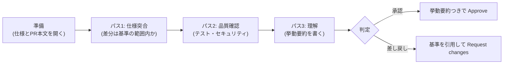

独立レビュー(G-6)の**実施手順**です。[ゲート判定チェックリスト](/process-compass/phase4-process-design/gate-criteria/)が「何を満たせば通過か」を定めるのに対し、このページは「レビュアが何をどの順に行うか」を定めます。PR の作成側の手順は[PR 運用リファレンス](/process-compass/phase5-implementation/pr-workflow/)を参照してください。

## レビューの目的(2つ)

1. **統制**: 仕様(受入基準)にない変更が main に入らないことを、作成を指示した本人以外の目で確かめる
2. **理解の分散**: AI が書いたコードを人間側が理解している状態を、組織に複数人分つくる(事業継続性)

目的2があるため、「動くから承認」は独立レビューでは不合格です。**レビュアが挙動を自分の言葉で説明できること**が通過条件に入っています。

承認が意味するのは、受入基準との一致を確かめたことと、挙動を説明できることです。全行を読んだことと、欠陥が無いことは意味しません([附属書H](/process-compass/phase4-process-design/assurance-case/) H.5)。

## 実施手順: 3パス方式

1つの PR を3回、目的を変えて読みます。1パスで全部見ようとすると、指摘の粒度が混ざって見落としが増えます。


```mermaid
graph LR
  P0["準備<br>(仕様とPR本文を開く)"] --> P1["パス1: 仕様突合<br>(差分は基準の範囲内か)"]
  P1 --> P2["パス2: 品質確認<br>(テスト・セキュリティ)"]
  P2 --> P3["パス3: 理解<br>(挙動要約を書く)"]
  P3 --> D{"判定"}
  D -->|承認| A["挙動要約つきで Approve"]
  D -->|差し戻し| R["基準を引用して Request changes"]
```

### 準備(5分)

- PR 本文の「対応タスク」から機能仕様・受入基準を開き、隣に並べる
- PR 本文の「検証方法と結果」欄を読む。**空欄ならこの時点で差し戻す**(読み進めない)。人確定・協働の変更では、AI 出力のコピペも差し戻す。開発者の席の委任の範囲の変更では、担い手が実行結果の証拠として書く欄であり、担い手の記載であることを理由に差し戻さない([第5章 5.5.6](/process-compass/phase4-process-design/human-ai-boundary/))
- PR 本文の変更の説明と、作成側の AI が残した推論の過程は、**この時点で読まない**。パス1 を終えてから読む(下記「入力の分離」)
- [レビューパッケージ](/process-compass/phase5-implementation/review-package/)を用いる場合、**索引部だけを開く**。注意喚起部はパス1の完了後に開く

:::caution
レビューパッケージの**注意喚起部をパス1の前に開いてはなりません**。手がかりを最初に提示すると挙げられていない箇所の確認が薄くなると、別分野の視覚的な探索課題を対象とした実験で報告されています。提示の順序の規定は[レビューパッケージの自動生成](/process-compass/phase5-implementation/review-package/)によります。
:::

### パス1: 仕様突合(10分)

- 差分を受入基準と突き合わせ、**基準にない変更が混ざっていないか**を見る(無関係のリファクタ・仕様外の「ついで実装」は AI 生成で最頻の混入物)
- 受入基準のうち、この PR が満たすはずの項目をチェックリストとして書き出す

### パス2: 品質確認(10分)

- テストが受入基準を**実際に**検証しているか(基準と無関係のテストで緑にしていないか)
- 境界値・異常系のテストがあるか(正常系だけの網羅はカバレッジ値が高くても不合格)
- 入力検証・認可・秘密情報の扱いなど、セキュリティの基本(詳細は観点チェックリスト)

### パス3: 理解(10分)

- 差分の中心部を読み、「この変更で何がどう動くようになったか」を**自分の言葉で1〜3行**にまとめる(挙動要約)
- 書けない場合は理解が足りていない。作成者に質問するか、コードへ説明コメントを要求する。**理解できないまま承認しない**

## 入力の分離

確認する側が作成側の説明を先に読むと、確認は作成側の主張に引き寄せられます。確認する側へ渡すものを、時点で分けます。

| 時点 | 渡すもの | 渡さないもの |
| --- | --- | --- |
| パス1 の完了まで | 仕様、受入基準、差分、レビューパッケージの索引部 | 作成側の説明文、作成側の主張(「影響なし」「確認済み」の類)、推論の過程、レビューパッケージの注意喚起部 |
| パス1 の完了後 | 上記に加えて、PR 本文の説明、レビューパッケージの注意喚起部 | — |

- 確認側の担い手に AI を置く場合、入力の分離は要求事項である([第3章 3.5.3](/process-compass/phase4-process-design/roles-responsibilities/))。AI へは、判断を出す前に作成側の説明文・主張・推論の過程を渡さない
- 人のレビュアは、同じ順序を本ガイドの手順として守る

:::caution[暫定 EV-0061 / 見直し 2027-03]
**対象**: 人のレビュアにも、作成側の説明をパス1 の後に読む順序を課す判断。
**根拠の水準**: E1(間接)。
**差し替え条件**: 人のレビューで、作成側の説明を先に読んだ場合と後に読んだ場合の、注入欠陥の検出率の差。後に読んだ場合の検出率が、先に読んだ場合を上回らないときは、人のレビュアへこの順序を課すのをやめ、手順から外す。上回るときは、維持する。AI を確認側に置く場合の要求事項(第3章 3.5.3)は、この判定で変えない。

作成側の説明文を除くと検出が上がる測定は、AI によるレビューを対象にしたものです(2026-09 時点)。人のコードレビューで同じ順序の効果を測った資料は見つかっていません。AI を確認側に置く場合の根拠の水準は、[ADR-0054](/process-compass/adr/0054-seat-accountable-performer/)の EV-0041 に開示しています。
:::

## 観点チェックリスト

承認前に全項目を確認します。コピーして PR コメントに貼ってよいです。

```markdown
## 独立レビューチェックリスト(G-6)

- [ ] 差分は受入基準の範囲内である(仕様外の変更が混ざっていない)
- [ ] 受入基準の各項目に対応するテストがある(基準とテストの対応を確認した)
- [ ] 境界値・異常系のテストがある
- [ ] 入力検証・認可・秘密情報の扱いに問題がない
- [ ] PR 本文の検証欄が記載されている。人確定・協働の変更では、作成者自身の言葉で書かれている。開発者の席の委任の範囲の変更では、担い手が書いた実行結果の証拠がある
- [ ] 挙動を自分の言葉で説明できる(下の挙動要約を書いた)
- [ ] (コア機能のみ)設計意図の記録(ADR・判断記録)が完備している

### 挙動要約

<!-- 1〜3行。自分の言葉で -->
```

## 挙動要約の書式

「何が・どういう条件で・どう動くようになったか」を書きます。差分の言い換えではなく、**挙動**の説明にします。

| | 例 |
| --- | --- |
| 良い要約 | 「検索窓に2文字以上入れると 300ms 待ってから API を叩くようになった。入力途中の連打ではリクエストが飛ばない」 |
| 悪い要約(差分の言い換え) | 「debounce 関数を追加し、SearchBox から呼ぶようにした」 |
| 悪い要約(AI 転記) | PR 本文や AI の説明のコピペ。自分の理解の証明にならない |

## 差し戻しの作法

- 差し戻し理由は**必ず受入基準・チェックリストの項目を引用**する(「なんとなく不安」では作成者が直せない)
- 好みの指摘(命名の趣味・書き方の流儀)は差し戻し理由にしない。伝えたければ「参考」と明記した非ブロックのコメントにする
- 指摘は最初のレビューでまとめて出す。小出しの指摘はレビューを往復させ、ゲート滞留の原因になる
- 3回往復して収束しない場合は、PR ではなくタスク分解か仕様の問題。機能仕様サイクル(G-4)へ差し戻す

## AI をレビューに使う場合

- AI による事前レビュー(静的な指摘出し)は**パス2の補助**として推奨する。ただし AI の指摘の採否はレビュアが判断する
- **承認の権限は AI に与えない**(テーラリングの禁止事項「AI を結果責任に割り当てない」)。AI レビューで代替してよいのは指摘の列挙までで、挙動要約は必ず人間が書く
- AI へ渡す入力は、仕様・受入基準・差分とする。作成側の説明文・主張・推論の過程を、判断の前に渡さない(前掲「入力の分離」)
- AI のレビュー用の指示は、レビューの対象となる変更から書き換えられない場所に置く
- 記録には「AI レビュー通過」と書かない。指摘の内容と、レビュアによる採否を残す
- AI の確認を「独立レビュー」と呼ばない。G-6 の判定に数えず、検出の層としてのみ数える([第3章 3.5.4](/process-compass/phase4-process-design/roles-responsibilities/)、[附属書H](/process-compass/phase4-process-design/assurance-case/) H.4)

### 委任を適用した変更(適用: CL0・R3 の変更)

委任([第5章 5.5.4](/process-compass/phase4-process-design/human-ai-boundary/))を適用した変更でも、**承認の権限は AI へ移りません**。G-6 の判定者は席の責任者(人)のままです。移るのは、判定の時点です。正本は 5.5.4 と、[第4章 G-6](/process-compass/phase4-process-design/gate-criteria/)「委任の変更は判定の時点を事後へ移す」です。

| 項目 | 変更ごとに確認する場合(人確定・協働) | 委任を適用した場合 |
| --- | --- | --- |
| 判定者 | 独立レビュア(人) | 同じ(人) |
| 判定の時点 | 次工程へ進める前 | 事後。独立レビュアの席の責任者が抜き取りで確かめる |
| AI の確認の位置づけ | 検出の層。承認として扱わない | 同じ |
| 本ガイドの3パスと挙動要約 | すべての変更で行う | 変更ごとには行わない。抜き取った変更について行う。G-6 の基準1〜5 は変わらない。抜き取りの頻度・数と、あわせて確かめることは、[第8章](/process-compass/phase4-process-design/tailoring-guide/)「事後監査の手続」による |
| 記録 | 承認記録と挙動要約 | G-6 を通過した変更として記録しない。人の事前確認を経ていない変更として、変更単位で識別する。抜き取った変更は、挙動要約を含む事後確認の記録を残す |
| 逸脱を検知したとき | 差し戻す | 該当する範囲を協働へ引き下げ、事前の判定へ戻す |

- 委任の条件と引き下げの手続は、5.5.4 と 5.5.7 による。本ガイドは条件を定めない
- 上表の「委任を適用した場合」は、独立レビュアの席が委任を宣言し、変更がその席の機械の規則に該当する場合を指す。開発者の席の規則にだけ該当する変更は、G-6 を事前に判定する。3パスを変更ごとに実施し、挙動要約を書く
- 委任を適用した変更のうち、抜き取られなかった変更では、目的2(理解の分散)は成立しない。コア指定の機能を委任の対象にしないのは、このためである
- 委任を適用した変更を「独立レビュー済み」と記録しない。件数は保証の開示に出る(附属書H H.6)

## 時間の目安と SLA

| 項目 | 目安 |
| --- | --- |
| 1回のレビュー所要時間 | 30分以内(超える PR はサイズ超過として差し戻し可) |
| レビュー依頼から判定まで | 2営業日以内(G-6 の SLA) |
| レビュー帯域の上限 | 1人あたり 1日 3〜4 件(超えるならレビュアを増やすかタスク粒度を見直す) |
