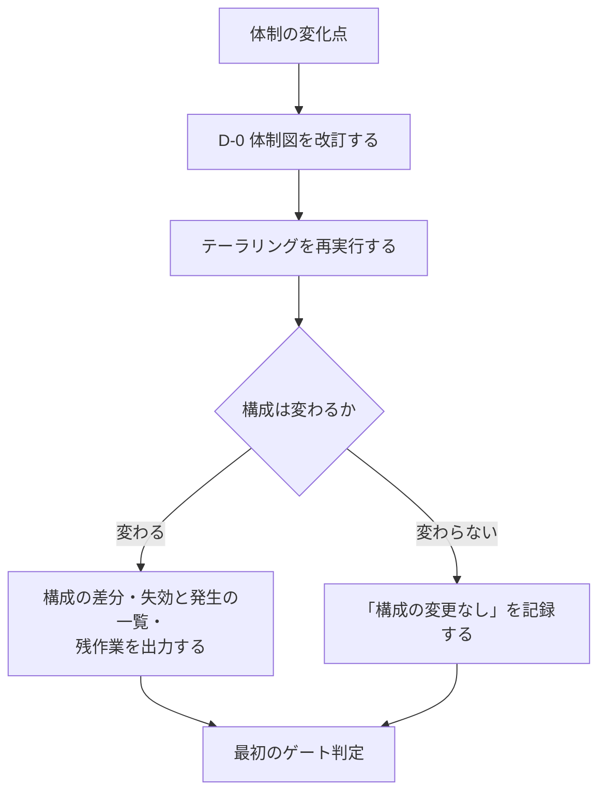
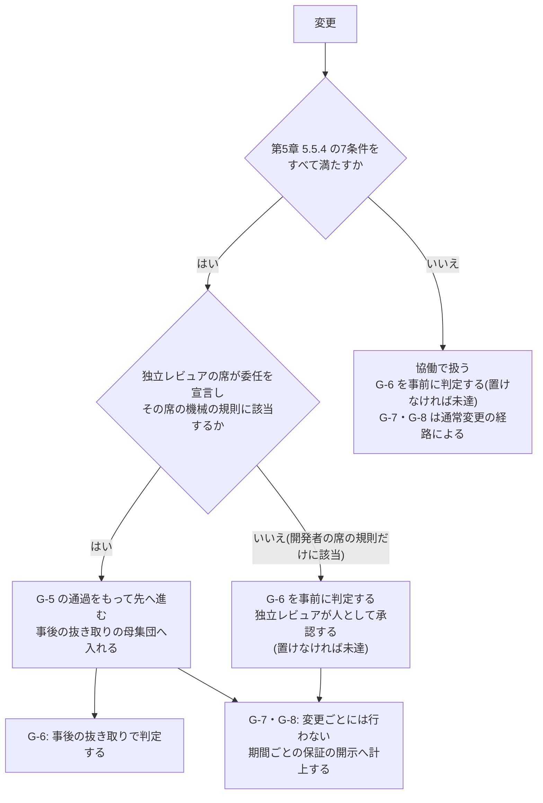

本標準は参照モデルであり、そのまま全組織に適用するものではありません。本章は、**組織の条件に応じて第1章から第7章の要求事項をどう調整するか(テーラリング)**を規定します。調整の対象となる構造は[ピットイン方式参照モデル](/process-compass/phase4-process-design/process-model/)が保持します。

:::note
本章の調整規則は、[プロセス提案ツール](/process-compass/tool/simulator/)の知識ベースとして機械可読な形式でも保持しています。本章が正本であり、データはその符号化です。データ構造は[知識ベーススキーマ設計](/process-compass/tool/knowledge-base-schema/)を参照してください。
:::

## 調整は宣言を伴う

**テーラリングは適合の放棄ではありません**。プロセスの国際規格では、規定された手順に従って調整し、その内容を宣言したうえで、調整後の状態で目的の達成を実証できる場合に適合の主張が認められます。本標準も同じ構成を採ります。

調整には次の3つを必ず伴わせます。いずれかを欠く省略は、本標準に基づく調整として扱いません。

| # | 要求事項 |
| --- | --- |
| 1 | 本章の調整軸に基づいて調整する(個別の判断で任意に省略しない) |
| 2 | **標準から外した項目、簡略化した項目を、理由とともに宣言する**(差分の一覧を残す) |
| 3 | 調整後の構成で、当該ゲートの目的が達成されることを示す |

要求事項2の宣言は、[附属書D](/process-compass/phase4-process-design/proposal-template/)の提案書に含めます。宣言のない省略は、後から妥当性を検証できません。

## 再テーラリングの契機

テーラリングは、案件の開始時に1回だけ行うものではありません。**体制の変化点が生じたときは、テーラリングを再実行しなければなりません**([ADR-0055](/process-compass/adr/0055-team-change-points/))。変化点の定義と手続の正本は[第3章 3.13](/process-compass/phase4-process-design/roles-responsibilities/)です。本節は、そのうち再テーラリングに関わる要求事項を規定します。

### 契機に数えるもの

D-0 体制図、テーラリングの入力(軸A〜E)、担い手の適合性確認の前提、のいずれかを変える変化を契機とします。

| # | 体制の変化点 | 変わる入力 |
| --- | --- | --- |
| 1 | 責任者の増減・交代・長期の不在、兼務の変更 | D-0 体制図、軸A。交代した席では、適合性確認の承認も失効する([第3章 3.4.2](/process-compass/phase4-process-design/roles-responsibilities/)) |
| 2 | 人数の境界の通過(3名未満と3名以上、10名) | 軸A |
| 3 | 担い手の運用形態の変更と、委任の範囲の変更 | D-0 体制図 |
| 4 | AI の担い手の識別の変更(モデルの版・提供者、指示資産の恒久層、ツールと権限、実行基盤) | 担い手の適合性確認の前提 |
| 5 | 軸B〜E の入力の変化(ステージ移行、規制への該当、委託への切替、安全重要度) | 軸B〜E |

変化点1 は、席の責任者の変化です。席の作業を複数の人が担う体制で、責任者でない担い手(人)が増減・交代した場合は、次のいずれかを満たすときだけ契機とします。

- 兼務禁止と独立の再判定に影響する
- 人数の境界を通過する

### 契機に数えないもの

次は契機に数えません。**「書かれていない」のではなく、数えないと決めたものです**。

| 数えないもの | 扱う規定 |
| --- | --- |
| 目的・範囲・納期・予算の変更のうち、上表の1〜5 へ波及しないもの | [第2章 2.10](/process-compass/phase4-process-design/lifecycle/)、[第7章 7.6](/process-compass/phase4-process-design/exception-escalation/)、ステージ移行ゲート |
| 短期の不在 | D-0 表5 の代理者が、定めた範囲で代行する。代理者の定めが無く判定期限を超過した場合は、[第3章 3.9.3](/process-compass/phase4-process-design/roles-responsibilities/)により、決定者の上位へ通知して代理の決定者を指名する。いずれの場合も席の責任者は変わらない。準拠テンプレートの D-0 が「代行者」と呼ぶ欄は、表5 の代理者に当たる |
| 版を固定したままのセッションの再起動と、並列数の変更 | なし(体制の変化ではない) |
| 提供者の一時的な障害と切り替え | [第3章 3.12.5](/process-compass/phase4-process-design/roles-responsibilities/)。切り替えの間は担い手の識別が変わるため、委任を協働へ下げる |
| 提供者の障害・利用上限で AI が使えない期間 | 期間と、その間の扱い(人へ戻した / 止めた)を D-0 の改訂履歴へ記録する。保証の開示の項目7 へ出す |
| 個々の変更のリスク区分の判定 | 変更ごとの判定であり、体制の変化ではない |

**納期だけの変更は、契機に数えません**。起票された場合は「構成の変更なし」と記録します。

納期を理由に統制を外す要求は、納期の変更ではありません。**統制を緩める向きの変更**として、次項の判定に掛けます。

### 再実行の時点と向き

| 項目 | 要求事項 |
| --- | --- |
| 時点 | 変化点の後、最初のゲート判定より前に再実行する。期限を日数では定めない |
| 緩める向きの変更(人の確認を減らす、委任の範囲を広げる、ゲートを省略へ変える) | 記名と理由を要する。決定するのは、対象の席の責任者、または D-0 表1「体制と運用形態」の決定者である([第6章 テンプレ0](/process-compass/phase4-process-design/deliverable-templates/))。**AI の名義の記名を受け付けない**。委任の範囲を広げる手続は、[第5章 5.5.7](/process-compass/phase4-process-design/human-ai-boundary/)による |
| 厳しくする向きの変更(人の確認を増やす、委任の範囲を狭める、委任から協働へ下げる) | 即時に適用する。記名を待たない |
| 人の離脱で成立しなくなった統制 | 緩める向きの決定として扱わない。**未達の発生**として、記名を待たず即時に構成へ反映し、表示する。旧い構成のまま止めない。この扱いは、体制内の人が実際に減った場合と、席の責任者が体制から外れた場合に限る。人が減っていないのに人の確認を減らす変更は、緩める向きの変更として扱う |
| ステージを前へ戻す変更(軸B を PoC へ戻すなど) | 記名と理由だけでは足りない。ステージ移行ゲート(SG)の判定を要する |
| 安全重要度が上がり、委任を適用できなくなった場合 | 抜き取り待ちの委任の変更を、協働の手続で全件確認し直す |
| 宣言の更新 | 再実行のたびに、「調整は宣言を伴う」の3つの要求事項を満たし直す |
| 結果が「構成の変更なし」の場合 | その結果を記録する |
| 記録の置き場 | D-0 の改訂履歴([第6章 テンプレ0](/process-compass/phase4-process-design/deliverable-templates/)の表8)と、構成の変更記録 |

緩める向きと厳しくする向きを非対称に扱うのは、[第5章 5.4.5・5.4.6](/process-compass/phase4-process-design/human-ai-boundary/)と同じ構成です。**再テーラリングのために、新しいゲート・会議体・台帳を設けません**。

体制の縮小を緩める向きの決定として扱わないのは、記名を待つ間、成立していない統制が成立しているものとして表示され続けるためです。人が抜けた時点で、統制は既に成立していません。未達のまま出荷するかどうかは、この手続ではなく既存の規定で決まります。

| 未達のまま出荷する対象 | 扱う規定 |
| --- | --- |
| R1 の変更 | [第7章 7.3](/process-compass/phase4-process-design/exception-escalation/)の例外承認を要する |
| CL1 以上の案件、および規制業の案件 | 出荷しない。軸E「人員が足りない場合」の選択肢による |
| 上記以外 | 未達を保証の開示へ表示し、リリース決裁(G-8)で受容を記名する |

期限を日数で定めないのは、値の根拠が無いためです。変化点の列挙と「最初のゲート判定より前」という時点は、製造と労働安全の変更管理からの類推です。開発体制へ転用した効果は測定されておらず、根拠の水準は ADR-0055 に開示しています。

### 準拠テンプレートが備える手段

準拠テンプレートは、変化点を構成へ反映する手段を備えなければなりません。全問を聞き直す初期化の再実行だけでは、何が失効し、何が新たに生じたかを特定できないためです。

| 区分 | 内容 |
| --- | --- |
| 入力 | 変化点の種別(「契機に数えるもの」の1〜5)、対象、変更後の値 |
| 出力1 | 構成の差分(席、ゲートの状態、未達、逸脱) |
| 出力2 | 失効と発生の一覧(失効する例外と適合性確認、解消する未達、新たに生じる未達と逸脱) |
| 出力3 | 残作業(やり直しを要する確認、再確認の期日、人が行う設定) |

<!-- impl IMPL-0028 target=process-change-skill state=delivered note="体制の変化点の種別を入力として構成の差分・失効と発生の一覧・残作業を出力する" -->

出力は構成の再生成までとします。**緩める向きの変更を、手段の側で確定させてはなりません**。確定は、記名した者の決定によります。

## 入力: 5つの調整軸

| 軸 | 選択肢 | 何に効くか |
| --- | --- | --- |
| A. チーム規模 | 1〜2名 / 3〜9名 / 10名以上 | ロールの兼務許容、独立レビューの方式 |
| B. 事業ステージ | S0 探索 / S1 価値確立 / S2 スケール | ゲートの厳格さ、コア指定の範囲、負債の扱い |
| C. 期待品質・規制 | 標準 / 高(社会インフラ・金銭) / 規制業 | 出荷判定の厳格さ、記録の粒度、監査対応 |
| D. 開発形態 | 内製 / 受託(発注側) / 受託(受注側) | 契約ゲートの位置、検収の扱い、価値責任者の所属 |
| E. 安全重要度 | CL0 / CL1 / CL2 / CL3 | 安全成果物の要否、AI自律レベルの上限、検証手法 |

:::note
軸の記号 A〜E は調整軸の識別子です。[AI実行形態](/process-compass/phase5-implementation/ai-environment/)の E1〜E3 とは関係ありません。
:::

### 軸B と事業ステージの対応

本章の軸Bは、[第2章 2.3](/process-compass/phase4-process-design/lifecycle/)の事業ステージに対応します。提案ツールは運用上の呼称で4区分を用いるため、対応を次のとおり定めます。

| 事業ステージ | ツールの区分 |
| --- | --- |
| S0 探索(別称 DR0) | 検証中(PoC) |
| S1 価値確立(別称 DR1) | 最初の顧客向け(MVP) |
| S2 スケール(別称 DR2) | 拡大中(グロース)、安定運用 |

S2 を2区分に分けるのは、負債の扱いとゲートの厳格さが実務上異なるためです。**規定上はいずれも S2 です**。

## 軸A: チーム規模による調整

| 項目 | 1〜2名 | 3〜9名 | 10名以上 |
| --- | --- | --- | --- |
| 価値責任者×技術判断者の兼務 | 許容(1人が両方) | 避けたい(兼務しないことを推奨) | 兼務禁止 |
| 独立レビュー | **作成を指示した本人以外の確認者**に置く。2名体制は相手、1名体制は外部(他チーム・コミュニティ・別部門)。置けない範囲は**未達として表示**する | チーム内の、作成を指示した者と別の人 | チーム内+コア機能は別チーム |
| 出荷判定 | 価値責任者が兼ねる([3.5.2](/process-compass/phase4-process-design/roles-responsibilities/)の代償措置を満たすこと) | 兼務者を指名 | QA部門・専任 |
| 機能仕様承認の委譲 | 不要(全部自分) | 必要に応じて | 機能責任者へ積極委譲 |
| 市場・顧客仮説の検証(D-0 表1) | 価値責任者が兼ねる。兼ねられない場合は**未達として宣言**する | 兼務者を指名 | 実施の担い手を分けて指名 |
| 価値責任者の顧客接点 | 自ら顧客に接する、または検証の設計と発注ができる | いずれかを満たす者を任命 | 同左 |
| 検証活動の費用 | 期間予算の内訳として明示する | 同左 | 同左 |

10名以上の規則のうち、実行層が確かめるのは次の範囲です。コア機能(確約範囲・コア指定のパス。構成の `delegation.protectedPaths`。委任を適用しない案件にも宣言できる)に触れる変更の独立レビューに、作成を指示した者と別の所属(人の名簿の `team`)の人を含むかを、出荷判定の証跡の集約が保証の開示の項目1 に件数で出します。出荷判定者の席の責任者の所属が開発者の席の責任者と別かは、同じ項目へ出します。所属の欄が無い名簿、コア指定のパスの未宣言は「判定できない」と出ます。いずれも記載の欠落にはしません(この表は調整の手引きであり、要求事項の条項ではないため)。機能責任者への仕様承認の委譲は、席と記録のどちらも無く、機械では確かめません。実装の台帳に「降りていない」と開示し、採用者が手で代える手順を置きます(#288 第6巡)。次の一手(`/pit`)は、直近の出荷の集約の出力が手元にあれば、同じ件数を同じ文で注記に添えます。集約の後に既定ブランチが進んでいれば、その旨も出ます(#288 第7巡)。

<!-- impl IMPL-0084 target=evidence-aggregation state=delivered note="10名以上の規則「コア機能は別チームがレビューする」(構成 review.mode: internal-plus-core-external)。コア機能のパス(delegation.protectedPaths)に触れ独立した人の確認に数えた変更ごとに、数えた承認者に作成を指示した者と別の所属(名簿の team)の人を含むかを保証の開示の項目1 に件数で出す。パス未宣言・所属の欄なしは「判定できない」。欠落にはしない(#288 第6巡)" -->

<!-- impl IMPL-0085 target=claude-md state=delivered note="10名以上の規則「出荷判定は QA 部門・専任」(構成 gates.g7.params.approverMode: dedicated-qa)。CLAUDE.md の構成依存部分と next.mjs に規則を常駐させ、出荷の集約が出荷判定者の席の責任者の所属(名簿の team)が開発者の席の責任者と別かを項目1 に出す。所属の欄が無ければ「確かめられない」(#288 第6巡)" -->

<!-- impl IMPL-0090 target=next-role state=delivered note="10名以上の規則の項目1 の件数(コア機能の変更の承認者の所属、出荷判定者の所属)を、next.mjs が直近の出荷の集約の出力(evidence/evidence.json)から、集約と同じ文(org-assurance.mjs の coreReviewText・qaAffiliationText)で注記に添える。同じ所属の承認者だけの変更があれば件数を強調し、出荷判定者が判定記録の人が判断する項目に扱いを書くよう案内する。集約の出力が無ければ件数を出さず、読む所在だけを出す。集約の後のコミット数を添える(#288 第7巡 U)" -->

<!-- impl IMPL-0086 target=config-roles state=undelivered note="10名以上の規則「機能責任者へ仕様承認を積極委譲する」。機能責任者の席も委譲の記録も構成に無く、G-4 の判定者は価値責任者の席のまま。機械では確かめない。採用者は委譲の有無と判定者を社内の手順で定め、附属書I I.10 の様式に手で代える手順を書く(#288 第6巡)" -->

最小体制(3名)未満では、作成指示者・レビュア・判定者の兼務禁止が成立しません。1〜2名の場合も、**独立レビューだけは、作成を指示した本人以外の人に求めます**。独立は人の単位で定義するため、確認者を誰に置くかは人数で変わります([第3章 3.5.4](/process-compass/phase4-process-design/roles-responsibilities/)、[ADR-0054](/process-compass/adr/0054-seat-accountable-performer/) 決定7)。

| 体制 | 独立レビュー(G-6)の確認者 | 出荷判定(G-7) |
| --- | --- | --- |
| 2名 | 作成を指示していない側の人。**この相互の確認で G-6 は成立する**。相手も作成の指示に関与した変更は、外部へ依頼する。置けなければ未達 | 兼務。代償措置つきの逸脱([第3章 3.5.2](/process-compass/phase4-process-design/roles-responsibilities/)) |
| 1名 | 外部(他チーム・別部門・社外コミュニティ)へ依頼する。置けなければ未達 | 同上 |

[ADR-0028](/process-compass/adr/0028-unmet-gate-distinct-from-omitted/) 決定1 の「外部のレビュア」は、「作成を指示した者以外の確認者」と読みます。2名体制で成立するのは G-6 だけです。出荷判定者の兼務は、3名未満では逸脱のままです([ADR-0029](/process-compass/adr/0029-shipping-approver-merge-exception/))。

確認者を置けない場合、独立レビュー(G-6)は**未達**です。CI(機械検証)の基準の引き上げと AI による確認は、代償措置として記録し、未達のまま表示します。**代償措置を、未達の解消や独立レビューの代替として扱いません**([ADR-0028](/process-compass/adr/0028-unmet-gate-distinct-from-omitted/) 決定6)。

担い手の運用形態の上限(人確定・協働・委任)は、チーム規模では変わりません。上限は変更ごとのリスク区分で決まります([第5章 5.5](/process-compass/phase4-process-design/human-ai-boundary/))。**1名の体制であることを理由に、協働や委任の範囲を広げてはなりません**。

### 外部の確認者を高リスクの変更へ集中させる(適用: チーム規模 1〜2名)

1〜2名の体制でも、型は変えません。G-6 は作成を指示した本人以外の確認者に置き、置けなければ未達として表示します。G-7 は代償措置つきの逸脱として表示します([第3章 3.5.2](/process-compass/phase4-process-design/roles-responsibilities/))。

本節が扱うのは、外部の確認者を要する変更です。1名体制の変更と、2名体制で相手も作成の指示に関与した変更が当たります。2名体制で相手が確認できる変更は、相互の確認で成立するため、本節の配分の対象になりません。外部の確認者の帯域は、変更ごとのリスク区分に応じて配分してよいものとします([ADR-0054](/process-compass/adr/0054-seat-accountable-performer/) 決定8)。

| 変更のリスク区分 | 独立レビュー(G-6)の扱い | 表示 |
| --- | --- | --- |
| R1 | 外部の確認者を**集中させる**。G-6 未達のまま出荷する場合は、[第7章 7.3](/process-compass/phase4-process-design/exception-escalation/)の例外承認を要する | 例外承認の記録(記名、回収の期限) |
| R2 | 外部に置く。置けなければ未達 | 未達の変更の**件数をリリースごとに**表示する |
| R3 | [第5章 5.5.4](/process-compass/phase4-process-design/human-ai-boundary/)の委任の条件をすべて満たし、独立レビュアの席が委任を宣言していて、その席の機械の規則に該当する変更に限り、判定の時点を事後の抜き取りへ移せる。開発者の席の規則にだけ該当する変更と、条件を満たさない変更は R2 の行による | 事後へ移した変更を、人の事前確認を経ていない変更として、変更単位で識別する |

- R1 に例外承認を課すのは、R1 が事後の取り消しを前提にできないためである([第3章 3.8.1](/process-compass/phase4-process-design/roles-responsibilities/))。検出してから取り消すという代償が成立しない
- R2 の未達を案件単位の1行ではなくリリースごとの件数で示すのは、変わらない表示は読まれなくなるためである([第5章 5.7.5](/process-compass/phase4-process-design/human-ai-boundary/))
- 抜き取りを行う者が作成を指示した者と同一人物である場合、独立は成立しないままである。その旨を保証の開示([附属書H](/process-compass/phase4-process-design/assurance-case/))へ表示する
- 本節の配分を適用できるのは、1〜2名の構成が認められる案件までである。安全重要度 CL1 以上および規制業では、1〜2名の構成そのものを認めない(ADR-0028)

**この配分は独立を作りません**。整えるのは開示であり、人の確認を高リスクの変更へ寄せることだけです。外部の確認者を置けない1名の体制では、R2 の変更は、別の人が出荷前に見ることなく出荷されます。残るのは、壊れたことを後から検出して取り消せる状態だけです。

:::caution[暫定 EV-0054 / 見直し 2027-03]
**対象**: 1〜2名の体制で外部の確認者を R1 の変更へ集中させ、R2 の未達をリリースごとの件数で表示する配分。
**根拠の水準**: E1(間接)。
**差し替え条件**: R2 の未達のまま出荷した変更のうちリリース後に欠陥が判明した割合と、外部の確認を経た変更での同じ割合。前者が後者を上回る場合は、R1 への集中をやめ、R2 の変更にも外部の確認者を割り当てる。差が無いか下回る場合は、配分を維持する。

人の確認は回数が増えるほど阻止率が下がるという測定はありますが、許可プロンプトの承認を対象としたベンダーの自己報告です(2026-09 時点。`research/282-survey-2026-09/`)。成果物の独立レビューへの外挿であり、この配分で見逃しが減るかは測定していません。
:::

### 市場・顧客仮説の検証が成立しない場合

[ADR-0031](/process-compass/adr/0031-market-hypothesis-by-structure-not-fields/)は、市場・顧客仮説の検証を、企画書の欄ではなく体制と予算の側で担保すると定めました。担保の箇所は、D-0 表1 の決定の種類、価値責任者の任命基準、期間予算の内訳の3つです。1〜2名の体制では、この3点は兼務で成立するか、成立しないかのいずれかになります。

**「省略してよい」とは規定しません**。仮説を誰も検証しない構成は、当該の目的が達成されることを示せていない状態です。[ADR-0028](/process-compass/adr/0028-unmet-gate-distinct-from-omitted/)の区別では、これは省略ではなく未達に当たります。

| 状態 | 条件 | 宣言の仕方 |
| --- | --- | --- |
| 兼務で成立する | 価値責任者が自ら顧客に接する。または検証の設計と発注ができる | **兼務を宣言して適用する**。D-0 に兼務を明記し、費用を期間予算の内訳へ書く |
| 成立しない | 顧客接点を持たず、調査を発注する予算もない | **未達(`unmet`)として宣言する** |

未達の宣言には、独立レビュー(G-6)の未達と同じ3点を書きます。

| # | 書く内容 |
| --- | --- |
| 1 | 未達の理由(顧客接点の不在、予算の不在のいずれか、または両方) |
| 2 | 代償措置。記録しても**未達の解消として扱わない** |
| 3 | 調達先。**未記入は未記入として表示する** |

<!-- impl IMPL-0006 target=config-unmet state=delivered note="目的を達成する構成を示せないゲートを未達として宣言する" -->

調達先には、開発ラインの外にいる人から反応を得る経路を書きます。例は次のとおりです。

- 公開して、コミュニティの反応と利用の実績を観測する
- 他の個人開発者と相互に仮説を評価する
- 業務上の接点を持つ既存の顧客・同僚へ聞き取る
- 外部の助言者へ、検証の設計だけを依頼する(実施は自分で行う)

代償措置として置けるのは、未検証であることの記録と、見直しの期日の設定に限られます。**仮説の当否は、これらでは分かりません**。

### 極小規模での事後監査への切替

軸Aの表は、1〜2名の体制でも、独立レビュー(G-6)だけは作成を指示した本人以外の人に求めると定めています。ただし相手や外部への依頼は待ち時間を伴います。ライブラリのパッチ適用や文言修正のような定常変更へ一律に適用すると、変更のたびに滞留が生じます。本節は、**判定の時点をリリース前からリリース後の抜き取りへ移す**調整を規定します。

**判定の省略ではありません**。判定はなくならず、時点と対象範囲が変わります。

本節は、[第5章 5.5.4](/process-compass/phase4-process-design/human-ai-boundary/)の委任を、1〜2名の体制へ適用したものです。**切替の条件を、本節で独自に定めません**。本節は以前、3条件での切替を定めていました。これを 5.5.4 の7条件へ改めています([ADR-0054](/process-compass/adr/0054-seat-accountable-performer/))。3条件と7条件が併存すると、緩いほうだけが使われるためです。

7条件は、登録した変更種別に当たる個別の変更へ当てる条件です。**種別を登録できるかどうかは、7条件より前に決まります**。登録した種別には AI自律レベル L3 を適用するため、第5章 5.4.6 の検知条件を計測できない範囲では、種別を登録できません。計測の基盤を持たない体制は、人数にかかわらず、本節の切替を使えません。

#### 委任・標準変更・L3 は同じ変更種別を指す

切替の対象は、事前に登録した変更種別です。本標準には、登録した変更種別を指す語が3つあります。**3つは同じものを指します**。

| 語 | 規定 | 登録した変更種別について定めること |
| --- | --- | --- |
| 委任の範囲 | 第5章 5.5.4 | 変更ごとの検証を担い手へ委ねる。独立レビュアの席の規則にも該当する変更に限り、人の事前確認なしに先へ進め、独立レビュアの席の責任者が事後に抜き取りで確かめる |
| 標準変更 | [第3章 3.7.4](/process-compass/phase4-process-design/roles-responsibilities/)の標準変更カタログ | 事前承認済みとして扱い、G-5 の通過をもって実施する |
| AI自律レベル L3 | 第5章 5.4.2 | 機械が常時監視し、人が事後に確認する |

登録には、次を要求します。

| 項目 | 要求事項 |
| --- | --- |
| 登録する者 | リリース判定会(B-4)。B-4 を置かない体制では、D-0 表1「体制と運用形態」の決定者(人)。AI の名義の登録を受け付けない |
| 席の責任者が定めるもの | 登録された変更種別の内側で、自席の委任の範囲を宣言する。登録そのものは行わない |
| 登録の根拠 | 7条件の条件3・4。既存のテストで検出できることと、取り消しを実行した実績である。連続運用の期間を根拠にしない |
| 登録の前提 | 当該の種別に掛かる第5章 5.4.6 の検知条件を計測できること。継続的な集計を要する条件(自動承認の比率、差し戻し率、重複率と手戻り率)を含む。**計測できない種別は登録しない** |
| AI自律レベルとの関係 | 登録の判定が、当該の種別についての引き上げ(第5章 5.4.5)の判定を兼ねる。別の判定を重ねない |
| 登録の確定 | 人が確定する。範囲の拡大も同じである(第5章 5.5.5) |
| 該当を判定する機械の規則 | 規則の追加と範囲の拡大の手続は、第5章 5.5.7 による |
| 登録からの削除と範囲の縮小 | 厳しくする向きの変更である。検知した時点で適用する |

1〜2名の体制は B-4 を設置しません(後掲「会議体と体制図の調整」)。したがって登録するのは、D-0 表1「体制と運用形態」の決定者です。既定は事業決裁者です([第6章 テンプレ0](/process-compass/phase4-process-design/deliverable-templates/))。

登録の前提にいう計測は、判定の履歴を期間で集計する仕組みを指します。保証の開示の項目6 が示す検出能力の測定(欠陥注入による検出率。第5章 5.6.2)とは別の量です。検出能力が「未測定」の体制でも、5.4.6 の検知条件を計測できていれば、種別を登録できます。逆は成り立ちません。

#### 切替が成立する条件

代替の根拠は「機械が代わりに読むこと」ではなく、**壊れたことを検出でき、壊れたら取り消せること**に置きます。

条件の正本は第5章 5.5.4 です。下表は、各条件が 1〜2名の体制で何を意味するかを示します。

| # | 条件(要旨) | 1〜2名の体制での意味 |
| --- | --- | --- |
| 1 | 案件の安全重要度が CL0 で、規制業に該当しない | 1〜2名の構成が認められる範囲と同じである(軸E「人員が足りない場合」) |
| 2 | 変更がリスク区分 R3 で、登録した変更種別に当たる。該当は機械の規則で判定する | 行為する AI 自身に、該当を判定させない。規則で分類できない変更は協働へ落とす。種別の定め方は「対象にできる変更の境界」による |
| 3 | 機械検査(G-5)の全項目を通過し、変更箇所の挙動を既存のテストで検出できる | 事後の抜き取りは不具合の検出手段ではない。検出は機械が担う |
| 4 | 単独で取り消せ、取り消しを実行した実績がある | 抜き取りまでの間、誤りが残り続けることを許容するための条件である |
| 5 | 確約範囲(SC-M)とコア指定の機能に触れない | 取り消しても損害が残る変更を対象にできない |
| 6 | 独立レビュアの席の責任者が、事後に抜き取りで確かめる。逸脱を検知したら協働へ引き下げる | 抜き取りは G-6 の判定であり、「事後監査の手続」により行う。委任した席の責任者が行うのは、範囲と条件を定めることと、逸脱を検知したときの引き下げである。別の人を抜き取りの実施者に置けないときは、その旨を開示する |
| 7 | 委任で先へ進めた変更として、変更単位で識別できる。G-6 の判定を事後へ移した変更は、人の事前確認を経ていない変更として識別できる | 件数を保証の開示の項目1・3 へ載せる。G-6 の判定を事後へ移した変更を、G-6 を通過した変更として記録しない。開発者の席の規則にだけ該当し、独立レビュアが事前に承認した変更は、独立した人の確認を経た変更に数える |

条件4の「実績がある」は宣言ではなく実行の記録を指します。**一度も取り消したことのない経路を、取り消せる経路として数えません**。

#### 登録した種別の変更が通るゲート

7条件をすべて満たす個別の変更は、次のとおり扱います。

| ゲート | 個別の変更での扱い |
| --- | --- |
| G-5 自動検証 | 全項目の通過をもって先へ進む(第3章 3.7.4 の標準変更) |
| G-6 独立レビュー | 事後の抜き取りで判定する。判定者は独立レビュアの席の責任者のままである。事後へ移すのは、独立レビュアの席が委任を宣言し、変更がその席の機械の規則に該当する場合に限る。開発者の席の規則にだけ該当する変更は、G-6 を事前に判定する |
| G-7 出荷判定、G-8 リリース決裁 | 個別の変更ごとには行わない。登録時の事前承認と、期間ごとの保証の開示への計上で扱う |

- 期間は、事後の抜き取りと同じ周期で区切る。月次が既定である(「事後監査の手続」)
- 期間ごとの保証の開示は、出荷判定者が突合して記名する。出荷判定者は、開示された未達・未測定への異議の有無を記載する。開示された未達の受容は、事業決裁者が記名する([第4章 G-8](/process-compass/phase4-process-design/gate-criteria/)、[附属書H](/process-compass/phase4-process-design/assurance-case/) H.5)
- 本番環境への反映の承認(第5章 5.4.3)には、登録時の記名による事前承認が当たる
- **出荷判定者の席とリリース決裁の席は委任しない**。変更ごとに判定しないことは、席を AI へ渡すことではない
- 条件を1つでも欠く変更は、協働で扱う。G-6 は事前に判定し、G-7・G-8 は通常変更の経路による

#### 対象にできる変更の境界

低リスクを主観で判定させないため、満たすべき属性で定義します。

| 属性 | 境界 |
| --- | --- |
| 変更の種別 | 依存パッケージのパッチ更新、表示文言、スタイル、既定値の範囲内での設定変更 |
| 導入するもの | 新たな外部呼び出し・データ構造・権限のいずれも導入しない |
| 規模 | [第4章](/process-compass/phase4-process-design/gate-criteria/)の L0 の既定値を超えない |

**切替は上限の緩和を伴いません**。時点を動かす調整と、1件あたりの規模を広げる調整は別物です。

種別の列挙は組織が拡張してよいものとします。ただし拡張は、事後監査の記録を根拠として行います。拡張は登録に当たり、前掲の登録の要求事項によります。委任の範囲を広げる変更であり、緩める向きの変更です。手続は第5章 5.5.7 によります。

#### 事後監査の手続(適用: 委任を適用した R3 の変更。体制の規模によらない)

この手続は、委任([第5章 5.5.4](/process-compass/phase4-process-design/human-ai-boundary/))の条件6 の手続です。1〜2名の体制に限らず、委任を適用するすべての体制で用います。

| 項目 | 規定 |
| --- | --- |
| 実施者 | 独立レビュアの席の責任者。作成を指示した者と別の自然人とする。2名体制では、作成を指示していない側の人が当たる。別の人を置けないときは、責任者本人が抜き取り、その旨を保証の開示([附属書H](/process-compass/phase4-process-design/assurance-case/) H.6)へ表示する。**本人による抜き取りを、独立した確認として数えない** |
| 頻度 | 月次を既定とする |
| 対象 | 当月の切替対象リリースから抜き取る。**全件ではない** |
| 抜き取り数 | 組織で定める。定めがない場合、当月の全件と5件のいずれか少ないほう |
| 確認すること | 抜き取った変更について、G-6 の基準1〜5([第4章 G-6](/process-compass/phase4-process-design/gate-criteria/))。挙動要約を含む。あわせて、切替条件の充足、取り消し可能性の実在、種別の逸脱 |
| 記録 | ゲート判定記録(テンプレ4)と同じ書式で残す |

委任で移るのは判定の時点であり、判定基準は変わりません。抜き取った変更には、事前に判定する場合と同じ基準を当てます。抜き取られなかった変更は、G-6 の基準で確かめられていないままです。

対象の抽出方法と所見の是正の追跡は、[フェーズ6(プロセス内部監査)](/process-compass/phase6-operation/process-audit/)によります。実施者は上表によります。本項の事後監査は、同ページの手続を極小規模の切替へ適用したものです。**別の監査を新設したものではありません**。

逸脱を見つけた場合、当該の変更を差し戻すのではなく、**切替の適用範囲を狭めます**。稼働中の変更を事後に差し戻す手続は、取り消し可能性の担保とは別の問題です。

逸脱が2期連続で出た場合、切替を停止してリリース前の判定へ戻します。

適用範囲を狭めることは、該当する変更種別を協働へ引き下げることに当たります。厳しくする向きの変更であり、検知した時点で適用します。

:::caution[暫定 EV-0004 / 見直し 2027-08]
**対象**: 抜き取り数(当月の全件と5件のいずれか少ないほう)と、切替を停止する条件(逸脱が2期連続)。
**根拠の水準**: E0(なし)。
**差し替え条件**: 自組織における、抜き取り数別の逸脱検出率。

抜き取り監査の標本設計に関する一般的な手法はありますが、この用途で必要な抜き取り数を測った資料を確認できていません。
:::

#### AI の確認を独立した人の確認に数えません

AI による確認を、独立した人の確認に数えません。自動レビューエージェントの判定も、文脈を分けた別の AI による再レビューも同じです。**G-6 の未達は、AI の確認では解けません**。理由は次のとおりです。

| # | 理由 | 根拠 |
| --- | --- | --- |
| 1 | 独立は責任者(人)の単位で定義する。責任者が同一人物なら、AI を何体に分けても独立は成立しない。AI を担い手に置いて得られるのは、文脈と入力の分離までである | [第3章 3.5.4](/process-compass/phase4-process-design/roles-responsibilities/)、[ADR-0054](/process-compass/adr/0054-seat-accountable-performer/) 決定7 |
| 2 | AI の推定による判定は、判定に数えない。検出の層としてのみ数える | [附属書H](/process-compass/phase4-process-design/assurance-case/) H.4、[ADR-0056](/process-compass/adr/0056-assurance-argument/) 決定4 |
| 3 | 生成側の文脈を切り離した AI の再レビューでも、注入した欠陥の約 73% を見逃した測定がある | 2026-09 時点の外部の測定。切り離しで検出が上がる向きは複数の測定で一致するが、見逃しの値は1件の測定による。出典は `research/282-survey-2026-09/` |
| 4 | 生成物の確認を生成器へ委ねる構成は、**自動化バイアス**によって見落としを増やす方向に働く | [ADR-0028](/process-compass/adr/0028-unmet-gate-distinct-from-omitted/) |
| 5 | レビュー負荷の削減効果を測った一次資料を確認できていない | [第4章](/process-compass/phase4-process-design/gate-criteria/) |

モデルの系統を変えても、この扱いは変わりません。系統の違いは、独立と分離のどちらの条件にも数えません。

AI の確認の出力は、検出の層として、また監査の**入力**として使えます。判定そのものには使いません。

- 通過を理由に人の確認を減らさない。合否条件にも入れない
- 記録には「AI レビュー通過」ではなく、指摘の内容と採否を残す
- 代償措置として記録しても、未達の解消に数えない

R3 の変更のうち[第5章 5.5.4](/process-compass/phase4-process-design/human-ai-boundary/)の条件をすべて満たすものは、人の事前確認なしに先へ進められます(委任)。**これは、AI の確認を人の確認に数えた結果ではありません**。判定者は席の責任者のままで、移るのは判定の時点です。保証の根拠は、AI が代わりに読んだことではなく、壊れたことを検出でき、取り消せることに置きます。

#### 指示資産の監査証跡

AI を補助として使う場合、指示資産(プロンプト・恒久層コンテキスト)は成果物と同じ扱いにします。

- リポジトリへコミットし、変更履歴で追跡する
- リリースの記録に、そのとき有効だった指示資産の版を残す
- 版を特定できない実行の出力は、監査の入力に用いない

管理の責任は AI維持管理者が持ちます([第3章](/process-compass/phase4-process-design/roles-responsibilities/))。

#### 適用できない場合

| 条件 | 扱い |
| --- | --- |
| CL1 以上 | 認めない。回復可能であっても、監査までの期間に個人の権利へ影響が及ぶ |
| 規制業(軸C) | 認めない。判定の時点そのものが監査要件になる |
| 切替の適用中に、安全重要度が CL1 以上へ上がった。または規制業に該当した | 切替を即時に止める。抜き取り待ちの委任の変更は、協働の手続で全件を確認し直す |
| 緊急のセキュリティ修正 | 本節の対象外。[第7章 7.4](/process-compass/phase4-process-design/exception-escalation/)のファストトラックによる |

**緊急性は低リスクの根拠になりません**。急ぐ変更を本節で処理すると、事後監査の母集団が壊れます。

## 軸B: 事業ステージによる調整

| 項目 | S0(PoC) | S1(MVP) | S2(グロース) | S2(安定運用) |
| --- | --- | --- | --- | --- |
| 企画承認(G-1) | 簡略化(1枚企画書) | 標準 | 標準 | 標準 |
| 要件合意(G-2) | 省略可(仕様承認G-4に統合) | 標準 | 標準 | 標準 |
| 独立レビュー(G-6) | 省略可 | コア機能のみ | 標準 | 標準 |
| 出荷判定(G-7) | 省略可 | 簡略化 | 標準 | 厳格(変更影響の確認強化) |
| コア指定の範囲 | なし(全部使い捨て前提) | 最小限 | 拡大していく | 確定済みを維持 |
| 負債台帳 | 記録のみ(返却しない) | 記録+返却目安 | 計画返却の開始 | 定常の返却サイクル |

PoC の本質は「捨てる前提で速く学ぶ」ことなので、ゲートを大胆に省略します。ただし **PoC がそのまま本番化する事故**が最頻の失敗パターンです。PoC→MVP の切り替え時に「省略したゲートを復活させ、コア指定をやり直す」ことを、企画承認(G-1)の条件に含めてください。

S0 の「簡略化(1枚企画書)」は記述の分量を減らす調整であり、前節の宣言を外すものではありません。誰が市場・顧客仮説の検証を担い、費用をどこから出すかは、様式の大小によらず D-0 と期間予算へ記述します。**このために新しい様式を設けません**。

### 本軸が動かすもの、動かさないもの

**本軸が動かすのは、ゲートの有効・省略と、記録の厳格さです**。上表のとおり、ステージが上がるほど有効なゲートが増え、記録が厳しくなります。

**本軸は、強制層に置くと決めた規則そのものを動かしません**。強制層は「**違反を許容できない規則**」の置き場です([第3章 3.9](/process-compass/phase4-process-design/roles-responsibilities/))。ステージによって強制の可否が変わる規則は、**そもそも強制層に置くべきではありません**。

**この扱いは意図的な決定です**。「書かれていない」ではありません。

立ち上げ期の統制が過剰に感じられる場合、原因は次のいずれかです。

- **強制層に置く規則の選び方が誤っている** — 許容できる違反を強制層へ置いている。**規則を強制層から外す**([第3章 3.9](/process-compass/phase4-process-design/roles-responsibilities/)の判断による)
- **遮断の範囲が誤っている** — 規則は正しいが、遮断の対象が広すぎる。**範囲を絞る**
- **本軸で省略できるゲートを省略していない** — 上表を適用していない

**いずれもステージの問題ではありません**。強制層の設計の問題です。規定は[ADR-0050](/process-compass/adr/0050-enforcement-layer-is-not-staged/)によります。

### 実装スタックが未確定でも構成を初期化してよい

S0 では、**実装スタックが未確定のままプロセス構成の初期化を実行してよい**ものとします。実装スタックは S0 の出力であり、探索の前に決められる事柄ではありません([第2章 2.3](/process-compass/phase4-process-design/lifecycle/)、[ADR-0034](/process-compass/adr/0034-stack-is-output-of-exploration/))。

- 構成の初期化に、実装スタックの確定を前提条件として課さない
- 未確定は正規の状態であり、前節の未達(`unmet`)とは別物である
- 未確定を未達として宣言しない。未達の宣言は、目的を達成する構成を示せていない場合に限る
- SG-0 を通過した後も未確定が残る場合、そこで初めて未達として扱う

構成の側が未確定を表現できない場合、探索の結果を待たずにスタックが確定します。**確定を急がせる構成は、S0 の実測より前の選択を既成事実にします**。

## 軸C: 期待品質・規制による調整

| 項目 | 標準 | 高(社会インフラ・金銭) | 規制業(医療・金融等) |
| --- | --- | --- | --- |
| CI基準(G-5) | 参照モデルどおり | カバレッジ基準を引き上げ | +規制要件の自動チェック |
| 独立レビュー(G-6) | 1名 | コア機能は2名 | 2名+記録の監査対応書式 |
| 出荷判定(G-7) | 記録突合 | +限定的な抜き取り確認 | +規制当局向けエビデンス、AI関与範囲の明記 |
| AI利用の制約 | 制約なし | コア機能の設計判断はAI単独不可 | AI生成箇所のトレーサビリティ必須 |

規制業では「どこをAIが生成し、誰が承認したか」の追跡が監査要件になります。ゲート判定記録(テンプレ4)を最初から監査書式で運用してください。監査対応書式では、PR の承認だけでは記録になりません。変更ごとに G-6 の判定記録を残し、テンプレ4 の「監査対応書式」の表(2人目の判定者と、その人自身の挙動要約)を埋めます。出荷判定の証跡の集約は、記録の無い変更と、表の空欄を記録の欠落として扱います。

<!-- impl IMPL-0079 target=gate-record-template state=delivered note="規制業の監査対応書式(構成 review.recordFormat: audit)。テンプレ4 に「監査対応書式」の表(2人目の判定者・2人目の挙動要約)を置き、出荷の証跡の集約が、変更ごとの G-6 の判定記録の有無と表の記入を確かめる。PR の承認だけでは記録にしない(#288 第5巡)" -->

「高」の「コア機能は2名」は、構成の `gates.g6.params.coreReviewerCount`(値 2)として降ります。コア機能の変更かどうかは、構成に既にある2つの宣言だけで機械が判定します。確約範囲・コア指定のパス(`delegation.protectedPaths`。委任を適用しない案件でも宣言できる)と、区分の下限の規則のパス(`riskFloor.rules[].paths`)です。新しい欄は設けません。どちらも未宣言の構成では、G-5 と出荷の証跡の集約が「コア機能のパスが未宣言のため確かめられない」と出し、黙って全変更の数で通しません。コア機能の変更に要する承認者の数は、`review.reviewerCount`(規制業の2名)と `coreReviewerCount` の大きいほうです。要求に満たない変更は、G-5(`pr-rules`)が「承認者 N 名 / 要求 M 名(コア機能)」と警告し、出荷判定の証跡の集約が独立した人の確認を経ていない変更に数えます。

<!-- impl IMPL-0091 target=evidence-aggregation state=delivered note="軸C「高」のコア機能の独立レビュー2名(構成 gates.g6.params.coreReviewerCount)。コア機能の変更(delegation.protectedPaths と riskFloor.rules[].paths に当たる変更)の独立した人の承認者の数を、reviewerCount と coreReviewerCount の大きいほうで数え、満たない変更を「G-6 の承認者 N 名 / 要求 M 名(コア機能)」として独立した人の確認を経ていない変更に数える。パスが未宣言なら項目1 に「確かめられない」と出す。CLAUDE.md の構成依存部分と next.mjs にも常駐させる(#288 第8巡 Z7)" -->
<!-- impl IMPL-0092 target=pr-checks state=delivered note="G-5 の PR 単位の検査で、変更したファイルがコア機能のパスに当たる PR の承認者の数を coreReviewerCount で数え、満たなければ「承認者 N 名 / 要求 M 名(コア機能)」と警告する(合否にしない)。パスが未宣言なら、その旨を出す(#288 第8巡 Z7)" -->

## 軸D: 開発形態による調整

| 項目 | 内製 | 受託(発注側) | 受託(受注側) |
| --- | --- | --- | --- |
| 価値責任者の所属 | 自社 | **発注側に置く**(必須) | 受注側はなれない(機能責任者まで) |
| 契約ゲート | なし | G-2(要件合意)とG-8(リリース)を検収に対応づけ | 同左 |
| AI生成物の検収 | 不要 | **検収対象を仕様適合に限定**(生成手段を問わない)と契約に明記 | 同左 |
| コア理解の維持 | 自社開発者 | 発注側にも理解保持者を置く(丸投げ禁止) | 引き継ぎ文書の粒度を契約で規定 |
| 確約範囲(SC-M)の変更 | 価値責任者と B-2 の判定で完結 | **契約変更の起点として扱う**(追加費用・納期の再合意) | 同左。受注側は単独で確約範囲を動かせない |
| 知財潔白性の検査 | 自社で実施し記録する | **納品時の提出物として契約に明記**(テンプレ8 第7項) | 同左。実施と記録が納品要件 |
| 知財潔白性の結果責任 | 自社 | 受注側に負わせる場合、**検査の範囲と手段を契約で特定する**(「潔白であること」だけを書かない) | 同左 |
| 計画範囲・調整枠の調整 | 価値責任者の単独判定 | 同左(契約変更を伴わないことを契約に明記) | 同左 |
| 納品ごとの保証の開示 | 出荷ごとに作成する(G-7 基準9) | **納品ごとに受領する**。受領する記録として契約に明記する(テンプレ8 第8項) | 納品ごとに提出する。項目6 は対外の示し方による([附属書H](/process-compass/phase4-process-design/assurance-case/) H.6) |
| 委任の適用の合意 | 変更種別の登録は、リリース判定会(B-4)が行う。B-4 を置かない体制では、D-0 表1「体制と運用形態」の決定者が行う。席の責任者は、登録された種別の内側で、自席の範囲を宣言する([第5章 5.5.4](/process-compass/phase4-process-design/human-ai-boundary/)) | **適用するかどうかを契約で合意する**。適用する場合は、対象の変更種別を特定する(テンプレ8 第8項) | 合意した変更種別に限って適用する。合意が無い場合は適用せず、協働で扱う |

確約範囲(SC-M)を契約変更の起点に対応づける理由は、受託において範囲外の変更が追加費用と納期へ直結するためです。層を区別せずにすべての変更を契約変更として扱うと、通常の調整のたびに契約の手続が起動し、内側の反復が止まります。層の定義は[第2章 2.10](/process-compass/phase4-process-design/lifecycle/)によります。

受託では、AI生成コードの瑕疵担保責任が未整備の論点です(フェーズ2で確認)。現時点の推奨は「**検収基準を受入基準(spec)への適合に限定し、生成手段(人・AIの別)を契約上問わない**」構成です。これにより既存の検収実務に載せられます。

**この構成は知財潔白性の要求と矛盾しません**。検収は仕様適合の判定であり、知財潔白性は成果物の属性です。両者は別の軸として併存します。**知財潔白性の要求を、AI を利用する場合に限って課してはなりません**。人が書いたコードにも他者の著作物は混入するためです([第4章 G-5](/process-compass/phase4-process-design/gate-criteria/))。

**「知財潔白であること」だけを契約に書いてはなりません**。検知に完全さを期待できない以上、この文言は達成できない義務になります。契約に書くのは、実施する検査の範囲と手段、提出する記録、指摘が出た場合の措置です。

### 判定をどちらの組織へ置くか

上表が定めるのは所属です。**判定そのものをどちらの組織へ置くか**は、これとは別に決めます。決めないまま開始すると、独立レビューと出荷判定の位置が案件ごとに動き、責任の所在が契約の解釈に委ねられます。

| 判定 | 置く先 | 理由 |
| --- | --- | --- |
| 仕様承認(G-4) | **発注側**(固定) | 価値責任者の A を移せない |
| 技術設計(G-3) | どちらでもよい | 置いた側の技術判断者が A を負う |
| 独立レビュー(G-6) | どちらでもよい | 置いた側が読解の帯域を負う |
| 出荷判定(G-7) | **発注側**(固定) | 市場へ出す主体が判定する |
| リリース決裁(G-8) | **発注側**(固定) | 既存の決裁権限規程による |

G-6 を発注側へ置くと完成責任が移るという懸念があります。**レビューの実施は、成果物の完成の承認ではありません**。この区別を契約へ明記しない場合、実施そのものが承認と読まれます。

置き先による違いは次のとおりです。

| 置き先 | 発注側が確かめられること | 発注側が負うもの |
| --- | --- | --- |
| 発注側 | 実装が受入基準と一致すること | 読解の帯域 |
| 受注側 | 兼務禁止の記録が提出されたこと | 記録の受領と、その扱いの規定 |

検収の対象を仕様適合へ限定する構成は、どちらを選んでも変わりません。

### 強制層をどちらが所有するか

作成指示者と独立レビュアの兼務禁止は、[第3章 3.11.3](/process-compass/phase4-process-design/roles-responsibilities/)の強制層によって成立します。誘導層に書いた規則の遵守は保証されません。委託では、**この強制層をどちらの組織が所有するか**が兼務禁止の成否を決めます。

| 所有の形 | 兼務禁止の成立 | 発注側が確認できるもの |
| --- | --- | --- |
| 発注側がリポジトリと CI を所有し、受注側が作業する | 発注側の強制層で止める。ブランチ保護と出荷の証跡の集約の2つの層による([第3章 3.5](/process-compass/phase4-process-design/roles-responsibilities/)) | 判定の記録そのもの |
| 受注側が所有し、成果物を納品する | 受注側の運用に依存する | 提出された記録のみ |

2行目を選んだ場合、**発注側は兼務禁止を確認できません**。確認できるのは、受注側が提出した記録だけです。この差を締結時に決めず、後から監視で埋めようとしても埋まりません。委託が多層になるほど、監視の対象そのものが見えなくなります。

**監視によって兼務禁止を担保する構成を採りません**。所有を決めるか、確認できない状態を受け入れるかのいずれかです。受け入れる場合、その事実を契約の記録へ残します。

### 受領する記録が保証するもの

発注側が受け取るレビューパッケージは、**判定の手がかりであって品質の保証ではありません**([ADR-0023](/process-compass/adr/0023-review-package-cues-not-conclusions/))。知財潔白性の記録も同じ構造です。検査を実施した事実を示すものであり、潔白の証明ではありません([ADR-0021](/process-compass/adr/0021-ip-clearance-evidence-not-guarantee/))。

契約では次の3点を区別して書きます。

- 提出を求める記録の一覧と、その様式
- 記録が欠落した場合の措置
- 記録の内容と実態の不一致が判明した場合の措置

3点目が抜けやすい箇所です。**提出だけを義務にすると、提出の形式を満たす動機だけが働きます**。

### 保証の開示を納品ごとに受け渡す

受託では、納品ごとに保証の開示([附属書H](/process-compass/phase4-process-design/assurance-case/) H.6)を受け渡します。発注側の出荷判定(G-7)とリリース決裁(G-8)は、受注側の工程で成立しなかった統制を、この開示で知ります。

- 保証の開示は、受領する記録の1つである。判定の手がかりであり、品質の保証ではない
- 組織の外へ渡す文書である。項目6(検出能力)は検出率の値ではなく、測定している事実・測定時点・推移の向きで示す(附属書H H.6)
- 委任([第5章 5.5.4](/process-compass/phase4-process-design/human-ai-boundary/))を適用するかどうかは、契約で合意する。合意の無い委任の変更を、納品へ含めてはならない
- 委任で先へ進めた変更は、開示の項目3 へ件数で現れる。そのうち G-6 の判定を事後へ移した変更は、人の事前確認を経ていない変更として数える
- 合意の内容は、[第6章 テンプレ8](/process-compass/phase4-process-design/deliverable-templates/)の第8項へ記載する

委任の適用を契約で合意するのは、発注側が受け取る変更のうち、人が事前に見ていないものの範囲を、締結時に知っておくためです。納品の後に開示で初めて知る構成では、受け入れる側に選択の余地が残りません。

### 受け入れの速度を契約で合意する

受注側の検証が不十分な場合、その分は発注側の判定帯域へ移ります。帯域は増えません。[第4章 G-6](/process-compass/phase4-process-design/gate-criteria/)の同時保有数の上限は、委託でも同じように働きます。

- 上限に達した場合、受け入れを止める。**判定を省略して受け入れない**
- 期間あたりに受け入れる変更単位の数を、契約または個別の合意で定める
- 上限へ繰り返し到達する場合、原因は受注側の検証の水準にある。受け入れ速度ではなく、そちらを是正の対象とする

### 計算資源の負担を決める

エージェントの実行に伴う計算資源の費用は、変更の量ではなく試行の回数で増えます。自己修復のループが収束しない場合、費用は成果物を伴わずに増加します。**この費用の帰属を契約で定めない場合、増加が判明した時点で交渉になります**。

契約に定める項目は次の3点です。

| # | 定める内容 |
| --- | --- |
| 1 | 費用の負担者。実行環境の所有者と一致させる |
| 2 | 期間あたりの上限額と、上限へ到達した場合の措置 |
| 3 | 上限を超える実行を許可する手続と、その承認者 |

上限へ到達した場合の措置は、[計算資源とコスト戦略](/process-compass/phase5-implementation/compute-strategy/)の強制停止によります。**超過を検知して報告する構成を採りません**。報告は費用が発生し終えたあとに届きます。

費用の負担者は、実行環境を所有する側とします。所有していない側へ負担させた場合、費用を抑える操作はその側にありません。

### 発注側に読解の帯域がない場合

発注側が AI 生成コードを読み解けない状態で、受注側の検証の正しさを確かめる方法はありません。本標準はこの状態に対する代替手段を規定しません。**読めないまま統治する構成が存在しないためです**。

選択肢は3つです。

- 発注側へ読解の担い手を置く。人数は独立レビューの対象範囲によって決める
- 読解を第三者へ委託する。委託先は当該案件の開発に関与していない者とする
- 対象を、読解しなくても受け入れられる範囲へ限定する

3つ目は機能を落とす選択です。**いずれも選ばない状態を認めません**。選ばない場合、成立しているのは検収の外形だけになります。

## 軸E: 安全重要度による調整

安全重要度は、**想定できる最悪の故障が起きたときの帰結**で判定します。技術的な難しさやチームの規模では判定しません。軸Cが可用性と監査対応を扱うのに対し、軸Eは**危害の深刻度**を扱います。

| 記号 | 名称 | 判定基準(最悪の場合の帰結) | 典型例 |
| --- | --- | --- | --- |
| CL0 | 一般 | 経済的な損失や業務の中断にとどまる | 社内ツール、コンテンツ配信 |
| CL1 | 準規制 | 個人の権利・利益に実質的な影響が及ぶ(回復可能) | 決済、与信、人事評価の支援 |
| CL2 | 規制 | 適合性評価または第三者認証の対象。危害は重篤ではない | 医療機器ソフトウェアの一部、高リスクに分類される用途 |
| CL3 | 生命重要 | 死亡または重篤な傷害が起こりうる | 車載制御、生命維持に関わる機器 |

判定の規則は3つです。

- **上位は下位を包含する**。CL2 は CL1 の要求をすべて含む。上位で別のことをするのではなく、追加で行う
- **構成要素ごとに判定し、最も高い区分がシステム全体の区分になる**
- **設計によって最悪の帰結そのものを下げた場合に限り、区分を下げてよい**。低減後の区分を根拠とともに記録する。手順は下記「設計によって区分を下げる」による

### 区分ごとの調整

| 項目 | CL0 | CL1 | CL2 | CL3 |
| --- | --- | --- | --- | --- |
| AI生成箇所の追跡 | 任意 | 必須 | 必須 | 必須 |
| 安全リスクアセスメント(テンプレ9) | 不要 | 不要 | **必須**(G-1 の前提条件) | 必須 |
| 安全適合性の検証記録(附属書F) | 不要 | 不要 | **必須**(G-7 の判定基準) | 必須 |
| 独立した安全性の評価 | 不要 | 不要 | 必須(G-6 に重ねる) | 必須 |
| AI自律レベルの上限 | 本軸による制限なし。L3 は、[第5章 5.5.4](/process-compass/phase4-process-design/human-ai-boundary/)で登録した変更種別に限る | 本軸による制限なし。ただし委任を適用しないため、L3 の対象となる登録が無い。実質の上限は L2 | L2 | **L1(固定)** |
| 独立レビューの人数 | 1名 | 1名 | 1名 | 2名 |
| CI の必須チェック | 参照モデルどおり | 同左 | 同左 | +故障挿入試験、ミューテーション試験 |
| テスト生成の分離の段階([第5章 5.8.4](/process-compass/phase4-process-design/human-ai-boundary/)) | 弱〜中 | 中 | 強 | **最強(組織的な独立)** |

**差は列挙できる形で定義します**。「上位ではより厳格に検証する」のような抽象的な表現を用いません。何を追加するかを成果物名とゲート名で示します。

独立した安全性の評価(CL2 以上)は、G-6 の判定記録の「監査対応書式」の表に、評価者の記名と評価の記録の所在を残します。評価者は、実装の責任者・作成を指示した者・当該の判定者から組織的に独立した者です([第4章 G-6](/process-compass/phase4-process-design/gate-criteria/)、[附属書F](/process-compass/phase4-process-design/safety-verification/))。安全関連でない変更は「該当なし(理由)」と書きます。機械が確かめるのは記名の有無と独立までであり、評価の実施と内容は確かめません。

<!-- impl IMPL-0080 target=gate-record-template state=delivered note="CL2 以上の独立した安全性の評価(構成 independentSafetyAssessment: true)。テンプレ4 の「監査対応書式」の表に「安全性の評価者」「安全性の評価の記録の所在」を置き、出荷の証跡の集約が、G-6 の判定記録ごとに記名の有無と独立(名簿の人で、開発者の席の責任者・作成を指示した者・判定者と別人)、または「該当なし(理由)」を確かめる。評価の実施と内容は確かめない(#288 第5巡)" -->

上表の2つの行は、名称の近い別の規定と区別して読みます。

| 行 | 区別する規定 | 違い |
| --- | --- | --- |
| AI生成箇所の追跡 | [第5章 5.8.2](/process-compass/phase4-process-design/human-ai-boundary/)の利用記録 | 本行は、成果物のどの箇所を AI が生成し、誰が承認したかを箇所の単位で辿れる状態を指す。5.8.2 は、モデルの識別・指示資産の版・検証の記録を変更ごとに残す要求である。**5.8.2 は CL0 を含む全案件で必須であり、本行の「任意」は 5.8.2 へ及ばない** |
| テスト生成の分離の段階 | 第5章 5.8.4 のリスク区分ごとの段階 | 本行は案件ごとの値、5.8.4 は変更ごとの値である。案件の安全重要度から、変更ごとの段階の適用外を導かない(禁止事項7) |

### 適用してはならない組み合わせ

危害の深刻度と AI自律レベルの組み合わせには、**厳格化では埋められない領域**があります。

| 組み合わせ | 扱い |
| --- | --- |
| CL3 の安全関連部 × L2 以上 | **許容しない**。適用範囲を安全関連部の外へ限定する |
| CL2 以上 × 安全リスクアセスメントの省略 | **許容しない**。省略するなら区分の判定自体を見直す |

段階を増やして「さらに厳しくすれば実施してよい」とはしません。**上限を段階の延長として表現すると、厳格化によって到達できるという誤読を招きます**。

### 設計によって区分を下げる

区分を下げる正当な経路は、**プロダクトを変えて最悪の帰結を実際に下げること**です。回答を書き換えることではありません。

該当する設計は2種類です。いずれも[第6章 RRS1(本質的安全設計方策)](/process-compass/phase4-process-design/deliverable-templates/)に属します。

| 種類 | 内容 | 例 |
| --- | --- | --- |
| 危害を実行不能にする | 危険な操作を実行できない構成にする | 本番のデータへ書き込む経路を持たせない |
| 帰結の深刻度を下げる | 実行は可能だが、結果が回復可能・限定的になる | 物理削除を取り消し可能な方式へ変える、送信を保留してから確定する |

引き下げには4つの要求事項をすべて満たします。

| # | 要求事項 |
| --- | --- |
| 1 | 低減の前後の区分と、根拠となる設計を記録する(CL2 以上では[テンプレ9 安全リスクアセスメント](/process-compass/phase4-process-design/deliverable-templates/)へ、CL1 以下では ADR へ) |
| 2 | 設計上の制約を、**該当機能の受入基準に必須制約として書き込む** |
| 3 | 引き下げの判断を [ADR](/process-compass/adr/) として記録する。**採らなかった選択肢(体制の確保・機能の非実施)とその理由を含める** |
| 4 | 当該の制約を外す変更を、区分の再判定の対象にする |

要求事項2を欠くと、**低減の根拠は次の反復で失われます**。「取り消し可能にした」という設計判断は、機能の追加や書き直しの過程で容易に消えます。受入基準に必須制約として残っていれば、消えたことが G-5 で検出されます。

### 設計で下げられない危害

次のいずれかに当たる危害は、**設計による引き下げの対象外**です。実行後に取り消せる構成を作れないためです。

- 人体への危害(不可逆)
- 外部へ出た情報(公開、第三者への送信、漏えい)
- 外部との間で確定した取引(送金、発注、契約の成立)
- 第三者の資産・環境への物理的な影響

これらは「取り消し操作を用意した」ことをもって区分を下げられません。取り消しの可否ではなく、**取り消せない時間帯が存在すること**で判定します。

### 人員が足りない場合

安全重要度による要求は、**人員や期日の制約によって外れません**。安全重要度 CL1 以上および規制業では、1〜2名の構成そのものを認めません([ADR-0028](/process-compass/adr/0028-unmet-gate-distinct-from-omitted/))。軸Aの未達の表示と代償措置(CI 基準の厳格化)で運用できるのは、CL0 で規制業に該当しない案件だけです。1〜2名の構成を認めないという要求の現れ方は、時点で違います。

| 時点 | 扱い |
| --- | --- |
| 構成の初期化 | CL1 以上または規制業で 1〜2名の構成を、拒否する(ADR-0028 の「拒否」は、この時点を指す) |
| 運用中に、人の離脱で 3名以上の体制が 1〜2名になった | 拒否しない。拒否すると、成立していない旧い構成が残るためである。変化点を構成へ反映したうえで、**出荷できない状態**として表示する([ADR-0055](/process-compass/adr/0055-team-change-points/))。3名以上へ戻るまで出荷しない |
| 運用中に、1〜2名のまま安全重要度が CL1 以上になった、または規制業に該当した | 拒否しない。理由は上の行と同じである。変化点を構成へ反映したうえで、**出荷できない状態**として表示する。3名以上の体制を確保するか、安全重要度が CL0 へ戻るまで出荷しない。抜き取り待ちの委任の変更は、協働の手続で全件確認し直す([第3章 3.13.3](/process-compass/phase4-process-design/roles-responsibilities/)) |

どの時点でも、選択肢は次の3つです。

1. **設計を変えて危害の帰結を下げる**(上記の手順による。区分が実際に下がる)
2. 体制を確保する(外部の評価者を含む)
3. 当該の機能を実施しない

順序に意味があります。選択肢1は**プロダクトの側を変えて危害を減らす**もので、他の2つより先に検討する価値があります。ただし成立するのは、「設計で下げられない危害」へ当たらない場合だけです。

**危害の深刻度は、体制の都合では下がりません**。下がるのは設計を変えたときだけです。区分を下げた回答は、設計の変更と記録を伴っていない限り、回答の書き換えにすぎません。

## 組み合わせ例(3つの典型)

### 会議体と体制図の調整

[第3章の会議体](/process-compass/phase4-process-design/roles-responsibilities/)は、組織の規模によって**設置ではなく対応づけ**で扱います。

| 項目 | 1〜2名 | 3〜9名 | 10名以上 |
| --- | --- | --- | --- |
| B-1 IT投資委員会 | 既存の決裁者1名が兼ねる | 既存の決裁制度へ対応づける | 対応づけまたは設置 |
| B-2 ステアリングコミッティ | 設置しない(記録のみ残す) | 月次の定例へ対応づける | 設置 |
| B-3 設計審査会 | 設置しない(G-3 の単独判定で足りる) | 必要時のみ招集 | 設置 |
| B-4 リリース判定会 | 設置しない(G-7 の判定記録で代替)。標準変更カタログへの登録は、D-0 表1「体制と運用形態」の決定者(人)が行う | 既存のリリース会議へ対応づける | 設置 |
| D-0 体制図 | **必須**(1枚。兼務を明記する) | 必須 | 必須 |

**D-0 は規模によらず必須です**。人数が少ないほど兼務が増え、誰が決めるかが曖昧になるためです。会議体は減らせますが、**決定の権限と境界の記述は減らせません**。

### 社会実装の段階の調整

[社会実装計画](/process-compass/phase5-implementation/enablement/)の移行段階も調整の対象です。

| 項目 | 1〜2名 | 3〜9名 | 10名以上 |
| --- | --- | --- | --- |
| T-1 限定試行 | 実施する(対象そのものが試行になる) | 実施する | 実施する |
| T-2 増分展開 | 該当しない | 該当しない | 実施する |
| EN-1 移行支援担当 | 外部の助言者で代替 | 兼務可 | 専任を置く |
| EN-3 標準所管 | 兼務可 | 兼務可 | **監査と分離して設置** |

3〜9名までは EN-1 と EN-3 の兼務を認めます。10名以上では、支援を求めることが評価上の不利益にならないよう報告線を分離します。

### 例1: スタートアップの PoC(2名・S0・標準品質・内製・CL0)

- ゲートは G-4(仕様承認)と G-5(CI)を残す。G-6 を除く他のゲートは、軸B により省略として宣言
- 独立レビュー(G-6)は、作成を指示していない側の人が確認(相互の確認で成立)。2人とも作成の指示に関与した変更は外部へ依頼し、置けなければ**未達として表示**。省略として扱わない(ADR-0028 決定1)
- CI 基準の厳格化(カバレッジ+静的解析)は代償措置として記録。未達の解消にも、独立レビューの代替にも数えない
- 負債は記録のみ。MVP移行時にゲート復活を条件化
- 人数またはステージが変わった時点で、テーラリングを再実行(「再テーラリングの契機」)

### 例2: 事業会社のグロース期プロダクト(8名・S2・高品質・内製・CL1)

- 参照モデルをほぼそのまま適用
- 価値責任者・技術判断者は兼務させない。コア機能の独立レビューは2名
- 負債の計画返却を開始。文脈オーナーを専任化
- CL1 のため AI生成箇所の追跡を必須化。安全成果物は不要

### 例3: SIer の受託開発(15名・S2・規制業・受託受注側・CL2)

- 価値責任者は発注側に置くことを契約時に合意(最大の交渉点)
- G-2 / G-8 を多段階契約の検収に対応づけ。検収基準は受入基準への適合に限定
- ゲート判定記録を監査書式で運用。AI生成箇所のトレーサビリティを維持
- CL2 のため、安全リスクアセスメントを G-1 の前提条件、安全適合性の検証記録を G-7 の判定基準に加える。AI自律レベルの上限は L2

## テーラリングの禁止事項

どの組み合わせでも、次の9つは調整で外してはなりません(外すと参照モデルの成立条件が崩れます)。

1. **A(結果責任)を2人以上にする** — どの規模でも責任は1人
2. **AIをA(結果責任)にする** — AIはどこまでもR(実行)
3. **差し戻し基準のないゲートを作る** — チェックリストのないゲートは滞留と素通しの温床
4. **CL3 の安全関連部で AI自律レベルを L1 より上げる** — 生成物を後段の検証で捕捉しきる構成が成立しなくなる
5. **CL2 以上で安全リスクアセスメントと検証記録を省略する** — 制約は危害の深刻度を下げない
6. **標準から外した項目を宣言せずに運用する** — 宣言のない省略は追跡できない
7. **リスク区分に依存する条項を、案件単位で適用外にする** — リスク区分は変更ごとに判定する。安全重要度から導けない
8. **運用形態の上限を案件単位で引き上げる** — 上限は変更ごとのリスク区分で決まる。席ごとの宣言は上限であり、R1 を協働や委任へ、R2 を委任へ引き上げる経路はない
9. **適合性確認が失効した担い手の確認を検出の層に数える** — 担い手の識別が変わった時点で確認は失効する。測り直すまで、その担い手の確認を検出能力の根拠にしない。席の責任者が交代した時点で、承認も失効する(第3章 3.4.2)

禁止事項7 は、テーラリングの出力が扱える範囲の限界でもあります。**案件の構成で確定できるのは、軸A〜E に依存する条項の適用だけです**。リスク区分に依存する条項について構成が示せるのは「変更ごとに判定を要する」までであり、適用の有無ではありません([適用範囲の台帳](/process-compass/community/scope-ledger/))。

<!-- impl IMPL-0017 target=claude-md state=delivered note="リスク区分に依存する条項を案件単位で適用外にしない" -->

禁止事項8・9 は、[ADR-0054](/process-compass/adr/0054-seat-accountable-performer/)と[ADR-0056](/process-compass/adr/0056-assurance-argument/)によります。席ごとの宣言から「人の確認は要らない」を導かないこと、担い手の識別が変わったら検出能力を測り直すことを、テーラリングで外せない条件として置きます。

<!-- impl IMPL-0030 target=claude-md state=delivered note="運用形態の上限を案件単位で引き上げず、適合性確認が失効した担い手の確認を検出の層に数えない" -->

:::caution
このガイドは v0 です。実組織への適用フィードバックで調整表を更新していきます。「うちの条件だとどうなるか」という質問・事例を [GitHub Issues](https://github.com/Takenori-Kusaka/process-compass/issues) へお寄せください。そのやり取り自体が提案ツールの知識ベースを鍛えます。
:::
