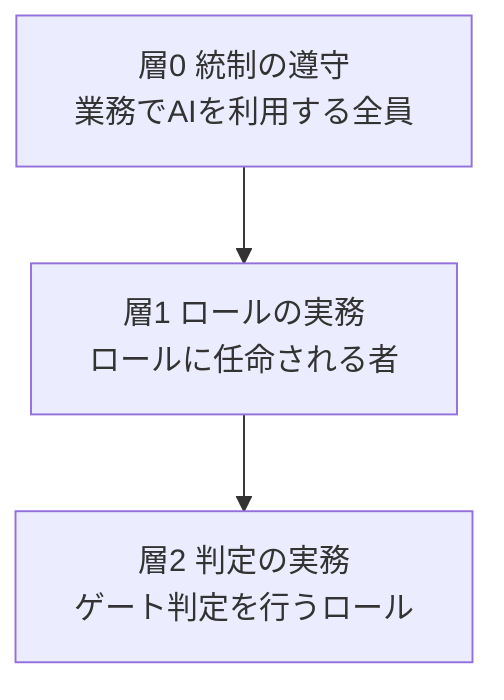

本ページは、[フェーズ4のプロセス標準](/process-compass/phase4-process-design/overview/)を実組織へ移行させる計画を規定します。対象は組織であり、道具ではありません。

## 移行の基本設計

### 賛同を前提条件にしない

**移行の開始条件に「関係者の賛同」を置きません**。順序を次のとおりにします。

| 採らない順序 | 本計画の順序 |
| --- | --- |
| 啓蒙して納得を得る → 全社へ導入する | 課題を持つ組織が小さく試す → 結果を示す → 隣接する組織へ広げる |

理由は3点です。

- 組織変革の研究では、**態度を変えてから行動を変えるのではなく、役割と責任を先に変えることで態度が後から追随する**という知見が示されている。全社一斉の変革プログラムそのものが定着の障害になるという指摘もある
- AI 支援の効果について、**利用者の自己評価と実測値は乖離する**。実測で作業時間が増えた条件でも、利用者は速くなったと申告した測定例がある。したがって主観的な納得は移行の判定材料にならない
- 採用が広がるほど生成物への信頼は下がる、という調査結果がある。**「使えば良さが分かる」という前提に依存した移行設計は成立しません**

賛同は移行の前提条件ではなく、**結果として観測する対象**に位置づけます。

### 導入を差し引きで提案する

**既存の手順に本標準のゲートを上乗せしてはなりません**。日本の大企業では、承認までに3日以上を要する稟議が半数近くに達し、承認者が10名を超える案件も存在するという調査があります。既存の滞留の上に新しい判定を積むと、標準の導入そのものが遅延の原因になります。

提案は次の形式で行います。

| 項目 | 記載 |
| --- | --- |
| 廃止または置換する既存の承認・様式 | 件数と、1件あたりの所要日数 |
| 新設する判定 | 件数と、想定する所要日数 |
| 差し引き | **負(削減)であること** |

差し引きが正になる提案は、その段階では提出しません。

:::note
上記の稟議に関する数値は、ワークフロー製品の提供事業者による2022年の調査(回答者109名)によります。母集団の代表性は保証されません。自組織の実測値に置き換えて用いてください。
:::

## 移行段階

### T-0 準備

導入の前提条件を評価します。**前提条件を満たさない組織で AI の利用を広げると、変更の失敗と手戻りだけが増えます**。AI は組織の既存の強みも既存の弱さも同様に拡大させるためです。

前提条件の評価軸は7項目です。

| # | 項目 | 満たしている状態 |
| --- | --- | --- |
| 1 | AI 利用の方針が明示され、周知されている | 許可される範囲と用途が文書で示され、実験が奨励されている |
| 2 | データの管理が健全である | 所在・品質・権限が把握されている |
| 3 | 社内の情報へ AI から到達できる | 仕様・設計・規約が参照可能な形式で存在する |
| 4 | バージョン管理の実践が確立している | 変更の単位と履歴が追跡できる |
| 5 | 小さい単位で作業している | 変更が小さく分割され、頻繁に統合される |
| 6 | 利用者を起点とした開発になっている | 作るものが利用者の課題から導かれている |
| 7 | 内部プラットフォームの品質が高い | 開発者が自力で環境を用意し、待たずに検証できる |

項目4・5・7 は AI に固有のものではありません。**これらが弱い状態で AI を導入すると、不安定さだけが拡大します**。1項目でも欠ける場合は、その項目の是正を T-0 の作業として計画へ含めます。

:::note
評価軸は、AI 支援開発の能力モデルに関する2025年の公開調査を参照した本計画の構成です。原典の測定項目とは異なります。
:::

### T-1 限定試行

#### 対象の選び方

**成功しやすい案件を選んではなりません**。統制された環境でのみ成立する試行は、展開の段階で破綻します。一方で、結果が誰の目にも見えなければ次の段階へ進みません。

両立させる選び方は次のとおりです。

| 軸 | 選び方 |
| --- | --- |
| 案件の性質(リスク区分・制約・既存資産の複雑さ) | **本番相当のものを選ぶ**。代表性を確保する |
| 対象の範囲(機能数・期間・参加人数) | **小さく切る**。結果が短期間で見える大きさにする |
| 実施の動機 | **当該組織が自ら課題を認識している**。上位組織からの割当てにしない |

#### 試行前チェックリスト

試行の開始前に全項目を確認します。未充足の項目がある状態で開始してはなりません。

```markdown
## 試行前チェックリスト(T-1 開始条件)

### 体制
- [ ] 試行の責任者が1名特定されている(役割として。個人名は D-0 の表5 に隔離する)
- [ ] 参加者の稼働時間が公式に確保されている(見込み工数と確保時間を数値で記載)
- [ ] 支援担当(EN-1)が割り当てられ、関与の期間が定められている
- [ ] 支援担当は、適合性を判定する組織に属していない

### 前提条件
- [ ] T-0 の7項目を評価し、未充足項目の是正が完了または計画済みである
- [ ] 対象範囲(対象・環境・変更種別・リスク区分)が文書で確定している
- [ ] リスク区分 R1 を含む場合、AI自律レベルが L1 に固定されている
- [ ] 適用条件に該当する場合、安全リスクアセスメントが承認されている
- [ ] 既存規程の免除を要する場合、サンドボックス申請が承認されている

### 測定
- [ ] 開始前の実測値を取得済みである(下記の指標を対で取得)
- [ ] 測定の期間と母数の下限が定められている
- [ ] 自己申告による生産性の変化を、成果指標として用いない旨が合意されている

### 差し引き
- [ ] 廃止または置換する既存の承認・様式が特定されている
- [ ] 導入後の判定件数が、置換前を上回らないことを確認した

### 撤退
- [ ] 中止の条件が事前に定められている
- [ ] 中止した場合に元の手順へ戻す方法が定められている
```

**撤退条件を定めない試行を開始してはなりません**。中止できない試行は、成果の有無にかかわらず継続され、判断の材料になりません。

#### 測定する指標

**速度と安定性を必ず対で測ります**。片方だけでは「速くなったが壊れやすくなった」状態を成功と誤判定します。

| 対 | 指標 |
| --- | --- |
| 速度 | 変更が着手から本番反映へ至るまでの時間、統合の頻度 |
| 安定性 | 変更失敗率、手戻りの発生、復旧に要する時間 |
| 判定の健全性 | ゲートの滞留時間、差し戻し率 |
| 理解の維持 | 対象機能の理解保持者数([第2章 2.9.4](/process-compass/phase4-process-design/lifecycle/)) |

**自己申告による生産性の変化を成果指標にしてはなりません**。実測と自己評価の間に大きな乖離を示した測定例があります。

### TG-1 増分展開の可否

| # | 判定基準 |
| --- | --- |
| 1 | 速度と安定性の双方が、開始前と比べて悪化していない |
| 2 | 定めた期間と母数の下限を満たす実測値がある |
| 3 | 試行で判明した手順の不備が、標準またはテーラリング規則へ反映されている |
| 4 | 導入の差し引きが負である(判定の総数が増えていない) |
| 5 | 参加者以外の者が、記録のみを読んで手順を再現できる |

基準5を欠く場合、展開は個人の説明に依存します。**説明できる人の数だけしか広がりません**。

判定者はステアリングコミッティ(B-2)です。判定は4値(継続・中止・保留・差し戻し)で行います。

### T-2 増分展開

**全社へ一度に広げてはなりません**。隣接する数チームへ順に広げます。各チームで T-1 と同じ試行前チェックリストを適用します。

| 項目 | 方針 |
| --- | --- |
| 展開の単位 | 3〜5チームずつ。同時に支援できる数を超えない |
| 支援の形態 | EN-1 が期間を限って伴走し、終了時に撤退する |
| 標準の改訂 | 各チームで判明した不備を反映する。反映せずに次へ進まない |
| 測定 | チームごとに T-1 と同じ指標を取得する |

展開の速度を、支援できる能力より速くしてはなりません。支援のない展開は、形式的な適合だけを生みます。

### TG-2 常態化の可否

| # | 判定基準 |
| --- | --- |
| 1 | 展開した全チームで、速度と安定性が悪化していない |
| 2 | 支援担当が撤退したチームで、運用が継続している |
| 3 | 標準の改訂が収束している(直近の展開で新たな不備が出ていない) |
| 4 | 既存の規程との矛盾が解消されている |
| 5 | 教育の受講と実務での適用の記録がある |

基準3が満たされない状態で常態化すると、**未完成の標準が全社の規程になります**。

### T-3 常態化

標準を既定の運用とし、**適用しない場合の側を申請制にします**。

| 項目 | 内容 |
| --- | --- |
| 規程への反映 | 品質マネジメントの規程体系へ組み込む。所管部門の承認を得る |
| 逸脱の扱い | [第7章](/process-compass/phase4-process-design/exception-escalation/)の例外承認手続に統合する |
| 教育 | 新規参加者への教育を定常の手続とする |
| 測定 | 指標の取得を自動化し、[フェーズ6](/process-compass/phase6-operation/metrics/)の運用へ移す |

### TG-3 支援組織の撤退可否

| # | 判定基準 |
| --- | --- |
| 1 | 支援担当への問い合わせが、定めた期間にわたり基準以下である |
| 2 | 標準の改訂が、所管部門ではなく現場からの提起で起きている |
| 3 | 新規参加者が、支援担当の関与なしに手順を実行できている |
| 4 | 推進の責任者が交代しても運用が継続している |

基準4は人事異動に対する耐性の確認です。**推進者の異動で停止する運用は、自走していません**。

### T-4 自走

支援組織が撤退した状態です。標準の維持は所管部門(EN-3)が担い、改善は[フェーズ6の改善サイクル](/process-compass/phase6-operation/improvement-cycle/)へ移ります。

## 既存規程との併存(移行期の措置)

T-1 から TG-2 までの間、組織には既存の品質マネジメント規程と本標準が同時に存在します。TG-2 の判定基準4は「既存の規程との矛盾が解消されている」ことを求めますが、解消するまでの期間をどう運用するかは別に定める必要があります。本節がそれを規定します。

### 案件の内側で混在させない

**どちらの規程へ従うかを個人の判断に委ねてはなりません**。委ねた場合、有利なほうを都度選ぶ運用が生じ、どちらの規程も実効性を失います。

適用の単位は案件です。

| 段階 | 適用する規程 |
| --- | --- |
| T-0 | 既存規程のみ |
| T-1・T-2 | 案件単位でいずれか一方。サンドボックスの承認を得た案件だけが本標準を適用する |
| T-3 以降 | 本標準を既定とし、適用しない側を申請制にする |

### 要求が衝突したときの決着

衝突を現場の解釈で処理させません。記録して所管部門(EN-3)へ集約します。集約した衝突の一覧が、TG-2 判定基準4の入力になります。

| 衝突の性質 | 優先する側 |
| --- | --- |
| 法令・契約・安全に由来する要求 | **既存規程**。サンドボックスの承認範囲に含めない |
| 手続の形式・様式・承認経路に関する要求 | サンドボックスで承認した範囲に限り本標準 |
| いずれとも判定できないもの | 既存規程。判定できない状態を本標準の適用根拠にしない |

### サンドボックス(一時的な適用免除)

#### 申請の要求事項

| # | 要求事項 |
| --- | --- |
| 1 | 対象案件、適用範囲、期間を特定する |
| 2 | 免除する既存規程の条項を**番号で列挙する**。「一部」「関連する手順」のような記述を用いない |
| 3 | 各条項について、本標準のどの要求事項が置き換えるかを対応づける |
| 4 | 免除の期限を定める |
| 5 | 記録の保全方法と所在を示す |

**置換先を示せない条項を免除の対象にできません**。置換先のない免除は、統制の穴であって調整ではありません。

期限が来たときの既定は「元の規程へ戻す」です。延長は再申請によります。**自動延長を設けてはなりません**。

#### 承認

| 承認者 | 確認すること |
| --- | --- |
| 品質マネジメント所管 | 要求事項3の対応づけが成立しているか |
| 法務 | 法令・契約に由来する条項が免除対象に混入していないか |
| 当該予算の責任者 | 期間中のリスクを引き受けられるか |

3者の記名により成立します。**1名でも欠けた申請を成立させません**。

#### 合意書の様式

```markdown
## サンドボックス適用合意書

### 1. 対象
- 案件名 / 適用範囲(対象・環境・変更種別・リスク区分)
- 期間(開始日・終了日)
- 対象人数

### 2. 免除と置換の対応表
| 既存規程の条項番号 | 条項の要求内容 | 置き換える本標準の要求事項 | 記録の所在 |
| --- | --- | --- | --- |

### 3. 免除しない範囲
- 法令・契約・安全に由来する条項(番号を列挙)

### 4. 期間中の措置
- 衝突が生じた場合の連絡先と集約先
- 中止の条件(試行前チェックリストの撤退条件と同一)
- 期限到来時の既定の扱い(元の規程へ戻す)

### 5. 記名
| 役割 | 氏名 | 日付 |
| --- | --- | --- |
| 品質マネジメント所管 | | |
| 法務 | | |
| 予算責任者 | | |
```

#### 監査部門との関係

監査部門を説得する材料は、有効性の主張ではなく**対応表**です。第2項の対応表が申請書の本体になります。

- 監査部門が確認するのは免除の可否ではなく、**記録の追跡可能性**である
- 期間中も通常の監査対象から外さない。免除するのは手続であって、監査ではない
- 対応表で示した記録の所在が実際と異なる場合、サンドボックスを停止する

**監査対象から外す免除を申請してはなりません**。この一点を外すと、以後の全社展開で監査部門の合意を得られなくなります。

### 移行期の初期コスト

既存のコードベースを[コンテキスト基盤](/process-compass/phase5-implementation/context-base/)へ登録する作業は、移行期に固有の費用です。定常の開発費用と混ぜずに計上します。

**全量の登録を移行の前提条件にしません**。前提にすると移行が始まりません。

| 優先 | 対象 |
| --- | --- |
| 1 | T-1 の対象範囲 |
| 2 | 変更頻度の高い箇所 |
| 3 | コア指定の箇所 |
| 対象外 | 凍結され、変更の予定がない箇所 |

予算化の単位は案件ではなくコンポーネントです。案件単位で積むと、同じ範囲を複数の案件が重複して計上します。

単価の見積には**自組織の実測を用います**。T-1 の対象範囲で要した工数を、対象の規模で割った値を初期の単価とし、T-2 の各チームで更新します。外部の一般的な数値を見積の根拠にしません。

登録が完了していない範囲について、AI自律レベルを L2 以上へ上げてはなりません。参照できる文脈のない範囲での自律実行は、生成の根拠を検証できません。

## 支援体制

3つの役割を置きます。**役割を兼務させてはなりません**。

| 記号 | 役割 | 責務 | 禁止事項 |
| --- | --- | --- | --- |
| EN-1 | 移行支援担当 | 対象チームへ期間を限って伴走し、実践を教えて撤退する | 適合性の判定を行わない |
| EN-2 | 現場推進者 | 各チーム内で標準の適用を推進する | 通常業務と兼務のまま、時間の確保なしに任命しない |
| EN-3 | 標準所管 | 標準の維持・改訂、内部プラットフォームの提供 | 監査およびゲート運営と報告線を共有しない |

### 支援と判定を分離する理由

**支援を求めることが評価上の不利益になる構造を作ってはなりません**。同一の組織が支援と適合性の判定を兼ねると、現場は不備を隠し、支援の依頼をしなくなります。結果として支援機能が働かなくなります。

EN-1 は「教えて退く」ことを目的とし、適合性の強制を目的としません。関与は期間を限り、4〜12週間を目安とします。恒久的な依存関係を作らないためです。

### 分離の要求事項

役割の名称を分けるだけでは分離になりません。次の3点をすべて満たしたときに分離が成立します。

| # | 要求事項 | 満たさない場合に起きること |
| --- | --- | --- |
| 1 | 支援に関与した者は、同一案件の出荷判定(G-7)および適合性監査の判定者にならない | 自らの支援の成果を自ら評価する構造になり、判定が支援の成否の評価と混ざる |
| 2 | 監査・判定の機能は、開発部門の長を経由しない報告線を持つ | 納期の圧力が判定基準の解釈へ直接届く |
| 3 | 監査・判定の機能の要員と予算を、個別案件の予算から配賦しない | 案件が縮小したときに判定の資源が最初に削られる |

監査の機能が実際に何を確かめるかは、[フェーズ6(プロセス内部監査)](/process-compass/phase6-operation/process-audit/)に規定します。

要求事項2が指すのは**報告の経路であり、所属の場所ではありません**。同一の部門に属していても、判定の結果を開発部門の長が差し戻せない構造であれば要求を満たします。組織図の形を指定しないのは、指定すると組織改編のたびに規定が破綻するためです。

兼務の禁止は[第3章 3.5](/process-compass/phase4-process-design/roles-responsibilities/)に規定します。

### 分離できない規模の場合

要員が不足し、支援と判定を同一の担い手が担わざるをえない場合があります。この場合、**兼務を隠して形式だけ整えてはなりません**。次のいずれかを選び、選んだ事実を記録します。

| 選択肢 | 条件 |
| --- | --- |
| 判定を他チーム・他部門へ委託する | 委託先が当該案件の支援に関与していない |
| 判定を外部へ委託する | [第8章 軸A](/process-compass/phase4-process-design/tailoring-guide/)の判断による |
| 兼務のまま実施する | 兼務の事実と、判定時に支援へ関与した範囲を判定記録へ明記する |

第3の選択肢は、独立性を確保したことにはなりません。記録が残ることで、後から判定の偏りを疑える状態を保つだけです。**独立性の欠如を、記録によって独立性の確保へ読み替えてはなりません**。

### 支援を求めた事実を判定の入力にしない

支援の要請が不利益になる構造では、支援機能は使われません。次を規定します。

| 支援側から判定側へ渡してよいもの | 渡してはならないもの |
| --- | --- |
| 標準の記述が現場で解釈できなかった箇所 | 特定チームの習熟度・成熟度の評価 |
| 手順が実務に合っていない箇所 | 支援を要請した回数・頻度 |
| 標準の改訂が必要な事項 | 支援の場で観測した個人の言動 |

渡してよい側はすべて**標準の側の欠陥**です。渡してはならない側はすべて**現場の評価**です。この線引きによって、支援の記録は監査の材料から外れます。

### 例外: 支援側が重大なリスクを観測した場合

法令違反、安全に関わる不備、意図的な統制の回避を支援の場で観測した場合は、上記の制限を適用しません。ただし次の手続によります。

| # | 手続 |
| --- | --- |
| 1 | 観測した事項を、当該チームへ先に伝える |
| 2 | 是正の期限を合意する。期限は事象の重大性による |
| 3 | 期限内に是正されない場合、監査・判定の機能へ上げる。**上げることを事前に伝える** |
| 4 | 緊急に停止すべき事象は、1〜3を待たず即時に上げる。この場合も事後に当該チームへ通知する |

**当事者に伝えないまま上げてはなりません**。黙って上げる経路を許すと、支援の場で観測される事実が急速に減り、支援機能そのものが働かなくなります。手続3で事前に伝えることは、是正の最後の機会を与える意味も持ちます。

### 現場推進者の任命に伴う要求事項

**任命するだけでは実践が変わりません**。推進の役割を割り当てられた者が、意欲を持っていても資源の不足と支援の欠如によって機能しなかった事例研究があります。任命と同時に次の3点を制度として付帯させます。

| # | 付帯させる制度 |
| --- | --- |
| 1 | 稼働時間の公式な確保(推進に充てる時間を業務として計上する) |
| 2 | 専門的な知識への到達経路(EN-1 および EN-3 への問い合わせ経路と応答期限) |
| 3 | 上位者による可視的な支援(推進の活動を評価の対象として扱う旨の明示) |

3点を欠く任命は行いません。**名目だけの推進者は、施策が形骸化したことを示す指標になります**。

## 教育計画

### 研修だけでは定着しない

教育の成果は自動的には実務へ移りません。移るのは、**上位者の支援が明確にあり、実務での適用機会がある場合**です。したがって研修の実施回数を成果指標にしません。

:::caution
「研修内容の一部しか実務へ移らない」という比率や、学習の配分に関する比率のモデルは、本計画では根拠として用いません。いずれも実証的な裏付けを欠くという指摘があります。用いるのは「転移は自動的には起こらず、支援と適用機会に依存する」という定性的な命題までです。
:::

### 教育の階層

教育は3層に分けます。**全構成員へ同じ内容を配りません**([第3章 3.4.1](/process-compass/phase4-process-design/roles-responsibilities/))。



| 層 | 対象 | 内容 | 分量の目安 |
| --- | --- | --- | --- |
| 層0 | 業務でAIを利用する全員 | 役割境界、機密の取り扱い、知財の取り扱い、禁止事項 | 短時間(半日以内) |
| 層1 | ロールに任命される者 | 当該ロールの作業手順と、任命基準の確認を通過する水準の実技 | ロールによる |
| 層2 | ゲート判定を行うロール | 層1に加えて、判定4値の使い分け、差し戻しの作法、例外承認の要求事項 | 実案件への同席 |

層0を層1の入口として設計してはなりません。**層0は、ロールに就かない者がそこで完結する内容です**。層1へ進む者にとっては前提知識にあたりますが、層0の履修を層1の必須の前提としません。

### 対象別の内容

層1・層2の内容です。

| 対象 | 内容 | 形式 |
| --- | --- | --- |
| 開発者 | [附属書E](/process-compass/phase4-process-design/developer-guide/)の作業手順、検証の順序、[附属書B](/process-compass/phase4-process-design/ears-guide/)の受入基準の書き方 | 実案件での伴走 |
| レビュア | [附属書C](/process-compass/phase4-process-design/review-guide/)の3パス方式、挙動要約の書式、差し戻しの作法 | 実際の PR を用いた演習 |
| 品質保証部門 | ゲートの判定基準、AI 品質指標の扱いと限界、記録の突合 | 判定記録を用いた演習 |
| 価値責任者・決裁者 | ゲートの意味、判定4値、例外承認の要求事項、決断の記録の4欄 | 実案件の判定への同席 |
| 運用担当 | 引き継ぎ文書、監視項目、[インシデント対応](/process-compass/phase6-operation/incident-response/) | 訓練 |
| 安全担当 | [附属書F](/process-compass/phase4-process-design/safety-verification/)の判定フローと検証手法 | 対象案件がある場合のみ |

### 品質保証部門の内容を実装の読解へ寄せない

出荷判定(G-7)は、記録と基準の突合として設計されています。**数値の十分性や実装の良否を判断する設計ではありません**([第4章 G-7](/process-compass/phase4-process-design/gate-criteria/))。したがって品質保証部門の教育も、コードの読解を到達目標に置きません。

| 教育の目標に置くもの | 置かないもの |
| --- | --- |
| どの検査が実施されたかを、記録から確認できる | テストの内容が十分かを自ら評価する |
| 記録の欠落と、期限を超過した未処理項目を見つけられる | 生存した変異の一覧を読解する |
| 疑義が生じた箇所を特定し、対象を絞って確認を依頼できる | 再レビューを自ら実施する |

右列を目標に置くと、教育の期間が長くなり、到達しないまま判定だけが始まります。その状態で残るのは、閾値との比較を承認と呼ぶ運用です。

**判定の設計が読解を要求しない構成になっているかを、教育の前に確認します**。教育で埋めるべきなのは、設計の欠陥ではありません。

### 設計の要求事項

- 座学の直後に、**実案件で適用する機会を設ける**。適用機会のない研修は計画しない
- 受講者の上位者に対し、適用を支援することを事前に合意する
- 教育の効果は受講率ではなく、**実務での適用の記録**で測る
- 教材は標準本文を再構成しない。標準を参照し、**実行する手順のみを示す**

### 任命基準の確認(認定)の運用

[第3章 3.4.1](/process-compass/phase4-process-design/roles-responsibilities/)が要求する確認を、どう回すかです。

| 項目 | 運用 |
| --- | --- |
| 誰が判定するか | 当該ロールの確認済みの者。初回は EN-1(推進の中核)が担う |
| いつ判定するか | 任命の前。暫定任命の場合は期間内 |
| 何を見るか | 実務の成果物(3.4.1 の表)。演習で代替する場合は実案件と同等の題材を用いる |
| 記録の置き場 | 担当表と同じ場所。任命の記録と確認の記録を分離しない |
| 不合格の扱い | 「不合格」を記録しない。**不足している観点と、次に見る成果物を記録する** |

不合格の記録を残さないのは、確認を選抜の手続にしないためです。**選抜として運用されると、確認を避ける動機が生じます**。目的は任命の妥当性の担保であり、序列付けではありません。

### 判定の負荷を持続可能にする

確認は判定者の時間を消費します。人数の増加に対して線形に増えるため、設計しないと EN-1 が詰まります。

- 判定を1件あたり30分以内で終えられる分量に成果物を絞る。長大な提出物を求めない
- 判定者を増やす経路を最初から用意する。**確認を通過した者が次の判定者になる**
- 同一のロールで判定者が1人しかいない状態を放置しない。異動で確認そのものが止まる

### 教育の効果測定と、この計画の限界

- 教育の効果は受講率ではなく、**実務での適用の記録**で測る(前掲)
- 確認の通過率を成果指標にしない。通過率は判定の厳しさに左右され、能力を表さない

:::caution[暫定 EV-0008 / 見直し 2027-08]
**対象**: 教育の階層構成と、任命基準の確認手続の設計全体。
**根拠の水準**: E0(なし)。
**差し替え条件**: 確認を通過した者と通過しなかった者の、実務での判定品質の差の記録。

教育効果の実証研究に基づくものではありません。「ロールに求める能力を、そのロールの成果物で確認する」という設計上の一貫性から導いたものです。層の分け方・確認に用いる成果物・有効期間のいずれも、実測に基づく見直しの対象です。
:::

## 抵抗への対処

抵抗の実体は「変化を好まないこと」ではありません。プロセス改善の実務者調査が示す主要因は次の4点であり、いずれも**設計で解消できます**。説得では解消できません。

| 要因 | 対処 |
| --- | --- |
| 時間が確保されていない | 導入工数を明示し、既存手順の削減との差し引きを提示する。稼働時間を公式に確保する |
| 効果の証拠がない | T-1 で自組織の実測値を取る。**外部の一般的な数値を効果の根拠にしない** |
| 上から押し付けられている | リスク区分で上限のみを規定し、範囲内の AI自律レベルと実行形態の選択は当該チームに委ねる |
| 手順が煩雑である | 附属書を「必要なときに引く参照」として設計し、日常の必須手順を最小に保つ |

**時間の欠如は、階層によって認識が食い違います**。現場が最大の障害として挙げる一方、上位層は同じ重要度を認識していないという調査結果があります。したがって上位層への説明だけでは対処になりません。稼働時間の確保を明示的な要求事項として扱います。

### 自律性への配慮

役割の変更が「裁量の縮小」と受け取られると、定着は進みません。本標準の設計は次の二層になっており、この点を明示して説明します。

| 層 | 決める主体 |
| --- | --- |
| リスク区分による上限(R1→L1、R2→L2、R3→L3) | 標準が固定する |
| 上限の範囲内での AI自律レベルと実行形態の選択 | 当該チームが決める |

**上位組織が水準を一律に指定してはなりません**。上限の規定と、範囲内での選択の委譲を分けることが、統制と裁量の両立の条件です。

労働者側への説明は「**AI が定型的な作業を引き取り、人の判断の範囲を広げる**」という軸で行います。職務内容の変更に伴う手続(就業規則、労働条件、協議の要否)は本計画では規定しません。**所管する人事・法務の部門へ確認してください**。

## 期待値の較正

移行計画の説明では、次を最初に伝えます。**過大な期待は、達成されなかったときに標準そのものへの不信へ転化します**。

| # | 伝えること |
| --- | --- |
| 1 | AI の導入は一律の高速化をもたらさない。効果は対象と経験水準に依存する |
| 2 | 熟練者が習熟した対象で作業する場合、**遅くなる測定例がある**。経験の浅い層では効果が大きい傾向がある |
| 3 | 利用者の自己評価は実測と乖離する。自己申告を成果指標にしない |
| 4 | 利用が広がっても生成物への信頼は上がらない。**限界を前提とした検証の手順が必要である** |
| 5 | 最大の負担は「ほぼ正しいが完全には正しくない」出力の判別である |

項目5への対処が、[第5章 5.6](/process-compass/phase4-process-design/human-ai-boundary/)の欠陥注入と[第6章の認知強制機能](/process-compass/phase4-process-design/deliverable-templates/)です。**これらを移行の後半へ回してはなりません**。T-1 の時点から適用します。

## 根拠として用いない数値

次の数値は、出典を確認できないか、実証的に否定されています。**移行計画の説明資料で用いてはなりません**。

| 数値 | 状態 |
| --- | --- |
| 変革の取り組みの7割が失敗する | 主要な出典を検証した研究が、根拠の不在を示している |
| 研修内容の1割しか実務へ移らない | 出典とされる数値そのものが批判の対象になっている |
| 学習は経験・他者・研修が7対2対1である | 対象と手法の限界が指摘され、確固たる根拠を欠く |
| 生成 AI の試行の95%が失敗する | 報道により手法の記述が一貫しない |
| AI の取り組みの85%はデータ品質が原因で失敗する | 一次資料を確認できない |

自組織の実測値を用いることを原則とします。外部の数値を用いる場合は、**調査主体・標本数・調査年を必ず併記します**。

## 関連するページ

- 移行後の測定と改善は[フェーズ6](/process-compass/phase6-operation/overview/)に規定する
- 組織条件に応じた適用度合いの調整は[第8章](/process-compass/phase4-process-design/tailoring-guide/)に規定する
- 品質保証部門・決裁者への提案様式は[附属書D](/process-compass/phase4-process-design/proposal-template/)に示す
- 要員の交代に伴う引き継ぎは[第2章 2.9](/process-compass/phase4-process-design/lifecycle/)に規定する
