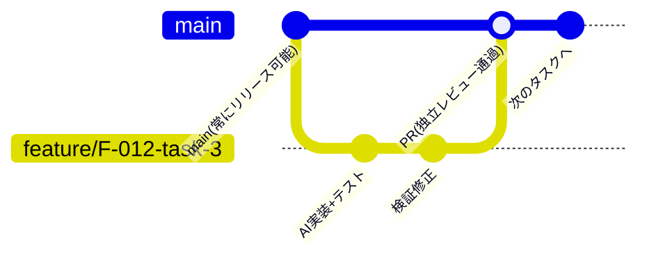

[ピットイン方式参照モデル](/process-compass/phase4-process-design/process-model/)のゲート(自動検証・独立レビュー)は、Git プラットフォームの機能で**機械的に強制**できます。このページはブランチ・コミット・保護設定のリファレンスです。PR の作成からマージまでの日々の運用は[PR 運用リファレンス](/process-compass/phase5-implementation/pr-workflow/)を参照してください。

## ブランチモデル: トランクベース+タスク単位ブランチ



- **main は常にリリース可能**に保つ。長寿命の develop ブランチは置かない(AI協調ループの回転速度に合わせる)
- **1タスク=1ブランチ=1PR**。ゲート基準 G-4「1タスク=1レビュー単位」をブランチ構造で担保する
- ブランチ名は `feature/<機能ID>-task-<N>` で機能仕様・実装計画と対応づける(トレーサビリティ)

### ブランチ命名の語彙

ブランチの種別は次の5つに限定します。語彙を増やすと CI の分岐と集計が複雑になるため、迷ったら `chore/` を使います。

| プレフィックス | 用途 | 例 |
| --- | --- | --- |
| `feature/<機能ID>-task-<N>` | 実装計画のタスク(仕様に紐づく変更はすべてこれ) | `feature/F-012-task-3` |
| `fix/<Issue番号>-<内容>` | 欠陥修正(仕様変更を伴わない) | `fix/152-login-timeout` |
| `hotfix/<Issue番号>-<内容>` | 本番障害の緊急修正。main から切り、修正後ただちにタグを打つ | `hotfix/160-payment-error` |
| `docs/<内容>` | ドキュメント・コンテキスト基盤のみの変更 | `docs/context-terms` |
| `chore/<内容>` | CI 設定・依存更新など上記以外 | `chore/update-ci-node` |

- `hotfix/` も PR・独立レビュー・CI を省略しない(緊急時に統制を外すと、緊急を口実に統制が崩れる)。省略してよいのは事業ゲートの事前決裁だけで、事後報告に切り替える
- release ブランチは作らない。リリースはタグ(`vX.Y.Z`)で固定する

### main への追従とコンフリクト解消

- ブランチが main から遅れたら **rebase で追従**する(`git rebase origin/main`)。ブランチは1タスク=1人(+AI)の専有なので、履歴書き換えの危険はない。push は `--force-with-lease` を使う
- コンフリクトの解消は AI に任せてよい。ただし解消後は**必ず human-verify(挙動の実確認)をやり直す**。コンフリクト解消は「2つの意図の合成」であり、AI が片方の意図を黙って落とすことがある
- 同一ファイルを触るタスクが並走してコンフリクトが頻発する場合は、タスク分解(依存関係・並列可否)の失敗として実装計画に差し戻す

## ブランチ保護: ゲートの機械的強制

「CI 通過なしにマージ不可」(G-5)は、リポジトリのルールセットで強制します。「作成指示者は承認できない」(G-6)は、[第3章 3.5](/process-compass/phase4-process-design/roles-responsibilities/)のとおり2つの層で強制します。

| 層 | 止めるもの | 止めないもの |
| --- | --- | --- |
| ブランチ保護(ルールセット) | 変更の作成者本人(最後に push したアカウント)による承認 | 作成者が AI または bot である変更への、作成を指示した者の承認 |
| 出荷の証跡の集約 | 独立した人の確認の条件を満たさない承認。数えず、G-6 を適用する体制では記録の欠落として差し戻す | D-0 体制図の記載の誤り。内部監査で確かめる |

ルールセットだけでは G-6 を強制できません。AI に作成させた変更を、指示した本人が承認する形はルールセットを通ります。この形を止めるのは、マージの時点ではなく、出荷判定の時点です。

GitHub の場合の設定例(gh CLI):

```bash
# main へのルールセット: PR必須・承認1名・作成者の自己承認は仕組み上不可・CI必須
gh api repos/OWNER/REPO/rulesets -X POST --input - <<'EOF'
{
  "name": "integrated-process-gates",
  "target": "branch",
  "enforcement": "active",
  "conditions": { "ref_name": { "include": ["~DEFAULT_BRANCH"], "exclude": [] } },
  "rules": [
    { "type": "pull_request", "parameters": {
        "required_approving_review_count": 1,
        "dismiss_stale_reviews_on_push": true,
        "require_last_push_approval": true,
        "required_review_thread_resolution": true } },
    { "type": "required_status_checks", "parameters": {
        "required_status_checks": [ { "context": "gate-g5" } ],
        "strict_required_status_checks_policy": true } },
    { "type": "non_fast_forward" }
  ]
}
EOF
```

- `require_last_push_approval: true` が要点 — **最後に push した本人の承認を無効化**し、AIに指示して push した本人が自己承認する抜け道を塞ぐ
- **この設定が止めるのは、最後に push したアカウント本人の承認だけである**。AI・bot のアカウントが push して PR を作る構成では、作成を指示した人の承認を止めない。作成を指示した者の承認を独立した確認に数えない検査は、出荷の証跡の集約が担う([CI/CD ゲート構成](/process-compass/phase5-implementation/ci-gates/)「独立した人の確認の数え方」)。集約は出荷の時点で働くため、マージの時点では止まらない
- `gate-g5` は[CI/CD ゲート構成](/process-compass/phase5-implementation/ci-gates/)で定義する必須チェックの名前
- ルールセットは read 権限者にも公開されるため、貢献者・監査がルールを事前に確認できる(ブランチ保護より透明)

## AI 生成コミットの扱い

AI が生成したコードのトレーサビリティを、コミット規約で残します。

```text
<種別>: <変更の要約>

<本文: 何を・なぜ>

Spec: F-012 / Task-3          ← 機能仕様・タスクへの参照(必須)
ADR: ADR-021                  ← 設計判断があれば参照
Co-Authored-By: <AIエージェント名> <noreply@...>   ← AI関与の明示(必須)
Delegated: <規則ID>           ← 委任の範囲の変更(該当時は必須)
Risk: R3                      ← PR を経ないコミットのリスク区分(該当時は必須)
Verification: <実行した検証と結果の要点、または証跡の所在>   ← PR を経ないコミットの検証の記載(該当時は必須)
```

`<種別>` は次の7語に固定します(Conventional Commits のサブセット。ブランチ語彙と対応)。

| 種別 | 用途 |
| --- | --- |
| `feat` | 機能の追加・変更(仕様に紐づく) |
| `fix` | 欠陥修正 |
| `docs` | ドキュメント・コンテキスト基盤 |
| `test` | テストのみの追加・修正 |
| `refactor` | 挙動を変えない整理(負債返却はこれ+台帳更新) |
| `chore` | 依存更新・雑務 |
| `ci` | CI 設定の変更(基準値の変更は技術判断者の承認が必要) |

- **AI の関与は Co-Authored-By で明示**する。規制業のテーラリング(AI生成箇所のトレーサビリティ)はこのトレーラの集計で実装できる
- **コミットの作者(Author)は指示した人間**にする。結果責任(A)が人間に紐づく原則をコミット履歴でも維持する
- 機能ID・タスクIDへの参照を必須にすると、「business intent → spec → task → commit」の逆引きが可能になる
- **`Delegated` は、変更ごとの検証を担い手へ委ねた変更の識別**である([第5章 5.5.4](/process-compass/phase4-process-design/human-ai-boundary/)の条件7)。委任の範囲の変更では、マージの経路が有効かどうかにかかわらず、すべてのコミットへ同じ規則 ID を書く。トレーラを持つ変更のうち、独立した人の事前の承認が無いものは、「独立した人の事前の承認が無い委任の変更」として数える。このうち、G-6 の判定を事後へ移した変更だけが、本標準のいう「人の事前確認を経ていない変更」である。開発者の席だけが委任の変更は、独立レビュアが事前に承認する。トレーラを持つ変更のリスク区分が R3 でない場合は、委任の範囲の逸脱として扱う
- **`Risk` は、PR を経ないコミットのリスク区分の記録**である。`R1`・`R2`・`R3` のいずれかを書く。リスク区分は変更ごとに確定する記録であり([第3章 3.8.1](/process-compass/phase4-process-design/roles-responsibilities/))、PR を経ないコミットは PR 本文の欄を持たないためである。判定記録や証跡だけを変えるコミットには要らない。対象外の条件と、書き忘れたときの確定の方法は[CI/CD ゲート構成リファレンス](/process-compass/phase5-implementation/ci-gates/)「保証の開示の出力」による
- **`Verification` は、PR を経ないコミットの、作成側の検証の記載**である。実行した検証と結果の要点か、証跡の所在を書く。PR 本文の「検証方法と結果」に当たる。トレーラが無いコミットと、値が空のコミットは、記録の欠落として扱う。複数行の記載をコミットの本文へ書く場合も、トレーラに値が1行要る。機械が確かめるのは、トレーラの値の有無だけである。対象外の条件は `Risk` と同じである。書き忘れたときは、判定記録へ「検証方法と結果」を足して確定する。条件は CI/CD ゲート構成リファレンスによる
- PR を経ないコミットは、独立した人の確認を経ていない変更に数える。`Risk: R1` のコミットは、例外承認の記録を要する([第7章 7.3](/process-compass/phase4-process-design/exception-escalation/))
- **トレーラは、コミットのメッセージの末尾の段落に書く**。末尾の段落に無いトレーラは、機械が読まない
- 構成を初期化するコミット(準拠テンプレートの `/process-init` が作るコミット)にも、`Risk` と `Verification` を書く。`Verification` には、契約検査の結果を書く。初期化の記録より前の履歴(テンプレートに由来する初期のコミット)は、出荷の証跡の集約の対象外である

## マージ後の扱い

- **squash マージを既定**にする(1タスク=1コミットで main の履歴が実装計画と1対1になる)
- マージ済みブランチは自動削除。リリースはタグ(`vX.Y.Z`)で固定し、出荷判定(G-7)の対象を「タグ間の差分」として明確化する
- **コミットが PR を経たかどうかは、件名の番号では判定しない**。出荷の証跡の集約は、PR のマージコミットと一致するコミットだけを、当該 PR の変更として扱う。件名に `(#N)` を書いて main へ直接入れたコミットは、PR を経ていないコミットに数える(CI/CD ゲート構成「集約スクリプトの入出力仕様」)

## 段階導入(テーラリング)

| 体制 | 設定 |
| --- | --- |
| 1名。または、2名で G-6 が未達の体制 | ルールセットなし・main 直 push 可。ただし CI(G-5相当)は最初から必須。既定ブランチへの push でも、契約検査を実行する。PR を経ないコミットには、トレーラ `Risk` と `Verification` を書く |
| 2名で G-6 が成立する体制(作成を指示していない側の人が確認する) | 上記ルールセットを有効化する。必須の承認数は 1 とする。相互の確認を、PR の承認として記録に残すためである。main へ直接 push したコミットは、独立した人の確認を経ていない変更に数える |
| 3名以上 | 上記ルールセットを有効化する。作成を指示した者以外の承認を、マージの条件にする。作成を指示した者の承認を数えない検査は、出荷の証跡の集約が担う |
| 受託・規制業 | +コミットトレーラの完全性チェックを CI に追加(Spec/Co-Authored-By の欠落を落とす) |

- 2名で G-6 が成立する体制でも、2人とも作成の指示に関与した変更は、相互の承認では成立しない。外部の確認者を要する([第3章 3.5](/process-compass/phase4-process-design/roles-responsibilities/))
- PR を経ない体制では、構成の手での書き換えを、push の検査と出荷の証跡の集約が検出する([準拠テンプレートリポジトリ](/process-compass/phase5-implementation/template-repository/)「構成を書き換える経路は1つ」)

:::note
本サイトのリポジトリ自体が「ソロ期は main 直 push + CI 必須、コントリビューター参加でルールセット有効化」という段階導入の実例です([プロジェクト運営](/process-compass/community/project-management/)の移行チェックリスト参照)。
:::
