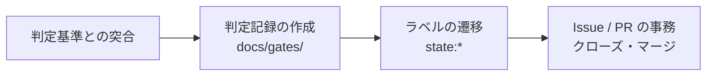

本章は、ロール間で物理的に分離されたディレクトリ（クローン）を稼働させる際に、エージェント間および人間との協働を非同期に繋ぐ **「非割込型メッセージボックス（Label Mailbox）」** の仕様を規定する。

---

## 4.1 設計背景: 割り込み崩壊（外部割込競合）の防止

ピットイン方式では、作成指示者（PO/Dev）と独立レビュア（QM/Audit）などの兼務禁止統制を徹底するため、ディレクトリ（クローン）を物理的に分割（[第3章 3.5.1](/process-compass/phase4-process-design/roles-responsibilities/)）して稼働させる。

このとき、ロール間で直接通信をしたり、相手のセッションに直接リクエストを割り込ませたりすると、次の重大なシステム不具合（**割り込み崩壊**）が構造的に発生する。

- **コンテキストの強制切り替えと未完了タスクの滞留**: 実行中のタスクが未完了のまま別の割り込みタスクが差し込まれると、AIエージェントのコンテキスト（短期記憶）が上書きされ、元のタスクがデッドロックするか破棄される（マイコンにおける外部割り込み競合によるメイン処理崩壊と同 class の不具合）。
- **やり取りの無限ループ**: 独立したエージェント同士が、人間や不揮発性ゲートの検証を経ずに直接エラーを指摘しあうと、修正と再指摘の無限後退（無限ループ）に陥り、APIトークンを浪費し続ける。
- **人間によるコピー＆ペースト中継コスト**: 連携が口頭やチャットに退化すると、人間がエージェントの発言を手動でコピーして仲介せざるを得なくなり、人間がボトルネックとなって自律性が崩壊する。

**解決策**: 新しい同期通信基盤を開発するのではなく、すでに開発プロセスの一部となっている **GitHub を「不揮発性メッセージバス（状態マシン）」** として扱い、**非同期・排他的なポーリング方式（polling-based）** で各自の仕事を拾いに行く「Label Mailbox」を規定する。

---

## 4.2 設計原則

1. **GitHub標準モデルを優先する**:
   approveの依頼などの「行為」はGitHub標準の **reviewer request** を使用する。ラベルは二重管理を避け、「状態（state）」を表すことに特化する。
2. **ラベルは状態であって結果（実測）の保証ではない**:
   `state:ready-to-merge` が付与されていても、判定者は必ず CI が実際に緑（全件パス）であるかなどの機械的実測を検証する。ラベルは環境の事実を代替しない。
3. **付与した側がその意味に責任を持つ**:
   自身のレーンから次のレーンへ成果物を引き渡す際、**引き渡す側が次のロール用のラベルを付与**する。自分のレーンに仕事を残したまま、相手を指すラベルを設定してはならない。
4. **不可逆な操作はオーナー（価値責任者）へエスカレーションする**:
   **判定の基準は「取り消せない時間帯が存在すること」である**（[第8章 設計で下げられない危害](/process-compass/phase4-process-design/tailoring-guide/)）。取り消し操作を用意したことをもって、対象から外してはならない。
   - 削除（検証ゲート、ガード, 重要テストの削除を含む）
   - 本番環境へのデプロイ
   - 課金（クラウドや外部API）が発生する書き込み
   - データベース・スキーマ変更
   - **組織の管理外への発行**（公開ホストへの掲載、第三者への送信。発行を削除しても、発行されていた時間帯は消えない）

   **この一覧は基準を満たす操作の例示であり、網羅ではない**（[ADR-0041](/process-compass/adr/0041-scope-is-not-exhaustive/)）。基準に当たる操作を見つけた場合、一覧に無いことを理由に自律実行してはならない。自律実行を停止し、オーナー/POへのエスカレーションラベルを付与する。
5. **語彙を必要最小限に抑える**:
   伝達する経路（チャンネル）が明確である限りラベルを増やさない。ただし、伝える経路そのものが存在しない「伝達の欠落」がある場合は、速やかに公式語彙を追加する（4.6節参照）。

---

## 4.3 label 語彙（標準8種）

プロジェクトのリポジトリには、以下の9つの `state:*` ラベルを定義する。

| ラベル（label） | 意味 | 付与するロール | 次に動くロール |
|---|---|---|---|
| `state:needs-dev` | POまたはQMが、開発者（Dev）に着手を引き渡した状態 | PO / QM | **Dev**（開発者） |
| `state:dev-done` | 開発者が実装・単体テスト（CI緑）を完了し、Ready化した状態 | Dev | **QM**（出荷判定者） |
| `state:qm-blocked` | QMが検証で、BLOCK 3類型（実害/証跡の不真正/不可逆）を検出し、Devへ差し戻した状態 | QM | **Dev**（開発者） |
| `state:ready-to-merge`| QMが独立レビューを完了し、マージを承認した状態 | QM | **QM**（マージ実行担当） |
| `state:needs-audit` | 統合監査またはリリースカットの検証を監査チームに依頼した状態 | PO | **監査**（Auditor） |
| `state:needs-platform`| テスト装置・リント・CI/CD等の削減・自動生成・統合、および**エージェント指示資産（強制層。`.claude/**` 等）の統合・削除**を依頼した状態 | PO / Dev / QM | **Platform**（AI維持管理） |
| `state:needs-po` | 不可逆な操作に当たらないが、仕様・優先度・語彙の改訂等のPO判断を要する状態 | 誰でも | **PO**（価値責任者） |
| `state:needs-tech` | 技術設計の判断（G-3）を要する状態。ADRの起草・採否、技術的トレードオフの評価 | 誰でも | **技術判断者** |
| `state:needs-owner` | 事業決裁者の決裁または追認を要する状態 | 誰でも | **オーナー**（事業決裁者） |

- `state:needs-po` / `state:needs-tech` / `state:needs-owner` は、誰が気付いても付与してよい。Devの実装中に判断が必要になった場合もこれらを付与する。
- **`state:needs-owner` が指す範囲は、不可逆な操作に限らない。** 4.2 原則4 の不可逆な操作、[第7章 7.6](/process-compass/phase4-process-design/exception-escalation/)の段階2および段階3、[第3章 3.9](/process-compass/phase4-process-design/roles-responsibilities/)の決裁マトリクスが事業決裁者を指す事項を含む。案件がテーラリングで追認を要する事項を追加した場合も、同じラベルを用いる（[ADR-0037](/process-compass/adr/0037-label-points-to-lane-not-role/)）。
- **エージェント指示資産の統合・削除の権限は AI維持管理者へ集約する**（[第3章 3.11.2](/process-compass/phase4-process-design/roles-responsibilities/)）。強制層の変更が必要になった場合は `state:needs-owner` ではなく `state:needs-platform` を付与する。不可逆な操作に該当する場合のみ、あわせて `state:needs-owner` を付与する。
- **相手を指すラベルがない口頭やメンションでの判断依頼を禁止する。** 伝達経路に現れないため、エージェントや人間の双方で見落とすこととなる。

---

## 4.3.1 状態遷移表（復路の完全定義）

ラベル運用における典型的な失敗モードは、「受領側が対応を終えた際、ラベルを元のままにするか、または外しただけにして次の担当の受信箱に現れず、作業が滞留する」現象を指す。受け取った側は、対応を終えたら必ず次の状態へ明示的に遷移させなければならない。

| 現在の状態（State） | 役割 | 遷移の条件・契機 | **遷移先の状態（Next State）** |
|---|---|---|---|
| `state:needs-dev` | Dev | 実装完了・単体テストCI全緑・PRのReady化 | **`state:dev-done`** |
| `state:needs-dev` | Dev | 実装中に仕様や技術のPO判断が必要と判明 | `state:needs-po` または `state:needs-owner` |
| `state:dev-done` | QM | レビューにおいてBLOCK 3類型を検出（差し戻し） | **`state:qm-blocked`** |
| `state:dev-done` | QM | 独立レビュー承認（Approve） | **`state:ready-to-merge`** |
| **`state:qm-blocked`**| **Dev** | **差し戻し対応が完了し、CIが全緑（復路）** | **`state:dev-done`** （※ここをDevに戻すのが極めて重要） |
| `state:ready-to-merge`| QM | マージを実行（Squash & Merge） | （PR close。ラベルは剥がさず残してよい） |
| `state:needs-po` | PO | 意思決定を下し、内容をコメントとして永続化 | **次の担当者の状態** （`needs-dev` や `dev-done` 等） |
| `state:needs-tech` | 技術判断者 | G-3の判定記録を作成し、採否と却下理由をADRへ永続化 | **次の担当者の状態**（`needs-dev` 等）。差し戻しは `state:needs-po` |
| `state:needs-owner`| Owner | 決裁を下し、内容をコメントとして永続化 | 同上 |
| `state:needs-audit`| 監査 | リリースカット実施または却下の監査判定完了 | **`state:needs-po`**（理由を添えてPOへ結果を戻す） |
| `state:needs-platform`| Plat | ツールチェーンやテスト装置の修正・追加が完了 | **`state:dev-done`**（※自分のPRを自分で承認しない原則） |

**原則**: ラベルは常に「次に動く人」を指す。自分が作業を終えたら、古いラベルを剥がし、自ロールを指したままの状態にしてはならない。

---

## 4.4 孤児（orphan）検出の義務化

ラベル運用の最大の失敗モードは、**「どの受信箱にも入っていない、状態ラベルが未設定のまま浮いている Issues/PRs（孤児 = orphan）」** が発生する事態を指す。各セッションからは「自メールボックスは空」と報告されるため、実際には作業が完全にストップしているにもかかわらず、異常が検知されない。

これを防ぐため、各ロール（特に価値責任者・PO）は、セッション起動時や定期ポーリング時に orphan 検出コマンドを実行する。浮いているタスクを検出し、適切な状態ラベルを付与して各受信箱に再配分しなければならない。

### orphan の定義
`state:*` ラベルが1つも設定されていない `open` 状態の Issues/PRs のうち、以下のいずれでもないもの。
- 開発着手順待ちを明示的に示す `status:on-hold` ラベルが付与されている
- 着手単位ではない大元のまとまりを示す `epic` ラベルが付与されている
- 開発者自身が実装途中で、まだ引き渡していない `Draft` 状態のプルリクエスト

```bash
# orphan（孤児）となって浮いている Issues を検出する
gh issue list --state open --limit 100 --json number,title,labels \
  --jq '.[]|select([.labels[].name]|map(select(startswith("state:") or .=="status:on-hold" or .=="epic"))|length==0)|"ORPHAN ISSUE #\(.number) \(.title)"'

# orphan となって浮いている PRs を検出する
gh pr list --state open --limit 50 --json number,title,labels \
  --jq '.[]|select([.labels[].name]|map(select(startswith("state:") or .=="status:on-hold" or .=="epic"))|length==0)|"ORPHAN PR #\(.number) \(.title)"'
```

---

## 4.5 ロール別 polling コマンド

各セッションは、起動時および定期実行時に以下のコマンドを実行して自分のメールボックス（Mailbox）から仕事を拾う。

### ① 開発者（Dev）の Mailbox
```bash
# 1. 自分あての新規着手タスク
gh issue list --label "state:needs-dev" --state open
gh pr list --label "state:needs-dev" --state open

# 2. 差し戻しされたタスク（対応を優先）
gh pr list --label "state:qm-blocked" --state open

# 3. 独立レビュア（Fix Agent等）から自分へのレビュー依頼
gh pr list --search "review-requested:@me is:open"
```

### ② 出荷判定者（QM）の Mailbox
```bash
# 1. 開発者から実装完了で引き渡されたレビュー対象
gh pr list --label "state:dev-done" --state open

# 2. 独立レビュー完了、マージ可能な状態
gh pr list --label "state:ready-to-merge" --state open
```

### ③ 価値責任者（PO）の Mailbox
```bash
# 1. PO判断待ちの要件・仕様・優先順位変更
gh issue list --label "state:needs-po" --state open
gh pr list --label "state:needs-po" --state open

# 2. 不可逆な操作などのオーナー・決裁者承認待ち
gh issue list --label "state:needs-owner" --state open
gh pr list --label "state:needs-owner" --state open
```

### ④ 監査担当（Audit）の Mailbox
```bash
# 1. 統合監査、またはリリース承認依頼
gh issue list --label "state:needs-audit" --state open
gh pr list --label "state:needs-audit" --state open
gh pr list --base main --state open
```

### ⑤ AI維持管理（Platform）の Mailbox
```bash
# 1. 検査・テスト装置の改修、追加、削除の依頼
gh issue list --label "state:needs-platform" --state open
gh pr list --label "state:needs-platform" --state open
```

### ⑥ 技術判断者の Mailbox
```bash
# 1. 技術設計判断（G-3）待ちの案件
gh issue list --label "state:needs-tech" --state open
gh pr list --label "state:needs-tech" --state open
```

技術判断者が開発者のレーンを共有する体制では、**セッションを分けて**このポーリングを実行する（[第3章 3.5.3](/process-compass/phase4-process-design/roles-responsibilities/)）。1つのセッションが両方の受信箱を見た時点で、起草と判定の文脈が合流する。

---

## 4.5.1 受信箱は自分のロールのものだけを見る

**ポーリングの対象は、自分のロールを指すラベルに限る。** 他のロールの受信箱を見に行ってはならない。

物理隔離（[第3章 3.5.1](/process-compass/phase4-process-design/roles-responsibilities/)）はディレクトリを分けるが、1つのセッションが複数のレーンの受信箱を見た時点で、**文脈は合流する**。分離が成立する条件は作業領域・セッション・認証情報の3つがすべて分かれていることであり（[第3章 3.5.3](/process-compass/phase4-process-design/roles-responsibilities/)）、ポーリングの範囲はセッションの側の条件にあたる。

自分のロールが判定してよいゲートと、担ってはならない工程は、案件の構成（`process.config.json` の `roles[]`）から導出する。**本仕様は新しいラベルを追加しない**。取得の範囲は構成の参照によって定まる。

孤児（orphan）の再配分（4.4 / 4.6）だけを例外として扱う。**再配分の権限と、仕事を拾う権限を区別する**。価値責任者は状態ラベルの付いていない Issues/PRs を検出して再配分するが、再配分した仕事を自ら拾ってはならない。

<!-- impl IMPL-0007 target=claude-md state=delivered note="ポーリングの対象を自ロールの受信箱に限る" -->

---

## 4.5.2 エスカレーションの段階とラベルの対応

[第7章 7.6](/process-compass/phase4-process-design/exception-escalation/) は、予算・スコープ・日程・品質の発火条件と3段階の報告先を定める。**本仕様のラベルは2値であり、段階そのものを表さない**。両者の対応を次に定める。

| 第7章 7.6 の段階 | 報告先 | 付与するラベル |
| --- | --- | --- |
| 段階1 | プロジェクト責任者 | `state:needs-po` |
| 段階2 | 部門責任者・PMO | `state:needs-owner` |
| 段階3 | ステアリングコミッティ（B-2） | `state:needs-owner` |
| 不可逆4操作（4.2 原則4） | オーナー | `state:needs-owner` |

**ラベルは「次に動く人」を指すだけであり、階層は表さない。** 段階2と段階3の実際の宛先は、案件の D-0 体制図（第4節 エスカレーションの経路）による。**ラベルの語彙を段階の数だけ増やさない**。増やすと、階層の定義が第7章・D-0・本仕様の3か所に分かれる。

発火条件の閾値は初期値であり、企画承認（G-1）の時点で組織が確定して記録する（第7章 7.6）。**本仕様は閾値を持たない**。

エスカレーションレポートの様式（5項目）は第7章 7.6 による。ラベルの付与だけで報告を済ませてはならない。

<!-- impl IMPL-0005 target=claude-md state=delivered note="エスカレーションの発火条件と段階に対応するラベル" -->

---

## 4.5.3 ゲート判定の成立とラベルの遷移

**ラベルの遷移は、ゲート判定の成立要件ではない。** 判定は判定記録の作成をもって成立する（[第4章 判定の成立](/process-compass/phase4-process-design/gate-criteria/)）。ラベルは成立に伴う事務であり、次に動くロールへ経路を渡す操作にすぎない。

<!-- impl IMPL-0012 target=claude-md state=delivered note="ラベルの遷移は判定の成立要件ではなく順序は記録が先" -->

順序を次のとおり固定する。**逆にしてはならない。**



ラベルを先に動かすと、**受け取った側は判定が済んだものとして着手する**。記録が後追いになれば、判定者が実際に基準と突き合わせたかどうかを誰も確かめられない。ラベルは環境の事実を代替しない（4.2 原則）という規定を、判定の事実にも同じく適用する。

| 事象 | 扱い |
| --- | --- |
| 判定記録があり、ラベルが遷移していない | 判定は成立している。経路が止まっているだけであり、4.6 の孤児として検出する |
| ラベルが遷移しており、判定記録が無い | **未判定のまま次工程へ渡っている**。受け取ったロールは着手せず、判定者へ差し戻す |

どのゲートの判定がどのラベルの遷移に対応するかは、案件の構成（`process.config.json` の `gates` と `roles[]`）から導出する。差し戻しの場合に戻すラベルは 4.3.1 の状態遷移表による。**本仕様は新しいラベルを追加しない。**

「条件付き通過」を表すラベルを設けてはならない。条件を付して先へ進める手続は[第7章 7.3](/process-compass/phase4-process-design/exception-escalation/) の例外承認であり、回収の期限と回収責任者を負債台帳へ登録する（[ADR-0036](/process-compass/adr/0036-gate-closure-by-record/)）。

---

## 4.6 経路維持と「生存確認」ルール（POの義務）

メールボックスが空であることは、**「仕事がないこと」ではなく、「渡す経路が壊れている（ラベル貼り忘れなどによりタスクが orphan 化している）こと」** を示す異常信号であることの方が多い。

価値責任者（PO）は、全ロールで「メールボックス空」の報告が **3回連続** して記録された場合、次の **生存確認（システム監査）** を手動または自動で実行しなければならない。

1. **孤児（orphan）の再検出**:
   4.4節 workshops のコマンドを叩き、状態ラベルが付与されずに浮いてしまっているIssues/PRsがないかを徹底的に探す。もし発見された場合は、適切な `state:*` ラベルを付与してワークフローを再起動する。
2. **各ロールの受信箱の残件確認**:
   全ラベル（9種）を網羅的に確認し、本当にすべてのレーンで件数が「0」になっているかをカウントする（特定のレーンで滞留していないか）。
3. **アクティビティ履歴の確認**:
   直近数時間のコミット履歴や merged されたPRsを確認し、何らかの理由（APIトークンエラーやGitHub障害など）でエージェントがクラッシュしたまま停止していないかを確認する。

```bash
# 全受信箱の残件数を一括取得する
for l in needs-dev dev-done qm-blocked ready-to-merge needs-audit needs-platform needs-po needs-tech needs-owner; do
  printf "%s: " "$l"
  echo "issue=$(gh issue list --label "state:$l" --state open --json number --jq 'length') pr=$(gh pr list --label "state:$l" --state open --json number --jq 'length')"
done
```

---

## 4.7 統制の弱化を検知したときの引き渡し

統制を弱める変更は、稀にしか現れない。[第5章 5.6.1](/process-compass/phase4-process-design/human-ai-boundary/)が示すとおり、稀にしか現れない対象を探す作業では見逃しが構造的に増える。**そのうえ検知しても回す先がなければ、次からは検知そのものが止まる。**

### 4.7.1 何を統制の弱化として扱うか

統制・認証認可・不可逆な運用ルールに関わる変更を対象とする。具体的には次の3つの性質による。

| # | 性質 | 例 |
| --- | --- | --- |
| 1 | 遮断の解除 | 禁止していた操作を許可する。ブランチ保護を外す |
| 2 | 閾値の緩和 | カバレッジや検査の合格基準を下げる。警告を無視の設定にする |
| 3 | 強制層の縮小 | 指示資産の禁止設定を削る。検査の対象から外す |

**パスの列挙で定義しない。** パスは変更のたびに規定の改訂を要し、列挙の漏れがそのまま検知の漏れになる。

<!-- impl IMPL-0014 target=claude-md state=delivered note="統制の弱化を性質で定義し検知の対象とする" -->

### 4.7.2 検知者は許容可否を判断しない

検知者が確認するのは、**差分が変更の主張と一致するか**までに留める。その弱化を受け入れてよいかは判断しない。

出荷判定者が許容可否まで判断すると、出荷の判定者が統制の設計判断を持つことになる。指示資産の承認権限を AI維持管理者へ集約した[第3章 3.11.2](/process-compass/phase4-process-design/roles-responsibilities/)の意味が失われる。

### 4.7.3 引き渡し先

| 対象 | 付与するラベル |
| --- | --- |
| 強制層(`.claude/**` 等)の縮小 | `state:needs-platform` |
| 不可逆4操作に該当する（ガード・検証ゲート・重要テストの削除を含む） | 上に加えて `state:needs-owner` |
| 弱化の範囲そのものの適否 | `state:needs-po` |

**監査担当を引き渡し先にしない。** 監査は、プロセスが標準に適合しているかを事後に検証する職務を負う。個別の変更の許容可否を決める場にすると、監査が実行の当事者となり、次の監査で自らの判断を監査することになる。

### 4.7.4 引き渡し先が分からないときの既定

**「回す先が無い」を「自分で決める」の理由にしない。** 引き渡し先を特定できない場合は `state:needs-po` を付与して価値責任者へ回す。

価値責任者は、受け取った事項の引き渡し先を決める。標準の語彙に経路が無いと判明した場合は、4.2 原則5 の後段により語彙の追加を検討する。

### 4.7.5 兼務していても記録は残す

D-0 で兼務を記録している案件では、検知者と承認者が同一人物になることがある。**それでもラベルを経由させ、引き渡しを記録する。**

同一人物であっても、どの職務で判断したかが記録に残る。判断の帰属は記録によってしか追えない([ADR-0038](/process-compass/adr/0038-detection-handoff-of-control-weakening/))。

<!-- impl IMPL-0015 target=claude-md state=delivered note="検知者は許容可否を判断せず引き渡し先が不明なら価値責任者へ回す" -->

---

本ルールを徹底することにより、AIと人間からなる分散開発チームは、「割り込み」というお互いのリソースを破壊しあう危険な通信を一切行うことなく、メッセージバスを介して自律的かつ極めて高速に同期・連携する。
