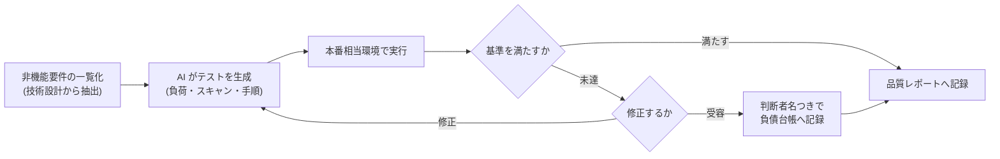

リリース準備フェーズの統合検証(integration-verify)の実施手順です。機能の正しさは反復構築の CI(G-5)と独立レビュー(G-6)で機能単位に担保済みなので、ここで検証するのは**機能横断でしか確認できないこと**——性能・セキュリティ・運用シナリオ——に限定します。

## 原則

- **合格基準は技術設計(G-3)の時点で数値として確定しておく**。リリース直前に基準を決めると、「今の実測値」に基準を合わせる誘惑に負ける
- 基準は [EARS 記法](/process-compass/phase4-process-design/ears-guide/)で書く(例: 「同時 1,000 リクエストの間、システムはエラー率 1% 未満を維持すること」)
- テストの生成・実行は AI と CI に任せ、**人の仕事は結果の判定と受容の意思決定**に限定する

## 検証の全体フロー

## 種類別の検証手段と実施手順

| 種類 | 検証手段(例) | 合格基準の例 | 実施タイミング |
| --- | --- | --- | --- |
| 性能 | 負荷試験スクリプト(k6・JMeter 等)を AI に生成させ CI から実行 | p95 応答 1 秒以内、同時 1,000 接続でエラー率 1% 未満 | リリース候補ごと |
| セキュリティ | 依存脆弱性スキャン+動的スキャン(OWASP ZAP 等)+認可の境界テスト | Critical / High 指摘 0 件、認可境界テスト全件 GREEN | 依存更新ごと+リリース候補ごと |
| 可用性・復旧 | バックアップからの復元演習、フェイルオーバー実験 | 復元が手順書どおり RTO 内に完了 | リリース候補ごと(演習は四半期でも可) |
| 運用シナリオ | 引き継ぎ文書(テンプレ5)の監視・復旧手順を、書いた本人以外がなぞる | 手順どおりに完了する(詰まったら手順書の欠陥) | 引き継ぎ文書の更新ごと |

実施手順は次のとおりです。

1. 技術設計の ADR と機能仕様から非機能要件を一覧化し、それぞれの合格基準(数値)を確認する。基準が決まっていない要件が見つかったら、技術判断者にその場で決めさせる
2. AI に検証手段(スクリプト・スキャン設定・演習手順)を生成させる。生成物は通常の PR と同じく独立レビューを通す
3. 本番相当環境で実行する。**開発機での実測は性能の証拠にならない**(環境差が結果を無効化する)
4. 結果を基準と突合し、判定を[品質レポート](/process-compass/phase4-process-design/deliverable-templates/)へ記録する。実測値と基準値を並記する(「OK」だけの記録は監査で証拠にならない)
5. 未達の要件は修正するか、受容して判断者名つきで[負債台帳](/process-compass/phase4-process-design/deliverable-templates/)へ移す。**判定記録のない非機能要件を残したまま出荷判定(G-7)へ進んではならない**

## CI への組み込み

- 負荷試験・動的スキャンは実行時間が長いため、PR ごとの CI(gate-g5)には入れず、**リリース候補タグを打った時点で走る別ワークフロー**にする(実装は [CI/CD ゲート構成](/process-compass/phase5-implementation/ci-gates/)と同じ要領)
- 結果はワークフローの成果物(artifact)として保存し、[エビデンス集約](/process-compass/phase5-implementation/ci-gates/)の入力にする

## テーラリング

| 条件 | 調整 |
| --- | --- |
| PoC | 統合検証は省略可(出荷判定自体を省略するため)。ただし本番化の際に必ず復活させる |
| 高品質要求・規制業 | 復元演習を定期実施に格上げし、スキャン結果の監査書式での保存を必須にする |
| 小規模(1〜2名) | 検証手段の生成と実行は AI・CI に全委任してよい。ただし判定と受容の意思決定は人が行う |
