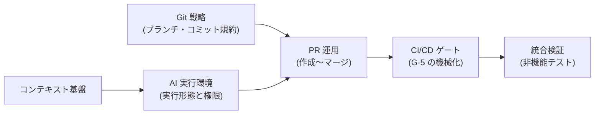

フェーズ5は、[フェーズ4のプロセス標準](/process-compass/phase4-process-design/overview/)を**実際の組織で動かす**ための段階です。

## 実装とは組織移行である

本フェーズにおける「実装」は、道具を設定することではなく、**組織の役割・手順・判断の仕方を移行させること**を指します。設定作業は移行の一部にすぎません。

| 誤った理解 | 本フェーズの定義 |
| --- | --- |
| 設定ファイルとワークフローを整備すれば完了する | 設定は前提条件にすぎず、判断の仕方が変わって初めて完了する |
| 標準を配布し、周知すれば運用が始まる | 配布と周知だけでは運用は始まらない |
| 全社へ一斉に展開する | 限定された範囲で試し、結果を示してから広げる |

道具の設定だけを行った組織では、標準が形式的な提出物として扱われ、判断の実質は従来のまま残ります。

## 移行の全体像

移行を5段階に分け、段階の境界に判定ゲートを置きます。

| 段階 | 内容 | 主な成果物 |
| --- | --- | --- |
| T-0 準備 | 導入の前提条件を評価し、不足を埋める | 前提条件の評価結果、移行計画 |
| T-1 限定試行 | 代表性のある案件で、範囲を絞って標準を適用する | 試行前チェックリスト、実測値 |
| T-2 増分展開 | 隣接する数チームへ広げる | 展開記録、支援の実施記録 |
| T-3 常態化 | 標準を既定の運用とし、逸脱の側を申請制にする | 規程への反映、教育の定着 |
| T-4 自走 | 支援組織が撤退しても維持される | 撤退の判定記録 |

各段階の手順、判定基準、チェックリスト、教育計画は[プロセスの社会実装計画](/process-compass/phase5-implementation/enablement/)に規定します。

## 段階と実装リファレンスの対応

| 段階 | 整備するリファレンス |
| --- | --- |
| T-0 | [Git 戦略](/process-compass/phase5-implementation/git-strategy/)、[PR 運用](/process-compass/phase5-implementation/pr-workflow/)、[CI/CD ゲート](/process-compass/phase5-implementation/ci-gates/) |
| T-1 | [AI 実行環境](/process-compass/phase5-implementation/ai-environment/)、[コンテキスト基盤](/process-compass/phase5-implementation/context-base/) |
| T-2 | [スタック型 PR](/process-compass/phase5-implementation/stacked-pr/)、[事前レビュー期間の自動化](/process-compass/phase5-implementation/pre-review-automation/) |
| T-3 | [統合検証(非機能)](/process-compass/phase5-implementation/nonfunctional-verify/)、[コンピューティング戦略](/process-compass/phase5-implementation/compute-strategy/) |

## 実装リファレンス一覧

各ページはコピーして使える設定例を含みます。参照モデルの最下層(個別作業)のページからも、対応するリファレンスへ直接リンクしています。

| ページ | 実装するもの | 対応ゲート |
| --- | --- | --- |
| [プロセスの社会実装計画](/process-compass/phase5-implementation/enablement/) | 移行段階・判定基準・教育計画・支援体制 | 移行全体 |
| [Git 戦略](/process-compass/phase5-implementation/git-strategy/) | ブランチモデル・命名語彙・ルールセット・コミットトレーラ | G-6 の機械強制 |
| [PR 運用](/process-compass/phase5-implementation/pr-workflow/) | PR テンプレート・サイズ上限・Draft 運用・レビュー対応 | G-5 / G-6 の日常運用 |
| [スタック型 PR](/process-compass/phase5-implementation/stacked-pr/) | 依存する変更を積み上げる場合の運用 | G-6 の分割単位 |
| [CI/CD ゲート](/process-compass/phase5-implementation/ci-gates/) | 必須チェック(gate-g5)・エビデンス自動集約 | G-5 / G-7 |
| [統合検証(非機能)](/process-compass/phase5-implementation/nonfunctional-verify/) | 性能・セキュリティ・運用シナリオの検証手順 | G-7 の入力 |
| [AI 実行環境](/process-compass/phase5-implementation/ai-environment/) | 権限設定(allow/deny/hooks)と実行形態 E1〜E3 | AI 協調ループ全体 |
| [事前レビュー期間の自動化](/process-compass/phase5-implementation/pre-review-automation/) | 会議前の非同期レビューの自動化 | B-1〜B-4 の運用 |
| [コンピューティング戦略](/process-compass/phase5-implementation/compute-strategy/) | CI リソースの確保と多段検査 | G-5 の運用コスト |
| [コンテキスト基盤](/process-compass/phase5-implementation/context-base/) | 恒久層・案件層の配置、CODEOWNERS、書き戻し | 文脈品質の維持 |

## 設定作業の順序

T-0 と T-1 で行う設定作業の順序です。**この順序は移行の順序ではありません**。設定が終わった時点で移行は始まったばかりです。

1. [Git 戦略](/process-compass/phase5-implementation/git-strategy/)のルールセットと [PR 運用](/process-compass/phase5-implementation/pr-workflow/)のテンプレートを設定する(半日)
2. [CI ゲート](/process-compass/phase5-implementation/ci-gates/)へ既存のテスト・静的解析を gate-g5 として束ねる
3. [コンテキスト基盤](/process-compass/phase5-implementation/context-base/)の恒久層を書き始め、[AI 実行環境](/process-compass/phase5-implementation/ai-environment/)を E1 から開始する
4. 運用が回り始めたら実行形態を引き上げ、[統合検証](/process-compass/phase5-implementation/nonfunctional-verify/)とエビデンス集約をリリースフローへ組み込む
