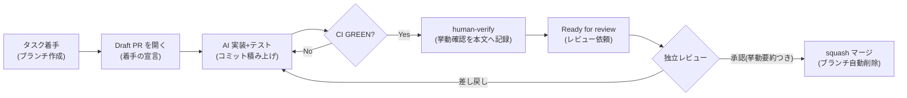

[Git 戦略](/process-compass/phase5-implementation/git-strategy/)がブランチとコミットの規約を定めるのに対し、このページは **PR(プルリクエスト)を日々どう回すか**を定義します。ピットイン方式では PR が「自動検証(G-5)・独立レビュー(G-6)の通過記録」そのものになるため、PR の運用品質がプロセスの統制品質を決めます。

## PR のライフサイクル



- **1タスク=1PR**。実装計画のタスクとの対応を本文に必ず書く(トレーサビリティの起点)
- PR は**タスク着手時に Draft で開く**。完成してから開くのではなく、着手の宣言として最初に開く(進行中の作業が全員に見える)

## ロール間非同期メッセージング（Label Mailbox 連携）

物理分割された各ロール（PO, Dev, QM, Audit, Platform）は、直接の同期通信や割り込みをせず、GitHubラベルをメッセージバスとしたポーリングベースの **[非割込型メッセージボックス（Label Mailbox）](/process-compass/phase5-implementation/label-mailbox/)** を使用して仕事を引き渡す。

- 開発に着手した際、Draft PR の状態では **`state:needs-dev`** ラベルを維持する。
- 実装・単体テスト（CI緑）が完了し、`human-verify` を記録して Ready にする際、開発者（Dev）は `state:needs-dev` を剥がし、**`state:dev-done`** ラベルを付与して出荷判定者（QM）へ引き渡す。
- 独立レビューにおいて差し戻し（BLOCK）が発生した場合、QMは **`state:qm-blocked`** を付与する。開発者は対応を終えて再 Ready 化する際、必ずこのラベルを剥がして再度 **`state:dev-done`** に戻す（復路の厳守）。

各ロールのエージェントセッションは、直接の指示を待つのではなく、Label Mailbox で規定された polling コマンドにより自律的に仕事を処理する。

## サイズ上限

| 項目 | 上限(目安) | 超えたときの扱い |
| --- | --- | --- |
| 変更行数 | ±400 行(自動生成ファイル・ロックファイルを除く) | タスクを分割し実装計画へ差し戻す |
| 変更ファイル数 | 15 ファイル | 同上 |
| レビュー所要時間 | レビュアが 30 分で読み切れること | 同上 |

- AI は大きな差分を一気に作れるため、**上限は人間のレビュー帯域で決める**。差分が大きいほどレビューは形骸化(rubber stamp)に近づき、独立レビューの統制が崩れる
- リネーム・フォーマット一括変更など機械的な大差分は、実質変更と PR を分ける(`chore/` で先行させる)

## 本文の必須欄(PR テンプレート)

リポジトリの `.github/PULL_REQUEST_TEMPLATE.md` に次を置き、必須欄を空にしたままのレビュー依頼を禁止します。

```markdown
## 対応タスク

Spec: F-xxx / Task-N(実装計画のタスクID。fix/chore の場合は Issue 番号)

## 変更の概要

<!-- 何を・なぜ。仕様にない変更(リファクタ等)が混ざる場合は明示する -->

## 検証方法と結果(human-verify の記録)

<!-- 人確定・協働の変更: 実際に動かして確認した手順と結果を、人が自分の言葉で書く。AI の説明の転記は不可 -->
<!-- 開発者の席の委任の範囲の変更(トレーラ Delegated がある変更): 担い手が、実行したコマンドと観測した結果を、実行結果の証拠として書く -->

## AI 関与範囲

- 生成: <!-- 例: 実装・テストとも AI 生成(Claude Code) -->
- 人の確認: <!-- 例: 全差分を読了、挙動をローカルで確認 -->

## 作成を指示した者

<!-- この変更の作成を AI または担当者へ指示した人。複数可。名簿(D-0 表5)の人で書く -->
<!-- 未記入の場合は、PR の作成者と開発者の席の責任者を指示した者とみなす -->

## リスク区分

R1 / R2 / R3 <!-- 変更ごとに1つ。AI は草案まで。確定は人が行い、確定した者を判定記録へ記名する -->

## レビュー観点の指定(任意)

<!-- とくに見てほしい箇所・自信のない判断 -->
```

- 「検証方法と結果」欄は、人確定・協働の変更では、**実装と検証タスク(human-verify)の完了記録**を兼ねる。開発者の席の委任の範囲の変更では、担い手が書く実行結果の証拠である。どちらの変更でも、空欄のまま Ready にした PR は差し戻し対象
- 「作成を指示した者」欄は、承認を独立した人の確認に数えるかどうかの判定に使う。承認した人がこの欄に載っていれば、その承認は独立した確認に数えない。2名体制で2人とも指示に関与した変更は、相互の確認では成立しない([第3章 3.5](/process-compass/phase4-process-design/roles-responsibilities/))。集計の規則は[CI/CD ゲート構成リファレンス](/process-compass/phase5-implementation/ci-gates/)「保証の開示の出力」による
- 「リスク区分」欄は、保証の開示の項目3 の集計元になる。区分は変更ごとに判定する([第3章 3.8.1](/process-compass/phase4-process-design/roles-responsibilities/))。未記入と、選択肢を残したままの欄は、記録の欠落として扱う
- PR を経ないコミットは、PR 本文の欄を持たない。リスク区分はコミットのトレーラ `Risk` で、検証の記載はトレーラ `Verification` で記録する([Git 戦略リファレンス](/process-compass/phase5-implementation/git-strategy/)「AI 生成コミットの扱い」)
- 「AI 関与範囲」欄は規制業テーラリング(AI 生成箇所のトレーサビリティ)の集計元になる。コミットトレーラ(Co-Authored-By)と二重になるが、PR 側は人間向けの要約、トレーラ側は機械集計用と役割が違う

### 自動で埋める欄と、人が書く欄

**必須欄をすべて手で書かせません**。7欄のうち、人が文章を書くのは1欄だけです。ほかに、人が確かめて確定する欄が2つあります。

| 欄 | 埋め方 | 導出元 |
| --- | --- | --- |
| 対応タスク | **自動** | ブランチ名、コミットのトレーラ |
| 変更の概要 | **自動起草 + 人の加筆** | 差分の統計、変更したパスの分類 |
| 検証方法と結果(human-verify) | 人確定・協働の変更では **人のみ**。開発者の席の委任の範囲の変更では、担い手が実行結果の証拠を書く | —(委任の範囲の変更では、実行したコマンドと観測した結果) |
| AI 関与範囲 | **自動** | コミットのトレーラ、エージェントの実行記録 |
| 作成を指示した者 | **自動起草 + 人の確認** | PR の作成者、開発者の席の責任者。ほかに指示へ関与した人がいれば、人が足す |
| リスク区分 | **AI の草案 + 人の確定** | 第3章 3.8.1 の観測可能な条件 |
| レビュー観点の指定(任意) | 人。任意 | — |

- 起草は Draft の作成時に1回だけ行う。**Ready 化の時点で上書きしない**。上書きは人の加筆を消す
- 「変更の概要」の自動部分は導出に限る。**仕様にない変更を含む場合、その明示は人が書く**。導出では意図を判定できない
- human-verify 欄が未記入のまま Ready にできないよう、検査で拒否する。「空欄のまま Ready は差し戻し」を人の目に頼らず機械化する
- 開発者の席の委任の範囲([第5章 5.5.4](/process-compass/phase4-process-design/human-ai-boundary/))で先へ進める変更では、「検証方法と結果」は担い手が実行結果の証拠として書く(第5章 5.5.6)。人の記入を要求しない。この欄は作成側の検証の記載であり、レビュアの挙動要約(G-6 基準2)とは別の記録である
- 独立レビュアの席だけが委任で、開発者の席が協働である変更では、「検証方法と結果」は人が書く。開発者の席の検証は、人が変更ごとに行う(第5章 5.5.6)

自動で確定させる欄を「対応タスク」「AI 関与範囲」に限るのは、この2欄が観測可能な事実だけで決まるためです。「作成を指示した者」には既定値を置くだけで、誰が指示に関与したかは人が確かめます。**判断を含む欄を自動生成させません**。

### human-verify を自動化しない理由と、様式の最小化

人確定・協働の変更では、human-verify の記述は、体裁を整えるための欄ではなく、**動かして確かめた人がいることの記録**です。生成物はその証拠になりません([附属書E E.9 禁止事項5](/process-compass/phase4-process-design/developer-guide/))。開発者の席の委任の範囲の変更では、この欄は実行結果の証拠であり、人が確かめたことの記録ではありません。人の確認は、独立レビュアによる事前の承認と挙動要約が担います。

自動化しない代わりに、様式を3要素へ絞ります。

| 要素 | 書くこと |
| --- | --- |
| 手順 | 実際に実行した操作 |
| 結果 | 観測した挙動 |
| 判断 | 受入基準を満たすと考えた理由を、自分の言葉で1文 |

**分量の下限を設けません**。3要素が揃っていれば、3行で足ります。長さを求めると、埋めるための文章が増え、記録の意味が薄まります。

### 記録の書き戻しを毎回求めない

[附属書E E.8](/process-compass/phase4-process-design/developer-guide/)の書き戻しは、**該当がある場合のみ**です。すべてのサイクルで3種類すべてを書く要求ではありません。

| 記録 | 書く条件 | 自動化の範囲 |
| --- | --- | --- |
| 判断記録(ADR) | 設計上の選択を伴った場合 | **起草まで**。確定は人。判断していない者は代替案の棄却理由を書けない |
| 技術負債台帳 | 妥協・仮実装を受容した場合 | **登録漏れの検出**を自動化する(出荷判定の集約が扱う)。登録そのものは人 |
| 恒久層コンテキスト | 規約・用語が変わった場合 | 更新案の生成は可。適用は[第3章 3.11.4](/process-compass/phase4-process-design/roles-responsibilities/)の保守要求による |

**「該当なし」を書かせません**。該当がなければ欄ごと出しません。空欄を埋める作業は、記録の量を増やして密度を下げます。

## 誰が PR を作るか(実行形態別)

[AI 実行環境](/process-compass/phase5-implementation/ai-environment/)の実行形態(E1〜E3)と対応させます。AI自律レベル(L1〜L3、[第5章 5.4](/process-compass/phase4-process-design/human-ai-boundary/))とは別の軸です。

| 実行形態 | PR の作成 | Ready 化の判断(人確定・協働の変更) |
| --- | --- | --- |
| E1(人が全承認) | 人が `gh pr create --draft` を実行 | 人 |
| E2(定型は自動) | AI が Draft PR まで作成し、人へ通知 | 人(human-verify 後) |
| E3(例外のみ人) | AI が Draft 作成〜CI 通過まで自走 | 人(human-verify は省略しない) |

Ready にする者は、運用形態で分かれます。

| 変更 | 検証欄を書く者 | Ready にする者 | レビュアの扱い |
| --- | --- | --- | --- |
| 人確定・協働の変更 | 開発者の席の人 | 人。Ready 化は「human-verify を完了した」という宣言である | 検証欄が AI の出力の転記であれば、差し戻してよい |
| 開発者の席の委任の範囲の変更(トレーラ `Delegated` があり、開発者の席の規則に該当する) | 担い手。実行結果の証拠を書く | **担い手が Ready にしてよい**。Ready 化は「G-5 の全項目を通過し、実行結果の証拠を書いた」という事実の表示であり、人の確認の宣言ではない | 検証欄が担い手の記載であることを理由に、差し戻さない。挙動要約と3パスは、事前に承認する独立レビュア(人)が行う |
| 独立レビュアの席だけが委任である変更(開発者の席は協働) | 開発者の席の人 | 人 | 事後の抜き取りで、3パスと挙動要約を行う |

ただし、[準拠テンプレート](/process-compass/phase5-implementation/template-repository/)の既定の権限設定(`.claude/settings.json` の許可リスト)に `gh pr ready` はありません。権限設定は強制層であり、組織が許可を足すまでは、委任の変更も人が Ready にします。担い手は設定を変えずに、Ready にしてよい状態であることを報告します。

委任の範囲に当たるかどうかは、担い手が判定しません。機械の規則によります(第5章 5.5.4)。規則に該当しなかった変更を担い手が Ready にしていた場合は、協働の変更として扱い、人が human-verify を行ってから Ready にし直します。

```bash
# タスク着手時(E1 の例): ブランチを切って空コミットで Draft PR を開く
git switch -c feature/F-012-task-3
git commit --allow-empty -m "feat: F-012 Task-3 着手"
git push -u origin feature/F-012-task-3
gh pr create --draft --title "feat: <タスクの要約> (F-012/Task-3)" --body-file .github/PULL_REQUEST_TEMPLATE.md
```

- 人確定・協働の変更では、どの実行形態でも **Ready for review にする判断は人間**が行う。Ready 化は「human-verify を完了した」という宣言であり、AI には代行させない

## Draft PR の扱い

- Draft の間はレビュー依頼・CODEOWNERS の自動アサイン対象にならない(GitHub の仕様)。レビュアの帯域を Ready な PR に集中させる
- CI は Draft でも回す(早く壊れを検知するため)
- 48 時間以上更新のない Draft はデイリーで状況を確認する(タスク粒度が大きすぎるサイン)

## レビュー対応とマージ

- レビュー指摘は**スレッド解決を必須**にする(ルールセットの `required_review_thread_resolution`)。「見たが直さない」判断も、理由をスレッドに書いてから解決する
- 指摘の修正は AI に任せてよい。ただし修正 push で承認は自動的に無効化されるため(`dismiss_stale_reviews_on_push`)、再承認を依頼する。修正が挙動に触れる場合は human-verify も更新する
- レビューは、レビュアごとの最後の状態で数える。承認の後に同じ人が変更要求を出した場合、先の承認は取り下げられたものとして扱う。出荷の証跡の集約も、独立した人の確認に数えない
- マージは **squash を既定**とし、squash 後のコミットメッセージにもトレーラを残す(履歴の集計可能性を保つ)。残すのは `Spec`・`Co-Authored-By` と、該当する場合の `Delegated`・`Risk`・`Verification` である。`Delegated` を落とすと、委任で先へ進めた変更を変更単位で識別できなくなる
- コミットが PR を経たかどうかは、PR のマージコミットとの一致で判定する。件名の `(#N)` では判定しない([Git 戦略リファレンス](/process-compass/phase5-implementation/git-strategy/)「マージ後の扱い」)
- マージ後はブランチ自動削除。次のタスクは最新の main から切り直す

## アンチパターン

| 症状 | 何が起きているか | 対処 |
| --- | --- | --- |
| 巨大 PR が常態化 | タスク分解が粗い(G-4 の形骸化) | サイズ上限で機械的に差し戻し、実装計画を修正 |
| 人確定・協働の変更で、検証欄が AI 出力のコピペ | human-verify の形骸化 | レビュアは検証欄の記述で差し戻してよい。開発者の席の委任の範囲の変更では、担い手の記載を理由に差し戻さない |
| Draft のまま数日放置 | タスクが大きすぎるか、着手だけして塩漬け | デイリーで Draft を確認する運用に組み込む |
| レビュー承認が即時に返る | rubber stamp 化(挙動要約がない) | 挙動要約のない承認は差し戻しとして扱う([第4章 G-6](/process-compass/phase4-process-design/gate-criteria/))。出荷の証跡の集約も、独立した人の確認に数えない |
