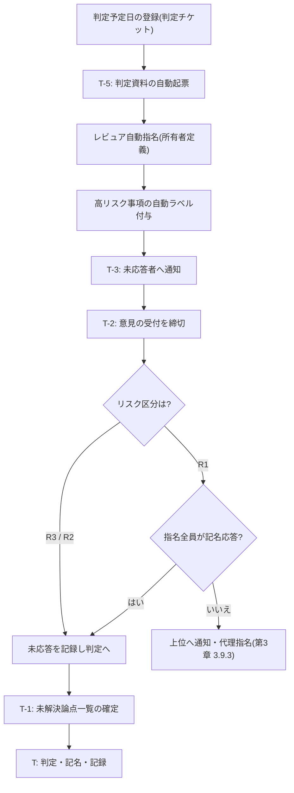

[第3章 3.10](/process-compass/phase4-process-design/roles-responsibilities/)が規定する事前レビュー期間を、人の記憶と善意に頼らず成立させる実装を定義します。手順書に書くだけでは、期限は守られず、意見のない承認が積み上がります。

## 何を機械に担わせるか

事前レビュー期間で人が判断すべきことは「意見の内容」と「判定」だけです。それ以外は自動化の対象です。

| 作業 | 担い手 | 自動化の手段 |
| --- | --- | --- |
| 判定資料の起票 | AIエージェント | 定期実行ワークフロー |
| 判定基準ごとの充足状況の記入 | AIエージェント | CI の判定結果から生成 |
| 高リスク事項の検出 | 静的解析・AI | 差分検査とラベル付与 |
| レビュアの指名 | 機械 | 所有者定義ファイル |
| 締切の通知 | 機械 | 定期実行ワークフロー |
| 未応答の記録 | 機械 | API による集計 |
| 意見の内容 | 人 | — |
| 判定 | 人(決定者1名) | — |

## 全体の流れ



## 判定資料の自動起票

判定チケットに判定予定日を登録すると、5営業日前(リスク区分 R1 は10営業日前)に判定資料が自動で起票されます。

```yaml
# .github/workflows/pre-review-open.yml(構成例)
name: pre-review-open
on:
  schedule:
    - cron: '0 0 * * 1-5' # 平日の日次実行
  workflow_dispatch:
jobs:
  open:
    runs-on: ubuntu-latest
    permissions:
      issues: write
      contents: read
    steps:
      - uses: actions/checkout@v4
      - name: 期間に入った判定チケットを抽出して資料を起票
        run: node scripts/pre-review/open.mjs
        env:
          GH_TOKEN: ${{ secrets.GITHUB_TOKEN }}
```

起票される資料は、[第3章 3.10.3](/process-compass/phase4-process-design/roles-responsibilities/)の5項目と1対1で対応させます。

```markdown
# 判定資料: <対象> / <ゲートまたは会議体>

- 判定予定日: YYYY-MM-DD / 決定者: <氏名>
- リスク区分: R1 / R2 / R3(根拠: <観測された事実>)
- 意見の締切: YYYY-MM-DD 17:00

## 1. 判定基準の充足状況
| # | 基準 | 状態 | 根拠 |
| --- | --- | --- | --- |
<!-- CI の判定結果から自動生成。未充足は理由を必須とする -->

## 2. 未解決の論点
| # | 論点 | 現時点の扱い | 起案者の見解 |
| --- | --- | --- | --- |

## 3. 自動検査が検出した高リスク事項
<!-- 認証・認可・個人データ・不可逆な変更・基準の逸脱 -->

## 4. 決定者に求める判断
<!-- 1件ずつ、判断を要する事項を明示する -->
```

資料の生成主体は AI エージェントですが、公開前に起案者が内容を確定させます。生成された資料をそのまま公開してはなりません。項目4(求める判断)は起案者が記入します。

## レビュアの自動指名

指名を人の記憶に委ねると、指名漏れと指名の偏りが生じます。対象領域から機械的に導出します。

```
# .github/CODEOWNERS(構成例)
/src/auth/            @org/security-reviewers @org/tech-leads
/src/payment/         @org/finance-reviewers @org/tech-leads
/docs/adr/            @org/tech-leads
/src/data/processes/  @org/context-owners
```

- 所有者定義ファイルの保守責任は文脈オーナーが負う
- 対象領域に所有者が定義されていない状態を検出し、CI で失敗させる
- 指名は記名で行い、部署名やグループ名のみの指名を認めない

## 高リスク事項の自動ラベル付与

リスク区分(R1〜R3)の判定材料は観測可能な事実に限られるため、機械が一次判定できます。

| 検出条件 | 付与するラベル |
| --- | --- |
| 認証・認可に関わる経路の変更 | `risk/R1` |
| 個人データを扱う構造体・テーブルの変更 | `risk/R1` |
| 公開インタフェース定義の変更 | `risk/R1` |
| データ移行を伴う変更 | `risk/R1` |
| 上記に該当せず、限定利用者へ影響する変更 | `risk/R2` |
| 上記のいずれにも該当しない | `risk/R3` |

機械の判定は一次判定です。**引き上げは誰でもできますが、引き下げは技術判断者の記名を要します**。自動判定を弱める方向の操作にのみ承認を課すことで、判定の緩和が記録されずに起きる事態を防ぎます。

## 締切の通知と未応答の記録

```yaml
# .github/workflows/pre-review-remind.yml(構成例)
name: pre-review-remind
on:
  schedule:
    - cron: '0 1 * * 1-5'
jobs:
  remind:
    runs-on: ubuntu-latest
    permissions:
      issues: write
      pull-requests: read
    steps:
      - uses: actions/checkout@v4
      - name: 締切3営業日前・当日の通知と未応答の記録
        run: node scripts/pre-review/remind.mjs
        env:
          GH_TOKEN: ${{ secrets.GITHUB_TOKEN }}
```

通知は督促のためだけに送るのではありません。**誰がいつ通知を受け、応答したかを記録に残すこと**が目的です。記録がなければ、[第3章 3.10.6](/process-compass/phase4-process-design/roles-responsibilities/)の「意見を出さなかった者の責任」を運用できません。

## 沈黙の扱いの機械化

リスク区分ごとに、必須ステータスチェックの構成を変えます。

| リスク区分 | 必須ステータスチェック | ブランチ保護の設定 |
| --- | --- | --- |
| R3 | `gate-g5` | 承認1件(独立レビュア) |
| R2 | `gate-g5`, `pre-review-closed` | 承認1件(独立レビュア) |
| R1 | `gate-g5`, `pre-review-closed`, `pre-review-all-responded` | 所有者定義による全員承認 |

- `pre-review-closed`: 意見の受付期間が終了し、全ての意見に起案者の応答が付いた状態で合格とする
- `pre-review-all-responded`: 指名レビュア全員が記名で賛否を示した状態で合格とする。R1 でのみ必須にする

R1 に限って全員の応答を必須にするのは、取り消せない決定に対して沈黙を同意と読み替えないためです。R3 まで同じ強度を課すと、待ち時間が増えるだけで検出できる欠陥は増えません。

## 意見の様式の機械検査

```yaml
# 意見コメントの検査(構成例)
- name: 理由のない反対を検出
  run: node scripts/pre-review/lint-comments.mjs
```

検査する内容は次のとおりです。

- 反対を示すコメントに理由の記述がない場合、その意見を未成立として差し戻す
- 反対に代替案または充足条件のいずれも添えられていない場合、同様に扱う
- 1つのコメントに複数の論点が含まれる場合、分割を促す

理由のない反対を無効とする規則は、反対する側にも説明の責任を課します。この規則がない場合、反対の表明だけで進行を止められるため、判定の遅延に対する責任が不在になります。

## 指標の自動集計

[第3章 3.10.8](/process-compass/phase4-process-design/roles-responsibilities/)の形骸化指標は、チケットとコメントの記録から自動で算出できます。

| 指標 | 算出方法 |
| --- | --- |
| 事前意見が0件の上程の比率 | 判定チケットのうち、期間内のコメント数が0のものの割合 |
| 判定当日に初めて出た論点の比率 | 締切後に作成された論点スレッド数 ÷ 全論点スレッド数 |
| 指名レビュアの応答率 | 記名応答者数 ÷ 指名者数(レビュア別に集計) |
| 資料公開から判定までの日数 | 判定日時 − 資料公開日時 |
| 応答が付いていない意見の比率 | 起案者の応答がないコメント数 ÷ 全コメント数 |

集計は月次で実行し、[フェーズ6(メトリクス)](/process-compass/phase6-operation/metrics/)のダッシュボードへ送ります。

## 導入の順序

すべてを同時に導入すると、運用が止まった際に原因を特定できません。次の順序で段階的に有効化します。

| 段階 | 有効化する範囲 | 判断の目安 |
| --- | --- | --- |
| 1 | 判定資料の自動起票と締切通知のみ | 資料の公開が期限どおりに行われる |
| 2 | レビュア自動指名と未応答の記録 | 指名漏れが解消し、応答率が計測できる |
| 3 | リスク区分の自動ラベル付与 | 一次判定の誤りが許容範囲に収まる |
| 4 | 必須ステータスチェックによる強制 | 段階1〜3 の記録が2か月以上蓄積している |

段階4を先に入れると、記録の裏付けを欠いたまま作業が止まり、規則の迂回を招きます。
