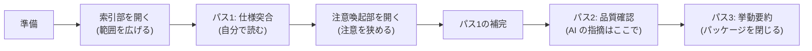

独立レビュー(G-6)の実施手順は[附属書C](/process-compass/phase4-process-design/review-guide/)に定めています。このページは、その実施を支援する**レビューパッケージ**の生成方法を定義します。

## なぜ必要か

[第8章 軸A](/process-compass/phase4-process-design/tailoring-guide/)は、1〜2名の体制では独立レビューを外部(他チーム・別部門・社外)へ依頼することを唯一の必須要件としています。一方[第4章](/process-compass/phase4-process-design/gate-criteria/)は、応答1営業日・判定2営業日の SLA を課しています。

**文脈を共有していないレビュアへこの SLA をそのまま課すと、滞留か、中身を見ない承認のどちらかに倒れます**。対象の設計標準・受入基準・過去の判断を把握していないためです。丁寧に取り組めば時間が足りず、間に合わせようとすれば中身を確認しないまま承認することになります。

Microsoft における観察・面談・調査の研究(2013年)でも、コードレビューの中心的な課題は**変更とコードの理解**であり、開発者が理解のために用いる手段の多くは既存のツールで満たされていないと報告されています。

## 満たすのは理解であって、理解の代行ではない

:::danger
**パッケージが検出能力を下げることがあります**。

乳房 X 線画像の読影を対象とした実験(2004年、放射線科医8名・110症例)では、コンピュータによる検出の手がかりを**画像の表示と同時に提示した条件で、手がかりのない領域における異常の発見が一貫して減りました**。偽陽性率の高い条件では、検出と分類の双方で平均性能が有意に低下しています。一方、**初回の解釈を終えた後に提示した条件では、影響は小さいと報告されています**。

さらに、自動化された補助を用いる意思決定の研究では、**補助が示さなかった事象の見落としは、訓練によって減らせなかった**とされています(補助の推奨への追従は訓練で減りました)。

**「鵜呑みにしないこと」という注意書きや教育では防げません。構造で防ぎます。**
:::

:::caution
上記の実験は放射線読影を対象としており、**コードレビューへの外挿は検証されていません**。共通するのは「限られた時間で、広い対象から異常を探す視覚的な探索課題」という構造です。本ページが採るのは**提示の順序に関する方向のみ**であり、検出率の数値は引用しません。
:::

## 何を含めてよいか: 3区分

| 区分 | 内容の例 | 扱い |
| --- | --- | --- |
| **対応関係**(事実) | 受入基準 CR-n と差分の対応、変更が触れる恒久層の設計標準、影響範囲(呼び出し元・依存)、同一箇所の過去の指摘 | 含めてよい |
| **観点**(読み方) | 「この変更は認可の判定に触れる。認可の観点で読むこと」 | 含めてよい |
| **結論**(判断) | 「受入基準を満たしている」「問題は見つからなかった」「この実装は安全である」 | **含めてはならない** |

境界の判定は次の一文で行います。

> **その記述が「レビュアが自分で確認しなくてよい」と読める場合、それは結論である。**

対応関係は機械的に導出でき、真偽を検証できます。観点は「どこを見るか」の指示であり、「何が起きているか」を述べません。**結論だけが、レビュアの確認を代替します**。

### 指摘の一覧はパッケージに含めない

AI による事前レビュー(静的な指摘出し)は、[附属書C](/process-compass/phase4-process-design/review-guide/)がパス2の補助として認めています。**これはパッケージとは別の成果物として、別の時点で提示します**。パッケージへ混ぜると、指摘のない箇所を「確認済み」と読ませることになります。

## 提示の順序

情報を**探索の範囲を広げるもの**と**注意を狭めるもの**に分け、前者を先、後者を後に置きます。



| 部位 | 性質 | 提示の時期 |
| --- | --- | --- |
| 索引部 | 探索の範囲を**広げる** | パス1の開始時 |
| 注意喚起部 | 注意を**狭める** | **パス1の完了後** |
| AI の指摘 | 注意を狭める | パス2 |
| (提示しない) | — | パス3(挙動要約はパッケージを閉じて書く) |

- **注意喚起部をパス1の前に開いてはならない**。開いた場合、挙げられていない箇所の確認が薄くなる
- **パス3ではパッケージを閉じる**。挙動要約はレビュア自身の理解の証明であり、参照しながら書いたものは証明にならない([附属書C](/process-compass/phase4-process-design/review-guide/))

この順序は[第5章 5.7.5](/process-compass/phase4-process-design/human-ai-boundary/)の認知強制機能(段階1で自分の方針を記述してから段階2で生成物を参照する)と同じ構造です。

## パッケージの構成

```markdown
# レビューパッケージ: PR #<番号>

<!-- 索引部: パス1の開始時に読む -->

## 1. 受入基準と差分の対応
| 受入基準 | 対応する差分 | 対応の根拠 |
| --- | --- | --- |
| CR-1 | src/a.ts L10-42 | 実装計画(テンプレ7)の Task-1 |
| CR-2 | src/b.ts L5-18 | 同 Task-2 |
| (対応が特定できない差分) | src/c.ts L1-9 | — |

<!-- 対応が特定できない差分を必ず列挙する。仕様外の変更の候補である -->

## 2. 影響範囲
- 変更したシンボルの呼び出し元: <一覧>
- 変更が触れる公開インタフェース: <一覧 / なし>
- スコープ層(G-4 判定基準5): SC-M / SC-P / SC-B / 範囲外

## 3. この PR の規模
- 変更行数 / ファイル数 / スタックの層数(第4章の分割基準との突合)

---
<!-- 注意喚起部: パス1を完了してから読む -->

## 4. 触れている恒久層の設計標準
| 標準 | 該当箇所 | 参照 |
| --- | --- | --- |

## 5. 同一箇所で過去に出た指摘
| 時期 | 指摘 | PR |
| --- | --- | --- |

## 6. 読む観点
- <「認可の判定に触れる。認可の観点で読む」のような、読み方の指示>
<!-- 「問題がある」「問題がない」と書いてはならない -->

---
**本パッケージは、ここに挙げた箇所以外に問題がないことを意味しません。**
```

末尾の一文を省略してはなりません。省略した場合、パッケージは網羅の主張として読まれます。

## 生成の方法

**生成を機械的な導出に限ります**。要約と評価を含めません。

| 節 | 導出元 | 手段 |
| --- | --- | --- |
| 1. 受入基準と差分の対応 | 実装計画(テンプレ7)の対応CR欄、コミットのトレーラ | 機械的な突合 |
| 2. 影響範囲 | 静的解析(呼び出し関係)、公開インタフェースの差分 | 解析ツール |
| 3. 規模 | 差分の統計 | 集計 |
| 4. 設計標準 | 恒久層コンテキストの索引と、変更したパスの対応 | 索引の検索 |
| 5. 過去の指摘 | 同一ファイル・同一シンボルに対する過去のレビューコメント | 履歴の検索 |
| 6. 読む観点 | 変更が触れる領域(認可・データ保全・外部インタフェース等)から導く既定の観点 | 対応表 |

- **節6の観点を自由記述で生成させてはならない**。領域と観点の対応表を組織が定め、そこから引く。自由記述を許すと結論が混入する
- 節1で**対応が特定できない差分を必ず列挙する**。仕様外の変更の候補であり、[附属書C](/process-compass/phase4-process-design/review-guide/)がパス1で最頻の混入物とする対象にあたる

CI での生成は、[G-5 のパイプライン](/process-compass/phase5-implementation/ci-gates/)に載せます。

```yaml
  review-package:
    needs: [test, static-analysis]
    runs-on: ubuntu-latest
    steps:
      - uses: actions/checkout@v4
      - name: レビューパッケージの生成(導出のみ・要約を含めない)
        run: node scripts/review-package.mjs --pr "${{ github.event.pull_request.number }}" --out review-package.md
      - uses: actions/upload-artifact@v4
        with:
          name: review-package-${{ github.event.pull_request.number }}
          path: review-package.md
```

## 誰が妥当性を保証するか

生成を導出に限ることで、妥当性の問題は**導出が正しいか**へ還元されます。要約と評価を含まないため、内容の妥当性について人の判断を要しません。

- 導出の正しさは、生成スクリプトのテストで担保する
- **パッケージの誤りをレビュアの責任にしてはなりません**。誤りを見つけた場合、レビュアは差し戻しではなく、生成の不具合として記録する
- 不具合の記録は、生成スクリプトの改修の入力とする

## 効果の検証

**導入して終わりにしません**。[第5章 5.6.2](/process-compass/phase4-process-design/human-ai-boundary/)の欠陥注入による検出率で、導入の前後を比較します。

| 項目 | 内容 |
| --- | --- |
| 測定の対象 | 工程(**個人単位の検出率を算出しない**) |
| 比較の方法 | 導入前の期間と導入後の期間の検出率 |
| 撤去の条件 | **検出率が導入前を下回った場合、パッケージを撤去する** |
| 併せて見る値 | レビューの所要時間、応答時間、差し戻し率 |

検出率の低下と所要時間の短縮が同時に起きた状態は、**支援ではなく置換が起きている**兆候です。

## このパッケージが埋められない穴

**パッケージが出せるのは、恒久層コンテキストに記録されている情報だけです**。

- 設計標準が記録されていなければ、節4 は空になる
- 過去の判断が ADR に残っていなければ、節5 は差分の履歴しか出せない

**パッケージは恒久層の整備を代替しません**。[コンテキスト基盤](/process-compass/phase5-implementation/context-base/)が空の組織では、パッケージも索引部しか生成できません。外部レビュアの文脈不足は、そこまでしか埋まりません。
