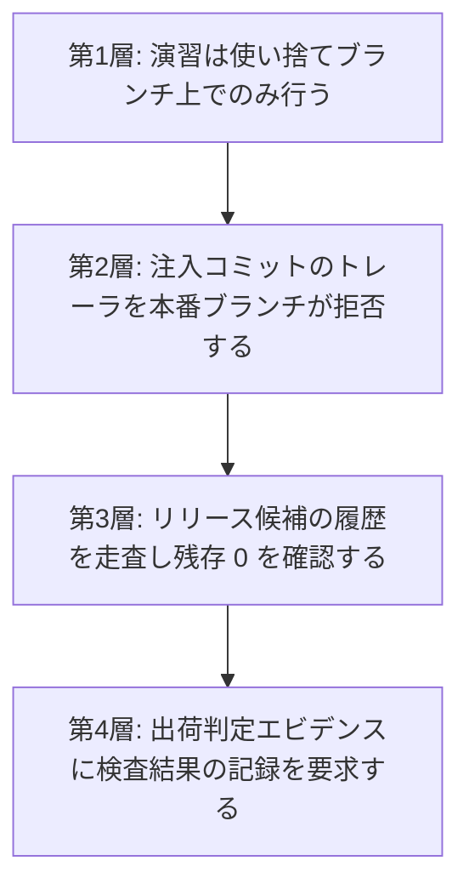

[第5章 5.6.2](/process-compass/phase4-process-design/human-ai-boundary/)は、レビュー工程の検出能力を測るために意図的な欠陥を注入する手続を規定しています。同項の要件1と2は、注入した欠陥が本番環境へ到達しないことと、検出されなかった場合に自動的に取り消されることを求めています。

本ページは、この2要件を実装する設計を示します。**注入した欠陥が1回でも製品へ到達した場合、それは測定の失敗ではなく品質事故です**。設計はこの前提から出発します。

## 除去の成功に依存させません

注入した欠陥を後から取り除く設計(以下、除去型)を採ってはなりません。除去型は、除去処理が毎回成功することを安全性の根拠に置きます。ビルドの失敗、マージの競合、手作業の割り込みのいずれかで除去が一度でも飛べば、欠陥はそのまま下流へ流れます。

代わりに**隔離型**を採ります。隔離型は、注入した成果物が製品のビルド対象へ到達する経路そのものを設けません。

| 型 | 安全性の根拠 | 破れ方 |
| --- | --- | --- |
| 除去型 | 除去処理が成功すること | 処理の失敗・スキップで直ちに流出する |
| 隔離型 | 到達経路が存在しないこと | 経路を新設する操作を要する |

## 遮断の4層

1つの機構が破れても次が止まる構成にします。**各層は独立に機能し、上位の層の成功を前提にしません**。



### 第1層 使い捨てブランチ

- 注入は、本番ブランチから分岐した演習用ブランチ上でのみ行う
- 演習用ブランチは命名規約(例: `drill/`)で識別し、**本番ブランチへのマージ先を持たせない**
- 演習の PR は、判定の記録を採取した時点で自動的に閉じる。マージという操作を選べる状態に置かない
- ブランチは期限で自動削除する。放置された演習用ブランチは、後日の手作業による取り込みの材料になる

### 第2層 トレーラによる拒否

注入したコミットには、機械が読める標識を必須とします。

```
Seeded-Error: SE-2026-0142
Seeded-Error-Expires: 2026-08-20
```

- 標識を欠いた注入を禁じる。標識のない注入は、以降のどの層でも検出できない
- 本番ブランチへの取り込みを、この標識を含むコミットの有無で拒否する。実装はホスティングのルールセットまたは受信側のフックによる
- 履歴の書き換え(スカッシュ)で標識が失われる経路を塞ぐ。演習用ブランチではスカッシュを禁じる

### 第3層 リリース候補の走査

タグの生成時に、前回のリリースから当該タグまでの差分と履歴を走査し、標識の残存と既知の注入識別子の混入を確認します。

| 検査対象 | 判定 |
| --- | --- |
| 標識を含むコミットの数 | 1件でもあれば失敗 |
| 注入台帳に登録され、かつ未回収の識別子 | 1件でもあれば失敗 |
| 期限を超過した未回収の注入 | 1件でもあれば失敗し、演習の実施を停止する |

**注入台帳は、注入の実施と回収を対で記録します**。台帳のない運用では、第3層は何と突き合わせるべきかを持ちません。

### 第4層 出荷判定への接続

[CI/CD ゲート構成](/process-compass/phase5-implementation/ci-gates/)のエビデンス集約へ、検査の実施記録を渡します。

```json
"seededErrors": { "scanRun": true, "residual": 0, "openDrills": [], "scannedAt": "..." }
```

- `scanRun` が false、または欠落している場合、集約ジョブを失敗させる
- 判定するのは**検査を実施し記録したこと**である。知財潔白性の検査([第4章 G-7 基準8](/process-compass/phase4-process-design/gate-criteria/))と同じ扱いによる
- 人間の出荷判定者に残存の確認を委ねない。第3層までで機械的に止まる構成にする

## 演習を停止する条件

演習は常時実施ではありません。次のいずれかに該当する期間は、注入を自動的に停止します。

| 条件 | 停止の範囲 |
| --- | --- |
| ファストトラック([第7章 7.4](/process-compass/phase4-process-design/exception-escalation/))を発動している | 当該案件の全体 |
| 障害対応中である([フェーズ6 インシデント対応](/process-compass/phase6-operation/incident-response/)) | 対象システムに関わる全ブランチ |
| リリース凍結期間である | 対象リポジトリの全体 |
| 未回収の注入が期限を超過している | 全社。回収まで新規の注入を行わない |

停止は自動で発火させ、停止の解除は人間の操作によります。**引き上げは判定を要し、引き下げは自動で行う**という非対称は、[第5章 5.4](/process-compass/phase4-process-design/human-ai-boundary/)の自律レベルと同じ設計です。

緊急時に演習を止める判断を、対応にあたる担当者へ求めてはなりません。判断の余地を残すと、最も余裕のない時点で余分な操作が発生します。

### 任意の停止を現場の裁量に置かない

上表の条件以外に、**担当者の申告だけで注入を止める経路を設けません**。理由は2つあります。

- 繁忙の度合いは常に主観的であり、申告による停止を認めると、測定の母集団から繁忙期が系統的に抜ける。繁忙期は**最も形骸化しやすい期間**であり、そこを欠いた測定は目的を果たさない
- 停止の可否が現場の裁量にあると、演習は「受けるかどうかを選べるもの」になり、事前周知の意味が失われる

上表の条件に当てはまらない事情で停止を要する場合は、申請によります。

| 項目 | 規定 |
| --- | --- |
| 申請者 | 対象チームの責任者 |
| 承認者 | 品質保証の機能。開発ラインの上位者ではない |
| 期間 | 期限を必須とする。自動延長を認めない |
| 記録 | 停止した期間と理由を、演習の記録へ残す |

停止の申請が繰り返される場合、原因は演習ではなく作業量の計画にあります。この事実は改善サイクルへ渡します。

## 注入に気づいたときの手続

注入と気づいた担当者が、次に何をすればよいかを定めます。**定めない場合、気づいた側が判断に迷い、報告されないまま処理されます**。

| # | 手続 |
| --- | --- |
| 1 | 演習の識別子を添えて報告する。報告は1つの操作で完了する形にする(ラベルの付与、または1つのコマンド) |
| 2 | 当該の変更は演習として閉じる。通常の差し戻しの手続へ載せない |
| 3 | 見つけた欠陥の類型をチームへ共有する。**誰が見つけたかを含めない** |

**演習かどうかの判別を担当者へ求めません**。確信が持てない場合は、通常の指摘として書けば足ります。注入と気づかないまま通常の指摘として処理された場合も、検出として数えます。判別を要求すると、レビューの本来の目的と無関係な認知の負荷が増えます。

### 報奨を設けない

検出に対する報奨・表彰・順位付けを行いません。位置づけを競技へ寄せる設計も採りません。理由は3つあります。

- 報奨は個人単位の集計を前提とする。[第5章 5.6.2](/process-compass/phase4-process-design/human-ai-boundary/)は、件数の不足を理由に個人単位の検出率の算出を禁じている。報奨はこの禁止と両立しない
- 検出を報われる行為にすると、**見つけやすい欠陥を探す方向へ最適化される**。実務で問題になる欠陥の多くは記述の欠落であり、探しにくい側が残る
- 同じ理由から、[第3章 3.10.11](/process-compass/phase4-process-design/roles-responsibilities/)は事前レビューの応答に報奨を設けない立場を取っている。演習だけ別の原理を持ち込まない

**「監視されている」という受け取りへの対処は、位置づけの言い換えではなく、測定の対象が工程であることの明示によります**。次節の事前周知がその手段です。

### 事前周知に含める事項

[第5章 5.6.2](/process-compass/phase4-process-design/human-ai-boundary/)の要求事項1(実施の事前周知)について、周知に含める内容を定めます。

| # | 周知する内容 |
| --- | --- |
| 1 | 注入を実施すること。ただし個々の時期と箇所は知らせないこと |
| 2 | 測定の対象が工程であり、個人の検出率を算出しないこと |
| 3 | 結果を人事評価および処遇の材料にしないこと |
| 4 | 見逃しの区分(過失によらない見逃し / 危険な習慣 / 意図的な逸脱)と、措置の対象が第3区分に限られること |
| 5 | 演習が自動的に停止する条件 |
| 6 | 注入に気づいたときの報告の方法 |

項目2から4を欠いた周知は、「試されている」という受け取りをそのまま残します。**実施の告知だけでは不十分です**。

## 注入の設計に対する制約

隔離設計が成立するために、注入する欠陥の側にも制約を置きます。第5章 5.6.2 の要件に、実装上の制約を加えます。

- 演習用ブランチの外へ持ち出しうる形(共有ライブラリ、設定ファイル、生成器の既定値)へ注入しない
- 依存関係の追加・更新として注入しない。依存の解決は演習の境界を越えて伝播する
- 本番のデータストアおよび外部サービスへ到達する経路を持つ変更へ注入しない
- 動作に致命的な影響を与える欠陥を含めない(5.6.2 要件6の再掲)

## 隔離が破れる唯一の経路

**演習用ブランチから人が手作業でコードを写し取る操作は、機械では止まりません**。第2層の標識はコミットに付くものであり、内容を別のブランチへ書き写した場合は残りません。

この経路に対して本標準が置くのは次の2点です。

- 演習で用いたコードの持ち出しを規約で禁じる
- 演習の対象を、製品の実装として再利用する動機の生じない範囲へ限定する

機械的な保証がないことを明記します。**「4層あるので流出しない」とは書きません**。層が守るのは、通常の操作の範囲で流出が起きないことです。

## 測定の対象を個人にしない

注入の結果を個人の成績として扱わない要求は、[第5章 5.6.2](/process-compass/phase4-process-design/human-ai-boundary/)および 5.6.3 に規定済みです。実装においても次を守ります。

| 実装上の要求 |
| --- |
| 台帳と検査の出力に、検出者・見逃した者の個人識別子を含めない |
| 集計はチーム単位および工程単位に限る |
| 見逃しの区分判定(過失によらない見逃し / 危険な習慣 / 意図的な逸脱)は品質保証の機能が行う。自動判定しない |
| 台帳と検査の出力に、受注者を識別する欄を設けない |

委託による開発では、受注側の評価および契約上のペナルティの根拠にも用いません(第5章 5.6.2)。

見逃しに対する措置を実装へ組み込んではなりません。措置の対象は 5.6.3 の第3区分に限られ、その判別は人間の手続によります。**自動的に権限を制限する仕組みを置くと、演習は隠蔽の対象になります**。

## 関連するページ

- [第5章 5.6.2 欠陥注入による検出能力の測定](/process-compass/phase4-process-design/human-ai-boundary/) — 要求事項の本体
- [第5章 5.6.3 見逃しが生じた場合の区分](/process-compass/phase4-process-design/human-ai-boundary/) — 措置の適用範囲
- [CI/CD ゲート構成リファレンス](/process-compass/phase5-implementation/ci-gates/) — エビデンス集約
- [第7章 例外とエスカレーション](/process-compass/phase4-process-design/exception-escalation/) — ファストトラック
