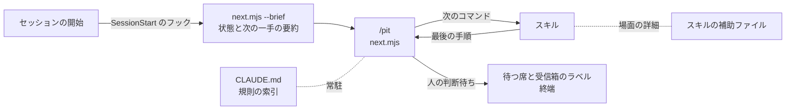
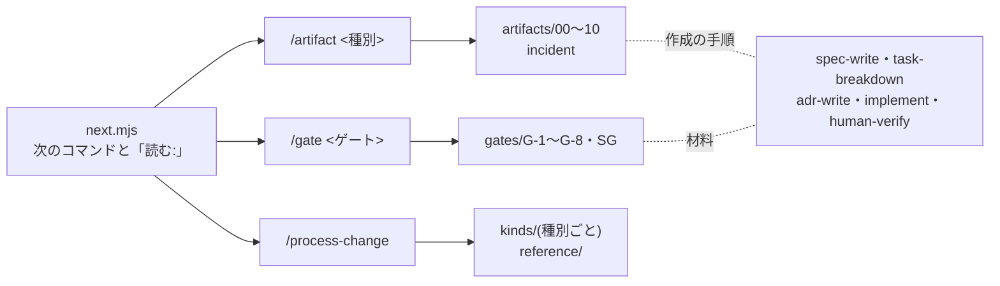

新規プロダクトの立ち上げ時に、本標準へそのまま乗るためのテンプレートリポジトリを提供します。

- リポジトリ: [Takenori-Kusaka/pit-in-template](https://github.com/Takenori-Kusaka/pit-in-template)
- 本サイトからは `template/` としてサブモジュール参照する

読者が各章を読んでワークフローと成果物置き場を自分で組み立てる負担をなくすことが目的です。**採用されない標準は、実証もされません**。

## 使い方

| # | 操作 |
| --- | --- |
| 1 | GitHub の Use this template から新しいリポジトリを作る |
| 2 | Claude Code で開く。起動時のフックが、いまの状態と次の一手を文脈へ入れる |
| 3 | `/pit` を実行し、出力の次のコマンドに従う(最初は `/process-init`) |
| 4 | 「人の判断待ち」が出たら、示された席の人が判断して記録し、`/pit` に戻る |
| 5 | 体制が変わったら `/process-change` を実行する |

`/process-init` は[第8章](/process-compass/phase4-process-design/tailoring-guide/)の軸A〜E を対話で聞き、ゲート構成・成果物・ブランチ保護を導出します。設問の文言は[知識ベース](/process-compass/tool/knowledge-base-schema/)の `questions` をそのまま使い、専門用語で聞き直しません。

初期化の前後の履歴は、出荷の証跡の集約で次のとおり扱います。

| 履歴 | 扱い |
| --- | --- |
| 構成の初期化の記録より前のコミット(`pre-init`) | 変更の件数に数えず、欠落にもしない。独立した人の確認・リスク区分・検証の記載を確かめない。製品のコード(記録の置き場の外)を変えたコミットは、件数を保証の開示の項目1・5 に出し、品質レポートに一覧を出す。テンプレート由来の初期コミット(親を持たず、テンプレートのファイルだけを持つもの)は、一覧から除いて件数だけ出す |
| `/process-init` が作るコミット | 対象。生成物と開発の基盤を、ブランチを切って PR で入れる(本文の末尾の段落にトレーラ `Spec: setup`)。PR を作れない環境に限り PR を経ずに入れ、トレーラ `Risk` と `Verification`(契約検査の結果)を書く |

初期化のコミットを PR で入れるのは、このコミットが強制層の初期値を含み、記録だけのコミットに当たらないためです。独立レビュー(G-6)を適用する体制では、PR を経ないコミットは出荷の証跡で欠落になります(#286 の通しの検証で、3名の体制が案内どおり main へ直接入れた初期化のコミットが、出荷の時点で欠落になった)。初期化が書くファイルだけのコミットを集約の対象から外す案は採りませんでした。作成を指示した本人以外が強制層の初期値を確かめる機会を失うためです。

## 生成されるもの

| 生成物 | 役割 |
| --- | --- |
| `PROCESS-PROFILE.md` | 人が読む構成書。標準からの差分と、その理由 |
| `process.config.json` | 機械が読む構成。CI と作業スキルが参照する |
| `.github/workflows/` | 有効なゲートのワークフロー |
| `.github/rulesets/` | 規模に応じたブランチ保護。独立レビュー(G-6)を適用しない構成にも、必須チェック(gate-g5)だけの `checks-only.json` を置く。適用は人が行い、私有リポジトリではプランによって使えない(その場合は出荷判定の証跡の集約による事後の検出だけになる) |
| `context/projects/<案件ID>.md` | 案件層コンテキストの初期ファイル(`context/projects/README.md` の見出し)。企画書ではない。企画書の置き場は `docs/project-brief.md` の1か所だけ |
| 開発の基盤(無いファイルだけ) | 初回の G-5 を通す最小のファイル。node では `package.json`(`test` と `coverage` のスクリプト、`c8` の固定の版)、秘匿情報の検査の設定(`.secretlintrc.json`)、テストの置き場(`tests/README.md`)を作る。python・go では秘匿情報の検査の設定を作り、ほかに作るべきファイルを初期化の出力に列挙する。既存のファイルは書き換えない。スタックを後で確定した場合は `generate-profile.mjs --scaffold` で作る |

開発の基盤を初期化で作るのは、#286 の通しの検証で、初回の G-5 を通す基盤(カバレッジのスクリプト、ロックファイル、秘匿情報の検査の設定)が無く、利用者が AI と数往復して足したためです。ロックファイルは版の解決にネットワークを要するため作らず、`npm install` で作る手順を出力に出します。G-5 は `node scripts/gate/g5-local.mjs` で、CI と同じ範囲を手元で確かめられます。

## 常駐の索引と次の一手

プロセスを熟知していない利用者が、AI に大量のプロセス情報を渡さずに運用できるよう、テンプレートは次の3つを組にしています(#286)。

| 仕組み | 中身 |
| --- | --- |
| 常駐の索引(`CLAUDE.md`) | 規則を1規則1行で常駐させる。理由・手順・場面限定の詳細だけを、スキルの補助ファイルへ移す。各行は詳細の所在を持つ。生成区間は構成の要約と、詳細を出すコマンドだけにする |
| 次の一手(`scripts/gate/next.mjs`、`/pit`) | 構成・D-0・判定記録・機能仕様・ローカルの git・自己修正のロックから、機能ごと・ロールごとの段階と次の一手を出す。決定的であり、AI に判定させない。前提の台帳(`docs/assumptions.md`)が無ければ、最初のゲートの材料と同じ時点で作成を案内する(段階は止めない)。判定記録があるのに通過に数えない場合は、記録の所在と理由を出す。D-0 節3 の「決定」が空欄の行を注記に出す |
| セッションの開始時の注入 | `.claude/settings.json` の `SessionStart` のフックが `next.mjs --brief` を実行する。実行に失敗した場合は、何も注入しない |

**機械の担保が無い規則を、常駐の索引から外していません**。常駐した指示はよく守られ、スキルは呼ばれないことがあるためです。外したのは規則の説明・理由・手順・場面限定の詳細(受信箱の各ロールのコマンド、委任の経路の詳細、例外の経路の詳細、タスクの粒度の値の由来と大きな PR の論考、参照リンク)です。ロールごとの判定ゲート・受信箱・兼務の禁止は、構成から毎回導出する `next.mjs --role <ロール>` が出します。

### 次の一手の種類

| 種類 | 意味 |
| --- | --- |
| 次のコマンド | AI の担い手が実行してよいコマンド。読むべき補助ファイルの所在を添える |
| 人の判断待ち | ゲートの判定、席の責任者の任免、D-0 の承認、受入基準へ戻る判断、出荷の実行。**終端**であり、AI の担い手が実行するコマンドを出さない。待つ席と受信箱のラベルを出す |
| 判定できない | 状態を決められない。理由を出し、推測で次のコマンドを出さない |

段階は、案件(D-0 → 席の任免 → D-0 の承認 → 企画承認)、機能(受入基準 → 曖昧語 → 要件合意 → 実装計画 → 機能仕様承認 → 実装 → 取り込み)、出荷(運用引き継ぎ文書 → 証跡の集約 → 出荷判定 → リリース決裁 → 出荷の実行 → 出荷済み)の順に判定します。有効でないゲートの判定待ちは出しません。

出荷の範囲は、最後のタグから既定ブランチの先頭までです。出荷判定・リリース決裁の判定記録は、範囲の中の最後の「変更」より後に判定されたものを数えます。判定記録と証跡だけを変えたコミットは、変更に数えません。判定記録を PR で取り込むと、その取り込みのコミットが既定ブランチの最後のコミットになるためです(#286 の通しの検証で、判定記録の取り込みの後も「G-7 の判定記録がない」と出し続けた)。タグより後に変更が無ければ「出荷済み」を出します。

全文の出力の末尾には、その出力に出た用語(ゲート、席、責任者、運用形態、受信箱、判定記録など)の1行の説明を添えます。定義の正本は標準と `context/glossary.md` です。

### 常駐する量

初期化後の `CLAUDE.md` の量を、改訂の前後で測りました(2026-10-01)。トークン数は推定です(和文1字を1、ASCII 3.5字を1と数えた。トークナイザは使っていない)。

| 体制 | 改訂前 | 改訂後 |
| --- | --- | --- |
| 1名(PoC) | 42.3KB、約13,600 | 16.7KB、約5,500 |
| 5名(MVP) | 41.9KB、約13,500 | 16.1KB、約5,300 |
| 15名(グロース) | 42.1KB、約13,500 | 16.1KB、約5,300 |

**目標**: 初期化後の `CLAUDE.md` を、推定 6,000 トークン以下に収めます。改訂後の実測(約5,300〜5,500)に、索引へ規則を足す余地を加えた値です。規則を足して超える場合は、規則を落とさず、説明・理由・手順を補助ファイルへ移して収めます。

:::caution[暫定 EV-0066 / 見直し 2027-03]
**対象**: 初期化後の `CLAUDE.md` を推定 6,000 トークン以下に収めるという目標。
**根拠の水準**: E1(間接)。
**差し替え条件**: 遵守の場面集(#286 の検証の手順)を、改訂前のテンプレート(pit-in-template `ff13247`)と改訂後で実行し、規則を守った件数を比べる。改訂後に遵守の下がった規則が1件でもあれば、その規則の説明を常駐へ戻し、目標を上げる。逆に、遵守が下がらないまま規則の追加で目標を超えそうになった場合は、目標を上げずに説明を補助ファイルへ移す。

ベンダーの手引きの目安(常駐する指示は 200 行未満など)は測定の根拠を示していません。外部調査では、ファイルの長さや規則の本数が課題の成功率に有意に効かなかった測定がある一方、常駐から外した規則は読まれないことがある、という知見があります(2026-09 時点、`research/282-survey-2026-09/`)。このため、規則は常駐の索引に残し、外すのは説明だけにしています。値そのものに実証はありません。
:::

改訂後の値は、G-5 の PR 単位の検査を索引の各行へ書き足した後の量です(書き足す前は約5,100〜5,200)。#286 の通しの検証による修正(曖昧語検査の範囲と `Spec: setup` を索引へ書き足した)の後は、初期化の直後で、1名 16.8KB・約5,500、3名 16.4KB・約5,400 です。改訂前は、冒頭の「まず読むもの」が `PROCESS-PROFILE.md` と `process.config.json` の全文を指していたため、起動時に約81KB を読んでいました。改訂後は全文を読ませず、コマンドの出力を読ませます。セッションの開始時に注入する要約は、段階によって約170〜380字です。

### 規則と担保の対応

常駐の索引に残した規則と、指示文に加えて機械が止める仕組み、詳細の所在の全数です。「なし」は指示文だけに依る規則です。

| 区分 | 規則 | 機械の担保 | 詳細の所在 |
| --- | --- | --- | --- |
| 人へ戻す | (a) 人が確定する判断(ゲートの判定、R1・R2 の決定、例外承認)で止まる | 一部。`next.mjs` が判定待ちを人の判断待ち(終端)として出す。先へ進むことそのものは止めない | `pit/reference/handoff.md` |
| 人へ戻す | (b) 受入基準・スコープ・公開インタフェース・データ形式を変える選択で止まる | なし | 同上 |
| 人へ戻す | (c) 取り消せない操作で止まる | 一部。権限設定の確認・拒否(強制 push、`gh pr merge`、ルールセットの API、`npm publish`) | 同上 |
| 人へ戻す | 承認済みの基準とスコープの内側の選択は、自分で決めて記録する | なし | `pit/reference/boundaries.md` |
| 人へ戻す | `state:needs-tech` はセッションを分けて受け取る | なし | `pit/reference/handoff.md` |
| 人へ戻す | 統制の弱化は、差分の一致までを確かめ、許容を判断しない | 一部。強制層への書き込みはフックが遮断する(段階に依る) | 同上 |
| 人へ戻す | 引き渡し先が分からなければ `state:needs-po` | なし | 同上 |
| 禁止事項1 | 受入基準を確定せずに実装を始める | 一部。`next.mjs` は機能仕様承認の前に実装を出さない。G-5(`pr-rules`)は、製品のコードを変える PR のトレーラ `Spec:` が指す仕様とタスクの実在を確かめる。G-4 の記録が無い変更を、証跡の集約が欠落にする | `spec-write/SKILL.md`、`gate/gates/G-4.md` |
| 禁止事項2 | AI が生成した受入基準をそのまま承認する | なし | `pit/reference/boundaries.md` |
| 禁止事項3 | テストの失敗を、テスト側の変更で解消する | フック(自己修正のロック中。段階に依らない)と `self-heal.mjs`(反復上限で保留)。ロックの外の既存のテストの変更(削除・期待値の変更の候補)は、G-5(`pr-rules`)が PR へ一覧を出す。一覧は G-6 の材料であり、合否には使わない | `implement/SKILL.md` 手順4、`gate/gates/G-6.md` |
| 禁止事項4 | 差分を確認せずに承認する | なし | `pit/reference/boundaries.md` |
| 禁止事項5 | 独立レビューの挙動要約を AI に生成させる | なし | 同上、`human-verify/SKILL.md` |
| 禁止事項6 | 閾値・重大度・除外設定を機能変更と同じ PR で変える | G-5(`pr-rules`)。基底にある閾値・除外設定のファイル、または構成の `ci`・`task`・`guard` と、製品のコードが同じ PR で変わったら失敗させる。閾値だけの PR と初回の設定は通す。依存と設定を兼ねるファイルの中は見ない | `pit/reference/boundaries.md`、`process-change/kinds/settings.md` |
| 禁止事項7 | ラベルを貼らず、コメントや `@mention` だけで引き渡す | なし | `pit/reference/handoff.md` |
| 禁止事項8 | 差し戻し対応後のラベルの付け替えを忘れる | なし | 同上 |
| 禁止事項9 | 事前承認のない外部の公開ホストへ決裁資料やログを置く | なし | `pit/reference/boundaries.md` |
| 委譲できない | 安全に関する最終的な判断 | なし | 同上 |
| 委譲できない | 人のレビューを経ない安全関連コードの変更 | なし | 同上 |
| 委譲できない | 形式的な検証活動そのものの代替 | 一部。G-5 はテストの実行コマンドが空の構成を失敗させる | 同上 |
| 委譲できない | 挙動の非決定性を隠す目的の実装 | なし | 同上 |
| 委譲できない | 認証・認可・個人データ・外部との契約に関わる決定 | なし | 同上 |
| 委譲できない | 適用範囲そのものの拡大 | なし | 同上 |
| 判断の確定 | 4種類の確定とゲートの判定は、席の責任者が記名で行う | 一部。責任者・決定者・承認者の欄の AI の名義を、`/process-change` と契約検査が拒否する | 同上 |
| 判断の確定 | 起案した主体は、その成果物の判定者にならない | 一部。証跡の集約は、作成を指示した者の承認を独立した確認に数えない | 同上 |
| 判断の確定 | 委任の範囲に当たるかを自分で判定しない | `verify-gate-contract --delegation` と `delegation.yml`(既定ブランチの構成で判定) | `implement/SKILL.md` 手順8 |
| 判断の確定 | 委任の変更を自分でマージしない | 権限設定(`gh pr merge`)とブランチ保護 | 同上 |
| 判断の確定 | 判定を通すための分割・低いリスク区分・トレーラだけの追加をしない | 一部。トレーラ `Delegated` を持つ変更の R1・R2 の記録を、証跡の集約が逸脱にする | 同上 |
| 判断の確定 | 運用形態は上限の宣言。緩める向きを AI が決めない | 契約検査(上限の超過)と `/process-change`(緩める向きは記名と理由) | `pit/reference/boundaries.md` |
| 判断の確定 | 責任者・決定者・承認者の欄へ AI の名義を書かない | `/process-change` と契約検査 | 同上 |
| 判断の確定 | AI の確認は検出の層。承認・通過と記録しない | 一部。AI レビューの承認と合否条件を、契約検査が拒否する | 同上 |
| 判断の確定 | 確認する側は作成側の説明を判断の前に読まない(入力の分離) | なし | 同上 |
| 判断の確定 | 人確定・協働の変更の「検証方法と結果」と Ready 化は人が行う | 一部。既定の権限設定に `gh pr ready` が無い | `implement/SKILL.md` 手順7 |
| 受信箱 | 自分のロールの受信箱だけを見る | なし | `next.mjs --role` |
| 受信箱 | Draft の間は `state:needs-dev`、完了で `state:dev-done` | なし | `pit/reference/handoff.md` |
| 受信箱 | 差し戻しは最優先で直し、`state:dev-done` へ戻す | なし | 同上 |
| 受信箱 | 記録を書いてからラベルを動かす | なし | `gate/SKILL.md` 手順6 |
| 受信箱 | 再配分した仕事を自ら拾わない | なし | `pit/reference/handoff.md` |
| 受信箱 | エスカレーションをラベルの付与だけで済ませない | なし | 同上、`next.mjs --role` |
| 受信箱 | 指示資産の統合・削除は AI維持管理者へ集約する | 一部。強制層の設定とフックへの書き込みは、フックが遮断する(段階に依る) | `pit/reference/handoff.md` |
| 基準の不充足 | 3つの経路を、その場の判断で選ばない | なし | `gate/reference/exception-paths.md` |
| 基準の不充足 | 未解決事項はゲートの通過を妨げない。判定は2値 | なし | 同上 |
| 基準の不充足 | 次工程の材料の未完成を差し戻し理由にしない | なし | 同上 |
| 条項の適用 | 条項番号だけを根拠にしない | なし | `next.mjs --scopes` |
| 条項の適用 | リスク区分は変更ごとに判定する | なし | 同上 |
| 受入基準 | 曖昧語を使わない | spec-lint(G-5)。範囲は機能仕様の置き場(`specs/F-NNN/`)。引数なしの手元の実行も同じ範囲を見る | `spec-write/SKILL.md` |
| 受入基準 | 書けない機能は分解してから実装へ渡す | なし | 同上 |
| 粒度 | 1タスク = 1レビュー単位。上限の内に収める | G-5(`pr-rules`)。基底ブランチの構成の上限を、製品のコードの差分で検査する。ロックファイル・生成物・空白だけの変更・名前の変更・文書と記録は数えない | `implement/reference/task-size.md` |
| 粒度 | 上限超過は実装計画へ差し戻す。細切れに分割しない | 一部。G-5(`pr-rules`)は、基底ブランチの台帳にその PR の例外承認の行がある場合だけ、超過を通す。細切れの分割は止めない | 同上 |
| 粒度 | 分割しすぎない | 一部。G-5 は変更ごとにビルドとテストを実行する | 同上 |
| 粒度 | 較正の手続を自動化しない | なし | 同上 |
| 自己修正 | ロックをスクリプトで始め、反復を数える | フックと `self-heal.mjs` | `implement/SKILL.md` 手順4 |
| 自己修正 | 反復上限で人が受入基準へ戻る | `self-heal.mjs iterate`(上限で保留) | 同上 |
| 自己修正 | テストの修正を要したら終える。ロックを消さない。保留を自分で解かない | 一部。ロックのファイルへの書き込みはフックが拒否する。シェルからの削除と `release` の実行は止めない(記録に残る) | 同上 |
| ブランチとコミット | トランクベース。squash でマージする | 一部。ルールセット(G-6 を適用する構成は `team`・`regulated`、それ以外は必須チェックだけの `checks-only`)。適用は人が行い、プランによって私有リポジトリでは使えない | `implement/reference/commit.md` |
| ブランチとコミット | ブランチ名の規則 | なし(`next.mjs` はこの名前で実装中を判定する) | 同上 |
| ブランチとコミット | コミット種別 | なし | 同上 |
| ブランチとコミット | トレーラ `Spec:`・`Co-Authored-By:`・`ADR:` | 一部。G-5(`pr-rules`)が PR の本文の末尾の段落の `Spec:` を検査する(製品のコードを変える PR)。設定・ツール・雛形のファイルだけの PR は `Spec: setup` で通し、製品のコードを含めば落とす。`Spec:` が指す仕様の G-4 の記録を、証跡の集約が確かめる | 同上 |
| ブランチとコミット | 委任の変更のトレーラ `Delegated:` | 一部。証跡の集約が委任の変更を数える | 同上 |
| ブランチとコミット | PR の本文を様式から作り、リスク区分を1つだけ残す(文書・記録だけの PR、`Spec: setup` の PR も同じ) | G-5(`pr-rules`)。本文の「リスク区分」の節が1つの区分に定まらなければ、変更の種類に依らず失敗させる。区分の妥当性と確定した者の記名は見ない | `implement/reference/commit.md`、`.github/PULL_REQUEST_TEMPLATE.md` |
| ブランチとコミット | PR を経ないコミットの `Risk:`・`Verification:` | 証跡の集約が欠落にする | 同上 |
| ブランチとコミット | トレーラは末尾の段落に書く | 機械は末尾の段落だけを読む。G-5(`pr-rules`)は、PR の本文の末尾の段落に `Spec:` が無ければ失敗させる | 同上 |
| 書き戻し | ADR に採らなかった選択肢を含める | なし | `adr-write/SKILL.md` |
| 書き戻し | 妥協・仮実装を技術負債台帳へ残す | なし | 同上 |
| 書き戻し | `context/` への書き込みは PR を経る | なし | 同上 |
| コードの探索 | graft を先に使う | なし | `graft/SKILL.md` |
| コードの探索 | `graft init` を実行しない | なし | 同上 |
| コードの探索 | graft の出力で判定や挙動要約を代替しない | なし | 同上 |
| 入口 | 構成が決まる前に実装を始めない | 一部。`next.mjs` は構成が未設定の間、`/process-init` だけを出す | `process-init/SKILL.md` |
| 入口 | 構成を手で編集しない | 契約検査(要約値の連鎖)とフック(強制層。段階に依る) | `process-change/SKILL.md` |

常駐させている規則は 69 です。そのうち 32 は指示文に加えて機械で止めます(一部だけを止めるものを含む)。残る 37 は指示文だけに依ります。#286 の改訂で、禁止事項6、変更規模の上限、上限超過の差し戻し、PR のリスク区分の4つを、G-5 の PR 単位の検査で止めるようにしました。リスク区分は、出荷判定の証跡の集約が欠落にしていた判定を、マージの前へ移したものです。文書だけの PR で未記入のままマージされ、出荷の前に初めて見つかる事例が通しの検証で出たためです。指示文だけの規則のうち、ラベルとブランチ名の規則は、機械で強制しないと決めています。受信箱の運用は体制ごとに違い、強制の誤検出で作業の止まる不利益が大きいためです。

## 木構造のスキル

成果物・ゲート・体制の変化点の知識は、入口のスキル1本と、種別ごとの補助ファイルに分けています(#286)。成果物とゲートの数だけスキルを並べると、スキルの説明文の一覧そのものが常駐します。どれを使うかの選択も AI へ委ねることになります。

| 入口 | 補助ファイル | 補助ファイルが持つもの |
| --- | --- | --- |
| `/artifact <種別>` | `artifacts/00-d0-governance.md` 〜 `10-assumption-ledger.md`、`incident.md`(障害時) | 目的・読み手・形式、作成の手順、レビューの観点、機械の検査の所在 |
| `/gate <ゲート>` | `gates/G-1.md` 〜 `G-8.md`、`SG.md`。共通の欄は `reference/recording.md`、例外の経路は `reference/exception-paths.md` | 判定基準の所在、材料の集め方、判定記録の書き方、機械の検査 |
| `/process-change` | `kinds/<種別>.md`(9種別)。入力のキー・差分の読み方・向き・適用は `reference/` | 種別ごとの入力の例、記名の要件、失効と発生、拒否の理由 |

- 補助ファイルは**欄の一覧を持たない**。様式の正本は `templates/NN-*.md` であり、標準の第6章との対応は必須欄の検査(`npm run test:fields`)が見る。正本を二重にすると、片方だけが改訂される
- 既存のスキル(`spec-write`・`task-breakdown`・`implement`・`human-verify`・`adr-write`)は残し、補助ファイルから参照する。書く手順はそちらを優先する
- どの補助ファイルを読むかは、`next.mjs` の出力の「読む:」が指す(例: G-4 の判定待ちでは `.claude/skills/gate/gates/G-4.md`)。入口のスキルも、指定された1枚だけを読ませる
- `/gate-record` は `/gate` の旧名として残す。中身は `/gate` への案内だけである
- **限界**: 補助ファイルを読むかどうかは、AI の担い手が指示に従うかに依る。読まれない場合がある(スキルの呼ばれない場合がある、という外部調査の知見と同じ構造)。補助ファイルの内容に依存する規則は、常駐の索引(`CLAUDE.md`)にも1行で残している

入口と補助ファイルの量の目標と、2026-10-01 時点の実測です(推定。和文1字を1、ASCII 3.5字を1と数えた)。

| 対象 | 目標 | 実測 |
| --- | --- | --- |
| 入口(`artifact`・`gate`・`process-change` の `SKILL.md`) | 1本あたり 2,000 以下 | 約1,350 / 約1,740 / 約1,950 |
| 補助ファイル(37枚) | 1枚あたり 3,000 以下 | 約350〜2,300 |

:::caution[暫定 EV-0065 / 見直し 2027-03]
**対象**: 入口のスキルを 2,000、補助ファイルを 3,000(いずれも推定のトークン数)以下に収めるという目標。
**根拠の水準**: E1(間接)。
**差し替え条件**: 遵守の場面集(#286 の検証の手順)を、補助ファイルへ分ける前と後のテンプレートで実行し、規則を守った件数を比べる。分けた後に遵守の下がった規則があれば、その詳細を入口または常駐の索引へ戻し、目標の値を見直す。

ベンダーの手引きが示す段階的な開示の目安(本文 5,000 トークン未満など)と、外部調査の知見(ファイルの長さが課題の成功率に有意に効かなかった測定がある)に依ります。この値で遵守が保たれることを測った資料はありません。
:::

## 席と運用形態、体制の変化点

`process.config.json` は、ロールごとの権限(`roles[]`)に加えて、次のキーを持ちます。[第5章 5.5](/process-compass/phase4-process-design/human-ai-boundary/)の席・責任者・担い手と、[第3章 3.13](/process-compass/phase4-process-design/roles-responsibilities/)の体制の変化点を、実行層へ降ろしたものです。

| キー | 内容 | 初期値 |
| --- | --- | --- |
| `schemaVersion` | 構成の形式の版。`1` は、変化点の記録が要約値の連鎖を持つ構成である | `1` |
| `seats[]` | 席ごとの責任者、運用形態(`human` 人確定 / `collab` 協働 / `delegated` 委任)、AI の担い手の識別、適合性確認、AI が使えないときの扱い。規則の承認を待っている委任の宣言(`intent`)を持つ場合がある | 責任者は未記入。運用形態は協働。事業決裁者と AI運用担当者は人確定 |
| `people[]` | 人の名簿(識別子、氏名、リポジトリ上のアカウント `accounts`、外部の人かどうか)。責任者・決定した者・承認者・通知先の記名は、この名簿と照合する。承認したアカウントは、名簿の人へ対応づけてから、独立した人の確認に数える | 未記入 |
| `delegation` | 委任を適用できる案件かどうか(`allowed`)、標準変更カタログへ登録した変更種別(`changeTypes[]`。登録した者、日付、登録の根拠 `basis` を持つ)、確約範囲とコア指定のパス(`protectedPaths`)、委任の範囲を定める機械の規則(`rules[]`) | 登録と規則は空(委任なし)。`protectedPaths` は未宣言(キーなし)。CL1 以上と規制業では適用不可 |
| `governance` | D-0 表1 の2行の決定者の席。「体制と運用形態」(`structureDecider`)と「標準変更カタログへの登録」(`catalogRegistrar`)。品質保証部門を置く組織は、部門の通知先(`qaNotice`)を定めてよい | 前者は事業決裁者の席。後者は、3名以上の体制では B-4、1〜2名の体制では前者と同じ。`qaNotice` は未設定(任意) |
| `changeLog[]` | 体制の変化点の記録。各記録は、発効日(`date`)、記録した時刻(`at`)、適用後の構成の要約値(`stateHash`)、直前の記録の要約値(`prevHash`)を持つ。即時通知の対象では、通知先と通知日(`notice`)を持つ | 構成の生成を1件目とする |
| `shipBlocked` | 出荷できない状態の記録(理由、発生日、原因 `cause`)。安全重要度 CL1 以上または規制業で、体制が 1〜2名である場合に立つ。原因は、人数の減少(`headcount`)と、1〜2名の体制のまま区分が上がった場合(`criticality`)を書き分ける | なし |

`/process-change` は、変化点の種別を入力に取ります。

| 種別 | 内容 | 変化点に数えるか |
| --- | --- | --- |
| `accountable` | 責任者の増減・交代・長期の不在、兼務の変更 | 数える(変化点1) |
| `headcount` | 人数の境界の通過(3名未満と3名以上、10名) | 数える(変化点2) |
| `mode` | 担い手の運用形態の変更、委任の範囲の変更 | 数える(変化点3) |
| `performer` | AI の担い手の識別の変更 | 数える(変化点4) |
| `axis` | 軸B〜E の入力の変化 | 数える(変化点5) |
| `schedule-only` | 納期・目的・範囲・予算だけの変更 | 数えない。起票された場合は「構成の変更なし」と記録する |
| `outage` | 提供者の障害・利用上限で AI が使えない期間 | 数えない。期間と、その間の扱い(人へ戻した / 止めた)を記録する。継続中の期間は、終了日を後から記録できる。開始の記録は書き換えず、閉じる記録を追記する |
| `settings` | 個別の値の変更(アダプタ、CI の下限、変更規模の上限、強制層の緩和設定、配布先、確認者の調達先) | 数えない。D-0 の版は上げない |
| `notice` | 即時通知の記録の後追い、承認権限の一時制限の発動の記録 | 数えない |

出力は次のとおりです。適用する前に、差分だけを出せます。

| 出力 | 内容 |
| --- | --- |
| 構成の差分 | 回答、ゲートの状態と設定(レビューの方式、出荷判定者の方式)、必須の承認数、ブランチ保護、分離を必須とする組、人の名簿、席、委任の規則・変更種別・確約範囲、個別の値 |
| 失効と発生の一覧 | 失効する例外と適合性確認、解消する未達、新たに生じる未達と逸脱 |
| 向き | 緩める向きと、決定できる者。厳しくする向き。上限を超えるため引き下げた運用形態 |
| 無効になった確認の候補 | 責任者または運用形態が変わった席の、仕掛かり中の判定 |
| 兼務禁止と独立性の再判定 | 席の責任者を兼務禁止表へ当てた結果 |
| 残作業 | ブランチ保護の適用、認証情報の発行と失効、適合性確認、即時通知、抜き取り待ちの変更の確認し直し、人へ戻る判定件数の見込み |

差分と通知の表示は、名簿の識別子ではなく氏名で出します。

### 標準変更カタログへの登録と、登録の根拠

委任の範囲となる変更種別(`delegation.changeTypes[]`)の登録には、登録の根拠を書きます。[第5章 5.5.4](/process-compass/phase4-process-design/human-ai-boundary/)「登録と、登録した変更種別の経路」と、[第8章](/process-compass/phase4-process-design/tailoring-guide/)「委任・標準変更・L3 は同じ変更種別を指す」が定める登録の前提と根拠を、構成へ降ろしたものです。

| キー | 書くこと | 対応する規定 |
| --- | --- | --- |
| `basis.detection` | 当該の種別に掛かる第5章 5.4.6 の検知条件を、何で計測するか(集計の仕組みと所在) | 登録の前提。計測できない種別は登録しない |
| `basis.rollback` | 取り消しを実行した実績の所在(取り消しの記録、実行したコミットや PR) | 5.5.4 の条件4 |
| `basis.tests` | 変更箇所の挙動を、既存のテストで検出できることの根拠 | 5.5.4 の条件3 |

- **3つのいずれかが未記入の種別は、登録を受け付けない**
- 機械が確かめるのは、記入の有無だけである。内容が登録の根拠として足りるかは、登録する者が判定する。登録する者は、B-4、または D-0 表1「体制と運用形態」の決定者である
- 7条件を満たすことは、登録の判定として足りない。7条件は、登録した種別に当たる個別の変更へ当てる条件である
- B-4 を置かない体制では、登録者の席(`governance.catalogRegistrar`)を、D-0 表1「体制と運用形態」の決定者の席へ改める。3〜9名の体制の既定は B-4 であり、B-4 を置かない場合は、この変更を `/process-change` で行う。登録者の席が B-4 のままの構成では、名簿の人であれば誰の名義でも登録できる(後掲「実装の制約」)

### 日付と時刻

| 項目 | 規定 |
| --- | --- |
| スクリプトが自動で書く日付 | 手元の時刻帯の日付で書く。変化点の発効日(`changeLog[].date`)、出荷できない状態の発生日(`shipBlocked.since`)、承認の失効日(`qualification.lapsed.at`)、規則の承認日(`approvedAt`)、委任の宣言日(`seats[].intent.at`)が当たる |
| 変化点の記録の時刻 | `changeLog[]` の各記録は、記録した時刻(`at`)を持つ。ISO 8601 の形式で、時刻帯のオフセットを付ける |
| 既存の記録 | 書き換えない。時刻を持たない旧い記録は、日付で比べる |
| 人が入力する日付の検査 | 実在しない日付(2月31日など)、未来の確認日、変化点の発効日より前の通知日を拒否する。初期化の記録の日付も、ほかの記録と同じ形(日付)で書く |

協定世界時の日付で書くと、人が書く日付(判定記録の判定日時など)と、時刻帯によって1日ずれます。判定記録が参照する D-0 の版の突合は、この時刻を使います([CI/CD ゲート構成リファレンス](/process-compass/phase5-implementation/ci-gates/)「保証の開示の出力」)。

### 向きの扱い

| 向き | 扱い |
| --- | --- |
| 緩める向き | 決定した者の記名と理由が無ければ、適用しない。決定できるのは、対象の席の責任者、または D-0 表1「体制と運用形態」の決定者である(`governance` から読む)。AI は決めず、AI の名義の記名を受け付けない |
| 厳しくする向き | 即時に適用する。委任の範囲を狭める変更を含む |
| 未達・逸脱の発生 | 記名を待たずに反映し、表示する。**名簿の体制内の人が実際に減った場合と、席の責任者が名簿から外れた場合に限る** |
| 席の責任者の任免(任命、交代) | **D-0 表1「体制と運用形態」の決定者の記名と理由を要する**。人の離脱そのもの(名簿から外れる、席が空く)は発生であり、記名を待たない。後任を座らせる変更と、別の人へ替える変更は、決定である |
| 人の名簿の表記の変更(同じ行の氏名だけ、またはアカウントだけ) | 同じ人の表記の変更として扱い、D-0 表1「体制と運用形態」の決定者の記名と理由を要する。決定者本人の行は、組織上の任命権者、または本人以外の席の責任者1名の記名を要する。氏名だけか、アカウントだけかは、その行を名簿へ足したときの値と比べて判定する。旧い値と新しい値を変化点の記録(`rosterEdits`)へ残す。席の責任者の行なら、その席も残す |
| 決定者の席の責任者の交代 | 前任の決定者の記名を要する。前任者が離脱済みの場合は、名簿へ外部の人として登録した、組織上の任命権者の記名を要する。この場合は「決定者の任命を、組織上の任命権者の記名で行った」と表示する |
| ステージを前へ戻す | ステージ移行ゲート(SG)の判定を要する。判定記録の所在(`sgRecord`)は、`docs/gates/` 配下の判定記録に限る |

- 席の責任者の任免に記名を要するのは、任免が向きを持たない変更に見えても、その名義で後の緩める決定を通せるためである。記名なしで責任者を替え、替えた者の名義で統制を緩める経路を塞ぐ([第3章 3.13.3](/process-compass/phase4-process-design/roles-responsibilities/))
- 初回の記入(どの席にも責任者が記入されたことのない状態から全席を書く。人数に依らない)は、初期の設定として、D-0 表1「体制と運用形態」の決定者の席に記入する人の記名と理由つきの1回の変化点で受け付ける。全員が離脱して全席が空いた状態は初回に当たらない
- 誰も離脱していないのに、独立レビューや承認数を下げる変更は、緩める向きの変更として扱う。記名と理由を要する
- 名簿の表記の変更の旧い値と新しい値は、D-0 体制図の改訂履歴の概要と、品質レポートの項目7 へ出す。組織の外へ渡す形では、氏名とアカウントを出さず、件数だけを出す
- 名簿の体制内の人が減り、作成を指示する席の責任者のほかに確認できる人が名簿に残らない変化点は、独立レビュアの席を空けたままでも、G-6 を未達へ即時に反映する(向きは発生)。即時通知の対象(G-6 が成立から未達へ)になる
- 1人から2人になったときは、席を書き換えるだけでは G-6 の未達が残る。確認者の回答を改める必要がある場合は、残作業に出る
- 委任の規則の追加と範囲の拡大には、AI維持管理者の席の責任者の承認を記録する([第5章 5.5.7](/process-compass/phase4-process-design/human-ai-boundary/))。席の責任者と同一人物でも、どの席で判断したかを記録する
- 承認待ちになるのは、足した規則と、範囲を広げた規則だけである。席に有効な規則が1つでもあれば、席は委任のまま残る。有効な規則が無い席は、協働のまま反映し、承認待ちと表示する
- 規則の範囲を広げたときは、承認済みの範囲を有効なまま残し、広げた部分だけを承認待ちにする。規則が1本の席も、承認済みの範囲では委任のまま残る
- 承認待ちのあいだ、席の責任者による委任の宣言を保持する(`seats[].intent`)。AI維持管理者の承認を記録した変化点で、委任が有効になる。席の責任者の再宣言は要らない。担い手の識別が変わった場合と、宣言した者がその席の決定者でなくなった場合は、保持しない
- 承認だけを記録した変化点で委任が有効になる場合、その記録の向きは「緩める」とする。決定した者は、委任を宣言した時点の者である
- 規則の検査(全域の指定、変更種別、決定した者の名義)は、席を委任にするかどうかに依らず、書き込む前に行う
- 確約範囲とコア指定の内側、または強制層を指す規則は、登録の時点で警告する。該当の判定では、常に対象外になる
- 成立済みの判定記録は書き換えない

### 拒否する入力

次の入力は、記名があっても適用しません。

| 拒否するもの | 内容 |
| --- | --- |
| 兼務禁止に抵触する | 3名以上の体制で、同じ人が、兼ねてはならない2つの席の責任者になる。開発者と独立レビュア、開発者と出荷判定者、出荷判定者と事業決裁者、AI維持管理者と AI運用担当者である。10名以上では、価値責任者と技術判断者を加える。1〜2名の体制では拒否せず、未達または逸脱として記録する。拒否の文には、今の名簿の人で解ける割り当て(組の一方の席を誰へ移せば、新たな抵触を生まずに解けるか)を出す。#286 の通しの検証で、拒否を受けた AI の担い手が「4人目が要る」と誤って案内したためである |
| 席の責任者の任免に、決定者の記名が無い | 席の責任者を任命する変更と、別の人へ替える変更に、D-0 表1「体制と運用形態」の決定者の記名と理由が無い。人の離脱だけの変更は拒否しない |
| 名簿の人数と回答が合わない | 名簿の体制内の人数が、チーム規模の回答の範囲を外れている。境界の通過は、変化点として回答を改める |
| 名簿の行を別の人へ差し替える | 既存の行(識別子)の氏名とアカウントを、両方とも変える。その行を名簿へ足したときの値と比べて、両方が異なることになる変更も含む(変化点を分けても同じ)。別の人は新しい識別子の行として足し、席への任命は任免の手続による |
| 名簿の識別が別の人と重なる | ある人の氏名が別の人のアカウントまたは識別子と重なる。ある人のアカウントが別の人の識別子と重なる。氏名どうしが、空白・括弧書き・敬称を落として重なる。記名を1人へ対応づけられないためである |
| 記名を受け付けられない | 名簿に無い名義、担い手の識別と同じ文字列、AI を示す語を含む名義。実在の氏名が当たる場合は、人が確認した旨を名簿へ書いて通し、その旨を表示する |

名簿の照合は安全側に倒れるため、正当な運用も止まる場合があります。次の手順で解きます。

| 止まる場面 | 解き方 |
| --- | --- |
| 一度アカウントを変えた行の氏名を、後から訂正できない(改名など) | 新しい識別子の行として同じ人を足し、席の責任者を任免の手続で移す。旧い行は離脱として外す。記録には、同じ人の行の付け替えである旨を理由として書く |
| 改名した人が、元のアカウントを残したまま別のアカウントを足せない | 上と同じ。アカウントを足す変更は表記の変更であり、足したときの値と比べて氏名も異なる行には適用できない |
| PR を経ないコミットの作者(git の氏名、メールのアカウント部分)が名簿に無く、独立した確認や例外承認が数えられない | 名簿の該当者のアカウント(`people[].accounts`)へ、コミットの作者の表記を表記の変更として足す。足した後に出荷の証跡を集約し直す |
| 日付を受け付けられない | 実在しない日付、未来の確認日、変化点の発効日より前の通知日 |
| D-0 の版の形式が不正 | 変化点の入力の `d0Version`、または D-0 体制図の frontmatter の `version` が、版の形式(`N.N`。半角数字)でない。`1.0.0` と `v1.1` を含む。D-0 の検査も、同じ形式で確かめる |
| 適合性確認の記録を受け付けられない | 実施者が、確認を実施した時点の AI維持管理者の席の責任者でない。承認者が当該の席の責任者でない([第3章 3.4.2](/process-compass/phase4-process-design/roles-responsibilities/))。承認し直しでは、記録時点の実施者を、現在の名簿と照合しない |
| 変更種別の登録の根拠が無い | `basis.detection`・`basis.rollback`・`basis.tests` のいずれかが未記入である |
| D-0 体制図の版を下げる。D-0 が無い | 版を下げる変更を拒否する。D-0 体制図が無い状態では、変化点を適用しない |
| 委任の規則が要件を満たさない | 全域の指定、標準変更カタログに登録していない変更種別、決定した者の名義 |
| 席を委任にできない | 出荷判定者・事業決裁者・AI維持管理者・AI運用担当者の席。CL1 以上・規制業の案件。責任者・担い手の識別・適合性確認・委任の規則・AI が使えないときの扱いのいずれかを欠く |
| 納期だけの変更で構成が変わる | 統制を外す要求である。緩める向きの変更として出し直す |
| 手で書き換えた構成への適用 | 変化点の記録と、現在の構成が一致しない。編集を戻してから出し直す |

### 適合性確認の失効

失効の契機は2つあります([第3章 3.4.2](/process-compass/phase4-process-design/roles-responsibilities/))。どちらも厳しくする向きであり、即時に適用します。

| 失効するもの | 契機 | 扱い |
| --- | --- | --- |
| 確認の記録 | 担い手の識別が変わった | 席を協働へ下げる。新しい識別について、確認を実施し直す |
| 承認 | 承認した席の責任者が交代した。離脱を含む | 変化点を拒否しない。記録へ失効の印(`qualification.lapsed`)を付けて残し、席を協働へ下げる。確認の記録は有効であり、新しい責任者が承認者の欄だけを書いて承認し直す。確認の再実施は要しない |

- 承認し直しても、委任へ戻すのは緩める向きの決定である。席の責任者の記名と理由を要する
- 失効の印は、入力では書けない。責任者の交代から導く
- 確認の実施者が名簿から外れても、確認の記録は有効なまま残る。承認し直しの検査で、記録時点の実施者を現在の名簿と照合しない

席の責任者が交代した後の引き継ぎは、1つの入力で行えます。行き止まりを作らないためです。

| 交代した席 | 引き継ぎの入力 |
| --- | --- |
| 委任を宣言していた席 | 新任者の記名と理由で、適合性確認の承認し直しと、その席の規則の決定の記名のし直しを、同時に受け付ける。規則を消して足し直すことを要求しない |
| AI維持管理者の席 | 前任者が承認した規則は、承認待ちになる。新任者が、規則の承認(`ruleApprovedBy`)を記名して承認し直す。規則を消して足し直すことを要求しない |

- 入力が拒否された場合は、拒否の文に直し方を出す
- 引き継ぎで委任へ戻す変更は、緩める向きの決定である。新任者の記名と理由を要する

担い手の識別の変更と同じ変化点で、再確認の記録を出せます。委任を維持するのは、次の4つをすべて満たす場合に限ります。1つでも欠ければ、協働へ下げ、欠けたものを表示します。

| # | 協働へ下げずに切り替える条件 |
| --- | --- |
| 1 | 確認の記録の担い手の識別が、新しい識別と一致する |
| 2 | 旧い記録の使い回しでない。確認日が、旧い記録の確認日より後であり、未来の日付でない |
| 3 | 実施者が AI維持管理者の席の責任者であり、承認者が当該の席の責任者である |
| 4 | 当該の席の責任者が、新しい識別で委任を続ける決定として記名し、理由を書く。**記名は、当該の席の責任者に限る**。D-0 表1「体制と運用形態」の決定者の記名では足りない |

条件2 は、日付だけを見ます。事例と結果が旧い記録と同一で、日付だけが新しい記録は、機械で判別しません(後掲「実装の制約」)。

### 即時通知

出荷判定者の席の責任者へ即時に知らせる対象は、次の事象です([第3章 3.13.6](/process-compass/phase4-process-design/roles-responsibilities/))。

| 即時に知らせる事象 | 通知先 |
| --- | --- |
| 人数の境界の通過、運用形態の変更、検出の層に数えている担い手の識別の変更、承認権限の一時制限の発動 | 出荷判定者の席の責任者 |
| 独立レビュー(G-6)が、成立から未達または「成立しない」へ変わる変化 | 出荷判定者の席の責任者 |
| 出荷判定者の席の責任者の交代 | 新任者と前任者の両方。前任者が離脱済みの場合は、D-0 表1「体制と運用形態」の決定者 |
| 出荷判定者の席の責任者の行の、名簿の表記の変更 | 出荷判定者の席の責任者。交代と同じ扱いで通知を求める。旧い値と新しい値は変化点の記録に残る |

出荷判定者の席の責任者が空いた場合は、前任者(名簿に残っていれば)、D-0 表1 の決定者、品質保証部門の通知先の順に通知先を決めます。いずれも無ければ、「通知する者と通知先が同一」として自動で記録します。通知先の記名は名簿の人へ正規化して記録し、名簿の人でない名義(品質保証部門の通知先)はそのまま記録して、表示で区別します。

- 品質保証部門の通知先(`governance.qaNotice`)を定めた構成では、すべての即時通知を、そこへも送る対象として残作業へ出す。定めるかどうかは任意である。本標準は部門の設置を要求しない
- 通知する者と通知先が同一人物である場合(1人体制など)は、通知の入力を要求しない。「通知する者と通知先が同一」と自動で記録し、表示する
- 対象の変化点では、通知を残作業へ出す。通知先と通知日は、変化点の記録の `notice` へ書く。D-0 体制図の改訂履歴には、列「通知先と通知日(即時の通知を要する事象)」へ出る
- 適用の後で通知した場合は、過去の記録を書き換えない。種別 `notice` の記録を追記し、対象の記録を `noticeFor` で指す
- 承認権限の一時制限の発動は、構成に現れないため、種別 `notice` で記録する
- 通知先と通知日が未記入の即時通知は、出荷判定の証跡の集約が、記録の欠落として扱う
- 通知そのものは人が行う。テンプレートは、通知を送らない

### 出荷できない状態

安全重要度 CL1 以上または規制業の案件で、体制が3名を割る変化点は、拒否せずに反映します。1〜2名の体制のまま、安全重要度が CL1 以上へ上がる変化点と、規制業に該当する変化点も同じです。構成へ `shipBlocked` を立て、出荷できない状態として表示します。理由の文は、原因で書き分けます。

- 契約検査、D-0 の検査、構成書、`CLAUDE.md` の生成区間に表示する。出荷判定の証跡の集約は fail する
- 体制を3名以上へ戻す変化点で解除する
- 初期化で、最初から 1〜2名の体制と CL1 以上または規制業を宣言する構成は、拒否する([第8章 軸E](/process-compass/phase4-process-design/tailoring-guide/)「人員が足りない場合」)

### 構成を書き換える経路は1つ

**構成(`process.config.json`)を書き換える経路は、`/process-change` だけです**。手で編集しません。個別の値も、種別 `settings` の変化点で変えます。

| 仕組み | 内容 |
| --- | --- |
| 要約値の連鎖 | `changeLog[]` の各記録が、適用後の構成の要約値(`stateHash`。`changeLog[]` を除いた構成から計算する)と、直前の記録の要約値(`prevHash`。直前の記録の全体から計算する)を持つ |
| 手元の検査 | 契約検査が、現在の構成と最後の記録の一致、連鎖の連続を確かめる。手での編集、記録の切り詰め、差し替えを検出する |
| 基底ブランチとの比較 | PR では、契約検査が基底ブランチの構成と比べる。構成が変わっているのに `changeLog[]` の追記が無い変更と、基底の記録が先頭部分として保たれていない変更を失敗させる |
| push の直前との比較 | 既定ブランチへの push でも、契約検査を実行する。比べる相手は、push の直前のコミットの構成である。PR を経ない体制でも、手での書き換えを検出する |
| 出荷の証跡の集約での検査 | 集約が、連鎖の検査と、構成の整合の検査(契約検査の該当部分)を実行する。不整合は記録の欠落として扱い、出荷の判定を通さない |
| 手で書き換えた構成の扱い | 回答ファイルからの再生成も、次の変化点も拒否する。手での編集を追認する経路は無い |
| 構成を変えない再生成 | 構成が変わらない場合に限り、生成物だけを作り直せる |

### D-0 体制図との二重記入を無くす

D-0 体制図のうち、構成から導ける欄は、`/process-change` が書きます([第6章 テンプレ0](/process-compass/phase4-process-design/deliverable-templates/)「構成から導ける欄は生成してよい」)。人が書くのは、決定の理由と記名だけです。

| D-0 の箇所 | 書く者 |
| --- | --- |
| 責任者の表と名簿(節1)、担い手と運用形態・委任の範囲(節12)、改訂履歴(節13) | 生成する |
| 決定の権限の表のうち、「体制と運用形態」「標準変更カタログへの登録」の2行の決定者(節3) | 生成する |
| frontmatter の版(`version`) | 生成する。変化点ごとに進める。版を下げる変更は拒否する |
| frontmatter の承認者と承認日 | 生成する。変化点の決定者と日付から導く。版が進んだ後に、初版の承認者と承認日が残り続ける状態を作らない |
| 決定の権限の表のほかの行(例外承認、要件・受入基準の確定、出荷の可否など。節3) | 人が書く。`/process-change` の種別は無い。記入・変更しても版を上げない |
| 上のほかの節 | 人が書く |

節3 の手で書く行を構成へ取り込む案(`/process-change` の種別 `settings` で `governance` と合わせて書く)は採りませんでした(#286)。これらの行は、機械が決定者を照合する対象ではありません。例外承認の承認した者が決定の権限を持つかも、内部監査で確かめると決めています。照合に使わない値を構成と変化点の記録の連鎖へ載せても、確かめられる事項は増えません。体制の変化点(D-0 節14 の1〜5)にも当たらないため、版を進める理由もありません。代わりに、様式と補助ファイルに手で書く欄であることと版の扱いを明記し、`next.mjs` が節3 の「決定」が空欄の行を数えて注記に出します(段階は止めない)。手で書いた行の変更の経緯は、PR と履歴に残ります。

D-0 の検査(`check-d0.mjs`)は、生成した区間が構成と一致することを確かめます。D-0 を改訂せずに変化点を適用した状態も、D-0 だけを手で書き換えた状態も、失敗します。D-0 体制図が無い状態では、変化点を適用しません。

### 旧い構成からの移行

要約値を持たない構成(`schemaVersion` が `1` より前の構成)は、契約検査が失敗します。

| # | 手順 |
| --- | --- |
| 1 | 最初の `/process-change` を実行する。変える内容が無ければ、空の `settings` でよい。ここから要約値の連鎖が始まる(`chainStart`) |
| 2 | D-0 体制図へ、生成区間の目印と、節3 の2行を写し、生成物を作り直す |
| 3 | 既存の委任の規則があれば、規則の変更種別を `delegation.changeTypes` へ登録する。登録が無いあいだ、その規則では委任は有効にならない |
| 4 | 人の名簿へ、リポジトリ上のアカウントを記入する |

連鎖より前の構成と記録は、書き換えの有無を検証できません。その旨が、連鎖の起点の記録に残ります。

### 委任した変更のマージの経路

**委任した変更をマージする経路は、既定で無効です**(2026-09-30 時点)。テンプレートが備えるのは、次の2つです。

| 備えるもの | 内容 | 既定 |
| --- | --- | --- |
| 該当の判定 | 変更が委任の範囲に当たるかを、決定的な検査で判定する。判定のコードと構成は基底ブランチから読み、PR の側から書き換えられない。結果は、必須でないステータス `delegation-eligibility` として PR へ出す | 有効 |
| マージの実行 | G-6 の判定を事後へ移す委任に該当した変更を、人の事前の承認なしにマージする。機械は承認のレビューを付けず、「人の事前確認を経ていない変更として、規則により先へ進めた。承認ではない」と PR へ記録する | **無効** |

- マージの実行は、組織がリポジトリの変数とシークレットで有効化したときだけ動く。無効のあいだは、委任の範囲の変更も協働として人の承認を待つ
- 開発者の席の規則にだけ該当する変更は、有効化していても、機械はマージしない。独立レビュアが事前に承認する
- 独立レビュアの席だけが委任で、開発者の席が協働である構成では、開発者の席の検証は人が変更ごとに行う([第5章 5.5.6](/process-compass/phase4-process-design/human-ai-boundary/))。機械がマージを実行する条件に、開発者の席の責任者(人)の承認があることを加える。該当の案内にも、「人の記入を要求しない」と出さない
- トレーラ `Delegated` を持つ変更のリスク区分が R3 でない場合は、出荷の証跡の集約が、委任の範囲の逸脱として扱う
- 開発者の席の委任の範囲の変更では、担い手が PR を Ready にしてよい([PR 運用リファレンス](/process-compass/phase5-implementation/pr-workflow/)「誰が PR を作るか」)。ただし、テンプレートの既定の権限設定(`.claude/settings.json` の許可リスト)に `gh pr ready` は無い。権限設定は強制層であり、組織が許可を足すまでは、委任の変更も人が Ready にする(後掲「実装の制約」)
- 確約範囲とコア指定のパス(`delegation.protectedPaths`)は、宣言するまで構成にキーを書かない。未宣言の構成では、どの変更も委任に該当しない。該当するパスが無い案件は、空の一覧を宣言する。最初の宣言と、パスを外す変更は、緩める向きの決定であり、記名と理由を要する
- 委任の範囲の変更では、マージの経路の有効・無効にかかわらず、コミットへトレーラ `Delegated: <規則ID>` を書く
- 要求事項、判定の内訳、3つの扱いは、[CI/CD ゲート構成リファレンス](/process-compass/phase5-implementation/ci-gates/)「委任の該当の判定とマージの経路」による

実行主体が起動時に読む `CLAUDE.md` の生成区間には、席ごとの運用形態と委任の範囲が入ります。全席の詳細は `PROCESS-PROFILE.md` へ出力し、常時ロードする文書へは入れません。

## 判定ロジックを二重に持たない

テーラリングの判定は、本サイトの `src/lib/tailoring-engine.mjs` と `src/data/tailoring/` をテンプレートへ複製して行います。テンプレート側で規則を書き直しません。

複製元との乖離は `npm run check` の `test:template` が検出します。**正本は本サイト側**であり、複製を先に書き換えても検査は一致を求めます。

知識ベースを JSON へ変換して複製するのは、テンプレートのゲート実装を**依存パッケージなしで動かす**ためです。Python や Go のプロジェクトが、プロセスの都合で Node の依存関係を抱える構成を避けます。

## 言語に依存しない骨格

CI が固定するのは**ゲート契約**だけです。

| 固定するもの | 値 |
| --- | --- |
| 必須ステータスチェックの名前 | `gate-g5` |
| 出荷判定の証跡 | `evidence/evidence.json` のキー構造 |

実際に走るテスト・静的解析・ライセンス検査のコマンドは `adapters/<stack>.json` から差し込みます。同梱するアダプタは `node` / `python` / `go` / `none` です。

アダプタのコマンドが空のときの扱いは、検査ごとに異なります。

| 検査 | コマンドが空のとき |
| --- | --- |
| テストの実行 | **失敗させる**(契約検査) |
| 秘匿情報検査 | **失敗させる**(契約検査) |
| 静的解析・カバレッジ・依存監査・ライセンス検査・依存の導入 | 未実施として証跡へ残し、通過させる |

**テストの実行と秘匿情報検査は、空を許されません**。[G-5 基準1](/process-compass/phase4-process-design/gate-criteria/)は、実施しなかった場合に代わりとなる証跡を持たないためです。同 基準7 は、台帳への記録による通過を認めない基準であり、未実施のまま通す経路を持てません。他の検査は、実施の有無そのものが証跡に残るため、未実施のまま通しても記録が空白になりません。実装スタックが未確定の構成(アダプタ `undetermined`)では、この2つの検査も、検査対象が存在しない段階の扱いによります。

未実施として通す構成は、検査の省略ではありません。**記録された未実施**です。この扱いは、知財の潔白性を保証ではなく証跡として扱う[ADR-0021](/process-compass/adr/0021-ip-clearance-evidence-not-guarantee/)、および未達と省略を区別する[ADR-0028](/process-compass/adr/0028-unmet-gate-distinct-from-omitted/)と同じ設計思想によります。

:::caution
上表は**アダプタのコマンドが空である場合**の扱いです。実装が存在するにもかかわらず検査を空のまま運用してよいという意味ではありません。検査対象が存在しない段階での通過については[第4章 G-5](/process-compass/phase4-process-design/gate-criteria/)によります。
:::

## 達成できないゲートの扱い

1人の開発者が AI エージェントへ実行を委ねる構成では、独立レビュー(G-6)だけが原理的に空席になります。テンプレートはこれを**省略ではなく未達**として扱います([ADR-0028](/process-compass/adr/0028-unmet-gate-distinct-from-omitted/))。

| 状態 | 意味 |
| --- | --- |
| `omitted` | 標準の規則により省略した。調整として成立している |
| `unmet` | **目的を達成する構成を示せていない** |

未達は構成書の冒頭と、出荷判定の品質レポートに必ず現れます。**隠す経路を持ちません**。消す操作も存在せず、作成を指示した本人以外の確認者を確保するか、体制を変えるかのいずれかによります。確認者は、2名体制では作成を指示していない側の人、1名体制では外部の人です([第8章 軸A](/process-compass/phase4-process-design/tailoring-guide/))。

代償措置(CI 基準の厳格化、リリース後の抜き取り監査)は記録しますが、未達の解消としては扱いません。時点を動かす調整と、判定そのものの不在は別の問題です。

## AI レビューの位置づけ

テンプレートは AI レビューのワークフローを同梱しますが、G-6 の代替にはしません。

- PR へコメントするだけ。承認は行わない
- 必須ステータスチェックにしない。合否条件にすると自動化バイアスを招く
- 承認に必要な権限を、ワークフローへ与えない

`aiReview.canApprove` または `aiReview.requiredCheck` を有効にすると、契約検査が失敗します。**指示ではなく設定で担保します**。

## 強制層

書き込み・ネットワーク・コマンドの許可範囲を設定へ置きます([エージェントの操作の統制](/process-compass/phase5-implementation/agent-trace-control/))。

テンプレートが遮断する対象は2つです。

- **強制層そのもの**(設定・フック・ワークフロー・ルールセット・ゲートのスクリプト)。エージェントが自分を縛る設定を変えられる構成では、遮断が成立しない
- **自己修正ループ中のテスト**([附属書E E.7](/process-compass/phase4-process-design/developer-guide/))。渡された失敗をテスト側の変更で解消する経路を塞ぐ

強制層そのものの遮断は、事業ステージで扱いを変えます(探索ステージでは外す)。**自己修正ループ中のテストの遮断は、段階に依らず有効です**。ロックは `scripts/gate/self-heal.mjs` が始めて終えます。

| 操作 | 結果 |
| --- | --- |
| `start --spec F-NNN --task Task-N` | ロックを始める。以後、テストへの書き込みをフックが拒否する |
| `iterate` | 反復を数える。構成の上限(`task.selfHealMaxIterations`)に達すると、ロックを保留にする |
| `stop --reason pass` | テストを実行し、通った場合だけロックを終える |
| `stop --reason limit` / `test-change` | ロックを保留にする。保留は人の判断待ちであり、テストの遮断は続く |
| `release --by <氏名>` | 保留を解く。人の操作 |

ロックのファイルそのものへの書き込みも、フックが拒否します。ロックの外(テストを先に書く作業)は遮断しません。操作は `.claude/self-heal.log` に残ります。

拒否された操作は記録に残ります。ただし遮断が働くのは設定した範囲についてのみであり、**拒否が0件であることは想定外の操作がなかったことを意味しません**。

## 契約検査

`verify-gate-contract.mjs` が、構成と実際の設定の整合を検査します。テンプレートが「設定したつもり」で運用されることを防ぐためです。

| 検査 | 失敗させる条件 |
| --- | --- |
| 変化点を経ない書き換え | 現在の構成の要約値が、`changeLog[]` の最後の記録と一致しない。記録の連鎖が切れている(切り詰め、差し替え)。要約値を持たない旧い構成である |
| 基底との比較(PR と、既定ブランチへの push) | 構成が変わっているのに `changeLog[]` の追記が無い。基底の `changeLog[]` が、先頭部分として保たれていない。設定済みの構成を未設定へ戻している。基底を取得できない。基底は、PR では基底ブランチ、push では push の直前のコミットである |
| ゲートの下限 | G-4 または G-5 が省略されている |
| 未達と逸脱の記録 | `unmet` の状態と記録が食い違う。逸脱に、理由・代償措置・解消の時点が無い |
| 不変条件 | 1〜2名で CL1 以上、または規制業であるのに、出荷できない状態(`shipBlocked`)の記録が無い。記録がある構成は通し、表示する |
| AI レビュー | 承認または合否条件が有効 |
| 運用形態の語彙と上限 | `seats[].mode` が語彙に無い。席の上限を超える(出荷判定者・事業決裁者・AI維持管理者・AI運用担当者への委任を含む) |
| 委任の成立 | 委任を適用できない案件での委任。責任者・担い手の識別・適合性確認・機械の規則・AI が使えないときの扱いのいずれかを欠く委任。規則の決定者または承認者の記名が要件を満たさない。変更種別が登録されていない。登録の根拠(`basis`)が未記入である |
| 回答と名簿の整合 | 確認者を置けないという回答なのに、名簿の外部の確認者を席へ記入しているなど、回答と名簿が矛盾している |
| 決定者の席 | `governance` の席が、構成に無い |
| 記名 | 責任者・決定した者・承認者・通知先に、AI の名義、または名簿に無い名義がある |
| 兼務禁止 | 3名以上の体制で、兼務禁止に当たる席の責任者が同一人物である。1〜2名の体制で、兼務を逸脱として記録していない |
| 独立レビュアの同一性 | 1〜2名の体制で G-6 を適用する構成なのに、独立レビュアと開発者の席の責任者が同一人物である |
| 宣言した人数 | 席の責任者と名簿から数えた体制内の人数が、チーム規模の回答の範囲を外れている |
| 変化点の記録 | `changeLog[]` が無い。緩める向きの変更に記名または理由が無い |
| アダプタ | テストの実行コマンド、または秘匿情報検査のコマンドが空 |
| ブランチ保護 | 承認数の不足、`require_last_push_approval` の欠落、`gate-g5` の未登録 |
| 強制層の一時緩和 | 緩和の期限が過ぎている |

D-0 の検査(`check-d0.mjs`)は、次を失敗させます。

| 検査 | 失敗させる条件 |
| --- | --- |
| 承認と期限 | frontmatter の承認者・承認日時・版が空である。次回レビュー期日が過ぎている |
| 版の追随 | D-0 の版と、構成が追随している版が一致しない。版が下がっている |
| 生成区間 | 生成した区間(節1・節12・節13、節3 の2行)が、構成と一致しない。旧い構成では、最初の `/process-change` までは注意に留める |
| 未記入 | 本文に未記入の欄が残っている |

`verify-gate-contract.mjs --delegation` は、作業中の変更が委任の範囲に当たるかを機械の規則で判定します。行為する AI 自身に該当を判定させないための入口です。PR 上の判定と同じ関数を通るため、確約範囲とコア指定のパスが未宣言の構成では、手元でも該当しません。PR での該当の判定は、基底ブランチのコードと構成で行います。

## 実装の制約

構成と変化点の側の実装には、2026-10-02 時点で次の制約があります。証跡の集約と、委任のマージの経路の制約は、[CI/CD ゲート構成リファレンス](/process-compass/phase5-implementation/ci-gates/)「実装の制約」によります。

機械で確かめていないこと:

- **変化点の記録が、`/process-change` を経たものか**。要約値は鍵を持たない。構成を手で書き換え、要約値を計算し直した記録を追記する偽造は、手元の検査も、基底ブランチとの比較も通る。止めるのは、構成が強制層であること(変更に AI維持管理者の承認を要する)と、人による PR の確認である
- **記名した本人が決定したか**。決定した者・承認者・通知先の欄は、名簿にある名義かどうかだけを確かめる。席の責任者の任免の記名も同じである。決定者の名義を、本人でない者が書く偽装は検出しない
- **組織上の任命権者が、実際に任命の権限を持つか**。決定者の前任者が離脱済みの場合は、名簿へ外部の人として登録した者の記名を受け付ける。その者の権限は確かめない。任命権者の記名で決定者を任命した旨を、表示するに留まる
- **名義の検査の回避**。AI を示す語との一致による検査である。役職名と、別の文字種で書いた名義は検出しない
- **名簿のアカウントの記載が正しいか**。実在しない人と、本人のものでないアカウントを書ける。[プロセス内部監査](/process-compass/phase6-operation/process-audit/)の観点6 で確かめる。回答と名簿の矛盾(確認者を置けないという回答と、外部の確認者を席へ記入した名簿)は検出する。回答も合わせて書き換えた構成は検出しない
- **離脱していない人を名簿から外す偽装**。人が減ったかどうかは、名簿の変化から判定する。名簿から外せば、緩める向きの変更を「発生」として通せる
- **標準変更カタログへ登録した者が、B-4 の構成員か**。B-4 が登録する体制では、登録した者が名簿にいることだけを確かめる
- **名簿の行の書き換えが、本当に同じ人の表記の変更か**。氏名とアカウントの両方が、その行を名簿へ足したときの値と異なることになる変更は、変化点を分けても拒否する。氏名だけ、またはアカウントだけを足したときの値から変える入力は、記名と理由を伴えば通る。その1つの変更が実際には別の人への差し替えであることは、機械で判別しない。止めるのは、変化点の記名と、変化点の記録・D-0 体制図の改訂履歴・品質レポートの項目7 に出る旧い値と新しい値を人が読むことである。出荷判定者の席の責任者の行では、即時通知も求める
- **名簿の行を足したときの値の求め方**。変化点の記録に残る表記の変更(`rosterEdits`)を新しい順に戻し、その行の追加の記録で止めて求める。表記の変更を記録していなかった旧い構成では、記録の残っている範囲で戻す
- **記名の正規化の範囲**。照合で落とすのは、空白、括弧書き、末尾の敬称、アカウントの先頭の `@` である。旧字体と新字体、読みの表記、略称は同じ人として照合しない
- **変更種別の登録の根拠の内容**。`basis` の3つの欄は、記入の有無だけを確かめる。様式の文言(`<…>`)と、「—」「未定」「なし」などの記入でない値は、記入なしとして拒否する(出荷判定の証跡の集約の判定と同じ関数)。検知条件を実際に計測できているか、取り消しを実行した実績が実在するか、既存のテストで検出できるかは、登録する者が判定する
- **適合性確認の記録が、実際に実施し直したものか**。確認日が旧い記録より後であることだけを確かめる。事例と結果が旧い記録と同一で、日付だけが新しい記録は、判別しない
- **ステージ移行ゲートの判定記録の内容**。`docs/gates/` 配下の判定記録であることだけを確かめる。当該の移行についての判定かどうかは確かめない
- **確約範囲とコア指定のパスの宣言が正しいか**。空の一覧の宣言も、そのまま受け付ける
- **通知が実際に行われたか**。確かめるのは、通知先と通知日の記録の有無である
- **D-0 体制図の、人が書く節の内容**。構成と照合するのは、生成した区間だけである。節3 の手で書く行は、`next.mjs` が「決定」の空欄を数えるだけで、決定者が1名か、役割名で書かれているかは確かめない。手で書く行の変更で版を上げなかったことも、上げたこと(`check-d0` が構成の版との不一致として失敗させる)以外は検出しない
- **指示資産の版の申告**。識別子を伴う申告だけを、実ファイルと照合する。識別子を伴わない申告は、自己申告として表示する
- **次の一手の前提**。`next.mjs` はローカルの git と記録のファイルだけを読む。PR・ラベル・CI の状態は見ない。タスクの取り込みは既定ブランチのトレーラ `Spec: F-NNN / Task-N` で、実装中はブランチ名 `feature/F-NNN-task-N` で判定する。判定記録は「結果」が通過で「対象」が機能の ID のものを数える。結果欄は「通過」「差し戻し」の語の完全一致で読み、注記を足した値は通過に数えない(記録の所在と理由を出す)。記録の内容が基準を満たすかは確かめない
- **前提の台帳の中身**。`next.mjs` は台帳(`docs/assumptions.md`)の有無だけを見て作成を案内する。行の記入・充足状態・受容の記録は確かめない。台帳を作ったかどうかで段階を止めない(前提の崩れを理由に判定を止めない。第7章 7.10.1)
- **人の判断待ちで止まること**。`next.mjs` は人の判断待ちで AI のコマンドを出さないが、AI の担い手が先へ進む操作そのものは止めない
- **出荷の範囲の判定**。`next.mjs` は、最後のタグと、判定記録・証跡の置き場(`docs/gates/`・`evidence/`)の外を変えたコミットで、出荷の範囲を判定する。タグを打った後の出荷の実行(本番への反映)が済んだかは見ない
- **兼務の解き方の候補**。席を1つ移す割り当てだけを探す。2つ以上の席を同時に組み替えて初めて解ける割り当ては、候補に出さない(その場合は「別の人へ移しても新たな抵触が生じる」と出す)。どの候補を選ぶかは決定者が決める
- **開発の基盤の中身**。初期化が作る `package.json` の測定の対象は `src/` である。製品のコードを別の場所へ置くと、カバレッジは測定対象が0行になり、製品のコードがあれば G-5 が失敗する。固定した道具の版(`c8`・`secretlint`)は、依存の更新の PR で上げる。python と go の基盤は作らず、列挙に留める(この環境で道具の一式を確かめていないため)
- **自己修正のロックの迂回**。フックが遮断するのは Claude Code の書き込みだけである。シェルからのロックのファイルの削除と、担い手による保留の解除(`release`)は止めない。操作の記録に残るだけである

判定の時点と入力に依ること:

- 要約値の連鎖より前の構成と記録は、書き換えの有無を検証できない。旧い構成から移行した案件では、連鎖の起点より前が当たる
- 基底との比較は、PR の検査、既定ブランチへの push の検査、または基底を指定した実行で働く。手元の検査だけでは、過去の記録ごと書き換える改ざんを検出しない。PR を経ない体制では、push の検査と、出荷の証跡の集約での連鎖の検査が当たる
- 手元の検査は、最後の変化点の記録の書き換え(決定した者の欄など)を検出しない場合がある。検出するのは、基底との比較である
- テンプレートの既定の権限設定(`.claude/settings.json` の許可リスト)に `gh pr ready` は無い。担い手は Ready 化を実行できず、委任の変更も人が Ready にする。許可を足すのは組織であり、足した場合も、権限設定は変更が委任の範囲に当たるかを区別しない
- トレーラは、コミットのメッセージの末尾の段落に書いたものだけを読む。末尾の段落に無いトレーラは、無いものとして扱う
- 人が減ったかどうかの判定は、名簿に依る。名簿が未記入のあいだは、人の離脱を「発生」として扱えず、緩める向きの決定も受け付けない
- 2名の体制から開発者の席の責任者が離脱した変化点では、G-6 を未達へ即時には反映しない。G-6 を適用したまま証跡を集約するため、独立した人の確認が無い変更は記録の欠落として出る(安全側に倒れるため、直さないと決めた)
- 宣言と実態のずれのうち、人数と担い手の識別のずれは、証跡の集約が警告として出すに留まる。検出したずれを、変化点の起票へ自動ではつながない([第3章 3.13.5](/process-compass/phase4-process-design/roles-responsibilities/))
- 出荷できない状態の構成で fail するのは、証跡の集約だけである。契約検査と D-0 の検査は、記録のある構成を通し、表示に留める
- 無効になった確認は、候補を出すに留まる。やり直しの要否は、文脈オーナーが決める

実際の環境で確かめていないこと:

- 基底ブランチとの比較、既定ブランチへの push を契機とする契約検査、ブランチ保護の適用、委任の該当の判定とマージの経路は、実際の GitHub 上で実行していない。手元の模擬の入力で確かめた範囲に留まる
- 組織が `gh pr ready` の許可を足した場合の、担い手による PR の Ready 化は、実際のエージェントの実行環境で確かめていない
- 初期化の PR が、実際の GitHub 上で gate-g5 を通るか(依存の取得、ライセンスと秘匿情報の検査の取得)は確かめていない。確かめたのは、手元で `g5-local.mjs` が、1名と3名の初期化の直後(`npm install` の後)に全検査を通ることまでである

## 関連するページ

- [AIが実装する時代の開発プロセス — ピットイン方式](https://zenn.dev/takenori_kusaka/books/pit-in-process) — 要点をまとめた本(Zenn・無料)
- [第8章 テーラリング](/process-compass/phase4-process-design/tailoring-guide/) — 軸A〜E の規則
- [CI/CD ゲート構成リファレンス](/process-compass/phase5-implementation/ci-gates/) — ゲートの実装
- [恒久層コンテキスト](/process-compass/phase5-implementation/context-base/) — `context/` の構成
- [ADR-0027](/process-compass/adr/0027-process-name-pit-in/) — 名称の決定
- [ADR-0028](/process-compass/adr/0028-unmet-gate-distinct-from-omitted/) — 未達と省略の区別
