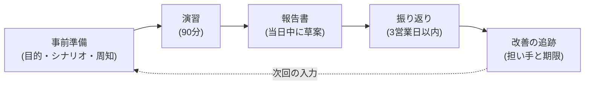

[インシデント対応](/process-compass/phase6-operation/incident-response/)の手順は、**平時に読んだことがある人しか実行できません**。本ページは、その実行可能性を定期的に確かめる演習を規定します。呼称は「開発避難訓練」とします。

## 何を訓練するか

技術的な復旧だけを訓練の対象にしません。重大な事象で失敗するのは、多くの場合**判断と連絡の側**です。

| 訓練する能力 | 具体的に確かめること |
| --- | --- |
| 判定 | 重大度を単独で即断できるか。迷ったときに重いほうへ倒せるか |
| 指揮 | 指揮を執る人が任命されるか。決定と保留を分けられるか |
| 保全 | 復旧を急ぐ操作で証拠を壊さないか |
| 区別 | 事実・推測・未確定を分けて説明できるか |
| 対外 | 顧客・経営への説明を、確定していない段階で出せるか |
| 引き継ぎ | 交代の際に状況が欠落なく渡るか |

**「復旧できたか」を合否の基準にしません**。復旧の可否はシナリオの難度で決まります。訓練が見るのは判断の過程です。

## 訓練と監査と欠陥注入の違い

本標準には、実態を確かめる手続が3つあります。混同すると、訓練が評価の場になり、報告が抑制されます。

| | 開発避難訓練 | [プロセス内部監査](/process-compass/phase6-operation/process-audit/) | [欠陥注入](/process-compass/phase5-implementation/seeded-error-safety/) |
| --- | --- | --- | --- |
| 対象 | 事象への対応能力 | 規程どおりの運用 | 検証工程の検出力 |
| 参加者への予告 | **する**(日時まで含む) | 対象の抽出は予告しない | 制度の存在のみ予告する |
| 実施の場 | 机上または隔離環境 | 記録 | 使い捨てブランチ |
| 結果の宛先 | 手順・体制の改善 | 是正 | 検証工程の改善 |
| 個人の評価への利用 | **しない** | しない | しない |

演習の日時を予告します。抜き打ちにすると、訓練は能力の測定になり、参加者は失敗を隠す動機を持ちます。

## 訓練の4類型

| 類型 | 訓練の焦点 | 完了と見なす状態 |
| --- | --- | --- |
| A セキュリティ初動 | 検知、重大度の判定、指揮、封じ込め、証拠の保全 | 指揮者の任命、初動方針、暫定の影響範囲、次回報告の時刻を決めている |
| B 脆弱性・供給網 | 利用の有無の確認、変更の凍結、修正と切り戻し、秘密情報の保護 | 影響するリポジトリ・環境・版を特定し、対処方針を決めている |
| C アプリケーションの侵害 | 不正なアクセス、権限の昇格、横展開、継続の判断 | 侵入経路と影響範囲の仮説を整理し、封じ込めと復旧の基準を出している |
| D 個人に関する情報の流出 | 対象データの確認、通知と公表の判断、調査の報告 | 事実と推測を分けた報告と、関係者向けの説明案を作成している |

類型Bでは、「使っているか」だけを問いません。**どの環境に、どの版が、どの経路で入っているか**まで確定させます。判定の材料は、依存関係の一覧、構成情報、配備済みの成果物、CI の実行履歴です。

## 役割

演習では、[第3章のロール](/process-compass/phase4-process-design/roles-responsibilities/)に加えて、演習固有の役割を置きます。

### 対応側(演習の中で演じる)

| 役割 | 担うこと | 平時の担い手 |
| --- | --- | --- |
| 指揮者 | 全体の判断、優先順位、会議の運営、上位への上程 | 当番 |
| 技術調査 | ログの調査、影響範囲の確認、封じ込めと復旧の案 | 開発者(検証者)、技術判断者 |
| 記録 | 時系列、判断の理由、未確定事項、次の行動の記録 | 任意(交代制) |
| 渉外 | 社内への状況報告、顧客向けの文案、問い合わせの管理 | 価値責任者 |
| 決裁 | 停止、通知、公表、復旧の優先度の決定 | 事業決裁者 |

**記録の役割を指揮者に兼ねさせません**。記録が止まると、演習後の振り返りで判断の理由を再現できなくなります。

### 運営側(演習を回す)

| 役割 | 担うこと |
| --- | --- |
| 進行役 | 時間の管理、inject の投入、演習の停止判断 |
| 観察役 | 判断の時刻と内容の記録。**助言をしない** |

観察役が助言すると、演習は指導の場になります。気づいた点は振り返りで出します。

## inject の設計

inject とは、演習の途中で投入する追加の情報や状況の変化です。設計の規則を次に定めます。

| # | 規則 | 理由 |
| --- | --- | --- |
| 1 | 15分間隔を目安に投入する | 判断の間隔を確保する。密にすると処理の練習になる |
| 2 | 1つの inject で問う判断を1つに絞る | 何を訓練したかが振り返りで分離できなくなる |
| 3 | 確定情報と未確定情報を混ぜる | 現実の事象では両者が同時に来る |
| 4 | 対外の刺激(問い合わせ、経営からの要求)を必ず含める | 技術だけで完結する演習は現実と乖離する |
| 5 | 参加者の回答によって次の inject を変えない | 分岐させると、演習ごとの比較ができなくなる |

規則5には例外があります。**参加者が明白に危険な操作(証拠の破壊、本番への直接の変更)を選んだ場合**、進行役はその結果を inject として返します。結果を隠すと、危険な操作が成功体験として残ります。

## 初回のシナリオ

初回は類型Bと類型Cの複合とします。単独の類型では、部門をまたぐ連絡が訓練されないためです。

題名を「広く使われる依存パッケージの緊急の脆弱性と、不審なデータ取得の複合」とします。

前提を次に置きます。

- 対象は顧客の情報を扱うアプリケーションとする
- 影響が疑われる依存パッケージを直近のリリースへ含めた可能性がある
- 環境は隔離した検証環境または机上とし、**本番へ一切触れない**
- 演習中の通知・問い合わせ・公表はすべて模擬とする

| 経過 | inject | 確かめたい行動 |
| --- | --- | --- |
| 0分 | 重大な脆弱性が公表され、自社が利用している可能性が判明する | 指揮者の任命、調査の開始、変更の凍結の判断 |
| 15分 | 依存関係の一覧から該当する版を検出する | 本番・検証・開発の環境を区別した影響範囲の確定 |
| 30分 | 直近24時間に通常より多いデータ取得の記録を発見する | 悪用の可能性の評価、証拠の保全、認証情報の失効 |
| 45分 | 顧客窓口へ「情報が漏れたのではないか」という問い合わせが入る | 事実と未確定を分けた暫定の回答 |
| 60分 | 経営から継続・停止・公表の判断材料を求められる | 影響・選択肢・リスク・推奨の提示 |
| 75分 | 修正版または切り戻しの案が提示可能になる | 復旧の判定条件、監視の強化、次の告知の決定 |

:::caution[暫定 EV-0016 / 見直し 2027-08]
**対象**: 演習の所要時間(90分)、inject の間隔(15分)、実施の頻度(半年に1回)。
**根拠の水準**: E0(なし)。
**差し替え条件**: 2回分の演習記録から得た、時間内に完了した判断の割合と、参加者の可用性の実績。

演習を開始するために置いた値です。実測を得た時点で改めます。
:::

## 実施の流れ



### 事前準備

| # | 準備すること |
| --- | --- |
| 1 | 訓練の目的と類型を決め、参加者へ**日時を含めて予告する** |
| 2 | シナリオと inject を作成し、運営側だけで一度通す |
| 3 | 演習であることを示す接頭辞を、全ての連絡へ付ける規則を周知する |
| 4 | 停止の条件と停止の合図を全員へ伝える |

規則3を省略すると、演習の連絡が実際の事象として扱われる事故が起きます。**接頭辞のない連絡は演習の対象外とします**。

### 演習を停止する条件

進行役は、次のいずれかで演習を即時に停止します。

- 演習の連絡が本番の運用または顧客へ流出した
- 実際のインシデントが発生した
- 参加者が本番環境へ変更を加えようとした
- 演習の遂行が特定の個人への追及になっている

停止は**進行役が単独で判断します**。合議にかけません。この扱いは[欠陥注入の停止条件](/process-compass/phase5-implementation/seeded-error-safety/)と同一の考え方です。

## 評価

評価の対象は個人ではなく、**手順・体制・情報の流れ**です。所見に個人識別子を含めません。

| # | 評価項目 | 記録する値 |
| --- | --- | --- |
| 1 | 検知から指揮者の任命までの時間 | 分 |
| 2 | 指揮者の任命から初回の状況報告までの時間 | 分 |
| 3 | 影響範囲・対象データ・未確定事項の区別 | できた/一部/できない |
| 4 | 証拠を保全したまま封じ込めを判断できたか | 可否と理由 |
| 5 | 停止・秘密情報の更新・顧客への連絡の決定者が明確だったか | 役割名 |
| 6 | 技術・事業・経営・対外の情報が共有されたか | 断絶した箇所 |
| 7 | 報告書に事実・時系列・影響・対応・未解決・再発防止が揃ったか | 欠けた項目 |
| 8 | 改善項目に担い手と期限が割り当てられたか | 件数 |

項目1と2だけが時間の指標です。**短さを競わせません**。短縮の圧力は、確認を省く動機になります。

## 報告書の様式

```markdown
# 開発避難訓練 報告書: <題名> / 類型<A-D>

- 実施日時・所要時間 / 参加者(役割名のみ)
- シナリオの前提と、実際に投入した inject

## 時系列
| 時刻 | inject | 対応側の判断・行動 |
| --- | --- | --- |

## 評価項目の結果
| # | 項目 | 結果 | 備考 |
| --- | --- | --- | --- |

## 見つかった弱点
| 弱点 | 種別(手順/権限/検知/連絡先/設計) | 影響 |
| --- | --- | --- |
<!-- 個人名を書かない。書けるのは役割名まで -->

## 改善アクション
| アクション | 担い手(役割) | 期限 | 追跡先 |
| --- | --- | --- | --- |
<!-- 「注意する」「周知する」は不可。手順・設定・仕組みの変更にする -->

## 次回への申し送り
- 変更するシナリオ / 追加する inject
```

## 改善の追跡

改善アクションを演習の記録の中に閉じません。**[改善サイクル](/process-compass/phase6-operation/improvement-cycle/)へ引き渡し、完了まで追跡します**。

- 弱点の種別が「手順」であれば、[インシデント対応](/process-compass/phase6-operation/incident-response/)または[こんなときどうする](/process-compass/phase6-operation/what-to-do-when/)の改訂として起票する
- 種別が「検知」であれば、監視の追加として[運用作業カタログ](/process-compass/phase6-operation/operations-catalog/)へ反映する
- 前回の未完了の改善アクションを、次回の演習の評価対象に必ず含める
- 演習で判明した新しいリスクを[リスクカタログ](/process-compass/phase6-operation/risk-catalog/)へ追加する

## 段階的な拡張

初回から実地の演習を実施しません。成熟度に応じて段階を上げます。

| 段階 | 実施の形 | 前提 |
| --- | --- | --- |
| 1 | 机上演習(会議室・オンライン) | なし |
| 2 | 隔離した検証環境での調査を伴う演習 | 検証環境と本番の分離、ログの保全 |
| 3 | 実際の検知基盤・CI を用いた演習 | 段階2を2回以上完了 |

段階3でも**本番環境へ意図的な障害を注入しません**。本標準は、本番を対象とした障害注入を要求事項に含めません。

## この訓練の限界

- シナリオに書いた事象しか訓練できない。**想定外への対応能力は測れない**
- 予告した演習であるため、実際の事象で生じる時間帯の制約や要員の不在を再現できない
- 机上の段階では、調査そのものの練度が訓練されない
- 参加者の入れ替わりが速い組織では、訓練の効果が定着より速く失われる

## 関連するページ

- [インシデント対応](/process-compass/phase6-operation/incident-response/) — 訓練する対象の手順
- [こんなときどうする](/process-compass/phase6-operation/what-to-do-when/) — 演習中に引く逆引き表
- [リスクカタログ](/process-compass/phase6-operation/risk-catalog/) — シナリオの題材
- [欠陥注入の隔離設計](/process-compass/phase5-implementation/seeded-error-safety/) — 演習を本番から隔離する考え方
- [プロセス内部監査](/process-compass/phase6-operation/process-audit/) — 訓練との役割の違い
