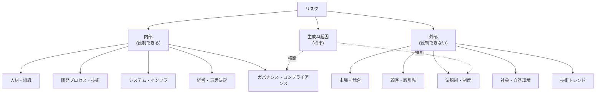

リスクの発生源はほぼ無限にあります。一方で、プロダクトへの**影響先は「ヒト・モノ・カネ・時間」の4つに収束します**。本ページはこの非対称性を利用し、発生源を網羅するのではなく、**影響先とリスクオーナーから引ける形**でリスクを一覧にします。

## このカタログの目的

一覧そのものが目的ではありません。目的は、**各行に対して本標準のどの規定が働くかを突き合わせること**です。

| 使い方 | 出力 |
| --- | --- |
| 新しいプロセス・規程を設計したとき | 受け止めの列が空の行を、未対応として明示する |
| 事象が起きたとき | 影響先とオーナーから[こんなときどうする](/process-compass/phase6-operation/what-to-do-when/)を引く |
| 訓練シナリオを作るとき | [開発避難訓練](/process-compass/phase6-operation/incident-drill/)の題材として抽出する |
| 内部監査のとき | [プロセス内部監査](/process-compass/phase6-operation/process-audit/)の観点8で網羅性を照合する |

**受け止めの列が空であること自体は、欠陥ではありません**。本標準が扱わないと決めた範囲(経営判断、法務、災害対策)が存在します。問題になるのは、空欄であることに誰も気づいていない状態です。

## 影響先の定義

| 影響先 | 定義 | 典型的な兆候 |
| --- | --- | --- |
| ヒト | 要員の稼働・練度・人数への影響 | 離脱、疲弊、練度の不足、採用の難化 |
| モノ | プロダクト・システム・成果物の品質と可用性への影響 | 不具合、障害、技術的負債、信用の毀損 |
| カネ | 予算・費用・売上・賠償への影響 | 追加費用、売上の未達、罰金、賠償 |
| 時間 | 日程・意思決定の速度への影響 | 遅延、手戻り、判定の滞留 |

**「信用」は独立した影響先として置きません**。信用の毀損は最終的にカネ(売上と賠償)へ現れるためです。この扱いを[ADR-0024](/process-compass/adr/0024-decision-as-risk-acceptance/)の考え方と一致させています。

## 分類の3階層

- 第1階層は**発生源**。チームが統制できるかどうかで内部と外部に分ける
- 第2階層は**カテゴリ**。内部5・外部5の10分類とする
- 第3階層は**フェーズ**。企画・開発・リリース・継続運用のどこで顕在化しやすいかを示す
- 生成AI起因のリスクは第3の軸として独立させる。既存の分類へ分散させると横断的な監視ができなくなるため

:::caution[暫定 EV-0014 / 見直し 2027-08]
**対象**: 本カタログの網羅性、およびカテゴリを内部5・外部5とした分割。
**根拠の水準**: E1(間接)。
**差し替え条件**: 自組織で1年分の事象記録を分類した結果と、どのカテゴリにも収まらなかった件数。

一般的なリスク分類の実務に沿って構成した分割であり、本標準の運用実績から導いた分割ではありません。
:::

## 内部リスク

リスクオーナーは[第3章のロール](/process-compass/phase4-process-design/roles-responsibilities/)の語彙で示します。組織の職位名へは各自で読み替えます。

### 人材・組織

| フェーズ | 具体例 | 影響先 | リスクオーナー | 本標準の受け止め |
| --- | --- | --- | --- | --- |
| 企画 | 仕様の検討者が異動・退職し検討が止まる | ヒト・時間 | 価値責任者 | [コンテキスト基盤](/process-compass/phase5-implementation/context-base/)への意図の外出し |
| 開発 | 中核の開発者が離脱し理解が失われる | ヒト・時間・モノ | 技術判断者 | コア理解維持タスク、[挙動要約](/process-compass/phase4-process-design/developer-guide/)の記録 |
| 開発 | 他案件の障害対応へ要員を抜かれ稼働が落ちる | ヒト・時間 | 価値責任者 | [7.7 予算統制](/process-compass/phase4-process-design/exception-escalation/)の再計画 |
| リリース | 判定者・承認者の不在で判断が滞る | 時間 | 出荷判定者 | [7.5 判定の滞留に対する措置](/process-compass/phase4-process-design/exception-escalation/) |
| 継続運用 | 当番の疲弊と対応の属人化 | ヒト | 技術判断者 | 当番の週替わり([インシデント対応](/process-compass/phase6-operation/incident-response/)) |
| 全フェーズ | 練度の不足(任命基準を満たす者がいない) | ヒト・モノ | 価値責任者 | [3.4 任命基準](/process-compass/phase4-process-design/roles-responsibilities/)、[イネーブルメント計画](/process-compass/phase5-implementation/enablement/) |

### 開発プロセス・技術

| フェーズ | 具体例 | 影響先 | リスクオーナー | 本標準の受け止め |
| --- | --- | --- | --- | --- |
| 企画 | 要求の曖昧さと範囲の膨張 | 時間・カネ | 価値責任者 | [EARS による記述](/process-compass/phase4-process-design/ears-guide/)、[スコープの三層](/process-compass/adr/0019-scope-commitment-three-layers/) |
| 開発 | 成熟していない技術の採用による停滞 | 時間・モノ | 技術判断者 | ADR による選択肢の比較 |
| 開発 | テスト設計の不備による不具合の流出 | モノ・時間 | 開発者(検証者) | [テスト有効性の測定](/process-compass/phase5-implementation/test-effectiveness/) |
| 開発 | AI 生成物を検証せずに取り込む | モノ・時間 | 開発者(検証者) | [AI 出力は未検証の入力](/process-compass/adr/0012-ai-output-as-unverified-input/)、挙動要約 |
| リリース | 見積りの過小評価による延期 | 時間・カネ | 価値責任者 | [7.7.2 測定する指標](/process-compass/phase4-process-design/exception-escalation/) |
| 継続運用 | 技術的負債の累積による改修費の増大 | モノ・カネ・時間 | 技術判断者 | [負債返却サイクル](/process-compass/phase6-operation/debt-payback/)(容量の20%) |
| 継続運用 | 記述の不足による引き継ぎの困難 | ヒト・時間 | 文脈オーナー | 恒久層への[書き戻し](/process-compass/phase5-implementation/context-base/) |

### システム・インフラ

| フェーズ | 具体例 | 影響先 | リスクオーナー | 本標準の受け止め |
| --- | --- | --- | --- | --- |
| 開発 | CI が壊れ検証が止まる | 時間・モノ | AI 運用担当者 | [CI ゲート](/process-compass/phase5-implementation/ci-gates/)の復旧を最優先の運用作業に置く |
| 開発 | 開発環境と本番環境の差異による想定外の不具合 | モノ・時間 | 技術判断者 | [非機能検証](/process-compass/phase5-implementation/nonfunctional-verify/) |
| リリース | 配備の自動化の不備による操作の誤り | モノ・時間 | 出荷判定者 | [PR ワークフロー](/process-compass/phase5-implementation/pr-workflow/)、hotfix でも PR を経る規定 |
| リリース | データ移行の失敗による不整合 | モノ・カネ | 技術判断者 | [G-7 出荷判定](/process-compass/phase4-process-design/gate-criteria/)の復旧手順の確認 |
| 継続運用 | 計算資源の設定の誤りによる費用の超過 | カネ | AI 運用担当者 | [計算資源の戦略](/process-compass/phase5-implementation/compute-strategy/) |
| 継続運用 | 監視の不足による検知の遅れ | モノ・時間 | 技術判断者 | [運用作業カタログ](/process-compass/phase6-operation/operations-catalog/)の日次作業 |
| 継続運用 | 脆弱性の修正を適用しないまま放置する | モノ・カネ | 技術判断者 | 運用作業カタログの週次作業、[開発避難訓練](/process-compass/phase6-operation/incident-drill/)の類型B |

### 経営・意思決定

| フェーズ | 具体例 | 影響先 | リスクオーナー | 本標準の受け止め |
| --- | --- | --- | --- | --- |
| 企画 | 方針の頻繁な転換による混乱 | ヒト・時間 | 事業決裁者 | [事業意図の記述](/process-compass/phase4-process-design/deliverable-templates/)と変更の記録 |
| 企画 | 予算の承認の遅延による着手の遅れ | 時間・カネ | 事業決裁者 | 受け止めなし(組織の決裁規程による) |
| 開発 | 優先順位の誤りによる資源配分の失敗 | ヒト・カネ・時間 | 価値責任者 | [7.7.3 中止の判断基準](/process-compass/phase4-process-design/exception-escalation/) |
| リリース | 合意の不足によるリリース可否の混乱 | 時間 | 事業決裁者 | [第7章 エスカレーション](/process-compass/phase4-process-design/exception-escalation/)の発火条件 |
| 継続運用 | 指標の設定の誤りによる誤った判断の継続 | カネ・時間 | 価値責任者 | [運用メトリクス](/process-compass/phase6-operation/metrics/)の警戒サイン、[前提の監視](/process-compass/adr/0018-assumption-ledger/) |

### ガバナンス・コンプライアンス

| フェーズ | 具体例 | 影響先 | リスクオーナー | 本標準の受け止め |
| --- | --- | --- | --- | --- |
| 開発 | 規則の未整備による権限の過剰な付与 | モノ・カネ | AI 運用担当者 | [AI 実行環境](/process-compass/phase5-implementation/ai-environment/)の権限設計 |
| 開発 | 検査の除外設定を個別の判断で広げる | モノ | 技術判断者 | [内部監査](/process-compass/phase6-operation/process-audit/)の観点4 |
| 継続運用 | 権限管理の不備による内部の不正と漏えい | カネ・モノ | AI 運用担当者 | [エージェント実行の追跡](/process-compass/phase5-implementation/agent-trace-control/) |
| 継続運用 | 個人に関する情報の取り扱いの誤り | カネ・モノ | 事業決裁者 | 受け止めは部分的([QMS 文書管理](/process-compass/phase5-implementation/qms-document-control/)の記録のみ) |

## 外部リスク

外部リスクは**発生を防げません**。本標準が扱うのは、**顕在化したことに気づく仕組み**と、**気づいてからの手順**だけです。

### 市場・競合

| フェーズ | 具体例 | 影響先 | リスクオーナー | 本標準の受け止め |
| --- | --- | --- | --- | --- |
| 企画 | 競合の先行によるポジションの喪失 | カネ・時間 | 事業決裁者 | [前提台帳](/process-compass/adr/0018-assumption-ledger/)による前提の失効の検知 |
| 企画 | 市場の変化により企画時点の前提が崩れる | カネ・時間 | 価値責任者 | 同上、[7.7.3 中止の判断基準](/process-compass/phase4-process-design/exception-escalation/) |
| 継続運用 | 為替の変動による費用と売上への影響 | カネ | 事業決裁者 | 受け止めなし(組織の財務機能による) |

### 顧客・取引先

| フェーズ | 具体例 | 影響先 | リスクオーナー | 本標準の受け止め |
| --- | --- | --- | --- | --- |
| 企画 | 聞き取りの対象の偏りによる要求の誤認 | カネ・時間 | 価値責任者 | [事業性評価](/process-compass/adr/0016-business-appraisal-in-intent-brief/) |
| 開発 | 委託先の納期の遅延と品質の不足 | 時間・モノ・カネ | 価値責任者 | 受け止めは部分的(成果物の受入は G ゲートで判定) |
| 開発 | 外部 API・SaaS の仕様変更と障害 | モノ・時間 | 技術判断者 | 前提台帳、[開発避難訓練](/process-compass/phase6-operation/incident-drill/)の類型B |
| 継続運用 | 苦情の急増による対応稼働の圧迫 | カネ・ヒト | 事業決裁者 | [インシデント対応](/process-compass/phase6-operation/incident-response/)の Sev 判定 |
| 継続運用 | 計算資源の提供元の障害・値上げ | モノ・カネ | AI 運用担当者 | [計算資源の戦略](/process-compass/phase5-implementation/compute-strategy/)の代替の確保 |

### 法規制・制度

| フェーズ | 具体例 | 影響先 | リスクオーナー | 本標準の受け止め |
| --- | --- | --- | --- | --- |
| 企画 | 法令の改正により企画自体が成立しなくなる | 時間・カネ | 事業決裁者 | 前提台帳(規制の前提を明示する) |
| 開発 | 展開先の規制への未対応 | カネ・時間 | 事業決裁者 | 受け止めなし(組織の法務機能による) |
| リリース | 業界の基準への非準拠による差し戻し | 時間・カネ | 出荷判定者 | [安全性の検証](/process-compass/phase4-process-design/safety-verification/)、[QMS 文書管理](/process-compass/phase5-implementation/qms-document-control/) |
| 継続運用 | 制度の変更による課金・請求の改修 | モノ・時間・カネ | 価値責任者 | 通常の開発サイクルで扱う |

### 社会・自然環境

| フェーズ | 具体例 | 影響先 | リスクオーナー | 本標準の受け止め |
| --- | --- | --- | --- | --- |
| 全フェーズ | 災害による拠点・設備の機能停止 | モノ・ヒト・時間 | 事業決裁者 | 受け止めなし(組織の事業継続計画による) |
| 全フェーズ | 感染症等による出社の制限 | ヒト・時間 | 事業決裁者 | 受け止めなし(同上) |
| 継続運用 | サイバー攻撃(サービス妨害、身代金要求型) | モノ・カネ・時間 | 技術判断者 | [インシデント対応](/process-compass/phase6-operation/incident-response/)、避難訓練の類型A・C |

### 技術トレンド・エコシステム

| フェーズ | 具体例 | 影響先 | リスクオーナー | 本標準の受け止め |
| --- | --- | --- | --- | --- |
| 企画 | 採用予定の技術の陳腐化とサポートの終了 | モノ・カネ | 技術判断者 | ADR の見直し、前提台帳 |
| 開発 | 依存する OSS の脆弱性の公表と保守の停止 | モノ・時間 | 技術判断者 | [CI ゲート](/process-compass/phase5-implementation/ci-gates/)の依存検査、避難訓練の類型B |
| 継続運用 | 基盤提供者の方針変更 | モノ・カネ | 技術判断者 | 前提台帳 |
| 継続運用 | 生成AI の進展による優位性の陳腐化 | カネ・時間 | 事業決裁者 | [7.7.3 中止の判断基準](/process-compass/phase4-process-design/exception-escalation/) |

## 生成AI起因のリスク

生成AI のリスクは、内部と外部の分類へ分散させると追跡できなくなります。**第3の軸として独立させ、既存の行にはタグとして付与します**。

| 利用シーン | 具体例 | 影響先 | リスクオーナー | 本標準の受け止め |
| --- | --- | --- | --- | --- |
| 社内利用 | 指示に機密・顧客の情報を入力し外部へ出す | カネ・モノ | AI 運用担当者 | [AI 実行環境](/process-compass/phase5-implementation/ai-environment/)の境界設定 |
| 社内利用 | 生成コードの誤りと脆弱性に気づかず本番へ反映する | モノ・時間 | 開発者(検証者) | [AI 出力は未検証の入力](/process-compass/adr/0012-ai-output-as-unverified-input/)、独立レビュー |
| 社内利用 | 誤った情報を事実として判断に使う | カネ・時間 | 価値責任者 | [レビューパッケージ](/process-compass/phase5-implementation/review-package/)(結論でなく手がかりを渡す) |
| 社内利用 | エージェントの自律的な操作による事故 | モノ・カネ | AI 運用担当者 | [自律レベルの規定](/process-compass/phase4-process-design/human-ai-boundary/)、[実行の追跡](/process-compass/phase5-implementation/agent-trace-control/) |
| 開発 | RAG・学習データ経由で秘密が出力へ混入する | カネ・モノ | 文脈オーナー | [コンテキスト基盤](/process-compass/phase5-implementation/context-base/)の格納方針 |
| 開発 | モデル提供者の仕様変更・提供終了・値上げ | モノ・カネ・時間 | AI 運用担当者 | [計算資源の戦略](/process-compass/phase5-implementation/compute-strategy/) |
| 提供 | 生成した内容が知的財産権を侵害する | カネ・モノ | 事業決裁者 | [知財クリアランスは証跡であって保証ではない](/process-compass/adr/0021-ip-clearance-evidence-not-guarantee/) |
| 提供 | 偏りのある出力による信用の毀損 | カネ・モノ | 価値責任者 | [非機能検証](/process-compass/phase5-implementation/nonfunctional-verify/) |
| 提供 | 自社サービスが偽情報の生成に悪用される | カネ・モノ・時間 | 事業決裁者 | 受け止めなし(提供機能の設計課題として扱う) |
| 提供 | 生成AI 機能の誤作動時の責任の所在が不明 | 時間・カネ | 事業決裁者 | [5章 役割境界](/process-compass/phase4-process-design/human-ai-boundary/)、[決定はリスク受容](/process-compass/adr/0024-decision-as-risk-acceptance/) |
| 事業戦略 | 活用しないことによる相対的な生産性の低下 | カネ・時間 | 事業決裁者 | [イネーブルメント計画](/process-compass/phase5-implementation/enablement/) |
| 事業戦略 | 使いこなす練度の不足による誤用 | ヒト・時間 | 価値責任者 | [限定試行による習得](/process-compass/adr/0013-enablement-by-bounded-trial/) |
| 規制 | 各国の AI 規制への未対応 | カネ・時間 | 事業決裁者 | 受け止めなし(組織の法務機能による) |
| セキュリティ | 高度化した攻撃の標的になる | モノ・カネ | 技術判断者 | 避難訓練の類型A・C |

:::caution[暫定 EV-0015 / 見直し 2027-02]
**対象**: 生成AI起因リスクの一覧の網羅性。
**根拠の水準**: E1(間接)。
**差し替え条件**: 公的なガイドラインの次期改訂と、自組織で観測した生成AI 起因の事象の記録。

生成AI の社会実装は日が浅く、分類は各国のガイドラインの改訂に追随して変わります。**半年ごとに一次資料を再確認します**。
:::

## リスクを扱う人間の側のリスク

一覧を整備しても、**現場で起きる回避行動そのものが新たなリスク源**になります。この層を書かないカタログは、机上で完結します。

| 行動 | 概念 | 発生の仕組み | 二次被害 |
| --- | --- | --- | --- |
| 納期を優先し重大な不具合を見逃す | 逸脱の規範化 | 小さな逸脱が事故に至らなかった経験が累積し、逸脱が既定の状態になる | 問題が膨張してから顕在化し、修正費が跳ね上がる |
| 中止すべき案件を続行する | コミットメントの拡大 | 投入済みの費用を回収したい心理と完了への近さが重なる | 失敗が確定した対象への追加投資 |
| 人手の不足を残業で埋め続ける | クランチ | 時間は伸縮するという暗黙の前提を管理側が持つ | 疲弊と離脱による練度の流出、遅延の拡大 |
| リスクを報告しない | 非難文化 | 報告すると個人へ責任が帰されるという予期 | 早期に検知できた事象が重大化する |
| 個人へ責任を帰して終わらせる | 帰属の誤り | 仕組みより個人の誤りに原因を求めるほうが組織として容易である | 真因が残り同じ事故が再発する |
| 全員一致で異論を持たない | 同調と構造的な秘密主義 | 一致を優先する集団の力学が働き、部門間で情報が分断される | 危険の兆候が判定の場へ届かない |

これらは個人の資質の問題ではありません。**組織のプロセスと認知の偏りの相互作用**です。したがって対策も個人への注意喚起ではなく、仕組みの側に置きます。

| 行動 | 本標準の受け止め |
| --- | --- |
| 逸脱の規範化 | [ゲート判定基準](/process-compass/phase4-process-design/gate-criteria/)の4値判定、[未達と省略の区別](/process-compass/adr/0028-unmet-gate-distinct-from-omitted/) |
| コミットメントの拡大 | [7.7.6 第三者による棚卸し](/process-compass/phase4-process-design/exception-escalation/)、[7.7.4 自動的な上程](/process-compass/phase4-process-design/exception-escalation/) |
| クランチ | [スコープの三層](/process-compass/adr/0019-scope-commitment-three-layers/)、[レビュー負荷の測定](/process-compass/phase5-implementation/review-burden-measurement/) |
| 非難文化 | 責めを問わないポストモーテム、[欠陥注入の測定を個人にしない](/process-compass/phase5-implementation/seeded-error-safety/) |
| 帰属の誤り | [改善サイクル](/process-compass/phase6-operation/improvement-cycle/)の3区分(システム起因・リスク認識の不足・意図的な逸脱) |
| 同調 | [独立レビュー](/process-compass/phase4-process-design/review-guide/)、[非割込型の申し送り](/process-compass/phase5-implementation/label-mailbox/) |

**「気をつける」「周知する」を対策として認めません**。数週間で消えるためです。この制約は[インシデント対応](/process-compass/phase6-operation/incident-response/)の再発防止アクションと同一です。

## このカタログの限界

- **網羅の保証はない**。分類は10カテゴリに閉じるが、各カテゴリ内の行は例示にとどまる。行の不在は、リスクの不在を意味しない
- 発生確率と影響度を持たない。優先順位付けには、自組織の実測を各行へ追加する必要がある
- 受け止めの列が示すのは**規定の存在**のみ。規定が実際に働いているかを確かめるのは[内部監査](/process-compass/phase6-operation/process-audit/)である
- 外部リスクに対して本標準が持つのは検知と手順だけであり、**発生の抑止を扱わない**

## 関連するページ

- [こんなときどうする](/process-compass/phase6-operation/what-to-do-when/) — 症状からの逆引き
- [開発避難訓練](/process-compass/phase6-operation/incident-drill/) — 本カタログを題材にした演習
- [プロセス内部監査](/process-compass/phase6-operation/process-audit/) — 観点8による網羅性の照合
- [第7章 例外・エスカレーション](/process-compass/phase4-process-design/exception-escalation/) — 中止判断と滞留の措置
- [運用メトリクス](/process-compass/phase6-operation/metrics/) — 顕在化の兆候を数値で捉える
