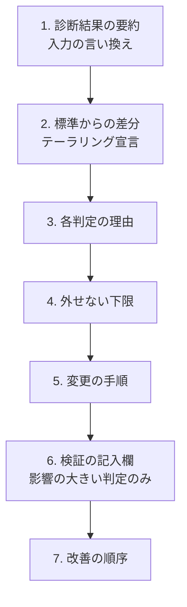

[提案ロジック](/process-compass/tool/proposal-logic/)が算出した調整済みプロセスを、**提案書としてどう提示するか**の設計です。

## 設計の前提

出力は**決定ではなく草案**です。提案ツール自身が、本標準の禁じる自動化バイアスの発生源になってはなりません。「あなたの組織ではこれが最適です」と断定すると、利用者は自分で検討せずに受け入れます。標準を配る道具が、その標準の要求と矛盾する状態を作ります。

したがって出力の設計目標は3点です。

| # | 目標 |
| --- | --- |
| 1 | 判定の**理由**が各項目に付いている(スコアではなく理由) |
| 2 | どの判定も**変更できる**ことと、変更の手順が示されている |
| 3 | 影響の大きい判定にのみ、利用者自身の検証を求める摩擦がかかる |

## 7つのブロック



### ブロック1: 診断結果の要約

入力した条件を、標準の語彙へ翻訳して復唱します。

```markdown
## あなたの状況
- チーム規模: 8名(軸A: 3〜9名)
- 事業ステージ: S2 スケール(拡大中)
- 期待品質: 止まると社会・金銭に影響する
- 安全重要度: CL1 準規制
- 開発形態: 自社開発
- AI利用: 制約なし
```

**スコアや成熟度のラベルを出しません**。「あなたの組織はレベル2」のような表示は、組織内で評価の材料として扱われ、改善から関心を逸らします。本ツールは評価機関ではありません。

### ブロック2: 標準からの差分(テーラリング宣言)

標準の全項目について「適用する / 簡略化する / 適用しない」の3分類を一覧にします。**この一覧そのものが、後の説明と監査で使える成果物になります**。

```markdown
## 標準からの差分
| 項目 | 判定 | 根拠となる規則 |
| --- | --- | --- |
| G-1 企画承認 | 適用する | — |
| G-2 要件合意 | 適用する | — |
| G-6 独立レビュー | 適用する(コア機能は2名) | 軸C 高品質 |
| B-3 設計審査会 | 適用しない(G-3 の単独判定で代替) | 軸A 3〜9名 |
| テンプレ9 安全リスクアセスメント | 適用しない | 軸E CL1 |
```

「標準どおり」の項目も省かずに載せます。**載っていない項目があると、検討したのか漏れたのかが区別できません**。

### ブロック3: 各判定の理由

差分の各行に、規則が持つ説明・理由・根拠ページを展開します。知識ベースは規則にこの3項目を必須としているため、**説明のない行は構造上存在しません**。

説明は2種類を出します。

| 種類 | 内容 |
| --- | --- |
| 全体の説明 | どの軸がどの順で適用され、衝突がどう解決されたか |
| 個別の説明 | この項目がこう判定された理由と、根拠となる章へのリンク |

**確信度や適合度の数値を出しません**。推薦の確信度の提示が受容と信頼のいずれへも影響しないという実験結果があり、数値は判断の材料になりません。

### ブロック4: 外せない下限

調整で外せない項目を、理由とともに明示します。[第8章の禁止事項](/process-compass/phase4-process-design/tailoring-guide/)の6件と、安全重要度に応じてロックされる項目です。

```markdown
## この提案で外せない項目
| 項目 | 理由 |
| --- | --- |
| 結果責任は1人 | 責任の分散は承認の滞留と形骸化を招く |
| AIを結果責任に割り当てない | AIは説明責任を負えない |
| 差し戻し基準のないゲートを作らない | 基準のないゲートは滞留と素通しの温床 |
```

安全重要度が CL2 以上の場合、法令・規制に紐づく項目を**変更できない状態で表示します**。

### ブロック5: 変更の手順

**これが「お仕着せ」を回避する中核です**。各判定について、変えたい場合の操作を示します。

| 変更の種類 | 示すもの |
| --- | --- |
| 入力の変更で変わる場合 | どの質問の回答を変えると、この判定がどう変わるか |
| 標準から外す場合 | 逸脱として記録する様式、承認者、記録の保管先 |
| 外せない項目の場合 | 変更できない理由と、代替として満たすべき条件 |

出力を「変更できないもの」ではなく「**交渉可能な草案**」として提示します。テーラリングを認める国際規格でも、調整の根拠と承認の記録を伴うことが条件になっています。

### ブロック6: 検証の記入欄

**影響の大きい判定に限って**、利用者自身の検証を求めます。

| 対象 | 摩擦の内容 |
| --- | --- |
| 安全重要度 CL2 以上の判定 | 「この判定を自組織の文脈で確認した根拠」の記入を必須にする |
| リスク区分 R1(取り消せない)に関わる判定 | 同上 |
| それ以外 | 摩擦をかけない |

未記入のまま最終的な提案書を出力できない構成にします。

**全項目に摩擦をかけてはなりません**。過剰依存を最も減らした設計に対して利用者が最も低い評価を与えたという実験結果があり、摩擦の総量を管理しないとツール自体が使われなくなります。摩擦はリスクに応じて配分します。この方針は[第5章 5.7.5](/process-compass/phase4-process-design/human-ai-boundary/)と同じ考え方です。

出力の冒頭には限界を明示します。

> 本提案は決定ではなく草案です。安全重要度 CL2 以上の判定については、貴組織の責任者による検証が必要です。

### ブロック7: 改善の順序

チェックリストではなく**順序付き**にします。実施していないものを羅列すると、どこから手を付けるかの判断が利用者に残ります。

各段階に次を書きます。

- 着手する順序(先行して満たすべき項目を先に置く)
- 所要の目安
- **達成したと言える観察可能な結果**(「導入した」ではなく「何が観察できれば達成か」)

[社会実装計画](/process-compass/phase5-implementation/enablement/)の移行段階 T-0〜T-4 と対応づけ、T-0 の前提条件7項目のうち未充足のものを最初に置きます。

再診断を前提とした設計にします。前回の診断結果との差分を表示し、**改善の軌跡が見える形**にします。

## 採用しない表現

| 表現 | 採用しない理由 |
| --- | --- |
| 総合スコア、適合度の百分率 | 確信度の提示は受容と信頼のいずれへも影響しないという実験結果がある。数値化は判断の材料にならず、内部の評価材料になる |
| 成熟度レベルのラベル付け | 本ツールは評価機関ではない。ラベルは組織内の評価に転用され、改善から関心を逸らす |
| 他組織との比較のみの提示 | 「平均並みなら十分」という現状追認に転びやすい。出す場合は、あるべき水準に相当する絶対的な基準を必ず併記する |
| 断定的な推奨(「最適です」) | 自動化バイアスを誘発する。本標準が禁じている状態をツールが作り出す |

## 入力側の設計

- 設問数と所要時間を冒頭に明示する(着手の障壁を下げる)
- 現状の実施度は2値ではなく4段階(未実施 / 一部実施 / 大部分実施 / 完全実施)で受け取る
- 専門用語で問わない。回答者が自分の状況として答えられる言葉にする

## 実装状況

本ページは出力の設計仕様です。現時点の[シミュレーター](/process-compass/tool/simulator/)はブロック1〜3を実装しており、ブロック4〜7は未実装です。実装の状況は[要件定義](/process-compass/tool/requirements/)を参照してください。
