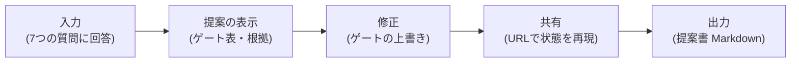

[プロセス提案シミュレーター](/process-compass/tool/simulator/)が[要件定義](/process-compass/tool/requirements/)どおりに機能するかを、利用シナリオの3ペルソナで検証した記録です。あわせて、実際に使ってくださる方からのフィードバックの受け付け方法を示します。

## 検証の方法

要件定義の利用シナリオと同じ3ペルソナになりきり、ブラウザー自動操作(Playwright)で入力から提案書の出力までを通しで実行しました。

検証したペルソナは次の3者です。

| ペルソナ | 入力した条件 |
| --- | --- |
| P1: スタートアップの技術リード | 1〜2名 / PoC / 一般的なWeb / 自社開発 / 外部レビュアなし |
| P2: 事業会社のエンジニアリングマネージャー | 3〜9名 / グロース / 一般的なWeb / 自社開発 / 既存ゲートあり |
| P3: SIer のプロジェクトマネージャー | 10名以上 / 安定運用 / 規制業 / 受注側 / 認可済みAIのみ |

## 検証項目と結果

| 検証項目 | 期待する動作 | 結果 |
| --- | --- | --- |
| 提案の妥当性 | 各ペルソナにシナリオどおりの提案(P1=最小構成+CI厳格化、P2=ほぼ標準+分離推奨、P3=契約対応+監査書式+トレーサビリティ)が出る | 3者とも合格 |
| 条件付き質問 | 外部レビュアの質問は1〜2名のときだけ表示される | 合格 |
| 根拠の追跡 | すべての調整に理由と出典リンクが付く | 合格 |
| 修正と逸脱 | 提案より弱める修正が「逸脱」として警告つきで記録される | 合格 |
| URL共有 | 共有URLを開くと回答と修正がそのまま再現される | 合格 |
| 提案書出力 | コピー・ダウンロードした Markdown に入力・ゲート構成・逸脱・不変条件・根拠が揃う | 合格 |
| エラー | ブラウザーのコンソールにエラーが出ない | 合格 |

## 発見した問題と修正

通し検証で2件の問題を発見し、ルールエンジンを修正しました。

### 1. 同じ結論どうしを「衝突」として警告していた

P1では独立レビューへの「省略」を別の規則が同じ「省略」で上書きし、P3では出荷判定への「厳格化」を同じ「厳格化」で上書きしていました。結論が同じなら利用者の判断すべきことは何もないのに、「⚠ この組み合わせには衝突があります」と表示され、不安をあおるだけでした。

**修正**: 同じ結論に到達する上書きは警告を出さず、トレース(取り消し線)の記録だけ残す。

### 2. 省略したゲートに矛盾する設定が残っていた

P1の出荷判定は「省略」なのに、調整内容へ「出荷判定は価値責任者が兼ねる」という同順位の別規則の設定が併記され、自己矛盾した提案に見えていました。

**修正**: 同順位では構造操作(省略)を優先し、省略済みゲートへの設定を適用しない。優先度の高い設定要求が省略を取り消す既存の安全側の動作(品質・規制の規則)は維持する。

いずれも回帰テスト(`npm run test:engine`)へシナリオとして追加済みです。

## このテストの限界

自動化した模擬テストで確認できたのは「要件どおりに動くこと」までです。次の問いには実際の利用者しか答えられません。

- 質問の言葉づかいが、プロセス用語を知らない人に本当に伝わるかの確認
- 提案の内容が、その組織の実態にとって納得感のあるものかの確認
- 提案書が、上長・品質部門への説明資料として実際に機能するかの確認

## フィードバックのお願い

シミュレーターを試して気づいたことは、どんな小さなことでも歓迎します。

1. [シミュレーター](/process-compass/tool/simulator/)を自分のチームの条件で試す
2. 気づいたことを [フィードバック Issue](https://github.com/Takenori-Kusaka/process-compass/issues/new?template=feedback.yml) へ書く(提案内容への指摘は、共有URLを添えてもらえると原因を追いやすい)
3. Issue にするほどでもない感想は [ディスカッション](https://github.com/Takenori-Kusaka/process-compass/discussions) へ

いただいたフィードバックは知識ベース(テーラリング規則)の改善に反映し、このページへ検証記録として追記します。
