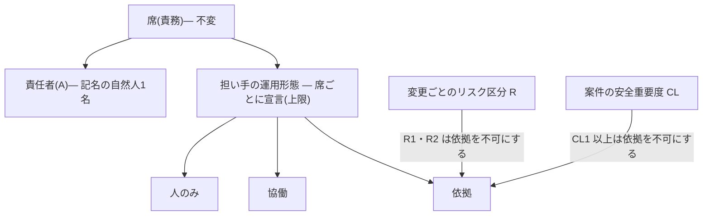

# 284・285 会議体 意見書04: 規格・法務・安全役(2026-09-30)

- 対象: Issue #284(論点A 席と担い手)、#285(論点B 品質保証の論証)。論点整理は `284-285-council-00-brief.md`
- 立場: 規格・規制・法的責任との整合を守る。起票者の提案もオーナーの方針も正しいとは仮定しない。他の立場の意見書は読んでいない
- 凡例: 「規範が定める」は根拠水準 E1 です。**規範が定めていることは、その措置が効くことの証拠ではありません**。独立性の効果の測定値は、読めたどの規格も示していません [FND-0225]。「沈黙」は読めた範囲での不在で、許容を意味しません

## 0. 読めた範囲と読めていない範囲

| 規範 | 読めた範囲 | 出典 |
| --- | --- | --- |
| EU AI Act 第14条・第26条 | 条文(14(1)(4)(5)、26(2))。高リスク分類の指針は二次解説のみ | [SRC-0087] [SRC-0487] |
| ISO/IEC 42001 / 42105 | 42001 は公開プレビュー(附属書 A 本文は未読)。42105 は未発行で DIS の用語定義のみ | [SRC-0090] [SRC-0490] |
| NIST AI RMF 1.0 / AI 600-1 | 細分類の一部、附属書 C、§2.7(全文ではない。任意適用) | [SRC-0518] [SRC-0520] |
| J-SOX 実施基準 / SOC 2 / COSO | 該当節。SOC 2 は 2020-03 更新版の複製(2022 年改訂は未読) | [SRC-0537] [SRC-0538] [SRC-0535] |
| IEEE 1012 | **本文未読**。NASA-STD-8739.8B の採録と NRC RG 1.168 を介する | [SRC-0522] [SRC-0523] |
| ISO 26262 | 第12部 §7 の目的と注記のみ。I0〜I3 の表は二次情報(254 メモ §4) | [SRC-0526] |
| IEC 61508-1 / DO-178C / IEC 62304 | 61508 は表4・5 の許諾転載(254 メモ §3)、DO-178C は二次情報、62304 は修正票1 のプレビュー | [SRC-0531] [SRC-0525] |
| ISO/IEC 29110 / ISO 19011 | 29110 は序文〜7.2.2 と策定者論文(SI 工程は未読)。19011 は 2018 年版の原則 e)(2026 年版 4.6 は未読) | [SRC-0330] [SRC-0331] [SRC-0532] |
| OSPS Baseline / Green Book / SP 800-53B / FDA(2002) | 該当節 | [SRC-0347] [SRC-0419] [SRC-0544] [SRC-0524] |
| 経産省 民事責任の手引き | 2.1、2.2、4.3。**2 要件の中身は未確認** | [SRC-0621] |
| AI事業者ガイドライン / J-AISI / DS-920 | 該当節 | [SRC-0095] [SRC-0622] [SRC-0250] |
| GSN 第1版・第3版 / Assurance 2.0 | GSN は該当節、Assurance 2.0 は abstract | [SRC-0440] [SRC-0562] [SRC-0441] |
| ISO/IEC/IEEE 15026、ISO 9000・9001 本文、ISO/IEC 25010、SQuBOK、ISO/IEC 17050、民法(請負)・製造物責任法・景品表示法 | **出典台帳に無い(未読)**。本意見書はこれらの条文に依る主張をしない | — |

## 1. 結論

**論点A は A-3(席・責任者・担い手の3層)を骨格に採ります。ただし「AI 自律」を運用形態に置きません**。置く形態は次の3つです。変化点の手続(A-1 の追加部分)は A-3 の一部として採ります。

| 形態 | 内容 |
| --- | --- |
| 人のみ | 人が一次の成果物を直接確認して確定する。AI の出力は手がかりに限り、確認の根拠にしない(ADR-0023 と同じ扱い) |
| 協働 | AI が作った材料(要約・突合結果・指摘)を根拠に含めて、人が変更ごとに確定する |
| 依拠 | AI と機械検査の結果で変更を先へ進め、席の責任者が事後に抜き取りで確認する。**判定の主体は移らない**。移るのは判定の時点と、責任者の義務の中身(個々の確認から、仕組みの構築と運用へ) |

**論点B は B-1(保証の論証)を採ります**。B-3 は B-1 の附表とし、「対応」の表示に限ります。B-2 は B-1 から導く派生物とします。

規範上の必須条件は次の8つです。

1. 席の責任者(A)は記名の自然人1名。AI の列に A を置かない(3.2、禁止事項2 を維持)
2. **監視・介入・停止と、運用形態を緩める決定は、自然人に固定する**。5.4.1 の監視者を、固定の対象として明文化する
3. 依拠を適用できるのは、**CL0 の案件における R3 の変更**に限る。CL1 以上と R1・R2 へ広げない
4. 運用形態の宣言は案件単位の**上限**であり、変更ごとのリスク区分の判定がそれを下げる。宣言から「人の確認は要らない」を導かない(ADR-0039、禁止事項7)
5. 「独立」の語は人の独立(CL に応じて組織の独立)に限って使う。文脈・入力の分離は AI を担い手にするときの追加条件であり、人の独立の代替ではない(3.5.3 を維持)
6. 変化点の記録に、**無効になった確認と、その再実施の要否**を含める
7. 保証の論証の最上位の主張は「記録から再構成できること」に置く。**結果(品質・欠陥の不在)を約束する文言を使わない**
8. 既存規格への適合を主張しない(1.3、F.1 を維持)。主張できるのは本標準への自己適合と、既存規格との対応関係まで

## 2. 論点A: 席と担い手

### 2.1 各案と規範の整合

| 案 | 整合する点 | 整合しない点 | 判定 |
| --- | --- | --- | --- |
| A-1 現行維持+変化点手続 | 責任と監視を人に置く。読めた規範のどれにも反しない | 承認が形だけになりうる実態(人が危険なコマンドを止めたのは 13.6%。自己報告 [FND-0010])を、統制の記述が反映しない。J-SOX 実施基準は整備状況と運用状況の有効性の評価を節に持つ([SRC-0537#c5] の節見出し。評価手続の本文は未確認)。**記述どおりに運用されていない統制は、監査で説明がつかない** | 変化点手続だけを採る |
| A-2 二択の宣言 | 責任を人に残す限り、経産省の手引きの枠組み(依拠/代替型)に載りうる [SRC-0621#c3] | (1) 「完全自律」に当たる形は公的文書にも無い。J-AISI の全自律型も監督メカニズムの下での運用が前提 [SRC-0622#c2]。(2) 「人のみ」の選択肢が無く、安全の最終判断(5.8.3)を表せない。(3) 席単位の宣言は案件単位の確定で、R 依存の条項を案件単位で適用外にする形になる(禁止事項7 に抵触)。(4) 外部の自律度分類に役割単位の二値は無い [FND-0001] | 採らない |
| A-3 3層 | 作業の担い手と結果責任を分ける書き方は規範に先例がある(V&V を外部が行っても最終責任は事業者に残る [SRC-0523#c4])。上限を R で切る構成は、承認点を操作のリスクで定める指針と同じ向き [SRC-0539#c1] [SRC-0622#c1] | 「AI 自律の席が判断を確定する」部分は規範が沈黙し、ADR-0028 決定7・ADR-0035 決定1・第8章「AI を独立レビュアの代替に置きません」と矛盾する | 形態を改めて採る |
| A-4 行為単位へ全面移行 | 承認要否を行為のリスクで定める点は外部の主流 [FND-0002] | 職務分離・責任・監査証拠の単位は、規範では役割と者で書かれている(J-SOX [SRC-0537#c1]、NIST GOVERN 3.2 [SRC-0520#c1]、ISO/IEC 42001 [SRC-0090#c1])。役割を廃すると、兼務禁止を判定する単位が消える | 原理だけを 5.4 の上限として使う |

### 2.2 自然人に固定するもの、AI が担えるもの、規範が沈黙するもの

| 区分 | 対象 | 根拠 | 根拠の性質 |
| --- | --- | --- | --- |
| 固定 | 結果責任(A)と対外的な説明責任 | 指針間で一致 [FND-0004]。ISO/IEC 42001 は責任の単位を組織の役割に置く [SRC-0090#c1] | 規範の一致(E1) |
| 固定 | AI の動作の監視・介入・停止 | EU AI Act 第26条(2)・第14条(4) [SRC-0487#c2] [SRC-0087#c2]、ISO/IEC 42105 DIS [SRC-0490#c2] | **類推**。AI Act の対象は高リスク AI の使用中の監視で、開発支援ツールが該当するかは判定できない [FND-0168]。42105 は未発行 |
| 固定 | 不可逆・金銭・法的・規制対象の操作の承認、リスクの受容 | ISACA [SRC-0539#c1] [SRC-0539#c3]、J-AISI の半自律型 [SRC-0622#c1]。公的指針は不可逆・高影響な行為に承認点を置く [FND-0002] | 指針(E1)。5.4.3・5.7.3 と同じ向き |
| 固定 | 安全に関する最終判断、安全度の独立した評価 | 安全規格は担い手を人・組織として書く [FND-0225]。設計の検証は設計者以外の者 [SRC-0523#c3] | 規範(E1)。AI を数える文言は読めた範囲に無い(不在の確認ではない) |
| 固定 | 運用形態を緩める決定、R と CL の確定 | 5.4.3 要求4、3.8.1。人が最終判断する対象は「AI を活用する範囲や条件」[SRC-0620#c1] | 指針(E1) |
| 固定 | 適合の宣言・検収・契約などの意思表示 | 個別の法令条文は未読 | **未読**。各組織の法務確認に委ねる |
| AI 可 | すべての実行(R)。レビュー・突合の作業そのもの、判断材料と草案の作成 | 作業と責任の分離 [SRC-0523#c4]。統制活動に自動化を数える [SRC-0538#c3] [SRC-0537#c4]。AI 関連の変更の検証手順は「人または自動」[SRC-0535#c3](CI/CD の検証に限る記述) | 規範(E1) |
| AI 可 | 決定論的な検査の実行と合否 | 5.8.1。ツール由来の欠陥を後段の V&V が検出できるなら、ツール自体への V&V は要らない [SRC-0523#c5] | 規範(E1) |
| 沈黙 | AI の判定を、人の個別の確認なしに確定として扱うこと | J-SOX と SOC 2 は AI 以前の文言。COSO は明言しない [FND-0181] [FND-0276]。見解は統制の目的で割れる [FND-0184](E0) | 沈黙 |
| 沈黙 | 契約責任(請負の検収・契約不適合)の下での AI への依拠 | 手引きは契約責任を対象から外す [SRC-0621#c1] | 沈黙 |
| 沈黙 | LLM を用いる検査・レビューツールの認定 | 束に無い [FND-0238] | 沈黙 |
| 沈黙 | 供給者側の世代交代、目的・納期の変更を変化点に数えること | NIST は名指ししない [FND-0191]。後者は二次解説の水準 [FND-0192] | 沈黙〜弱い E1 |

沈黙の領域は、信頼性の証拠で開け方を決めます。AI がロール保持者として判断を引き受け続けた運用報告は束に無く [FND-0007]、人へ戻すべき場面で戻さない失敗は独立 2 ベンチマークで測定されています [FND-0012]。**したがって沈黙の領域は最小に開きます**。開くのは、既に第8章 軸A が持つ「事後監査への切替」と同じ構造(検出は機械、取り消せる、確約範囲に触れない)に限ります。

### 2.3 規範は独立性をどう定義しているか

| 次元 | 規範の定義 | AI を担い手にしたときの読み |
| --- | --- | --- |
| 人 | 作成者以外の者(ISO 26262 の I0・I1、DO-178C は二次情報。IEC 61508 の最下位は independent person)。ISO/IEC/IEEE 29119-1 附属書 E.3 は作成者本人によるものを「独立性なし」とする(254 メモ §1〜§6) | AI が「別の者」に当たるかを、読めた規範は書かない。**当たると読まない** |
| 技術的 | 分析要員が対象の開発に関与していない [SRC-0522#c2]。第一線の開発者でなかった者 [SRC-0518#c4] | 文脈・入力の切り離し(3.5.3、5.8.4)が対応する。効果が測定されているのはここだが、再現率は 27.1% [FND-0087] |
| 管理的 | 開発と同じ組織に属さず、対象・手法・日程を自ら決める [SRC-0522#c3]。ISO 26262 は組織上の独立と注記 [SRC-0526#c2] | AI に報告線は無い。**AI を設定し指示する人**の報告線で判定する。COSO は職務分離を「AI の設定を構成する権限」と「出力を承認する権限」の分離として書く [SRC-0535#c1] |
| 財務的 | 予算の統制が開発組織から独立した集団にある [SRC-0522#c4] | 検証側 AI の実行予算と停止を開発ラインが握る構成では成立しない |
| 出力の独立検証 | ツールで目標を満たすなら、出力を独立に検証するか、ツールを認定する [SRC-0531#c2] | LLM の認定の経路は束に無い [FND-0238]。残るのは出力の独立検証で、5.8.1 と同じ結論 |
| 提供元・モデル系統 | 規範に無い。in-toto の未審査の提案だけが次元に挙げる [SRC-0618#c4] | 独立性に数えない。系統混合の効果は測定で符号が分かれる [FND-0080]。5.8.4 と ADR-0012 決定6 を維持 |

帰結は3つです。

- 本標準の「独立」は**人の独立**で定義し、CL に応じて組織の独立を重ねる。文脈・入力の分離は AI を担い手にするときの追加条件で、人の独立を代替しない
- 3.5.3 の「いずれか一方でも同一であれば、分離は成立していません」は規範と整合する。**1名+AI 複数の体制では、AI を何体に分けても人の単位が同一であり、独立は成立しない**
- 文脈だけを分けた確認を「独立レビュー」と呼ばない。「文脈分離による確認」と呼び、記録と対外の表示でも区別する

### 2.4 安全重要度(CL)が高い案件での上限

| 区分 | 判定を確定する席(G-6・G-7・安全度の評価)の上限 | 根拠 |
| --- | --- | --- |
| CL3 | 安全関連部は人のみ。それ以外は協働まで。独立レビュー2名、安全度の評価は組織的に独立した者。適用規格の独立性の表が本標準に優先する | 軸E、F.3、5.8.3、[SRC-0526#c1]。ツールの出力は独立に検証する [SRC-0531#c2] |
| CL2 | 協働まで。依拠は不可。代償措置による独立性の緩和も不可 | 軸E「人員が足りない場合」。NRC は条件付き独立を受け入れない [SRC-0523#c1](原子力の規制指針で、類推) |
| CL1 | 協働まで。依拠は不可 | 軸A「適用できない場合」、ADR-0028 |
| CL0 | 依拠は R3 の変更に限る。R1・R2 は協働以上 | 5.4.4、軸A の切替3条件 |

CL は案件ごと、R は変更ごとの判定です。**CL0 の案件でも R1 の変更は人が確定します**。CL からリスク区分依存の条項の適用外を導く書き方は、ADR-0039 に反します。IEC 62304 は全要求の検証済み確認を製造業者に課しますが [SRC-0525#c1]、実施者の独立性を定める条文は読めた範囲にありません。CL2 の上限は本標準の軸E に依っており、62304 から導いたものではありません。

### 2.5 変化点管理について規範が求める記録

| 起点 | 規範が求めること | 出典 |
| --- | --- | --- |
| 確認措置の完了後に対象が変わった | 関連する確認措置をやり直すか補う。報告書に対象の名称と改訂番号を含める | [SRC-0526#c3] [SRC-0526#c4] |
| モデル・プロンプト・ツール・権限・メモリ挙動・検索元・提供者・配備環境・操作範囲の変更 | リスクの再評価と統制の再試験 | [SRC-0539#c4] |
| 微調整・RAG の実装後、未評価の用途への展開 | モデルのリスクの再評価。導入後の監視計画に変更管理を含める | [SRC-0520#c3] [SRC-0520#c5] |
| 手順へ波及する人員削減・再編 | 手順を新しい人員水準に合わせて改める。波及しない組織変更は対象外 | [FND-0019] |
| 統制の省略・代替 | 省いた理由と、代替がどう要求を満たすかを記録する | [SRC-0544#c1] [SRC-0544#c5] |
| QMS の変更 | 目的と結果・完全性・資源・責任を考慮して計画する(二次解説。ISO 9001 本文は未読) | [FND-0192] |

本標準は、モデルの差し替え(3.12.3)、切り替え時の自律レベルの引き下げ(3.12.5)、廃止への追随(3.12.6)、担当表の更新(3.13)、3名以上になった時点での例外の失効(3.5.2 条件1)を既に持ちます。**欠けているのは、これらを1つの記録へ束ねる手続と、過去の確認の有効性の扱いです**。体制・AI 編成へ変化点管理を転用した先例と効果の測定は束に無く [FND-0020]、以下は規範からの類推です。

必須とする記録は次の5点です。

- 変化点の種別・日付・変更前後の D-0 の版
- 兼務禁止(3.5)と独立性(2.3)の再判定の結果
- **無効になった確認**。仕掛かり中の成果物のうち、作成指示者と確認者の関係が変わったものと、再実施の要否
- AI の担い手の適格性確認(4章 A5)の失効と再確認
- 決定した自然人。緩める方向は判定を要し、厳しくする方向は即時に適用する(5.4.5・5.4.6 の非対称を踏襲)

## 3. 論点B: 品質保証の論証

### 3.1 保証の論証は規範上どう位置づくか

- 読めた範囲: GSN は共同体標準(記法)で、ISO 規格ではない。第3版は前提を「意図的に立証しない言明」と定義し、未展開の標識と、疑念を表す弁証法拡張を持つ [SRC-0562#c1] [SRC-0562#c4] [SRC-0562#c5]。Assurance 2.0 は、解消しない疑念の許容を意識的に判断して記録するよう求める [SRC-0441#c2](技術報告の abstract)
- 読めていない範囲: ISO/IEC/IEEE 15026 と、安全ケースの提出を求める条文(ISO 26262 第2部など)は束に無い。**「保証の論証を置くことは規範上の要求である」とも「15026 に沿う」とも書かない**
- 位置づけ: 保証の論証は保証そのものではなく、**主張と根拠の対応を第三者が検査できるようにする開示の様式**。この様式が品質を上げる、または品質保証部門の判断を改善することの測定は束に無い(E0)。DO-178C は保証ケースを暗黙にしたまま運用され、それで足りていたことを経験的証拠は示唆するとされる [SRC-0534#c2]
- 根拠の種類を分ける: 論証の根拠欄で、**規範への整合(E1)と効果の測定(E2・E3)を別の種類として書く**。「ISO が求めている」を「効く」の根拠に置かない
- 既存の語彙で足りる: 前提は根拠水準マーク(ADR-0026)、未展開の主張は `unmet`(ADR-0028)、残存する疑念は 5.7.2 の「確認していない事項」「受容したリスク」に対応する。新しい記法を作らない

### 3.2 対外的に言ってよい範囲と、言ってはならない表現

言ってよいのは、**実施した事実と、記録から確かめられる状態**までです。第8章 軸D は既に「レビューパッケージは判定の手がかりであって品質の保証ではありません」(ADR-0023)、「検査を実施した事実を示すものであり、潔白の証明ではありません」(ADR-0021)と書いています。保証の論証はこの語法に合わせます。

| 言ってよい表現 | 条件 |
| --- | --- |
| 「本標準の要求事項に従って運用した。適用した版、調整、未達は次のとおり」 | 組織による自己宣言。記名の自然人が署名する。未達と逸脱を併記する |
| 「出荷した各変更について、責任者、リスク区分、経た検証、確認しなかった事項を記録から再構成できる」 | 記録が実在し、抜き取りで突合できる |
| 「AI の出力は、決定論的な検証と、作成を指示していない者の確認を経て成果物にしている」 | 確認の時点(事前・事後の抜き取り)と独立性の形態を併記する |
| 「次の規格の構成を参照している」 | 「適合を主張しない」を同じ文に書く |

| 言ってはならない表現 | 理由 |
| --- | --- |
| 「品質を保証する」「欠陥がないことを保証する」 | 結果の約束になる。プロセスの実施からは導けない。ADR-0021・ADR-0023 と矛盾する |
| 「承認した人間が品質を保証する」 | 附属書D の想定問答の現行文言。対外的な責任の主体は組織で、個人による保証と読める。**改める** |
| 「ISO 9001 / ISO/IEC 42001 / ISO 26262 / IEC 61508 / IEC 62304 / DO-178C に適合(準拠)」 | 1.3、F.1。条文の大半が未読 |
| 「EU AI Act 第14条に対応済み」 | 対象は高リスク AI の使用中の監視。整合規格は策定中 [FND-0166] [FND-0168] |
| 「J-SOX・SOC 2 の職務分離を満たす」 | AI を分離の一方に数えてよいかを規準は定めていない [FND-0276]。判断するのは監査人 |
| 「独立検証(IV&V)済み」「第三者レビュー済み」 | IV&V は技術・管理・財務の独立を指す [SRC-0522#c1]。文脈分離や同一ライン内の別人には使えない |
| 「AI がレビューしたので検証済み」 | 5.6.2、ADR-0028 決定7 |
| 「人が確認済み」(AI の要約だけを見た承認) | 判断の入力を AI が作る構成の見逃し率は未測定 [FND-0228]。何を見たかを書く |
| 「経産省の手引きにより責任が限定される」 | 不法行為が中心で裁判所を拘束せず、契約責任は対象外 [SRC-0621#c1] |
| SIL・ASIL・I0〜I3 などの記号を本標準の区分へ併記する | F.1「用語を安易に併記しない」 |

「保証」という語そのものの法的な含意(契約上の保証、表示に関する規制)は、本調査で条文を読んでいません。**本節は保守側に倒した手引きであり、法的助言ではありません**。条文化するときは、対外文書の文言を各組織の法務部門が確認する旨を書き添えます。

### 3.3 適合を主張できる規格、主張してはならない規格

| 区分 | 対象 | 扱い |
| --- | --- | --- |
| 主張できる | 本標準への適合(自己宣言) | 版・調整の宣言・未達の一覧を併記する。第三者認証の制度は無いため「認証」「認定」の語を使わない |
| 対応関係だけを示す(B-3) | ISO/IEC/IEEE 12207(特定のライフサイクルモデルを要求しない [FND-0170])、ISO 9001、ISO/IEC 42001(役割に関する責任の証拠 [SRC-0090#c1])、AI事業者ガイドライン(人間の判断を介在させる仕組み [SRC-0095#c1]) | 列は「規範の要求 / 本標準の条項 / 読了範囲 / 対応の種類」。読了範囲の列を省かない |
| 主張してはならない | 上表の安全規格・EU AI Act・内部統制の規準、ISO/IEC 25010、SQuBOK、ISO/IEC 29110、OSPS Baseline | 25010 と SQuBOK は束に無い。29110 は SI 工程が未読。OSPS Baseline は OSS プロジェクト向け [FND-0018] |

## 4. 論点整理の問いへの回答

### 論点A

**A1(5.5 を維持するか)**: 原則を維持し、対象と理由を改めます。人に固定するのは「4種類の判断の作業すべて」ではなく、**判定の帰属(確定)・監視・運用形態を緩める決定**です。5.5 は理由を「A を負う者による判断でなければ責任の所在を失う」と書きますが、規範は作業を他者が担っても責任が残る構成を認めており [SRC-0523#c4] [SRC-0621#c3]、この理由は規範より強い主張です。人に残す理由は、監視を人に置く規範、AI による確定の信頼性を示す証拠の不在 [FND-0007]、契約・規制の文脈、の3つへ書き改めます。担い手の運用形態に委ねるのは、判断材料の作成と、R3 の変更における確認の時点(事前か、事後の抜き取りか)までです。5.5 の「案件側の記録で本章の要求を緩和する経路はありません」は維持します。依拠は標準が定める形態であり、案件の記録による緩和ではないためです。

**A2(独立レビュアと出荷判定者を AI が担えるか)**: 席の責任者としては担えません。作業の担い手としては担えます。独立は 2.3 のとおり、人(と組織)で定義します。別モデル系統は数えません。別文脈と入力の切り離しは、AI を担い手にするときの必須の追加条件です。外部の観測(決定論的な検査の結果)は独立性ではなく 5.8.1 の検証です。出荷判定(G-7)の突合は機械化と相性がよい作業ですが、確定は人が記名で行います(5.4.3 要求2)。

**A3(1名・2名体制)**: 読めた規範は、課さない(OSPS Baseline)、外部に置く(ISO/IEC 29110 は顧客)、代償措置で維持する(Green Book、FDA、SP 800-53B、SOC 2)の3型です [FND-0016] [FND-0018] [FND-0189]。本標準は現行どおり、G-6 は外部に置くか `unmet` として表示し続け、G-7 は代償措置つきの例外とします。

- 1名: 席はすべて成立し、責任者は同一人。人の独立は成立しない。文脈分離による AI の確認は**代償措置として記録し、未達の解消として扱わない**(ADR-0028 決定6)。AI の設定者と作成指示者が同一人で、COSO の言う分離も成立しない [SRC-0535#c1]
- 2名: 作成指示者と確認者を交互に担えば人の独立が成立する。検証側 AI の設定は確認者側が持つ
- 「課さない」型は採らない。OSPS Baseline は OSS 向けで、利用者が多い段階では作者以外の人間の承認を課す [SRC-0347#c2]。FDA は小規模企業に独立性を免除していない [SRC-0524#c3]
- CL1 以上の扱い(1〜2名の構成を拒否、CL2 以上は代償不可)は変えない

**A4(変化点に何を数えるか)**: OSHA の絞り込み(手順へ波及するか)に倣い、**分離・責任・検証の成立条件を動かす変化だけ**を数えます。

| 数える | 数えない |
| --- | --- |
| 席の責任者の交代・空席、人数が軸A の区分をまたぐ増減 | 同じ区分内で、分離に影響しない要員の増減(担当表の更新だけを行う) |
| 担い手の運用形態の変更 | 同一形態の中でのセッションの増減 |
| AI の担い手のモデル・指示資産・ツール・権限の変更 [SRC-0539#c4] | 設定を変えないままの挙動変化(宣言では捉えられない。3.12.4 の品質監視で捉える) |
| 軸B〜E の入力の変化(ステージ移行、開発形態、CL) | — |
| 目的・納期の変更のうち、確約範囲(SC-M)またはゲートの実施可能性を動かすもの | 第7章の許容差の内側に収まる変更 |

更新するのは D-0 とその導出物(構成の `roles[]`)で、記録は 2.5 の5点です。決定するのは D-0 の結果責任者である自然人で、AI は草案までを担います。目的・納期の行は二次解説に依るため [FND-0192]、根拠水準マークを付けます。

**A5(AI の担い手の任命基準に当たるもの)**: 「任命」の語を使わず、**適格性確認**とします。任命は責任を負える者に対する行為で、AI には当たりません。規範上の対応物は、ツールの認定 [FND-0226]、再評価 [SRC-0520#c3]、統制の再試験 [SRC-0539#c4]、本標準の 3.12.3 です。内容は次の4点とします。

- 席の作業に即した検出能力の測定(5.6.2 の欠陥注入を、現行のモデルと指示資産の版で実施)
- 人へ戻すべき場面で戻すことの確認 [FND-0012]
- 記録: モデルと指示資産の版、実施日、確認した自然人(作成指示者の側でない者)、結果
- 失効: **期間ではなく、2.5 の変更が起きた時点で失効する**。無期限としない(3.4.1 要求5 の対応物)

これは DO-330 の意味でのツール認定ではありません。CL2 以上で認定の代わりに使えません。閾値は組織が定め、標準は値を置きません。

### 論点B

**B1(最上位の主張)**: 「本標準に適合して運用した案件では、出荷した各変更について、誰が結果責任を負い、どのリスク区分でどの検証を経て、何を確認しなかったかを、第三者が記録から再構成できる」とします。保証するのは**記録の存在と突合可能性**です。保証しないのは、欠陥の不在、製品品質の水準、法令・契約・他規格への適合、本標準の措置の効果です。保証しないものは論証の冒頭に列挙します。

**B2(AI によるレビュー・検証を検証に数える条件)**:

| 数えてよい | 数えてはならない |
| --- | --- |
| 決定論的な検査で、合否の基準を実装から独立に人が定めたもの(5.8.4) | 作成側と同じ文脈、または作成指示者が設定した AI による確認 |
| AI の指摘のうち、実行結果などの再現できる観測を伴い、人が独立に確かめたもの [SRC-0531#c2] | 検証側 AI が、レビュー対象のブランチにある指示を読む構成(作成側が検証側の設定を書き換えられる。製品の実例は [SRC-0229#c3]) |
| 依拠の形態(CL0 × R3)で、適格性確認が有効で、事後の抜き取りが実施されているもの。**形態を併記する** | 適格性確認の後にモデル・指示資産が変わったもの |
| — | AI の要約だけを入力にした人の承認を「人による検証」に数えること [FND-0228] |
| — | CL1 以上、R1・R2 での AI の判定。形式的な検証活動の代替(5.8.3) |

**B3(形骸化していないことを対外的に示す)**: 工程単位の観測で示します。(1) 差し戻しの記録と件数(0% の継続は警戒の対象。5.4.6)、(2) 欠陥注入の検出率(5.6.2。個人単位で出さない)、(3) 5.7.2 の「確認していない事項」、(4) **承認者に何が提示されたか**(差分か、AI の要約か)、(5) 承認者あたりの承認件数。(5) は J-AISI の「監視能力の飽和」[SRC-0622#c5] に対応します。ISO/IEC 42001 の審査で最初に求められる証拠は監視手順・エスカレーション経路・覆しの記録だという解説がありますが [SRC-0091#c1]、審査機関担当者の意見で、附属書本文は未読です。これらが示すのは統制が運用されたことで、欠陥が無いことではありません。

**B4(証跡の最小集合と装置の肥大)**: **論証のために新しい証跡を作りません**。各主張は既存の記録(D-0、ゲート判定記録、変更ごとの R、5.8.2 の検証の記録、`unmet` と逸脱、欠陥注入の結果、変化点の記録、根拠水準の台帳)を指し、指せない主張は未展開として表示します。COSO は文書化を重要度と規制上の露出に比例させ、生成 AI が減らすはずの負担を作り直さないよう求めます [SRC-0535#c6]。Green Book は費用だけを統制省略の理由と認めず [SRC-0419#c2]、SP 800-53B は外した統制の理由の記録を求めます [SRC-0544#c1]。両立の形は「証跡の量は CL と R に比例させる。外した統制は理由とともに記録する。黙って外さない」です。

**B5(独立性を満たせない体制の保証水準の開示)**: 段階ラベル(水準1〜5 など)を作りません。ADR-0014 決定9 は、ラベルが評価材料に転用されるとして総合スコアと成熟度ラベルを出力しないと決めています。**欠けている独立性の次元を事実として列挙します**(人の独立なし / 文脈分離のみ / 同一ラインの別人 / 別ライン / 別組織)。`unmet` は論証の冒頭と出荷の証跡に表示し(ADR-0028 決定2・3)、代償措置は「未達の解消ではない」と併記します。I0〜I3 や IV&V の語を借りません。

**B6(品質保証部門が最初に尋ねる問い)**:

| # | 問い | 本標準の答え |
| --- | --- | --- |
| 1 | AI が作った成果物の責任は誰が負うか | 成果物ごとに記名の自然人1名(3.2)。対外的には組織。AI は負わない |
| 2 | AI のレビューを検証に数えているか | 原則として数えない。機械検査の層に置く(ADR-0028 決定7)。数える条件は B2 |
| 3 | 作成者と確認者は独立か。どの水準か | 人と文脈の2単位で判定する(3.5.3)。欠けている次元を列挙して開示する |
| 4 | 人の確認が形だけでないことをどう示すか | 挙動要約、差し戻しの記録、欠陥注入の検出率、確認していない事項、提示内容の記録(B3) |
| 5 | どの変更にどの検証を課したか | 変更ごとのリスク区分と、案件ごとの安全重要度で定まる(5.8.4、軸E、F.4) |
| 6 | モデルが変わったとき、過去の確認は有効か | 差し替えは変更管理の対象(3.12.3)。適格性確認は失効し、無効になった確認を記録する(2.5) |
| 7 | 人が減った・入れ替わったとき、統制は維持されるか | 変化点の記録で兼務禁止と独立性を再判定する。成立しないゲートは `unmet` として表示し続ける |
| 8 | ISO 9001 などの既存規格との関係は | 対応表を示す。適合は主張しない(1.3) |
| 9 | 省いた統制・満たせなかった要求はどこにあるか | 調整の宣言、`unmet`、逸脱、根拠水準の台帳。論証の冒頭に載せる |
| 10 | このプロセスで品質が上がる証拠はあるか | 無い。措置の多くは E0〜E2 で、台帳に開示している。自組織のパイロットで測る(附属書D §6) |

問い10 に「ある」と答える論証は書けません。ここを正直に書けることが、保証の論証を置く理由です。

## 5. 採らない案と理由

| 案 | 採らない理由 |
| --- | --- |
| A-1 だけを採る | 規範には反しない。しかし AI への事実上の依拠を統制の記述の外に置くと、整備と運用が乖離した統制になる。宣言させるほうが説明がつく |
| A-2(二択) | 2.1 のとおり。監視を外した「完全自律」は公的文書にも無く、席単位の宣言は ADR-0039 に反する |
| A-4 だけを採る | 兼務禁止と責任の単位が消える。行為のリスクで上限を切る原理は 5.4 が既に持つ |
| 「AI 自律」の席が判定を確定する | 規範は沈黙し、信頼性の証拠が無い [FND-0007] [FND-0012]。ADR-0028 決定7、ADR-0035 決定1、5.2 と矛盾する |
| 別モデル系統・別ベンダーを独立性に数える | 規範に無く、測定は符号が分かれる [FND-0080]。製品の境界はモデルの境界と一致しない [FND-0090] |
| 1〜2名の G-6 を「課さない」 | OSS 向けの先例で、企業内開発は対象外 [FND-0018]。FDA は小規模企業に免除しない |
| B-2 だけを採る | 想定問答は保証しないものを書く場所を持たない。現行の文言に「保証」の誤用がある(3.2) |
| B-3 だけを採る | 対応表は適合の主張として読まれる。読了範囲が部分的な規格を表に載せると、読んでいない条文への整合を示唆する |
| 保証水準の段階ラベルを新設する | ADR-0014 決定9 と矛盾する。安全規格の記号と混同される(F.1) |
| 論証専用の証跡を新設する | 装置の肥大(#267 #269 #270)。COSO も負担の作り直しを戒める [SRC-0535#c6] |

## 6. 条文化するときの必須の限定

### 6.1 適用範囲の書き方(ADR-0039)

- 依拠を定める節の見出しに `(適用: CL0 の案件における R3 の変更)` を併記する。**案件ごと(CL)と変更ごと(R)の両方の単位を持つ**ため、適用範囲の台帳にも両方を記載する
- 案件の構成が出力できるのは「席の運用形態の上限」と「変更ごとに判定を要する」までで、「この席は人の確認が要らない」を出力しない
- CL と R の限定は、規範と同じ行に書く。別の段落へ置かない
- 受託(軸D)では、依拠の適用を契約で合意した場合に限る。手引きは契約責任を扱わないため [SRC-0621#c1]、行の中に限定を書く
- 規制業(軸C)では依拠を適用しない。判定の時点そのものが監査要件になる(軸A「適用できない場合」と同じ理由)

### 6.2 既存の条項との突合で、どちらかを改める箇所

| 箇所 | 矛盾 | 意見 |
| --- | --- | --- |
| 5.2 第3項「指示した者以外の人間が確認する」と、軸A の事後監査(全件ではない)・L3(人間が事後に確認) | 抜き取りでは全成果物を人が確認しない。5.2 は「変更しません」と宣言している | 5.2 を確認の**責任**の原則として残し、時点と範囲の例外を 5.2 から参照する。現状は標準の内部で不適合が生じている |
| 軸A「CI 基準を厳しくして代替します」・例1 と、3.5.2・ADR-0028(未達として表示し続ける) | 「代替」は未達の解消と読める | 「代償措置。未達は残る」へ語を揃える |
| 附属書D 想定問答「承認した人間が保証」 | 3.2 のとおり | 改める |
| 3.3 の RACI(独立レビューの AI 列が空欄) | 担い手として AI を置くなら R が入る | A は置かない。R を入れる場合は 2.3 の条件を同じ表に書く |
| 5.5 の理由の文 | 規範より強い(A1) | 新しい ADR で理由を書き改める。採用済み ADR は書き換えない |

### 6.3 根拠水準マークを要する箇所

| 箇所 | 水準 | 理由 |
| --- | --- | --- |
| 監視を自然人に固定する根拠としての EU AI Act・ISO/IEC 42105 | E1(類推) | 対象は高リスク AI の使用中の監視。42105 は未発行 |
| 依拠の成立条件と、抜き取りの数 | E0 | EV-0004 と同じく測定が無い |
| 文脈・入力の分離が検出を上げること | E2 | 測定はあるが単一モデルで、再現率は 27.1% [FND-0087] |
| 変化点の列挙(体制・AI 編成への転用) | E1(類推) | 転用の先例と効果測定が束に無い [FND-0020] |
| 目的・納期の変更を変化点に数えること | E1(弱) | 二次解説のみ [FND-0192] |
| AI の担い手の適格性確認 | E0 | 規範は沈黙。LLM の認定の経路は束に無い [FND-0238] |
| CL ごとの運用形態の上限 | E1 | 安全規格が担い手を人・組織として書くことからの導出。不在の確認ではない |
| 注意義務が業務プロセスの構築・運用へ転換するという整理 | E1 | 不法行為に限る。2 要件は未確認 |
| 保証の論証という様式の効果 | E0 | 測定が束に無い |

実行主体の挙動を制約する規定(運用形態の上限、文脈分離の条件、適格性確認の失効)には実装マークを付け、降りていない規定は `undelivered` として表示します。

### 6.4 残るリスク

- **依拠の範囲が静かに広がる**。R3 の判定を AI が草案し、人が確定する構成では、R の判定そのものが形骸化すると上限が機能しない。R の確定を抜き取り監査の観点に加える
- **「文脈分離による確認」が対外的に「独立レビュー」と呼ばれる**。語の区別は機械検査しにくい
- **自己宣言が認証と誤読される**。JTC の稟議では「準拠」の語が独り歩きする
- 規範の更新が速い。ISO/IEC 42105 の発行、AISI のエージェント向けガイドライン、経産省の統制要求レベル(令和8年度中)で、固定の範囲が変わりうる

## 7. 読めていない規範と、それが結論を変えうる箇所

| 規範 | 未読の範囲 | 結論を変えうる箇所 |
| --- | --- | --- |
| ISO/IEC 42105(FDIS 投票中) | 本文。DIS は AI system operator を自然人と定義する [SRC-0490#c2] | 発行版が操作者と監督者の分離を求めるなら、席の責任者と監視者を別人にする要求が生じる(2.2) |
| ISO/IEC 42001 附属書 A.3.2・A.8.4 | 管理策の本文 | 人の監視の管理策が担い手を特定していれば、固定の範囲が広がる |
| IEEE 1012 | 本文と附属書 C(条件付き独立を含む独立性の形態) | 内部の独立性の形態が規格に定義されていれば、2.3 の次元と B5 の列挙を規格の語へ合わせられる |
| ISO 26262 第2部 表1、第8部(ツールの信頼度) | 原文 | 5.8.1 が依拠する「後段で検出できる度合いに応じて下がる」の条文。LLM を道具として分類する読みが変わりうる |
| DO-178C・DO-330、IEC 61508-1 の定義文 | 本文 | 適格化されたツールが人の独立の同等物になる条件(254 メモ §6 は二次情報) |
| IEC 62304 本体、ISO/IEC 29110 の SI 工程 | 検証の担い手に関する条文 | CL2 と極小体制での上限(2.4、A3) |
| ISO 19011:2026 の 4.6 | 小規模組織の一文が残ったか | 代償措置の型の根拠 [FND-0190] |
| ISO/IEC/IEEE 15026 | 全文 | 保証の論証の構成要素と、「保証」の用語定義(3.1)。論証の様式名と必須要素が変わりうる |
| ISO 9000・9001 本文、ISO/IEC 25010、SQuBOK、ISO/IEC 17050 | 全文 | 「品質保証」の定義、自己適合宣言の書き方、B-3 の対応表(3.3) |
| 経産省の手引きの 2 要件、2.1・2.2・4.3 以外の節 | 原典 2.2.2 | 依拠の成立条件を 2 要件に合わせる必要がある。合わなければ A1 の「義務の転換」の根拠が外れる |
| 民法(請負・契約不適合)、製造物責任法、表示に関する法令 | 条文と裁判例 | 3.2 の「言ってよい範囲」。受託での依拠の可否(6.1) |
| SOC 2 の 2022 年改訂、監査基準の原典 | 着眼点と基準 | AI を職務分離の一方に数えてよいか(2.2 の沈黙の行) |
| AISI のエージェント向けガイドライン、経産省の統制要求レベル | 未公表 | 自律性と行動範囲による統制水準が、席の運用形態の宣言と別の単位を求めうる |
| EU AI Act の高リスク分類の指針、整合規格 prEN 18229-3 | 原文・策定中 | 開発支援ツールが高リスクに該当するか。該当すれば 2.2 の「類推」が直接適用になる |
