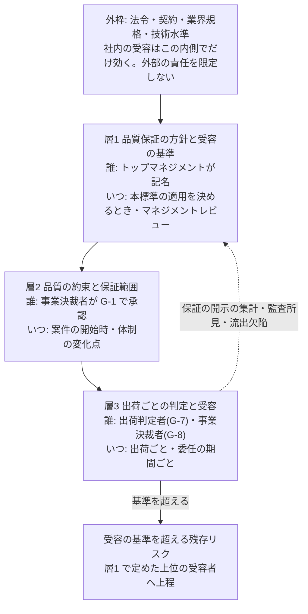

# 288 会議体 意見書01: 標準策定者(起案)

- 日付: 2026-10-03
- 立場: 規格を書く者。条文の案を出し、既存の条項・語彙・ADR との整合を重く見る
- 入力: 趣意書 `council-00-brief.md`、`research-01-japan.md`(以下「調査1」、出典記号 S1〜S24)、`research-02-international.md`(以下「調査2」、出典番号 #1〜#50)、`adoption-decision-sheet-draft.md`(以下「シート」)、ADR-0056、附属書H、第1章 1.1・1.3・1.9、第3章 3.5・3.7・3.8、第4章 G-1・G-7・G-8・欠陥トリアージ基準、第6章 テンプレ6・安全リスクアセスメント

## 結論(10行)

1. 主語を移す。**本標準は保証の主体にならない。保証を主張し責任を負うのは、本標準を適用する組織であり、その最終責任はトップマネジメントにある**。ADR-0056 の「本標準は品質を保証すると主張しない」は、この一般論を採用組織にまで広げた点が誤りだったので、置き換える(調査2 結論2、調査1 総括)
2. 最上位の主張は、JSQC-Std 00-001 1.3 の3つの動詞(確実にする・確認する・実証する)で組む。保証の相手は顧客・社会。中身は「約束の明文化」と「証拠による実証」。欠陥が無いことの約束ではない、は残す
3. 組織の合意は3層+外枠で定める。層1=トップマネジメントが導入時に記名する「品質保証の方針と残存リスクの受容の基準」(新設)。層2=案件の開始時に事業決裁者が G-1 で承認する「品質の約束と保証範囲」(既存の企画書へ欄を足す)。層3=出荷ごとの G-7・G-8(既存、受容の基準との照合を足す)。外枠=法令・契約・業界規格・技術水準。社内の受容は外部の責任を限定しない
4. 「全員の合意」は採らない。権限者の記名・責任の割り当て・全員への周知と認識・誰でも懸念を記録できる経路・品質保証の機能の独立、の5点に置き換える。基準は「最小化」ではなく「受容の基準を満たす残存リスク」
5. AI を前提にした保証の根拠は、**AI を信頼することを根拠にしない構造**に置く。QA4AI の「プロセス管理の寄与は小さい」には、(a) 本標準の対象は AI で作るソフトウェアで、機械学習の振る舞いを持つ AI プロダクトの品質は範囲外と明記する (b) 本標準が管理するのは生成の過程ではなく、成果物を AI と独立に確かめる検証の過程である、の2点で答える
6. 保証できない範囲は「保証範囲の外」と2値で宣言する(NEC の導入期が先例)。保証範囲に入る成立条件を4つ定め、満たさない変更は保証の開示へ件数で出し、組織は保証を主張しない。開示・検証・記録の価値は残る。等級は引き続き採らない
7. シートは附属書として取り込まない。採否の判定ロジックは採用者の判断であり、規格が自らの採否基準を持つと利益相反になる。5要素は層2 の様式に、Q1〜Q18 への回答は附属書D に附属書H からの投影で置く。Q16 と Q17 の一部、Q13 の事業継続は「本標準は答えを持たない」と明記する
8. 新 ADR-0057 で ADR-0056 の決定2・決定8・帰結の1行を置き換え、決定5・6 を拡張する。決定1・3(大半)・4・7・9・10 は残す。G-7 は基準9 の項目を1つ増やすだけで署名の意味は変えない。G-8 は基準2 を受容の基準との照合に改め、基準を超える残存リスクの上程先を足す

---

## 決めること1: 最上位の主張の文言

### 案

第1章 1.9 と附属書H H.1 を、次の文言へ置き換えます。

> **本標準を適用する組織は、トップマネジメントが文書で定めた品質保証の方針と残存リスクの受容の基準のもとで、宣言した保証範囲について、顧客と社会に対し、次の意味で品質を保証する。**
>
> 1. **確実にする**: 約束する品質(受入基準・出荷基準・壊してはならない条件)を、生成より前に人が定める。AI の出力を未検証の入力として扱い、その基準への適合を、作成の指示者から切り離された検証で確かめるプロセスを確立している
> 2. **確認する**: 出荷ごとに、開発ラインの外の記名の自然人が、基準の充足と記録の完備を突合する。検証が働いているかを測る。出荷後の欠陥を原因の工程へ戻し、是正する
> 3. **実証する**: 検証の独立性が成立しなかった範囲、実施しなかった検証、検出能力の実測値または未測定である事実を、保証の開示として示す。残存リスクを受容の基準に照らして記名の自然人が受け入れたことを、記録で示す
>
> この保証は、欠陥が無いことの約束ではない。保証範囲の外にある成果物について、組織は品質を保証すると主張しない。**本標準そのものは保証の主体にならない**。本標準は、適用した組織が保証を主張するための要求事項であり、その主張の拠り所である。

1.9 の見出しは「本標準を適用する組織が主張できること、主張しないこと」へ改めます。主張しないことの一覧(欠陥が無いこと、受入基準の十分性、AI の確認と人の確認の同等性、全行の精読、抜き取られなかった範囲、既存規格への適合、契約上の責任の帰結)は、**主語を組織に替えて残します**。1行を足します。

- 本標準に従って運用したことが、製造物責任・契約責任・規制上の責任を限定すること

H.1 の「『品質保証』という語の意味」は、定義の典拠を差し替えます。

- 主たる定義: JSQC-Std 00-001:2023 1.3「顧客・社会のニーズを満たすことを確実にし、確認し、実証するために、組織が行う体系的活動」(JIS Q 9027:2018 と表記の相違を除き同じ。調査1 S4)
- 併記: ISO 9000 の「確信を与えることに焦点を合わせた品質マネジメントの一部」。**ISO 9000:2015 は 2026-05-27 に廃止され、ISO 9000:2026 に置き換わった**。2026 年版の文言は二次情報でしか確かめていない(調査2 #4・#14)。JSQC は「確信を与える」を3つの動詞へ意図して広げたと明記している(調査1 S4 付録C)

### 理由

- **主語**: 調べた枠組みはすべて、主張し責任を引き受ける主体を組織に置く(調査2 結論1・横断の整理 P1、調査1 S4・S6)。同時に、規格の側は保証しない(IEEE の告知 #33系、GSN 0:3.2 #37、NIST AI RMF 1.2.2 #38)。2つを両立させる書き方は、「規格は要求事項、主張は組織」だけである。ISO 9001・ISO/IEC 42001 序文「適合する組織は責任と説明責任の証拠を生み出せる」(#41)・AIQM「自己適合宣言の拠り所」(S23)が同じ構図をとる
- **相手**: 全定義で相手は顧客・消費者・社会である(調査1 1(b))。シートの上位命題は「採用候補者へ説明できる」で内向きだが、保証の相手まで内向きにすると、ISO 9001 箇条1 の「顧客と法令の要求事項を満たす製品を一貫して提供する能力の実証」から外れる
- **3つの動詞**: 既存の H.1 の「確信の根拠4つ」と H.3 の C1〜C11 は、ほぼそのまま3つの動詞へ割り付けられる。確実にする=C1〜C5・C10、確認する=C6・C8・C9・C11、実証する=C7・保証の開示・G-8 の受容。**論証の行を作り直さずに済む**のは、最小の変更だからではなく、ADR-0056 決定1(附属書H は既存条項からの投影)を保ったまま主張を強められるからである
- **「欠陥が無いことの約束ではない」を残す理由**: 石川の定義は結果の保証を言い切るが(S2)、JSQC 1.3 注記3 は「約束を明文化し、守られていることを証拠で示す」であり、約束の中身は組織が明文化した範囲に限られる。QA4AI も「あらゆる条件における動作の正当性を将来に渡って予測すること」は不可能と書く(S22)。範囲・基準・証拠を伴う保証と、無条件の結果の保証を、文言で分けておく必要がある

### 採らない案

| 案 | 採らない理由 |
| --- | --- |
| 「本標準に従えば品質が保証される」(本標準を主語にする) | 規格は保証の主体になれない(調査2 結論2)。ADR-0056 が退けた理由(効果の測定が無い、FND-0097 の形式充足)も消えていない |
| ADR-0056 の文言を維持し、注記で「組織は保証を主張してよい」と足す | 採用組織が何を条件に、何を主張できるかが定まらない。「保証する」の文言を各組織が自由に書けば、H.8 の歯止めが働かない |
| 石川型の結果の保証(「顧客が安心して長く使える品質を保証する」) | 範囲と基準を伴わない主張になる。AI 協調開発で測定の無い結果を約束させることになる |
| 「品質説明力を持つ」(IPA S11)を最上位に置き、「保証」の語を避ける | オーナーの指摘(保証と言えないプロセスは採用されない)に答えない。IPA の4項目は層2 の様式として採る(決めること2) |
| ISO 9000 の定義だけを典拠に残す | 日本の利用者に向けた標準が、廃止済みの 2015 年版の一文で止まる理由が無い(調査1 1(c)) |

---

## 決めること2: 組織の合意と、許容できるリスクの決め方

### 案: 3層+外枠

#### 層1(新設): 品質保証の方針と残存リスクの受容の基準

置き場所は第3章に新しい節(仮に 3.15「品質保証の方針と受容の基準」)とします。条文案は次のとおりです。

| # | 要求事項 |
| --- | --- |
| 1 | 本標準を適用する組織のトップマネジメントは、本標準の適用を決める時点で、次の(a)〜(f) を文書で定め、記名する。トップマネジメントとは、組織を最高位で指揮し管理する人または人々を指す(ISO/IEC 42001 3.3、調査2 #41) |
| 2 | (a) 保証範囲の方針。組織として品質を保証する対象(製品・事業ステージ・利用者への露出)と、保証しない対象。例: S0 探索の案件は組織の保証の対象外とする |
| 3 | (b) 残存リスクの受容の基準。保証の開示に載る未達・未測定・既知の不具合を、どの条件までなら受容してよいか。**基準は外枠を下回ってはならない**。外枠とは、適用される法令、契約、業界の規格、一般に認められた技術水準を指す |
| 4 | (c) 受容の権限の段階。受容の基準の内側を誰が受容し、基準を超える残存リスクを誰が受容または拒否するか。段階は第3章 3.8.2 の決裁権限マトリクスに接続する。新しい権限体系を作らない |
| 5 | (d) 品質保証の機能の独立。品質保証の機能(第5章 5.6.3)を担う者が、開発ラインと事業決裁者を経ずに、トップマネジメントへ直接報告できる経路 |
| 6 | (e) 懸念を記録する経路。組織の管理下で働く者が、出荷に関わる懸念を記録できる経路と、記録したことを評価で不利に扱わないこと |
| 7 | (f) 見直し。(a)〜(e) をマネジメントレビューで見直す間隔と、入力。入力には、保証の開示の集計(保証範囲の外の変更の件数、未測定の継続)、内部監査の所見、流出した欠陥の検出工程、G-8 の異議の件数と扱いを含める |
| 8 | (a)〜(e) を、組織の管理下で働く者へ周知する。周知は合意を求めない。各人が自らの役割と、懸念を記録する経路を認識していることを求める |
| 9 | 事業規模に応じて (b)・(c) の実施の程度を変えてよい。ただし、外枠が求める保護の水準を、規模を理由に下げてはならない(AI Act 第17条2項の書き方。調査2 #43) |
| 10 | 既存の QMS を持つ組織は、品質方針とリスク基準の文書へ (a)〜(f) を加える形で満たしてよい。別の文書体系を作らない(第1章 1.1「既存の QMS を置き換えない」) |

記録の置き場所は D-0 体制図ではなく、組織の文書とします。D-0 は案件ごとの体制図であり、層1 は案件を横断するためです。D-0 には層1 の文書の版を参照させます(第3章 3.13 の変化点の手続と同じ扱いで、版の更新を変化点に数える)。

1名の組織では、トップマネジメントは本人です。記名は本人が行い、保証の開示の項目1 に「方針を定めた者と受容する者が同一である」と表示します(ADR-0028 の、未達を隠さず表示する方針と同じ扱い)。

#### 層2(既存の拡張): 品質の約束と保証範囲

第6章 テンプレ6(企画書)へ欄を足し、G-1 の判定基準に加えます。欄の骨格は IPA の品質説明の4項目(S11)と、シートの5要素です。

| 欄 | 内容 | 対応 |
| --- | --- | --- |
| 想定する利用者・目的・利用状況・制約 | 誰が何のためにどう使うか | IPA 1、シート Q1 の「利用条件・範囲」 |
| 壊してはならない品質条件 | 業務規則、権限、データ、安全、法令、性能。観測可能な事象で書く | IPA 2、シート Q2 |
| 保証範囲と非対象 | 層1(a) に照らした、この案件で組織が保証する範囲と、しない範囲 | シート Q1 |
| 外枠 | この案件に適用される法令・契約・業界規格 | 調査2 2(c) |

- 判定者は G-1 の事業決裁者とする。新しいゲートを置かない
- **案件ごとの論証は書かせない**(ADR-0056 決定1 を保つ)。書かせるのは約束の4欄だけで、論証は附属書H の標準の論証を使う
- 壊してはならない品質条件は、G-2 の受入基準と G-5 の検査へ降ろす。降ろせない条件は、残存リスクとして保証の開示の項目5 に出る

#### 層3(既存の拡張): 出荷ごとの判定と受容

- G-7 は変えない。署名の意味(出荷基準の充足と、記録と開示の完備の確認)を保つ。保証の開示に項目8(決めること4)を足し、基準9 で記載の完備だけを突合する
- G-8 の基準2 を「保証の開示に載った残存リスクを、層1(b) の受容の基準に照らして受容する」へ改める。**受容の基準を超える残存リスクは、事業決裁者が単独で受容しない**。層1(c) で定めた上位の受容者へ上程する。上位の受容者が受容する場合は、ISO 14971 の考え方に倣い、便益と比べた理由を書く(調査2 2.3)
- 受容を記名した事業決裁者は、保証範囲の外の変更を含む出荷を顧客へ渡すとき、その旨を伝える。既存の定型の文(H.6)の型に、保証範囲の文を1つ足す

> 本リリースの変更 47 件のうち 45 件は、組織の保証範囲の外にあります。

### 理由

- **層1 が無いと受容がその場の判断になる**: 現行の附属書H は G-8 の記名を持つが、何に照らして受容するかが無い(調査2 2(c))。ISO 14971 4.2(受容の基準をトップマネジメントが文書で定める)、NIST AI RMF MAP 1.5・GOVERN 2.3(#38)、ISO 31000 5.2(リスクの量と種類を定め、組織と利害関係者へ周知する、#15)が一致する
- **誰が**: 品質保証全般の責任は経営者・事業部長にあり(S6)、ISO 9001 5.1.1 a) は QMS の有効性の説明責任をトップマネジメントに置き、委譲できない(#1・#13)。品質保証部門は決める者ではなく、牽制する者として置く(S9、NEC の3線 S13)
- **いつ**: 3つの時点は、NEC の段階別判定者(S12、導入期=PO / 成長期=組織の品質責任者 / 普及展開期=組織長)と、AI 600-1 GV-1.3-002(配備承認の閾値を事前に定める、#39)に対応する。事前に決めることが要点である
- **外枠**: 許容の基準は「社会的に許容できる範囲」(経済産業省 S16・S17、JIS Z 8051)、「社会の現在の価値観」(IEC 61508 #25)である。製造物責任は欠陥で問われ、法令適合でも免責されない(S16・S19、PLD 2024/2853 #48)。外枠を書かないと「社内で合意した=保証した」と誤読される
- **事業規模**: オーナーの「事業規模として許容できる」は、経済産業省の「採算性から許容できないなら開発を中止」(S16)と AI Act 第17条2項(規模に比例させるが保護の水準は下げない)の形でなら書ける。規模は実施の程度を変え、外枠を変えない
- **全員の合意ではなく周知と認識**: 規格が求めるのは権限者の説明責任・責任の割り当て・周知であり(31000 5.2、RMF GOVERN 2.1)、ISO 9001:2026 7.3 は品質文化の「認識」を求める(#10)。全員参加は全員が責任者という意味ではない(調査1 2(b))
- **牽制**: 品質不正の 72% で品質保証部門の牽制が働いておらず、同調圧力が逸脱を固定化した(JSQC-TR 12-001、S9)。合意を条件にすると、合意そのものが不正の温床になる。(d)(e) はこの対策であり、既存の H.7 の注記(差し戻しや所見を悪い数字として扱う組織では示し方が成立しない)を、方針の要求へ格上げするものである
- **最小化ではない**: 基準は受容可能な残留リスクである(AI Act 第9条5項、MEASURE 2.6、RMF 1.2.3「完全に除こうとすると逆効果」)。「最小化」と書くと、達成を判定できない目標になる

### 採らない案

| 案 | 採らない理由 |
| --- | --- |
| 組織の全員の合意を保証の条件にする | 規格はどこも求めていない(調査2 P2)。合意と同調が品質不正を固定化した(S9)。全員の合意は、誰も止めない状態と区別できない |
| 受容の基準の値(件数・比率)を本標準が定める | ISO 14971・NIST AI RMF とも水準を定めない(#19・#38)。本標準も根拠となる測定を持たない。値は組織が定め、本標準は「外枠を下回らない」「事前に文書で」を定める |
| 層1 を案件ごとに D-0 で定める | 案件ごとに受容の基準が変わると、組織として保証すると言えない。案件を横断する基準でなければ層1 の意味が無い |
| 層1 の決定者を品質保証部門にする | 説明責任はトップマネジメントから委譲できない(#13)。決める者と牽制する者が同じになる |
| 層1 に第三者認証または外部の評価者を要求する | UL 4600 も独立を求めるが外部であることは求めない(#30・#31)。本標準に認証の制度は無い(H.8)。内部監査と品質保証の機能の独立(d)で置き換える |
| 案件ごとに論証(GSN 等)を書かせる | ADR-0056 が退けた理由(文書が製品を上回る)が残る。層2 は約束の4欄に限る |
| G-7 で受容の基準への適合を判定させる | 出荷判定者に十分性の判定を戻すことになり、ADR-0056 決定5 の設計(読解力を前提としない判定)を壊す。受容の基準との照合は受容する者(G-8)が行う |

---

## 決めること3: AI の関与を前提にした保証の根拠

### 案

附属書H H.1 に「AI の関与を前提にした保証の根拠」を置き、次の文を正本とします。シートの「経営・QAへの説明文」の考え方を採り、本標準の語彙へ書き直したものです。

> 本標準のもとで組織が品質を保証すると言える根拠は、AI を信頼することに置かない。AI が誤ること、担当者・モデル・提供者が交代することを前提にして、次の4つに置く。
>
> 1. 合否の基準は、生成より前に人が定める。AI の出力は未検証の入力として扱う(C2・C3)
> 2. 適合は、AI と独立な手段で確かめる。決定論的な検査と、作成を指示していない人の確認である。AI の推定による判定は、判定に数えない(C4・C5・H.4)
> 3. 確かめる手段が働いているかを測る。測っていないことは「未測定」と示す(C6・C7)
> 4. 担当者・モデル・提供者の交代を変化点として扱い、交代の後も 1〜3 が保たれることを記録で示す。AI が使えない期間は、人へ戻すか止める(C10・C11、第3章 3.12.5・3.13)

QA4AI への答えとして、次の2点を H.1 に書きます。

| 論点 | 本標準の答え |
| --- | --- |
| 対象の違い | QA4AI の「開発プロセスの管理による品質保証が寄与する割合も小さい」は、機械学習によって振る舞いが帰納的に決まる AI プロダクトについての記述である(S22)。本標準の対象は、生成 AI を実装・設計・検証に用いて作るソフトウェアである(第1章 1.2)。**機械学習モデルを組み込んだプロダクトの、モデルの品質は本標準の保証の範囲外**であり、QA4AI・AIQM 等による(1.9 の主張しないことへ加える) |
| 何を管理するか | 生成 AI の生成の過程は確率的であり、その管理で成果物の品質を保証できないという点は、QA4AI と同じ立場をとる。本標準が管理するのは**生成の過程ではなく、成果物を AI と独立に確かめる検証の過程**である。成果物(コード・設定)は決定論的に検査できるため、検証の過程の管理は保証に寄与する。ただし、プロセスの実施は製品品質の必要条件であって十分条件ではない(NEC S12)。十分性は受容の基準と残存リスクの受容(層1・層3)で扱う |

### 理由

- シート Q4「AI が誤っていても何がその誤りを発見するのか」と即時不採用条件「AI が正しいとする根拠が同じ AI の説明・テスト・レビューだけ」は、既に H.4(AI の推定による判定を判定に数えない、6つの禁止)で規範になっている。説明文は新しい要求を作らず、既存の規範を「交代を前提にする」という1つの視点で束ねる
- 交代の前提は、既存の 3.4.2(担い手の識別ごとの適合性確認と失効)、3.12.3〜3.12.6(モデル提供者の管理)、3.13(体制の変化点)に既にある。根拠4 はそれを主張の層へ引き上げるだけである
- QA4AI の指摘を「本標準には当たらない」と退けるのは誤りで、「当たる部分(生成の過程)と当たらない部分(成果物の検証)を分ける」のが正確である。分けずに書くと、AI プロダクトの品質まで保証すると読まれる
- 根拠の水準は低い。本標準の運用が欠陥の流出を減らした測定は無い(ADR-0056、H.9 問17、E0)。根拠1〜4 の各々には隣接する測定がある(H.4 の EV-0059、E1)。主張を強めても、この開示は弱めない

### 採らない案

| 案 | 採らない理由 |
| --- | --- |
| QA4AI の指摘を「本標準は従来型ソフトウェアの開発なので当たらない」と退ける | 生成の過程は確率的であり、指摘の一部は当たる。退けると、生成の過程の管理(指示資産の整備など)を保証の根拠と誤読させる |
| AI の確認の通過を保証の根拠に数える | 文脈を切り離しても注入欠陥の約 73% を見逃した測定がある(H.4)。ADR-0056 決定4 を変える理由が無い |
| 説明文をシートの文言のまま採る | 「上記Q&Aの証拠によって判定する」は採否の判定の文であり、保証の根拠の文ではない。主語と目的を本標準の主張に合わせて書き直す |

---

## 決めること4: 保証できない範囲と、その場合の扱い

### 案: 保証範囲を2値で宣言する

変更ごとに、組織の保証範囲に「入る」か「入らない」かを、保証の開示で機械的に示します。条文案です。

| # | 保証範囲に入る成立条件(すべてを満たす変更だけが入る) | 根拠 |
| --- | --- | --- |
| 1 | 層1 の方針が定められ、当該案件が層1(a) の保証の対象である | 層1 の無い組織は、組織として保証すると言えない |
| 2 | 独立した人の確認を経ている。または、第7章 7.3 の例外承認を経て、回収の期限までに独立した人が事後に確認し回収している | 「確認する」の動詞の中心。H.6「独立した人の確認の数え方」をそのまま使う |
| 3 | 出荷判定者の席と事業決裁者の席の責任者が別の自然人である | 異議の経路と受容が自己完結しない(ADR-0056 決定5) |
| 4 | 残存リスクが受容の基準の内側で受容されている。または、基準を超える残存リスクを層1(c) の上位の受容者が受容している | 層3 の受容が層1 に照らして行われている |

- 保証の開示に**項目8「組織の保証範囲」**を足す。保証範囲に入る変更と入らない変更の件数と、入らない理由(成立条件の番号ごとの件数)を示す。既存の記録からの投影であり、人に新しい記述を書かせない
- 検出能力の未測定は、成立条件にしない。項目6 で「未測定」と継続期間を示し、層1(f) のマネジメントレビューの入力にする。層1(b) の受容の基準で「未測定が N 回続いた出荷は上位の受容者へ上程する」と定めることを妨げない
- 保証範囲に入らない変更を含む出荷も、出荷してよい。止めるかどうかは層3 の受容が決める。**組織が言えることが変わるだけである**

保証範囲の外で組織が言えることは、既存の H.8 の「使ってよい表現」のままとします。「本標準の要求事項に従って運用した」「各変更について、責任者・リスク区分・経た検証・確認しなかった事項を記録から再構成できる」は、範囲の外でも言えます。言えないのは「品質を保証する」だけです。

体制ごとの帰結を、附属書H に例示します。

| 体制 | 保証範囲 | 範囲を広げる手段 |
| --- | --- | --- |
| 3名以上・G-6 成立 | 原則としてすべての変更が入る。G-6 を事後へ移した委任の変更は、事後の抜き取りが独立した人によって行われ、回収されたものだけが入る | — |
| 2名 | 相互の確認が成立した変更は条件2 を満たすが、条件3(出荷判定者と事業決裁者の分離)を満たさないため、**入らない** | 事業決裁者を組織の上位者に置く |
| 1名 | 入らない | R1 の変更を外部の確認者へ依頼し、事業決裁者を外部に置く |

### 理由

- **保証できない状態を、保証の主張から外して示すのは、日本の実務に先例がある**: NEC は導入期を「組織による品質保証: 対象外」とし、最終判定者を PO に置く(S12)。組織が保証しない段階を、組織が明示的に決めている。経済産業省の B 領域も、残留リスクを記録し使用者へ伝える(S16)
- **2値であり、等級ではない**: ADR-0056 決定6 は「保証の水準を等級で表さない。等級は『満たした』という主張として読まれる」とした。保証範囲の内外は、主張の強さの段階ではなく、主張する範囲の限定である(ISO 9001 の適用範囲、GSN の defined application と同じ型、#37)。「条件付き保証」「保証レベル2」のような中間の語を作らない
- **価値ゼロにしない**: 範囲の外でも、検証・開示・記録・受容の記名はすべて行われる。言えることが「保証する」から「実施した事実と記録から確かめられる状態」へ下がるだけで、H.8 の範囲はもともとそこまでだった。加えて、範囲を広げる具体的な手段(外部依頼、事業決裁者の分離)が表で見える。シートの「条件付き採用」「検証採用」の判定は、採用者がこの表を使って行える
- **条件を4つに絞った理由**: 3つの動詞のうち、成立しないと主張が崩れるものだけを選んだ。確実にする=条件1、確認する=条件2・3、実証する=条件4。検出能力の測定を条件にしないのは、測定を始めるまで全組織が範囲の外になり、測定の実施を目標化させるためである(H.7「値が契約の条件になると、測定は目標になる」と同じ理由)。ただし、この選定に実証は無い

:::caution[暫定(新規 EV)/ 見直し 2027-03]
**対象**: 保証範囲の成立条件4つの選定、とくに検出能力の測定を条件に入れないこと。
**根拠の水準**: E0(なし)。
**差し替え条件**: 保証範囲を宣言した組織の記録3件で、範囲に入った変更から流出した欠陥と、入らなかった変更から流出した欠陥の比率。範囲に入った変更の流出率が入らなかった変更と変わらない場合、成立条件を見直す。顧客・監査で、範囲の内外の区別に追加の条件を求められた場合は、その条件を加える。
:::

### 採らない案

| 案 | 採らない理由 |
| --- | --- |
| 保証できない状態でも「保証する」と書き、開示で補う | 開示が免罪符になる(ADR-0056 の帰結が既に指摘)。外枠の責任を負う組織に、根拠の無い主張をさせる |
| 「完全保証 / 条件付き保証 / 保証なし」の3段階 | 等級であり、ADR-0056 決定6 に反する。「条件付き」は満たしたという主張として読まれる |
| 1名・2名の体制を本標準の適用外にする | ADR-0028・ADR-0029 の方針(未達を隠さず表示する)に反する。小さな組織が開示と検証の価値を得られなくなる |
| 検出能力の測定を成立条件に入れる | 上記の理由。測定の目標化と、導入初期の全面的な範囲外を招く。継続する未測定は層1 の受容の基準で扱える |
| 保証範囲を出荷単位で判定する(1件でも外れれば出荷全体が範囲外) | 1件の未達で出荷全体の主張が消え、範囲を広げる動機が働かない。変更単位の件数で示す方が、既存の項目1・3 の数え方と揃う |

---

## 決めること5: 採用判断シートの扱い

### 案

1. **シートを附属書として取り込まない**。採否ロジック(採用可能・条件付き採用・検証採用・保留・不採用)と即時保留・不採用の条件は、本標準の規定にしない
2. **5要素(主張・範囲・根拠・証拠・限界と責任)は採る**。層2 の約束の欄(決めること2)と、附属書H H.3 の論証の列の見出しに使う。現行の H.3 の列(主張・支える条項・受け取る証跡・主張の崩れを示す観測)へ「限界と責任」の列を足す
3. **Q1〜Q18 への本標準の回答は、附属書D に置く**。附属書D の「想定問答」と同じく、附属書H からの投影とし(ADR-0056 決定9)、問いを単独で増やさない。各行は「本標準の答え・根拠の条項・根拠の水準・答えを持たない場合はその旨」とする
4. シートの出典である旨と、採否の判定は採用者が行う旨を、附属書D に書く

Q1〜Q18 と本標準の現行の範囲の対応(起案者の読み。突合の担当が条項の実在を確かめること)は次のとおりです。

| Q | 本標準の答えの所在 | 現行の範囲で答えられるか |
| --- | --- | --- |
| Q1 保証の主張と範囲 | 新 1.9、層1(a)、層2、保証範囲(決めること4) | 改訂後に答えられる |
| Q2 壊してはならない品質条件 | 層2 の欄、G-2 受入基準、欠陥トリアージ基準 | 改訂後に答えられる |
| Q3 AI の関与と権限 | 第5章(役割境界・AI自律レベル)、3.3 | 答えられる |
| Q4 AI と独立な誤りの発見 | H.4、C4・C5 | 答えられる |
| Q5 要求と証拠の対応 | C2・C3、G-5、受入基準とテストの対応 | 答えられる |
| Q6 人が確認しない部分 | H.6 項目1・3、委任 5.5.4 | 答えられる |
| Q7 見つけられない失敗 | H.2、H.11 | 答えられる |
| Q8 最終主張と受容者 | G-7・G-8、層3 | 改訂後に答えられる(受容の基準との照合) |
| Q9 出荷後の前提崩れ | C9、インシデント対応、3.13 | 一部。「止め、戻し、説明する」のうち顧客への説明の決定者は定めていない |
| Q10 投資の目的と停止・拡大基準 | G-1 基準1、B-1(中止の決定) | 答えられる |
| Q11 総費用 | G-1 基準3、第7章 7.7 の予算4区分 | 一部。検証・教育を含む総費用と便益の比較は求めていない |
| Q12 依存先の把握 | 3.12(モデル提供者)、3.11(指示資産)、3.4.2 | 一部。個人への依存と代替性の把握は求めていない |
| Q13 停止・値上げ時の縮退 | 3.12.5(切り替え・人へ戻す・止める)、3.12.6 | 一部。**事業継続計画としての縮退運転は、本標準は答えを持たない** |
| Q14 自社に残る資産 | 仕様・受入基準・テスト・指示資産をリポジトリに置く構成 | 一部。移管できることの確認は求めていない |
| Q15 生成に関与しない人の理解・変更 | G-6 の挙動要約(作成を指示していない人が説明できる) | 一部。保守性の確認は G-6 の範囲に限る |
| Q16 技術判断力の継承・後継者 | 3.4・3.4.1(任命基準と充足の確認) | **答えを持たない**。3.4.1 は全構成員への一律の教育を求めない。後継者の育成は組織の人材計画による |
| Q17 速度と品質の衝突時に誰が止めるか | G-7(出荷基準)、G-8(残存リスク)、3.12.10、7.9、層1(e) | 一部。止める者は定めている。「リスクを隠さない評価構造」は層1(e) の方針の要求までで、評価制度そのものは**答えを持たない** |
| Q18 有事の停止・切替・顧客説明 | インシデント対応、3.12.5、3.12.10 | 一部。契約変更・規制変更時の決定者は**答えを持たない**(1.9「契約上の責任の帰結」と同じ扱い) |

### 理由

- **規格が自らの採否基準を持たない**: 採否の判定は、規格の利用者が規格を評価する行為である。規格がその判定の論理まで定めると、規格が自分を採用させる基準を書くことになる。シート自身も「採用候補者が採否ロジックを自ら組み立てるため」と目的を書いている。本標準が持つべきは、問いへの答えと、答えを持たない範囲の明示である
- **5要素は規格の側の書き方として正しい**: IPA の品質説明4項目(S11)、15026・GSN の主張・文脈・論証・証拠・前提・残存する疑念(#33・#37)とほぼ重なる(調査1 3(b)、調査2 3(b))。とくに「限界と責任」は IPA に無く、シートが踏み込んだ点で(調査1 3(b))、現行の H.3 にも列として無い。採る価値がある
- **附属書D に置く理由**: ADR-0056 決定9 は、品質保証部門の問いへの回答を附属書H に置き、附属書D はそこから引くと定めた。シートの問いは採用の場面の問いであり、置き場所は導入提案書(附属書D)が合う。H.9 の 23 の問いと重なる行(Q3〜Q7 と H.9 の問2〜5・12)は、H.9 を引く
- **「答えを持たない」を明記する**: コアポリシー「書かれていないと課さないと決めたを区別する」による。Q13・Q16・Q17・Q18 の一部は、事業継続・人材・評価制度・契約の領域で、本標準の範囲(開発プロセス)の外にある。範囲を広げて答えるのではなく、範囲の外と書く

### 採らない案

| 案 | 採らない理由 |
| --- | --- |
| シートを附属書I として取り込む | 上記の利益相反。シートの出典(NIST・42001 の引用)の多くは二次的で、採否の閾値「重要項目」「許容範囲内」に定義が無い |
| 組織継続命題(Q10〜Q18)をすべて本標準で答えられるよう条項を足す | 事業継続計画・人材育成・評価制度は、開発プロセス標準の範囲を超える。足すなら、範囲そのものの変更として別の議題で調査と会議体を経るべきである |
| シートを無視する | オーナーの問いは、採用者が実際に尋ねる問いの仮説として価値がある。H.9 の EV-0058(問いが実際の問いと合っているか、E0)の差し替え条件の検証に使える |

---

## 決めること6: 既存の決定との関係

### 案: 新 ADR-0057 で置き換える

| ADR-0056 の決定 | 扱い | 内容 |
| --- | --- | --- |
| 1 附属書H は投影、案件に論証を書かせない | **残す** | 層2 の約束の4欄は論証ではない |
| 2 最上位の主張 | **置き換える** | 決めること1 の文言。主語を「適用する組織」へ |
| 3 主張しないこと | **残し、主語を替え、2行足す** | 「外部の責任を限定すること」「機械学習モデルを組み込んだプロダクトのモデルの品質」 |
| 4 AI による確認の数え方 | **残す** | 決めること3 の根拠2 の正本 |
| 5 署名の意味 | **残し、拡張する** | 出荷判定者の署名の意味は変えない。事業決裁者の受容を層1(b) の基準との照合に改め、基準を超える場合の上程を足す |
| 6 保証の開示の7項目 | **拡張する** | 項目8「組織の保証範囲」を足す。等級の禁止は残す |
| 7 形骸化の示し方 | **残す** | — |
| 8 対外的な表現 | **置き換える** | 「品質を保証する」を、条件付きで使ってよい表現へ移す。条件は、層1 の方針があること、保証範囲を同じ文書に書くこと、保証の開示を添えること。「欠陥が無いことを保証する」「承認した人間が品質を保証する」「本標準が品質を保証する」は禁止のまま |
| 9 附属書D は投影 | **残す** | シートの回答も同じ扱い |
| 10 論証を支えない検査は廃止の候補 | **残す** | — |
| 帰結「本標準は『品質を保証する』と主張しない」 | **置き換える** | 「本標準は保証の主体にならない。適用した組織が、方針・範囲・開示を伴って品質を保証すると主張する」 |
| EV-0044・EV-0045 | **残す** | 新しい主張についても、品質保証部門への説明として機能するかは未実証。差し替え条件の「最上位の主張に修正を求められた場合、決定2・3 を改める」は、今回の改訂がその発動の一例として記録する(ただし発動の契機は実在の監査ではなくオーナーの指摘であり、E0 のまま) |

H.8 の改訂案です。

| 使ってよい表現 | 条件 |
| --- | --- |
| 「当社は、(保証範囲)について、(方針の文書名)に基づき品質を保証します。範囲、検証の状況、残存リスクとその受容は、添付の保証の開示のとおりです」 | 層1 の方針がトップマネジメントの記名で存在する。保証範囲を同じ文書に書く。保証の開示(項目8 を含む)を添える。保証範囲の外の変更を含む場合は、件数を書く。文言は法務部門が確認する |

| 使ってはならない表現 | 理由 |
| --- | --- |
| 範囲を書かない「品質を保証する」 | 範囲を伴わない主張は結果の無条件の約束として読まれる |
| 「本標準が品質を保証する」「本標準に準拠しているので品質は保証されている」 | 本標準は保証の主体にならない |

第4章の変更は、次の3点に限ります。

- G-7: 保証の開示の表に項目8 を足す。基準9 の欠落の定義は変えない(項目8 の空欄は欠落、「範囲外 N 件」は値)。署名の意味は変えない
- G-8: 基準2 を「保証の開示に載った残存リスクを、層1(b) の受容の基準に照らして受容する」に改める。受容の基準を超える場合の上程(層1(c))を足す。「技術品質を蒸し返さない」は変えない
- G-1: 企画書の約束の4欄(層2)を判定基準に加える。欄の空白は機械で検査し、記述の内容は判定しない(既存の G-1 の作法)

### 突合(既存の条項・語彙・ADR との矛盾の検査)

| 対象 | 矛盾の有無 | どちらを正とするか |
| --- | --- | --- |
| 第1章 1.1「担保は欠陥が無いことの保証を意味しない」 | 無い。新しい主張も欠陥が無いことを約束しない | 1.1 を維持し、参照先を新 1.9 へ |
| 第1章 1.3「引用規格への適合性を主張しない」 | 無い。主張するのは品質の保証で、他規格への適合ではない | 1.3 を維持 |
| 第3章 3.8.4「事業決裁者の決定は技術的正しさの承認ではない」 | 無い。受容の基準との照合は事業影響の受容の範囲に留まる | 3.8.4 を維持 |
| 第3章 3.5 兼務禁止(出荷判定者×事業決裁者) | 無い。決めること4 の条件3 はこれを保証範囲の条件へ接続する | 3.5 を維持 |
| ADR-0028(未達と省略の区別) | 無い。保証範囲の外は省略ではなく、成立しなかった事実の表示 | ADR-0028 を維持 |
| ADR-0056 決定6「等級で表さない」 | **緊張がある**。保証範囲の2値が等級と読まれるおそれ | ADR-0056 を正とし、2値に留め、中間の語を作らないことを ADR-0057 に明記する |
| ADR-0056 決定1「新しい様式を足さない」系の方針 | **緊張がある**。層1 は新しい文書を要する | 層1 は既存の品質方針への追記で満たせるとし(層1 要求事項10)、様式を第6章に置かない。ただし QMS を持たない組織では新しい文書になる。信頼性の観点から、受容の基準を事前に文書で持たない保証は成立しないため、追加を正とする |
| 第6章 安全リスクアセスメント「SR2 以上の残留リスクの受容は R1 の決定」(ADR-0011) | 無い。層1(c) の受容の権限の段階は 3.8.2 に接続し、SR の受容もその一部になる | ADR-0011 を維持し、層1(c) から参照する |
| H.9 問16「契約上・賠償上の責任には答えを持たない」 | 無い。新しい主張は外部責任を限定しないと明記し、答えを持たない立場を保つ | H.9 を維持 |
| H.10 の ISO 9001:2015 の箇条番号 | 版が古い。ISO 9001:2026 は 2026-09-16 発行(#2・#6) | H.10 の注記を更新し、5.1.1(トップマネジメントの説明責任)と 6.1(リスク)の行を足す。層1 がそれらに対応する。2026 年版の本文は未確認と注記する |

### 理由

- 採用済み ADR の本文は書き換えない規則(CLAUDE.md)により、新 ADR で置き換える。置き換えの範囲を決定の番号で示すと、ADR-0056 のどこが生きているかを読み手が辿れる
- G-7 の署名の意味を変えないのは、ADR-0056 が出した最も重要な結論(出荷判定者に十分性を判定させず、受容を事業決裁者の記名に置く)が、今回の調査でも ISO 9001 8.6(記名の個人によるリリースの承認と追跡、#11・#12)、AMED(最終承認者の文書化、S20)と整合したからである。層1 は、その記名に「何に照らして」を与えるだけである

### 採らない案

| 案 | 採らない理由 |
| --- | --- |
| ADR-0056 を全面的に廃止し、新 ADR で書き直す | 決定4・5・6・7 は今回の調査でも支持されている。全面の置き換えは、生きている決定の根拠の追跡を切る |
| ADR-0056 を維持し、附属書H に「組織は保証を主張してよい」の注記だけを足す | 主張の条件(層1・保証範囲)が定まらず、H.8 の禁止と注記が食い違う |
| G-7 の出荷判定者に保証範囲の判定をさせる | 保証範囲は機械で導ける成立条件だけで決まる。人の判定を足すと、十分性の判定が G-7 に戻る |

---

## 会議体への申し送り(起案者が自分の案に残す疑問)

1. **層1 の「トップマネジメント」は、本標準の語彙に無い**。第3章のロール(事業決裁者・B-1 の投資決裁者)との関係を定める必要がある。起案者は「組織の最高位の指揮者で、ロールではなく組織の機関」と置いたが、B-1 の決定者をトップマネジメントの代行とみなす案もありうる。品質保証の立場と現場の立場の意見を求める
2. **2名体制が保証範囲に入らない帰結は厳しい**。2名の組織では、事業決裁者を外部に置かない限り、組織として保証すると言えない。これは条件3 の帰結で、起案者は「受容の自己完結は保証にならない」を正としたが、小規模の受託組織の採用を妨げる可能性がある。現場の立場の意見を求める
3. **保証範囲の成立条件は E0**。とくに検出能力の測定を外した判断は、品質保証の立場から反対がありうる
4. 層1(e)「懸念を記録したことを評価で不利に扱わない」は、評価制度に踏み込む規定である。採るか、方針の「宣言」に留めるかを議論したい
5. ISO 9001:2026・ISO 9000:2026 の本文を誰も読んでいない。H.1・H.10 の引用を確定させる前に、公開プレビューで 5.1.1・6.1・8.6 の文言を確かめる必要がある(reading-standard-pdfs の手順による)
