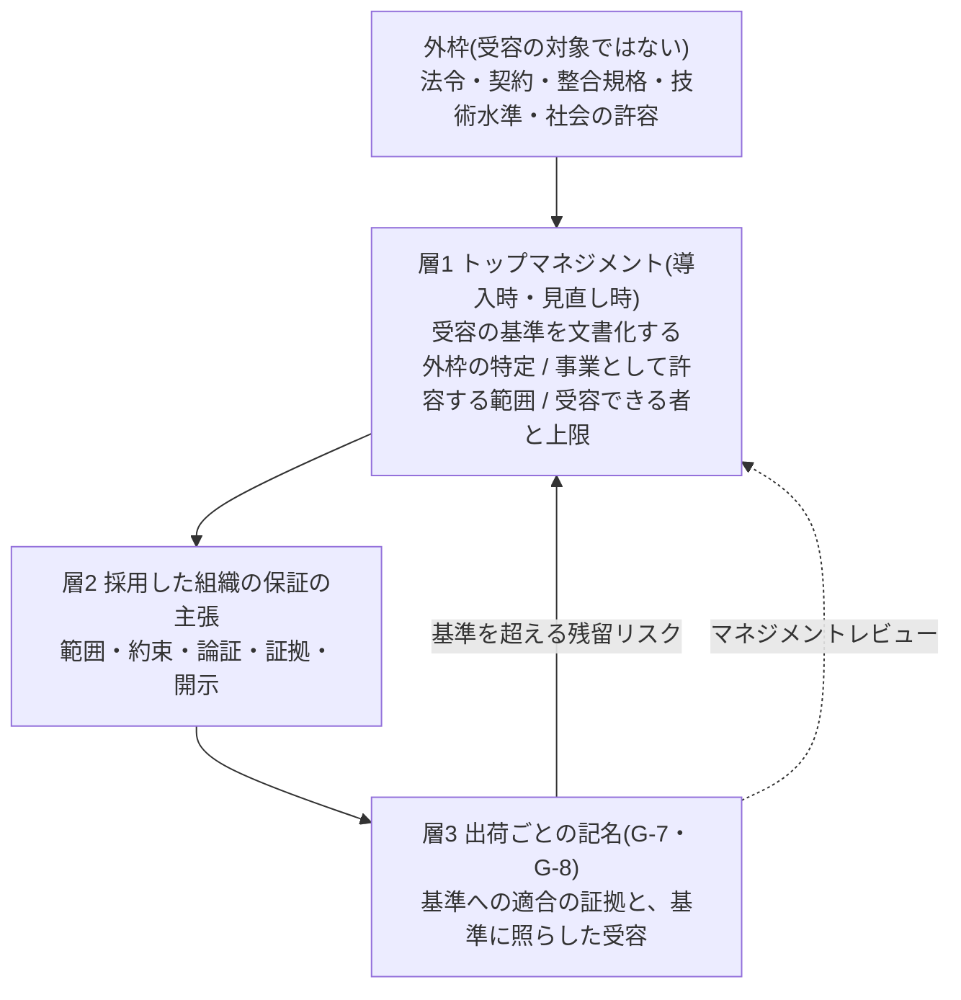

# 288 会議体 意見書03 — 規格・法務の立場(製造物責任、規制、適合性評価)

- 作成日: 2026-10-03
- 立場: 規格・法務。「組織として品質を保証する」と標準に書かせたとき、それが法的・規格上どういう意味を持つか。どう書けば正確で、どう書けば危険か
- 入力: 趣意書 `council-00-brief.md`、`research-01-japan.md`(以下「調査01」)、`research-02-international.md`(以下「調査02」)、`adoption-decision-sheet-draft.md`(以下「シート」)、ADR-0056、附属書H、第1章 1.3・1.9
- 本書は法的助言ではない。法令の効果について述べた箇所は、標準の書き方を決めるための見立てであり、各組織の法務部門の確認を前提とする

## 結論(10行)

1. 「保証する」と書いてよい。**危険なのは語ではなく、主語・相手・範囲・証拠の欠けた「保証」である**。規格は保証しない(GSN 0:3.2、IEEE の告知)。採った組織が主張し、責任を引き受ける(ISO 9001 箇条1、EU AI Act 第47条4項、Blue Guide)。
2. 「保証」には3つの意味がある。**確信の根拠を示す品質保証(assurance)、契約上の担保(warranty)、結果の約束(guarantee)** である。標準が定めるのは第1の意味に限る。第2・第3を生む書き方を、使ってはならない表現として残す。
3. 最上位の主張は、**採用した組織を主語にした、範囲付きの保証の主張**にする。形は ISO/IEC/IEEE 15026 の主張・論証・証拠・前提に、JSQC の3つの動詞(確実にする・確認する・実証する)を当てる。現行 H.1 の工程の主張は、その下の「検証の主張」として残す。
4. 受容の基準は、トップマネジメントが導入時に文書で定める(層1)。**外枠(法令・契約・整合規格・技術水準・社会の許容)は、受容できるリスクの対象ではなく、前提条件である**。法令の不充足は、誰も「受容」できない。
5. 「全員の合意」は条項にしない。権限者の決定・周知・異議の経路・独立した牽制の4つに置き換える。事業規模への比例は AI Act 第17条2項の書き方(実施の程度は比例させ、保護の水準は下げない)に倣う。
6. **社内の受容は外部の責任を限定しない**、と本文に明記する。製造物責任は欠陥で問われる(製造物責任法、指令 2024/2853 は無過失責任)。記録が効くのは、過失責任の場面での注意義務の立証と、開示請求への応答である。記録の法的な効き目は未検証で、根拠水準マークを付ける。
7. AI の関与は責任を動かさない。「AI が生成した」は抗弁にならない。だから保証の根拠は AI の正しさではなく、**AI から独立した検証、測った検出能力、開示、記名の受容**に置く。QA4AI の「プロセス管理の寄与は小さい」は、機械学習を含む製品についての指摘である。そうした製品の振る舞いの保証は本標準の範囲外と明記する。
8. 保証の主張を立てられない状態を、要件として定める。その状態では、組織は「保証の主張を立てない」と明示する。そのうえで実施の記録を開示する(現行 H.8 の水準)。この格下げの受容は、層1 の基準を定めた権限者が記名する。
9. シートは、要求事項ではない附属書(手引き)として取り込む。本標準の「回答」は、組織ごとの回答の**出所の表**として持つ。Q10・Q11・Q14〜Q16 と Q13・Q18 の一部は、本標準は答えないと明記する。
10. ADR-0056 は、決定2・3・8 と帰結「品質を保証すると主張しない」を新 ADR で置き換える。決定4〜7・9・10 は残す。G-8 は改める。受容を「層1 の基準に照らして」行い、基準を超える受容は基準の決定者へ上げる。G-7 は変えない。

---

## 0. 前提の整理: 「保証」の3つの意味と、それぞれの法的な帰結

「保証する」を避けるか使うかを議論する前に、語の意味を分けます。会議体の議論が噛み合わない原因の多くは、ここが混ざることにあると見ます。

| 意味 | 英語 | 中身 | 誰に対し、どんな責任を生むか | 本標準での扱い |
| --- | --- | --- | --- | --- |
| A. 品質保証の主張 | assurance | 要求事項が満たされるという確信の根拠を、証拠と論証で示す。範囲と前提を伴う(ISO 9000 の定義、15026、GSN) | 主張の正確さに責任を負う。表示が根拠を欠けば誤認表示の問題になる(後述 0.3) | **標準が定める** |
| B. 契約上の担保 | warranty | 「仕様に適合する」「一定期間不具合を無償で直す」などの契約条項。契約不適合責任を超える義務を約すことがある | 契約の相手方に、条項の範囲で責任を負う | **標準は定めない**。契約と法務の領分 |
| C. 結果の約束 | guarantee | 無欠陥、完全、100% など、結果そのものを約す | 結果が外れた時点で約束違反になる | **使ってはならない** |

現行の附属書H は、A を言うと B・C と読まれる危険を理由に、A まで捨てました(H.8「結果の約束になる」)。調査01 の結論1 と調査02 の結論2 が示すとおり、これは主語の取り違えでした。正しい処置は、**A を言い、B と C を生む書き方を禁じる**ことです。

### 0.1 規制自身が「結果の義務」と「手段の義務」を区別している

EU AI Act 第4条(AI リテラシー)は、Digital Omnibus(Regulation (EU) 2026/1744、2026-07-27 発効)で改められました。元の「十分な水準を確保する」(結果に近い義務)が、「発達を支える措置をとる」(手段の義務)へ変わりました。改正後の条文は「個人に特定の水準を保証することを求めない」と明記しています(欧州委員会 FAQ、出典 X3)。

本標準にとっての含意は2つです。

- 規制当局も、組織に課す義務を「結果」と「手段」で書き分ける。品質保証の主張も同じ区別で書ける。**本標準の保証の主張は、手段(統制の実施)と、事前に定めた個別の結果(受入基準への適合の検証)についての主張であり、無欠陥という結果の主張ではない**
- 第4条は高リスクに限らず、AI システムの提供者と導入者(deployer)のすべてに掛かる。開発に AI を使う組織は導入者に当たりうる。本標準を採る組織の多くが、この義務の対象になる(後述 3.4)

### 0.2 製造物責任と契約責任: 記録が効く場面と効かない場面

| 責任の類型 | 判断の基準 | 組織の記録・社内の受容が効くか |
| --- | --- | --- |
| 製造物責任(日本: 製造物責任法。EU: 指令 2024/2853) | **欠陥**(通常有すべき安全性を欠くこと)。過失を問わない | 社内の受容は抗弁にならない(調査01 S16・S19、調査02 5)。日本法ではソフトウェア単体は対象外だが、組み込んだ製造物は対象になりうる(調査01 S19)。EU 指令はソフトウェアと AI を含み、2026-12-09 以降に市場へ出す製品に適用される(調査02 5)。開発危険の抗弁は、引渡し時点の科学・技術知識の水準の問題である。自組織のプロセスの遵守では立たない |
| 不法行為(民法709条)・債務不履行(民法415条) | 過失・帰責事由 | 効きうる。業界の標準に沿った手順と記録は、注意義務を尽くしたことの立証材料になる。決定的ではない |
| 請負の契約不適合責任(民法562条以下を559条で準用、636条・637条) | 契約の内容に適合しないこと。過失を問わない | 適合の有無が争点になる。記録は「何を合意し、何を確かめたか」の証拠になる。社内の受容は相手方に対抗できない |
| 準委任の善管注意義務(民法644条) | 注意義務を尽くしたか | 効きうる。記録は注意義務の履行の証拠になる |
| EU 指令 2024/2853 の開示 | 被告が証拠を開示しない場合などに、欠陥と因果関係が推定される(調査02 5、Gibson Dunn) | 記録は、推定を避けるための開示の材料になる |

**含意**: 本標準の記録(保証の開示、G-8 の決断の記録)が法的に効くのは、過失責任の場面と開示の場面です。無過失責任の場面では、社内の受容は責任を減らしません。標準はこの区別を本文に書くべきです。書かないと、「社内で合意した=保証した=責任を果たした」という誤読を招きます(調査02 5(c))。記録の法的な効き目は、本会議体では検証していません。根拠水準マーク(E0)の対象です。

### 0.3 対外の「品質保証」表示は、根拠を求められる

- 一般消費者向けの表示では、景品表示法第5条第1号(優良誤認表示)が掛かる。同法第7条第2項により、消費者庁長官は表示の裏付けとなる合理的な根拠を示す資料の提出を求められる。期間は原則15日である(同法施行規則)。提出しない場合、または根拠と認められない場合は、措置命令との関係で優良誤認表示とみなされる(出典 X1・X2)
- 事業者間の取引でも、品質を誤認させる表示は不正競争防止法(第2条第1項第20号、品質等誤認惹起行為)の問題になりうる(出典 X4)

**含意**: 「品質を保証する」と外へ書くなら、根拠資料は表示の前に揃っている必要があります。これは本標準の構造(主張・範囲・証拠・開示)とそのまま重なります。**保証の開示を伴わない「品質保証」の表示は、根拠を示せない表示になりうる**。この点が、範囲と証拠を伴わない「保証」を禁じる法的な理由です。資料の「合理性」は表示内容との対応で判断されます(出典 X2)。限定された範囲で確かめたことを、広い範囲の保証として書くと、対応を欠きます。範囲の明記が必須になる理由もここにあります。

---

## 1. 最上位の主張の文言

### 案

主張を2段にします。上段は組織の保証の主張、下段は現行 H.1 の検証の主張です。

**上段: 組織の保証の主張(採用した組織が作成者)**

> [組織名]は、[範囲: 製品・リリース・利用条件・期間]について、[顧客・社会との約束: 文書化した品質の要求事項。適用される法令・契約の要求事項を含む]が満たされることを、次の活動によって保証する。
> - 確実にする: 合否の基準を生成より前に人が定め、AI から独立した検証の仕組みを確立している
> - 確認する: 出荷ごとに基準への適合を検証し、検証の検出能力を測り、外れたら是正している
> - 実証する: 検証の記録と、確かめていない範囲を、保証の開示として示している
>
> 残留リスクは、トップマネジメントが定めた受容の基準([版])に照らして、記名の責任者が受容した。この保証の主張の最終責任は、[組織名]のトップマネジメントが負う。

**下段: 検証の主張(現行 H.1 を維持)**

> 出荷した変更は、事前に人が合意した受入基準への適合を、作成の指示者から切り離された検証によって確かめている。(以下、現行 H.1 のとおり)

**本標準自身の立場(第1章 1.9 を置き換える)**

> 本標準は、それ自体として品質を保証しない。本標準は、採用した組織が品質保証を主張するための要求事項である。保証を主張し、その責任を負うのは、採用した組織である。

### 要素ごとの根拠

| 要素 | 書き方 | 根拠 |
| --- | --- | --- |
| 主語 | 採用した組織(法人名)。最終責任はトップマネジメント | ISO 9001 5.1.1 a)(有効性の説明責任)、ISO 31000 5.2、ISO/IEC 42001 序文、NIST AI RMF GOVERN 2.3、AI Act 第17条1項(m)(調査02 1・2・4)。JSQC-Std 00-001 1.3「組織が行う」(調査01 S4) |
| 相手 | 顧客・社会。内部(トップマネジメント・品質保証部門)は内部の品質保証の相手 | JSQC 1.3 注記3、ISO の解説「組織の内外へ確信を与える」(調査01 S4、調査02 1) |
| 中身 | 確実にする・確認する・実証する | JSQC 1.3。「確信を与える」を3つに広げたと JSQC 自身が明記する(調査01 S4) |
| 範囲 | 製品・リリース・利用条件・期間を必須とする | GSN 0:2.2「defined application in a defined environment」(調査02 3)、IPA 品質説明の項目1(調査01 S11)、景品表示法の根拠資料は表示内容との対応で判断される(出典 X2) |
| 約束の中身 | 文書化した要求事項。**法令・契約の要求事項を含む** | ISO 9001 箇条1「customer and applicable statutory and regulatory requirements」(調査02 1) |
| 受容 | 層1 の基準(版を指定)に照らした記名の受容 | ISO 14971 4.2、ISO 9001 8.6(調査02 1・2) |
| 主張の十分性 | 読み手が判断する。組織は異議を受けられる形で示す | GSN 0:3.2(調査02 3) |

**15026 との整合**: 15026-2 は保証の論証の構造だけを定め、中身の質を定めません(調査02 3)。上段の主張は最上位の主張に当たり、範囲は文脈に、受容の基準は論証の外から持ち込む前提に当たります。下段は、上段を支える下位の主張です。これにより附属書H は、15026 の構造に沿った「主張の型」になります。ただし、本標準は 15026 への適合を主張しません。2025 年版の本文は未読です(調査02 3)。

**ISO 9001:2026 との整合**: 2026 年版は 5.1.1 に品質文化と倫理的行動の推進を加え、7.3 で全員の認識を求めます(調査02 1)。上段の主張の「最終責任はトップマネジメント」は 5.1.1 a) と一致します。2026 年版 5.1.1・7.3 の発行本文は未読です。解説での確認に留まります。

### 採らない案

| 案 | 採らない理由 |
| --- | --- |
| 「本標準に従えば品質が保証される」(標準を主語にする) | 規格は保証しない(GSN 0:3.2、IEEE の告知)。標準を主語にすると、採用した組織が責任を標準へ転嫁する書き方になる。標準の作成者が、採用組織の製品の結果の約束をしたと読まれる |
| 現行のまま「品質を保証すると主張しない」 | ISO 9001 箇条1 が想定する「能力を実証する組織」の像と合わない。日本の系譜(石川、旧 JIS Z 8101、JSQC、JIS Q 9027)とも合わない(調査01 総括)。採用した組織が保証を主張する形を示さないと、組織は根拠の無い「品質保証」を独自に書く。そのほうが法的に危険である |
| 範囲を書かない「当社は品質を保証します」 | 根拠資料と表示の対応が取れない(0.3)。C(結果の約束)として読まれる |
| 「組織で合意したことをもって保証とする」(シート・オーナーの見方そのまま) | 相手が内向きになる。外部の責任に効かない(0.2)。合意は品質不正の温床になった(調査01 S9) |
| 「品質保証」の語を避け「品質説明」とする | IPA の品質説明力は有用な骨格だが(調査01 S11)、語を替えると採用の場(稟議・QMS)で通じない。オーナーの問題提起(「保証すると言えないプロセスは採用されない」)にも応えない。語は「品質保証」を使い、意味を定義で固定する |

### 用語の定義(第1章 1.4 へ追加する案)

- **品質保証の主張**: 採用した組織が、範囲を定めて、品質の要求事項が満たされるという確信の根拠を、証拠・論証・開示とともに示し、その責任を引き受けること。契約上の担保と、結果の約束を含まない
- **受容の基準**: トップマネジメントが事前に文書で定める、残留リスクを受容してよい条件と、受容できる者の範囲。外枠を前提とする
- **外枠**: 受容の基準の前提となる、適用される法令、契約の要求事項、整合規格、技術水準、利害関係者の期待と社会の許容。組織の受容の対象ではない

---

## 2. 組織の合意と、許容できるリスクの決め方

### 案: 外枠と3つの層

| 誰が | いつ | 何を | 根拠 |
| --- | --- | --- | --- |
| トップマネジメント | 導入時。体制の変化点。マネジメントレビュー(定めた間隔) | 層1 の受容の基準を文書化し、版を付ける。中身は (a) 外枠のうち、組織に適用されるものの特定 (b) 外枠の内側で事業として許容する範囲 (c) 受容できる者と、その者が受容できる上限(リスク区分・安全重要度ごと)(d) 上限を超える場合の上げ先 | ISO 14971 4.2、ISO 31000 5.2・6.3.4、NIST AI RMF MAP 1.5・GOVERN 1.3、ISO/IEC 42001 6.1.1(調査02 2・4) |
| 事業決裁者(G-8) | 出荷ごと | 層1 の基準(版を指定)に照らして、開示された残留リスクを受容する。上限を超えるものは受容せず、層1 の決定者へ上げる | ISO 9001 8.6、NIST AI 600-1 GV-1.3-002(調査02 1・4) |
| 品質保証の機能(出荷判定者・内部監査) | 出荷ごと・四半期 | 独立した牽制。G-7 の突合、G-8 への異議、内部監査 | JSQC-TR 12-001(調査01 S9)、UL 4600 の独立した評価者、ISO 26262 の確認方策(調査02 2) |
| 全構成員 | 導入時と改訂時に周知を受ける | 受容の基準と、自分の役割、異議の経路を知る | ISO 31000 5.2「組織と利害関係者へ周知」、ISO 9001:2026 7.3(調査02 1・2) |
| 案件の責任者 | 案件の開始時 | 当該案件に掛かる外枠(業法、契約、安全重要度)を特定し、層1 のどの上限が掛かるかを記録する | NIST AI RMF 1.2.2「既存の規制と指針に従い、無い場合に組織が定める」(調査02 4) |

### 法務から見た要点

1. **外枠は受容の対象ではない**。「法令に適合しないリスクを事業決裁者が受容した」という記録は、受容ではなく、違反の自認になる。標準は、外枠の不充足を「残留リスク」として G-8 の受容の対象に載せることを禁じるべきである。外枠の不充足が判明した場合の扱いは、出荷の停止か、外枠の内側に入れる設計の変更である(経済産業省の「開発を中止して異なる開発コンセプトを考える」、調査01 S16)
2. **順序を逆にしない**。経済産業省は、社会的に許容できる範囲が先にあり、事業の採算はその範囲に入れられるかの判断に効くと書く(調査01 S16・4(c))。「自社として・事業規模として許容できる」は、外枠の内側の第二段として書く
3. **事業規模への比例**: AI Act 第17条2項の書き方を採る。「実施の程度は組織の規模に比例させてよい。ただし、要求される厳格さと保護の水準は下げない」(調査02 4)。1名体制が統制を省けるのは、手続の重さであって、外へ約束する品質の水準ではない
4. **「全員の合意」は条項にしない**。規格が求めるのは、権限者の決定、責任の割り当て、周知、関与である(ISO 31000 5.2、NIST AI RMF GOVERN 2.1、調査02 6 の P2)。全員の合意を要件にすると、(a) 誰も受容者でなくなる(責任の希釈。調査01 2(c))(b) 同調圧力が品質不正を固定化した構図を再生産する(調査01 S9 で 18件中13組織)。オーナーの「組織に所属するあらゆる人がそれでリスクを最小化できている」の正しい核は、**全員が基準を知り、異議を出せ、異議が記録に残る**ことだと読む
5. **独立した牽制の置き方**: 異議の経路(ADR-0056 決定5)を、出荷判定者だけでなく全構成員へ開く。ただし、出荷を止める権限は増やさない。止める権限は G-7(出荷基準)と G-8(残留リスク)に置いたままにする。内部通報の制度(公益通報者保護法)と混ぜない。品質の異議は業務の記録として残す
6. **「最小化」と書かない**。基準は受容可能な残留リスクである(AI Act 第9条5項、NIST AI RMF 1.2.3・MEASURE 2.6、調査02 6 の P4)。「最小化した」と書くと、残った欠陥はすべて「最小化を怠った」証拠と読まれうる。対外文書では特に避ける。低減の方針(ALARP 等)を採るかは層1 で組織が選ぶ

### 採らない案

| 案 | 採らない理由 |
| --- | --- |
| 全員の合意を保証の要件にする | 規格の要求ではない。責任を希釈し、同調を固定する(上記4) |
| 受容の基準を本標準が数値で定める | ISO 14971・NIST AI RMF・UL 4600 はいずれも水準を定めない(調査02 2・4)。製品と利用状況に依る。標準が値を定めると、その値が外枠の代わりに読まれる |
| 受容の基準を案件ごとに定める(層1 を置かない) | 基準の無い受容は、その場の判断になる(調査02 2(c))。事業決裁者が自分の出荷のために基準を作る構成は、受容が自己完結する |
| 品質保証部門に受容の権限を持たせる | 受容は事業の判断であり、事業の責任者が負う(ISO 31000 5.2、AMED の最終承認者、調査01 S20)。品質保証部門は牽制と異議の側に置く。現行 H.5 の分担を維持する |
| 1名体制では層1 を省いてよいとする | 省くと、外枠の特定が無いまま出荷する。1名でも、自分が何を受容するかの基準は書ける。手続は軽くしてよい(AI Act 第17条2項) |

---

## 3. AI の関与を前提にした保証の根拠

### 案

保証の根拠を、AI の正しさに置かない。シートの経営・QA への説明文の考え方(「AI を信用することを採用条件としない」)を、法務の観点から補強して採る。

> 本標準を採用した組織は、AI が誤ること、担当者・モデル・ベンダーが交代することを前提にしている。保証の根拠は AI の出力の正しさではなく、(1) 人が事前に定めた合否の基準 (2) AI から独立した決定論的な検証と、作成の指示者から独立した人の確認 (3) 測った検出能力 (4) 確かめていない範囲の開示 (5) 基準に照らした記名の受容、の5つに置く。AI を使ったことは、組織の責任を減らさない。

### 理由

1. **AI の関与は、法的な責任の所在を動かさない**。製造物責任は製造者に掛かり、AI ベンダーの関与は製造者の責任を免れさせない。変更を加えた者が変更後の製品の適合に責任を負う(Blue Guide 2.1、調査02 5)。AI による変更でも同じである。AI ベンダーの利用規約は、通常、出力の正確さについて責任を限定している(一般的な実務の観察。個別の規約は本会議体で確認していない)。したがって、**組織が保証の主張をするなら、根拠は組織が統制できるもの(基準、検証、測定、開示、受容)に置くしかない**。これは附属書H の C1〜C11 の構成と一致する
2. **ベンダー・モデルの交代は、供給者管理の問題として扱う**。ISO 9001 8.4 の外部提供者の管理に当たる(附属書H H.10)。保証の主張の範囲には「生成の条件」(保証の開示 項目7)を含める。交代で前提が崩れたら、範囲の主張を更新する。出荷済みの成果物の保証は、検証の記録に依る(H.9 問9)
3. **QA4AI の指摘への答え**: QA4AI の「開発プロセスの管理による品質保証が寄与する割合も小さい」は、「機械学習ではデータの学習によりふるまいが帰納的に決定される」ことを理由にしている(調査01 S22)。本標準が主に扱うのは、AI が書いた**通常のソフトウェア**である。その成果物はコードとして決定論的に検証できる。したがって、プロセス管理(とりわけ独立した検証)の寄与は、機械学習製品の場合より大きいと考えられる。ただし、この区別は本書の推論であり、測定ではない。一方、**機械学習の要素を含む製品の振る舞いの保証**は、本標準の範囲外と明記する。そうした製品は、AIQM(産総研)・QA4AI を外枠の一部として層1 で特定させる
4. **AI リテラシーの義務**: EU 市場に関わる組織では、AI Act 第4条により、AI システムの提供者と導入者は職員の AI リテラシーの発達を支える措置をとる(2026-07-27 の改正後。出典 X3)。開発に AI を使う組織は導入者に当たりうる。本標準の任命基準と力量の確認(第3章 3.4・3.4.1)は、この義務の履行の材料になりうる。ただし、本標準の採用で第4条を満たすとは書かない
5. **AI Act の提供者の義務との関係**: AI Act の高リスクの義務(第9条・第16条・第17条)は、**製品そのものが高リスク AI システムである場合**に掛かる。AI を使って書いた通常のソフトウェアには掛からない。本標準は AI Act への適合を主張しない。製品が高リスク AI システムに当たる組織では、第17条の QMS と第47条の EU 適合宣言が外枠になる。第17条1項(m)の説明責任の枠組みと、第17条2項の比例原則は、本標準の層1 の書き方の参照にとどめる
6. **サイバーセキュリティの外枠**: EU のサイバーレジリエンス法(Regulation (EU) 2024/2847)は、デジタル要素を持つ製品の製造者に、脆弱性と重大インシデントの報告義務を 2026-09-11 から課し、本則を 2027-12-11 から適用する(出典 X5)。EU 市場へソフトウェア製品を出す組織では、これが外枠になる。保証の主張の範囲に含めるかは、組織が層1 で決める。本標準は CRA への適合を主張しない

### 採らない案

| 案 | 採らない理由 |
| --- | --- |
| AI の精度・ベンチマークを保証の根拠にする | 担い手の交代で失効する。組織が統制できない。現行 H.4 の「AI の推定による判定は判定に数えない」と矛盾する |
| AI ベンダーとの契約で責任を移すことを保証の根拠にする | 製造物責任は被害者に対して製造者が負う(調査02 5)。求償の取り決めは、被害者に対する責任を減らさない。責任分担の契約(QA4AI CE-7)は推奨するが、保証の根拠にはしない |
| QA4AI の指摘を理由に、AI の関与があれば保証を主張しない | 通常のソフトウェアと機械学習製品を混同している(上記3)。保証の根拠を独立した検証に置けば、AI の関与があっても主張は立つ |
| 「AI を使っているが人が全件確認したので保証する」と書く | 全行の精読は主張しない(H.2)。精読の実態を示せない主張は、根拠資料を欠く表示になる(0.3) |

---

## 4. 保証できない範囲と、その場合の扱い

### 案: 「保証の主張を立てない」を正規の状態として定める

保証の主張(1. の上段)を立てるための最低条件を、標準が要件として定めます。条件を欠く出荷では、組織は保証の主張を立てず、その旨を明示します。

**保証の主張を立てる条件(すべてを満たす)**

1. 層1 の受容の基準が文書化され、版が付いている
2. 当該案件に掛かる外枠が特定され、記録されている
3. 保証の開示(7項目)に記載の欠落が無い(G-7 基準9)
4. G-8 の受容が、層1 の基準(版)に照らして記名されている。出荷判定者の異議の記載がある
5. 独立した人の確認を経ていない R1 の変更が無い。あるなら、層1 で定めた権限者の例外承認がある
6. 外枠の不充足が判明していない

**条件を欠く場合に組織が言うこと**

> 本リリースについて、当社は品質保証の主張を立てていません。理由: [欠けた条件]。実施した検証と、確かめていない範囲は、添付の開示のとおりです。

- この状態でも、現行 H.8 の「使ってよい表現」(実施した事実と、記録から確かめられる状態)は使える。**プロセスの価値はゼロにならない**。検証の記録、開示、記名の受容は残り、過失責任の場面での注意義務の立証と、開示請求への応答の材料になる(0.2。効き目は未検証)
- 保証の主張を立てずに出荷することの受容は、事業決裁者ではなく、**層1 の基準を定めた権限者(またはその者が層1 で指名した者)が記名する**。理由は、保証の主張の可否は組織の対外的な約束の問題で、出荷ごとの事業判断を超えるからである
- NEC は導入期の製品を「組織による品質保証: 対象外」とし、最終判定者をプロダクトオーナーに置く(調査01 S12)。組織が保証しない段階を組織が明示的に決める先例であり、本案と同じ構造である
- **1名体制の扱い**: 1名体制では、条件5 は外部の確認者を R1 へ集中させれば満たせる(H.6 の表示の例)。条件4 の異議と受容は同一人物になる。この場合は保証の主張を禁じない。ただし、保証の開示の項目1 に「異議を書く者と、残存リスクを受容する者が同一である」が出る。読み手(顧客)がそれを見て主張の十分性を判断する(GSN 0:3.2)。**禁止ではなく、開示で読み手へ判断を渡す**。ADR-0028(未達と省略の区別)と整合する
- 条件を欠く状態が続く場合(例: 検出能力の未測定が続く)は、内部監査の抽出条件で拾う。現行の構造をそのまま使う

### 法務から見た要点

- 「保証できない」と言うことは、責任を減らさない。製造物責任と契約責任は、保証の主張の有無と関係なく掛かる。標準に「保証の主張を立てない場合も、法令と契約に基づく責任は変わらない」と明記する
- 逆に、条件を満たさないのに「品質保証」と表示することが、最も危険な状態である(0.3)。標準が条件を定める意味は、組織が根拠の無い表示を避けられるようにすることにある

### 採らない案

| 案 | 採らない理由 |
| --- | --- |
| 条件を欠く出荷を禁じる | 1名体制と初期段階の採用を閉ざす。ADR-0028 の方針(未達を隠さず表示する)に反する。NEC の先例のとおり、組織が保証しない段階を明示することは正当である |
| 条件を欠いても「条件付きで保証する」と書かせる | 「条件付き保証」は契約上の担保(B)と読まれやすい。条件の中身が読み手へ伝わらない。主張を立てるか立てないかの2値にし、立てない場合は開示で示す |
| 保証の水準を等級で示す(「保証レベル2」など) | ADR-0056 が退けた理由(境界に実証が無い、等級が目標になる)はそのまま当てはまる。加えて、等級は対外表示で優良誤認の材料になる |

---

## 5. 採用判断シートの扱い

### 案

1. **取り込みの形**: 要求事項ではない附属書(手引き)として取り込む。CLAUDE.md の「要求事項ではなく手引きとして書かれた附属書は降ろさない」の扱いに合わせる。シートの判定(採用可能・条件付き採用 等)は**採用候補の組織が下す判断**であり、本標準が判定しない
2. **本標準の回答の形**: Q1〜Q18 の「回答」を本標準が書き込まない。書き込むと、本標準が各組織に代わって主張したことになる(1. の採らない案の第1行と同じ問題)。代わりに、**問いごとに「回答の出所」(条項・記録・保証の開示の項目)と、「本標準が答えない」範囲を示す表**を持つ。組織はその出所から自組織の回答を書く
3. **回答の合格条件(5要素)**: シートの主張・範囲・根拠・証拠・限界と責任は、15026 の構造、IPA の品質説明の4項目+限界と責任(調査01 S11)と対応する。1. の上段の主張の型と同じ骨格であり、そのまま採る
4. **「残余リスクが許容範囲内」(採否ロジック)**: 「層1 の受容の基準に照らして」と読み替える。外枠を併記させる
5. **即時保留・不採用条件**: 法務の観点から1つ加える。「適用される法令・契約の要求事項(外枠)を特定していない」
6. **シートの参照の補正**: 参照5 は NIST AI 600-1 の公開草案(ipd)を指す。確定版(2024-07、調査02 出典39)へ差し替える

### Q10〜Q18 のうち、本標準の現行の範囲で答えられないもの

| Q | 本標準の現行の範囲 | 扱い |
| --- | --- | --- |
| Q10 事業成果と投資の比較、停止・拡大の基準 | 答えない | 「本標準は答えない」と明記する。事業判断であり、プロセス標準の外 |
| Q11 総費用を差し引いた価値 | 答えない | 同上 |
| Q12 依存先の把握 | 一部(3.12 のモデルの提供者の管理、生成条件の記録) | 出所を示す。データ・プロンプト・個人への依存の網羅は持たない |
| Q13 停止・値上げ・品質変更時の縮退運転 | 一部(3.12.5 の障害と切り替え、保証の開示 項目7 の AI が使えなかった期間) | 出所を示す。値上げと事業の縮退計画は答えない |
| Q14 AI を替えても残る資産 | 一部(仕様・受入基準・テスト・ADR はリポジトリに残る) | 出所を示す。移管可能性の確認の手続は持たない |
| Q15 生成に関与しなかった人の理解・変更・復旧 | 一部(G-6 の挙動要約、任命基準) | 出所を示す。復旧の演習は持たない |
| Q16 10年後の技術判断力・後継者 | 答えない(3.4 は任命時の力量確認まで) | 「本標準は答えない」と明記する |
| Q17 誰が止められるか | 答える(G-7・G-8、7.9、異議の経路) | 出所を示す |
| Q18 重大事故・規制変更時の決定 | 一部(インシデント対応) | 出所を示す。**規制変更の監視と顧客説明の決定者は持たない**。法務の観点では、外枠の変化(法令の改正、規格の改版)を検知して層1 を見直す契機が無い点が欠落である。層1 の見直しの契機に「外枠の変化」を加えることを推奨する |

### 採らない案

| 案 | 採らない理由 |
| --- | --- |
| シートを要求事項の附属書にする | シートは採用の判断の道具であり、プロセスの要求事項ではない。要求事項にすると、Q10・Q11 の事業判断まで規範になる |
| Q1〜Q18 に本標準の回答を記入して配る | 各組織の回答を標準が代わりに主張する形になる。範囲と証拠は組織ごとに違う |
| シートを取り込まず、附属書H の問い(H.9)だけで済ませる | H.9 は品質保証部門の問いであり、組織継続命題(Q10〜Q18)を持たない。採用の判断者(経営)の問いが欠ける |

---

## 6. 既存の決定との関係

### ADR-0056 の決定ごとの扱い

| 決定 | 扱い | 理由 |
| --- | --- | --- |
| 1 論証を附属書H に置く、既存条項からの投影 | 残す | 投影の原則は維持できる。層1 の受容の基準は新しい要求事項になるため、正本は第3章(責任)か第4章(G-8)に置く。附属書H は投影のまま |
| 2 最上位の主張 | **置き換える** | 1. の2段の主張へ。現行の文言は下段(検証の主張)として残す |
| 3 主張しないことの明記 | **改めて残す** | 一覧は残す。主語を「本標準」から「採用した組織の保証の主張は、次を含まない」へ改める。「契約上の責任の帰結」は残す。**「組織内の受容は、法令・契約に基づく外部の責任を限定しない」を加える**。「既存規格への適合」は残す |
| 4 AI による確認の数え方 | 残す | 3. の根拠そのもの |
| 5 署名の意味 | 残し、G-8 を補う | 出荷判定者の署名の意味は維持する。G-8 の受容に「層1 の基準(版)に照らして」を加える。基準の上限を超える残留リスクは、層1 の決定者へ上げる |
| 6 保証の開示の7項目 | 残し、表示を1つ加える | 開示の冒頭に「保証の主張を立てたか否か、立てた場合は範囲と受容の基準の版」を加える。新しい記述は求めず、層1 の版と 4. の条件の判定から機械的に導く。項目を足すかは、EV-0045 の差し替え条件(求められた項目を加える)と突合して決める |
| 7 形骸化の示し方 | 残す | 変更不要 |
| 8 対外的に使う表現 | **置き換える** | 下記の改訂案へ |
| 9 附属書D は附属書H からの投影 | 残す | 変更不要 |
| 10 論証を支えない検査は廃止の候補 | 残す | 変更不要 |
| 帰結「本標準は品質を保証すると主張しない」 | **置き換える** | 「本標準は、それ自体として品質を保証しない。採用した組織が品質保証を主張するための要求事項である」へ |

採用済み ADR の本文は書き換えず、新 ADR で置き換える(CLAUDE.md)。

### 第4章 G-7・G-8 の変更の要否

- **G-7**: 変えない。十分性を判定させない設計(ADR-0056 決定5)は、法務の観点からも正しい。出荷判定者に内容の十分性を判定させると、出荷判定者個人が品質の結果を担保した形になり、署名の意味が C(結果の約束)へ寄る。G-7 の基準9 の突合の対象に、上記の「保証の主張の有無の表示」を含めるだけでよい
- **G-8**: 改める。(1) 受容は層1 の基準(版)に照らして行う (2) 上限を超える残留リスクは受容せず、層1 の決定者へ上げる (3) 外枠の不充足を残留リスクとして受容しない (4) 保証の主張を立てない出荷の受容は、層1 の決定者が記名する

### 突合で確かめるべき点(本書では未実施)

- 第3章に、トップマネジメント(または D-0 表1 の決定者)の席があるか。層1 の決定者をどの席に置くか
- 第1章 1.3 の「適合性を主張しない」と、新しい主張の型の 15026 への言及が矛盾しないか(参照にとどめ、適合を主張しないなら矛盾しない)
- 附属書H H.1「品質保証という語の意味」の ISO 9000 の引用。ISO 9000:2015 は 2026-05-27 に廃止された(調査02 1)。2026 年版の定義の文言は未読で、二次資料では同文とされる。版を明記して引き直し、JSQC-Std 00-001 1.3 と JIS Q 9027 の定義を併記する
- H.10 の ISO 9001 の対応は 2015 年版の箇条の題による。2026-09-16 に 2026 年版が発行された。8.6 は変更なしとの解説がある(調査02 1、Qlause)。5.1.1・6.1・7.3 は変わった。H.10 の注記を更新する

---

## 7. 対外文書で使ってよい表現の改訂案(H.8 の置き換え)

本節も法的助言ではありません。文言は各組織の法務部門が確認します。この但し書きは維持します。

### 使ってよい表現

| # | 表現 | 条件 |
| --- | --- | --- |
| 1 | 「当社は、[範囲]について、[文書化した品質の要求事項]が満たされることを、品質保証の活動によって確実にし、出荷ごとに確認し、その結果を添付の保証の開示によって示します。」 | 4. の6条件をすべて満たす。範囲と要求事項を具体的に書く。保証の開示を添える。トップマネジメント、または層1 で指名された記名の者の名義で出す |
| 2 | 「本リリースの残留リスクは、当社の受容の基準([版])に照らして、[席の名前]が受容しました。」 | G-8 の記名がある。対外では氏名でなく席の名前で示してよい(H.6「組織の外へ渡すとき」) |
| 3 | 「本リリースの品質保証の責任は[組織名]が負い、その最終責任者は[役職]です。」 | 層1 が文書化されている。責任の所在の表明であり、契約上の担保の範囲を広げるものではない旨を、契約書の側で確認する |
| 4 | 「本リリースについて、当社は品質保証の主張を立てていません。実施した検証と、確かめていない範囲は添付のとおりです。」 | 4. の条件を欠く場合に使う。欠けた条件を併記する |
| 5 | 現行 H.8 の「使ってよい表現」の5つ | 現行の条件のまま維持する。ただし5行目「品質保証の活動として…確信の根拠を…示す」は、表現1 に統合する |

### 使ってはならない表現

| 表現 | 理由 |
| --- | --- |
| 「本標準に従っているので、品質が保証されています」「ピットイン方式準拠につき品質保証済み」 | 標準を主語にしている。規格は保証しない。採用した組織が責任を標準へ転嫁する書き方になる |
| 範囲と開示を伴わない「品質を保証します」 | 根拠資料と表示の対応が取れない。優良誤認・品質誤認の問題になりうる(0.3)。結果の約束(C)として読まれる |
| 「欠陥が無いことを保証」「無欠陥」「完全」「100%」 | 結果の約束(C)。工程の実施からは導けない(現行どおり) |
| 「リスクを最小化しています」 | 基準は受容可能な残留リスクである。残った欠陥がすべて「最小化を怠った」証拠と読まれうる |
| 「当社基準を満たしているので安全です」「社内で合意した水準を満たしています」(外枠を書かない) | 社内の基準は外枠の内側でしか効かない。安全の判断基準は法令と社会の期待であり、社内の合意ではない(0.2) |
| 「AI が生成した部分について、当社は責任を負いません」「AI ベンダーの責任です」 | 製造者の責任は AI の関与で減らない(3.)。対外への責任の否認として、かえって紛争の材料になる。責任分担は契約で定める |
| 「承認した人間が品質を保証する」 | 署名の意味(H.5)と食い違う。保証の主体は組織である(現行どおり) |
| 「ISO 9001 認証を取得しているので、製品の品質を保証します」 | QMS の認証は製品の認証ではない。本標準の適合とも関係しない |
| 「規格に適合」「規格に準拠」「本標準の認証」 | 現行どおり。第1章 1.3、第三者認証の制度は無い |
| 「法令に適合していることを保証します」 | 適合性評価(自己評価を含む)を行った範囲でしか言えない。EU 適合宣言などの法定の形式があるものは、その形式で行う。本標準の保証の主張に混ぜない |
| 「独立検証済み」「第三者レビュー済み」「AI がレビューしたので検証済み」 | 現行どおり |
| 契約書の「品質保証」条項へ、本標準の保証の主張をそのまま引用すること | 保証の主張(A)が契約上の担保(B)として読まれる。契約上の担保の範囲は、契約で別に定める |

---

## 8. 根拠水準マークを要する判断

本書の提案のうち、実証を欠くものは次のとおりです。条項にする際は、ADR-0026 のマークを付けます。

| 判断 | 水準の見立て | 差し替え条件の案 |
| --- | --- | --- |
| 保証の開示と G-8 の記録が、過失責任の場面での注意義務の立証と、開示請求への応答に効く | E0 | 実際の紛争・監督当局の照会・顧客監査で記録を提出した事例。効かなかった事例が1件でも出たら、記述を改める |
| 4. の6条件が、対外の「品質保証」表示の根拠資料として足りる | E0 | 法務部門・顧客監査で条件を提示した記録3件。追加を求められた条件は加える |
| 通常のソフトウェアでは、機械学習製品よりプロセス管理の寄与が大きい(3. の理由3) | E1(QA4AI の理由づけからの推論) | AI 生成の通常のソフトウェアで、独立した検証の有無と流出欠陥の関係を測った資料 |
| 層1 の受容の基準を置くことが、受容の自己完結を防ぐ | E1(ISO 14971 4.2 の構造からの類推) | 層1 を置いた組織と置かない組織での、G-8 の差し戻し・上げの件数 |

---

## 9. 追加した出典(調査01・02 に無いもの。取得日はすべて 2026-10-03)

| # | 出典 | URL | 強さ |
| --- | --- | --- | --- |
| X1 | 公正取引協会「景品表示法とは」(第7条第2項の解説) | https://www.jfftc.org/law/aboutlaw.html | 二次-解説(公益法人) |
| X2 | ユニヴィス法律事務所「不実証広告規制とは」(消費者庁の運用指針の要件の要約、2026-09 時点) | https://univis-law.com/glossary/unsubstantiated-advertising | 二次-解説 |
| X3 | 欧州委員会「AI Literacy - Questions & Answers」(第4条の改正、2026-07 発効) | https://digital-strategy.ec.europa.eu/en/faqs/ai-literacy-questions-answers | 一次-公的(公式 FAQ) |
| X3b | Akin Gump「EU AI Act Amendments Defer and Clarify Obligations」(2026-07-24 官報掲載、07-27 発効) | https://www.akingump.com/en/insights/alerts/EU-AI-act-amendments-defer-and-clarify-obligations | 二次-解説 |
| X4 | e-Gov 法令検索 不正競争防止法 第2条第1項第20号 | https://laws.e-gov.go.jp/law/405AC0000000047 | 一次-法令(**本会議体では条文を取得していない**。号番号は要照合) |
| X5 | Goodwin「Preparing for the EU Cyber Resilience Act」(2026-09)ほか解説(CRA の適用日) | https://www.goodwinlaw.com/en/insights/publications/2026/09/alerts-lifesciences-technology-preparing-for-eu-cyber-resilience-act | 二次-解説(EUR-Lex 本文は未取得) |
| X6 | e-Gov 法令検索 民法(第415条・第559条・第562条・第636条・第637条・第644条・第709条) | https://laws.e-gov.go.jp/law/129AC0000000089 | 一次-法令(**本会議体では条文を取得していない**。条番号は要照合) |

### 未確認事項

- 不正競争防止法と民法の条文は取得していない。条番号は記憶による。清書の前に e-Gov で照合する
- CRA と製造物責任指令 2024/2853 の条文は EUR-Lex から取得していない(解説のみ)
- 景品表示法の不実証広告規制が、事業者向けソフトウェア受託の表示に掛かるかは個別の判断になる。一般消費者向けの表示に掛かる制度である
- AI ベンダーの利用規約の責任限定は、一般的な実務の観察であり、個別の規約を確認していない
- ISO 9000:2026、ISO 9001:2026 の本文、15026-1:2025 の本文は未読(調査02 8 と同じ)
