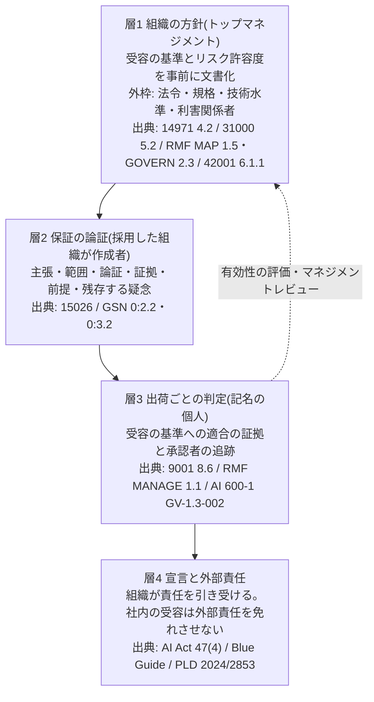

# #288 調査2: 品質保証とリスクの受容を、国際規格と規制は誰の責任としてどう定めているか

- 調査日: 2026-10-03(出典の取得日はすべて 2026-10-03。例外は個別に記す)
- 担当: research-02-international(単独。補助担当なし)
- 問い: オーナーの見方「『品質を保証する』の本質は組織責任論である。組織で合意形成され、組織に属する人がリスクを最小化でき、自社として・事業規模として許容できるリスク量になっているという合意ができることが、品質を保証することである」は、国際規格と規制の一次資料に照らして当たっているか
- 前提: 起票者の主張が正しいとは置かない。支持する資料と、異なる見方の資料の両方を集めた

## 結論(10行)

1. **主張の主体が組織であり、最終責任がトップマネジメントにある点は、調べたすべての枠組みが支持する**。ISO 9001 5.1.1 a)、ISO 31000 5.2、ISO 14971 4.2、NIST AI RMF GOVERN 2.3、ISO/IEC 42001 序文、EU AI Act 第17条1項(m)・第47条4項が該当する。
2. **規格そのものは保証しない。保証を主張するのは、規格を採った組織である**。AI RMF も ISO 14971 も「受容できるリスクの水準」を定めない。GSN は「論証が十分だとは主張しない」と書く。附属書H の「本標準は保証を主張しない」は、規格団体の立場としては正しい。誤りは、**採用した組織が保証を主張するための形を示さなかった点にある**。
3. **ISO 9000 の定義(確信を与える活動)と組織責任論は対立しない**。ISO 9001 の適用範囲は「一貫して提供できる能力を実証する」組織を想定する。誰が誰へ確信を与え、その責任を誰が負うかという主語が、附属書H から抜けていた。
4. **補正1: 許容できるリスクの水準は、社内の合意だけでは決まらない**。法令・整合規格・技術水準・利害関係者の懸念・「社会の現在の価値観」(IEC 61508)が外枠になる。EU の製造物責任は無過失責任で、社内の合意は抗弁にならない。
5. **補正2: 規格が求めるのは「全員の合意」ではない。権限を持つ者の決定、組織への周知、責任の割り当てである**。ISO 31000 は「トップマネジメントが説明責任を負う」とし、ISO/IEC 23894 は「統治機関がリスク選好を定め、判断を経営陣へ委ねる」とする。
6. **補正3: 求めるのは「最小化」ではない**。基準は「受容可能と判断される残留リスク」である(AI Act 第9条5項、ISO 14971、AI RMF 1.2.3「リスクを完全に除こうとすると逆効果になりうる」)。
7. **附属書H への含意**: 主張の主語を「採用した組織」にする。受容の基準はトップマネジメントが事前に文書で定める(14971 型)。出荷ごとの受容は、その基準に照らして記名の人が行う(9001 8.6、G-7・G-8)。この3層で「組織として品質を保証する」と言える形が組める。
8. 改訂の前提として、**ISO 9000:2015 は 2026-05-27 に廃止され、ISO 9000:2026 に置き換わった。ISO 9001:2026 は 2026-09-16 に発行された**。附属書H の ISO 9000 の引用は、版を明記して更新する必要がある。

## 調査の方法と根拠の強さ

| 記号 | 意味 |
|---|---|
| **A** | 一次資料の本文。官報・公的機関の全文、または規格の公開プレビュー(iTeh 版)から、条文の文言を直接読んだもの |
| **B** | 一次の発行者による公式の要約・抄録。ISO・IEEE・IEC の製品ページや概説資料 |
| **C** | 二次資料。認証機関・コンサルタント・法律事務所・規格起草者個人による解説。条文の文言は、二次資料が引いたものとして扱う |

- ISO の OBP(Online Browsing Platform)はログイン画面だけを返し、読めなかった。代わりに iTeh の公開プレビュー PDF を取得し、`pdftotext` で読んだ
- 検索の過程で、ISO 9001・ISO 14971・ISO 31000 の全文の無断転載 PDF に行き当たった。**本書では出典として引かない**。条文の文言は、プレビュー(A)か解説(C)で確かめられた範囲だけを書く
- EUR-Lex は自動取得を拒んだ(空応答)。AI Act の条文は、官報本文を転載する artificialintelligenceact.eu から読んだ(A−。官報との逐語照合は未実施)

---

## 1. ISO 9000 / ISO 9001: 品質保証の定義と、トップマネジメントの説明責任

### (a) 出典ごとの要点

**ISO 9001:2015 公開プレビュー(A)** — 0.1・1・5.1.1 が読めた。

- 0.1 一般(QMS の便益): "d) the ability to demonstrate conformity to specified quality management system requirements."
- 1 適用範囲: "This International Standard specifies requirements for a quality management system when an organization: a) needs to demonstrate its ability to consistently provide products and services that meet customer and applicable statutory and regulatory requirements, and b) aims to enhance customer satisfaction through the effective application of the system, including processes for improvement of the system and the assurance of conformity to customer and applicable statutory and regulatory requirements."
- 5.1.1: "Top management shall demonstrate leadership and commitment with respect to the quality management system by: a) taking accountability for the effectiveness of the quality management system; … g) ensuring that the quality management system achieves its intended results; h) engaging, directing and supporting persons to contribute to the effectiveness of the quality management system"
- 0.3.3 リスクに基づく考え方: "Risk-based thinking enables an organization to determine the factors that could cause its processes and its quality management system to deviate from the planned results, to put in place preventive controls to minimize negative effects"

**ISO 9001 8.6 製品及びサービスのリリース(C。プレビューの範囲外)** — 複数の解説が同じ文言を引く。

- 「計画した取り決めが満足に完了するまで、顧客へのリリースを進めてはならない。ただし、当該の権限を持つ者が承認し、該当する場合は顧客が承認した場合を除く」
- 保持する文書化した情報は2つ。合否判定基準への適合の証拠と、"traceability to the person(s) authorizing the release"(David Barker Consulting、iso9001expert.com)
- Qlause は 2026 年版の発行本文と照合し(2026-09-27)、8.6 は "Checked — unchanged" と記す。推奨として "Make release a named, recorded act — a person (not a department) authorises"

**ISO 9000:2015 の品質保証の定義(C)** — 品質保証は "part of quality management focused on providing confidence that quality requirements will be fulfilled"。ISO 9000:2026 でも同じ文言との投稿がある(LinkedIn。番号は 3.2.x に変更)。**ISO 9000:2026 の本文は未読**。

**ISO の製品ページ(B)**

- ISO 9000:2015 は "Withdrawn"、"95.99 2026-05-27 Withdrawal of International Standard"、"New version available: ISO 9000:2026"
- ISO 9001:2026 は "Status: Published / Publication date: 2026-09 / Edition: 6"。説明は "Published on 16 September, the 2026 edition … emphasizes the importance of quality culture and leadership and separates risk and opportunities"
- ISO の解説ページ「Quality assurance」は "Quality assurance builds confidence both inside and outside the organization. Internally, it helps ensure that processes are working as intended … Externally, it demonstrates a commitment to reliability and consistency" と述べる

**ISO 9001:2026 の変更点(C)**

- DNV: "'Promoting quality culture and ethical behaviour' is added as a new entry in Chapter 5.1 'Leadership and commitment'"。6.1 はリスクと機会を 6.1.1〜6.1.3 に分けた
- MSI: 7.3 e) で、組織の管理下で働く人に品質文化と倫理的行動の認識を求める
- Qlause(発行本文と照合): 5.1.1 は10項目から12項目に増え、"promoting risk-based thinking is now paired with promoting opportunity-based thinking"

**TÜV SÜD の ISO 9001 解説(C)**: "While responsibility itself cannot be delegated, individual tasks can still be assigned to a management representative."

### (b) オーナーの見方との関係

| 支持する点 | 異なる・補う点 |
|---|---|
| 説明責任は QMS の有効性について、トップマネジメントが負う(5.1.1 a)。委譲できない(TÜV SÜD) | 9001 が約束させるのは、**製品の無欠陥ではない**。要求事項を満たす製品を一貫して提供できる能力を実証することと、QMS への適合を実証することである(1・0.1) |
| 品質保証は組織の内外へ確信を与える活動で、組織の約束になる(ISO 解説) | 求めるのは「全員の合意」ではない。トップマネジメントが人を関与させ、指揮し、支援すること(5.1.1 h)と、2026 年版の品質文化の認識(7.3)である |
| リリースは、記名の個人が合否判定基準への適合の証拠をもって承認する(8.6) | 「リスク最小化」の語は 0.3.3 にある(負の影響を最小化する予防的管理)。ただし、受容の水準を決める仕組みは 9001 にはない。14971・31000 の領分である |

### (c) 附属書H への含意

- H.1 の「品質保証の意味」は ISO 9000 の定義を引くが、**確信を誰が誰へ与えるかという主語を落としている**。9001 に沿えば、「採用した組織が、顧客と内部へ、要求事項を一貫して満たす能力を実証する。その有効性の説明責任をトップマネジメントが負う」と書ける
- 出荷ごとの記名(G-7・G-8)は 8.6 の構造と一致する。8.6 が求める「合否判定基準への適合の証拠」と「承認者への追跡可能性」は、保証の開示(H.6)で満たせる
- 附属書H には、**QMS の有効性に対するトップマネジメントの説明責任**の層が見当たらない(案件ごとの記名はある)。突合で確かめる必要がある
- ISO 9000 の引用は、2026 年版に置き換えるか、版を明記して 2015 年版を引く。現行の注記「定義は二次情報で確認」は維持する

---

## 2. リスクの受容を組織が決める規格

### 2.1 ISO 31000:2018(リスクマネジメント — 指針)

**公開プレビュー(A)** — 5.2 が読めた。

- "Top management and oversight bodies, where applicable, should ensure that risk management is integrated into all organizational activities and should demonstrate leadership and commitment by: … assigning authority, responsibility and accountability at appropriate levels within the organization."
- "This will help the organization to: … establish the amount and type of risk that may or may not be taken to guide the development of risk criteria, ensuring that they are communicated to the organization and its stakeholders"
- "**Top management is accountable for managing risk while oversight bodies are accountable for overseeing risk management.**"

**6.3.4 リスク基準の決定(C。プレビューの範囲外)** — IRM(英国リスクマネジメント協会)の解説による。"Defining the risk criteria involves specifying the amount and type of risk that the organisation may or may not take, relative to objectives. This is usually referred to as the 'risk appetite' of the organisation. However, ISO 31000 does not use the phrase 'risk appetite', even though it is defined in the ISO Guide 73:2009"

**ISO のニュース(B)**: "ISO 31000:2018 provides guidelines, not requirements, and is therefore not intended for certification purposes."

### 2.2 ISO/IEC 23894:2023(AI — リスクマネジメントの指針)

**公開プレビュー(A)**

- 5.1: "While the governing body defines the overall risk appetite and organizational objectives, it delegates the decision-making process of identifying, assessing and treating risk to management within the organization."
- 5.2: "Due to the particular importance of trust and accountability related to the development and use of AI, top management should consider how policies and statements related to AI risks and risk management are communicated to stakeholders. Demonstrating this level of leadership and commitment can be critical for ensuring that stakeholders have confidence that AI is being developed and used responsibly."

### 2.3 ISO 14971:2019(医療機器 — リスクマネジメント)

- **ISO 製品ページ(B)**: "The standard requires manufacturers to establish objective criteria for risk acceptability but **does not specify acceptable risk levels**, recognizing that risk acceptability depends on the specific device context and intended use." 同ページは、残留リスクを予想される臨床上の便益と比べることを求める点にも触れる
- **4.2 経営者の責任(C)**: "Clause 4.2 of ISO 14971:2019 requires the top management to define and document a policy for establishing criteria for risk acceptability."(Exeed)。Greenlight Guru は "Executive management also has the responsibility for defining the company's risk management policy. This involves determining the risk acceptability criteria. The criteria should be based on solid, objective evidence, such as industry standards." と書く
- **方針の外枠(C)**: NAMSA は "Clause 4.2 … refers to the use of ALARP as one possible policy" とする。方針は、適用法規・関連規格・一般に認められた技術水準・利害関係者の懸念に基づくとされる。この文言は二次資料と無断転載にしか見当たらず、プレビューでは未確認
- **全体の残留リスクとベネフィット・リスク(C)**: Quality Forward は "If residual risk is not judged acceptable by the criteria defined in your risk management plan, you must assess whether the benefits of the device outweigh that residual risk" と書く。Johner Institute は、リスクマネジメント計画の「責任と権限の割り当て」について次のように述べる。"An 'authority' has the right to prevent product release during the risk management review if there are doubts about the risk or the benefit-risk ratio. This authority must be determined."

### 2.4 IEC 61508(機能安全)

- **IEC 公式の概説資料(B)**: "Tolerable risk: Risk which is accepted in a given context **based on the current values of society**"。"IEC 61508 adopts a risk based approach for determining the required performance of the safety function … build the E/E/PE safety-related system to meet tolerable risk!"
- **MTL の解説 AN9025(C)**: ALARP について "The ALARP principle is a description both of what regulators look for in making assessments and of what the creators of risks need to do in determining the tolerability of the risks that they pose."
- 61508-1 の機能安全管理(責任者の指名、独立した機能安全評価)の条文は、今回は未読。リポジトリには 61508-3 第3版の委員会原案プレビュー(SRC-0528)がある

### 2.5 ISO 26262:2018(自動車の機能安全)

- 定義: 機能安全は "absence of unreasonable risk due to hazards caused by malfunctioning behavior"(C。New Eagle の解説)
- 確認方策(C): Spyrosoft は "The main rule is that the confirmation reviews shall be finalised before the project is released for production" とし、"ASIL D requires I3 independence, which means the assessment shall be performed by a person who is independent regarding management and resources from the department responsible for work product creation" と書く。LHP は "Once complete, the release for production report should be added to the safety case." とする
- リポジトリの既存出典 SRC-0526(ISO 26262-12 プレビュー、A)は、確認方策の独立性が ASIL に応じて定まる条文を確認済み

### 2.6 ANSI/UL 4600(自律製品の安全)

- 起草者 Koopman の FAQ(C。起草者本人による解説): "An independent assessor is required, but need not be external. This assessor is primarily doing an audit on the completeness and traceability of the safety case."
- Edge Case Research(起草者の所属): "Use of credentialed external assessors is recommended, but not required so long as assessor independence and capabilities are credible and documented."
- 安全ケースは「自律システムが意図した用途で受容可能な程度に安全であることを、証拠で支える論証」とされる(Visure の解説、C)。**受容可能な水準そのものを UL 4600 は定めない**。この点は二次資料の記述からの推論で、本文は未読

### (b) オーナーの見方との関係(項目2全体)

| 支持する点 | 異なる・補う点 |
|---|---|
| 受容の基準は組織が定める。規格は水準を定めない(14971 の ISO ページ、31000 6.3.4) | **基準は組織の自由ではない**。14971 の方針は法規・規格・技術水準・利害関係者の懸念に基づく。61508 の許容リスクは「社会の現在の価値観」に基づく。ALARP は規制当局が見る基準でもある |
| 基準を定めるのはトップマネジメント・統治機関である(14971 4.2、31000 5.2、23894 5.1) | 規格が求めるのは「合意」ではなく、**説明責任と、権限・責任の割り当て、組織と利害関係者への周知**である(31000 5.2)。リスクの特定・評価・処置は経営陣へ委ねられる(23894) |
| 全体の残留リスクを評価し、便益と比べる(14971) | 受容の判断には、**出荷を止められる権限者**を事前に決める(Johner による 14971 の読み) |
| 安全の主張は組織が論証として示す(26262 の安全ケース、UL 4600) | 主張には**独立した確認**が付く。26262 は ASIL D で I3、UL 4600 は外部でなくてもよいが独立した評価者を求める |

### (c) 附属書H への含意

- 附属書H は、出荷ごとに事業決裁者が残存リスクを受容する構造(G-8)を持つ。しかし14971 型の「**事前に、トップマネジメントが文書で定めた受容の基準**」に照らして受容する構造は、附属書H の記述からは読み取れない。基準なしの受容は、案件ごとにその場の判断になる
- 「自社として・事業規模として許容できる」を書くなら、外枠も併記する。外枠とは、法令・契約・業界規格・技術水準である。社内の合意は外枠の内側でしか効かないことを明記する
- 「最小化」ではなく「受容の基準を満たし、かつ方針(ALARP 等)に沿って低減した」と書く

---

## 3. 保証の論証(assurance case)

### (a) 出典ごとの要点

**ISO/IEC/IEEE 15026-1:2019 の ISO 製品ページ(B)**

- "The essential concept introduced by ISO/IEC/IEEE 15026 (all parts) is the statement of claims in an assurance case and the support of those claims through argumentation and evidence."
- "A variety of potential users … including developers and maintainers of assurance cases and those who wish to develop, sustain, evaluate or acquire a system that possesses requirements for specific properties in such a way as to be more certain of those properties"
- "While essential to assurance practice, details regarding exactly how to measure, demonstrate or analyse particular properties are not covered."
- 状態は "Withdrawn"(95.99)。IEEE SA には IEEE/ISO/IEC 15026-1-2025 のページがある。**2025 年版の本文は未読**

**ISO/IEC/IEEE 15026-2:2022 の IEEE SA ページ(B)**: "specifies minimum requirements for the structure and its meaning of assurance cases. **It does not place requirements on the quality of the contents** but describes the structure and its meaning of assurance cases with the necessary level of precision and detail so as to avoid inconsistent and subjective use of the terms."

**IDA の文書 P-9278 が引く ISO 15026-2:2011(C)**: 保証の論証は "includes a top-level claim for a property of a system or product (or set of claims), systematic argumentation regarding this claim, and the evidence and explicit assumptions that underlie this argumentation"

**IEEE 規格の重要告知(B。15026-1 の IEEE 採択版の冒頭)**: "IEEE Standards documents are not intended to ensure safety, security, health, or environmental protection … Implementers of IEEE Standards documents are responsible for determining and complying with all appropriate …"

**GSN 共同体標準 第3版(A。SCSC-141C、2021-05)**

- 0:2.2: "A reasoned and compelling argument, supported by a body of evidence, that a system, service or organisation will operate as intended for a defined application in a defined environment."
- 0:2.3: "a safety case will demonstrate that a given system is acceptably safe in a given context"
- 0:3.2: "**The top goal presents the overall claim asserted by the author and it is up to the reader to determine their belief that it is adequately supported. This standard does not assert that an argument presented in GSN is necessarily sufficient to support the overall claim**, rather the use of GSN enables an author to clearly present the basis of their support for that claim and the reader to comprehend and challenge that basis"
- 2:3.3.7: "The concept 'acceptably safe' is left to be defined through the supporting argument."
- 1:6.1.1(既存出典 SRC-0562): 弁証法拡張で "the residual doubt exposed"

### (b) オーナーの見方との関係

| 支持する点 | 異なる・補う点 |
|---|---|
| 保証の論証は「保証できる」と**主張する形**を持つ。最上位の主張を表明するのは作成者(組織)である(GSN 0:3.2) | 主張が十分かを決めるのは**読み手**である。品質保証部門・顧客・規制当局がこれにあたる。作成者の合意は、主張の十分性を決めない |
| 主張・範囲(defined application / environment)・論証・証拠・前提が要素である。採用判断シートの5要素(主張・範囲・根拠・証拠・限界と責任)とほぼ重なる | 15026-2 は構造だけを定め、内容の質を定めない。「受容可能」の中身は論証の中で定義する(GSN 2:3.3.7)。つまり受容の基準は、論証の外から持ち込む |
| 残存する疑念を表示する仕組みがある(GSN 第3版) | 規格・記法の側は保証しない(IEEE の告知、GSN 0:3.2)。結論2と同じ構図である |

### (c) 附属書H への含意

- 附属書H の最上位の主張(H.1)は工程についての主張で、主語が書かれていない。GSN に倣うなら、主張の作成者(採用した組織)を明記する。主張の範囲(製品・変更・期間・利用条件)を文脈要素に置き、「受容可能」の定義を受容の基準(項目2)へ参照させる
- 採用判断シートの「限界と責任」は、GSN の前提要素・未展開要素・残存する疑念に対応する。附属書H の C7 開示はこの役割を持つ

---

## 4. AI

### 4.1 NIST AI RMF 1.0(NIST AI 100-1、2023-01)(A)

- 1.2.2: "While the AI RMF can be used to prioritize risk, **it does not prescribe risk tolerance**. Risk tolerance refers to the organization's or AI actor's … readiness to bear the risk in order to achieve its objectives. Risk tolerance can be influenced by legal or regulatory requirements (Adapted from: ISO GUIDE 73)."
- 1.2.2(枠内): "Organizations should follow existing regulations and guidelines for risk criteria, tolerance, and response established by organizational, domain, discipline, sector, or professional requirements. … **Where established guidelines do not exist, organizations should define reasonable risk tolerance.**"
- 1.2.3: "Attempting to eliminate negative risk entirely can be counterproductive in practice because not all incidents and failures can be eliminated."
- 第5章 GOVERN の前文: "Effective risk management is realized through organizational commitment at senior levels and may require cultural change within an organization or industry." "Governing authorities can determine the overarching policies that direct an organization's mission, goals, values, culture, and risk tolerance."
- GOVERN 1.3: "Processes, procedures, and practices are in place to determine the needed level of risk management activities based on the organization's risk tolerance."
- GOVERN 1.4: "The risk management process and its outcomes are established through transparent policies, procedures, and other controls based on organizational risk priorities."
- GOVERN 2.1: "Roles and responsibilities and lines of communication … are documented and are clear to individuals and teams throughout the organization."
- **GOVERN 2.3: "Executive leadership of the organization takes responsibility for decisions about risks associated with AI system development and deployment."**
- MAP 1.5: "Organizational risk tolerances are determined and documented."
- MEASURE 2.6: "The AI system to be deployed is demonstrated to be safe, its residual negative risk does not exceed the risk tolerance, and it can fail safely"
- MANAGE 1.1: "A determination is made as to whether the AI system achieves its intended purposes and stated objectives and whether its development or deployment should proceed."
- MANAGE 1.3: "Risk response options can include mitigating, transferring, avoiding, or accepting."
- MANAGE 1.4: "Negative residual risks (defined as the sum of all unmitigated risks) to both downstream acquirers of AI systems and end users are documented."
- 性格: "voluntary"(1.2 ほか)。適用は任意である

### 4.2 NIST AI 600-1(生成 AI プロファイル、2024-07)(A)

- GV-1.3-002: "Establish minimum thresholds for performance or assurance criteria and review as part of deployment approval ("go/"no-go") policies, procedures, and processes, with reviewed processes and approval thresholds reflecting measurement of GAI capabilities and risks."
- GV-1.3-006: "Reevaluate organizational risk tolerances to account for unacceptable negative risk"
- GV-1.3-007: "Devise a plan to halt development or deployment of a GAI system that poses unacceptable negative risk."
- MG-1.3-001: "Document trade-offs, decision processes, and relevant measurement and feedback results for risks that do not surpass organizational risk tolerance … Mitigate, transfer, or avoid risks that surpass organizational risk tolerances."

### 4.3 ISO/IEC 42001:2023(AI マネジメントシステム)

- **公開プレビュー(A)**: 序文に "**An organization conforming with the requirements in this document can generate evidence of its responsibility and accountability regarding its role with respect to AI systems.**"。適用範囲は "applicable to any organization, regardless of size, type and nature"。3.3 トップマネジメントは "person or group of people who directs and controls an organization at the highest level"。3.24 AI システム影響評価は "formal, documented process by which the impacts on individuals, groups of individuals, or both, and societies are identified, evaluated and addressed by an organization"。4.1 は "The organization shall determine its roles with respect to these AI systems."
- **NIST の対応表(A。SRC-0521)**: GOVERN 2.3 は 42001 の 5.1(リーダーシップ及びコミットメント)・5.2・9.3(マネジメントレビュー)へ対応する。MAP 1.5(リスク許容度の決定と文書化)は 6.1.1 へ、MANAGE 1.4(残留リスクの文書化)は 6.1.2〜6.1.4 へ対応する
- **6.1.1 の AI リスク基準(C)**: CSA は "Identify AI risk criteria and organizational AI appetite for risk that supports distinguishing acceptable from non-acceptable risks" と書く。条文の文言はプレビューの範囲外で未確認

### 4.4 EU AI Act(Regulation (EU) 2024/1689)(A−。官報本文の転載で読んだ)

- 第16条: 高リスク AI の提供者は (a) 第2節の要求事項への適合を確保し、(c) 第17条の品質マネジメントシステムを持ち、(f) 適合性評価を受け、(g) EU 適合宣言を作成する
- 第17条1項: "Providers of high-risk AI systems shall put a quality management system in place that ensures compliance with this Regulation. That system shall be documented in a systematic and orderly manner in the form of written policies, procedures and instructions"。(c) は "techniques, procedures and systematic actions to be used for the development, quality control and quality assurance"、**(m) は "an accountability framework setting out the responsibilities of the management and other staff with regard to all the aspects listed in this paragraph."**
- 第17条2項: "The implementation of the aspects referred to in paragraph 1 shall be **proportionate to the size of the provider's organisation**. Providers shall, in any event, respect the degree of rigour and the level of protection required to ensure the compliance"
- 第9条5項: "The risk management measures … shall be such that the relevant residual risk associated with each hazard, as well as **the overall residual risk of the high-risk AI systems is judged to be acceptable**."
- 第43条2項: 附属書 III 第2〜8号の高リスク AI は "the conformity assessment procedure based on internal control as referred to in Annex VI, which does not provide for the involvement of a notified body." つまり**提供者が自ら評価する**
- 第47条4項: "**By drawing up the EU declaration of conformity, the provider shall assume responsibility for compliance** with the requirements set out in Section 2."
- 適用日: Digital Omnibus(Regulation (EU) 2026/1744)で高リスク義務の適用は延期された(既存出典 SRC-0486・SRC-0087。今回は再取得していない)

### (b) オーナーの見方との関係

| 支持する点 | 異なる・補う点 |
|---|---|
| AI のリスクに関する決定の責任は経営層が負う(RMF GOVERN 2.3)。リスク許容度は組織が決めて文書化する(MAP 1.5) | 許容度は、まず**既存の法規・業界の基準に従う**。組織が自ら定めるのは、基準がない場合である(RMF 1.2.2) |
| 42001 への適合は、組織が責任と説明責任の証拠を生む手段とされる(序文)。採用判断シートの見方と一致する | 規格が求めるのは、役割と責任が「組織の個人とチームに明確であること」である(GOVERN 2.1)。全員の合意ではない |
| 事業規模への比例を規制が明文で認める(AI Act 第17条2項)。オーナーの「事業規模として許容できる」に近い | ただし同項は「いかなる場合も、要求される厳格さと保護の水準を尊重する」と続く。規模は実施の程度を変えるが、保護の水準を下げる理由にはならない |
| 出荷の可否を組織が判定し、閾値を事前に定める(MANAGE 1.1、GV-1.3-002) | 最小化ではなく、許容度を超えないことと受容可能性が基準である(MEASURE 2.6、第9条5項、RMF 1.2.3) |
| 提供者が自ら適合を評価し、宣言で責任を引き受ける(第43条2項・第47条4項) | 宣言の対象は**法の要求事項への適合**であり、社内で合意した品質水準ではない |

### (c) 附属書H への含意

- 採用判断シートが NIST AI RMF と 42001 を引くのは妥当である。附属書H が組織責任を書くとき、**GOVERN 2.3(経営層の責任)と MAP 1.5(許容度の文書化)を対応づけられる**
- AI 600-1 の GV-1.3-002(配備承認の閾値を事前に定める)と GV-1.3-007(停止の計画)は、採用判断シートの Q8・Q9・Q17・Q18 へそのまま対応する
- 「事業規模への比例」は AI Act 第17条2項の書き方(比例させるが、保護の水準は下げない)に倣うと、規格として防御できる

---

## 5. 製品の適合の宣言と製造物責任

### (a) 出典ごとの要点

**Blue Guide 2022(EU 製品規則の実施の手引き、OJ C 247、2022-06-29)(A−。官報版の転載 PDF で読んだ)**

- "By drawing up and signing the EU Declaration of Conformity, **the manufacturer assumes responsibility for the compliance of the product.**"
- "Conformity assessment, drawing up and keeping the EU declaration of conformity and the technical documentation remain the responsibility of the manufacturer"
- 2.1(medicaldeviceslegal の引用、C): "The natural or legal person who carries out changes or has changes carried out to the product shall be responsible for the conformity of the modified product and draw a declaration of conformity, even if they use existing tests and technical documentation."
- OMC Medical の要約(C): "By placing the CE marking on a product, a manufacturer certifies that it complies with all applicable regulatory requirements for CE marking, on his sole responsibility."

**製造物責任指令(Directive (EU) 2024/2853)(C。EUR-Lex は取得できず、解説で読んだ)**

- 適用: 2026-12-09 以降に市場に出す製品(24hour-AR、Gibson Dunn)。単体のソフトウェアと AI を含む
- IBA: "It should be noted that the liability under PLD 2024 is **no-fault liability (strict liability)**." 欠陥の判断は第7条による。"a product is considered defective if it does not provide the level of safety required by national or EU legislation or which an average person may expect"
- IBA: "the fact that the software is free of defects when it is placed on the market does not exempt them from liability. Rather, as long as they have the ability to ensure that their software is free of defects and cybersecure by means of software updates … they have an obligation to do so"
- Gibson Dunn: 被告が証拠を開示しない場合などに、欠陥と因果関係が推定される。"Documentation should be sufficiently detailed, centralized and accessible to enable a prompt and coherent response to disclosure requests and to rebut allegations of defect or causation."

### (b) オーナーの見方との関係

| 支持する点 | 異なる・補う点 |
|---|---|
| 「宣言する」主体は組織(製造者・提供者)である。宣言によって組織が責任を引き受ける(Blue Guide、AI Act 第47条4項)。品質を保証すると言うことは、組織が責任を引き受けることだという見方と一致する | 製造物責任は無過失責任である。欠陥は「法令が求める安全」または「平均的な人が期待できる安全」で判断する。**社内で合意した許容リスクは、被害者に対する抗弁にならない** |
| 変更を加えた者が、変更後の製品の適合に責任を負う(Blue Guide 2.1)。AI による変更でも同じ | 出荷後も、更新で欠陥を除ける限りは除く義務が続く(IBA)。保証は出荷時点の1回では終わらない(採用判断シート Q9 と一致) |
| 記録は、責任を果たしたことの防御になる(Gibson Dunn)。附属書H の記録と開示の構造は、この役割を持ちうる | — |

### (c) 附属書H への含意

- H.2 は「契約上の責任の帰結」に答えを持たないとする。この判断は維持してよい。法的責任は本標準の外にある。ただし、**組織内部の受容は、外部の責任(製造物責任・規制)を免れさせない**ことは明記すべきである。これを書かないと、「社内で合意した=保証した」という誤読を招く
- 保証の開示と G-8 の記録は、開示請求に応える記録として機能しうる。ただし法的な有効性は検証していない(根拠水準マークの対象)

---

## 6. 横断の整理: オーナーの見方の当否

オーナーの見方を4つの命題に分け、資料に照らして判定します。

| 命題 | 判定 | 根拠 |
|---|---|---|
| P1「品質保証の本質は組織責任である」 | **支持** | 9001 5.1.1 a)、31000 5.2、14971 4.2、RMF GOVERN 2.3、42001 序文、AI Act 第17条1項(m)・第47条4項、Blue Guide。主張し、責任を引き受けるのは常に組織である。規格は保証しない(IEEE の告知、GSN 0:3.2、RMF 1.2.2) |
| P2「組織で合意形成されていること」 | **補正して支持** | 規格が求めるのは、トップマネジメントの説明責任、権限・責任の割り当て、基準の組織と利害関係者への周知、人の関与である。全員の合意は求めない。2026 年版 9001 の品質文化(5.1.1・7.3)は、全員の「認識」までを求める |
| P3「自社として・事業規模として許容できるリスク量」 | **補正して支持** | 組織が受容の基準を定める点は一致する(14971、31000 6.3.4、RMF MAP 1.5)。ただし基準の外枠は、法令・整合規格・技術水準・利害関係者の懸念・社会の価値観である(14971、61508、RMF 1.2.2)。規模への比例は認められるが、保護の水準は下げない(AI Act 第17条2項)。製造物責任には社内の合意が効かない |
| P4「あらゆる人がリスクを最小化できている」 | **異なる** | 基準は受容可能性である(AI Act 第9条5項、14971、MEASURE 2.6)。RMF 1.2.3 は完全な除去は逆効果になりうるとする。「最小化」は低減の方針の1つ(ALARP・AFAP)として位置づけるのが規格の書き方である |

**まとめ**: オーナーの見方の核(P1)は、国際規格と規制の構造と一致します。附属書H の「本標準は品質を保証するとは主張しない」は、主語を誤っていました。規格は保証しない、という一般論を、採用した組織も保証を主張しない、という立場にまで広げてしまっています。一方、P2〜P4 をそのまま条項にすると、規格が求める「外部の基準に照らした受容」と「権限者の記名」が「社内の合意」に置き換わります。そのため、信頼性が下がります。

---

## 7. 附属書H の改訂への含意(提案ではなく、資料から導ける形)

資料から導ける「組織として品質を保証すると言える形」は、次の3層です。

- 附属書H の現状は、層3(G-7・G-8、保証の開示)が厚い。層2 は主語を欠く。層1 と層4 は、記述が見当たらない(突合で確認すること)
- 「本標準は保証を主張しない」は、「**本標準は、採用した組織が保証を主張するための要求事項である。保証を主張し、その責任を負うのは採用した組織のトップマネジメントである**」へ置き換えられる。規格団体の立場(規格自身は保証しない)と両立する。9001・42001・15026 と同じ構図である
- 実証の欠ける点には根拠水準マークを付ける。この3層の形で品質保証部門・経営が採用を判断できるかは、未検証である

## 8. 未確認事項(読めなかったもの)

- ISO 9000:2026 の品質保証の定義の文言(二次資料のみ)。ISO 9001:2026 の 5.1.1・6.1 の発行本文の文言(解説のみ)
- ISO 9001 8.6 の文言(解説のみ。プレビューの範囲外)
- ISO 14971:2019 4.2・7.4・8 の文言(解説のみ。無断転載は不採用)
- ISO 31000 6.3.4 の文言(IRM の解説のみ)
- ISO/IEC 42001 5.1・6.1.1 の文言(対応表と解説のみ)
- IEC 61508-1 の機能安全管理・機能安全評価の条文(未読)
- ISO/IEC/IEEE 15026-1:2025・15026-2:2022 の本文(抄録のみ)
- UL 4600 の本文(起草者の解説のみ)
- 製造物責任指令 2024/2853 の条文(EUR-Lex が取得を拒否。法律家の解説のみ)
- AI Act の条文は転載サイトで読んだ。EUR-Lex 官報との逐語照合は未実施

## 出典(取得日はすべて 2026-10-03)

| # | 出典 | URL | 強さ |
|---|---|---|---|
| 1 | ISO 9001:2015 公開プレビュー(iTeh) | https://cdn.standards.iteh.ai/samples/62085/4eb398f0e6dd4379a04fc7d5df82bab8/ISO-9001-2015.pdf | A |
| 2 | ISO 9001:2026 製品ページ | https://www.iso.org/standard/9001 | B |
| 3 | ISO 9001:2015 製品ページ | https://www.iso.org/standard/62085.html | B |
| 4 | ISO 9000:2015 製品ページ(廃止・2026 年版への置換) | https://www.iso.org/standard/45481.html | B |
| 5 | ISO「Quality assurance」解説 | https://www.iso.org/quality-management/quality-assurance | B |
| 6 | ISO/TC 176/SC 2 ニュース(9001:2026 発行) | https://committee.iso.org/sites/tc176sc2/home/news.html | B |
| 7 | Qlause 5.1.1(2026、発行本文と照合) | https://qlause.app/clauses/2026-5-1-1 | C |
| 8 | Qlause 8.6(2026、変更なし) | https://qlause.app/clauses/2026-8-6 | C |
| 9 | DNV ISO 9001:2026 改訂 | https://www.dnv.us/assurance/Management-Systems/new-iso/transition/iso-9001-revision | C |
| 10 | MSI ISO 9001:2026 | https://msi-international.com/iso-90012026-update-ethics-culture-importance | C |
| 11 | David Barker Consulting 8.6 | https://davidbarker.consulting/iso9001/clause-8-6-release-of-products-and-services | C |
| 12 | iso9001expert 8.6 | https://iso9001expert.com/blog/iso-9001-clause-8-6-release-products-services-requirements-checklist | C |
| 13 | TÜV SÜD ISO 9001:2015 guidance | https://www.tuvsud.com/-/jssmedia/global/pdf-files/whitepaper-report-e-books/tuvsud-iso-9001-2015-guidance.pdf | C |
| 14 | ISO 9000 定義の引用(LinkedIn 投稿) | https://www.linkedin.com/posts/rajesh-thiyagarajan-b0a18727_iso9000-iso90002026-qualitymanagement-activity-7492763558946951168-GBMn | C |
| 15 | ISO 31000:2018 公開プレビュー(iTeh) | https://cdn.standards.iteh.ai/samples/65694/60673072317a4b96bd36efb910b68926/ISO-31000-2018.pdf | A |
| 16 | IRM ISO 31000:2018 解説 | https://www.theirm.org/media/6884/irm-report-iso-31000-2018-v2.pdf | C |
| 17 | ISO ニュース ISO 31000:2018 | https://www.iso.org/news/ref2263.html | B |
| 18 | ISO/IEC 23894:2023 公開プレビュー(iTeh) | https://cdn.standards.iteh.ai/samples/77304/cb803ee4e9624430a5db177459158b24/ISO-IEC-23894-2023.pdf | A |
| 19 | ISO 14971:2019 製品ページ | https://www.iso.org/standard/72704.html | B |
| 20 | Exeed 14971 4.2 | https://exeedqm.com/new-blog/5-elements-of-a-risk-management-policy | C |
| 21 | Greenlight Guru 14971 | https://www.greenlight.guru/blog/iso-14971-risk-management | C |
| 22 | NAMSA 14971 | https://namsa.com/resources/blog/risk-management-mdr-beyond-iso-149712019 | C |
| 23 | Quality Forward 14971 | https://www.qualityfwd.com/blog/iso-14971 | C |
| 24 | Johner Institute リスクマネジメント計画 | https://blog.johner-institute.com/iso-14971-risk-management/risk-management-plan-the-most-important-advantages | C |
| 25 | IEC Overview of IEC 61508 & Functional Safety | https://assets.iec.ch/public/acos/IEC%2061508%20&%20Functional%20Safety-2022.pdf | B |
| 26 | MTL AN9025 IEC 61508 入門 | https://www.mtl-inst.com/images/uploads/AN9025_Rev_4.pdf | C |
| 27 | Spyrosoft ISO 26262 | https://spyro-soft.com/blog/automotive/iso-26262 | C |
| 28 | LHP ISO 26262 Part 2 | https://www.lhpes.com/blog/why-iso26262-part2-is-the-most-critical-for-your-company | C |
| 29 | New Eagle ISO 26262 | https://neweagle.net/iso-26262-guide | C |
| 30 | Koopman UL 4600 FAQ | http://safeautonomy.blogspot.com/p/ul-4600-faq.html | C(起草者) |
| 31 | Edge Case Research UL 4600 概説 | https://edgecaseresearch.medium.com/an-overview-of-draft-ul-4600-standard-for-safety-for-the-evaluation-of-autonomous-products-a50083762591 | C(起草者の所属) |
| 32 | Visure UL 4600 | https://visuresolutions.com/automotive/ul-4600 | C |
| 33 | ISO/IEC/IEEE 15026-1:2019 製品ページ | https://www.iso.org/standard/73567.html | B |
| 34 | IEEE SA 15026-2-2022 | https://standards.ieee.org/ieee/15026-2/10236 | B |
| 35 | IEEE SA 15026-1-2025 | https://standards.ieee.org/ieee/15026-1/11789 | B |
| 36 | IDA P-9278 Security Assurance Case Pattern | https://www.ida.org/assets/2026/06/18013118/P-9278.pdf | C |
| 37 | GSN Community Standard Version 3 | https://scsc.uk/index.php/publications/download?ref=1386&stream=1 | A |
| 38 | NIST AI 100-1 AI RMF 1.0 | https://nvlpubs.nist.gov/nistpubs/ai/NIST.AI.100-1.pdf | A |
| 39 | NIST AI 600-1 生成 AI プロファイル | https://nvlpubs.nist.gov/nistpubs/ai/NIST.AI.600-1.pdf | A |
| 40 | NIST AI RMF ↔ ISO/IEC 42001 対応表 | https://airc.nist.gov/docs/NIST_AI_RMF_to_ISO_IEC_42001_Crosswalk.pdf | A |
| 41 | ISO/IEC 42001:2023 公開プレビュー(iTeh) | https://cdn.standards.iteh.ai/samples/81230/4c1911ebc9a641fcb6ee21aa09c28ad3/ISO-IEC-42001-2023.pdf | A |
| 42 | CSA ISO 42001 要求事項 | https://cloudsecurityalliance.org/articles/what-are-the-iso-42001-requirements | C |
| 43 | EU AI Act 第9・16・17・47条(官報本文の転載) | https://artificialintelligenceact.eu/article/17/ ほか /article/9/・/16/・/47/ | A− |
| 44 | EU AI Act 第43条(同) | https://artificialintelligenceact.eu/article/43/ | A− |
| 45 | Blue Guide 2022(官報版の転載 PDF) | https://www.ibf-solutions.com/fileadmin/dateidownloads/amtsblaetter/the-blueguide-on-the-implementation-of-eu-products-rules-2022.pdf | A− |
| 46 | medicaldeviceslegal Blue Guide 2022 | https://medicaldeviceslegal.com/2022/08/07/the-blue-guide-2022-update-new-elements-regarding-applicability-of-eu-law-on-products | C |
| 47 | OMC Medical Blue Guide 2022 | https://omcmedical.com/blog/blue-guide-on-eu-product-rules-implementation-2022 | C |
| 48 | IBA 製造物責任指令とソフトウェア | https://www.ibanet.org/European-Product-Liability-Directive-liability-for-software | C |
| 49 | Gibson Dunn 製造物責任指令 | https://www.gibsondunn.com/eu-product-liability-directive-responding-to-software-ai-and-complex-supply-chains | C |
| 50 | 24hour-AR 製造物責任指令 | https://www.24hour-ar.com/authorised-representative/eu-product-liability-directive | C |
| — | 既存出典(再取得せず): SRC-0087、SRC-0486(AI Act 適用日)、SRC-0526(ISO 26262-12)、SRC-0528(IEC 61508-3 CDV)、SRC-0562(GSN 第3版) | `research/sources/` | 台帳による |
