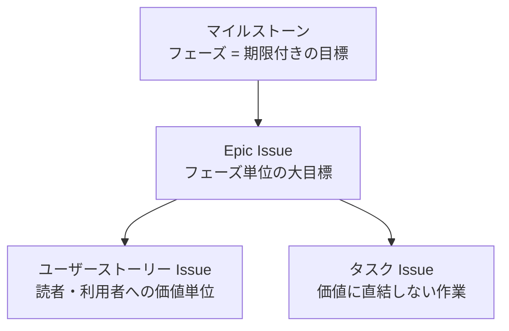

本プロジェクトは、すべての作業を GitHub Issue として起票し、計画的に進めます。
「計画のないプロダクトは存在しない」——このページはスプリントプランニングゼロの成果物です。

## バックログの構造

| 階層 | ラベル | 説明 |
| --- | --- | --- |
| Epic | `epic` | フェーズ単位の大目標。本文の子 Issue リストで進捗を追跡 |
| ユーザーストーリー | `user-story` | 「(誰)として(何)がほしい。それは(理由)のためだ」形式。受け入れ条件付き |
| タスク | `task` | 環境整備など、価値に直結しない作業 |

補助ラベル: `phase-0`〜`phase-6`(フェーズ)、`tool`(提案ツール)、`outreach`(発信)。

## マイルストーン(期限は目安)

| マイルストーン | 期限 | 対応 Epic |
| --- | --- | --- |
| M0: リポジトリ基盤 | 2026-07-31 | [#6](https://github.com/Takenori-Kusaka/process-compass/issues/6) |
| M1: フェーズ1 現状調査 | 2026-10-31 | [#7](https://github.com/Takenori-Kusaka/process-compass/issues/7) |
| M2: フェーズ2 AIDLC調査 | 2026-10-31(M1と並行) | [#8](https://github.com/Takenori-Kusaka/process-compass/issues/8) |
| M3: フェーズ3 ギャップ分析 | 2026-12-31 | [#9](https://github.com/Takenori-Kusaka/process-compass/issues/9) |
| M4: フェーズ4 詳細策定 | 2027-02-28 | [#10](https://github.com/Takenori-Kusaka/process-compass/issues/10) |
| M5: フェーズ5 プロセス実装 | 2027-04-30 | [#11](https://github.com/Takenori-Kusaka/process-compass/issues/11) |
| M6: フェーズ6 プロセス運用 | 2027-06-30 | [#12](https://github.com/Takenori-Kusaka/process-compass/issues/12) |
| M7: プロセス提案ツール | 2027-09-30 | [#13](https://github.com/Takenori-Kusaka/process-compass/issues/13) |

発信・コミュニティ運営([#14](https://github.com/Takenori-Kusaka/process-compass/issues/14))は全期間の継続活動のため、マイルストーンに紐付けません。

## 進め方のルール

1. **Issue にない作業はしない** — 思いついた作業もまず Issue 化してから着手する
2. **着手順序** — 「期限が近いマイルストーン → Epic 本文の子 Issue リストの上から」を基本とし、例外は Issue コメントに理由を残す
3. **週次レビュー** — 週1回、進行中 Issue の棚卸しとバックログの見直しを行う(ソロ + AI 体制のためスプリントは固定しない)
4. **完了の定義(DoD)** — 各 Issue の受け入れ条件をすべて満たし、`npm run check` が通り、成果がサイトに公開されていること
5. **フィードバックの取り込み** — Issue / Discussion で受けた意見は、トリアージのうえ既存 Issue への反映または新規起票を行う

## 完了の定義(コンテンツ共通)

- 受け入れ条件のチェックボックスがすべて埋まっている
- 図解(Mermaid 等)を中心に説明している
- `npm run check`(textlint + ビルド)が通る
- サイトの該当ディレクトリ配下に公開されている
