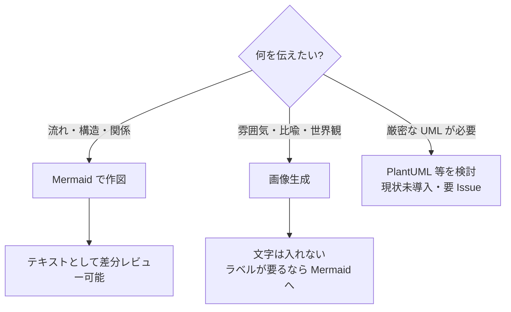
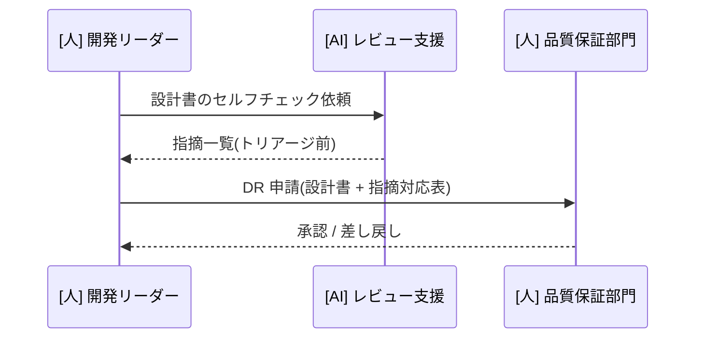
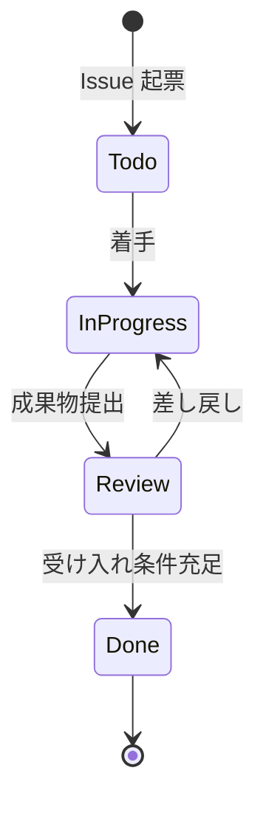
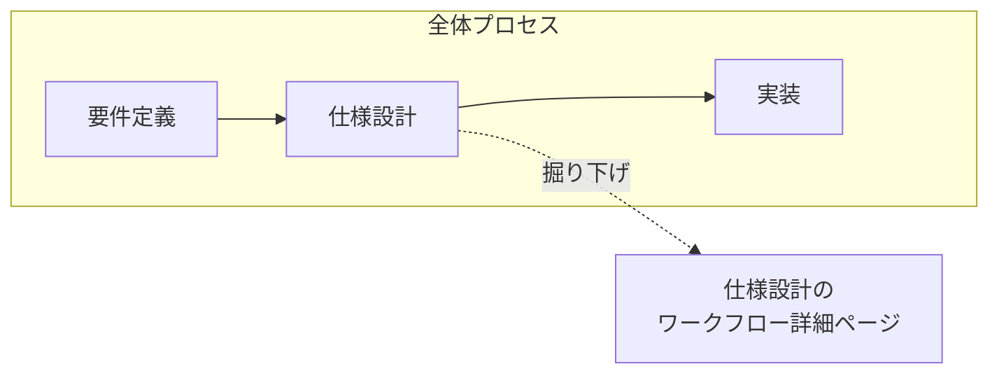

本プロジェクトは「文章より図」が原則です。新規概念のページでは、まず図を設計してから本文を書きます。
このページは全執筆者(人・AI)共通の作図規約です。

## 手段の使い分け

- **Mermaid 第一選択**: 構造・流れ・関係はすべて Mermaid。テキストなので差分レビューでき、テーマ(ライト/ダーク)にも自動追従する
- **生成画像は限定用途**: ヒーロー画像・概念イメージなど。画像内に文字は入れない(崩れやすく、翻訳もできないため)

## Mermaid 記法の選択表

| 説明したいもの | 記法 | 用途例 |
| --- | --- | --- |
| プロセスの流れ・フェーズ遷移 | `graph LR` | 開発フェーズの全体像 |
| 階層・分類 | `graph TD` + `subgraph` | プロセス体系の分類 |
| ロール間のやりとり・承認フロー | `sequenceDiagram` | DR での承認・レビュー依頼 |
| 状態遷移 | `stateDiagram-v2` | チケットや成果物のライフサイクル |
| 判断分岐 | `flowchart` + 菱形 | テーラリング判断 |
| 時系列計画 | `gantt` | マイルストーン計画 |

### 記法サンプル

ロール間のやりとり(シーケンス図)の例:

状態遷移(ステート図)の例:

## プロセスの階層図解パターン

プロセスは「全体 → フェーズ内ワークフロー → 個別作業」の3階層で描きます。

1. **1ページに全体図は1つ**。ノードは7個前後まで(超えるなら分割のサイン)
2. 掘り下げは `subgraph`、それでも収まらなければ**別ページに分けて全体図のノードから内部リンク**で誘導する
3. 上位図のノード名と下位図のページタイトルを一致させる(読者が迷子にならないため)

## スタイル規約

- ノードラベルは日本語。矢印ラベルには「何が渡るか」(成果物・承認)を書く
- 流れは原則 `LR`(横)を使い、階層・分類なら `TD`(縦)を使う
- 色は直接指定しない(テーマ自動追従を壊さないため)
- ロールの接頭辞: `[人]` と `[AI]` を付けて、人とAIの分担が一目で分かるようにする

## 生成画像の規約

- 配色はヒーロー画像を基準に統一: 落ち着いた青・スレートグレー基調、琥珀色のアクセント
- スタイルはモダンでフラットなテックイラスト。ダークテーマでも映えること
- 使用したプロンプト・モデル名は Issue か `research/` のメモに記録する(再現性のため)
- alt テキストを必ず付ける

:::note
Claude Code で執筆する場合、この規約の手順版が `.claude/skills/mermaid-diagram` と `.claude/skills/generate-image` に入っています。規約を変更するときは本ページとスキルの両方を更新してください。
:::
