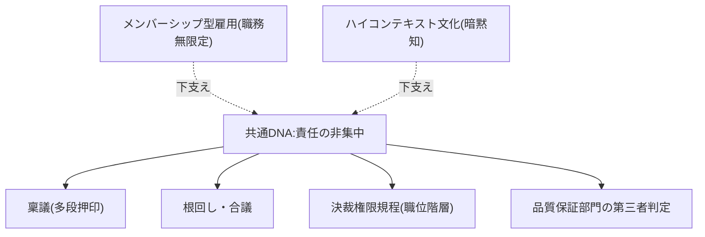
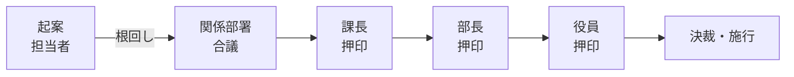
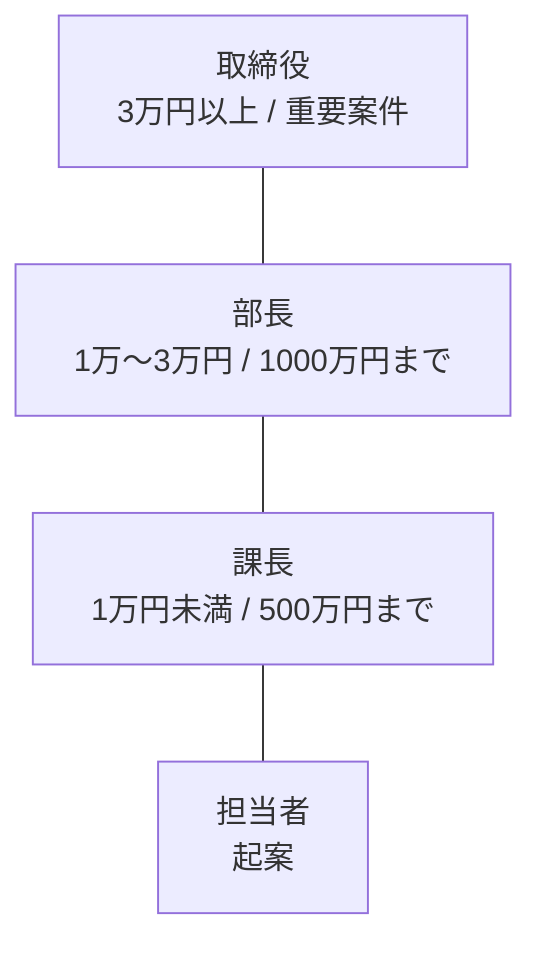
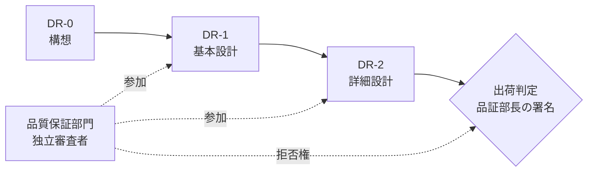
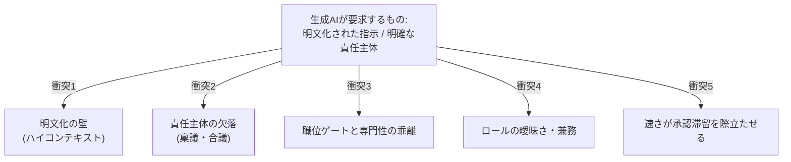

開発プロセス(ウォーターフォール、スクラム、ハイブリッド)の上には、必ず「日本企業の組織インフラ」が乗っています。このページは、そのインフラをプロセスから独立した層として体系化します。個別プロセスの調査メモで断片的に触れた日本的観点を、ここで1つにまとめます。

## 全体像: 共通DNAは「責任の非集中」

日本的ガバナンスの各要素は、1つの軸で貫けます。それは **「単一個人に決定権と結果責任を集中させない」** という方向性です。

この共通項が、海外発プロセスの「単一責任(プロダクトオーナー)」「明示的なロール」「投資判断としての Kill ゲート」と系統的に衝突します。

## 稟議制度

### 仕組みと責任分散という機能

稟議とは、起案者が**稟議書**を作成し、回覧して関係者の決裁(押印)を順に得ていくボトムアップ型の意思決定方式です。会議を開かずに文書だけで承認を集められる効率性が建前の機能です。

一方で実態としては、多数の押印が **「皆で決めた=誰も単独では決めていない」という責任分散装置**として働きます。行政学では、稟議制のもとでは最終決裁者と過程参加者の双方で結果への責任の自覚が乏しくなる、と批判されてきました(辻清明『新版・日本官僚制の研究』1969 以来の「稟議制批判論」)。

この責任分散文化は、スクラムの単一プロダクトオーナー原則(1人の人間であり委員会ではない)を制度的に拒む機序でもあります([ハイブリッド開発の実態](/process-compass/processes/hybrid/) の AP-2 参照)。

### デジタル化しても構造は残る

電子稟議(ワークフローシステム)は回覧を高速化します。しかし多段承認の段数そのものや責任分散構造は温存されます。電子化は「紙のフローの電子写像」であり、律速要因(段数・職位依存)は残ったままです。この点が、後述するAI自動化の限界に直結します。

## 根回し・合議

根回しとは、正式な決定の**前に**行われる非公式な調整です。稟議書が回覧される時点では、根回しによって決定は既に実質的に形成されており、稟議は形式(セレモニー)にすぎないことが多いといわれます。

ここから「意思決定は遅いが実行は速い」という両面性が生まれます。

- 遅い側面(である・体言止め): 合意が集まるまで議論が続き、決定に時間を要する
- 速い側面: 事前に関係者が納得しているため、いったん合意されると手戻りが少なく実行も速い

:::note
「実行が速い」という評価は日本的経営を肯定する文脈で語られがちで、実証データに基づく国際比較ではありません。「そう説明される」ものとして扱います。
:::

## 決裁権限規程: なぜ職位で承認者が決まるか

決裁権限規程は、部長・課長といった**職位**に付与される決裁の権限(特に金額の上限)を定めた社内規程です。「部長は1000万円まで、課長は500万円まで」のように、職位ごとに決裁できる金額の上限を設定します。

重要な含意は、**「誰が承認するか」が案件の専門性ではなく、金額のバンドと職位で機械的に決まる**という点です。その結果、技術的な妥当性を最もよく判断できる人(設計者・アーキテクト)と、承認権を持つ人(職位が上の人)が分離します。承認者は内容の専門家とは限りません。

## デザインレビュー(DR)と品質保証部門

### 規格上の定義

**デザインレビュー**は JIS Z 8115:2019(用語番号 192J-12-101)で「当該アイテムのライフサイクル全体にわたる設計活動に対する、**文書化された計画的な審査**」と定義されます。公式デザインレビュー(192-12-07)は「**文書化された独立した審査**」です。

キーワードは「文書化された」「計画的な」「独立した」の3つです。DR で重要なのは、属人的・非公式な扱いを避け、計画・記録・独立性をもって行う点であり、これが規格上の要件になります。

### 品質保証部門の出荷判定

品質保証部門は、顧客への責任を果たすため社内各部門から独立し、**品質が改善されるまで出荷を止める権限**を持つことが求められます。大手のSIer・メーカー系では、プロジェクトから独立したQA部門が「計画審査 → 工程終了審査 → 出荷判定」を運営します([ウォーターフォール](/process-compass/processes/waterfall/) の G0・G7)。

ただし実態では、品質保証部門の社内での位置づけが低く、独立性・拒否権が形骸化するケースも指摘されます。署名権(拒否権)の強さは会社差が大きく、医薬品GQPのような規制業種では法制化されている一方、一般ソフトウェアでは各社規程が非公開で横断像を描きにくいのが現状です。

## Stage-Gate と日本の決裁の構造的違い

海外の Stage-Gate(R.G.クーパー提唱)と日本の決裁は、「ゲートで上位職の人が承認する」という外形こそ似ているものの、機能は異なります。

| 観点 | Stage-Gate(海外) | 日本の決裁ゲート |
| --- | --- | --- |
| 判定者 | リソース(予算・人)の所有者 | 金額バンドに対応する職位 |
| 判定の主眼 | 投資対効果(この先へ投じ続けるか) | 規程適合・合意の有無 |
| Kill(中止)の扱い | 前提として含む(選択と集中) | 選ばれにくく、条件付き承認・差し戻しへ流れる |
| 本質的な機能 | 投資ポートフォリオ管理 | 合意形成と責任分散 |

## メンバーシップ型雇用とロールの曖昧さ

メンバーシップ型雇用(濱口桂一郎の概念)は「ヒトに値札を貼る」雇用で、職務内容を事前に明確化せず、企業が配置転換で別業務を割り当てられます。これがプロセスのロール定義と衝突します。

- ロールの曖昧さ(体言止め): 職務記述を持たないため「誰が何に責任を持つか」が契約上は未定義
- 兼務の常態化: 1人が複数ロールを兼ねる(PM/PL 兼務など)。スクラムの単一責任・専任性と衝突
- 異動によるロール断絶: 定期人事異動で担当が入れ替わり、責任の継続性・専門性の蓄積が阻害される

## ハイコンテキスト文化: 明文化を阻む土台

エドワード・T・ホールの分類で、日本はハイコンテキスト文化の典型です。「言わなくてもわかる」「空気を読む」暗黙の了解が成立しやすく、以心伝心・忖度・阿吽の呼吸として現れます。

業務では、要件・設計判断・レビュー基準・承認の勘所が「言わずともわかる」前提で暗黙化され、ドキュメントに書き下されません。これが成果物(要件定義書・設計書)の実質を空洞化させる遠因になります。

## 生成AI導入時の5つの衝突点

以上の日本的ガバナンスは、いずれも**暗黙性・責任分散・職位依存**を本質とします。生成AIは「明文化された指示」と「明確な責任主体」を要求するため、両者は構造的に衝突します。これこそ本プロジェクトが解くべき中心です。

1. **明文化の壁**: AIは暗黙知を読めない。空気・忖度で運んでいた要件を形式知化する追加コストが必要
2. **責任主体の欠落**: 稟議は責任を分散する装置なので、AI生成物を「誰が承認し責任を負うか」と噛み合わない
3. **職位ゲートと専門性の乖離**: 決裁者は金額×職位で決まり、AIや技術の妥当性を判断できるとは限らない
4. **ロールの曖昧さ・兼務**: AI活用ロールを定義しても、職務無限定・異動で継続しない
5. **速さがボトルネックを際立たせる**: AIで生成が速くなるほど、稟議・DRの承認滞留が顕在化する

これらの衝突点は、フェーズ3(ギャップ分析)で「理想(AIDLC 等)と現状(日本の決裁文化)の差分をどこで埋めるか」を考える出発点になります。各衝突には介入の方向性(暗黙知の形式知化、承認責任の単一主体への割り当て、技術判断ゲートと予算決裁ゲートの分離など)も見えており、フェーズ4で具体化します。

## 参考文献

- [JIS Z 8115:2019 ディペンダビリティ(総合信頼性)用語](https://kikakurui.com/z8/Z8115-2019-01.html) — デザインレビューの定義
- [澤田道夫「稟議制批判論」(熊本県立大学, 2005)](https://www.pu-kumamoto.ac.jp/users_site/sawada-m/articles/2005ringisystem-all.pdf)
- [濱口桂一郎 メンバーシップ型・ジョブ型(リクルートワークス研究所)](https://www.works-i.com/column/policy/detail017.html)
- [高・低文脈文化(エドワード・T・ホール)](https://ja.wikipedia.org/wiki/%E9%AB%98%E3%83%BB%E4%BD%8E%E6%96%87%E8%84%88%E6%96%87%E5%8C%96)
- [マネーフォワード 職務権限規程とは](https://biz.moneyforward.com/payroll/basic/60675/)
- [ステージゲート法(R.G.クーパー)](https://ja.wikipedia.org/wiki/%E3%82%B9%E3%83%86%E3%83%BC%E3%82%B8%E3%82%B2%E3%83%BC%E3%83%88%E6%B3%95_(%E6%89%8B%E6%B3%95))
- 詳細な調査メモ(全出典): リポジトリの `research/phase1/20260710-jp-governance.md`
