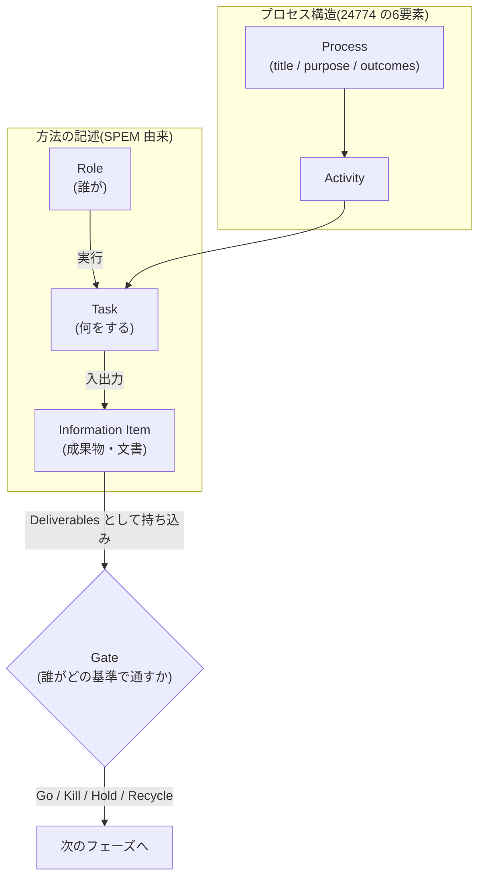

フェーズ1の各プロセス調査(ウォーターフォール、アジャイル、スクラム、TDD、イベント駆動、DDD、SDD、AIDLC)は、すべてこのフレームワークに従って記述します。同じ観点で書くことで、8つのプロセスを横断比較できるようにするのが目的です。

## 骨格: 国際標準への準拠

プロセス記述の国際標準 **ISO/IEC/IEEE 24774:2021** が定める6要素を骨格に採用します。ただし国際標準は「ロール」と「ゲート(決裁)」の記述が弱く、この2つこそ日本企業の実態調査で最重要の観点です。そこで **SPEM 2.0**(OMG)から Role を、**Stage-Gate 法**から Gate を補い、**「6+2要素」** を本プロジェクトの記述単位とします。

## 記述テンプレート: 6+2要素

| # | 要素 | 由来 | 記述ルール |
| --- | --- | --- | --- |
| 1 | **title(題名)** | 24774 | プロセスのスコープを表す短い名詞句 |
| 2 | **purpose(目的)** | 24774 | プロセスを実施する目標。簡潔に |
| 3 | **outcomes(成果)** | 24774 | 成功時に期待される**観察可能な結果**。成果物の産出と区別する |
| 4 | **activities(アクティビティ)** | 24774 | 成果を達成するための行為のまとまり。階層構造の中段 |
| 5 | **tasks(タスク)** | 24774 | 各アクティビティ内の具体的な作業。要求・推奨・許容の別を意識する |
| 6 | **information items(情報項目)** | 24774 | 入出力となる文書・成果物(要件定義書、設計書、バックログなど) |
| 7 | **roles(ロール)** | SPEM 2.0 | 誰がタスクの実行責任を持つか。**兼務の実態**も記述する(1人1役を仮定しない) |
| 8 | **gates(ゲート)** | Stage-Gate / JIS Z 8115 | 節目の審査。**Deliverables(持ち込む成果物)/ Criteria(判定基準)/ 判定者 / 判定結果の種類**の4点で記述する |

## 7観点との対応

Issue の受け入れ条件にある7つの調査観点は、6+2要素に次のとおり対応します。

| 調査観点 | 記述先の要素 |
| --- | --- |
| ロールモデル | roles |
| 組織的役割 | roles + gates の判定者(部門横断の参加構造) |
| DR・決裁ゲート | gates |
| マイルストーン成果物 | information items(gates の Deliverables と紐づけ) |
| レビュープロセス | activities / tasks(レビューを作業として記述)+ gates |
| 品質基準 | outcomes + gates の Criteria |
| 階層構造 | process → activities → tasks の3階層 |

## 階層構造と図解様式

プロセスは3階層で整理し、各階層に使う Mermaid 記法を固定します(詳細は[作図規約](/process-compass/community/style-guide-diagrams/))。

| 階層 | 内容 | 図解様式 |
| --- | --- | --- |
| 全体プロセス | フェーズの流れとゲート配置 | `graph LR` + ゲートは菱形ノード |
| フェーズ内ワークフロー | アクティビティの連なりとロールの関与 | `sequenceDiagram`(ロール間)or `graph LR` |
| 個別作業 | タスクの手順・判断分岐 | `flowchart` |

## 日本的観点の補強(標準がカバーしない領域)

国際標準に対応概念がないため、各調査で**独自に必ず確認する**観点です。

- **稟議・多段決裁**: 職位階層(担当 → 課長 → 部長 → 役員)に沿った承認や合議の有無。Stage-Gate のゲートキーパーが「リソースを出せる者」と定義されるのとの対比
- **品質保証部門の第三者レビュー**: 独立部門が合否の署名権を持つ構造の有無
- **受発注構造とレビューの二重性**: レビューが品質活動と契約上の検収を兼ねるか(SIer 構造)
- **建前と実運用の乖離**: 規定上のプロセスと現場の実態を**必ず分けて記述する**(例: DR の形骸化)
- **ロールの兼務**: ロールと人の多対多の対応関係

## 比較表の共通軸

フェーズ1の最後(#30)で作る横断比較表は、次の軸で統一します。

| 軸 | 内容 |
| --- | --- |
| 主要ロール | 定義されるロールと責任の所在 |
| ゲート構造 | ゲートの数・位置・判定者・判定基準 |
| 主要成果物 | 各フェーズの information items |
| レビュー方式 | 誰が・何を・どの形式で検証するか |
| 階層の深さ | プロセス分解の粒度 |
| 12207 対応 | ISO/IEC/IEEE 12207:2017 の4プロセス群(合意 / 組織 / テクニカルマネジメント / テクニカル)のどこを厚くカバーするか |

## スコープ外: 生成AIの現場利用実態

フェーズ1では**生成AIの利用実態は調査対象にしません**。現時点の現場利用は個人の思い付きレベルの野良活用が主で、調査しても根拠・実績の不足した「個人の理想論」しか集まらないためです。生成AIの組み込みはフェーズ2(理想形)とフェーズ3(ギャップ分析)で扱います。

## 記述例(ミニサンプル)

スクラムの「スプリントレビュー」を 6+2要素で書いた例です。

| 要素 | 記述 |
| --- | --- |
| title | スプリントレビュー |
| purpose | スプリントの成果を検査し、今後の進め方とプロダクトバックログを調整する |
| outcomes | インクリメントの状態が利害関係者と共有されている / バックログが更新されている |
| activities | 成果のデモ → フィードバック収集 → バックログ調整 |
| tasks | (activities をさらに分解して記述) |
| information items | インクリメント、プロダクトバックログ |
| roles | スクラムチーム全員 + 利害関係者(検査の主体) |
| gates | **正式なゲートではない**(Go/Kill 判定を持たない検査イベント)。この「ゲートを置かない」こと自体を記録する |

:::note
最後の行のように、「その要素が存在しない」ことも重要な調査結果です。空欄にせず「なし(理由・含意)」と書いてください。
:::

## 調査の進め方

1. 一次調査メモは `research/phase1/TEMPLATE.md` を複製して作成する(このテンプレートが 6+2要素と対応)
2. すべての記述に出典を付ける。一次情報(原典・公式ガイド・規格)を最優先とする
3. 清書時は図解ファーストに変換する(`research-to-docs` ワークフロー)

## 参考文献

- [ISO/IEC/IEEE 24774:2021 — Specification for process description](https://www.iso.org/standard/78981.html)
- [ISO/IEC/IEEE 12207:2017 — Software life cycle processes](https://www.iso.org/standard/63712.html)
- [OMG SPEM 2.0 — Software & Systems Process Engineering Meta-Model](https://www.omg.org/spec/SPEM/2.0/)
- [Stage-Gate International — The Stage-Gate Model: An Overview](https://www.stage-gate.com/blog/the-stage-gate-model-an-overview/)
- [IPA — 国際規格 SLCP の進化とそのポイント(共通フレーム)](https://www.ipa.go.jp/digital/kaihatsu/slcp/slcp-evolution-keypoints.html)
- JIS Z 8115:2019 ディペンダビリティ(総合信頼性)用語 — 192J-12-101「デザインレビュー」
- 詳細な調査メモ: リポジトリの `research/phase1/20260709-process-description-standards.md`
