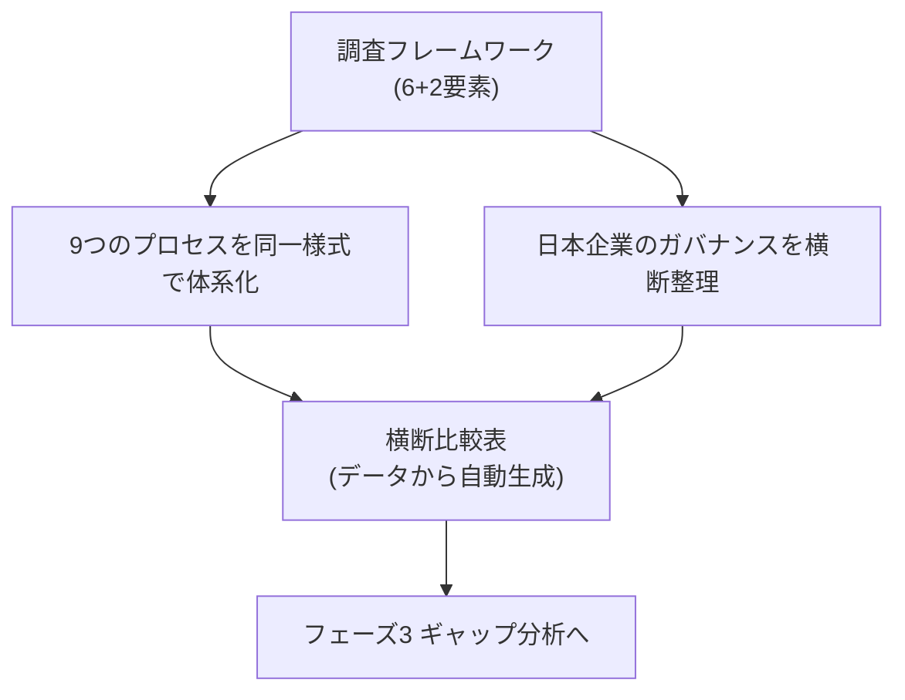
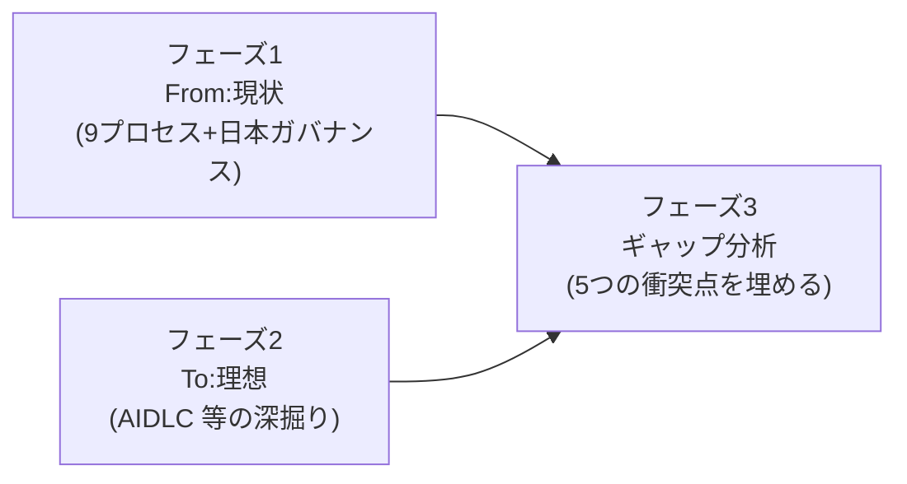

フェーズ1では、開発プロセスの現状(From)を体系的に整理しました。このページはその総括です。ここで見えた発見が、フェーズ3(ギャップ分析)の入力になります。

## 何を整理したか

- **調査フレームワーク**: ISO/IEC/IEEE 24774 の6要素に Role と Gate を加えた「6+2要素」で統一([調査フレームワーク](/process-compass/phase1-current-state/research-framework/))
- **9つのプロセス**: ウォーターフォール、アジャイル、スクラム、TDD、DDD、イベント駆動、仕様駆動(SDD)、AIDLC、そして日本の実態としての[ハイブリッド開発](/process-compass/processes/hybrid/)。すべて[スキーマ駆動](/process-compass/adr/0007-schema-driven-process-data/)で公開([プロセス体系](/process-compass/processes/))
- **日本企業のガバナンス**: 稟議・決裁権限規程・DR・品質保証体制などを「責任の非集中」という軸で整理([日本企業のガバナンス](/process-compass/phase1-current-state/jp-governance/))
- **横断比較表**: プロセスのデータから自動集計([プロセス横断比較表](/process-compass/processes/comparison/))

## 3つの発見

### 発見1: 意思決定は「集中」か「分散」かで二分される

プロセスを分ける最も本質的な軸は、意思決定を**フェーズ末の関門に集中させる(決裁型)**か、**反復のたびに分散・常時化する(検査型)**かでした。

| 型 | プロセス | 意思決定 |
| --- | --- | --- |
| 決裁型(事前承認・集中) | ウォーターフォール、AIDLC、SDD、ハイブリッド | 節目で Go/Kill を判断 |
| 検査型(事後適応・分散) | スクラム、アジャイル、TDD、DDD、イベント駆動 | 作ってから検査して直す |

### 発見2: 生成AI時代のプロセスは「決裁型」に回帰している

注目すべきは、生成AI時代の SDD・AIDLC が、スクラムなどが手放した**決裁型のゲートに回帰している**ことです。AIが高速に生成するからこそ、人間が要所で承認するゲート(Human-in-the-loop)を明示的に置きます。これが「場当たり生成(vibe coding)」との分かれ目でした。

つまり、生成AIは開発を「人が承認し責任を持つ」構造へ引き戻します。この点は、決裁文化を持つ日本企業にとってむしろ追い風になりうる論点です。

### 発見3: 日本のガバナンスの共通DNAは「責任の非集中」

稟議・合議・職位階層決裁・品質保証部門の第三者判定は、いずれも**単一個人に決定権と結果責任を集中させない**方向に働きます。メンバーシップ型雇用とハイコンテキスト文化がこれを下支えします。

この「責任の非集中」が、海外発プロセスの「単一責任(プロダクトオーナー)」や、生成AIが要求する「明確な責任主体」と系統的に衝突します。

## フェーズ2・3への橋渡し

フェーズ1で、生成AI導入時の[5つの衝突点](/process-compass/phase1-current-state/jp-governance/#生成ai導入時の5つの衝突点)(明文化の壁、責任主体の欠落、職位ゲートと専門性の乖離、ロールの曖昧さ・兼務、速さが承認滞留を際立たせる)を特定しました。

- **フェーズ2**: 理想像である AIDLC をさらに深掘りし、暗黙の前提条件を精緻化する(AIDLC の現状整理は[こちら](/process-compass/processes/aidlc/))
- **フェーズ3**: From と To を突き合わせ、5つの衝突点をどこで・どう埋めるかを設計する。各プロセスの**暗黙の前提条件**と**アンチパターン**が、そのまま導入リスクのチェックリストになる

## フィードバックのお願い

このフェーズ1の体系化は、多くの視点を取り込んで精度を上げていきたい部分です。「自社の実態と違う」「この観点が抜けている」といった声を [GitHub Issues](https://github.com/Takenori-Kusaka/process-compass/issues) でお寄せください。特に、日本企業でのハイブリッド開発の実態や、生成AI導入時の衝突の実体験は、フェーズ3の質を大きく左右します。
