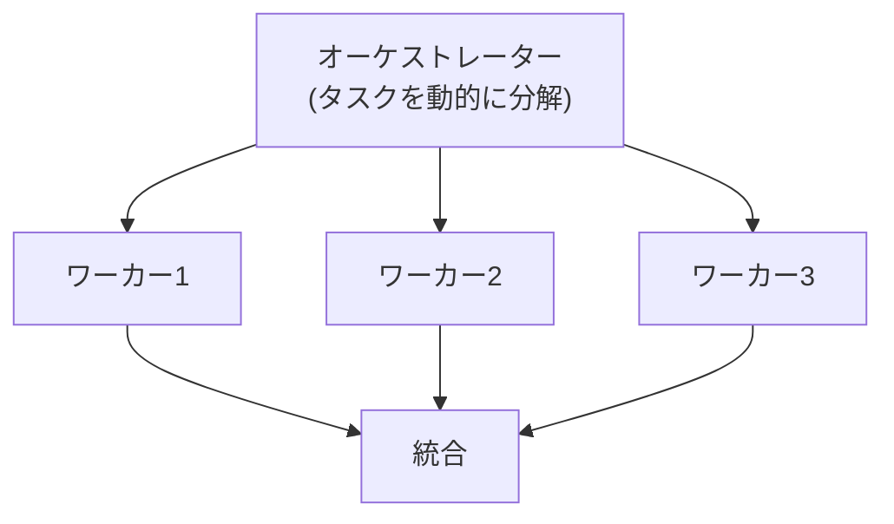
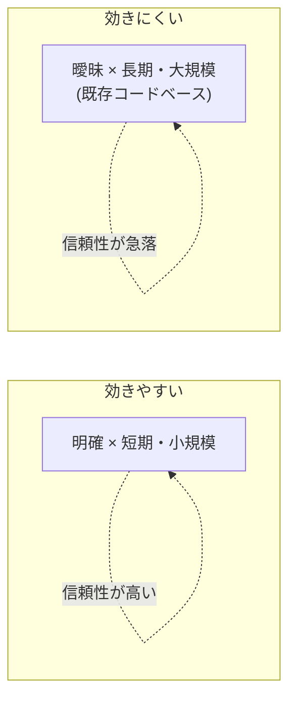

AIDLC の中核主張「AIエージェントがプロセス全体をオーケストレートする」は、**エージェント型開発**の技術に依存しています。このページでは、その技術が2026年時点でどこまで到達し、どこで壁に当たっているかを、建前(できると語られること)と現実(実際の到達点)に分けて整理します。

## エージェント型開発とは

補完型(Copilot 型)との違いは、**タスク全体を自分で計画し、複数ステップの試行錯誤を回す**点にあります。GitHub Issue やプロンプトを入力に、リポジトリの読解・環境構築・コード編集・テスト実行・PR作成までを自律的に進めます。

Anthropic は重要な区別を示しています。

- **ワークフロー**: LLM とツールが事前定義されたコードパスで統制される系。予測可能で一貫性がある
- **エージェント**: LLM が自らのプロセスとツール使用を動的に制御する系。柔軟だがコストと不確実性が上がる

公式の推奨は **「必要になるまで複雑にするな(まず最も単純な解を探せ)」** です。

## 主要な実装(建前 vs 現実)

| ツール | 提供者 | 建前(主張) | 現実の到達・限界 |
| --- | --- | --- | --- |
| Devin | Cognition | 完全自律エンジニア、数千の意思決定 | 既存コードベースで破綻。第三者検証で20件中成功3件 |
| SWE-agent | Princeton | ACIで LLM をSWエージェント化 | 足場(scaffold)設計の重要性を実証 |
| Codex | OpenAI | 並列タスク、PR提案 | GA化で信頼性向上。なお人間レビュー前提 |
| Copilot coding agent | GitHub | Issue→PR自律、テスト実行 | **PR作成者は自分のPRを承認不可**(独立レビュー強制) |
| Jules | Google | 非同期・並行・複数ファイル | GA済み。テスト作成・バグ修正が主用途 |
| Claude Code / Agent SDK | Anthropic | サブエージェント並列、長時間自律 | オーケストレーター/ワーカーの製品実装 |

## マルチエージェントの協調パターン

Anthropic は協調パターンを、定型(ワークフロー)から動的(エージェント)への段階で分類しています。中でも複雑タスク向けが **オーケストレーター/ワーカー**です。

注目すべきは業界のメタトレンドです。2024年の「エージェントが勝手に協働する」熱狂は、2025〜26年に **「制約された協調 + 人間の統制」** へ収束しました。AutoGen のメンテナンスモード化、OpenAI Swarm の教育用への格下げ、Anthropic・OpenAI の「まず単純に・コードで統制」推奨が、その証左です。

## 到達点と現実のギャップ

### ベンチマークは伸びたが、実務とは二重帳簿

実 GitHub Issue を解く SWE-bench Verified のスコアは、2年で大きく伸びました(いずれも各提供元の公式値)。

| 時期 | システム | 解決率 |
| --- | --- | --- |
| 2023末 | Claude 2 | 1.96% |
| 2024春 | SWE-agent / Devin | 12〜14% |
| 2025 | Claude Opus 4 系 | 72.5〜80.9% |

一方、Answer.AI が Devin を実タスク20件で検証した結果は成功3件でした。この2つは矛盾しません。前者は「明確に定義された単発Issue」、後者は「曖昧・既存コード・長期」のタスクだからです。

**エージェントが効く領域は、タスクの明確さと期間・規模で決まります。**

### 主要な限界

- **エラーの累積(複利的失敗)**: 各ステップの成功率が高くても、ステップ数が増えると全体の成功率が幾何級数的に下がる
- **ハルシネーション**: 存在しない機能を「ある」と捏造し、無効なアプローチを続ける(Devin が非対応のデプロイ先で1日以上試行した事例)
- **自己検証の循環依存**: 「AIが自らテストで検証」は、テスト自体の正しさを誰が保証するかが未解決
- **コスト**: マルチエージェントはトークン消費が単一の数倍〜十数倍になりうる
- **セキュリティ**: 外部ツール・シェル・ブラウザの自律操作が新たな攻撃面を生む

## 最大の律速は「人間の検証帯域」

これらの限界はすべて、AIDLCの「[受動的承認者(rubber stamp)化](/process-compass/processes/aidlc/#anti-patterns)」リスクに収束します。エージェントの生成速度と自律できるタスクの長さは伸び続けますが(METR の測定では自律タスクの時間地平が約7か月で倍加)、**人間の承認能力は伸びません**。理想像の脆弱点は、モデルの性能ではなく組織の検証キャパシティ設計にあります。

## 日本文脈での効きどころ

ここで示唆的なのが、GitHub の **「自分のPRを承認できない」設計**です。これはAIが作った成果を最低1人の独立した開発者がレビューすることを保証します。この仕組みは、日本の第三者レビュー(品質保証部門・独立検証)文化と**構造的に整合**します。

AIDLC の Mob(全員同席レビュー)より、むしろ**プラットフォームによる独立レビューの強制**の方が、日本の統制文化に載せやすい可能性があります。これはフェーズ3で理想と現実を写像する際の、有力な足場になります。

## 本プロジェクトへの含意

エージェント技術の現在地を踏まえると、Process Compass が描くべき To は「全自律のAIDLC」ではなく、**「制約された協調 + 人間の統制」**であるべきだと分かります。AIDLC の理想像は、エージェント技術の「単純明確タスクでの成功」を「ライフサイクル全域の自律」へ外挿したものです。無制約の全自律は、2026年時点では未到達です。

## 参考文献

- [Anthropic「Building Effective AI Agents」](https://www.anthropic.com/research/building-effective-agents)
- [Anthropic「How we built our multi-agent research system」](https://www.anthropic.com/engineering/multi-agent-research-system)
- [Answer.AI「Thoughts On A Month With Devin」](https://www.answer.ai/posts/2025-01-08-devin)
- [SWE-bench Verified](https://www.swebench.com/verified.html)
- [METR「Measuring AI Ability to Complete Long Tasks」](https://metr.org/blog/2025-03-19-measuring-ai-ability-to-complete-long-tasks/)
- [GitHub「Meet the new coding agent」](https://github.blog/news-insights/product-news/github-copilot-meet-the-new-coding-agent/)
- 詳細な調査メモ(全出典): リポジトリの `research/phase2/20260710-agentic-development.md`
