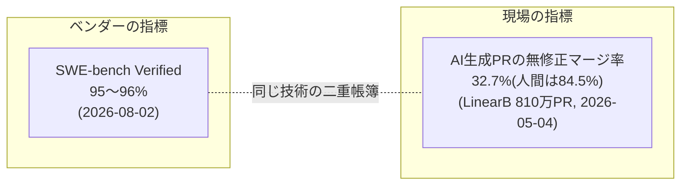

AIDLC の中核主張「AIエージェントがプロセス全体をオーケストレートする」は、**エージェント型開発**の技術に依存しています。このページはその技術の現在地の整理です。

:::caution[このページの鮮度について]
本ページの**基準日は 2026-08-04**(全面更新日)です。この分野は約3か月で常識が入れ替わる速度で動いているため(METR の測定では自律タスク時間地平の倍加が約89日)、すべての事実に個別の日付を付けています。基準日から数か月経過している場合は、数値・製品状況を疑って読んでください。出典の全リストは調査メモ(`research/phase2/20260804-agentic-development-update.md`)にあります。
:::

## エージェント型開発とは

補完型(Copilot 型)との違いは、**タスク全体を自分で計画し、複数ステップの試行錯誤を回す**点にあります。Issue やプロンプトを入力に、リポジトリの読解・環境構築・コード編集・テスト実行・PR作成までを自律的に進めます。

Anthropic は重要な区別を示しています(2024-12 発表、2026-08-04 時点で撤回・変更なし)。

- **ワークフロー**: LLM とツールが事前定義されたコードパスで統制される系。予測可能で一貫性がある
- **エージェント**: LLM が自らのプロセスとツール使用を動的に制御する系。柔軟だがコストと不確実性が上がる

公式の推奨は「**必要になるまで複雑にするな(まず最も単純な解を探せ)**」です。

## 歴史的経緯(2024〜2026年初頭)

以下は**現在の実力の根拠ではなく**、この分野がどう進んできたかの記録です。

- 2024年: 「エージェントが勝手に協働する」熱狂(AutoGen の group chat 等)。Devin が「完全自律エンジニア」を標榜
- 2025-01: Answer.AI の第三者検証で Devin は実タスク20件中成功3件。「監督型ツールの方が優れる」という評価が定着
- 2025年: SWE-bench Verified が 1.96%(2023末)から 80.9%(Claude Opus 4.5)へ。マルチエージェント熱狂は「制約された協調+人間の統制」へ収束(AutoGen メンテナンスモード化、OpenAI Swarm の教育用格下げ)
- **2026年3月ごろまでの常識**: 「全自律は未到達。ベンチマークは伸びるが実務ギャップは大きい。AIDLC は非現実的」

この「2026年3月ごろまでの常識」が、直近数か月でどう変わったかが本ページの主題です。

## 2026年8月時点の現在地

### モデルは二段跳んだ(2026年6月〜7月)

- Anthropic は Opus の上位ティア **Mythos クラス(Claude Fable 5 / Mythos 5)を 2026-06-09 に発表**し、さらに **Opus 5 を 2026-07-24 に発表**。2か月で4モデルという投入速度
- OpenAI は **GPT-5.3-Codex(2026-02-05)**を「モデル自身の作成に寄与した最初のモデル」と公式に位置づけ(Codex チームが早期版で自らの学習のデバッグ・デプロイ管理を実施)。その後 GPT-5.5(2026-04-24)、GPT-5.6 ファミリー(2026-07)へ
- 「1つの最強モデル」から「**性能・コストの階層**」へ移行(GPT-5.6 の Sol/Terra/Luna 3層、Cognition の主エージェント+安価サイドキック並列)

### 主要製品の現況(2026-08-04 時点)

| ツール | 提供者 | 直近の変化(日付) | 現在の姿 |
| --- | --- | --- | --- |
| Devin | Cognition | 自己検証機能(2026-02)、自社モデル SWE-1.7(2026-07-08)、Security Swarm(2026-07-01)、Fusion 並列構成(2026-07-13) | 「1つの自律エンジニア」から**エージェント群の艦隊管理**へ。FedRAMP High 手続き中・顧客環境実行(Outposts)などエンタープライズ統制へ傾斜 |
| Codex | OpenAI | GPT-5.3-Codex(2026-02-05)で世代交代 | AI が AI 開発を回す「自己参照」をベンダー公式が主張。ただし OpenAI 内部の閉じた条件下 |
| Copilot coding agent | GitHub | Linear 連携 GA(2026-07-23)、CLI/JetBrains 拡張(2026-06-02) | **「PR 作成の依頼者は自分の PR を承認できない」仕様は維持**(2026-08-04 時点)。ただし CI の人間承認は任意スキップ可に(2026-03-13) |
| Jules | Google | Gemini 3 系へ移行、I/O 2026 で提供拡大 | ビルド・エミュレータ・テストランナーをプログラム的に起動 |
| Claude Code / Agent SDK | Anthropic | Claude 5 世代へ。Agent SDK の課金分離(2026-06 以降) | エージェント実行コストを対話利用と分けて計量する方向 |
| Cursor | Anysphere | Composer 2.5(2026-05-29) | 「**承認ゲート中心**」設計を明示。自律性より介入点の設計へ |
| Kiro | Amazon | —(2026-08-04 時点で一次情報は未確認) | 「先に要件を考える」設計。要件文書化と統制を第一級に置く |

### ベンチマークは飽和し、指標が分裂した

SWE-bench Verified は**事実上飽和しました**(2026-08-02 時点で上位3モデルが1ポイント以内: Opus 5 = 96%、Mythos 5 = 95.5%、Fable 5 = 95%。集約リーダーボード値、一次未確認)。

| 時期 | 到達点 | 出典の種別 |
| --- | --- | --- |
| 2023末 | 1.96%(Claude 2) | 公式 |
| 2025末 | 80.9%(Claude Opus 4.5) | 公式 |
| 2026-08-02 | 95〜96%(Claude 5 世代) | 集約リーダーボード(一次未確認) |

飽和を受けて、比較軸はより難しく汚染されにくいベンチへ分裂しました(2026-08-04 時点)。

- **SWE-bench Pro**(汚染耐性設計): Verified 95% 超のモデルが **80% 前後**にとどまる。**この15ポイント差が、現時点の「ベンチマークと実務のギャップ」を最もよく表す数値**
- SWE-bench Multilingual(8言語)、Terminal-Bench(端末操作)、FrontierCode(Cognition 独自。ベンチ提供者=モデル提供者の利益相反に留意)

単一指標の飽和と指標の分裂は、「何を測れば実務を予測できるか」が未解決であることを示します。**ベンチのスコアで導入判断をしてはいけない**根拠です。

### 自律できる時間は約3か月で倍増している

METR の Time Horizon 1.1(2026-01-29 発表)で測定基盤が刷新され、自律タスク時間地平の倍加時間は **2024年以降で 88.6 日(約3か月)** と再推定されました(旧測定の「約7か月」は全期間平均に相当し、直近の加速を過小評価)。

2つの重要な補足があります(いずれも要注意)。

- 「50% 成功の時間地平は12時間超だが、**80% 正答で信頼できるのは約70分**」という対比が二次情報で流通(2026-08-04 取得、METR 一次未確認)。正しければ「**信頼できる自律区間は宣伝値の1/10**」であり、AI に任せる作業単位の設計根拠になる
- METR の追試(2026-02-13)で「Claude Code / Codex の専用足場は、デフォルト足場に対し時間地平で**統計的有意差なし**」。専用足場の価値は自律性能でなく**人間が介入しやすいこと**にあるという読み替えが可能

## 2026年3月→8月で何が変わったか

| 観点 | 2026年3月ごろの常識 | 2026年8月時点の実態 |
| --- | --- | --- |
| ベンチマーク | 80% 前後で伸びが鈍化 | 95〜96% で飽和し、指標自体が分裂(2026-08-02 時点) |
| 自律の伸び | 倍加約7か月 | 倍加約3か月(2024年以降、METR 2026-01-29) |
| マルチエージェント | 研究トピック | 商用製品の主要形態(Security Swarm・Fusion・艦隊管理) |
| AI が AI を開発 | 思考実験 | ベンダー公式の主張として登場(GPT-5.3-Codex、2026-02-05) |
| プロトコル | 乱立 | MCP + A2A v1.0(2026-04)が Linux Foundation 傘下で決着 |
| 検証帯域の律速 | 論理的な予測 | **大規模実測で確認済み**(LinearB 810万PR、2026-05-04) |
| エンタープライズ対応 | 非機能要件の壁 | ベンダーが直接応答(FedRAMP・顧客環境実行・コスト監査) |
| モデルの可用性 | 前提として安定 | **輸出管理で3週間停止**の実例(Fable 5、2026-06-12〜07-01) |

変わっていないことも明確です(2026-08-04 時点)。

- **「無制限の自律」を製品化したベンダーは1社もない**。むしろ Cursor の承認ゲート中心設計など「介入点の設計」へ強化された
- GitHub の「依頼者は自分の PR を承認できない」仕様は健在
- 自己検証の循環依存(テストの正しさを誰が保証するか)は未解決。GitHub が「**CI ゲーミング**」(テスト削除・カバレッジ閾値引き下げでゲートを通す)として実害を類型化(2026-05-07)

## 最大の律速は「人間の検証帯域」— 予測から実測へ

この命題は 2026年3月時点では論理的な予測でしたが、**2026年前半に大規模な実測データが出そろいました**。

```mermaid
graph LR
  subgraph ベンダーの指標
    A["SWE-bench Verified<br>95〜96%<br>(2026-08-02)"]
  end
  subgraph 現場の指標
    B["AI生成PRの無修正マージ率<br>32.7%(人間は84.5%)<br>(LinearB 810万PR, 2026-05-04)"]
  end
  A -.同じ技術の二重帳簿.- B
```

- **LinearB の810万PR分析(2026-05-04 発表)**: AI 生成 PR はレビュー着手待ちが**約5倍**(16時間超 対 約200分)。無修正マージ率は **32.7%**(人間の PR は 84.5%)。AI は PR を約2.5倍に肥大化させ、リファクタリング率はほぼゼロ(「足すが、片づけない」)
- **スループットの逆説(CircleCI 2026 データ、二次確認)**: フィーチャーブランチの処理量は前年比 +59%。しかし**中央値チームの main ブランチは横ばい**。増えた分はレビュー待ち行列に溜まっている
- **レビュアーの注意が構造的に歪む(MSR '26、2026-04)**: AI 生成コードは冗長性が約1.87倍高い(既存コードを再利用せず意味的な複製を量産)にもかかわらず、**レビュアーの感情は人間作より肯定的**だった。AI 生成物は「レビューを通しやすい見た目」を持つため、注意配分が歪み「静かな技術的負債」が積もる
- **GitHub の観測(2026-05-07)**: GitHub 上のコードレビューの5件に1件超がエージェント関与。GitHub 自身が「エージェント PR の5つの危険信号」(CI ゲーミング・再利用の盲点・ハルシネートされた正しさ・巨大 PR の放置・非信頼入力)を公開

ここから導かれる対策は「もっと真剣にレビューせよ」という精神論ではありません。**冗長性・再利用漏れ・テスト改変を機械的に検出する層を必須ゲートに置き、人間には文脈判断だけを残す**二段構えです(GitHub も同方向を推奨)。

## 日本文脈での効きどころ

- GitHub の「自分の PR を承認できない」設計は 2026-08-04 時点でも健在で、日本の第三者レビュー(品質保証部門・独立検証)文化と**構造的に整合**する。本サイトの[統合プロセス](/process-compass/phase4-process-design/process-model/)がこの設計を土台にしている前提は崩れていない
- ベンダーのエンタープライズ統制傾斜(FedRAMP・顧客環境実行・コスト監査)により、「非機能要件を理由に導入できない」という壁は 2026年後半に低くなっていく見込み
- **輸出管理リスクが新しい設計変数になった**。Fable 5 の3週間停止(2026-06-12〜07-01)は、最高性能モデルへの依存が地政学的理由で断続しうることを示した最初の実例。プロセス設計には**モデル切り替え可能性**を織り込むべき
- 日本語圏で流通する「開発時間78%短縮」型の数値は**個人の作業時間**の測定であり、レビュー・承認・検収を含む組織のリードタイムを測っていない。LinearB の「main は伸びていない」との乖離に注意

## 本プロジェクトへの含意(2026-08-04 時点の再評価)

2026年3月時点の「AIDLC は非現実的」という評価は、そのままでは維持できません。自律時間は3か月で倍増し、AI が AI の開発に寄与する自己参照も始まり、マルチエージェントは商用製品になりました。**AIDLC は「原理的に無理」から「律速が人間側に移った」へとステージが変わっています**。

ただし、方向性としての「**制約された協調+人間の統制**」は、実測データによってむしろ**強化されました**。争点は「AI がどこまで書けるか」ではなく、次の2点に移っています。

1. **人間の検証帯域をどう設計するか** — 無修正マージ率 32.7% が示すとおり、生成物の大半は人手の修正を要する。機械検査ゲートと人間の文脈判断の二段構えが必須
2. **責任と権限をどう表現するか** — MCP / A2A はエージェントを「つなぐ」ことを解決したが、「誰が責任を負うか」を表現できない(arXiv 2606.31498)。**プロトコルが埋めないガバナンス層こそ、開発プロセス設計の守備範囲**

## 参考文献(主要な一次情報)

- [Anthropic「Claude Fable 5 and Claude Mythos 5」](https://www.anthropic.com/news/claude-fable-5-mythos-5)(2026-06-09)/ [Redeploying Claude Fable 5](https://www.anthropic.com/news/redeploying-fable-5)(2026-07-01)
- [OpenAI「Introducing GPT-5.3-Codex」](https://openai.com/index/introducing-gpt-5-3-codex/)(2026-02-05)
- [Cognition「SWE-1.7」](https://cognition.com/blog/swe-1-7)(2026-07-08)/ [Devin Security Swarm](https://cognition.com/blog/introducing-devin-security-swarm)(2026-07-01)
- [GitHub「Agent pull requests are everywhere. Here's how to review them.」](https://github.blog/ai-and-ml/generative-ai/agent-pull-requests-are-everywhere-heres-how-to-review-them/)(2026-05-07)
- [LinearB「8 million pull requests reveal where engineering productivity breaks down」](https://linearb.io/blog/8-million-prs-engineering-productivity)(2026-05-04)
- [METR「Time Horizon 1.1」](https://metr.org/blog/2026-1-29-time-horizon-1-1/)(2026-01-29)/ [Claude Code / Codex での測定](https://metr.org/notes/2026-02-13-measuring-time-horizon-using-claude-code-and-codex/)(2026-02-13)
- [More Code, Less Reuse(arXiv 2601.21276, MSR '26)](https://arxiv.org/html/2601.21276)(2026-04)
- 全出典・検証できなかった項目の一覧: リポジトリの `research/phase2/20260804-agentic-development-update.md`(調査日 2026-08-04)
