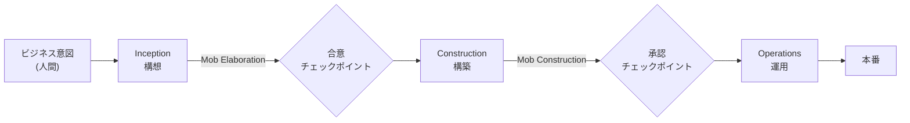
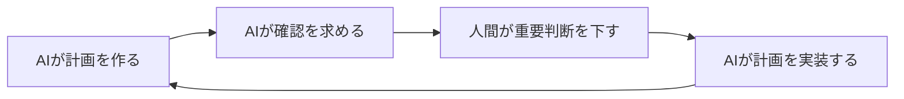
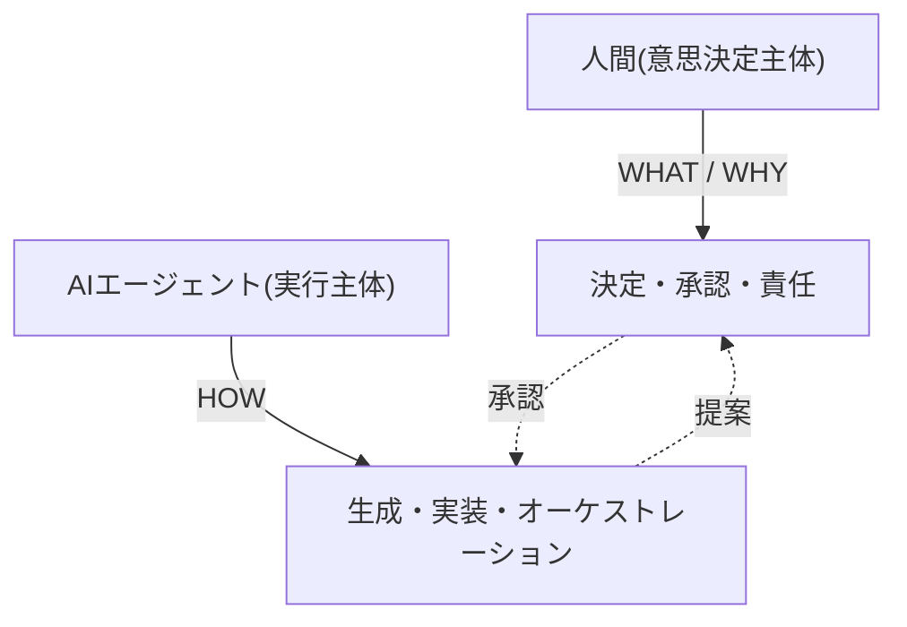

フェーズ2では、生成AIを前提とした「理想の開発プロセス(To)」を整理します。その中核が **AIDLC(AI-Driven Development Life Cycle)** です。このページは AIDLC が提唱するライフサイクルの全体像を図解します。

:::note
AIDLC のロール・成果物・ゲートを 6+2 要素で構造化したデータ駆動の詳細(L1→L2→L3 のドリルダウン)は、[プロセス体系の AIDLC ページ](/process-compass/processes/aidlc/)にあります。このページはフェーズ2の文脈で「理想像」として全体像を俯瞰する位置づけです。
:::

## 一言でいうと

AIエージェントが計画・要件・コード・テスト・インフラ構成の生成をライフサイクル全段でオーケストレーションし、人間は各要所で検証・承認・重要判断を担う——AIを開発の中心に据え直した方法論です。AWS が2025年に提唱しました。

スローガンは **「人は WHAT と WHY を、AI が HOW を」** です。

## ライフサイクルの全体像

どのフェーズも内側に、AIが生成して人間の承認を受ける共通ループを持ちます。

## 3つのフェーズ

| フェーズ | 内容 | 特徴的な概念 |
| --- | --- | --- |
| **Inception(構想)** | ビジネス意図を要件・ストーリー・ユニットへ変換する | **Mob Elaboration**(全ロール同席でAIの問い・提案を検証) |
| **Construction(構築)** | 論理アーキテクチャ・ドメインモデル・コード・テストを生成する | **Mob Construction**(技術判断にチームがリアルタイムで指針を与える) |
| **Operations(運用)** | IaC・デプロイ・監視を管理する | 現状は placeholder で未成熟 |

## 2つの新しい単位: Bolt と Mob

AIDLC の新規性は「粒度」と「同期」にあります。

- **Bolt(ボルト)**: 従来の2〜4週のスプリントを、数時間〜1日以内の短く濃密なサイクルに置き換える時間箱
- **Mob(モブ)**: PM・開発者・QA・運用が同じ場でAI生成物をリアルタイム検証する集団レビュー。従来の逐次ハンドオフを排する

この2つで開発を圧縮するのが、生産性向上(AWS は10〜15倍と主張)の源泉とされます。ただしこの数値は提唱者の自己申告で、独立検証は確認できていません。

## ロールの分担

人間はアーキテクチャ判断・ビジネス整合・リスク評価・重要判断の承認を担い、AIはタスク分解・生成・テスト作成・リファクタリングを担います。「The agent proposes, the human approves(AIは提案し、人間は承認する)」を設計思想としています。

## なぜこれが「To(理想)」なのか

本プロジェクトは、この AIDLC を**そのまま導入するのではなく、日本の組織で運用できる形に落とし込む**ことを目指します。AIDLC は理想像として明快ですが、[日本企業のガバナンス](/process-compass/phase1-current-state/jp-governance/)(稟議・決裁権限規程・品質保証部門)とそのまま組み合わせると、複数の衝突が起きます。

その衝突を測るために、AIDLC が**暗黙に置いている前提条件**を明らかにする必要があります。これはフェーズ2の「理想モデルの前提条件一覧」(別途整理)で扱い、フェーズ3のギャップ分析の物差しにします。

:::caution
AIDLC のアンチパターン(受動的な承認者化・ドキュメントの陳腐化・責任分界の空白)と、日本企業固有の衝突点は、[AIDLC プロセスページ](/process-compass/processes/aidlc/)に整理済みです。理想像を鵜呑みにせず、この現実の懸念とセットで読むことが重要です。
:::

## 参考文献

- [AWS DevOps Blog「AI-Driven Development Life Cycle」(原典)](https://aws.amazon.com/blogs/devops/ai-driven-development-life-cycle/)
- [GitHub awslabs/aidlc-workflows(公式実装)](https://github.com/awslabs/aidlc-workflows)
- 詳細な調査メモ: リポジトリの `research/phase1/20260710-aidlc.md`
