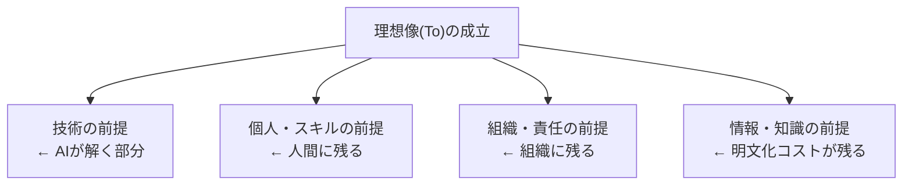

フェーズ2で整理した「理想像(To)」は、明示されないまま多くのことを前提にしています。このページは、その**暗黙の前提条件**を一覧化します。フェーズ3では、これらの前提が日本企業の現場で成立するかを1つずつ検証し、崩れる点をギャップとして扱います。

## 前提の全体像: AIが解くのは一部だけ

理想像は「AIが実装を担えば全部解決する」かのように語られがちです。しかし前提を分解すると、**AIが解くのは技術の前提だけ**で、個人・組織・知識の前提は人間の問題として残ります。ここが理想と現実のギャップの源泉です。

## 前提条件の一覧

### 技術の前提(AIが解こうとしている部分)

| # | 前提 | 崩れると | 出典 |
| --- | --- | --- | --- |
| T1 | 高品質なモデル(ハルシネーション率が人間の検証で吸収できる範囲) | 生成物が信用できず検証コストが爆発する | [AWS AI-DLC](https://aws.amazon.com/blogs/devops/ai-driven-development-life-cycle/) |
| T2 | エージェントが長期タスクを自律遂行できる | ステップ数が増えると成功率が幾何級数的に低下する | [METR](https://metr.org/blog/2025-03-19-measuring-ai-ability-to-complete-long-tasks/) |
| T3 | AIの自己検証(テストで自己修正)が機能する | テスト自体の正しさを誰が保証するかが循環する | [Anthropic](https://www.anthropic.com/engineering/demystifying-evals-for-ai-agents) |
| T4 | 包括的な自動テストとCI基盤が既にある | 自己検証の前提が崩れる | [AWS AI-DLC](https://aws.amazon.com/blogs/industries/ai-driven-development-lifecycle-for-financial-services/) |

### 個人・スキルの前提(人間に残る部分)

| # | 前提 | 崩れると | 出典 |
| --- | --- | --- | --- |
| P1 | 価値判断能力(作るべきかを判断できる) | AIに判断を委ね、価値判断そのものが空洞化する | [CIO](https://www.cio.com/article/4190086/the-rise-of-the-product-engineer-how-ai-is-reshaping-modern-tech-teams.html) |
| P2 | 言語化能力(意図を曖昧さなく仕様に落とせる) | AIに渡す仕様が不完全になる | [Sean Grove](https://lawwu.github.io/transcripts/8rABwKRsec4.html) |
| P3 | 検証能力(AI生成物が仕様を満たすか評価できる) | 誤りを見抜けず受動的承認者に堕す | [AWS AI-DLC](https://aws.amazon.com/blogs/devops/ai-driven-development-life-cycle/) |
| P4 | これらの能力が希少でなく個人に揃う | 希少資源がコード能力から判断能力へ移るだけで偏在は解消しない | [PO中心編成の調査](/process-compass/phase2-aidlc/po-centric-team/) |

### 組織・責任の前提(組織に残る部分)

| # | 前提 | 崩れると | 出典 |
| --- | --- | --- | --- |
| O1 | 意思決定の権限が個人にある(組織全体がその決定を尊重する) | 決めても承認が職位階層で滞留する | [Scrum Guide 2020](https://scrumguides.org/scrum-guide.html) |
| O2 | 説明責任が一意に紐づく(明確な責任者) | AIの説明責任が拡散し、誰も責任を負わない | [Big Agile](https://big-agile.com/blog/who-owns-ai-generated-code-when-it-ships-building-a-chain-of-human-accountability) |
| O3 | 人間の検証キャパシティが生成速度に追随できる | チェックポイントが形骸化する(rubber stamp化) | [awslabs/aidlc-workflows](https://github.com/awslabs/aidlc-workflows) |

### 情報・知識の前提(明文化コストが残る部分)

| # | 前提 | 崩れると | 出典 |
| --- | --- | --- | --- |
| K1 | ビジネス意図が言語化可能(全員が作るものに合意できる) | レガシー・暗黙知の多い現場ほど成立しない | [AWS AI-DLC](https://aws.amazon.com/blogs/devops/ai-driven-development-life-cycle/) |
| K2 | 暗黙知を形式知に表出化できる | 表出化コストが発生し、言語化不能な残余は渡らない | [ポランニーの逆説](https://en.wikipedia.org/wiki/Polanyi%27s_paradox) |
| K3 | ステアリングファイル等のガードレールが正しく符号化されている | 規制・セキュリティ・組織標準がAIに伝わらない | [Anthropic](https://www.anthropic.com/engineering/effective-context-engineering-for-ai-agents) |

## この一覧の使いみち

この前提条件一覧が、フェーズ3(ギャップ分析)の**物差し**になります。フェーズ1で整理した[日本企業のガバナンス](/process-compass/phase1-current-state/jp-governance/)と突き合わせると、特に**個人・組織・知識の前提(P・O・K)が日本の現場で系統的に崩れる**ことが見えます。

- O1(個人の決定権)↔ 決裁は金額×職位で決まる
- O2(説明責任の一意性)↔ 稟議は責任を分散する装置
- K1・K2(言語化・表出化)↔ ハイコンテキストの暗黙知

つまり本プロジェクトの介入点は、**AIが解く技術の前提(T)を待つことではなく、P・O・Kの前提を日本の組織文化の中で成立させる仕組みを設計すること**にあります。この設計がフェーズ3以降の主題です。

:::note
各前提の詳細な根拠は、フェーズ2の個別ページ([AIDLC](/process-compass/phase2-aidlc/aidlc-lifecycle/)、[エージェント型開発](/process-compass/phase2-aidlc/agentic-development/)、[PO中心編成](/process-compass/phase2-aidlc/po-centric-team/)、[コンテキストエンジニアリング](/process-compass/phase2-aidlc/context-engineering/))と、`research/phase2/` の各調査メモにあります。
:::
