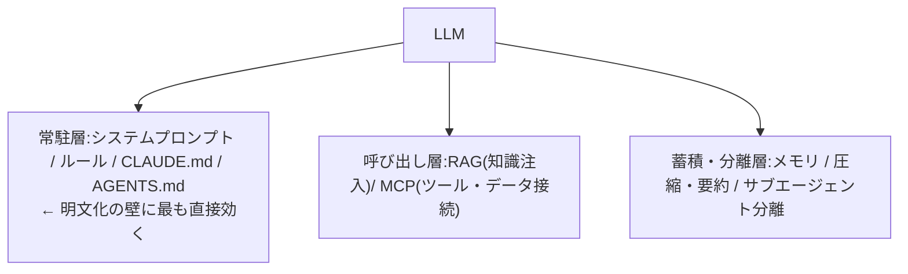
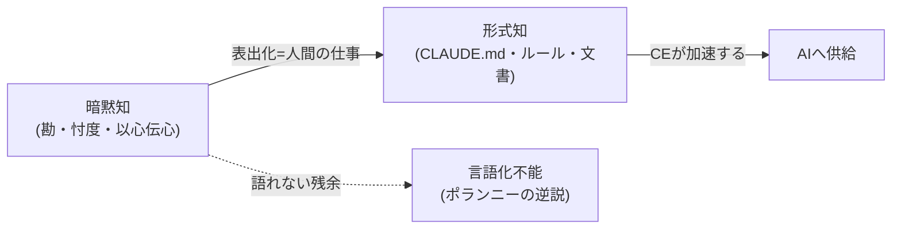

フェーズ1で特定した[明文化の壁](/process-compass/phase1-current-state/jp-governance/)——人のハイコンテキストな暗黙知をどうやって生成AIに渡すか——への技術的な回答が、**コンテキストエンジニアリング(CE)**です。このページでは、その手法体系と、越えられる限界・越えられない限界を整理します。

## コンテキストエンジニアリングとは

Anthropic は CE を「推論中の**最適なトークン集合を厳選・維持する戦略群**」と定義します。単発の指示文を練るプロンプトエンジニアリング(PE)の上位概念です。

- **PE**: 1回の指示文をうまく書く。属人的・その場限り
- **CE**: 文脈全体(システム指示・ツール・外部データ・履歴・メモリ)を持続的に設計・管理する

本プロジェクトにとって重要なのは、**CEが「組織の暗黙知を持続的にAIへ供給する基盤」になる**点です。明文化の壁に対しては、単発のPEではなく、CEの永続化手法が本命の回答になります。

## コンテキストの層

CE の手法は、モデルに近い内側から外側へ、層として整理できます。

| 層 | 手法 | 役割 |
| --- | --- | --- |
| 常駐 | CLAUDE.md、AGENTS.md、ルール、few-shot例 | 組織の勘所を明示テキストとして常駐させる(トップダウンの明文化) |
| 呼び出し | RAG、MCP | 既存の文書・基幹システムを再学習なしに接続する(既存資産の連結) |
| 蓄積・分離 | メモリ、圧縮、サブエージェント | 経験の蓄積と、規模(量)への対処 |

## CE の本質は「注意の配分の設計」

CE で見落とされがちなのは、**「全部入れれば安心」は誤り**という点です。コンテキストが長くなるほど情報の想起精度が下がる **context rot(文脈の劣化)**が知られています。トランスフォーマーの構造上、トークン数が増えると注意機構が関係を捉えきれなくなるためです。

だから CE は「知識を足す技術」というより、**引き算(選択・圧縮・分離・忘却)の技術**として理解すると一貫します。Anthropic の言葉を借りれば、規律は網羅性ではなく **「容赦ない優先順位付け」**です。600行の CLAUDE.md は、モデルが最も大事なルールを無視しうるファイルを与えてしまいます。

## 暗黙知の形式知化: どこまで越えられるか

CE を知識経営論(野中の SECI モデル、ポランニーの暗黙知)の座標に置くと、**CEが確実に扱えるのは「表出化以降(形式知になった後)」**だと分かります。

- **越えられる部分**: 「書けば書けるのに、ハイコンテキスト文化ゆえ書いてこなかった暗黙の前提」(要件の勘所・レビュー基準・設計判断の理由)。これを表出化(ルール執筆)+連結化(RAG/MCP)でAIに供給できる
- **越えられない部分**: ポランニーの逆説「**語れる以上のことを知っている**」に属する、言語化できない身体知。CEはテキストを運ぶ技術なので、言語化されない暗黙知はどんなに配管を整えても渡らない。これは工学では突破できない理論上の天井

重要なのは、**暗黙知を言葉にする「表出化の変換労働」そのものは人間に残る**という点です。CEは知識創造サイクルを代替せず、形式知になった瞬間からの伝播を加速するだけです。最初の一歩(暗黙知を書き下す)は人が踏みます。

## 本プロジェクトへの含意

CEは明文化の壁を越える主要な技術的手段です。ただし2つのコストが伴います。

1. **明文化コスト** — CEは「暗黙知の表出化を人間が行うこと」を前提とする。日本企業は従来これを書かずに済ませてきたため、表出化コストが新規に発生する。フェーズ1で指摘した「AI利用のための追加コスト=暗黙知の形式知化」そのもの
2. **責任主体の問題** — CLAUDE.md やルールを「誰が書き、誰が保守し、誰が正しさを保証するか」は、責任分散文化では宙に浮きやすい。CEの永続ファイルは**単一の責任主体(オーナー)を要求する**ため、稟議的な責任分散と再び衝突する

逆説的に、ハイコンテキスト文化は「表出化を怠っても回る」ように最適化された組織です。CEの導入は、その組織に**表出化を強制する外圧**として働きます。これは負担であると同時に、暗黙知の棚卸し・属人性の解消という副次効果(建前=AI活用、実効=ナレッジマネジメントの強制執行)をもたらしうる論点です。

プロセス提案ツールとしては、事業フェーズやチーム体制に応じて「どのCE層をどの粒度で整備すべきか」を段階設計として推奨できます(小規模初期はCLAUDE.md中心、規模拡大でRAG/MCP・サブエージェント分離を追加)。

## 参考文献

- [Anthropic「Effective context engineering for AI agents」](https://www.anthropic.com/engineering/effective-context-engineering-for-ai-agents)
- [Anthropic「Introducing the Model Context Protocol」](https://www.anthropic.com/news/model-context-protocol)
- [Lewis et al.「Retrieval-Augmented Generation」(RAG 原典, 2020)](https://arxiv.org/abs/2005.11401)
- [SECIモデル(野中郁次郎)](https://ja.wikipedia.org/wiki/SECI%E3%83%A2%E3%83%87%E3%83%AB)
- [Polanyi's paradox(暗黙知)](https://en.wikipedia.org/wiki/Polanyi%27s_paradox)
- 詳細な調査メモ(全出典): リポジトリの `research/phase2/20260710-context-engineering.md`
