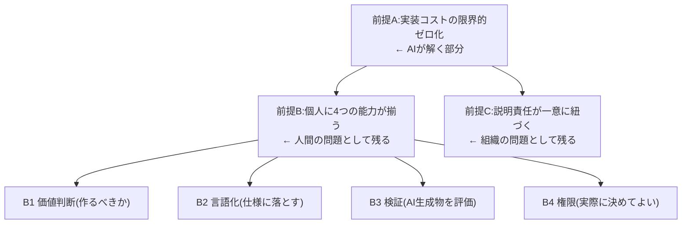

「AIDLC では、人は本当に決めることだけをやり、プロダクトオーナー(PO)として動くチームだけが存在する」——本プロジェクトの出発点にあるこの理想像を掘り下げ、それが暗黙に置いている**前提条件**を明らかにします。

## 理想像の正体は「ボトルネックの上流移動」

「POだけのチーム」は独立した組織論ではありません。**実装が commodity 化すれば、律速は「作れるか」から「作るべきか」へ移る**という1つの因果の帰結です。AWS・Sean Grove・業界メディアが、別々の言葉で同じ論理を語っています。

- AWS AI-DLC: AIが計画・コード・テストを生成し、人間は検証・承認・説明責任を保持する
- Sean Grove(OpenAI): コードは価値の10〜20%、残り80〜90%は「構造化されたコミュニケーション(仕様)」。最も効果的に伝える人が最も価値あるプログラマー
- 業界メディア: 律速が「実装」から「評価」へ移り、エンジニアとPMが中間で出会う「Product Engineer」へ収束する

:::note
重要な区別: AWS の一次資料は「1 PO + 3 開発者」と、**PO と開発者を依然として区別**しています。「POだけのチーム」は、この記述を理念的に極限化した表現です。理想像を語るときは、この2つを分けて扱う必要があります。
:::

## 前提条件の依存ツリー

この理想が成立するために、明示されないまま仮定されている条件があります。依存関係で見ると、**AIが解くのは一番下の前提Aだけ**で、その上の前提B・Cは人間と組織の問題として残ります。ここが理想と現実のギャップの源泉です。

理想像は「Aが解ければ全部解ける」かのように語ります。しかし現実の律速は、実装から評価・判断(B)と責任の一意性(C)へ**移動するだけで消えません**。

## 従来編成との対比

| 観点 | 従来編成(役割分担) | PO中心編成(理想像) |
| --- | --- | --- |
| 分業原理 | 職能で水平分業(PO/SM/開発/QA) | 実装はAIへ委譲、人間は判断へ集約 |
| 律速 | 実装capacity | 評価・判断(should we?) |
| 人数 | 1 PO + 多数の専門職 | 少人数化(1 PO + 少数、または PO のみ) |
| 価値の源泉 | コードを書く能力 | 仕様を書く・判断する能力 |
| 作業単位 | 週単位スプリント | 時間〜日単位の Bolt |

この「小さく独立したチームが単一責任を負う」姿は、Amazon の two-pizza team や single-threaded owner(唯一の責任者が全責任を負う)の系譜にあります。ただし Amazon 自身、two-pizza team だけでは不足だとして責任者モデルへ補正した経緯があり、**小規模化それ自体は成果を保証しません**。

## 現実の懸念

### 全員がPOになれるのか(スキルの偏在)

前提B(4能力が個人に揃う)は強い仮定です。判断・taste・言語化・検証はいずれも希少で、教育コストが高いものです。Grove の「自然言語だから誰でも仕様を書ける」という主張は、**書ける人と「良い仕様を書ける人」を混同**している疑いがあります。希少資源がコード能力から仕様・判断能力へ移るだけで、偏在は解消しません。

### 責任の拡散

鋭い指摘があります。「AIは説明責任を消さず、**拡散させた(diffused it)**」というものです。ある調査では、AIで開発速度が3〜4倍になる一方、月間のセキュリティ問題が10倍に急増したと報告されています。ガバナンス文書で個人を owner に指名しても、その人が原因を診断・介入できなければ、**能力と説明責任が分離した空虚な所有**になります。

実装が速くなるほど、説明責任を一意に保つ設計(前提C)を明示的に作り込まないと、責任は霧散します。

## 日本の組織文化との衝突

PO中心編成は**単一個人への決定権・責任の集中**を要求します。これは[日本企業のガバナンス](/process-compass/phase1-current-state/jp-governance/)で整理した「責任の非集中」DNAと、ほぼ全項目で逆を向きます。

| PO中心編成の前提 | 日本ガバナンスの実態 | 衝突 |
| --- | --- | --- |
| 単一責任(one person, not a committee) | 合議・稟議による責任分散 | 単一責任を制度的に拒む |
| 個人に決定権限がある(前提B4) | 決裁は金額×職位で決まる | 現場のPOに決裁権が降りず、決めても承認が滞留 |
| 一貫した単一責任主体 | メンバーシップ型の兼務・異動 | 責任の継続性・専門性が保てない |
| 仕様を言語化する(前提B2) | ハイコンテキストの暗黙知 | そもそも仕様化されない情報が多い |

さらに、AIで生成が速くなるほど多段承認(稟議)の遅さがボトルネックとして際立ち、「決めるだけの人」の理想と、実際には「決められない・決裁が降りない」現実の乖離が拡大します。

## 本プロジェクトへの含意

したがって本プロジェクトの介入点は、「PO中心の理想をそのまま輸入する」ことではありません。**責任分散文化の中で、AI成果物の説明責任を一意化する軽量な仕組み**を設計することにあります。この設計はフェーズ3(ギャップ分析)とフェーズ4(詳細策定)で具体化します。

## 参考文献

- [AWS DevOps Blog「AI-Driven Development Life Cycle」](https://aws.amazon.com/blogs/devops/ai-driven-development-life-cycle/)
- [Sean Grove「The New Code」(トランスクリプト)](https://lawwu.github.io/transcripts/8rABwKRsec4.html)
- [The 2020 Scrum Guide](https://scrumguides.org/scrum-guide.html)
- [AWS Executive Insights「Amazon's Two Pizza Teams」](https://aws.amazon.com/executive-insights/content/amazon-two-pizza-team/)
- [Big Agile「Who Owns AI-Generated Code When It Ships」](https://big-agile.com/blog/who-owns-ai-generated-code-when-it-ships-building-a-chain-of-human-accountability)
- 詳細な調査メモ(全出典): リポジトリの `research/phase2/20260710-po-centric-team.md`
