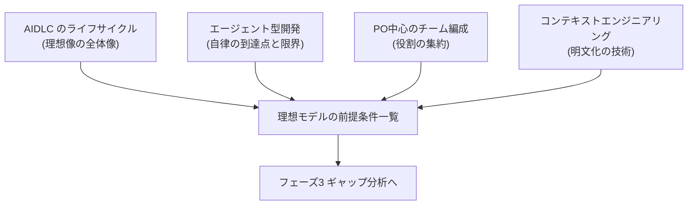
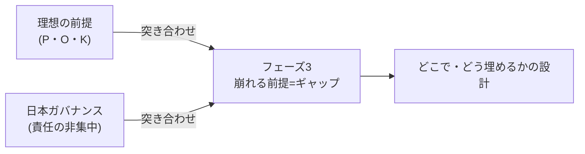

フェーズ2では、生成AIを前提とした「理想の開発プロセス(To)」を掘り下げました。このページはその総括です。

## 何を整理したか

- [AIDLC のライフサイクル全体像](/process-compass/phase2-aidlc/aidlc-lifecycle/) — Inception/Construction/Operations、Bolt/Mob、人間の承認ループ
- [エージェント型開発の現在地](/process-compass/phase2-aidlc/agentic-development/) — 自律の到達点と限界
- [プロダクトオーナー中心のチーム編成論](/process-compass/phase2-aidlc/po-centric-team/) — 役割の判断への集約
- [コンテキストエンジニアリング](/process-compass/phase2-aidlc/context-engineering/) — 暗黙知をAIに渡す技術
- [理想モデルの前提条件一覧](/process-compass/phase2-aidlc/assumptions/) — 上記を貫く前提の統合

## 一貫して見えた発見: 前提の非対称性

フェーズ2の全テーマを貫く発見は、**理想像が「AIさえ賢くなれば全部解決する」かのように語られるのに対し、実際にAIが解くのは前提の一部にすぎない**という非対称性です。

- **AIが解こうとしている**: 実装コストのゼロ化、生成の高速化、自己検証
- **人間・組織に残る**: 価値判断・言語化・検証の能力(個人)、決定権限と説明責任の一意性(組織)、暗黙知の表出化(知識)

エージェント型開発の現在地(ベンチマークは伸びるが実務ギャップは大きい)、PO中心編成の依存ツリー(AIが解くのは前提Aのみ)、コンテキストエンジニアリングの限界(表出化の変換労働は人間に残る)——いずれも同じ構造を別の角度から示していました。

## もう一つの発見: 生成AIは「人が承認し責任を持つ」構造を要求する

理想像は「人は決めるだけ」と語りますが、技術の現実はむしろ逆でした。生成が速く自律的になるほど、**人間の検証帯域が最大の律速点**になります。だからこそ、AIDLC と SDD はどちらも Human-in-the-loop の承認ゲートを明示的に置き、GitHub は「自分のPRを承認できない」独立レビューを強制します。

これはフェーズ1の発見(生成AIは決裁型プロセスに回帰する)と符合します。そして、**独立した第三者レビューを制度化してきた日本の品質保証文化には、むしろ追い風になりうる**という重要な論点でもあります。

## フェーズ3への橋渡し

フェーズ2で作った[前提条件一覧](/process-compass/phase2-aidlc/assumptions/)を、フェーズ1で整理した[日本企業のガバナンス](/process-compass/phase1-current-state/jp-governance/)と突き合わせると、崩れる前提が系統的に見えます。

本プロジェクトの介入点は、**AIが賢くなるのを待つことではなく、個人・組織・知識の前提(P・O・K)を日本の組織文化の中で成立させる仕組みを設計すること**にあると確定しました。これがフェーズ3(ギャップ分析)とフェーズ4(詳細策定)の主題になります。

## フィードバックのお願い

理想像は語り手によって幅があり、日々更新されています。「この理想はこう捉えるべき」「この前提は現場では違う」という声を [GitHub Issues](https://github.com/Takenori-Kusaka/process-compass/issues) でお寄せください。フェーズ3のギャップ分析の質を大きく左右します。
