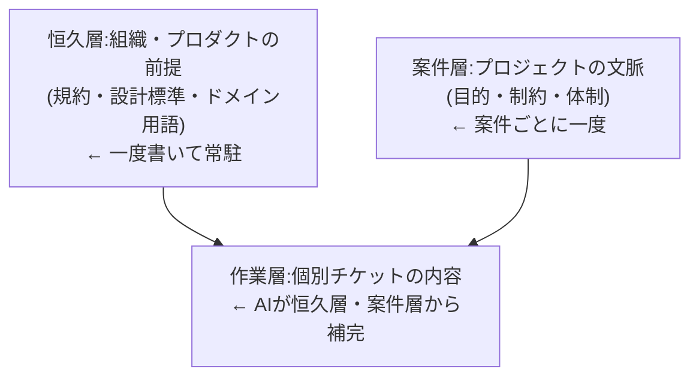
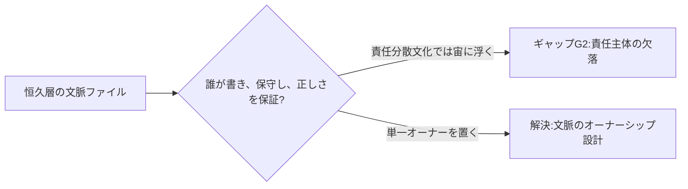

フェーズ1で「[明文化の壁](/process-compass/phase1-current-state/jp-governance/)」を、フェーズ2で「[コンテキストエンジニアリング](/process-compass/phase2-aidlc/context-engineering/)」を整理しました。このページでは、両者をつないで**組織にどんなコンテキスト基盤を用意すべきか**の要件を定義します。

## 課題: 人間が同じ文脈を何度も書きたくない

生成AIを使うには、暗黙知を明文化してAIに渡す必要があります。しかし現実には、チケット1枚ごとに背景・前提・制約を書き下すのは大きな負担です。ハイコンテキスト文化の現場では「言わなくても分かる」で済ませてきたため、この負担は新規に発生します。

人間は、同じ文脈を何度も書きたくありません。だから基盤の目的は明快です。**一度書いた文脈を再利用し、AIに補完させ、人間の明文化負担を最小にする**ことです。

## 補完のレイヤ: 何を一度書き、何をAIが補うか

コンテキストを、書く頻度と持続性で3層に分けます。

- **恒久層**: 組織・プロダクトに恒久的な前提。コーディング規約、設計標準、ドメイン用語、レビュー基準。一度書いて常駐させる([CLAUDE.md やルールに相当](/process-compass/phase2-aidlc/context-engineering/))
- **案件層**: プロジェクト単位の文脈。目的、制約、体制。案件ごとに一度書く
- **作業層**: 個別チケット。ここで人間が毎回書く量を、恒久層・案件層からのAI補完で減らす

狙いは、**作業層で人間が書く文脈を最小化する**ことです。恒久層・案件層に一度書いておけば、AIがチケットの断片的な記述を、それらの文脈で補完できます。

## 基盤の要件

| 要件 | 内容 | 対応するCE手法 |
| --- | --- | --- |
| R1 恒久的な文脈の常駐 | 規約・標準・用語を常時AIに供給する | ステアリングファイル/ルール |
| R2 既存資産の接続 | 既存の設計書・過去案件・基幹システムを再学習なしに参照する | RAG / MCP |
| R3 経験の蓄積 | 運用でAIが学んだ判断を書き戻す | エージェントメモリ |
| R4 優先順位付け | 全部入れず、劣化(context rot)を避けて必要分だけ渡す | 圧縮・分離・just-in-time |
| R5 責任の割り当て | 各文脈ファイルに単一のオーナーを置く | ガバナンス設計 |

R1〜R4は技術要件で、フェーズ2のコンテキストエンジニアリングがそのまま手段になります。R5は組織要件で、日本のガバナンスとの衝突点です。

## 最大の論点: 明文化の責任は誰が持つか

技術的な補完は、コンテキストエンジニアリングでかなり解けます。難しいのは組織の側です。

CLAUDE.md やルールのような恒久的な文脈ファイルは、**単一の責任主体(オーナー)を必要とします**。しかし稟議・合議で責任を分散する日本の文化では、「この文脈ファイルは誰のものか」が曖昧になりがちです。

これは[責任主体の欠落(ギャップG2)](/process-compass/phase3-gap-analysis/gap-map/)が、コンテキスト基盤でも再び現れる形です。基盤の技術要件(R1〜R4)を満たしても、R5(責任の割り当て)を設計しないと、文脈ファイルが陳腐化し形骸化します。

## 副次効果: ナレッジマネジメントの強制執行

この基盤の整備は、負担であると同時に前向きな側面を持ちます。ハイコンテキスト文化は「明文化を怠っても回る」ように最適化された組織です。コンテキスト基盤は、そこに**明文化を促す外圧**として働きます。

建前はAI活用ですが、実効は暗黙知の棚卸しと属人性の解消です。「AIのために書く」が、結果として組織のナレッジマネジメントを進める——この二重の意味を、導入の説得材料にできます。

## フェーズ4への引き渡し

この基盤の具体的な構成(どのツール・どのファイル構造・どの運用ルール)は、フェーズ5(プロセス実装)で設計します。フェーズ3では「何を満たすべきか(要件)」までを定義し、事業フェーズ・チーム体制に応じた段階設計(小規模は恒久層中心、規模拡大でRAG/MCPを追加)の方針を示しました。
