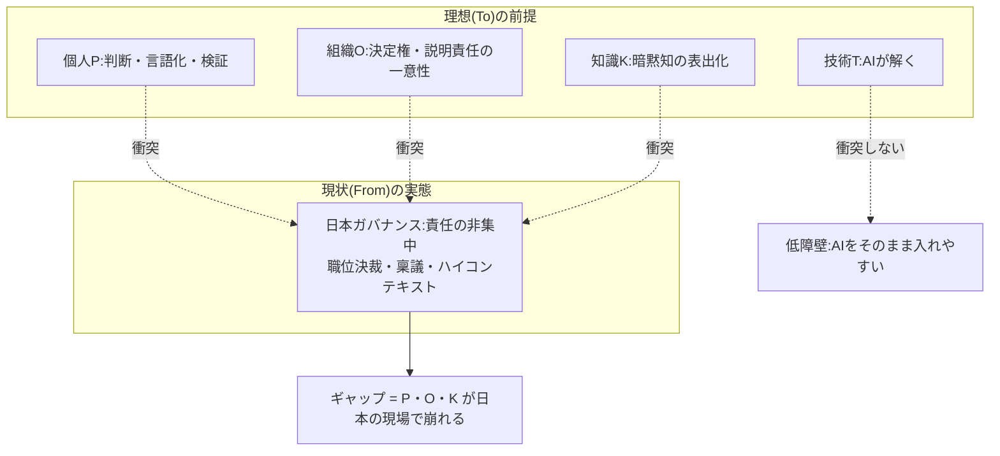
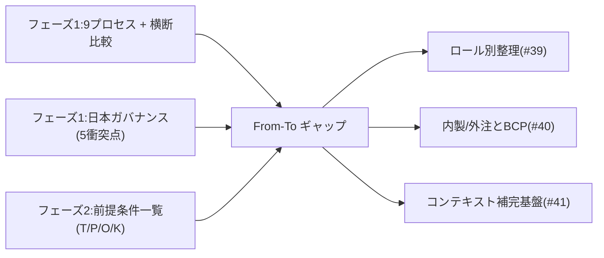

フェーズ3では、フェーズ1(現状 From)とフェーズ2(理想 To)を突き合わせます。このページはその中心となる**ギャップ一覧と、生成AIが入る余地のマップ**です。自組織の導入計画の出発点として使えます。

## ギャップを一枚で

フェーズ2で、理想像の前提は4カテゴリ(技術T・個人P・組織O・知識K)に分かれ、[AIが解くのは技術の前提Tだけ](/process-compass/phase2-aidlc/assumptions/)だと分かりました。フェーズ1で、日本企業のガバナンスは[「責任の非集中」](/process-compass/phase1-current-state/jp-governance/)を共通DNAに持つと分かりました。この2つを重ねると、ギャップの位置が定まります。

要点は明快です。**技術(T)のギャップは時間が解きます**が、**個人・組織・知識(P・O・K)のギャップは日本の組織文化と正面衝突し、放置すると埋まりません**。ここが本プロジェクトの介入点です。

## 生成AIの組み込みポイント(工程別・障壁レベル)

理想の AIDLC は「全工程にAIを入れる」と語ります。しかし現状に重ねると、工程ごとに導入障壁が違います。障壁の高さは、その工程がP・O・Kのどれに依存するかで決まります。

| 工程 | AIの役割 | 障壁 | 障壁の理由(依存する前提) |
| --- | --- | --- | --- |
| 実装・コード生成 | 生成の主体 | **低** | 主に技術T。成果物レビューで吸収できる |
| テスト生成・実行 | 生成の主体 | **低** | 技術T。ただし検証能力(P3)が要る |
| ドキュメント生成 | 生成の主体 | **低〜中** | Kに依存。暗黙知が要る箇所で精度が落ちる |
| 設計・アーキテクチャ | 支援(人が判断) | **中** | P1価値判断・P3検証。人のレビューが必須 |
| 要件定義 | 支援(人が言語化) | **高** | K1言語化・K2表出化。暗黙知の明文化コストが発生 |
| 決裁・承認 | 対象外(人が担保) | **高** | O1決定権・O2説明責任。職位決裁・稟議と衝突 |

導入は**障壁の低い工程から**始めるのが定石です。実装・テスト生成でAIの価値を実証し、要件・決裁という高障壁の工程は組織設計とセットで段階的に進めます。

## 5つのギャップ(導入障壁)

フェーズ1で特定した[生成AI導入時の5つの衝突点](/process-compass/phase1-current-state/jp-governance/)を、フェーズ2の前提条件と結び直すと、埋めるべきギャップが明確になります。

| ギャップ | 崩れる前提 | 現状(From) | 理想(To) |
| --- | --- | --- | --- |
| G1 明文化の壁 | K1・K2 | 暗黙知・忖度で運用 | 仕様を言語化してAIに渡す |
| G2 責任主体の欠落 | O2 | 稟議=責任分散 | 明確な単一の説明責任者 |
| G3 職位ゲートと専門性の乖離 | O1・P | 決裁は金額×職位 | 技術判断できる人が決める |
| G4 ロールの曖昧さ・兼務 | O1 | メンバーシップ型 | 一貫した単一責任主体 |
| G5 速さが承認滞留を際立たせる | O3 | 多段承認は週〜月単位 | Bolt は時間単位 |

## トレーサビリティ

このギャップ分析は、フェーズ1・2の成果物から導いています。

各ギャップへの具体的な打ち手は、続く3つのページで扱います。ロールの再設計([ロール別整理](/process-compass/phase3-gap-analysis/role-mapping/))、内製・外注の再構成と事業継続性([内製/外注とBCP](/process-compass/phase3-gap-analysis/insourcing-bcp/))、暗黙知の明文化基盤([コンテキスト補完基盤](/process-compass/phase3-gap-analysis/context-infrastructure/))です。

:::note
このギャップは「日本企業の平均像」に対するものです。実際の障壁の高さは組織ごとに違います。プロセス提案ツール(最終ゴール)は、チーム体制・事業フェーズを入力に、この障壁マップを組織別に調整することを目指します。
:::
