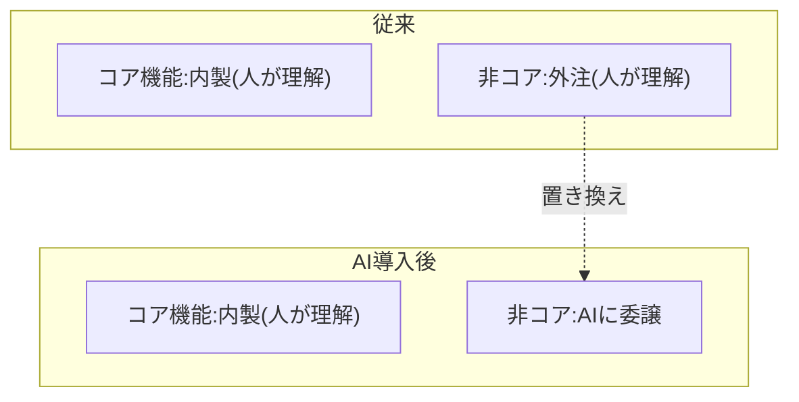
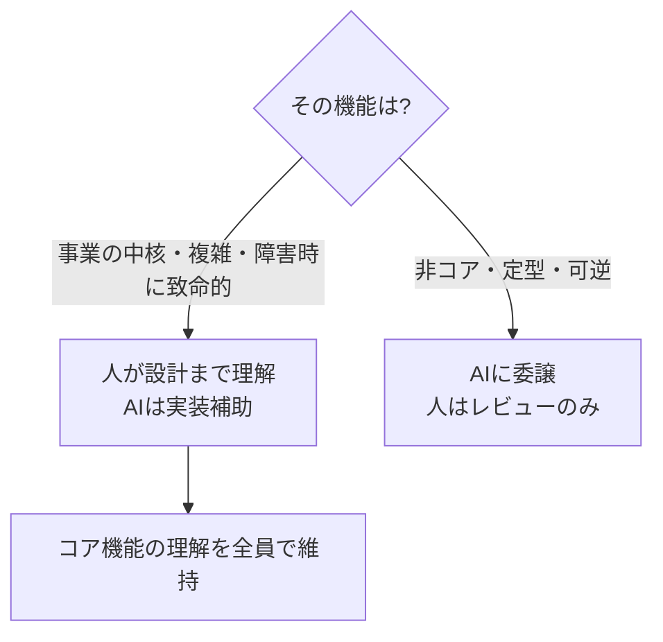

生成AIは、組織の中での分担だけでなく、**従来「外注」に出していた作業の担い手**も変えます。このページは、その再構成が生む事業継続性(BCP)リスクと打ち手を整理します。

## 従来の内製/外注の判断軸

これまで、何を内製し何を外注するかは、組織論的に決められてきました。

- **内製にする理由**: 重要機能である、複雑で知見を社内に残したい、事業の中核である
- **外注にする理由**: 定型的である、一時的な稼働が必要、社内リソースが足りない

この判断の裏には、「**コア機能は社内の人間が理解している状態を保つ**」という事業継続性の要請がありました。トラブル時に、その機能を分かっている人が社内にいることが、事業を止めないための保険でした。

## 生成AIが変えること

生成AIは、この構図の「外注に当たる部分」を担えます。定型的な実装・テスト・ドキュメントを高速に生成します。

ここに新しいリスクが生まれます。**外注していた頃は、外注先の人間がその作業を理解していました**。AIに委譲すると、その作業を理解している人間が、社内・社外のどこにも存在しなくなる可能性があります。

## 新しい事業継続性リスク

| リスク | 内容 | フェーズ2での対応する論点 |
| --- | --- | --- |
| 理解の空白 | AI生成コードを誰も深く理解していない | [受動的承認者化](/process-compass/phase2-aidlc/agentic-development/) |
| 技術負債の急増 | 生成が速いほど負債も速くたまる | [責任の拡散](/process-compass/phase2-aidlc/po-centric-team/) |
| 障害時の対応不能 | トラブル時に原因を診断・修正できる人がいない | 検証能力(P3)の欠如 |
| 属人性のAI移転 | 属人性が「人」から「AIとプロンプト」へ移るだけ | 明文化コスト(K) |

音声メモの言葉を借りれば、これは「トラブルがあったときにコア機能を全員が分かっている状態を保つ」という要請が、AI導入で崩れるリスクです。

## 打ち手: 何を人が理解し続けるか

打ち手の核心は、**すべてをAIに委譲しない**ことです。事業継続性の観点から「人が理解し続ける領域」を意図的に残します。

具体的な打ち手は次のとおりです。

- **コア機能の線引きを明示する**: 従来の内製/外注の判断軸を、内製/AI委譲の判断軸に置き換える。「事業の中核・複雑・障害時に致命的」な機能は、人が設計レベルまで理解し続ける
- **理解の維持を作業に組み込む**: AI生成物のレビューを「承認の儀式」でなく「理解を保つための読み込み」として設計する。定期的にコア機能を人が読み解く時間を確保する
- **明文化を負債の防波堤にする**: AIが生成した設計判断を、暗黙のまま放置せず[コンテキスト補完基盤](/process-compass/phase3-gap-analysis/context-infrastructure/)に記録する。属人性がAIへ移るのを防ぐ
- **負債返却をプロセスに織り込む**: 生成が速い分、技術負債の返却を定常作業として計画する(フェーズ6の運用テーマ)

## 日本の受発注構造との関係

日本のSIerでは、外注はそのまま多重下請け・受発注契約と結びついています。AIへの委譲は、この受発注構造そのものを問い直します。

- **契約の対象が変わる**: 「外注先に作らせる」から「AIに作らせて社内でレビューする」へ移ると、検収・瑕疵担保責任の対象が不明確になる(フェーズ2の[AIDLC](/process-compass/processes/aidlc/)の未整備論点)
- **事業継続性が社内へ戻る**: 従来は外注が背負っていた継続性リスクが、AI委譲では社内の理解維持能力しだいになる。BCPの責任が社内へ戻ってくる

この再構成をどう契約・組織設計に落とすかは、フェーズ4(詳細策定)の主題になります。
