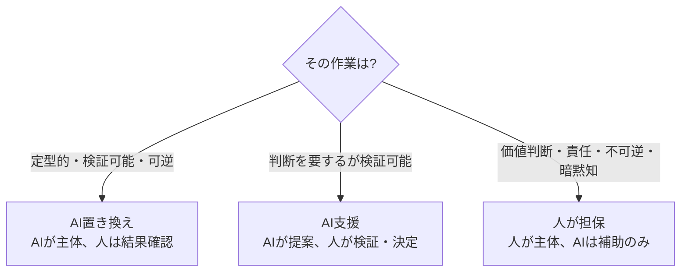
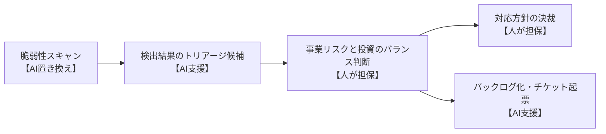

「AIが人の仕事を置き換える」という粗い言い方では、要員計画や責任設計に落とし込めません。実際に必要なのは、**各ロールの作業をより細かいタスクに分解し、どの部分をAIに任せ、どの部分を人が担保するかを見極める**ことです。このページはその整理表です。

## 3つの分類と判断基準

作業を、AIへの委譲度で3つに分けます。判断基準は「可逆性」「検証可能性」「価値判断・責任の有無」です。

| 分類 | AIの役割 | 人の役割 | 該当する作業の例 |
| --- | --- | --- | --- |
| **AI置き換え** | 生成の主体 | 結果の確認 | ボイラープレート生成、テストコード生成、単純なリファクタ、定型ドキュメント |
| **AI支援** | 提案・候補出し | 検証・選択・決定 | 設計案の生成、コードレビュー補助、脆弱性のトリアージ候補、見積もりの叩き台 |
| **人が担保** | 補助・素材提供 | 判断・承認・責任 | 要件の優先順位決定、決裁承認、アーキテクチャの最終判断、倫理・法的判断 |

重要なのは、**1つのロールが3分類すべてにまたがる**点です。「このロールはAIに置き換わる」と考えるのではなく、「このロールの作業を、置き換え・支援・人が担保の3つに切り分ける」と考えます。

## ロール × 分類の整理表

| ロール | AI置き換え | AI支援 | 人が担保 |
| --- | --- | --- | --- |
| 開発者 | 実装・テスト生成・リファクタ | 設計案・デバッグ補助 | 設計の最終判断・技術的トレードオフ |
| QA / 品質保証 | テストケース生成・回帰実行 | 欠陥の候補抽出・優先度提案 | 出荷可否の判定・品質基準の設定 |
| セキュリティ | 脆弱性スキャン・定型診断 | トリアージ候補の抽出 | リスク受容の判断・対応方針の決定 |
| プロダクトオーナー | — | バックログ整理・仕様の叩き台 | 価値の優先順位・What/Why の決定 |
| PM / 決裁者 | 進捗レポート生成 | リスクの洗い出し補助 | 決裁・承認・責任の引き受け |
| ドメインエキスパート | — | 用語集・モデルの下書き | 業務ルールの正しさの保証 |

## worked example: セキュリティのトリアージ

粗い「AIがセキュリティを担当する」ではなく、作業を分解すると人とAIの境界がはっきりします。

スキャンはAIが回し、危険度の高い候補もAIが挙げます。しかし「どのリスクを受容し、どこに投資するか」という事業リスクと投資コストのバランスは、人が担保します。この判断こそが、削ってはいけない核心です。

## 日本の組織文化への注意

この整理表は理想的な分担です。日本の現場に載せるときは、フェーズ1・2で見たギャップに注意が必要です。

- **「人が担保」の列が職位ゲートで滞留しやすい**(ギャップG3・G5)。決裁承認をAIで速くできない以上、承認の実効性を保ちつつ滞留させない設計が要る
- **説明責任を一意化する必要がある**(ギャップG2)。「AI支援」でAIが出した候補を人が選んだとき、その選択の責任は誰にあるかを明示する。曖昧なままだと責任が拡散する
- **兼務でロールが揺れる**(ギャップG4)。分類はロールでなく作業に紐づけると、兼務・異動があっても分担が崩れにくい

## 次のページへ

この整理は「1つの組織の中での分担」です。しかし生成AIは、従来「外注」に出していた作業の担い手も変えます。その事業継続性リスクと打ち手は[内製/外注の再構成とBCP](/process-compass/phase3-gap-analysis/insourcing-bcp/)で扱います。
