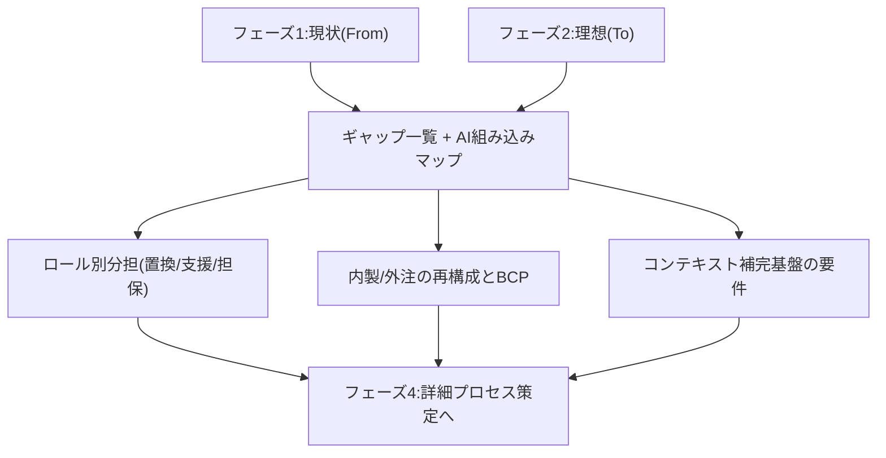
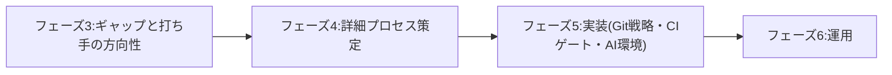

フェーズ3では、フェーズ1(現状 From)とフェーズ2(理想 To)を突き合わせ、埋めるべきギャップと打ち手の方向性を整理しました。このページはその総括です。

## 何を整理したか

- [From-To ギャップ一覧と生成AI組み込みポイント](/process-compass/phase3-gap-analysis/gap-map/)
- [ロール別「AI置き換え / AI支援 / 人が担保」整理](/process-compass/phase3-gap-analysis/role-mapping/)
- [内製/外注の再構成と事業継続性(BCP)](/process-compass/phase3-gap-analysis/insourcing-bcp/)
- [コンテキスト明文化・補完基盤の要件](/process-compass/phase3-gap-analysis/context-infrastructure/)

## 核心の発見: ギャップは技術ではなく組織にある

フェーズ3を貫く発見は明快です。**埋めるべきギャップは、AIの賢さ(技術T)ではなく、日本の組織文化と衝突する個人・組織・知識の前提(P・O・K)にある**という点です。

技術のギャップは時間が解きます。しかし「決定権が職位で決まる」「稟議が責任を分散する」「暗黙知が明文化されない」というギャップは、待っても埋まりません。本プロジェクトの価値は、この組織側のギャップに打ち手を出すことにあります。

## 埋めるべき5つのギャップと打ち手

| ギャップ | 打ち手の方向性 | 扱ったページ |
| --- | --- | --- |
| G1 明文化の壁 | 恒久層に一度書き、AIが補完する基盤を作る | コンテキスト補完基盤 |
| G2 責任主体の欠落 | AI成果物・文脈ファイルに単一オーナーを割り当てる | ロール別整理・コンテキスト基盤 |
| G3 職位ゲートと専門性の乖離 | 技術判断ゲートと予算決裁ゲートを分離する | ギャップマップ |
| G4 ロールの曖昧さ・兼務 | 分担をロールでなく作業に紐づける | ロール別整理 |
| G5 速さが承認滞留を際立たせる | 承認の実効性を保ちつつ滞留させない設計 | ギャップマップ |

## もう一つの発見: 事業継続性の責任が社内に戻る

生成AIが従来の「外注」を担うと、その作業を理解している人間が社内外のどこにもいなくなるリスクが生まれます。これは、外注に預けていた事業継続性リスクが、**AI委譲では社内の理解維持能力しだいになる**ことを意味します。だからこそ「何を人が理解し続けるか」の線引きが、プロセス設計の要になります。

## フェーズ4への引き渡し

フェーズ3は「何が問題で、どちらへ向かうか(打ち手の方向性)」までを定義しました。フェーズ4(詳細プロセス策定)では、これを**企業の品質管理部門・プロセス部門に提案できる具体的なプロセス**へ落とし込みます。

特に、[粒度の方針](/process-compass/phase1-current-state/research-framework/)どおり、フェーズ4は現状整理より緻密な、実装に至れるレベルの設計が求められます。ゲートの判定基準・成果物テンプレート・責任分担を具体値まで詰めます。

## フィードバックのお願い

このギャップ分析は、多くの現場の実感と突き合わせて精度を上げたい部分です。「このギャップは自社ではこう現れる」「この打ち手は効かない・効いた」という声を [GitHub Issues](https://github.com/Takenori-Kusaka/process-compass/issues) でお寄せください。フェーズ4の設計の質を大きく左右します。
