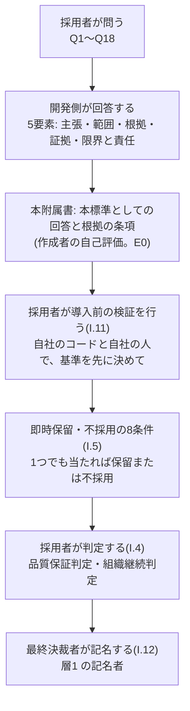

本附属書は、本標準(ピットイン方式)の採用を判断する者のための手引きです。**要求事項ではありません**。本附属書の記述を、採用した組織への要求として読まないでください。要求事項の正本は各章にあります。決定の根拠は[ADR-0057](/process-compass/adr/0057-organizational-quality-assurance/)です。

> 本標準は、AI を信用することを採用の条件にしません。AI が誤ること、担当者・モデル・提供者が交代することを前提にして、それでも品質の判断と事業の継続を組織の統制の下に置けるかを、問いへの回答と記録で確かめます。

## I.1 本附属書の位置づけ

| 項目 | 内容 |
| --- | --- |
| 出典 | 本プロジェクトのオーナーが作成した「ピットイン開発プロセス 採用判断シート(たたき台)」(2026-10)。上位命題、Q1〜Q18、回答の合格条件、採否ロジック、即時保留・不採用の条件、最終記入欄は、このたたき台による。語は本標準の語彙へ揃えた |
| 本附属書が持つもの | Q1〜Q18 のすべてへの、本標準としての回答(5要素)と、その根拠の条項。即時保留・不採用の8条件のそれぞれに、本標準のどの規定が当たらないことを示すか。採用の時点の証拠を作る導入前の検証の手順と記録の様式(I.11)。最終決裁者と運用の席の対応(I.12)。回答の弱さの自己評価(I.9) |
| 本附属書が持たないもの | 採否の判定。**判定は採用者が行う**。本標準が自らの採否を判定する形を避けるためである |
| 回答の性質 | 本標準の作成者による自己評価である。根拠の水準は E0(下記の EV-0077)。採用者は、各回答の根拠の条項を自ら読み、自組織で運用できるかを導入前の検証で確かめる |
| 範囲外の扱い | **範囲外と決めて答えない問いは置かない**。本標準の範囲を超える部分(全社の AI 投資の配分、後継を確保する人事の手段の選択など)は、回答の「範囲」と「限界と責任」に書く |

:::caution[暫定 EV-0077 / 見直し 2027-04]
**対象**: Q1〜Q18 への本標準の回答が、5要素を満たし、採用の判断に使えるという作成者の自己評価。
**根拠の水準**: E0(なし)。
**差し替え条件**: 採用者が本附属書を用いて判定した記録3件。採用者が「回答あり」とみなさなかった問いと、その理由。1件でも「回答あり」とみなされなかった問いがあれば、その問いの回答と根拠の条項を改める。採用者の判定と I.9 の自己評価が食い違った問いは、自己評価を改める。

作成者は、回答する側と採否の基準を読む側の両方に立っています。利益相反を避けるため、判定は持たず、回答の所在と根拠の水準だけを示します。
:::

## I.2 採用判断の上位命題

本標準を採用するのは、開発側が次の2つを、適用範囲・根拠・証拠・限界・責任者を伴って説明できる場合です。

| 命題 | 内容 | 問い |
| --- | --- | --- |
| 品質保証の命題 | AI の成果物を全面的に信頼せず、全件を精読しなくても、重要な誤りを予防・検出・封じ込めし、当該リリースを出してよい理由を説明できる | Q1〜Q9 |
| 組織継続の命題 | AI の利用を広げても、費用・依存・知識・人材・責任を組織の統制下に置き、AI や提供者が変わり、止まっても事業を続けられる | Q10〜Q18 |



## I.3 回答の合格条件

各回答は、次の5要素を満たして初めて「回答あり」とみなします。

| 要素 | 判定の問い |
| --- | --- |
| 主張 | 何ができる・できないと断定しているか |
| 範囲 | どの製品・変更・組織・期間・利用条件に限るか |
| 根拠 | なぜその主張が成立するのか |
| 証拠 | 第三者が追跡・再確認できる記録は何か |
| 限界と責任 | 残る不確実性は何で、誰がいつまで引き受けるか |

「対応しています」「レビューします」「AI は補助です」「別製品へ切り替えられます」「教育します」だけでは、回答とみなしません。本附属書の回答は、手段の存在ではなく、**手段を実施した記録**と、**実施していない部分を誰が期限つきで引き受けたか**で書いています。

証拠は、時点で2つに書き分けます。

| 証拠の時点 | 指すもの | 誰が作るか |
| --- | --- | --- |
| 導入前の検証 | 採用の判断の時点で手元にある記録。採用者が自社のコードと自社の人で、合否の基準を先に決めて行う検証の記録(I.11) | 採用者 |
| 運用の記録 | 採用した組織が運用して初めて生まれる記録(判定記録、保証の開示、演習の報告書など) | 採用した組織 |

採用の判断の時点で、運用の記録はまだありません。**採用の時点の証拠は、導入前の検証の記録です**。運用の記録でしか確かめられないもの(結果の効果、人と組織の挙動)は、範囲を限り、期限を付けて受容する残余リスクとして扱います(I.4)。

## I.4 採否のロジック(採用者が使う)

採否の判定は採用者が行います。本附属書は判定しません。

| 判定 | 条件 | 採用の判断 |
| --- | --- | --- |
| 採用可能 | Q1〜Q18 の重要項目に5要素を伴う回答があり、残余リスクが許容範囲内 | 対象範囲を明記して採用 |
| 条件付き採用 | 不足はあるが、影響範囲、代替策、責任者、解消期限が明確 | 対象・期間・利用権限を限定して採用 |
| 検証採用 | 品質または事業価値の証拠が不足するが、小さく可逆的な試行で取得可能 | 本番影響を限定した実証のみ許可 |
| 保留 | 重要回答または証拠が不足し、追加設計・検証で解消可能 | 不足条件を明示して再判定 |
| 不採用 | 保証対象、独立検証、未レビュー範囲、残余リスク受容、依存先、退出能力、責任者のいずれかが不明 | 本標準を統制可能と判断しない |

読み方の補足です。

- 「残余リスクが許容範囲内」は、採用者の品質保証の方針と受容の基準([第6章 テンプレ11](/process-compass/phase4-process-design/deliverable-templates/))に照らして読む。本標準は受容の基準の値を定めない
- 採用の時点で確かめられるのは、規定と様式の所在と、導入前の検証(I.11)の記録までである。導入前の検証の記録が無い判定は、「検証採用」を超えにくい
- 導入前の検証でも確かめられないものが2つ残る。結果の効果(欠陥の流出が減るか)と、人と組織の挙動(記名の質、申し立ての使われ方、評価の運用)である。この2つは、**採用者の層1 の受容者が範囲と期限を付けて受容する残余リスク**として、I.11 の記録の節9 に書く。範囲は、検証した構成と開発ラインに限る。受容の期限までに運用の記録で確かめ、再判定する
- 機械化の穴(規定が実行層へ降りていない部分)は、受容で埋めない。[実装の台帳](/process-compass/community/implementation-ledger/)の「降りていない規定」を採用者が確かめ、降りていない規定は採用の条件か、手で代える手順として記録する
- 採用者は、たたき台に無い条件を加えてよい。例として、適用される法令・契約の要求事項(外枠)を特定していないこと

## I.5 即時保留・不採用の条件と、当たらないことを示す規定

次の8条件のいずれかに当たる場合、採用者は保留または不採用とします。各条件について、本標準のどの規定が「当たらない」ことを示すかと、採用者が確かめる記録を示します。規定が実在しても、採用した組織が運用していなければ、条件に当たります。

| # | 即時保留・不採用の条件 | 当たらないことを示す本標準の規定 | 採用者が確かめる記録 |
| --- | --- | --- | --- |
| 1 | AI の関与範囲または権限を特定できない | 席ごとの責任者と担い手、運用形態の上限、委任の範囲の機械の規則([第6章 テンプレ0](/process-compass/phase4-process-design/deliverable-templates/) 表5・表7、[第5章 5.5](/process-compass/phase4-process-design/human-ai-boundary/))。AI自律レベルと適用範囲(第5章 5.4)。変更ごとの生成の条件(第5章 5.8.2)。リスク区分の下限の規則(第3章 3.8.1) | D-0 体制図、構成、保証の開示 項目3・7 |
| 2 | 「AI が正しい」とする根拠が、同じ AI の説明・テスト・レビューだけである | AI の推定による判定を判定に数えない([附属書H](/process-compass/phase4-process-design/assurance-case/) H.4)。数える条件2〜5 を確かめる者と時点(H.4)。作成を指示した者と別の人の確認([第4章 G-6](/process-compass/phase4-process-design/gate-criteria/))。文脈と入力の分離([第3章 3.5.4](/process-compass/phase4-process-design/roles-responsibilities/))。期待値を人が承認した受入基準から取る(第5章 5.8.4) | G-6 の判定記録と挙動要約、保証の開示 項目1・6、導入前の検証の欠陥注入の結果 |
| 3 | 人間が確認していない範囲と代替証拠を説明できない | 独立した人の確認を経ていない変更を件数と定型の文で示す(H.6)。委任の7条件(第5章 5.5.4)。保証の主張の成立判定と、対象外の範囲の定型の文(第4章 G-7「保証の主張の成立判定」) | 保証の開示 項目1・3 と成立判定の出力 |
| 4 | 重大な残余リスクを受容する責任者がいない | G-8 の記名による受容と、層1 に照らした照合と上申(第4章 G-8)。受容の権限の段階と上申先(テンプレ11 の項目4・5)。層1 の記名者の定義と3つの権限(テンプレ11 の要求事項2・3)。出荷判定者と事業決裁者の兼務禁止(第3章 3.5) | 層1 の文書と記名・連署、G-8 の決断の記録、上申の記録 |
| 5 | AI 停止時に重要業務を継続・縮退・復旧する方法がない | 席ごとの人へ戻す・止めるの扱いと、縮退の能力を量で示す要求と、頻度を過ぎた実測の失効(第3章 3.12.5)。D-0 表7 の縮退の3列。人へ戻す演習([開発避難訓練](/process-compass/phase6-operation/incident-drill/)の類型E) | 導入前の検証の類型E の記録。運用では D-0 表7 の実測の値と日付、表8 の AI が使えなかった期間の記録 |
| 6 | 業務知識・評価基準・運用知識を自社へ取り出せない | 資産を自組織のリポジトリに置く要求、指示資産の提供者依存の識別、別の提供者での退出の予行と間隔による失効、基準集合の範囲の承認(第3章 3.12.3 の要求事項5〜10)。別の提供者へ替える演習(類型F)。要求事項10(基準集合の範囲の起案と承認を一人で行わない)は、AI運用担当者と技術判断者が別の人である体制を前提にする(後掲の注記) | リポジトリ、導入前の検証の類型F の記録、基準集合の範囲の承認の記録、依存先の一覧(3.12.11) |
| 7 | 生成物を理解・変更できる人材を維持する計画がない | 判断を担う席の AI を使わない力量の確認と周期による失効、層1 の判断の席ごとの後継候補の最低数と育成の担当、理解の保持者に数える条件(第3章 3.4.3 の要求事項1・5・8・9)。作成を指示していない人の挙動要約(G-6) | 層1 の「確認の周期と後継」の表、D-0 表5 の候補ごとの確認の状態、運用引き継ぎ文書の保持者と確認者 |
| 8 | 利用停止を決める基準と権限者がいない | 企画書の AI の利用の拡大と停止の基準(テンプレ6)。案件と開発ラインの評価と判定(第7章 7.7.8)。組織全体の拡大・停止の権限者(テンプレ11 の項目4 の必須行)。誰でもできる停止の申し立てと、マージ・出荷の機械による保留(第7章 7.11)。実行の強制停止(第3章 3.12.10) | 企画書、ステージ移行ゲートの判定記録の「AI の利用の評価」、層1 の文書、導入前の検証の場面集の結果 |

- 条件7 に当たらないと言うには、**層1 の「判断の席ごとの後継候補の最低数」と「育成の担当」が記入されていること**を要する。空欄の層1 では、すべての判断の席が後継不在と表示され、受容を更新できない。表示があっても、最低数と担当の無い状態は、計画が無い状態として読める
- 条件5・6・7 は、計画の文書ではなく実施の記録で当たらないことを示す。採用の時点では導入前の検証の演習の記録で、運用では周期内の記録で示す。記録が無い間、または周期を過ぎた間は「未確認」「退出を試していない」「後継不在」と保証の開示に表示され、層1 の権限者が期限つきで受容する
- 条件8 のうち機械で止まるのは、マージと出荷までである。自律実行の保留は、AI運用担当者が強制停止の手段で止める人の操作に依る(第7章 7.11「保留の範囲と強制の方法」)
- 条件6 の要求事項10(評価用の基準集合の範囲は AI運用担当者が起案し、技術判断者が記名で承認する)は、**AI運用担当者と技術判断者が別の人である体制を前提にする**。同じ人が両方の席に就く体制では、別の自然人の承認を構造的に作れず、出荷の証跡の集約は承認に数えない(「基準集合の範囲の承認なし」と出る)。技術判断者と AI運用担当者は兼務禁止の組ではないため、構成の変更は拒否されない。3名の体制では、AI運用担当者を品質管理側の人に置く割り当てで満たせる(例: 開発者・技術判断者・価値責任者 A、独立レビュア・事業決裁者・AI維持管理者 B、出荷判定者・AI運用担当者 C)。準拠テンプレートは、この組を `/process-change` の出力と `next.mjs` の注記で知らせる。1〜2名の体制では、承認なしの表示を層1 の権限者が期限つきで受容する
- 1名体制では、条件3・4 の規定は表示を整えるが、独立した確認と別の自然人の受容を作らない。外部の確認者を置かない限り、組織として品質を保証するとは主張できない(H.1「保証の主張の成立条件」)

## I.6 品質保証の命題(Q1〜Q9)への回答

### Q1 何を、どの利用条件・範囲で「品質保証できる」と主張するのか。非対象範囲も明示できるか

| 要素 | 本標準の回答 |
| --- | --- |
| 主張 | 本標準を適用した組織は、宣言した保証範囲について、顧客と社会に対し、確実にする・確認する・実証するの3つの意味で品質を保証すると主張できる。主語は組織であり、本標準ではない。欠陥が無いことの約束は含まない |
| 範囲 | 組織の保証の対象と対象外を層1 の項目1 で定め、案件ごとの保証範囲と範囲外を G-1 で宣言する(層2)。出荷ごとに、6つの成立条件を満たした変更だけが範囲に入る。機械学習の振る舞いを持つ製品の、その振る舞いの保証は範囲外 |
| 根拠 | 品質保証は組織が行う体系的活動であり、主張し責任を負うのは組織である(JSQC-Std 00-001:2023、ISO 9001 の構図)。成立条件で、主張を検証の成立した範囲へ限定する。6条件のそれぞれが封じる失敗は、下表のとおり附属書H H.11 の残るリスクと対応する |
| 証拠: 導入前の検証 | 層1 と D-0 の全行を記入した状態で出した成立判定の出力(I.11 の手順4)。場面集で、条件を欠く変更が「品質保証の対象外」と出ることの確認 |
| 証拠: 運用の記録 | 層1 の文書と記名、企画書の保証範囲の欄と G-1 の判定記録、出荷ごとの保証の開示の成立判定の出力 |
| 限界と責任 | 6条件が対外の根拠として足りるかは実証していない(ADR-0057 の EV-0067)。下表の対応は作成者の突合であり、外部の品質保証部門によるレビューの記録は無い。採用者の品質保証部門が導入前の検証の中でレビューし、記録を残すことを勧める。範囲外の出荷は「品質保証の対象外」と顧客へ伝える。最終責任は層1 の記名者 |

| 成立条件 | 封じる失敗 | H.11 の対応する行 |
| --- | --- | --- |
| 1 層1 の記名 | 受容の基準を案件や出荷ごとに都合よく変える。受容が自己完結する | 層1 の形骸化、社内の受容と外部の責任の混同 |
| 2 層2 の宣言 | 確かめられた範囲が、出荷の後から約束にされる | 言葉だけが先に立つ保証 |
| 3 別の自然人の確認 | 作成を指示した人と同じ AI だけの確認で出荷する | 誤りの相関、名簿と指示者の記載 |
| 4 G-7 と G-8 の別の自然人 | 異議を書く者が自ら受容する | 異議を書く者と受容する者の兼務、開示が免罪符になること |
| 5 検出能力の測定 | 人の確認が形骸化しても気づかない | 人の慣れ、論証そのものの形骸化 |
| 6 欠落と受容しない条件の不在 | 記録の欠けた出荷や、受容してはならない残存リスクの出荷 | 開示が免罪符になること |

根拠の条項: [第1章 1.9](/process-compass/phase4-process-design/overview/)、[附属書H](/process-compass/phase4-process-design/assurance-case/) H.1・H.2・H.11、[第4章 G-1・G-7](/process-compass/phase4-process-design/gate-criteria/)、[第6章 テンプレ6・テンプレ11](/process-compass/phase4-process-design/deliverable-templates/)。

### Q2 絶対に壊してはならない品質条件は何か。業務規則、権限、データ、安全、法令、性能等を具体化できるか

| 要素 | 本標準の回答 |
| --- | --- |
| 主張 | 案件の開始時に、壊してはならない品質条件を識別子(QC-NN)つきで、観測可能な事象で書く。受入基準とテストは条件を識別子で参照する。出荷ごとに参照を突合し、テストへ降りていない条件を残存リスクとして自動で開示する。組織として受容しない条件を、層1 に否定リストで持つ。法令・契約は外枠であり、受容の対象にしない |
| 範囲 | 業務規則、権限、データ、安全、法令、性能のうち、案件に該当するもの。安全関連ソフトウェアは附属書F と安全リスクアセスメント(テンプレ9)による |
| 根拠 | 合否の基準を生成より前に人が定める(H.3 の C2)。識別子による参照で、条件から検証への対応を機械で辿れる。受容しない条件に当たる事実がある出荷は、G-7 で差し戻される |
| 証拠: 導入前の検証 | 自社の1案件で条件に識別子を振り、受入基準とテストからの参照を突合した結果。参照の無い条件が項目5 に出ることの確認 |
| 証拠: 運用の記録 | 企画書の条件の表、G-2 の受入基準、G-5 の検査の実行記録、保証の開示の項目4・5 の突合の結果、層1 の項目2・3、G-7 の判定記録 |
| 限界と責任 | 条件の網羅は主張しない([ADR-0041](/process-compass/adr/0041-scope-is-not-exhaustive/))。突合が見るのは参照の有無であり、参照したテストが条件を確かめているかは G-6 の独立レビュアが見る。仕様の誤りには歯止めが無い(H.11)。突合は出荷の証跡の集約へ降りている(IMPL-0072。[実装の台帳](/process-compass/community/implementation-ledger/))。機械が行うのは、参照の無い条件を項目5 へ載せるまでである。条件を書くのは価値責任者、承認は事業決裁者(G-1)、受容しない条件の記名は層1 の記名者 |

根拠の条項: 第4章 G-1「品質の約束と保証範囲(層2)」・G-2・G-5・G-7「壊してはならない品質条件の突合」、第6章 テンプレ6・テンプレ11、[附属書F](/process-compass/phase4-process-design/safety-verification/)。

### Q3 AI はどこに関与し、どこまで権限を持つのか。人間・AI・自動化の責任境界を説明できるか

| 要素 | 本標準の回答 |
| --- | --- |
| 主張 | すべての成果物と判定に、記名の責任者が1名対応する。AI は実行を担えるが、責任者にならない。AI の担い手は、モデルの版・指示資産の版・権限の組で識別し、席ごとに運用形態(人確定・協働・委任)の上限を宣言する。上限は変更ごとのリスク区分が下げる。リスク区分は、構成に置いた下限の規則で機械が下から押さえ、R1・R2 は作成を指示した者以外の自然人が確定して記名する |
| 範囲 | すべての席。出荷判定者・事業決裁者・AI維持管理者・AI運用担当者の席には委任を書けない。確定の形態は変更ごとに記録する。下限の規則が押さえるのは、規則に書いたパスと変更種別まで |
| 根拠 | 結果責任(A)と実行(R)の分離([第3章 3.2](/process-compass/phase4-process-design/roles-responsibilities/))。担い手の識別ごとの適合性確認(3.4.2)。区分の記載だけで R1・R2 の統制を外せる経路を、下限と確定者の記名で塞ぐ(3.8.1) |
| 証拠: 導入前の検証 | 場面集のうち、下限より低い区分の記載と、確定者の記名の無い R1・R2 の変更が G-5 で止まることの確認 |
| 証拠: 運用の記録 | D-0 表5・表7、判定記録の確定の形態と区分の確定者、承認アカウントと名簿の対応、保証の開示 項目3(自己記載の件数)・7 |
| 限界と責任 | 名簿の記載の正しさは機械で確かめず、内部監査が確かめる。下限の規則に当たらない R1 相当の変更は、R3 と記載されて通りうる。正規の経路を迂回した AI の利用は記録に載らない(3.12.2 で禁止)。下限と確定者の検査は G-5 の PR 単位の検査へ降りている(IMPL-0062)。保証の開示の区分の出所は、判定記録の確定者と PR 本文の確定者の両方を数えて示す。責任は各席の責任者が負い、規則の承認は AI維持管理者が負う |

根拠の条項: 第3章 3.2・3.4.2・3.8.1「区分の下限と確定者」、第4章 G-5「リスク区分の下限の照合」、第5章 5.4・5.5、第6章 テンプレ0、附属書H H.3 の C1。

### Q4 AI が誤っていても、何がその誤りを発見するのか。AI 自身の自己評価とは異なる根拠を示せるか

| 要素 | 本標準の回答 |
| --- | --- |
| 主張 | AI の推定による判定(AI レビュー、AI による受入基準の充足判定)を、判定に数えない。誤りは、人が承認した受入基準に由来する決定論的な検査と、作成を指示していない人の確認で発見する。AI の確認を検出の層に数えるのは、5つの条件を、定めた者が定めた時点で確かめた場合に限る |
| 範囲 | テストの生成を実装から切り離すのは R1・R2 の変更である。R3 の変更では実装を渡すことを禁じていないが、R3 の区分は下限の規則で下から押さえる(Q3)。条件2〜5 は、AI維持管理者が適合性確認の時点と四半期の棚卸しの時点で確かめ、席の責任者が承認する |
| 根拠 | 文脈を切り離した新しいセッションでの AI の再レビューでも、注入した欠陥の約 73% を見逃した測定がある(2026-09 時点、単一の測定)。確かめた記録の無い AI の確認は、「条件未確認」として検出の層に数えない(H.4) |
| 証拠: 導入前の検証 | 自社のコードでの目隠しの欠陥注入による、人の層と AI の層の検出率(I.11 の手順1)。条件2〜5 の初回の確認の記録 |
| 証拠: 運用の記録 | G-5 の実行記録、G-6 の承認記録と挙動要約、変異スコア、保証の開示の項目6(検出率、「未測定」、または「条件未確認」)、条件2〜5 の四半期の確認の記録、内部監査 観点22 |
| 限界と責任 | 同系統の AI が実装・テスト・レビューを担う限り、誤りの相関は消えない。5条件の組の効果は実証していない(EV-0059)。条件2 と5 は人の確認であり、機械で見られるのは条件3・4 の設定の有無まで。発見の責任は独立レビュアと出荷判定者、条件の確認は AI維持管理者 |

根拠の条項: 附属書H H.1「切り離された検証が指すもの」・H.4、第4章 G-5・G-6、第5章 5.8.4、[プロセス内部監査](/process-compass/phase6-operation/process-audit/) 観点22。

### Q5 重要な品質条件ごとに、満たしたと判断する証拠は何か。要求と証拠の対応を追跡できるか

| 要素 | 本標準の回答 |
| --- | --- |
| 主張 | 品質条件(QC-NN)から受入基準とテストへ、識別子の参照で辿れる。G-7 の基準1 は受入基準から参照されるテストの数と消化の数で、基準2 は欠陥の台帳とトリアージ基準の突合で、機械で数える。「テスト成功」は、未実施と通過と「対象なし」を区別して記録する |
| 範囲 | 受入基準として書いた条件。変異試験は R1 の変更で必須、R2 で週次、R3 で任意 |
| 根拠 | 合否の基準を事前に人が定め(C2)、全件を機械で検査する(C3)。網羅率は検出力の代理として弱く、根拠にしない(独立した複数の測定が一致。E3) |
| 証拠: 導入前の検証 | 自社の1案件で、条件・受入基準・テストの対応の件数と、対応するテストの無い受入基準の件数を出した結果 |
| 証拠: 運用の記録 | 承認済みの仕様と受入基準、条件と受入基準とテストの対応、G-5 の証跡、変異スコアと生存した変異の一覧、欠陥の台帳、保証の開示 項目4 |
| 限界と責任 | テストの消化率は計画の十分性を示さない。仕様の誤りは検出しない。基準1・2 は、出荷の証跡の集約が件数を数える(IMPL-0040・0041)。数えるのは参照と件数までで、計画したテストの十分性は判定しない。テストの実行の記録(`evidence/test-results.json`)を取り込めない出荷は、消化数を数えない。基準の妥当性は価値責任者と技術判断者が G-1・G-2 で負い、出荷判定者は突合だけを負う |

根拠の条項: 附属書H H.3 の C2〜C4、第4章 G-2・G-4・G-5・G-7「基準1・2 の記録」「出荷判定者へ数値の十分性を判定させない」、第5章 5.8.4。

### Q6 人間が確認しない部分はどこか。なぜ未精読でも保証できるのか。代替証拠と適用限界を説明できるか

| 要素 | 本標準の回答 |
| --- | --- |
| 主張 | 全行の精読は主張しない。人の確認は、受入基準との突合と挙動の説明である。人の事前確認を経ない変更は、委任の7条件を満たす R3 の変更に限り、事後の抜き取りで確認する。それ以外の独立した人の確認を経ていない変更は件数で開示し、保証の主張の成立条件3 を満たさない |
| 範囲 | 事後の抜き取りへ移るのは、登録した変更種別に当たり、独立レビュアの席の機械の規則に該当する R3 の変更だけ。**委任は実環境で実証していない**。採用の判断の時点で委任を使う根拠は無く、導入前の検証の範囲にも入れない |
| 根拠 | 委任の根拠は、壊れたことを検出でき、取り消せることに置く(第5章 5.5.4)。代替の証拠は、全件の機械検査、事後の抜き取り、検出能力の測定である |
| 証拠: 導入前の検証 | 委任を使わない構成での、保証の開示 項目1・3 の件数の出力と定型の文。委任の実証の記録は無い |
| 証拠: 運用の記録 | 保証の開示 項目1・3(独立した人の確認の数え方による件数)、抜き取りの記録、定型の文、成立判定の出力。委任の実証は、採用の後に委任を登録した期間の抜き取りの記録で取る |
| 限界と責任 | 委任の効果は未実証である。抜き取りの数に統計上の根拠は無い(EV-0004・EV-0010)。抜き取られなかった範囲に逸脱が無いことは主張しない。未確認の範囲は「未レビュー」ではなく「品質保証の対象外」として開示される。委任を登録するかの判断は B-4 または D-0 表1 の決定者、未確認の範囲の受容は事業決裁者(G-8) |

根拠の条項: 第5章 5.5.4、第4章 G-6「委任の変更は判定の時点を事後へ移す」・G-7、附属書H H.6「独立した人の確認の数え方」。

### Q7 現在の検証でも見つけられない失敗は何か。未検証領域と残余リスクを明示できるか

| 要素 | 本標準の回答 |
| --- | --- |
| 主張 | 検証で見つけられない失敗の類型を列挙し、出荷ごとに、実施しなかった検証と確かめていない範囲を保証の開示で示す。テストへ降りていない品質条件は、項目5 へ自動で載る |
| 範囲 | 誤りの相関、仕様の誤り、注入欠陥と実欠陥の差、挙動要約の代筆、名簿と指示者の記載、下限の規則に当たらないリスク区分の記載、異議を書く者と受容する者の兼務 |
| 根拠 | 主張しないことの明記(H.2)と、残るリスクの列挙(H.11)。未達と未測定を正当な値として開示する([ADR-0028](/process-compass/adr/0028-unmet-gate-distinct-from-omitted/)) |
| 証拠: 導入前の検証 | 欠陥注入で見逃した欠陥の類型の一覧(I.11 の手順1) |
| 証拠: 運用の記録 | 保証の開示 項目4・5・6、附属書H H.11 |
| 限界と責任 | 仕様の誤りには歯止めが無い。列挙した類型の外の失敗は網羅を主張しない。実行層へ降りていない規定([実装の台帳](/process-compass/community/implementation-ledger/))は、降りるまで手で代える。受容は事業決裁者が層1 に照らして記名する |

根拠の条項: 附属書H H.2・H.6・H.11、第4章 G-7「保証の開示」。

### Q8 出荷してよいという最終主張は何か。誰が技術的判断を行い、誰が残余リスクを受容するのか

| 要素 | 本標準の回答 |
| --- | --- |
| 主張 | 出荷判定者が、出荷基準の充足、記録と保証の開示の完備、層1 の受容しない条件に当たる事実の不在を突合して記名する(G-7)。事業決裁者が、層1 の受容の基準と権限の段階に照らして残存リスクを受容して記名する(G-8)。技術的判断は技術判断者(G-3)と独立レビュア(G-6)が行う。受容の基準を定めるのは層1 の記名者であり、事業決裁者と同一人物にしない |
| 範囲 | 出荷ごと。委任の変更は期間ごと。段階を超える受容と、出荷判定者の異議を退けた受容は、層1 の上申先へ届く |
| 根拠 | 出荷判定者に十分性を判定させず、受容を事業決裁者の記名に置く([ADR-0056](/process-compass/adr/0056-assurance-argument/) 決定5)。受容の基準を、受容する者と別の記名者が事前に定める |
| 証拠: 導入前の検証 | 場面集のうち、記名の無い受容、AI の名義の記名、層1 の版の無い受容が欠落として出ることの確認。採用判断の決裁者と運用の席の対応の記録(I.12) |
| 証拠: 運用の記録 | G-7・G-8 の判定記録、出荷判定者の異議の記載、上申の記録、照らした層1 の版 |
| 限界と責任 | 3名未満の体制では兼務になり、逸脱として表示する。社内の受容は外部への責任を限定しない(EV-0068)。受容の責任は事業決裁者、段階を超えるものは上位の権限者、最終責任は層1 の記名者 |

根拠の条項: 第4章 G-7・G-8「受容の基準との照合と上申」・「出荷判定者の異議」、附属書H H.5、第6章 テンプレ11 の要求事項5。

### Q9 出荷後に前提が崩れたことをどう知り、止め、戻し、説明するのか

| 要素 | 本標準の回答 |
| --- | --- |
| 主張 | 知る: 体制とモデルの変化点は即時の通知と保証の開示 項目7 で届き、出荷後の欠陥はポストモーテムで原因のゲートへ戻る。止める: 停止の申し立て(7.11)は、マージと出荷を機械で保留し、自律実行は AI運用担当者が強制停止の手段で止める。実行の強制停止(3.12.10)、権限の一時制限(7.9)。戻す: 生成の条件の記録から同じ条件の出荷済みの変更を抽出し、点検する範囲を決める。説明する: 有事の決定者(層1 の項目4、D-0 表4)が決める |
| 範囲 | 出荷済みの成果物。一律の遡及点検は課さない。点検する範囲はインシデント対応の手順で決める。自律実行の保留は人の操作に依り、申し立てから停止までの時間を開示する |
| 根拠 | 附属書H H.3 の C9〜C11。変化点の手続([第3章 3.13](/process-compass/phase4-process-design/roles-responsibilities/))。保留を解くのは解除の記録だけであり、出荷判定者の署名と G-8 の受容では解けない |
| 証拠: 導入前の検証 | 場面集のうち、未解除の申し立てがある PR と出荷の集約が止まることの確認。自律実行を止めるまでの時間の実測 |
| 証拠: 運用の記録 | ポストモーテムの「影響範囲の絞り込み」、変更ごとの生成の条件の記録、D-0 表4・表8、申し立てと解除の記録、監査記録 |
| 限界と責任 | 起票されない変化点のうち機械で検出できるのは、人数・担い手の識別・版の不一致に限る。生成の条件の記録で影響範囲を絞り込めた実績は無い(EV-0079)。出荷の保留は出荷の証跡の集約へ降りている(IMPL-0073)。停止・切替・顧客説明の責任は有事の決定者 |

根拠の条項: 第3章 3.12.10・3.13、[第7章 7.9・7.11](/process-compass/phase4-process-design/exception-escalation/)、第4章 G-7「停止の申し立ての保留」、第6章 テンプレ0 表4、[インシデント対応](/process-compass/phase6-operation/incident-response/)「生成の条件から影響範囲を絞る」。

## I.7 組織継続の命題(Q10〜Q18)への回答

### Q10 何の事業成果を得るために AI へ投資するのか。導入しない場合との比較と、停止・拡大基準を説明できるか

| 要素 | 本標準の回答 |
| --- | --- |
| 主張 | 企画書に、AI の利用で期待する成果(下流の指標)、AI を使わない場合との比較の基準値、拡大と停止の基準の3行を書き、G-1 で先に決める。ステージ移行ゲートと第三者による棚卸しで、下流の指標により B-2 が判定し、判定記録の節「AI の利用の評価」に残す。自己申告と AI の利用量を評価の入力にしない |
| 範囲 | 案件または開発ラインの単位。拡大の判断点は、AI自律レベルの引き上げと委任の範囲の登録。全社の AI 投資の配分は、組織の経営判断による。組織全体の拡大・縮小・停止の権限者は層1 の項目4 の必須行 |
| 根拠 | 熟練の開発者が AI の利用で 19% 遅くなりながら 20% 速くなったと信じていた無作為化実験(2025 年。E2)。作業量の増加は下流ほど縮むため、測る位置を下流に置く |
| 証拠: 導入前の検証 | 導入前の検証の開発ラインで測った、下流の指標の基準値(I.11 の記録の節0 に、採用者が書く)。層1 の必須行の記入 |
| 証拠: 運用の記録 | 企画書、ステージ移行ゲートの判定記録の「AI の利用の評価」、7.7.6 の棚卸しの記録 |
| 限界と責任 | 導入前の実測との比較は、時期の違いによる交絡を除けない(EV-0074)。事業成果が出るかは未実証であり、残余リスクとして受容する(I.4)。判定は B-2 の決定者、組織全体は層1 の項目4 の権限者 |

根拠の条項: 第6章 テンプレ6「投資対効果」・テンプレ4「AI の利用の評価」、第7章 7.7.8、第4章 G-1 基準1。

### Q11 AI による便益から、検証・修正・教育・管理を含む総費用を差し引いても価値があるか

| 要素 | 本標準の回答 |
| --- | --- |
| 主張 | 企画書に総費用の内訳を5区分(AI の実行、検証、修正、教育、管理)で書き、区分ごとに実績か見積りかと出所を書く。評価の時点で実績へ更新し、判定記録へ転記して、下流の指標による便益と並べて評価する |
| 範囲 | 案件または開発ラインの単位 |
| 根拠 | 検証の負担を費用に含めないと、高価な活動を成果と誤認する。AI の実行費用の単位あたり値は、受入基準を満たして統合した変更を分母にする(7.7.2) |
| 証拠: 導入前の検証 | 導入前の検証の期間に要した5区分の工数(実績。I.11 の記録の節0 に、採用者が区分ごとに値と出所を書く)。検証の期間の値であり、運用の値ではない |
| 証拠: 運用の記録 | 企画書の総費用の内訳、判定記録の「AI の利用の評価」の転記、7.7.2 の単位あたり値、レビューの所要時間・差し戻し・手戻りの既存の記録 |
| 限界と責任 | 検証・修正・教育・管理の工数の実績は、既存の記録からの代理でしか取れず、全量は測れない。見積りの区分は見積りと明示する。価値の判定は B-2 の決定者 |

根拠の条項: 第7章 7.7.1・7.7.2・7.7.8、第6章 テンプレ6「総費用の内訳」。

### Q12 どの AI、ベンダー、個人、データ、プロンプト、エージェントに依存しているか。重要度と代替性を把握できるか

| 要素 | 本標準の回答 |
| --- | --- |
| 主張 | 依存先の一覧(提供者、モデル、接続経路と実行基盤、指示資産、外部の道具、基準集合、鍵となる個人、データ)を構成と記録から生成し、代替の有無・通知の期間・退出の予行の日付を持たせる。記録から導けない通知の期間とデータは、AI運用担当者が構成の欄へ書き、空欄の依存先を単一障害点の候補として出す。単一障害点の一覧を機械で作る |
| 範囲 | AI の基盤・モデル・提供者・外部の道具・基準集合・指示資産・人(席の責任者、コア機能の理解の保持者)。AI 以外の供給網(依存ライブラリ、クラウド)は G-5 の依存関係の検査と類型B の訓練の範囲 |
| 根拠 | 第三者への依存の統制を求める金融分野の規範と、生成 AI の第三者リスクの指針(E1)。人に書かせる台帳は二重の記入になるため、生成とする。空欄を空欄のまま見せず、候補として出す |
| 証拠: 導入前の検証 | 採用者の構成から生成した依存先の一覧と単一障害点の一覧 |
| 証拠: 運用の記録 | 依存先の一覧、単一障害点の一覧、四半期の棚卸しの記録、B-2 への報告、期限つきの受容の記録、保証の開示 項目5・7 |
| 限界と責任 | 正規の経路を迂回した利用は一覧に載らない。重要度の評価は組織が行う。構成の欄は準拠テンプレートへ降りている(IMPL-0065。`/process-change` の種別 settings の `dependencies`)。一覧の保守は AI運用担当者、単一障害点の受容は層1 の権限者(期限つき) |

根拠の条項: 第3章 3.12.2・3.12.11、附属書H H.6「組織継続の側の状態の表示」。

### Q13 AI またはベンダーが停止・値上げ・品質変更した場合、何が止まり、どこまで縮退運転できるか

| 要素 | 本標準の回答 |
| --- | --- |
| 主張 | 何が止まるかは、D-0 表7 の席ごとの扱い(人へ戻す / 止める)から導く。どこまで縮退できるかは、人へ戻したときに処理できる量、縮退で止める業務、復旧の目安を表7 に書き、実測と実測の日で示す。実測は層1 の頻度で取り直し、頻度を過ぎた値は「未確認」へ戻る。値上げは予算の上限と自動の上程、品質の変化は品質の監視と切り替えで扱う |
| 範囲 | 出荷に要る席は処理できる量の実測を求める。それ以外の席は扱いの宣言まで |
| 根拠 | 事業継続の規格は「あらかじめ定めた能力」での継続を求める(E1)。経路(人へ戻す)だけでは能力にならない。1回の実測は体制の変化で古くなるため、頻度で失効させる |
| 証拠: 導入前の検証 | 類型E の演習で、人が演習の時間内に処理できた量(I.11 の手順3)。結果は D-0 表7 へ実測の日とともに転記する(I.11「演習の記録と D-0 表7」) |
| 証拠: 運用の記録 | D-0 表7 の縮退の3列と実測の日、表8 の AI が使えなかった期間の記録と変更の履歴、類型E の演習の報告書 |
| 限界と責任 | 処理量の実測と演習の効き目は実証していない(EV-0073)。数か月単位の長期の停止は実測できない。頻度による失効は出荷の証跡の集約へ降りている(IMPL-0064)。D-0 表7 の実測は人が書く表であり、導入前の検証のコマンドは転記する行と値を案内するまでである。未確認の間は層1 の権限者が期限つきで受容する |

根拠の条項: 第3章 3.12.4・3.12.5「縮退の能力を量で示す」・3.12.7、第7章 7.7.4、第6章 テンプレ0 表7・テンプレ11「確認の周期と後継」、開発避難訓練の類型E。

### Q14 AI を替えても自社に残る資産は何か。業務知識、仕様、評価基準、テスト、運用手順を移管可能か

| 要素 | 本標準の回答 |
| --- | --- |
| 主張 | 仕様、受入基準、テスト、判断記録、コンテキスト基盤、指示資産、判定記録、運用手順、評価用の基準集合を、自組織のリポジトリに置く。別の提供者のモデルで回帰評価を行い(退出の予行)、指示資産の提供者依存の記述を識別する。予行は層1 の間隔を過ぎると「退出を試していない」へ戻る。基準集合の範囲は AI運用担当者が起案し、技術判断者が記名で承認する |
| 範囲 | 出荷に要る席の担い手のモデル。同じ提供者の世代交代は退出の予行に数えない |
| 根拠 | 「切り替えられる」という主張は、試した記録を伴わなければ証拠にならない。試験した退出計画を求める金融分野の規範がある(E1)。基準集合の十分性を一人で判断させない |
| 証拠: 導入前の検証 | 類型F の演習で、別の提供者のモデルで行った回帰評価の差分と、書き直しを要した指示資産(I.11 の手順3)。基準集合の範囲の承認の記録 |
| 証拠: 運用の記録 | リポジトリ、退出の予行の記録(差分と日付)、依存先の一覧の予行の日付、類型F の演習の記録 |
| 限界と責任 | 予行は基準集合の範囲で確かめるだけで、全機能の移行を保証しない(EV-0072)。間隔による失効と、基準集合の範囲の承認の確認は、出荷の証跡の集約へ降りている(IMPL-0063)。起案した者と承認した者が同一人物の承認は数えない。この要求事項(第3章 3.12.3 の要求事項10)は AI運用担当者と技術判断者が別の人である体制を前提にし、同じ人が両方に就く体制では承認なしと表示される(3名の体制では AI運用担当者を品質管理側の人に置く。I.5 の注記)。予行していない依存先は「退出を試していない」と開示し、層1 の権限者が期限つきで受容する。実施は AI運用担当者、指示資産の識別は AI維持管理者、基準集合の範囲は技術判断者 |

根拠の条項: 第3章 3.11.4・3.12.3 の要求事項5〜10、開発避難訓練の類型F。

### Q15 AI 生成物を、生成に関与しなかった人が理解・変更・復旧できるか。組織能力として再現できるか

| 要素 | 本標準の回答 |
| --- | --- |
| 主張 | 変更ごとに、作成を指示していない独立レビュアが挙動を自分の言葉で説明する(G-6)。コア機能は理解の保持者を2名以上とし、1名以下を逸脱として是正の期限を持つ。保持者に数えるのは、本人以外の者が日付を付けて理解を確認した記録を持つ人に限る。要員の交代はコンテキスト移管ゲートを通る |
| 範囲 | 変更単位の理解は、G-6 を適用する全変更。機能単位の理解の維持はコア機能に限る。確認の記録は層1 の力量の確認の周期を過ぎると数えない |
| 根拠 | 属人化とブラックボックス化が品質不正の背景にあったとする第三者委員会の報告(2023 年。E2)。名前を書くだけで数えられる状態を、本人以外の確認の記録で塞ぐ |
| 証拠: 導入前の検証 | 導入前の検証の中で、生成に関与しなかった人が対象のコア機能を説明し、本人以外が確認した記録(所在と確認日を I.11 の記録の節0 に書く) |
| 証拠: 運用の記録 | 挙動要約、運用引き継ぎ文書の保持者と確認者・確認日、H-3 理解の実証の記録、技術負債台帳の是正期限、保証の開示 項目5・7 |
| 限界と責任 | 非コア機能の全体の理解は保証しない。最低数2名に実証は無い(EV-0071)。数える条件は、出荷の証跡の集約と運用引き継ぎ文書の様式へ降りている(IMPL-0061・IMPL-0066)。1名体制では常に逸脱として表示される。是正は台帳に記録した責任者、逸脱の受容は層1 の権限者(期限つき) |

根拠の条項: 第3章 3.4.3 の要求事項6・8、第4章 G-6、[第2章 2.9.4](/process-compass/phase4-process-design/lifecycle/)、第6章 テンプレ3・テンプレ5。

### Q16 AI に依存しない技術判断力を、誰に、どの水準で残すのか。10年後の後継者・育成・交代を説明できるか

| 要素 | 本標準の回答 |
| --- | --- |
| 主張 | 判断を担う席の責任者と後継候補は、AI を使わずに判断できる力量の確認を、任命時と層1 の定める周期で受ける。自己申告を認めない。周期を過ぎた確認は失効する。層1 に、判断の席ごとの後継候補の最低数と、育成の担当(役割)を記名で置く。確認済みの候補が最低数に満たない席は「後継不在」と表示し、育成の担当が受容の期限より前に候補を確認へ進めるか、受容の更新を求める |
| 範囲 | 価値責任者・技術判断者・独立レビュア・QA(出荷判定者)の席。自律レベルに依らない。最低数を満たす人事の手段(採用、配置転換、外部の確認者)の選択は組織の人事の制度による。最低数と担当の欄は空欄にできず、空欄なら全席が後継不在になる |
| 根拠 | 監視へ移された人は、自力で扱う機会を失うと監視に要る技能を失う(自動化の理論と航空の規範。E1。AI に特有の測定は単発。E2)。10年後を予測せず、周期ごとの確認と候補の数で空白を検出する |
| 証拠: 導入前の検証 | 層1 の「確認の周期と後継」の表の記入。類型E の演習で、判断を担う席の責任者が AI を使わずに行った判断の記録 |
| 証拠: 運用の記録 | 3.4.1・3.4.3 の確認の記録(接続のログで AI の不使用を確かめた期間の成果物、または判定者の面前の演習)、D-0 表5 の候補ごとの確認の状態と確認日、後継不在の受容と更新の記録 |
| 限界と責任 | 熟練者の判断力の長期の低下は実証されていない(EV-0070)。最低数と育成の担当で空白を検出できるかは未実証である(EV-0078)。判断の質そのものは機械で測れない。後継不在の受容は層1 の権限者(期限つき)、育成は層1 の定める担当 |

根拠の条項: 第3章 3.4.1・3.4.3 の要求事項1・4・5・9、第5章 5.4.7、第6章 テンプレ0 表5・テンプレ11「確認の周期と後継」。

### Q17 速度目標と品質・安全・学習が衝突したとき、誰が止められるか。現場がリスクを隠さない責任・評価構造か

| 要素 | 本標準の回答 |
| --- | --- |
| 主張 | 誰でも停止を申し立てられる。申し立てた時点で、対象のマージと出荷は機械で保留になり、自律実行は AI運用担当者が止める。解除は層1 の受容の権限者の記名と理由による。申し立てを退けた解除は上申先へ届く。停止の申し立て・差し戻し・異議・所見の件数を評価の減点に使わず、AI の利用量・PR の本数・リードタイムを人の目標値にしないことを、層1 の記名者が項目1 に記名する。記名者は構成員の評価の方針の権限を持つか、持つ者の連署を得る |
| 範囲 | 変更、リリース、自律実行。ゲートの間を含む。申し立ては拒否権ではない |
| 根拠 | 作業者が工程を止める製造現場の仕組み(E1)。叱責の風土で通報が使われなかった品質不正の報告(2023 年。E2)。評価の方針を約束する者に、評価の権限を持たせる(テンプレ11 の要求事項3) |
| 証拠: 導入前の検証 | 場面集のうち、申し立てのある PR と出荷が止まり、記名の無い解除と AI の名義の解除が受け付けられないことの確認。採用者の人事評価の規程と目標設定の様式の写し(所在を I.11 の記録の節0 に書く) |
| 証拠: 運用の記録 | 申し立てと解除の記録(保証の開示 項目7)、上申の記録、層1 の項目1 の記名、内部監査 観点20 の照合の記録(規程と様式の写しを添える) |
| 限界と責任 | 評価の運用の実態は本標準の記録の外にある。監査で確かめられるのは、規程と様式の文書の照合までである(EV-0075、EV-0080)。現場がリスクを隠さないかは人の挙動であり、残余リスクとして受容する(I.4)。約束の主体は層1 の記名者 |

根拠の条項: 第7章 7.11「保留の範囲と強制の方法」、第6章 テンプレ11 の項目1・要求事項3、[プロセス内部監査](/process-compass/phase6-operation/process-audit/) 観点20、附属書H H.5「停止の申し立てとの関係」。

### Q18 重大事故、情報漏えい、契約変更、規制変更時に、誰が停止・切替・顧客説明を決定するか

| 要素 | 本標準の回答 |
| --- | --- |
| 主張 | 重大事故・情報漏えい・契約変更・規制変更のそれぞれについて、停止・切替・顧客説明を決める者を、事前に定める。組織に及ぶ事象は層1 の項目4 の必須行、案件に及ぶ窓口と案件に閉じる事象は D-0 表4 に書く。層1 の必須行が空欄なら層1 は有効にならず、D-0 表4 の12欄の空欄は記載の欠落として出荷を差し戻す |
| 範囲 | 列挙した4つの事象。列挙の外の事象は、インシデント対応の重大度の判定と D-0 表4 の指揮系統による |
| 根拠 | 事象を先に列挙して決定者を定める金融分野の規範と、AI を止める仕組みと責任の割り当てを求める指針(E1)。空欄で通る様式は、有事に決定が下されない状態と区別できない |
| 証拠: 導入前の検証 | 層1 の必須行と D-0 表4 の12欄を記入した状態の成立判定(I.11 の手順4)。場面集のうち、空欄の層1 と空欄の D-0 表4 が止まることの確認。類型F の演習で、切り替えの決定者を確かめた記録 |
| 証拠: 運用の記録 | 層1 の項目4、D-0 表4、類型D・E・F の演習の記録、ポストモーテム |
| 限界と責任 | 法令上の報告義務は外枠であり、受容の対象にしない。層1 の必須行と D-0 表4 の空欄の検査は、D-0 の検査と出荷の証跡の集約へ降りている(IMPL-0067・IMPL-0071)。決定の責任は表に記名した役割が負う |

根拠の条項: 第6章 テンプレ11 の項目4・要求事項6・テンプレ0 表4、第4章 G-7「保証の開示」の記載の欠落、インシデント対応、開発避難訓練。

## I.8 枠組みとの対応

採用判断のたたき台は、NIST AI RMF の4つの機能と ISO/IEC 42001 の考え方との整合を前提にしています。対応は問いの趣旨の分類であり、**適合は主張しません**。

| 問い | NIST AI RMF の機能 |
| --- | --- |
| Q1・Q2 | MAP(文脈と範囲の特定) |
| Q3 | GOVERN(責任と権限) |
| Q4〜Q7 | MEASURE(測定と評価) |
| Q8・Q9 | MANAGE(残余リスクの受容と運用中の対応) |
| Q10・Q11 | GOVERN、MAP(目的と費用の把握) |
| Q12〜Q14 | GOVERN、MANAGE(第三者への依存と退出) |
| Q15・Q16 | GOVERN(人の力量と後継) |
| Q17・Q18 | GOVERN、MANAGE(止める権限と有事の決定) |

- NIST AI RMF のサブカテゴリとの照合は行っていない
- ISO/IEC 42001 との箇条の対応は示さない。条文の読了が部分にとどまるためである(附属書H H.10 と同じ扱い)

## I.9 回答の弱さの自己評価

作成者が、5要素のうち弱いと判断したものを示します。採用者が重点的に確かめる箇所です。

### 採用判断シートでの1回目の判定(2026-10-03)

本附属書の初版の回答を、採用判断者(品質保証部門の長と事業部門の長を兼ねる立場)を演じる検証で判定しました。結果は、**品質保証判定が「検証採用」、組織・事業継続判定が「保留」**でした。保留は即時条件7(人材を維持する計画がない)に当たったためです。5要素がそろったのは Q7・Q8 だけでした。最終記入欄の最終決裁者は、層1 の記名者が大企業の一部門で誰かを本標準が定めていなかったため、埋まりませんでした。

指摘は3つの種類に分かれました。機械化の穴(区分の自己記載、出荷の保留、基準1・2 の未取り込みなど)、欄の無い様式・空欄のまま通る様式・1回の記録が永続する様式、採用の時点の証拠を作る手順の欠如です。本版は、それぞれを第3章・第4章・第6章・第7章・附属書H の規定と、導入前の検証(I.11)と、最終決裁者の定義(I.12)によって改めました。決定の記録は ADR-0057 の補足にあります。

1回目の判定は、作成者の側が演じた1件の判定です。採用者の判定ではありません。本版の回答で採用者が「採用可能」と書けるかは、確かめていません。

### 採用判断シートでの2回目の判定(2026-10-07)

1回目とは別の採用判断者(品質保証の担当役員と IT の担当役員)を演じる検証で、採用者を演じて導入前の検証(I.11)を実際に実行しました。5要素がそろった問いは Q2・Q5・Q7〜Q9・Q12・Q18 の7つに増えました。指摘は3つの種類に分かれました。1つ目は導入前の検証のコマンドの穴です。見つける者が注入した者と同じ層が測定値として出荷の集約へ流れる、記録の名前が分単位で前の記録を上書きする、実施日が未来の演習を数える、の3点です。2つ目は記録の様式に無い欄です。下流の指標の基準値、検証の期間の工数の実績、理解の確認の記録、人事評価の規程と様式の写しの所在の4つです。3つ目は、本附属書の記述が実装の台帳より古いことです(「未降下」と書いた13件が降りていた)。本版はそれぞれを改めました。2回目も作成者の側が演じた1件の判定です。

### 採用判断シートでの3回目の判定(2026-10-07)

3人目の採用判断者(品質保証部門の長と IT 部門の長の連名で稟議を上げる立場)を演じる検証で、金融系の採用者(5名、CL0、委任なし)のリポジトリで導入前の検証を初めから実行しました。2回目の指摘10件はすべて解消していました。新しく見つかったのは、採用者が自分で直せないコマンドの穴が5つと、手引きの不足が1つです。要約値が節10 の見出しで打ち切られ、後ろへ書き足した所見が検査の外にあったこと(A)。欠陥注入の測定の記録を `.gitignore` の下の `evidence/` へ書いていたため、clone した CI の集約まで届かなかったこと(B)。見つける者の記録をコミットしないまま集計すると、封じた時点との前後関係を確かめず測定値になったこと(C)。実行の記録 `runs/` を消すと「採用の証拠に数えない」が消えたこと(D)。類型F の演習が記録の節4 で二重に出たこと(E)。要求事項10 が AI運用担当者と技術判断者を別の人とする前提を、手引きが書いていなかったこと(F)です。本版はそれぞれを改めました(ADR-0057 の補足)。3回目も作成者の側が演じた1件の判定です。

### 採用判断シートでの4回目の判定(2026-10-07)

4人目の採用判断者を演じる検証です。医療機器メーカーの品質保証部長で品質マネジメントシステムの管理責任者であり、規制当局の査察で AI が書いたコードの品質保証を説明する立場です。規制業(薬機法・QMS 省令・IEC 62304 クラスB)、8名、CL2、独立レビュー2名の採用者のリポジトリで、導入前の検証を初めから実行しました。3回目の穴A〜F はすべて解消していました。新しく見つかったのは、採否を分ける穴1つと、採否を分けない穴と手引きの不足6つです。規制業の「独立レビュー2名」は G-5 にも出荷の証跡の集約にも降りておらず、1名の承認でマージした変更を「独立した人の確認あり」と出したこと(G)。未コミットで `.gitignore` の下にある `evidence/` の測定の記録を、測定時点の新しさだけでコミット済みの目隠しの測定より優先し、未来の測定時点も受け付けたこと(H)。AI の層の検出率の失効が日の粒度で、同じ日のモデルの世代交代で失効しなかったこと(I)。D-0 の承認者を変化点のたびに決定者の氏名で上書きし、体制図の承認者を開発者にしたこと(J)。2名の独立レビューの体制で、見つける者の記録を2名分として扱う形が無かったこと(K)。層1 と組織継続の状態の読み取りだけを出す入口が無かったこと(L)。規制業・CL2 の調整(監査対応書式、独立した安全性の評価)を読む検査と、実装の台帳の項目が無かったこと(M)です。本版はそれぞれを改めました(ADR-0057 の補足 S31〜S37)。4回目も作成者の側が演じた1件の判定です。採用者側の記録として、人の層の検出率(1名で測定)は採用者の基準に届きませんでした。モデルの世代交代の後に依存先の欄の更新と退出の予行のやり直しを要することも、プロセスの出力として正しく出ました。

### 採用判断シートでの5回目の判定(2026-10-07)

5人目の採用判断者を演じる検証です。大手の損害保険会社の IT 統括部で社内 SDLC 規程を所管し、品質保証部と内部監査部の意見を取りまとめて情報システム委員会へ答申する立場です。規制業(金融庁の監督・FISC 安全対策基準)、12名、グロース期、CL1、独立レビュー2名、監査対応書式の採用者のリポジトリで、導入前の検証を初めから実行しました。4回目の穴G〜M はすべて解消していました。判定は品質保証が「条件付き採用」、組織・事業継続が「採用可能(範囲限定)」でした。採用可能に届かなかった理由は2つです。1つは、ブランチ保護の GitHub 上の適用と G-5 が PR のレビューを読めることを、採用者が実環境で確かめていなかったことです。本版は、これを採用の後の条件ではなく導入前の検証の要件⑦(実環境の統制の確認)にしました。もう1つは、変化点の後に生じた状態が出荷の直前の集約でしか現れず、「次の一手に従う」運用の形が閉じなかったことです(N)。新しく見つかった穴は5つです。次の一手が失効・後継不在・依存先の欄の空欄を出さないこと(N)。人の層の検出率が、測定した見つける者の交代に追随しないこと(O)。D-0 の案件 ID が構成から生成されないこと(P)。10名以上の規則が実行層にも実装の台帳にも無いこと(Q)。新任の席の責任者の任命時の力量の確認(第3章 3.4.3 要求事項1)を記録する欄と検査が無いこと(R)です。本版はそれぞれを改めました(ADR-0057 の補足 S38〜S44)。5回目も作成者の側が演じた1件の判定です。採用者側の記録として、人の層の検出率(2名の和集合)は採用者の基準を満たし、AI の層は権限・個人データ・監査証跡の欠陥を見逃しました(検出の層に数えない前提で記録)。

### 採用判断シートでの6回目の判定(2026-10-08)

6人目の採用判断者を演じる検証です。5回目と同じ損害保険会社の内部監査部長(システム監査を所管し、金融庁検査で説明責任を負う立場)が、5回目の答申を独立に再評価しました。構成も5回目と同じです(規制業、12名、グロース期、CL1、独立レビュー2名、監査対応書式)。判定は、品質保証・組織継続とも**「採用可能(範囲限定)」**でした。5回目で「条件付き」に留めた2つの理由のうち、変化点の後の次の一手は実装で解消し、実環境の統制の確認は標準の手順(要件⑦)になりました。確かめていない間は、記録・出荷の集約・次の一手に未確認が出続け、機械が忘れさせません。**品質保証の判定の効力は、採用者の実環境で `env-check` が3項目とも確認済みになり、取り直した記録の節6 がすべて「基準を満たす」になった時点から生じます**。模擬の環境では実環境の `env-check` を実行できないためです。採用可能を「今すぐ本番 PR を流してよい」と読んではなりません。模擬環境で実行できなかった手順は4つあります。本物の GitHub での `env-check`、gate-g5 での PR のレビューの取得と `ship-evidence` の成果物の取得、ブランチ保護が1名承認のマージを実際に止めることの3つは、採用者が採用の前に行う作業です。実環境の API の形が `env-check` の期待と違う場合の挙動は、標準側の未確認です(形が違えば「読めない」に倒れ、黙って通らないことは確かめました)。新しく見つかった穴は4つで、いずれも採否を分けません。受容しない条件の印 `[未測定]` と項目1 の許容期間の関係が様式に無いこと(S)。席の責任者本人の力量の確認の確認した者に、名簿の外の名前を注記なしで受け付けること(T)。次の一手に10名以上の規則の件数が出ないこと(U)。実環境の統制の確認の記録に、実環境で行った証拠が確認した者の記名しか無いこと(V)です。本版はそれぞれを改めました(ADR-0057 の補足 S45〜S48)。6回目も作成者の側が演じた1件の判定です。

### 本版の弱さ

| 問い | 弱い要素 | 理由 |
| --- | --- | --- |
| Q1 | 根拠 | 6つの成立条件が対外の根拠として足りるかは E0(EV-0067)。失敗との対応表は作成者の突合で、外部の品質保証部門のレビューを経ていない |
| Q2 | 証拠 | 突合が見るのは参照の有無まで(IMPL-0069・IMPL-0072 は降りている)。参照したテストが条件を確かめているかは、G-6 の独立レビュアに依る |
| Q3 | 限界と責任 | 区分の下限と確定者の検査は降りている(IMPL-0062)。規則に当たらない R1 相当の変更が R3 と記載される経路は残る |
| Q4 | 根拠 | 5条件の組の効果は E1(EV-0059)。条件2・5 の確認は人の確認である |
| Q5 | 証拠 | 基準1・2 の取り込みは降りている(IMPL-0040・IMPL-0041)。数えるのは参照と件数までで、テストの実行の記録を取り込めない出荷は消化数を数えない |
| Q6 | 根拠、証拠 | 委任は実環境で未実証。抜き取りの数に統計上の根拠が無い。実環境の統制の確認(IMPL-0081)は、API の応答の識別を伴う確認済みだけを確認済みと読むが、識別の形は固定の応答でしか確かめていない |
| Q9 | 限界と責任 | 出荷の保留は降りている(IMPL-0073)。自律実行の保留は人の操作に依る。影響範囲の絞り込みは実績が無い(EV-0079)。変化点の後の失効・後継不在・依存先の欄の空欄は次の一手(`/pit`)に出る(IMPL-0087)が、解消は人の作業に依る |
| Q10 | 根拠 | 下流の指標と導入時の基準値による評価は E1。交絡を除けない(EV-0074)。事業成果は残余リスクとして受容する |
| Q11 | 証拠 | 検証・修正・教育・管理の工数の実績は代理でしか取れない。見積りを含む |
| Q12 | 限界と責任 | 通知の期間とデータの構成の欄は降りている(IMPL-0065)。正規の経路を迂回した利用は一覧に載らない |
| Q13 | 根拠、証拠 | 処理量の実測と演習の効き目は E0(EV-0073)。頻度による失効は降りている(IMPL-0064)が、D-0 表7 の実測の転記は人が行う |
| Q14 | 限界と責任 | 予行は基準集合の範囲に限られる(EV-0072)。間隔による失効と範囲の承認の確認は降りている(IMPL-0063) |
| Q15 | 根拠 | 最低数2名の根拠は単一の報告(E2、EV-0071)。数える条件は降りている(IMPL-0061・IMPL-0066) |
| Q16 | 根拠 | 熟練者の判断力の長期の低下は未実証(EV-0070)。最低数と育成の担当の効き目は E0(EV-0078)。判断の質は機械で測れない。席の責任者本人の任命時の確認の記録と失効(IMPL-0082)、人の層の測定値と見つける者の対応(IMPL-0083。失効の規則は EV-0082)は降りている |
| Q17 | 証拠、限界と責任 | 評価の運用の実態は記録の外にある。監査は文書の照合まで(EV-0075、EV-0080)。人の挙動は残余リスクとして受容する |
| Q18 | 証拠 | 層1 の必須行と D-0 表4 の空欄の検査は降りている(IMPL-0067・IMPL-0071)。採用の時点の証拠は、場面8・9 の結果に限る |

- 初版の自己評価で「未降下」とした13件の規定(IMPL-0040・0041・0061〜0067・0069・0071〜0073)は、第2巡で準拠テンプレートへ降りた。降りていない規定の正は[実装の台帳](/process-compass/community/implementation-ledger/)の「降りていない規定」であり、本附属書の記述ではない。2026-10 時点の10件(第6巡で 10名以上の規則の委譲 IMPL-0086 を足した)を I.10 の様式に写した
- 降りていない規定は、テンプレートへ降りるまで機械では止まらない。採用者は、導入前の検証の場面集で、止まるべき場面が止まらないことを確かめられる。止まらない場面は、手で代える手順を採用の条件にする
- 上表に無い問い(Q7・Q8)も、根拠の水準の多くは E0〜E2 である。各回答の根拠の欄と、[根拠水準の台帳](/process-compass/community/evidence-ledger/)で確かめられる
- 本標準の運用が欠陥の流出を減らしたという測定は無い(附属書H H.9 問17)。導入前の検証でも確かめられない。採用者の層1 の受容者が、範囲と期限を付けて受容する残余リスクである(I.4)

## I.10 最終記入欄(採用者の様式)

採用者が書く欄です。本附属書は記入しません。

```markdown
# ピットイン方式 採用判断: <適用候補>

- 適用候補:
- 適用範囲 / 非適用範囲: <層1 の適用範囲の組織単位と一致させる>
- 導入前の検証の記録: <I.11 の記録の所在。合否の基準を記入した日時が実行より前であること>
- 品質保証判定: 採用可能 / 条件付き採用 / 検証採用 / 保留 / 不採用
- 組織・事業継続判定: 採用可能 / 条件付き採用 / 検証採用 / 保留 / 不採用
- 即時保留・不採用の条件に当たったもの(I.5 の番号):
- 重大な未回答の問い:
- 実環境の統制の確認(I.11 の要件⑦): <記録(`docs/adoption-trial/env-check.json`)の所在と確認日・確認した者。記録の実環境の識別(ルールセットの id、レビューの id、gate-g5 の実行の id と URL)を写す。3項目(ルールセットの適用・PR のレビューの取得・ship-evidence の成果物)のうち未確認のものと、その受容者・期限>
- 実行層へ降りていない規定と、手で代える手順(実装の台帳の「降りていない規定」。2026-10 時点の10件を写した。台帳が正。採用の範囲に掛からないものは、その理由を書く):
  - IMPL-0023 宣言と実態のずれ(人数・担い手の識別)の検出から、変化点の起票へつなぐ処理: <手で代える手順 / 掛からない理由>
  - IMPL-0026 委任の該当の判定(マージの実行は既定で無効。実環境で未確認): <委任を登録しないなら「掛からない」>
  - IMPL-0042 G-7 基準3 受容した負債と変更の突合: <手順>
  - IMPL-0043 G-7 基準4 運用引き継ぎ文書の3項目の記載の確認: <手順>
  - IMPL-0044 G-7 基準6 AI 品質指標の確認の記録の取り込み: <手順>
  - IMPL-0045 G-7 基準7 安全適合性の検証記録の欠落の確認: <安全関連でないなら「掛からない」>
  - IMPL-0046 G-7 基準8 類似の検知の実施記録と期限超過の指摘の確認: <手順>
  - IMPL-0047 欠陥注入の残存の確認: <手順>
  - IMPL-0048 委任の期間ごとの保証の開示の定期の実行: <委任を登録しないなら「掛からない」>
  - IMPL-0086 10名以上の規則「機能責任者へ仕様承認を積極委譲する」(機能責任者の席も委譲の記録も無い。G-4 の判定者は価値責任者の席のまま): <10名未満なら「掛からない」。委譲するなら、委譲の有無と判定者を社内の手順で定める>
- 残余リスクと受容者: <結果の効果と人・組織の挙動を含める。受容の範囲(検証した構成と開発ライン)と期限>
- 採用条件・期限:
- 再判定日: <残余リスクの受容の期限より前>
- 最終決裁者: <層1 の記名者(I.12)。連署者がいれば併記>
```

## I.11 導入前の検証の手順と記録の様式

本標準の回答の多くは、採用した組織が運用して初めて記録を生みます。採用の判断の時点で手元にある証拠は、採用者が行う**導入前の検証**の記録です。本節は、その手順と記録の様式を示します。採否の判定は、採用者が記録を読んで行います。

### 導入前の検証の要件

| # | 要件 | 満たさない場合 |
| --- | --- | --- |
| ① | 合否の基準を、実行の前に採用者が決めて記録する。記入の日時が、実行より前であること | 結果に合わせて基準を決めた記録と区別できない。採用の証拠に数えない |
| ② | 本標準の作成者が用意した試験データではなく、採用者のコードと、採用者の人(席に就く予定の人)で行う | 作成者の試験データだけの結果は、本標準の自己評価(E0)と同じ扱いになる |
| ③ | 欠陥注入は目隠しで行う。注入する者と見つける者を分け、見つける者に注入の件数と位置を知らせない。注入した件数と類型を記録し、人の層と AI の層を分けて数える。見つける者が注入した者と同じ層は、測定値として記録しない | 検出率に数えない。その層は未測定として扱う |
| ④ | 第三者が再実行できる形で残す。手順、入力、構成の版、出力の所在を残す | 記録として数えない |
| ⑤ | 止まるべきものが止まる失敗の場面を含める。下表の場面集のすべてを実行する | 実行しなかった場面は「確かめていない」と記録する |
| ⑥ | 結果は1件の測定として扱い、根拠の水準を開示する(E2 単一事例)。検証した構成と開発ラインの外へ一般化しない | — |
| ⑦ | 実環境の統制を、採用者のリポジトリで確かめて記録する。ブランチ保護(ルールセット)が既定ブランチに効いていること(要求する承認の数、最後の push の後の承認、コードオーナー、必須チェック)、G-5 が PR のレビューを取得できること、出荷の証跡の集約が CI の成果物を取得できること。記録には、API の応答の識別(ルールセットの id、PR のレビューの id、CI の実行の id と URL、応答の取得時刻)を含める。模擬の環境での結果を実環境の確認に代えない | 記録と出荷の証跡の集約に「実環境の統制 未確認」と表示し続ける(未達のゲートと同じ扱い)。未確認のまま採用の判断を進めるなら、節9 の残余リスクとして受容者と期限を書く |

### 手順

| 手順 | 行うこと | 主に確かめる問い |
| --- | --- | --- |
| 1 | 目隠しの欠陥注入による検出率の測定。注入の準備、人の層と AI の層の集計。人の層の見つける者は運用で G-6 を担う人であり、G-6 を2名で行う体制(規制業・CL3)では2名で見つける。検出率は和集合、各人の検出数は参考値 | Q4・Q5・Q7 |
| 2 | 遵守と統制の場面集を、採用者の構成で実行する(下表) | Q3・Q8・Q9・Q17・Q18 |
| 3 | 開発避難訓練の類型E(人へ戻す)と類型F(別の提供者へ替える)の演習。類型E の結果は D-0 表7 へ転記する(後掲「演習の記録と D-0 表7」) | Q13・Q14・Q16 |
| 4 | 層1 と D-0 の全行を記入した状態で、保証の主張の成立判定を出す | Q1・Q10・Q16・Q18 |
| 5 | 実環境の統制の確認(要件⑦)。採用者のリポジトリの実環境で、ルールセットの適用・PR のレビューの取得・CI の成果物の取得を読み、確認した者の記名つきで記録する。場面集(手順2)が模擬の環境で止まることとは別の事実である | Q3・Q4・Q6・Q8 |

### 場面集(止まるべき場面)

| # | 場面 | 止まる場所 |
| --- | --- | --- |
| 1 | 判定記録の欠落した出荷 | G-7 の基準9 |
| 2 | 作成を指示した者だけが承認した変更 | G-7 の基準5 |
| 3 | AI の名義の記名・解除 | G-8、7.11 の解除、D-0 の改訂 |
| 4 | 未解除の停止の申し立てがある PR と出荷 | G-5、出荷の証跡の集約 |
| 5 | 統制を緩める向きの変更で、決定した者の記名が無いもの | 構成の変更記録 |
| 6 | 区分の下限より低いリスク区分の記載 | G-5 |
| 7 | 確定者の記名が無い R1・R2 の変更 | G-5 |
| 8 | 層1 の必須行の空欄 | 成立判定の成立条件1 |
| 9 | D-0 表4 の有事の決定者の空欄 | G-7 の基準9 |
| 10 | 層1 の受容しない条件に当たる事実のある出荷 | G-7 の基準9 の (b) |
| 11 | 期限を過ぎた組織継続の側の受容 | G-7 の基準9 |

準拠テンプレートは、手順1〜4 を1つのコマンド(`node scripts/gate/adoption-trial.mjs`)で準備・実行・集計し、下の様式の記録を `docs/adoption-trial/record-<日時>.md` へ出します。コマンドの使い方は[準拠テンプレートリポジトリ](/process-compass/phase5-implementation/template-repository/)「導入前の検証」によります。コマンドが行うのは次の範囲です。要件①の照合は、合否の基準がコミットされていない・記入日時がコミットより後・コミットの後に書き換えた、のいずれかなら実行しないことで行います。要件③の集計は、注入の記録をリポジトリの外に置いて要約値だけを封じ、見つける者の記録と突き合わせて人の層と AI の層を分けて数えます。要件⑤の場面集11件は、リポジトリの一時の複製で、実際のゲートの検査に通します。演習の記録の取り込み、層1 と D-0 の成立判定、様式の記録の出力までを行います。欠陥の注入そのもの、演習、節0 の欄の記入、節9 の受容は人が行います。製品のコードが無いリポジトリで実行した記録には「採用者の環境の証拠ではない」と出ます。記録の名前は秒までの時刻(`record-YYYYMMDD-HHMMSS.md`)であり、同じ名前の記録があれば上書きせずに止まります。目隠しを確かめられない層(見つける者が注入した者と同じ・見つける者の記録がコミットされていない・見つける者の記録が封じた時点より前、など)は、測定値を書かずに未測定として扱います。欠陥注入の測定の記録は、記録の置き場 `docs/adoption-trial/seeded-errors.json` に出ます。採用者はこれをコミットします。出荷の証跡の集約は、この記録を読み、記録の置き場に記録があるときは `evidence/seeded-errors.json` を読みません(測定時点が新しくても採りません。`evidence/` は `.gitignore` の下にあり、そこにだけ書いた測定値は clone した CI の集約に届きません)。出所の印(`method` と `blind: true`)の無い記録、コミットされていない記録、測定時点が判定の日より後の記録は「出所を検証できない」として測定値に数えません。AI の層の記録には測定した担い手の識別(席・モデル・指示資産の版)が入り、現在の識別と一致しなければ、同じ日の世代交代でも失効として扱います。実施日が実行の日より後の演習の記録は数えません。類型F は、演習の記録と退出の予行の記録の同じ演習を節4 で1行にまとめます。以前の実行の後に基準を改めたかは、実行の記録と git の履歴(記録のコミットの時刻と、その時点の基準)の両方で判定します。要件⑦の実環境の統制の確認は、採用者が実環境の `gh` で `env-check` を実行し、確認した者の記名つきの記録(`docs/adoption-trial/env-check.json`)をコミットします。`gh` が無い・未認証・模擬の `gh` では各項目が「読めない」と出て、記録の節3・出荷の証跡の集約の項目4・次の一手に「未確認」が残ります。確認済みの記録も、構成の承認者の数やルールセットが変われば未確認へ戻ります。記録の各項目には、API の応答の識別(ルールセットの id、レビューの id と最後の提出時刻、gate-g5 の実行の id と URL、応答の取得時刻)が入ります。識別の無い確認済みは「実環境の証拠を欠く」として未確認に倒れます。査察は、識別を GitHub の画面(Rulesets・PR のレビュー・Actions の実行)と突合します。人の層の測定の記録には見つける者と各人の指摘が入り、出荷の証跡の集約が測定した見つける者と現在の独立レビュアの席の責任者・名簿の対応を項目6 に出します(附属書H H.6)。

<!-- impl IMPL-0076 target=adoption-trial state=delivered note="導入前の検証の1コマンド(例 node scripts/gate/adoption-trial.mjs)を置き、next.mjs から案内する。合否の基準の記入(実行前の日時つき)を求めてから、(1) 目隠しの欠陥注入の準備と人の層・AI の層の集計 (2) 場面集11件の採用者の構成での実行 (3) 類型E・F の演習の記録の取り込み (4) 層1 と D-0 の全行記入での成立判定、を行い、附属書I の様式の記録を出す。基準の記入が実行より後の記録は、採用の証拠に数えないと出す" -->

<!-- impl IMPL-0081 target=adoption-trial state=delivered note="要件⑦ 実環境の統制の確認。env-check が採用者のリポジトリの実環境の gh で、既定ブランチに効いているルールセット(承認の数が review.reviewerCount 以上。regulated では最後の push の後の承認・コードオーナー・push で古い承認を無効にする設定。必須チェック gate-g5)、マージ済みの PR のレビュー、gate-g5 の成功した実行の成果物(license-scan・test-results)を読み、確認した者の記名つきで docs/adoption-trial/env-check.json へ書く。読めない環境では各項目を未確認に倒す(黙って通さない)。run が記録の節3 と節6・節9 へ写し、出荷の集約が項目4 へ、next.mjs が注記へ出す。確認済みの記録も構成の承認者の数・ルールセットが変われば未確認へ戻る(#288 第6巡)。記録の各項目に API の応答の識別(evidence: ルールセットの id、レビューの id と最後の提出時刻、実行の id と URL と成果物の id、取得時刻)を書き、識別の無い応答は確認済みにしない。読む側も識別の無い確認済みを未確認に倒す(#288 第7巡 V)" -->

### 記録の様式

```markdown
# 導入前の検証の記録: <適用候補>

- 実施期間: YYYY-MM-DD〜YYYY-MM-DD / 実施者: 節0 に書く
- 対象のリポジトリと版: / 構成の版: / 層1 の版: / D-0 の版:

## 0. 採用者が記入する欄(コマンドは埋めない)
| 欄 | 記入 | 確かめる問い |
| --- | --- | --- |
| 実施者(氏名と席。席に就く予定の人) | | 要件② |
| 下流の指標の基準値(検証の開発ラインで測った値。指標の名前、値、測定の期間、出所) | | Q10 |
| 検証の期間の工数の実績(AI の実行 / 検証 / 修正 / 教育 / 管理の5区分。区分ごとに値と出所。取れない区分は「取れない」と書く) | | Q11 |
| 理解の確認の記録(生成に関与しなかった人がコア機能を説明し、本人以外が日付を付けて確認した記録の所在と確認日) | | Q15 |
| 人事評価の規程と目標設定の様式の写しの所在(件数を減点に使わず、利用量・本数・リードタイムを目標値にしないことを照合できる箇所) | | Q17 |

## 1. 合否の基準(実行の前に記入する。採用者が書き、コマンドが写す)
- 記入日時: YYYY-MM-DD HH:MM / 記入者: <採用者の氏名>
| 項目 | 基準 |
| --- | --- |
| 欠陥注入: 人の層の検出率の下限 | |
| 欠陥注入: AI の層の扱い(下限、または「検出の層に数えない」) | |
| 場面集: 止まるべき11場面のうち止まる数 | <例: 11> |
| 類型E: 人へ戻したときに処理できる量の下限 | |
| 類型F: 別の提供者での差分の許容の範囲 | |
| 成立判定: 層1・D-0 の全行記入で成立条件1 が成立する | 成立 |
| 実環境の統制の確認(ルールセットの適用・PR のレビューの取得・ship-evidence の成果物の取得) | <例: 3 項目とも確認済み> |

## 2. 欠陥注入(要件③。コマンドが埋める)
| 注入した者 | 見つける者 | 注入件数 | 類型の内訳 | 人の層の検出数 | AI の層の検出数 | 目隠しの方法 |
| --- | --- | --- | --- | --- | --- | --- |
- 見逃した欠陥の類型:
- 目隠しを確かめられない層: <層と理由。検出数は「未測定」と出す>

## 3. 場面集の結果(要件⑤。コマンドが埋める)
| # | 場面 | 期待 | 結果(止まった / 止まらなかった / 確かめていない) | 出力の所在 |
| --- | --- | --- | --- | --- |
- 基準の状態(場面を入れない)の出荷の集約の欠落: <件数と、欠落の中身の一覧>

### 実環境の統制の確認(要件⑦。記録をコマンドが写す)
| 項目 | 結果(確認済み / 構成と一致しない / 未確認) | 詳細 |
| --- | --- | --- |
| ルールセットの適用(要求する承認の数・最後の push の後の承認・コードオーナー・必須チェック) | | |
| PR のレビューの取得 | | |
| CI の成果物の取得(出荷の証跡の集約が取り込むもの) | | |
- 記録の所在と確認した者・確認日: <docs/adoption-trial/env-check.json>。未確認は節9 の受容の対象
- 実環境の識別(査察で GitHub の画面と突合する鍵): <リポジトリの URL / ルールセット id / PR #N のレビュー id と最後の提出時刻 / gate-g5 の実行 id と URL / 応答の取得時刻。記録から写す>

## 4. 演習(記録は人が書く。コマンドが読んで転記する)
| 類型 | 実施日 | 処理できた量 / 差分 | 判断を担う席の AI を使わない判断の記録 | 記録の所在 |
| --- | --- | --- | --- | --- |
- D-0 表7(縮退の3列)への転記: <席ごとに、転記する処理できた量と実測の日。実測のある席は「転記は不要」>

## 5. 成立判定(コマンドが埋める)
- 成立判定の出力の所在:
- 層1 の必須行の空欄: なし / あり(行名)
- D-0 表4 の空欄: なし / あり(欄)

## 6. 判定(基準との照合)
| 項目 | 基準 | 結果 | 合否 |
| --- | --- | --- | --- |

## 7. 再実行の手順(要件④)
- <手順、入力、構成の版、出力の所在>

## 8. 根拠の水準(要件⑥)
- 本記録は1件の測定である(E2)。検証した構成と開発ラインの外へ一般化しない

## 9. 範囲を限って受容する残余リスク
| 残余リスク | 受容の範囲 | 受容者(層1 の項目4 の権限者) | 期限 | 確かめる運用の記録 |
| --- | --- | --- | --- | --- |
| 結果の効果(欠陥の流出が減るか)は未実証 | 検証した構成と開発ライン | | | 保証の開示の推移、ポストモーテム |
| 人と組織の挙動(記名の質、申し立ての使われ方、評価の運用)は未確認 | 同上 | | | 内部監査 観点14・20、申し立てと解除の記録 |
| 場面集で止まらなかった場面(実行層へ降りていない規定) | 手で代える手順を置いた範囲 | | | 手で代えた記録 |
| 実環境の統制が未確認(未確認の項目) | 実環境で確かめるまで | | | 実環境の統制の確認の記録 |

## 10. 要約値(第三者が確かめる)
| 対象 | 要約値(SHA-256) |
| --- | --- |
| 本文(人が書く欄を除く) | |
| 合否の基準(コミットと所在) | |
| 構成 / 注入の記録 / 場面集の結果 / 演習の記録 | |
```

- 節9 の受容者は、層1 の項目4 で品質の残存リスクを受容する権限を持つ者である。層1 がまだ無い場合は、層1 を先に記名する
- 節0 と節9 の受容者・期限は採用者が書き、節1〜8 はコマンドが埋める。コマンドが埋めた欄を人が書き換えた記録は、再実行の手順(節7)で同じ出力が得られないため、記録として数えない
- 節10 の要約値は、入力(合否の基準のコミットと要約値、構成、注入の記録、場面集の結果、演習の記録)と、人が書く欄を除いた本文のものである。本文の要約値は記録の全文(節10 の後ろを含む)を対象にし、人が書く欄と節10 の要約値の行の値だけを伏せて計算する。人が書く欄の範囲(節0 の「記入」の列、節9 の「受容者」「期限」の列)は、本文中の印で示す。記録の末尾は節10 である。その後ろへ所見・判定を書き足した記録も一致しない(所見・判定を別の文書に書く)。第三者は `node scripts/gate/adoption-trial.mjs verify <記録>` で再計算し、一致を確かめる。一致しない記録は、git の履歴を見るまでもなく書き換えが分かるため、記録として数えない
- 記録(`docs/adoption-trial/`。欠陥注入の測定の記録 `seeded-errors.json` を含む)は、記録だけのコミットとしてコミットする。出荷の証跡の集約は、この置き場と演習の報告書、退出の予行の記録を、判定記録と同じ記録の置き場として扱い、製品の変更に数えない。評価用の基準集合は評価の入力であり記録ではないため、PR で入れる
- 期限までに運用の記録で確かめられなかった残余リスクは、受容を更新せずに再判定する。受容を延ばし続ける記録は、内部監査 観点19 の対象になる
- 機械化の穴(節9 の3行目)は、効果や挙動と違い、受容で終わらせない。手で代える手順を置き、テンプレートの実装を待って解消する

### 演習の記録と D-0 表7

類型E(人へ戻す)の結果は、D-0 表7(縮退の3列)の「人へ戻したときに処理できる量」の実測になります([第3章 3.12.5](/process-compass/phase4-process-design/roles-responsibilities/)、[第6章 テンプレ0](/process-compass/phase4-process-design/deliverable-templates/) 表7)。表7 は人が書く表であり、構成の変更(`/process-change`)では書きません。量の更新は体制の変化点に数えないためです。

| 手順 | 行うこと | 誰が |
| --- | --- | --- |
| 1 | 類型E の演習を行い、演習の記録(`docs/adoption-trial/drills.json`)に、類型 E・実施日・処理できた量・判断を担う席の AI を使わない判断の記録の所在・席(省略可)を書く。実施日が実行の日より後の記録は数えない | 判断を担う席の人 |
| 2 | 導入前の検証のコマンドが、実測の無い席ごとに、転記する量と実測の日を記録の節4 に案内する | コマンド |
| 3 | D-0 表7 の該当する席の行の「人へ戻したときに処理できる量」に「実測 <量>(<実施日> の類型E の演習)」、「実測の日」に実施日を書き、D-0 をコミットする | D-0 の責任者 |
| 4 | 層1 の「縮退の実測の頻度」を過ぎた実測は「未確認」へ戻る。次の演習で取り直す | 判断を担う席の人 |

:::caution[暫定 EV-0081 / 見直し 2027-04]
**対象**: 6つの要件を満たす導入前の検証の記録が、採用の判断の時点の証拠として足りるという判断。効果と人の挙動を、範囲と期限を付けた残余リスクとして受容すれば、採用の判断を先へ進められるという判断。
**根拠の水準**: E0(なし)。
**差し替え条件**: 導入前の検証を経て採用した組織の記録3件で、導入前の検証の結果と、採用の後の最初の受容の期限までの運用の記録の比較。導入前の検証で止まった場面が、運用で止まらなかった事例が1件でもあれば、場面集と手順を見直す。受容した残余リスクが期限までに運用の記録で確かめられなかった組織が過半を占める場合、受容の扱いを見直す。

採用判断シートでの1回目の判定(2026-10-03)を担った検証の担当の見解(導入前の検証の手順を持てば、条件つきで採用可能と書ける)を受けて置きました。この見解そのものも、作成者の側の1件の判断です。
:::

## I.12 採用判断の決裁者と運用の席の対応

最終記入欄の「最終決裁者」は、品質保証の方針と受容の基準(層1。[第6章 テンプレ11](/process-compass/phase4-process-design/deliverable-templates/))の**記名者**です。記名者は、適用範囲の組織単位を最高位で指揮し管理する者であり、次の3つの権限を持ちます。

| 権限 | 持たない場合 |
| --- | --- |
| (ア) 単位の予算と要員の配置 | 持つ者の連署を得るか、項目5 の上申先をその者にする |
| (イ) 単位の構成員の評価の方針 | 同上 |
| (ウ) 保証の相手への出荷を止める権限 | 同上 |

- 全社の品質マネジメントシステムを持つ組織では、層1 を全社の品質方針の下位文書として位置づけ、全社の品質保証部門が整合を確認した記録を残す。全社からの権限の委譲が職務権限規程などにあれば、委譲を受けた者の記名を有効とする
- 記名者を、適用範囲の案件の事業決裁者と同一人物にしない

採用の判断と運用とでは、同じ人が別の立場に立ちます。採用の判断の時点の立場と、運用に入る時点の席の対応を示します。

| 採用の判断の時点の立場 | 運用に入る時点の席 |
| --- | --- |
| 採用判断者(最終決裁者) | 層1 の記名者。品質保証部門の長と事業部門の長を兼ねていても、運用に入る時点で、出荷判定者(G-7)と事業決裁者(G-8)を別の人に分ける。採用判断者は、事業決裁者の席に就かない(テンプレ11 の要求事項5) |
| 品質保証部門 | 層1 の起案、上申先、内部監査の窓口。出荷判定者の席に就いてよい。層1 の記名者にはしない |
| 事業部門の長 | 案件の事業決裁者に就いてよい。その場合、層1 の記名者は事業部門の長より上位の者か、事業部門の長と別の3つの権限を持つ者とする |
| 導入前の検証の実施者 | 運用では、検証で担った席(独立レビュア、出荷判定者など)の候補。検証の記録は、席の任命基準の確認(第3章 3.4.1)に用いてよい |

- 採用の判断で兼ねていた2つの立場は、運用に入る時点で分ける。分けられない体制(3名未満など)は、逸脱として保証の開示の項目1 に表示する
- 最終決裁者が記名するのは、採否と、I.11 の節9 の残余リスクの受容の範囲と期限である。導入前の検証の結果の十分性を一人で判定させないため、採用判断の記録には、品質保証部門の見解を添えることを勧める
