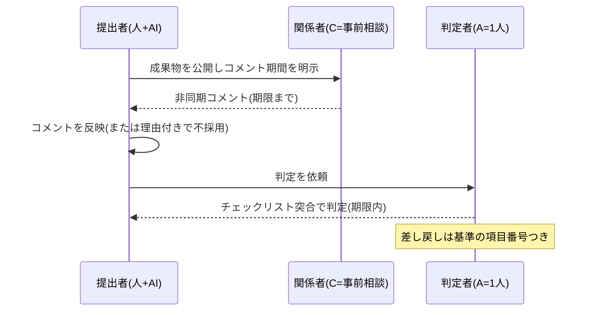

[統合プロセス参照モデル](/process-compass/processes/integrated/)の成果物を、そのままコピーして使えるテンプレートとして定義します。様式を固定するのは、AIに生成させる際の出力形式を安定させ、ゲート判定の突合を機械化しやすくするためです。

## 成果物と様式の対応

| 成果物 | 様式 | 主な読者 | ゲートとの関係 |
| --- | --- | --- | --- |
| 機能仕様書 | テンプレ1 | 価値責任者・AI・レビュア | G-2 / G-4 の判定対象 |
| 判断記録(ADR) | テンプレ2 | 技術判断者・後任者 | G-3 の判定対象、G-6 でコア機能の添付必須 |
| 技術負債台帳 | テンプレ3 | 開発者・QA・価値責任者 | G-5 / G-7 の突合対象 |
| ゲート判定記録 | テンプレ4 | QA・監査 | 全ゲートで作成、G-7 で完備確認 |
| 運用引き継ぎ文書 | テンプレ5 | 運用担当・後任者 | G-7 の判定対象 |

## テンプレ1: 機能仕様書(spec)

```markdown
# 機能仕様: <機能名>

- 機能ID: F-NNN
- コア指定: コア / 非コア(判断理由: ...)
- 価値責任者(A): <氏名>(委譲先: <氏名/なし>)

## 目的(なぜ作るか)
<この機能が生む価値を1〜3文で>

## 受入基準(検証可能な形式で。曖昧語禁止)
- AC-1: <条件> のとき、システムは <期待動作> すること
- AC-2: <条件> のとき、システムは <期待動作> すること
<!-- 「適切に」「柔軟に」「可能な限り」「〜など」「必要に応じて」「基本的に」は使用不可 -->

## スコープ外(やらないこと)
- <明示的に対象外とする事項>

## 前提・依存
- <この仕様が依存する前提。案件層コンテキストへの登録済みIDを併記>

## 未確定事項
- [NEEDS CLARIFICATION] <曖昧なまま残っている点。G-2/G-4 通過には解消が必要>
```

## テンプレ2: 判断記録(ADR)

サイトの[決定記録(ADR)](/process-compass/adr/)と同じ骨格に、技術判断用の欄を足した形です。

```markdown
# ADR-NNN: <決定の要約(動詞で終わる短文)>

- 状態: 採用 / 廃止 / 置き換え(→ ADR-MMM)
- 判定者(技術判断者): <氏名> / 判定日: YYYY-MM-DD
- 対象: <機能ID / コンポーネント>

## コンテキスト
<どんな課題・制約があったか>

## 決定
<何をどうすると決めたか>

## 比較した代替案(最低1つ)
| 案 | 利点 | 欠点 | 不採用の理由 |
| --- | --- | --- | --- |

## 可逆性
- 戻せる選択か: はい / いいえ
- いいえの場合、戻せなくなるもの: <データ形式・外部契約など>

## 非機能への影響
<性能・可用性・セキュリティへの影響見込み>
```

## テンプレ3: 技術負債台帳

```markdown
| ID | 記録日 | 内容 | 影響(放置した場合) | 受容理由 | 返却目安 | 状態 | 記録者 |
| --- | --- | --- | --- | --- | --- | --- | --- |
| D-001 | 2026-07-15 | <負債の内容> | <何が起きるか> | <なぜ今受容したか> | <時期/条件> | 未返却/返却済 | <氏名> |
```

運用ルール(である調 / 体言止め):

- 1行=1負債。AI生成過程で見つけた妥協・TODO・仮実装はすべて記録する
- 「受容理由」が書けない負債は受容してはならない(その場で直すか、仕様に戻す)
- 返却は[運用フェーズの負債返却サイクル](/process-compass/processes/integrated/operate/debt-payback/)で台帳から優先度順に消化する

## テンプレ4: ゲート判定記録

```markdown
# ゲート判定: <ゲート名> / <対象成果物ID>

- 判定者: <氏名> / 提出日時: ... / 判定日時: ...(滞留時間の計測に使用)
- 非同期コメント期間: <開始〜終了>(コメント数: N件)

## 判定結果
承認 / 条件付き承認 / 差し戻し

## チェックリスト突合
| # | 基準 | 結果 | 備考 |
| --- | --- | --- | --- |
<!-- ゲート判断基準ページの項目番号と対応させる -->

## 差し戻し理由(該当時のみ)
- 基準 #N を満たさない: <具体的な指摘>

## 挙動要約(G-6 独立レビューのみ必須)
<レビュアが自分の言葉で1〜2文>
```

## テンプレ5: 運用引き継ぎ文書

```markdown
# 運用引き継ぎ: <システム/機能名>

## 監視項目
| 項目 | 正常範囲 | 異常時の一次対応 |
| --- | --- | --- |

## 障害時の連絡先・体制
- コア機能の理解保持者: <氏名(複数)>
- エスカレーション順序: ...

## 復旧手順
- <手順書へのリンク。AI生成+人間検証済みであること>

## 既知の負債・制約
- 負債台帳の該当ID: D-NNN, D-MMM
```

## レビュープロセスの流れ

すべてのレビューは「**非同期コメント → 単独判定**」の2段で流れます。判定会議は開きません。



- コメントは「意見」であり、反映するかは提出者と判定者が決める。全コメントへの対応義務はない(合議化の防止)
- コメントの不採用には一言の理由を残す(納得感の担保。根回し文化の構造化)
- 判定記録(テンプレ4)がそのまま監査証跡になり、出荷判定(G-7)の突合対象になる

## AI への指示との関係

これらのテンプレートは、人間のためだけのものではありません。**AIに成果物を生成させる際の出力形式指定**としてコンテキスト基盤(恒久層)に登録します。様式が固定されているほど、AI生成 → 機械チェック(曖昧語検査・必須欄の欠落検査)→ 人間判定、の流れが安定します。具体的な組み込みはフェーズ5(プロセス実装)で扱います。
