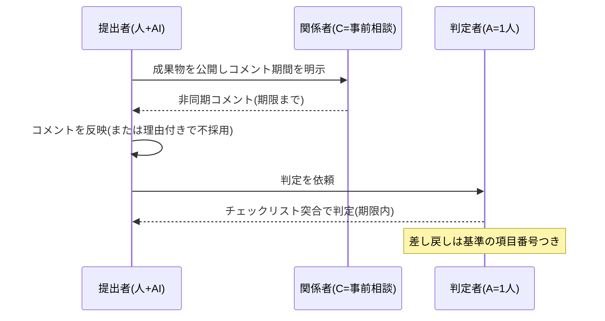

[統合プロセス参照モデル](/process-compass/processes/integrated/)の成果物を、そのままコピーして使えるテンプレートとして定義します。様式を固定するのは、AIに生成させる際の出力形式を安定させ、ゲート判定の突合を機械化しやすくするためです。

## データとドキュメントのインターフェース

本標準は、プロセスの構造を[スキーマ駆動のデータ](/process-compass/processes/integrated/)(`src/data/processes/integrated.yaml`)として保持し、判断の基準を本文の各章に規定します。同一の事項が両方に現れるため、要素ごとに正本を次のとおり定めます。

| 情報の種類 | 正本 | 従属側の扱い |
| --- | --- | --- |
| 要素の存在・識別子・関係(フェーズ、ゲート、ロール、成果物、タスク、順序) | データ(YAML) | 本文は識別子とラベルで参照する |
| 判定基準の内容・閾値・期限・様式・例外の扱い | 本文の各章 | データ側の記述は要約であり正本ではない |
| 用語の定義 | [第1章 1.4](/process-compass/phase4-process-design/overview/) | データ側の名称は表示名であり定義ではない |

参照の規則は次のとおりです。

- 本文からデータを参照するときは、識別子(例: `g-ship`)またはラベル(例: G-7)を用いる。名称や説明文の一致を前提としない
- データから本文を参照するときは、ページのスラッグまでを指定する。見出しへのアンカーは張らない
- データ側の判定基準には、閾値・数値・期限を書かない。これらは組織ごとに変わるため本文およびテーラリング規則が保持する

構造の変更は、次の順序で行わなければなりません。逆順を禁止します。

1. データ(YAML)を変更する
2. `npm run check` でスキーマ検証と内部リンク検証を通す
3. 影響する章の本文を更新する

## 成果物と様式の対応

| 成果物 | 様式 | 主な読者 | ゲートとの関係 |
| --- | --- | --- | --- |
| 意思決定・エスカレーション体制図(D-0) | テンプレ0 | 全関係者・監査 | G-1 の前提条件、SG の提出対象 |
| 機能仕様書 | テンプレ1 | 価値責任者・AI・レビュア | G-2 / G-4 の判定対象 |
| 判断記録(ADR) | テンプレ2 | 技術判断者・後任者 | G-3 の判定対象、G-6 でコア機能の添付必須 |
| 技術負債台帳 | テンプレ3 | 開発者・QA・価値責任者 | G-5 / G-7 の突合対象 |
| ゲート判定記録 | テンプレ4 | QA・監査 | 全ゲートで作成、G-7 で完備確認 |
| 運用引き継ぎ文書 | テンプレ5 | 運用担当・後任者 | G-7 の判定対象 |
| 企画書(事業意図) | テンプレ6 | 事業決裁者・価値責任者 | G-1 の判定対象 |
| 実装計画(タスク分解) | テンプレ7 | 価値責任者・AI・開発者 | G-4 の判定対象 |
| AI-SLA 合意確認書 | テンプレ8 | 調達・法務・委託先 | G-7 の突合対象、契約の添付 |

## テンプレ0: 意思決定・エスカレーション体制図(D-0)

案件の開始時に、**誰が決めるか**と**どこまでなら自分で決めてよいか**を1つの文書で確定させる様式です。案件で最初に作成する成果物であり、企画承認(G-1)の前提条件です([第2章 2.8](/process-compass/phase4-process-design/lifecycle/))。

この様式が満たすべき条件は3点です。いずれかを欠いた体制図は、判断が必要な場面で機能しません。

| # | 条件 | 欠いた場合に起きること |
| --- | --- | --- |
| 1 | 決定の種類ごとに、決定者が1名に特定されている | 決定が下されない、または下された決定が覆る |
| 2 | 各層の権限境界が数値で書かれている | 判断のたびに上位へ確認が発生する |
| 3 | 境界を超えたときの通知先と応答期限が書かれている | 逸脱が上位へ届かないまま蓄積する |

### 平常時と障害時を分ける

**平常時の意思決定階層と、障害対応時の指揮系統は別の表に書きます**(表3と表4)。障害時の指揮は職位ではなく知識と状況の把握度で割り当てるためです。1つの表に混在させると、障害時にも平常時の報告経路をたどる運用が復活し、初動が遅れます。

### 個人名を1か所へ隔離する

表1〜表4は**役割名だけで記述**し、個人名は表5にのみ書きます。人事異動のたびに更新するのは表5だけになります。

```markdown
# 意思決定・エスカレーション体制図(D-0): <案件名>

- 案件ID: P-NNN / 版: v1.0
- 承認日時: YYYY-MM-DD HH:MM / 承認者: <氏名>(<役職>)
- 承認の意味: 本文書に記載した権限配分と通知経路に合意する
- 次回レビュー期日: YYYY-MM-DD
- 変更履歴: <版管理へのリンク>

## 表1: 決定の権限

| 決定の種類 | 決定(1名) | 同意(拒否権あり) | 起案 | 意見 | 実行 |
| --- | --- | --- | --- | --- | --- |
| 投資の継続・中止 | | | | | |
| 事業ステージの移行 | | | | | |
| 要件・受入基準の確定 | | | | | |
| 技術設計・アーキテクチャ | | | | | |
| 出荷の可否 | | | | | |
| セキュリティ要件の受容 | | | | | |
| 例外承認(第7章 7.3) | | | | | |
<!-- 「決定」欄に2名以上を書いてはならない。二重の指揮系統が実在する場合も、
     その事実を備考へ書いたうえで最終決定者を1名選ぶ -->

## 表2: 権限境界(トレランス)

各層が上位の承認なく動ける範囲を数値で記述します。

| 領域 | チーム層 | 案件層 | 経営層 |
| --- | --- | --- | --- |
| 日程 | | | |
| 費用 | | | |
| AI実行予算 | | | |
| スコープ | | | |
| 品質(未解決欠陥) | | | |
| リスク | | | |
<!-- 第7章 7.6 のエスカレーション閾値、および 7.7 の予算区分と同じ数値を用いる -->

## 表3: 平常時のエスカレーション

| 発火条件 | 通知先(役割) | 応答期限 | 決裁権限 |
| --- | --- | --- | --- |
| 表2 のチーム層の境界を超える見込み | | | |
| 表2 の案件層の境界を超える見込み | | | |
| ゲート判定が期限を超過 | | | |
| 事業性の前提が崩れた | | | |
<!-- 「超えた時点」ではなく「超える見込みが立った時点」で発火させる -->

## 表4: 障害時のエスカレーション

| 重大度 | 指揮者の指名方法 | 一次対応 | 二次 | 三次 | 対外連絡 |
| --- | --- | --- | --- | --- | --- |
| Sev1 | | | | | |
| Sev2 | | | | | |
| Sev3 | | | | | |
<!-- 役割名のみで記述する。個人名は表5を参照させる -->
<!-- 指揮者は職位ではなく、事象の把握度で指名する -->

## 表5: 役割と現任者の対応

| 役割 | 現任者 | 代理者 | 連絡手段 | 最終更新日 |
| --- | --- | --- | --- | --- |
<!-- 人事異動で更新するのはこの表のみ -->

## 表6: 独立性の確認

| 確認事項 | 該当者 |
| --- | --- |
| 開発ラインから独立した出荷判定者 | |
| 案件に関与していない点検の実施者(第7章 7.7.6) | |
| 監査の窓口 | |

## 更新の契機

- 四半期ごと
- 表5 の記載者に異動が生じたとき
- ステージ移行ゲートの判定時
- Sev1 事象の事後レビュー時
```

### 記録としての要求事項

D-0 は監査の対象です。記録として成立するために、次を満たさなければなりません。

| # | 要求事項 | 理由 |
| --- | --- | --- |
| 1 | 承認者を後から同定できる | 口頭の合意は監査証拠として扱えない |
| 2 | 承認の日時が記録されている | 承認の前後関係を検証できる必要がある |
| 3 | 承認が何に対するものかが明記されている | 「承認」の対象と意味が文脈依存になることを防ぐ |
| 4 | 変更の履歴が保持され、過去の版を隠蔽しない | 改ざんの有無を検証できる必要がある |
| 5 | 次回レビュー期日が記載されている | 期日のない文書は更新されない |

Git 上で管理する場合の具体的な構成([フェーズ5](/process-compass/phase5-implementation/ci-gates/))では、要求事項1を所有者定義による承認、要求事項2をマージ日時、要求事項3を申請様式への明記、要求事項4を版管理で満たします。

## テンプレ1: 機能仕様書(spec)

```markdown
# 機能仕様: <機能名>

- 機能ID: F-NNN
- コア指定: コア / 非コア(判断理由: ...)
- 価値責任者(A): <氏名>(委譲先: <氏名/なし>)

## 目的(なぜ作るか)
<この機能が生む価値を1〜3文で>

## 受入基準(検証可能な形式で。曖昧語禁止)
- AC-1: <条件> のとき、システムは <期待動作> すること
- AC-2: <条件> のとき、システムは <期待動作> すること
<!-- 「適切に」「柔軟に」「可能な限り」「〜など」「必要に応じて」「基本的に」は使用不可 -->

## スコープ外(やらないこと)
- <明示的に対象外とする事項>

## 前提・依存
- <この仕様が依存する前提。案件層コンテキストへの登録済みIDを併記>

## 未確定事項
- [NEEDS CLARIFICATION] <曖昧なまま残っている点。G-2/G-4 通過には解消が必要>
```

## テンプレ2: 判断記録(ADR)

サイトの[決定記録(ADR)](/process-compass/adr/)と同じ骨格に、技術判断用の欄を足した形です。

```markdown
# ADR-NNN: <決定の要約(動詞で終わる短文)>

- 状態: 採用 / 廃止 / 置き換え(→ ADR-MMM)
- 判定者(技術判断者): <氏名> / 判定日: YYYY-MM-DD
- 対象: <機能ID / コンポーネント>

## コンテキスト
<どんな課題・制約があったか>

## 決定
<何をどうすると決めたか>

## 比較した代替案(最低1つ)
| 案 | 利点 | 欠点 | 不採用の理由 |
| --- | --- | --- | --- |

## 可逆性
- 戻せる選択か: はい / いいえ
- いいえの場合、戻せなくなるもの: <データ形式・外部契約など>

## 非機能への影響
<性能・可用性・セキュリティへの影響見込み>
```

## テンプレ3: 技術負債台帳

```markdown
| ID | 記録日 | 内容 | 影響(放置した場合) | 受容理由 | 返却目安 | 状態 | 記録者 |
| --- | --- | --- | --- | --- | --- | --- | --- |
| D-001 | 2026-07-15 | <負債の内容> | <何が起きるか> | <なぜ今受容したか> | <時期/条件> | 未返却/返却済 | <氏名> |
```

運用ルール(である調 / 体言止め):

- 1行=1負債。AI生成過程で見つけた妥協・TODO・仮実装はすべて記録する<!-- tone-ok: 記録対象としての TODO への言及 -->
- 「受容理由」が書けない負債は受容してはならない(その場で直すか、仕様に戻す)
- 返却は[運用フェーズの負債返却サイクル](/process-compass/processes/integrated/operate/debt-payback/)で台帳から優先度順に消化する

## テンプレ4: ゲート判定記録

```markdown
# ゲート判定: <ゲート名> / <対象成果物ID>

- 判定者: <氏名> / 提出日時: ... / 判定日時: ...(滞留時間の計測に使用)
- 非同期コメント期間: <開始〜終了>(コメント数: N件)

## 判定結果
承認 / 条件付き承認 / 差し戻し

## チェックリスト突合
| # | 基準 | 結果 | 備考 |
| --- | --- | --- | --- |
<!-- ゲート判断基準ページの項目番号と対応させる -->

## 差し戻し理由(該当時のみ)
- 基準 #N を満たさない: <具体的な指摘>

## 挙動要約(G-6 独立レビューのみ必須)
<レビュアが自分の言葉で1〜2文>

## 決断の記録(G-8・SG・例外承認で必須)
| 欄 | 記載 |
| --- | --- |
| 確認した事項 | <判断の根拠として実際に確認したもの> |
| 確認していない事項 | <確認しなかった範囲。「なし」は不可> |
| 判断が変わる条件 | <どの事実が異なれば別の判断になるか> |
| 受容したリスク | <受容した内容と、顕在化した場合の対処> |

## 比較した選択肢(R1 および例外承認で必須)
| 案 | 到達点 | 残るリスク | 採否 |
| --- | --- | --- | --- |
<!-- AI が案とリスクの見積を提示してよい。採否の理由は人が記入する -->
```

決断の記録の各欄は[第5章 5.7.2](/process-compass/phase4-process-design/human-ai-boundary/)に対応します。**「確認していない事項」が空欄、または「なし」と記載された記録は無効**です。

## テンプレ5: 運用引き継ぎ文書

```markdown
# 運用引き継ぎ: <システム/機能名>

## 監視項目
| 項目 | 正常範囲 | 異常時の一次対応 |
| --- | --- | --- |

## 障害時の連絡先・体制
- コア機能の理解保持者: <氏名(複数)>
- エスカレーション順序: ...

## 復旧手順
- <手順書へのリンク。AI生成+人間検証済みであること>

## 既知の負債・制約
- 負債台帳の該当ID: D-NNN, D-MMM
```

## テンプレ6: 企画書(intent-brief)

企画承認(G-1)の判定基準3項目(投資対効果・リスク受容・コンテキスト整備の予算化)と欄を1対1で対応させています。

```markdown
# 企画書: <プロダクト / 案件名>

- 起案者(価値責任者): <氏名> / 起案日: YYYY-MM-DD
- 決裁者(事業決裁者): <氏名> / 決裁日: YYYY-MM-DD

## 目的と価値仮説
<誰の・何が・どれだけ変わるか。測れない表現(「業務を効率化」等)は不可>

## 投資対効果(G-1 基準1)
| 項目 | 概算 |
| --- | --- |
| 初期開発費 | |
| コンテキスト基盤の初期整備費 | <明文化の工数。ゼロは不可(G-1 基準3)> |
| 運用費(年) | |
| 期待効果(年) | <価値仮説の金額換算と算定根拠> |

## リスクと受容方針(G-1 基準2)
| リスク | 影響 | 方針(受容/低減/回避) | 判断者 |
| --- | --- | --- | --- |
<!-- AI利用に伴うリスク(生成物の品質・機密情報の扱い)を必ず1行以上含める -->

## コア機能の候補
- <事業上致命的で、人の理解維持が必須の機能。全部コア・全部非コアは不可>

## スコープ外
- <この企画でやらないこと>

## マイルストーン(概略)
- <PoC / MVP / 本番などの節目と時期>
```

## テンプレ7: 実装計画(plan)

機能仕様承認(G-4)の判定基準「タスク分解の粒度が検証可能(1タスク=1レビュー単位)」を突合できる様式です。

```markdown
# 実装計画: F-NNN <機能名>

- 起案: AI(<エージェント名>) / 承認者: <価値責任者または委譲先> / 承認日: YYYY-MM-DD
- 対応仕様: 機能仕様書 F-NNN(受入基準 AC-1〜AC-M)

## タスク分解
| Task | 内容 | 対応AC | 依存 | 並列可否 | 見積 | 状態 |
| --- | --- | --- | --- | --- | --- | --- |
| Task-1 | <変更内容の要約> | AC-1 | なし | 可 | 〜4h | 未着手 |
| Task-2 | ... | AC-2, AC-3 | Task-1 | 不可 | 〜4h | 未着手 |

## 粒度チェック(G-4 提出前セルフチェック)
- [ ] 各タスクが1ブランチ=1PRで完結する(±400行・レビュー30分以内)
- [ ] 各タスクがどの受入基準(AC)に対応するか明記した
- [ ] 依存のないタスク同士は並列可と明示した(AIの並列実行に使う)

## 実装順序
<依存関係から導いた着手順。並列で走らせるタスクの組を明示>
```

運用ルール(である調 / 体言止め):

- 見積が8時間を超えるタスクは分割必須(レビュー可能な大きさが上限。[PR 運用リファレンス](/process-compass/phase5-implementation/pr-workflow/)のサイズ上限と対応)
- タスクの状態更新は Draft PR の作成をもって「着手」とする(計画表と PR 一覧が1対1になる)

## テンプレ8: AI-SLA 合意確認書(委託契約の添付)

委託先が AI を用いて成果物を作成する場合に、契約へ添付する確認書です。指標の定義は[第4章「AI 品質指標の扱い」](/process-compass/phase4-process-design/gate-criteria/)によります。

### 契約への組み込み方の3類型

| 類型 | 内容 | 適する対象 |
| --- | --- | --- |
| 金銭措置型 | 未達に対して料金の減額を適用する | 稼働率など機械的に観測できる量 |
| 是正計画型 | 未達に対して是正計画の提出を求める | 品質に関する比率指標 |
| 開示義務型 | AI 利用の範囲と生成部分の識別を義務づけ、品質は契約上の不適合責任で処理する | すべての委託 |

**品質に関する比率指標を、金銭措置の条件にしてはなりません**。理由は2つです。

- 母数が小さい期間では比率が大きく振れ、測定方法の解釈をめぐる紛争の費用が高くなる
- 金銭が絡むと未達の過小報告が誘発され、品質の実態がかえって見えなくなる

本標準は、出荷判定では是正計画型と開示義務型を、契約では開示義務型を基本とします。金銭措置型は、稼働率など客観的に観測できる量に限って用います。

### 様式

```markdown
# AI-SLA 合意確認書

- 契約番号 / 案件ID:
- 委託先:
- 合意日:

## 1. AI 利用の開示
| 項目 | 記載 |
| --- | --- |
| AI の利用 | 有 / 無 |
| 利用する工程 | 要件 / 設計 / 実装 / テスト / 文書 |
| 用いるモデルまたはサービス | |
| 生成部分の識別方法 | <例: コミットのトレーラ、変更単位の記録> |

<!-- AI を利用する場合、成果物のどの部分が生成されたかを識別できる状態で納品する -->

## 2. 測定する指標
| 指標 | 定義 | 観測窓 | 母数の下限 | 閾値 |
| --- | --- | --- | --- | --- |
<!-- 定義は本標準 第4章「AI 品質指標の扱い」による。定義を添付しない提示は不可 -->

## 3. 閾値を超過した場合の措置
| 段階 | 条件 | 措置 |
| --- | --- | --- |
| 1 | 観測窓で閾値を超過した | 原因の報告 |
| 2 | 2期連続で超過した | 是正計画の提出(第4項) |
| 3 | 是正計画の期限内に改善しない | 契約に定める措置 |

## 4. 是正計画の記載事項
| 項目 | 記載 |
| --- | --- |
| 発動の根拠となった観測値 | |
| 原因の分析 | |
| 是正の措置と実施の期限 | |
| 有効性を確認する方法と時期 | |
| 実施の記録 | |

## 5. 監査
| 項目 | 記載 |
| --- | --- |
| 監査の範囲 | |
| 事前通知の期間 | |
| 提示を求める記録 | ゲート判定記録、判断記録、指標の算出根拠 |

## 6. 権利と責任
| 項目 | 記載 |
| --- | --- |
| 生成物の権利帰属 | |
| 第三者の権利侵害が生じた場合の対応 | |
| 秘密情報を外部サービスへ送出することの可否 | |

## 7. 合意
| 役割 | 氏名 | 日付 |
| --- | --- | --- |
| 委託者 | | |
| 受託者 | | |
```

:::caution
本様式の指標と閾値は、本標準が定義したものです。外部の標準に基づく値ではありません。契約の相手方へ提示する際は、定義と算出方法を必ず添付し、合意のうえで用いてください。**定義を共有しないまま比率だけを条件にすると、測定方法の解釈をめぐる紛争になります**。
:::

EU 域内に関わる案件では、生成された出力を機械可読な形式で識別できるようにする義務が2026-08-02 から適用されています。第1項の「生成部分の識別方法」は、この要求とも対応します。

## レビュープロセスの流れ

すべてのレビューは「**非同期コメント → 単独判定**」の2段で流れます。判定会議は開きません。


```mermaid
sequenceDiagram
  participant S as 提出者(人+AI)
  participant C as 関係者(C=事前相談)
  participant J as 判定者(A=1人)
  S->>C: 成果物を公開しコメント期間を明示
  C-->>S: 非同期コメント(期限まで)
  S->>S: コメントを反映(または理由付きで不採用)
  S->>J: 判定を依頼
  J-->>S: チェックリスト突合で判定(期限内)
  Note over J: 差し戻しは基準の項目番号つき
```

- コメントは「意見」であり、反映するかは提出者と判定者が決める。全コメントへの対応義務はない(合議化の防止)
- コメントの不採用には一言の理由を残す(納得感の担保)
- 判定記録(テンプレ4)がそのまま監査証跡になり、出荷判定(G-7)の突合対象になる

## 判断の順序に関する要求事項

人間が先に自分の判断を確定し、その後に AI の出力を参照する構成は、AI の提示へ引きずられる効果を抑えます。この順序の効果は対照実験で確認されており、判断の質を保つ手段として現時点で最も根拠が厚いものです(2021年・2022年)。

航空機の運航手順が「記憶に基づいて操作し、チェックリストはその検証に用いる」という順序を採るのも同じ構造です。手順書を読みながら操作する方式は、独立した検証を失います。

### 実装作業における順序

| 段階 | 行為 | 次段階へ進む条件 |
| --- | --- | --- |
| 1 | 実装の方針を自分の言葉で記述する | 記述が存在する |
| 2 | AI の生成結果を参照する | — |
| 3 | 方針と生成結果の相違を記録する | 相違の有無が明示されている |

- **コア機能およびリスク区分 R1 の変更では、段階1を経ずに段階2へ進んではならない**
- 非コア機能かつ R3 の変更では、段階1を省略してよい

省略を認める理由は、摩擦を一律に課すと総量が増え、個々の摩擦が無視されるためです([第5章 5.7.5](/process-compass/phase4-process-design/human-ai-boundary/))。摩擦は配分する資源として扱います。

順序を強制する手段(ツールの機能・運用規律・レビュー時の確認のいずれか)は問いません。本標準が要求するのは順序であり、実現手段ではありません。

### 判定における対比

リリース決裁・ステージ移行・例外承認では、2案以上の比較を経た記録を求めます(テンプレ4の「比較した選択肢」)。

- AI エージェントは、案とリスクの見積を提示できる
- **採否の理由は人間が記入する**。生成させてはならない

:::caution
段階的な開示と対比による説明は、判断が難しい局面ほど効果が下がります。説明の提示による過度な依存の低減は、人間が自力で検証できる易しい課題では確認されている一方、難しい課題では確認されていません(2024年)。

したがって、これらの仕組みを難しい判断に対する唯一の防御としてはなりません。[第5章 5.6.2](/process-compass/phase4-process-design/human-ai-boundary/)の欠陥注入による測定と併用します。
:::

## AI への指示との関係

これらのテンプレートは、人間のためだけのものではありません。**AIに成果物を生成させる際の出力形式指定**としてコンテキスト基盤(恒久層)に登録します。様式が固定されているほど、AI生成 → 機械チェック(曖昧語検査・必須欄の欠落検査)→ 人間判定、の流れが安定します。具体的な組み込みはフェーズ5(プロセス実装)で扱います。
