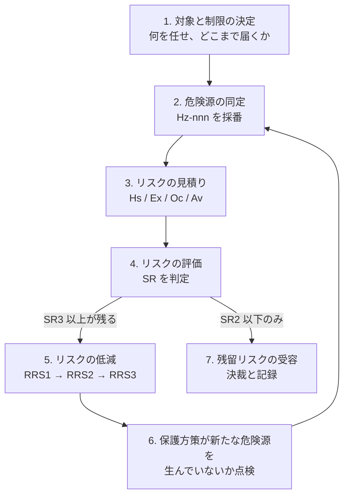
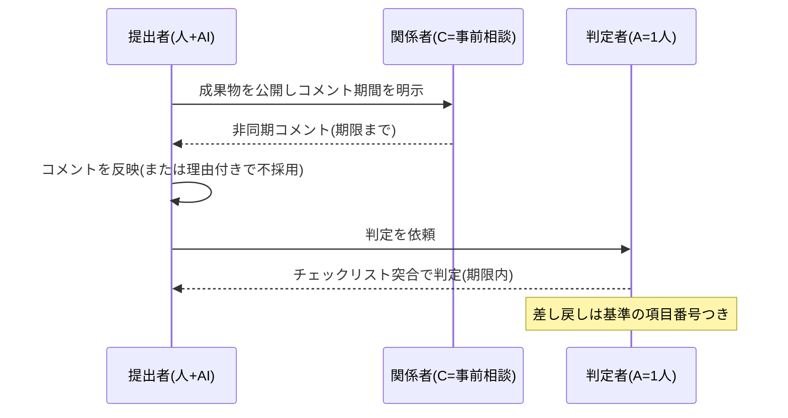

[統合プロセス参照モデル](/process-compass/processes/integrated/)の成果物を、そのままコピーして使えるテンプレートとして定義します。様式を固定するのは、AIに生成させる際の出力形式を安定させ、ゲート判定の突合を機械化しやすくするためです。

## データとドキュメントのインターフェース

本標準は、プロセスの構造を[スキーマ駆動のデータ](/process-compass/processes/integrated/)(`src/data/processes/integrated.yaml`)として保持し、判断の基準を本文の各章に規定します。同一の事項が両方に現れるため、要素ごとに正本を次のとおり定めます。

| 情報の種類 | 正本 | 従属側の扱い |
| --- | --- | --- |
| 要素の存在・識別子・関係(フェーズ、ゲート、ロール、成果物、タスク、順序) | データ(YAML) | 本文は識別子とラベルで参照する |
| 判定基準の内容・閾値・期限・様式・例外の扱い | 本文の各章 | データ側の記述は要約であり正本ではない |
| 用語の定義 | [第1章 1.4](/process-compass/phase4-process-design/overview/) | データ側の名称は表示名であり定義ではない |

参照の規則は次のとおりです。

- 本文からデータを参照するときは、識別子(例: `g-ship`)またはラベル(例: G-7)を用いる。名称や説明文の一致を前提としない
- データから本文を参照するときは、ページのスラッグまでを指定する。見出しへのアンカーは張らない
- データ側の判定基準には、閾値・数値・期限を書かない。これらは組織ごとに変わるため本文およびテーラリング規則が保持する

構造の変更は、次の順序で行わなければなりません。逆順を禁止します。

1. データ(YAML)を変更する
2. `npm run check` でスキーマ検証と内部リンク検証を通す
3. 影響する章の本文を更新する

## 成果物と様式の対応

| 成果物 | 様式 | 主な読者 | ゲートとの関係 |
| --- | --- | --- | --- |
| 意思決定・エスカレーション体制図(D-0) | テンプレ0 | 全関係者・監査 | G-1 の前提条件、SG の提出対象 |
| 機能仕様書 | テンプレ1 | 価値責任者・AI・レビュア | G-2 / G-4 の判定対象 |
| 判断記録(ADR) | テンプレ2 | 技術判断者・後任者 | G-3 の判定対象、G-6 でコア機能の添付必須 |
| 技術負債台帳 | テンプレ3 | 開発者・QA・価値責任者 | G-5 / G-7 の突合対象 |
| ゲート判定記録 | テンプレ4 | QA・監査 | 全ゲートで作成、G-7 で完備確認 |
| 運用引き継ぎ文書 | テンプレ5 | 運用担当・後任者 | G-7 の判定対象 |
| 企画書(事業意図) | テンプレ6 | 事業決裁者・価値責任者 | G-1 の判定対象 |
| 実装計画(タスク分解) | テンプレ7 | 価値責任者・AI・開発者 | G-4 の判定対象 |
| AI-SLA 合意確認書 | テンプレ8 | 調達・法務・委託先 | G-7 の突合対象、契約の添付 |
| AIエージェント安全リスクアセスメント表 | テンプレ9 | 技術判断者・安全担当・監査 | 適用条件に該当する案件で G-1 の前提条件 |

## テンプレ0: 意思決定・エスカレーション体制図(D-0)

案件の開始時に、**誰が決めるか**と**どこまでなら自分で決めてよいか**を1つの文書で確定させる様式です。案件で最初に作成する成果物であり、企画承認(G-1)の前提条件です([第2章 2.8](/process-compass/phase4-process-design/lifecycle/))。

この様式が満たすべき条件は3点です。いずれかを欠いた体制図は、判断が必要な場面で機能しません。

| # | 条件 | 欠いた場合に起きること |
| --- | --- | --- |
| 1 | 決定の種類ごとに、決定者が1名に特定されている | 決定が下されない、または下された決定が覆る |
| 2 | 各層の権限境界が数値で書かれている | 判断のたびに上位へ確認が発生する |
| 3 | 境界を超えたときの通知先と応答期限が書かれている | 逸脱が上位へ届かないまま蓄積する |

### 平常時と障害時を分ける

**平常時の意思決定階層と、障害対応時の指揮系統は別の表に書きます**(表3と表4)。障害時の指揮は職位ではなく知識と状況の把握度で割り当てるためです。1つの表に混在させると、障害時にも平常時の報告経路をたどる運用が復活し、初動が遅れます。

### 個人名を1か所へ隔離する

表1〜表4は**役割名だけで記述**し、個人名は表5にのみ書きます。人事異動のたびに更新するのは表5だけになります。

```markdown
# 意思決定・エスカレーション体制図(D-0): <案件名>

- 案件ID: P-NNN / 版: v1.0
- 承認日時: YYYY-MM-DD HH:MM / 承認者: <氏名>(<役職>)
- 承認の意味: 本文書に記載した権限配分と通知経路に合意する
- 次回レビュー期日: YYYY-MM-DD
- 変更履歴: <版管理へのリンク>

## 表1: 決定の権限

| 決定の種類 | 決定(1名) | 同意(拒否権あり) | 起案 | 意見 | 実行 |
| --- | --- | --- | --- | --- | --- |
| 投資の継続・中止 | | | | | |
| 事業ステージの移行 | | | | | |
| 要件・受入基準の確定 | | | | | |
| 技術設計・アーキテクチャ | | | | | |
| 出荷の可否 | | | | | |
| セキュリティ要件の受容 | | | | | |
| 例外承認(第7章 7.3) | | | | | |
<!-- 「決定」欄に2名以上を書いてはならない。二重の指揮系統が実在する場合も、
     その事実を備考へ書いたうえで最終決定者を1名選ぶ -->

## 表2: 権限境界(トレランス)

各層が上位の承認なく動ける範囲を数値で記述します。

| 領域 | チーム層 | 案件層 | 経営層 |
| --- | --- | --- | --- |
| 日程 | | | |
| 費用 | | | |
| AI実行予算 | | | |
| スコープ | | | |
| 品質(未解決欠陥) | | | |
| リスク | | | |
<!-- 第7章 7.6 のエスカレーション閾値、および 7.7 の予算区分と同じ数値を用いる -->

## 表3: 平常時のエスカレーション

| 発火条件 | 通知先(役割) | 応答期限 | 決裁権限 |
| --- | --- | --- | --- |
| 表2 のチーム層の境界を超える見込み | | | |
| 表2 の案件層の境界を超える見込み | | | |
| ゲート判定が期限を超過 | | | |
| 事業性の前提が崩れた | | | |
<!-- 「超えた時点」ではなく「超える見込みが立った時点」で発火させる -->

## 表4: 障害時のエスカレーション

| 重大度 | 指揮者の指名方法 | 一次対応 | 二次 | 三次 | 対外連絡 |
| --- | --- | --- | --- | --- | --- |
| Sev1 | | | | | |
| Sev2 | | | | | |
| Sev3 | | | | | |
<!-- 役割名のみで記述する。個人名は表5を参照させる -->
<!-- 指揮者は職位ではなく、事象の把握度で指名する -->

## 表5: 役割と現任者の対応

| 役割 | 現任者 | 代理者 | 連絡手段 | 最終更新日 |
| --- | --- | --- | --- | --- |
<!-- 人事異動で更新するのはこの表のみ -->

## 表6: 独立性の確認

| 確認事項 | 該当者 |
| --- | --- |
| 開発ラインから独立した出荷判定者 | |
| 案件に関与していない点検の実施者(第7章 7.7.6) | |
| 監査の窓口 | |

## 更新の契機

- 四半期ごと
- 表5 の記載者に異動が生じたとき
- ステージ移行ゲートの判定時
- Sev1 事象の事後レビュー時
```

### 記録としての要求事項

D-0 は監査の対象です。記録として成立するために、次を満たさなければなりません。

| # | 要求事項 | 理由 |
| --- | --- | --- |
| 1 | 承認者を後から同定できる | 口頭の合意は監査証拠として扱えない |
| 2 | 承認の日時が記録されている | 承認の前後関係を検証できる必要がある |
| 3 | 承認が何に対するものかが明記されている | 「承認」の対象と意味が文脈依存になることを防ぐ |
| 4 | 変更の履歴が保持され、過去の版を隠蔽しない | 改ざんの有無を検証できる必要がある |
| 5 | 次回レビュー期日が記載されている | 期日のない文書は更新されない |

Git 上で管理する場合の具体的な構成([フェーズ5](/process-compass/phase5-implementation/ci-gates/))では、要求事項1を所有者定義による承認、要求事項2をマージ日時、要求事項3を申請様式への明記、要求事項4を版管理で満たします。

## テンプレ1: 機能仕様書(spec)

```markdown
# 機能仕様: <機能名>

- 機能ID: F-NNN
- コア指定: コア / 非コア(判断理由: ...)
- 価値責任者(A): <氏名>(委譲先: <氏名/なし>)

## 目的(なぜ作るか)
<この機能が生む価値を1〜3文で>

## 受入基準(検証可能な形式で。曖昧語禁止)
- AC-1: <条件> のとき、システムは <期待動作> すること
- AC-2: <条件> のとき、システムは <期待動作> すること
<!-- 「適切に」「柔軟に」「可能な限り」「〜など」「必要に応じて」「基本的に」は使用不可 -->

## スコープ外(やらないこと)
- <明示的に対象外とする事項>

## 前提・依存
- <この仕様が依存する前提。案件層コンテキストへの登録済みIDを併記>

## 未確定事項
- [NEEDS CLARIFICATION] <曖昧なまま残っている点。G-2/G-4 通過には解消が必要>
```

## テンプレ2: 判断記録(ADR)

サイトの[決定記録(ADR)](/process-compass/adr/)と同じ骨格に、技術判断用の欄を足した形です。

```markdown
# ADR-NNN: <決定の要約(動詞で終わる短文)>

- 状態: 採用 / 廃止 / 置き換え(→ ADR-MMM)
- 判定者(技術判断者): <氏名> / 判定日: YYYY-MM-DD
- 対象: <機能ID / コンポーネント>

## コンテキスト
<どんな課題・制約があったか>

## 決定
<何をどうすると決めたか>

## 比較した代替案(最低1つ)
| 案 | 利点 | 欠点 | 不採用の理由 |
| --- | --- | --- | --- |

## 可逆性
- 戻せる選択か: はい / いいえ
- いいえの場合、戻せなくなるもの: <データ形式・外部契約など>

## 非機能への影響
<性能・可用性・セキュリティへの影響見込み>
```

## テンプレ3: 技術負債台帳

```markdown
| ID | 記録日 | 内容 | 影響(放置した場合) | 受容理由 | 返却目安 | 状態 | 記録者 |
| --- | --- | --- | --- | --- | --- | --- | --- |
| D-001 | 2026-07-15 | <負債の内容> | <何が起きるか> | <なぜ今受容したか> | <時期/条件> | 未返却/返却済 | <氏名> |
```

運用ルール(である調 / 体言止め):

- 1行=1負債。AI生成過程で見つけた妥協・TODO・仮実装はすべて記録する<!-- tone-ok: 記録対象としての TODO への言及 -->
- 「受容理由」が書けない負債は受容してはならない(その場で直すか、仕様に戻す)
- 返却は[運用フェーズの負債返却サイクル](/process-compass/processes/integrated/operate/debt-payback/)で台帳から優先度順に消化する

## テンプレ4: ゲート判定記録

```markdown
# ゲート判定: <ゲート名> / <対象成果物ID>

- 判定者: <氏名> / 提出日時: ... / 判定日時: ...(滞留時間の計測に使用)
- 非同期コメント期間: <開始〜終了>(コメント数: N件)

## 判定結果
承認 / 条件付き承認 / 差し戻し

## チェックリスト突合
| # | 基準 | 結果 | 備考 |
| --- | --- | --- | --- |
<!-- ゲート判断基準ページの項目番号と対応させる -->

## 差し戻し理由(該当時のみ)
- 基準 #N を満たさない: <具体的な指摘>

## 挙動要約(G-6 独立レビューのみ必須)
<レビュアが自分の言葉で1〜2文>

## 決断の記録(G-8・SG・例外承認で必須)
| 欄 | 記載 |
| --- | --- |
| 確認した事項 | <判断の根拠として実際に確認したもの> |
| 確認していない事項 | <確認しなかった範囲。「なし」は不可> |
| 判断が変わる条件 | <どの事実が異なれば別の判断になるか> |
| 受容したリスク | <受容した内容と、顕在化した場合の対処> |

## 比較した選択肢(R1 および例外承認で必須)
| 案 | 到達点 | 残るリスク | 採否 |
| --- | --- | --- | --- |
<!-- AI が案とリスクの見積を提示してよい。採否の理由は人が記入する -->
```

決断の記録の各欄は[第5章 5.7.2](/process-compass/phase4-process-design/human-ai-boundary/)に対応します。**「確認していない事項」が空欄、または「なし」と記載された記録は無効**です。

## テンプレ5: 運用引き継ぎ文書

```markdown
# 運用引き継ぎ: <システム/機能名>

## 監視項目
| 項目 | 正常範囲 | 異常時の一次対応 |
| --- | --- | --- |

## 障害時の連絡先・体制
- コア機能の理解保持者: <氏名(複数)>
- エスカレーション順序: ...

## 復旧手順
- <手順書へのリンク。AI生成+人間検証済みであること>

## 既知の負債・制約
- 負債台帳の該当ID: D-NNN, D-MMM
```

## テンプレ6: 企画書(intent-brief)

企画承認(G-1)の判定基準4項目と欄を対応させています。

### 企画で評価する6つの観点

企画の評価は、次の6観点で行います。**財務は最初の観点ではありません**。事業投資の実務では、初期の選別に財務基準を置かない構成が採られており、財務手法に依拠したポートフォリオ管理は成果が最も低いという調査結果があります。

| # | 観点 | 問い |
| --- | --- | --- |
| 1 | 戦略整合 | 組織のどの戦略目標に対応するか |
| 2 | 自社が勝てる理由 | 自社の何の資産・能力が、他社にはなく、この案件の成否を左右するか |
| 3 | 受益者と価値 | 誰の何がどれだけ変わるか |
| 4 | 投資対効果 | 費用と効果はいくらか。**その数字が外れる条件は何か** |
| 5 | 事業リスクと受容 | どのリスクをどう扱うか。**いつ顕在化しうるか** |
| 6 | 中止条件 | どうなったら止めるか |

観点1と2は、[第7章 7.7.3](/process-compass/phase4-process-design/exception-escalation/)の評点基準「戦略整合」が継続の判断で問われるのに対し、**開始の判断では問われていなかった**項目です。案件を始める理由を書く場所がないまま、続ける理由だけを問う構成になっていたため、開始の側へ揃えます。

観点6は 7.7.3 の必達基準5項目を、企画の時点で当該の案件へ具体化したものです。**始める前に止める条件を書きます**。

:::caution
観点1・2について、**戦略目標から効果までの因果の物語を書かせてはなりません**。因果の連鎖を記述させる方式は、検証されない前提を作文させることになります。書かせるのは、対応する戦略目標の識別と、**その対応が成立しなくなる条件**です。
:::

### 事業リスクと安全リスクを混ぜない

本欄の「事業リスク」は、[テンプレ9 の安全リスクアセスメント](/process-compass/phase4-process-design/deliverable-templates/)とは**別の成果物**です。

| | 事業リスク(本欄) | 安全リスク(テンプレ9) |
| --- | --- | --- |
| 保護する対象 | 組織の目的の達成 | 人体の傷害および健康障害 |
| 上振れ(機会)の扱い | 含む | 含まない |
| 記号体系 | 用いない(表の値として区分を持つ) | Hz / Hs / Ex / Oc / Av / SR / RRS |

**1つの表に混ぜてはなりません**。危害の深刻度の尺度と事業影響を同じ列で扱うと、どちらの判定も鈍ります。また本欄は特定の規格の手順を参照するものではないため、**「リスクアセスメント」という呼称を用いません**。

### 様式

```markdown
# 企画書: <プロダクト / 案件名>

- 起案者(価値責任者): <氏名> / 起案日: YYYY-MM-DD
- 決裁者(事業決裁者): <氏名> / 決裁日: YYYY-MM-DD

## 戦略整合(観点1)
| 項目 | 記載 |
| --- | --- |
| 対応する戦略目標 | <組織が公表または社内で定めた目標の識別。「成長」等の一般語は不可> |
| 対応が成立しなくなる条件 | <どの前提が変われば、この案件が戦略目標へ寄与しなくなるか> |

## 自社が勝てる理由(観点2)
<自社の何の資産・能力が、他社にはなく、この案件の成否を左右するか。
 「知見がある」「実績がある」等の一般語は不可。何の知見・何の実績かを書く>

## 目的と価値仮説(観点3)
<誰の・何が・どれだけ変わるか。測れない表現(「業務を効率化」等)は不可>

## 投資対効果(観点4 / G-1 基準1)
| 項目 | 概算 |
| --- | --- |
| 初期開発費 | |
| コンテキスト基盤の初期整備費 | <明文化の工数。ゼロは不可(G-1 基準3)> |
| 運用費(年) | |
| 期待効果(短期) | <観測できる時期と、その時点で確かめられる変化> |
| 期待効果(長期) | <幅で記載する。単一の年額を書かない> |
| 算定根拠 | |
| 参照した過去案件 | <自組織の実績を1件以上。無い場合は「参照できる過去案件なし」と記載> |
| 効果が出ない条件 | <どの前提が誤っていたら効果が出ないか> |

## 事業リスクと受容方針(観点5 / G-1 基準2)
| 区分 | リスク | 影響 | 顕在化しうる時期 | 方針(受容/低減/回避) | 判断者 |
| --- | --- | --- | --- | --- | --- |
<!-- 区分の初期値: 戦略 / 財務 / 運用 / 法務・規制 / レピュテーション / AI固有 -->
<!-- AI利用に伴うリスク(生成物の品質・機密情報の扱い・知財)を必ず1行以上含める -->
<!-- 人体への危害が想定される場合、本表ではなくテンプレ9 で扱う -->

## 中止条件(観点6)
| # | 止める条件 | 観測の方法 | 判定の時期 |
| --- | --- | --- | --- |
<!-- 第7章 7.7.3 の必達基準5項目を、この案件の言葉へ具体化する -->

## コア機能の候補
- <事業上致命的で、人の理解維持が必須の機能。全部コア・全部非コアは不可>

## スコープ外
- <この企画でやらないこと>

## マイルストーン(概略)
- <S0 / S1 / S2 の節目と時期([第2章 2.3](/process-compass/phase4-process-design/lifecycle/))>

## 指標の閾値と予算区分(G-1 基準4)
| 項目 | 記載 |
| --- | --- |
| 安定性指標の閾値 | |
| エスカレーション閾値 | <[第7章 7.6](/process-compass/phase4-process-design/exception-escalation/)> |
| 予算の4区分 | <期間・要員・AI実行・基盤([第7章 7.7](/process-compass/phase4-process-design/exception-escalation/))> |
```

### 期待効果を単一の金額で書かない理由

**単一の年額を要求してはなりません**。要求すると、書き手はその数字を作ります。

交通インフラ 210 件の需要予測を検証した研究では、鉄道案件の10件中9件で需要が過大に予測され、過大の平均は 106% でした。道路案件の半数で実績と予測の差が ±20% を超えており、**30年の期間を通じて予測は正確になっていません**。原因は楽観的な見積りと、意図的に傾けられた見積りの両方です。

したがって義務づけるのは金額そのものではなく、**算定根拠・参照した過去案件・効果が出ない条件**の3点です。効果は短期と長期に分け、短期には観測できる時期と確かめられる変化を書かせます。単一の年額よりも検証できる形になります。

:::note
上記の数値は交通インフラの案件を対象とした研究によるものです。ソフトウェア開発の案件へ同じ比率が当てはまるという意味ではありません。**外部の比率を自組織の補正値として用いてはなりません**。
:::

### 記述の充足をどう検査するか

**記述の質を機械的に判定して承認可否を決めてはなりません**([第5章 5.7.4](/process-compass/phase4-process-design/human-ai-boundary/))。機械が検査してよいのは形式的な欠落です。

| 検査の対象 | 機械 | 人間 |
| --- | --- | --- |
| 欄が空である | 検査する | — |
| 禁止した一般語のみで書かれている | 検査する | — |
| 前案件の記述と同一である | 検査する | — |
| 記述の内容が妥当である | しない | 判定する |

**観点1または2が空欄である企画書は、投資対効果の判定へ進みません**。戦略との対応と自社が勝てる理由を書かないまま、費用と効果の数字だけで判定する経路を作らないためです。

### 誰がいつ書くか

| 手順 | 担い手 | 時期 |
| --- | --- | --- |
| 観点1・2の記述 | 価値責任者 | D-0 の承認後、企画書の作成に着手する時点 |
| 観点3〜5の記述 | 価値責任者(AI が草案を生成してよい) | 同上 |
| 観点6の記述 | 価値責任者と事業決裁者の合議 | G-1 の審議前 |
| 観点1・2の空欄検査 | 機械 | G-1 の審議開始前 |
| 判定 | 事業決裁者 | G-1 |

観点6を合議とするのは、**中止の条件を起案者だけで決めると、実際には止まらない条件が書かれる**ためです。

## テンプレ7: 実装計画(plan)

機能仕様承認(G-4)の判定基準「タスク分解の粒度が検証可能(1タスク=1レビュー単位)」を突合できる様式です。

```markdown
# 実装計画: F-NNN <機能名>

- 起案: AI(<エージェント名>) / 承認者: <価値責任者または委譲先> / 承認日: YYYY-MM-DD
- 対応仕様: 機能仕様書 F-NNN(受入基準 AC-1〜AC-M)

## タスク分解
| Task | 内容 | 対応AC | 依存 | 並列可否 | 見積 | 状態 |
| --- | --- | --- | --- | --- | --- | --- |
| Task-1 | <変更内容の要約> | AC-1 | なし | 可 | 〜4h | 未着手 |
| Task-2 | ... | AC-2, AC-3 | Task-1 | 不可 | 〜4h | 未着手 |

## 粒度チェック(G-4 提出前セルフチェック)
- [ ] 各タスクが1ブランチ=1変更単位で完結する(目安100行・上限400行)
- [ ] 各タスクが単独でビルドと自動検証を通過する
- [ ] インタフェースを追加するタスクは、その利用箇所を同じタスクに含む
- [ ] 各タスクがどの受入基準(AC)に対応するか明記した
- [ ] 依存のないタスク同士は並列可と明示した(AIの並列実行に使う)

## 実装順序
<依存関係から導いた着手順。並列で走らせるタスクの組を明示>

## スタック構成(依存する変更を積み上げる場合のみ)
| 層 | 対応タスク | ベース | 扱う関心事 |
| --- | --- | --- | --- |
| 1 | Task-1 | main | <1つだけ> |
| 2 | Task-2 | 1層目 | <1つだけ> |
<!-- 3層を超える場合は分割の設計を見直す。マージは下から順に行う -->

## AIエージェントへ与える分割の指示
<!-- 実装計画の承認後、エージェントへ渡す指示。恒久層の指示資産と重複させない -->
- 1つの変更単位で1つの関心事のみを扱う
- 変更単位ごとに単独でビルドと自動検証が通る状態にする
- 目安100行を超えたら、分割の可否を人へ確認する
- 依存の順序は上表の層番号に従う
```

運用ルール(である調 / 体言止め):

- 見積が8時間を超えるタスクは分割必須(レビュー可能な大きさが上限。[PR 運用リファレンス](/process-compass/phase5-implementation/pr-workflow/)のサイズ上限と対応)
- タスクの状態更新は Draft PR の作成をもって「着手」とする(計画表と PR 一覧が1対1になる)

## テンプレ8: AI-SLA 合意確認書(委託契約の添付)

委託先が AI を用いて成果物を作成する場合に、契約へ添付する確認書です。指標の定義は[第4章「AI 品質指標の扱い」](/process-compass/phase4-process-design/gate-criteria/)によります。

### 契約への組み込み方の3類型

| 類型 | 内容 | 適する対象 |
| --- | --- | --- |
| 金銭措置型 | 未達に対して料金の減額を適用する | 稼働率など機械的に観測できる量 |
| 是正計画型 | 未達に対して是正計画の提出を求める | 品質に関する比率指標 |
| 開示義務型 | AI 利用の範囲と生成部分の識別を義務づけ、品質は契約上の不適合責任で処理する | すべての委託 |

**品質に関する比率指標を、金銭措置の条件にしてはなりません**。理由は2つです。

- 母数が小さい期間では比率が大きく振れ、測定方法の解釈をめぐる紛争の費用が高くなる
- 金銭が絡むと未達の過小報告が誘発され、品質の実態がかえって見えなくなる

本標準は、出荷判定では是正計画型と開示義務型を、契約では開示義務型を基本とします。金銭措置型は、稼働率など客観的に観測できる量に限って用います。

### 様式

```markdown
# AI-SLA 合意確認書

- 契約番号 / 案件ID:
- 委託先:
- 合意日:

## 1. AI 利用の開示
| 項目 | 記載 |
| --- | --- |
| AI の利用 | 有 / 無 |
| 利用する工程 | 要件 / 設計 / 実装 / テスト / 文書 |
| 用いるモデルまたはサービス | |
| 生成部分の識別方法 | <例: コミットのトレーラ、変更単位の記録> |

<!-- AI を利用する場合、成果物のどの部分が生成されたかを識別できる状態で納品する -->

## 2. 測定する指標
| 指標 | 定義 | 観測窓 | 母数の下限 | 閾値 |
| --- | --- | --- | --- | --- |
<!-- 定義は本標準 第4章「AI 品質指標の扱い」による。定義を添付しない提示は不可 -->

## 3. 閾値を超過した場合の措置
| 段階 | 条件 | 措置 |
| --- | --- | --- |
| 1 | 観測窓で閾値を超過した | 原因の報告 |
| 2 | 2期連続で超過した | 是正計画の提出(第4項) |
| 3 | 是正計画の期限内に改善しない | 契約に定める措置 |

## 4. 是正計画の記載事項
| 項目 | 記載 |
| --- | --- |
| 発動の根拠となった観測値 | |
| 原因の分析 | |
| 是正の措置と実施の期限 | |
| 有効性を確認する方法と時期 | |
| 実施の記録 | |

## 5. 監査
| 項目 | 記載 |
| --- | --- |
| 監査の範囲 | |
| 事前通知の期間 | |
| 提示を求める記録 | ゲート判定記録、判断記録、指標の算出根拠 |

## 6. 権利と責任
| 項目 | 記載 |
| --- | --- |
| 生成物の権利帰属 | |
| 第三者の権利侵害が生じた場合の対応 | |
| 秘密情報を外部サービスへ送出することの可否 | |

## 7. 合意
| 役割 | 氏名 | 日付 |
| --- | --- | --- |
| 委託者 | | |
| 受託者 | | |
```

:::caution
本様式の指標と閾値は、本標準が定義したものです。外部の標準に基づく値ではありません。契約の相手方へ提示する際は、定義と算出方法を必ず添付し、合意のうえで用いてください。**定義を共有しないまま比率だけを条件にすると、測定方法の解釈をめぐる紛争になります**。
:::

EU 域内に関わる案件では、生成された出力を機械可読な形式で識別できるようにする義務が2026-08-02 から適用されています。第1項の「生成部分の識別方法」は、この要求とも対応します。

## AIエージェント安全リスクアセスメント

AIエージェントに実行を委ねる範囲を決める前に、そのエージェントが引き起こしうる危害を体系的に洗い出し、実行環境の設計によって低減する手続を規定します。テンプレ9 がその記録様式です。

### 本節の位置づけ

本節は **ISO 12100(JIS B 9700)のリスクアセスメント手順を参照した本標準の規定**です。ISO 12100 への準拠を主張するものではありません。

理由は2点です。ISO 12100 の適用対象は機械類の設計であり、その保護対象は人体の傷害および健康障害に限られます。ソフトウェアエージェントは機械類ではなく、想定する被害も情報・資産・権利へ及びます。したがって適合性の主張は成立しません。

手順の借用が妥当である根拠は次の3点です。

- EU AI Act 第9条5項が定めるリスク低減の優先順位(設計による除去 → 緩和・制御措置 → 情報提供と訓練)は、ISO 12100 の3ステップメソッドと独立に同型である
- EU 機械規則 (EU) 2023/1230 は、機械学習により自己進化する挙動をもつ安全コンポーネントを高リスクとして扱い、「定義されたタスクおよび動作空間を超える動作をさせてはならない」と要求している。これはエージェントのツール許可リスト設計と概念的に同一である
- ISO/IEC TR 5469:2024 は、安全関連機能の設計・開発に AI システムを用いる局面を明示的に射程へ含めている

:::caution
本節の条項番号と用語は、JIS B 9700:2013 の公開転載に基づきます。ISO 原本および JIS 原本での逐語確認は完了していません。規制対応の文脈で条項を引用する場合は、原本を入手して照合してください。
:::

医療機器ソフトウェアを対象とする場合は IEC 62304 が、電気・電子・プログラマブル電子による安全関連系を対象とする場合は IEC 61508 が、それぞれ別途適用されます。これらは第8章のテーラリングで追加する業種固有の規格であり、本節が代替するものではありません。

### 適用条件

すべての案件に求めるものではありません。次のいずれかに該当する場合に必須とし、それ以外は任意とします。

| # | 条件 |
| --- | --- |
| 1 | 開発対象が物理的な危険源をもつ機器・設備を制御する |
| 2 | エージェントの適用範囲にリスク区分 R1 の変更種別が含まれる |
| 3 | エージェントが本番環境の資源へ到達できる |
| 4 | エージェントの AI自律レベルが L2 以上である |

該当する場合、承認済みの本表が企画承認(G-1)の前提条件になります。作成の手順は[第2章 2.8](/process-compass/phase4-process-design/lifecycle/)によります。

更新は**エージェントの実行環境の設定を変更したとき**に行います。定期更新は求めません。設定が変わらない限り危険源の構成も変わらないためです。

### 記号体系

本節の記号は、本標準の既存の区分とは**別の軸**です。同じ数字でも意味が異なるため、対応表とあわせて用います。

| 記号 | 意味 | 値 |
| --- | --- | --- |
| Hz-nnn | 危険源の識別子 | 案件内の連番 |
| Hs1 / Hs2 / Hs3 | 危害のひどさ | 3が最も重い |
| Ex1 / Ex2 / Ex3 | 危険源への暴露(頻度と時間) | 3が最も多い |
| Oc1 / Oc2 / Oc3 | 危険事象の発生確率 | 3が最も高い |
| Av1 / Av2 / Av3 | 危害の回避または制限の可能性 | 3が最も回避しにくい |
| SR1 / SR2 / SR3 / SR4 | 安全リスク区分(見積りの結果) | 4が最も高い |
| RRS1 / RRS2 / RRS3 | リスク低減ステップ | 段階を表す固定値 |

数値の向きは全記号で統一し、**大きいほど望ましくない**状態を表します。Av は「回避しやすいほど安全」であるため、Av1 を容易に回避できる状態、Av3 を回避できない状態と定義して向きを揃えます。

既存の区分との違いは次のとおりです。

| 既存の区分 | 規定場所 | 対象 | 本節との違い |
| --- | --- | --- | --- |
| Sev1〜Sev3 | 第4章 欠陥トリアージ基準 | 発生した欠陥の技術的影響 | Sev は事後、Hs は事前の見積り |
| R1〜R3 | [第3章 3.8.1](/process-compass/phase4-process-design/roles-responsibilities/) | 決定の取り消し可能性と影響範囲 | R は決裁の重さ、SR は危害の大きさ |
| L1〜L3 | [第5章 5.4](/process-compass/phase4-process-design/human-ai-boundary/) | AI自律レベル | L は権限の広さ、Ex の入力条件になる |
| E1〜E3 | [AI 開発環境](/process-compass/phase5-implementation/ai-environment/) | AI の実行形態 | E は実装手段、Ex の入力条件になる |

区分どうしの接続は2つです。

- **L と E は Ex を決める入力である**。自律レベルまたは実行形態を引き上げると、同じ危険源でも暴露が増える。したがって引き上げの判定([第5章 5.4.5](/process-compass/phase4-process-design/human-ai-boundary/))では本表の再評価を伴う
- **SR2 以上の残留リスクの受容は R1 の決定として扱う**。受容の決裁者は[第3章 3.8.2](/process-compass/phase4-process-design/roles-responsibilities/)の決裁権限マトリクスで特定する

### 手順


```mermaid
graph TD
  S1["1. 対象と制限の決定<br>何を任せ、どこまで届くか"] --> S2["2. 危険源の同定<br>Hz-nnn を採番"]
  S2 --> S3["3. リスクの見積り<br>Hs / Ex / Oc / Av"]
  S3 --> S4["4. リスクの評価<br>SR を判定"]
  S4 -->|SR3 以上が残る| S5["5. リスクの低減<br>RRS1 → RRS2 → RRS3"]
  S5 --> S6["6. 保護方策が新たな危険源を<br>生んでいないか点検"]
  S6 --> S2
  S4 -->|SR2 以下のみ| S7["7. 残留リスクの受容<br>決裁と記録"]
```

各段階の要求事項は次のとおりです。

1. **対象と制限の決定**: 対象のエージェントと作業、使用上の限界(任せる作業の種類)、空間上の限界(到達できるリポジトリ・環境・ネットワーク)、時間上の限界(1回の自律実行の上限)を書く。ここで L と E を宣言する
2. **危険源の同定**: 後述のチェックリストで網羅性を担保し、制御構造の観点で不適切な制御動作を洗い出す
3. **リスクの見積り**: 危険源ごとに Hs / Ex / Oc / Av を記入する。**計算式は規定しない**。ISO 12100 が尺度と重みを規定しないことに倣い、SR の判定根拠を文章で書かせる
4. **リスクの評価**: SR4 が1件でも残る間は、当該のエージェント運用を開始してはならない
5. **リスクの低減**: 後述の3ステップを順に適用する
6. **再評価**: 保護方策の追加によって生じた新たな危険源を点検し、段階2へ戻る
7. **受容**: 残留リスクと受容の決裁を記録する

### 危険源の同定

網羅性の担保には、OWASP Top 10 for Agentic Applications(2025-12-09 公開)の分類を用います。同分類はエージェントを目的・ツール・記憶・エージェント間通信をもつ主体として扱い、それぞれを独立した攻撃面とみなします。

| 本標準の危険源カテゴリ | 内容 | 参照 ID |
| --- | --- | --- |
| 目的の乗っ取り | 外部データを介してエージェントの目的・判断経路が操作される | ASI01 |
| ツールの誤用 | 曖昧な指示や過剰な権限により、正当なツールが危険な形で使われる | ASI02 |
| 権限の濫用 | エージェントの権限が個別に統制されず、権限昇格やなりすましが起きる | ASI03 |
| 供給網の汚染 | 実行時に読み込む第三者のツール・データに汚染が混入する | ASI04 |
| 未検証コードの実行 | 生成したコードをレビューを経ずに実行する | ASI05 |
| 記憶とコンテキストの汚染 | 記憶や参照データの汚染により、以後の判断が恒久的に歪む | ASI06 |
| エージェント間通信の露出 | エージェント間の指示が傍受・偽装・再送される | ASI07 |
| 連鎖的な障害 | 1体の異常がネットワーク全体へ伝播し、規模を拡大する | ASI08 |
| 人間の信頼の悪用 | 権威づけや擬人化により、人間に有害な判断をさせる | ASI09 |
| 目的からの逸脱 | 誤った指標を最適化し、意図した機能から外れて振る舞う | ASI10 |

:::note
参照 ID は出典の分類を指すための番号です。各項目の日本語名は本標準が定めた名称であり、出典の項目名の訳ではありません。ID を規制対応の文脈で引用する場合は、出典の公式文書で照合してください。
:::

**「人間の信頼の悪用」を省いてはなりません**。承認ゲートを設けても、承認者が内容を読まずに通すのであれば保護方策は機能しません。ISO 12100 の「保護方策が新たな危険源を導入していないか」という要求に直接対応する項目です。対策は[第5章 5.6](/process-compass/phase4-process-design/human-ai-boundary/)および[第6章 認知強制機能](/process-compass/phase4-process-design/deliverable-templates/)によります。

#### 分析手法

危険源の洗い出しには、**制御構造に基づく分析を主、故障モード分析を従**とします。

| 手法 | 用途 | 位置づけ |
| --- | --- | --- |
| 制御構造分析(STPA) | エージェント・レビュア・CI・本番環境からなる制御構造を図示し、不適切な制御動作を洗い出す | 主 |
| 故障モード分析(FMEA) | 個々のツールの故障モードを網羅的に列挙する | 従 |

故障モード分析を単独で用いてはなりません。同手法は単一の原因が単一の影響を生む前提に立ち、構成要素間の相互作用を扱えないためです。AIエージェントの有害な結果は、各要素が仕様どおりに動作したうえで発生することが多く、部品の故障としては表れません。

### リスク低減の3ステップ

| 段階 | JIS B 9700 の名称 | AIエージェントにおける実装 |
| --- | --- | --- |
| RRS1 | 本質的安全設計方策 | 危険な行為を実行できない環境にする |
| RRS2 | 安全防護及び付加保護方策 | 危険を検知し、停止または承認を求める |
| RRS3 | 使用上の情報 | 残留リスクを関係者へ周知する |

RRS1 の具体策は次のとおりです。**設定ファイルとして実装し、文書と実態が乖離しない形にします**。

- 実行環境の隔離(コンテナまたは仮想機械、OS の隔離機構)
- 外部通信の既定拒否と、許可先の明示的な列挙
- 書込み可能な範囲の限定と、秘密情報を含む場所の読取り拒否
- ツール許可リスト(危険なツールをそもそも与えない)
- 認証情報の分離(本番の資格情報を渡さない、短命の資格情報を用いる)
- 破壊的操作の代替設計(削除ではなく退避、履歴の上書きではなく変更提案)

RRS2 の具体策は次のとおりです。

- 人間による承認ゲート(実行を保留し、判断を待つ)
- 入出力の検査(注入の検知、秘密情報の検知)
- 監査ログ、異常検知、実行回数と費用の上限、緊急停止

RRS3 の具体策は、残留リスク一覧の提示、レビュアへの教育、生成部分の識別表示です。

:::danger
**RRS3 でリスクを下げてはなりません**。「ガイドラインに記載したため対策済み」とする扱いは、段階の順序に対する違反です。情報の提供は、RRS1 と RRS2 を尽くしたうえで残る部分にのみ適用します。
:::

**隔離の適用範囲を必ず確認します**。エージェント基盤の隔離機構は、一部の実行経路にのみ適用されることがあります。組込みのファイル操作、外部取得、拡張ツールなどが別系統の権限設定で制御される場合、その旨をテンプレ9 の「隔離の対象外」欄へ明記します。対象外の経路を把握しないまま「隔離済み」とみなすことが、本節で最も起きやすい誤りです。

## テンプレ9: AIエージェント安全リスクアセスメント表

記入量を抑えるため、軽量版と完全版の2段構えとします。適用条件の1(物理的な危険源)に該当する案件は完全版、それ以外の該当案件は軽量版から始めます。

### 軽量版(1ページ)

```markdown
# AIエージェント安全リスクアセスメント(軽量版): <案件名>

- 対象エージェント / 作業:
- AI自律レベル: L1 / L2 / L3   実行形態: E1 / E2 / E3
- 作成日 / 次回見直しの契機: <実行環境の設定変更時>

## 1. 制限
| 種類 | 内容 |
| --- | --- |
| 使用上の限界(任せる作業) | |
| 空間上の限界(到達できる資源) | |
| 時間上の限界(自律実行の上限) | |

## 2. 危険源とリスク
| Hz | 危険源 | 参照ID | Hs | Ex | Oc | Av | SR | 判定の根拠 |
| --- | --- | --- | --- | --- | --- | --- | --- | --- |
| Hz-001 | | | | | | | | |

## 3. 低減策
| Hz | RRS1(実行不能にする) | RRS2(検知・承認) | RRS3(周知) | 低減後 SR |
| --- | --- | --- | --- | --- |

## 4. 隔離の対象外
<!-- 隔離機構が適用されない実行経路と、その代替の統制手段 -->

## 5. 残留リスクの受容
| Hz | 残留 SR | 受容の理由 | 決裁者 | 日付 |
| --- | --- | --- | --- | --- |
```

### 完全版で追加する項目

完全版は軽量版に次を加えます。

| 項目 | 内容 |
| --- | --- |
| 制御構造図 | エージェント・人間・CI・対象システムの制御関係を図示する |
| 不適切な制御動作の一覧 | 制御動作ごとに「与えない」「与える」「早すぎる/遅すぎる」「長すぎる/短すぎる」の観点で危害に至る条件を列挙する |
| システム状態別の評価 | 通常運転・起動・停止・異常・保守の各状態で危険源が変わる場合に、状態ごとに評価する |
| 反復の記録 | 低減策の適用後に生じた新たな危険源と、再評価の結果 |
| 設定ファイルへの参照 | RRS1 の各項目が、どの設定ファイルのどの項目として実装されているか |

```markdown
## 6. 不適切な制御動作(完全版)
| ID | 制御動作 | 観点 | 危害に至る条件 | 対応する Hz |
| --- | --- | --- | --- | --- |
| UCA-01 | | 与えない / 与える / 時期 / 継続時間 | | |

## 7. 反復の記録(完全版)
| 回 | 追加した低減策 | 新たに生じた危険源 | 再評価の結果 |
| --- | --- | --- | --- |
```

### 記入時の注意

- Ex は「そのツールが呼ばれる頻度」と「自律実行が継続する時間」の積として見積もる。L と E を引き上げた場合は必ず再評価する
- Av は「人間が気づいて止められるか」であり、承認ゲートの存在ではなく**実効性**で評価する。承認が形式化している工程では Av を高く(回避しにくい側へ)見積もる
- 低減策には実装場所を書く。文章だけの記載は RRS3 とみなし、RRS1 および RRS2 として数えない

## レビュープロセスの流れ

すべてのレビューは「**非同期コメント → 単独判定**」の2段で流れます。判定会議は開きません。


```mermaid
sequenceDiagram
  participant S as 提出者(人+AI)
  participant C as 関係者(C=事前相談)
  participant J as 判定者(A=1人)
  S->>C: 成果物を公開しコメント期間を明示
  C-->>S: 非同期コメント(期限まで)
  S->>S: コメントを反映(または理由付きで不採用)
  S->>J: 判定を依頼
  J-->>S: チェックリスト突合で判定(期限内)
  Note over J: 差し戻しは基準の項目番号つき
```

- コメントは「意見」であり、反映するかは提出者と判定者が決める。全コメントへの対応義務はない(合議化の防止)
- コメントの不採用には一言の理由を残す(納得感の担保)
- 判定記録(テンプレ4)がそのまま監査証跡になり、出荷判定(G-7)の突合対象になる

## 判断の順序に関する要求事項

人間が先に自分の判断を確定し、その後に AI の出力を参照する構成は、AI の提示へ引きずられる効果を抑えます。この順序の効果は対照実験で確認されており、判断の質を保つ手段として現時点で最も根拠が厚いものです(2021年・2022年)。

航空機の運航手順が「記憶に基づいて操作し、チェックリストはその検証に用いる」という順序を採るのも同じ構造です。手順書を読みながら操作する方式は、独立した検証を失います。

### 実装作業における順序

| 段階 | 行為 | 次段階へ進む条件 |
| --- | --- | --- |
| 1 | 実装の方針を自分の言葉で記述する | 記述が存在する |
| 2 | AI の生成結果を参照する | — |
| 3 | 方針と生成結果の相違を記録する | 相違の有無が明示されている |

- **コア機能およびリスク区分 R1 の変更では、段階1を経ずに段階2へ進んではならない**
- 非コア機能かつ R3 の変更では、段階1を省略してよい

省略を認める理由は、摩擦を一律に課すと総量が増え、個々の摩擦が無視されるためです([第5章 5.7.5](/process-compass/phase4-process-design/human-ai-boundary/))。摩擦は配分する資源として扱います。

順序を強制する手段(ツールの機能・運用規律・レビュー時の確認のいずれか)は問いません。本標準が要求するのは順序であり、実現手段ではありません。

### 判定における対比

リリース決裁・ステージ移行・例外承認では、2案以上の比較を経た記録を求めます(テンプレ4の「比較した選択肢」)。

- AI エージェントは、案とリスクの見積を提示できる
- **採否の理由は人間が記入する**。生成させてはならない

:::caution
段階的な開示と対比による説明は、判断が難しい局面ほど効果が下がります。説明の提示による過度な依存の低減は、人間が自力で検証できる易しい課題では確認されている一方、難しい課題では確認されていません(2024年)。

したがって、これらの仕組みを難しい判断に対する唯一の防御としてはなりません。[第5章 5.6.2](/process-compass/phase4-process-design/human-ai-boundary/)の欠陥注入による測定と併用します。
:::

## AI への指示との関係

これらのテンプレートは、人間のためだけのものではありません。**AIに成果物を生成させる際の出力形式指定**としてコンテキスト基盤(恒久層)に登録します。様式が固定されているほど、AI生成 → 機械チェック(曖昧語検査・必須欄の欠落検査)→ 人間判定、の流れが安定します。具体的な組み込みはフェーズ5(プロセス実装)で扱います。
