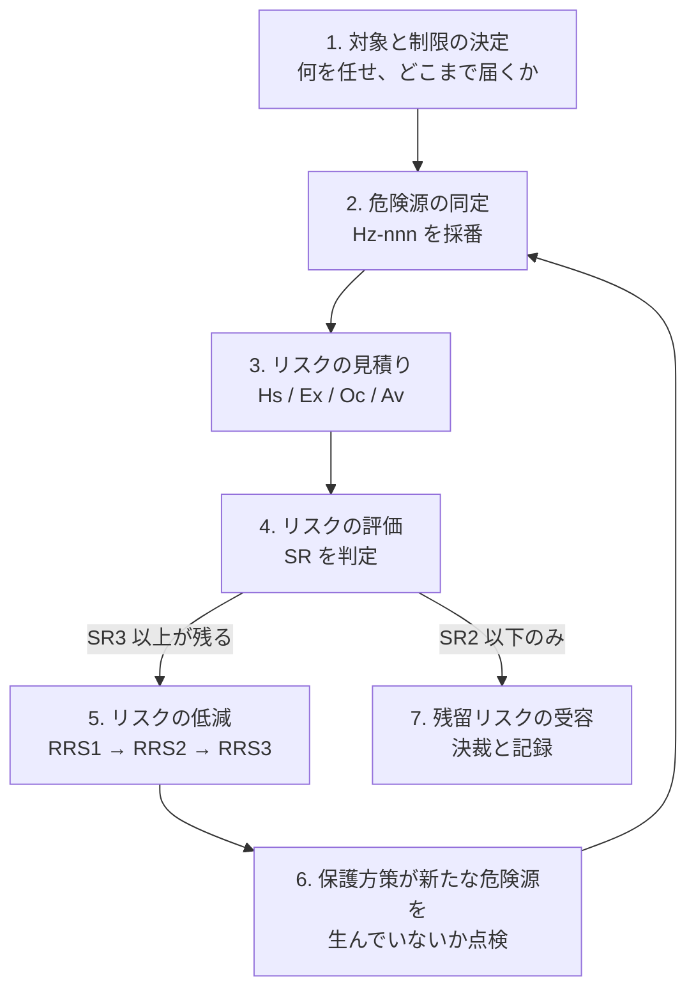
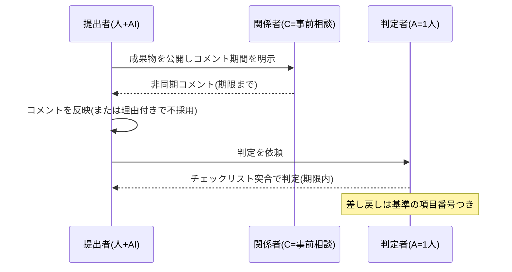

本章は、本標準が求める成果物を、そのままコピーして使えるテンプレートとして定義します。様式を固定するのは、AIに生成させる際の出力形式を安定させ、ゲート判定の突合を機械化しやすくするためです。

成果物の識別子と、どのゲート・作業と結びつくかは[ピットイン方式参照モデル](/process-compass/phase4-process-design/process-model/)が保持します。様式の正本は本章です。

## データとドキュメントのインターフェース

本標準は、プロセスの構造を[スキーマ駆動のデータ](/process-compass/phase4-process-design/process-model/)(`src/data/processes/integrated.yaml`)として保持し、判断の基準を本文の各章に規定します。同一の事項が両方に現れるため、要素ごとに正本を次のとおり定めます。

| 情報の種類 | 正本 | 従属側の扱い |
| --- | --- | --- |
| 要素の存在・識別子・関係(フェーズ、ゲート、ロール、成果物、タスク、順序) | データ(YAML) | 本文は識別子とラベルで参照する |
| 判定基準の内容・閾値・期限・様式・例外の扱い | 本文の各章 | データ側の記述は要約であり正本ではない |
| 用語の定義 | [第1章 1.4](/process-compass/phase4-process-design/overview/) | データ側の名称は表示名であり定義ではない |

参照の規則は次のとおりです。

- 本文からデータを参照するときは、識別子(例: `g-ship`)またはラベル(例: G-7)を用いる。名称や説明文の一致を前提としない
- データから本文を参照するときは、ページのスラッグまでを指定する。見出しへのアンカーは張らない
- データ側の判定基準には、閾値・数値・期限を書かない。これらは組織ごとに変わるため本文およびテーラリング規則が保持する

構造の変更は、次の順序で行わなければなりません。逆順を禁止します。

1. データ(YAML)を変更する
2. `npm run check` でスキーマ検証と内部リンク検証を通す
3. 影響する章の本文を更新する

## 成果物と様式の対応

| 成果物 | 様式 | 主な読者 | ゲートとの関係 |
| --- | --- | --- | --- |
| 意思決定・エスカレーション体制図(D-0) | テンプレ0 | 全関係者・監査 | G-1 の前提条件、SG の提出対象 |
| 機能仕様書 | テンプレ1 | 価値責任者・AI・レビュア | G-2 / G-4 の判定対象 |
| 判断記録(ADR) | テンプレ2 | 技術判断者・後任者 | G-3 の判定対象、G-6 でコア機能の添付必須 |
| 技術負債台帳 | テンプレ3 | 開発者・QA・価値責任者 | G-5 / G-7 の突合対象 |
| ゲート判定記録 | テンプレ4 | QA・監査 | 全ゲートで作成、G-7 で完備確認 |
| 運用引き継ぎ文書 | テンプレ5 | 運用担当・後任者 | G-7 の判定対象 |
| 企画書(事業意図) | テンプレ6 | 事業決裁者・価値責任者 | G-1 の判定対象 |
| 実装計画(タスク分解) | テンプレ7 | 価値責任者・AI・開発者 | G-4 の判定対象 |
| AI-SLA 合意確認書 | テンプレ8 | 調達・法務・委託先 | G-7 の突合対象、契約の添付 |
| AIエージェント安全リスクアセスメント表 | テンプレ9 | 技術判断者・安全担当・監査 | 適用条件に該当する案件で G-1 の前提条件 |
| 前提の台帳 | テンプレ10 | 価値責任者・技術判断者・監査 | 全ゲートの通過条件(充足状態の記録と受容) |
| 品質保証の方針と受容の基準(層1) | テンプレ11 | トップマネジメント・品質保証部門・事業決裁者・監査 | G-1 の層2 の照合先、G-7 の受容しない条件の突合、G-8 の受容の照合先。組織に1つで、案件ごとに作らない |

## テンプレ0: 意思決定・エスカレーション体制図(D-0)

案件の開始時に、**誰が決めるか**と**どこまでなら自分で決めてよいか**を1つの文書で確定させる様式です。案件で最初に作成する成果物であり、企画承認(G-1)の前提条件です([第2章 2.8](/process-compass/phase4-process-design/lifecycle/))。

この様式が満たすべき条件は3点です。いずれかを欠いた体制図は、判断が必要な場面で機能しません。

| # | 条件 | 欠いた場合に起きること |
| --- | --- | --- |
| 1 | 決定の種類ごとに、決定者が1名に特定されている | 決定が下されない、または下された決定が覆る |
| 2 | 各層の権限境界が数値で書かれている | 判断のたびに上位へ確認が発生する |
| 3 | 境界を超えたときの通知先と応答期限が書かれている | 逸脱が上位へ届かないまま蓄積する |

### 平常時と障害時を分ける

**平常時の意思決定階層と、障害対応時の指揮系統は別の表に書きます**(表3と表4)。障害時の指揮は職位ではなく知識と状況の把握度で割り当てるためです。1つの表に混在させると、障害時にも平常時の報告経路をたどる運用が復活し、初動が遅れます。

### 個人名を1か所へ隔離する

表1〜表4 と表7 は**役割名だけで記述**し、現任者の個人名は表5にのみ書きます。人事異動のたびに更新するのは表5だけになります。表8 は過去の決定の記録であり、決定した者の氏名を書きます。異動が生じても表8 は書き換えません。

### 席ごとに責任者と担い手を書く

ロール(席)には、結果責任を負う**責任者**と、作業を実際に行う**担い手**がいます([第5章 5.5](/process-compass/phase4-process-design/human-ai-boundary/)、[ADR-0054](/process-compass/adr/0054-seat-accountable-performer/))。D-0 は両者を別の表に書きます。更新の契機が異なるためです。

| 表 | 書く内容 | 更新する変化点 |
| --- | --- | --- |
| 表5 | 席ごとの責任者(記名の自然人を1名)と代理者。判断を担う席は、代理者の確認の状態(第3章 3.4.3) | 責任者の増減・交代・長期の不在、兼務の変更 |
| 表7 | 席ごとの担い手、運用形態、委任の範囲、適合性確認、AI が使えないときの扱いと縮退の3列 | 運用形態と委任の範囲の変更、AI の担い手の識別の変更 |

表7 の記入には次の規則を課します。

- 運用形態の欄は**上限の宣言**である。変更ごとのリスク区分の判定がそれを下げる。宣言から「人の確認は要らない」を導かない
- 出荷判定者・事業決裁者・AI維持管理者・AI運用担当者の席に、委任を書いてはならない
- 委任を書く席は、該当を判定する機械の規則の所在を書く。所在を書けない席は協働を上限とする
- AI の担い手は、モデルの版・指示資産の版・権限の組で識別する。席名やペルソナの付与は適合性確認に数えない
- 適合性確認を経ていない担い手は、協働を上限とする。担い手の識別が変わった時点で、確認は失効する。席の責任者が交代した時点で、承認は失効する。承認は引き継がず、新しい責任者が承認し直すまで協働を上限とする([第3章 3.4.2](/process-compass/phase4-process-design/roles-responsibilities/))
- AI が使えないとき(利用上限への到達、提供の停止)の扱いを、席ごとに「人へ戻す」「止める」のいずれかで書く
- 出荷に要る席は、縮退の3列を書く。人へ戻したときに処理できる量(例: 1週で人が検証まで終えられる変更の件数)、縮退で止める業務、復旧の目安である。処理できる量は、AI が使えなかった期間の記録と変更の履歴、または演習から実測で示す。実測が無い間は「未確認」と書く([第3章 3.12.5](/process-compass/phase4-process-design/roles-responsibilities/))。量の更新は体制の変化点に数えない

障害時の切り替えの手続は[第3章 3.12.5](/process-compass/phase4-process-design/roles-responsibilities/)によります。「AI が使えないときの扱い」の欄は、切り替え先が無い場合にその席の作業をどうするかを、事前に決めておくためのものです。

### 有事の決定者を決めておく

表4 には、重大度ごとの指揮系統に加えて、有事の事象ごとに**停止・切替・顧客説明を決める者**を書きます。事象は、重大事故、情報漏えい、契約変更、規制変更の4つです。組織に及ぶ事象(提供者の契約変更、規制の変更など)の決定者は、品質保証の方針と受容の基準(テンプレ11)の項目4 に組織として定めます。表4 は、その決定者が案件へ及ぶ場合の窓口と、案件に閉じる事象の決定者を書きます。

- 決定者は役割名で書く。個人名は表5 を参照させる
- テンプレ11 の項目4 と表4 で、同じ事象に別の決定者を書かない。表4 は項目4 を引く
- 法令上の報告義務は外枠であり、表4 で受容しない
- 4つの事象 × 3つの決定(停止・切替・顧客説明)の12欄に、空欄を残さない。空欄の欄は**記載の欠落**として扱う。保証の開示の項目7 に出し、第4章 G-7 の基準9 で差し戻す。案件に該当しない事象も空欄にせず、「層1 の項目4 による」と書く
- 有事の決定者が空欄のまま、平時の指揮系統で代える運用を認めない。有事に決定が下されない状態と区別できないためである

<!-- impl IMPL-0067 target=d0-template state=delivered note="D-0 の節7(有事の決定者の表)の12欄の空欄を、check-d0 と証跡の集約が記載の欠落として出す。空欄が残る D-0 では、G-7 の基準9 を欠落で失敗させる。「層1 の項目4 による」は記入として受け付け、その場合は層1 の該当行の受容者が空欄でないことを確かめる" -->

### 判断を担う席の後継を表5 に書く

表5 には、判断を担う席(価値責任者・技術判断者・独立レビュア・QA(出荷判定者))ごとに、後継候補(代理者。複数を書いてよい)が AI を使わずに判断できる力量の有効な確認を持っているかを、候補ごとに書きます(確認済み / 暫定任命 / なし)。確認済みで周期内の候補の数が、層1(テンプレ11)の「判断の席ごとの後継候補の最低数」に満たない席は後継不在と表示し、層1 の権限者が期限つきで受容します([第3章 3.4.3](/process-compass/phase4-process-design/roles-responsibilities/))。後継の計画書は書かせません。

席の責任者本人の確認(3.4.3 要求事項1。任命時と層1 の周期)も、表5 の下の「席の責任者本人の力量の確認」の表へ、席ごとに確認日・本人以外の確認した者・記録の所在で書きます。後継候補の確認とは別の記録です。確認の記録が無い責任者は確認を経ない任命として、周期を過ぎた確認は失効として、保証の開示の項目7 に表示します。構成から生成してよい欄です(後掲「構成から導ける欄は生成してよい」)。

<!-- impl IMPL-0056 target=d0-template state=delivered note="D-0 に、縮退の3列(人へ戻したときに処理できる量、縮退で止める業務、復旧の目安)を手で書く表として節12 に、有事の事象ごとの停止・切替・顧客説明の決定者の表を節7 に、冒頭に層1(テンプレ11)の版の行を持たせる。量の更新は変化点に数えないため構成へ入れない。証跡の集約が、AI の担い手を置いた席で量が実測でない席を『未確認』と表示する" -->

<!-- impl IMPL-0029 target=d0-template state=delivered note="D-0 へ席ごとの責任者・担い手・運用形態・委任の範囲・適合性確認と、体制の変化点の改訂履歴を書く" -->

### 改訂履歴に体制の変化点を残す

[体制の変化点](/process-compass/phase4-process-design/roles-responsibilities/)(第3章 3.13)が生じたときは、最初のゲート判定より前に D-0 を改訂し、表8 へ記録します([ADR-0055](/process-compass/adr/0055-team-change-points/))。**このために新しい台帳を作りません**。記録は D-0 の改訂履歴と、構成の変更記録に置きます。

- 再テーラリング([第8章](/process-compass/phase4-process-design/tailoring-guide/))の結果が「構成の変更なし」であった場合も、その結果を記録する
- 成立済みの判定記録は書き換えない。変化点をまたぐ未完了の判定は、新しい体制の判定者が引き継ぐ
- 統制を緩める向きの変更(人の確認を減らす、委任の範囲を広げる、ゲートを省略へ変える)は、決定した者の記名と理由を要する。決定するのは、対象の席の責任者、または表1「体制と運用形態」の決定者である。**AI の名義の記名を受け付けない**
- 統制を厳しくする向きの変更(委任の範囲を狭める変更を含む)は、即時に適用する
- 人の離脱で成立しなくなった統制は、緩める向きの決定として扱わない。未達の発生として、記名を待たず即時に反映し、表示する
- 納期だけの変更は変化点に数えない。起票された場合は「構成の変更なし」と記録する
- 提供者の障害・利用上限で AI が使えなかった期間は、変化点に数えない。期間と、その間の扱い(人へ戻した / 止めた)を表8 へ記録する
- 席の責任者を任命する変更と、別の人へ替える変更は、表1「体制と運用形態」の決定者の記名と理由を要する。人の離脱そのもの(席が空く)は発生であり、記名を待たない。決定者の席の責任者を替える変更は、前任の決定者の記名を要する。前任者が体制から外れている場合は、様式の「組織上の任命権者」に書いた者の記名を要し、その旨を表8 へ残す([第3章 3.13.3](/process-compass/phase4-process-design/roles-responsibilities/))
- 1人体制の初回の記入(どの席にも責任者の記入が無い状態から、本人が自分を記入する)は、初期の設定として、本人の記名と理由で受け付ける
- 即時の通知を要する事象([第3章 3.13.6](/process-compass/phase4-process-design/roles-responsibilities/))では、通知した者が、通知先と通知日を表8 へ書く。通知のための台帳を別に作らない。通知先と通知日の無い即時の通知は、記録の欠落として扱う
- 即時の通知の通知先は、出荷判定者の席の責任者である。出荷判定者の席の責任者の交代では、前任者にも通知する。前任者が体制から外れている場合は、表1「体制と運用形態」の決定者へ通知する。品質保証部門を置く組織は、部門の通知先を D-0 に定めてよい(様式の「品質保証部門の通知先」。任意)。定めた場合は、すべての即時の通知を、そこへも送る。**本標準は部門の設置を要求しない**([附属書H](/process-compass/phase4-process-design/assurance-case/) H.12「語の対応」)
- 通知する者と通知先が同一人物である場合(1人体制など)は、「通知する者と通知先が同一」と記録する。自分への通知の入力を要求しない

変化点の列挙と手続は、製造と労働安全の変更管理からの類推です。開発体制へ転用した効果は測定されておらず、根拠の水準は ADR-0055 に開示しています。

### 体制と委任の登録を誰が決めるかを決めておく

表1 には、体制そのものを決める者の行を2つ置きます。本標準が「D-0 体制図の決定の権限を持つ者」と書くときは、1行目の決定者を指します。行が無いと、この者が1人に定まりません。

| 表1 の行 | 決める内容 | 既定の決定者 |
| --- | --- | --- |
| 体制と運用形態 | 責任者の任免、運用形態の宣言、ステージの変更 | 事業決裁者 |
| 標準変更カタログへの登録 | 委任の範囲となる変更種別の登録([第5章 5.5.4](/process-compass/phase4-process-design/human-ai-boundary/)、[第3章 3.7.4](/process-compass/phase4-process-design/roles-responsibilities/)) | リリース判定会(B-4)。B-4 を置かない体制では、「体制と運用形態」の決定者 |

- 既定と異なる決定者を置く場合は、表1 へ記名の自然人を1名書く。AI を書いてはならない
- 席の責任者は、登録された変更種別の内側で、自席の委任の範囲を宣言する(表7)。登録そのものは行わない
- ステージを前へ戻す変更は、決定者の記名に加えて、ステージ移行ゲートの判定を要する([第8章「再テーラリングの契機」](/process-compass/phase4-process-design/tailoring-guide/))

### 構成から導ける欄は生成してよい

D-0 と同じ内容を機械可読の構成にも持つ場合、同じ事実を2か所へ手で書くと、片方だけが更新されます。構成から導ける欄は、構成から生成してよいものとします。

| 項目 | 規定 |
| --- | --- |
| 生成してよい欄 | 席・責任者・担い手・運用形態の表(表5・表7)、席の責任者本人の力量の確認の表(表5 の下)、委任の範囲、改訂履歴(表8)、冒頭の案件 ID(構成の案件 ID と同じ値。人が別の値を書いた体制図は上書きせず、不一致を表示する) |
| 正とするもの | 生成する場合は、構成を正とする。生成した区間を手で書き換えない |
| 人が書くもの | 決定の理由と記名。生成に置き換えない |
| 承認者 | D-0 の承認者は、表1「体制と運用形態」の決定者(D-0 の承認権限者。既定は事業決裁者)である。変化点のたびに、その変化点の決定者の氏名で承認者を上書きしない。変化点の決定者は表8 の「決定した者」に残す(生成する場合は、最後の変化点の決定者の欄を別に持つ) |
| 検査 | 生成した区間が構成と一致することを確かめる。一致しない D-0 は、前提条件を満たさないものとして扱う |
| 構成の書き換え | 変化点の手続([第3章 3.13](/process-compass/phase4-process-design/roles-responsibilities/))を経る。変化点を経ずに構成を書き換えた D-0 を、改訂済みとして扱わない |

生成するかどうかは、実装の選択です。生成しない場合は、D-0 を正とし、構成を D-0 に合わせます。準拠テンプレートの実装は[準拠テンプレートリポジトリ](/process-compass/phase5-implementation/template-repository/)によります。

### 市場・顧客の仮説を誰が検証するかを決めておく

表1 には「市場・顧客仮説の検証の実施」の行を置きます。企画書の欄は答えを書く場所ではなく、**答えを作る活動を駆動する装置**です。検証を発注する主体と権限を体制の側が持たなければ、書き手には作文しか残りません。誰が実施を決め、誰が担い、誰が意見を出すかを、案件の開始時に確定させます。

```markdown
# 意思決定・エスカレーション体制図(D-0): <案件名>

- 案件ID: P-NNN / 版: v1.0
- 承認日時: YYYY-MM-DD HH:MM / 承認者: <氏名>(<役職>)
- 承認の意味: 本文書に記載した権限配分と通知経路に合意する
- 次回レビュー期日: YYYY-MM-DD
- 変更履歴: <版管理へのリンク>(体制の変化点は表8 へ記録する)
- 品質保証部門の通知先(任意): <部門の通知先。定めた場合は、すべての即時の通知をここへも送る。部門を置かない組織は「定めない」と書く>
<!-- 即時の通知の通知先は、出荷判定者の席の責任者。本欄は、それに加える通知先である。本標準は部門の設置を要求しない -->
- 組織上の任命権者: <氏名(所属)。体制の外の人>
- 品質保証の方針と受容の基準(テンプレ11)の版: <版と記名の日付。記名が無い組織は「層1 なし」と書く>
<!-- 表1「体制と運用形態」の決定者が体制から外れた後に、後任の決定者を任命する記名に用いる(第3章 3.13.3)。新任の決定者が自分の任命を自分の記名で確定してはならない -->
<!-- 任命権者の記名で決定者を任命した場合は、表8 へ「決定者の任命を、組織上の任命権者の記名で行った」と書く。保証の開示の項目7 へ表示される -->

## 表1: 決定の権限

| 決定の種類 | 決定(1名) | 同意(拒否権あり) | 起案 | 意見 | 実行 |
| --- | --- | --- | --- | --- | --- |
| 投資の継続・中止 | | | | | |
| 事業ステージの移行 | | | | | |
| 市場・顧客仮説の検証の実施 | | | | | |
| 要件・受入基準の確定 | | | | | |
| 技術設計・アーキテクチャ | | | | | |
| 出荷の可否 | | | | | |
| セキュリティ要件の受容 | | | | | |
| 例外承認(第7章 7.3) | | | | | |
| 体制と運用形態(責任者の任免、運用形態の宣言、ステージの変更) | | | | | |
| 標準変更カタログへの登録(委任の範囲となる変更種別) | | | | | |
<!-- 既定の決定者: 「体制と運用形態」は事業決裁者。「標準変更カタログへの登録」は B-4。
     B-4 を置かない体制では、「体制と運用形態」の決定者 -->
<!-- 「決定」欄に2名以上を書いてはならない。二重の指揮系統が実在する場合も、
     その事実を備考へ書いたうえで最終決定者を1名選ぶ -->

## 表2: 権限境界(トレランス)

各層が上位の承認なく動ける範囲を数値で記述します。

| 領域 | チーム層 | 案件層 | 経営層 |
| --- | --- | --- | --- |
| 日程 | | | |
| 費用 | | | |
| AI実行予算 | | | |
| スコープ | | | |
| 品質(未解決欠陥) | | | |
| リスク | | | |
<!-- 第7章 7.6 のエスカレーション閾値、および 7.7 の予算区分と同じ数値を用いる -->

## 表3: 平常時のエスカレーション

| 発火条件 | 通知先(役割) | 応答期限 | 決裁権限 |
| --- | --- | --- | --- |
| 表2 のチーム層の境界を超える見込み | | | |
| 表2 の案件層の境界を超える見込み | | | |
| ゲート判定が期限を超過 | | | |
| 事業性の前提が崩れた | | | |
<!-- 「超えた時点」ではなく「超える見込みが立った時点」で発火させる -->

## 表4: 障害時のエスカレーション

| 重大度 | 指揮者の指名方法 | 一次対応 | 二次 | 三次 | 対外連絡 |
| --- | --- | --- | --- | --- | --- |
| Sev1 | | | | | |
| Sev2 | | | | | |
| Sev3 | | | | | |
<!-- 役割名のみで記述する。個人名は表5を参照させる -->
<!-- 指揮者は職位ではなく、事象の把握度で指名する -->

| 有事の事象 | 停止の決定者 | 切替の決定者 | 顧客説明の決定者(受託では発注者への説明) |
| --- | --- | --- | --- |
| 重大事故 | | | |
| 情報漏えい | | | |
| 契約変更(提供者の契約・規約・価格の変更を含む) | | | |
| 規制変更(適用される法令・整合規格) | | | |
<!-- 組織に及ぶ事象の決定者は、テンプレ11 の項目4 に定めたものを引く。別の決定者を書かない -->
<!-- 12欄に空欄を残さない。空欄は記載の欠落として扱い、G-7 の基準9 で差し戻す。該当しない事象は「層1 の項目4 による」と書く -->
<!-- 法令上の報告義務は外枠であり、この表で受容しない -->

## 表5: 役割と現任者の対応

| 役割 | 責任者(現任者) | 代理者(後継候補。複数可) | 代理者の確認の状態(確認済み / 暫定任命 / なし) | 確認日 | 連絡手段 | 最終更新日 |
| --- | --- | --- | --- | --- | --- | --- |
<!-- 後継候補が複数の席は、候補ごとに1行ずつ書く。確認済みで、確認日が層1 の力量の確認の周期内の候補を数える。層1 の最低数に満たない判断の席は後継不在と表示する --><!-- 人事異動で更新するのはこの表のみ -->
<!-- 構成から導ける欄(表5・表7・表8)は生成してよい。生成する場合は構成を正とし、生成した区間を手で書き換えない -->
<!-- 責任者は記名の自然人を席ごとに1名。AI を書いてはならない -->
<!-- 代理者の確認の状態は、判断を担う席(価値責任者・技術判断者・独立レビュア・QA)で書く。AI を使わずに判断できる力量の有効な確認を指す(第3章 3.4.3)。「なし」は後継不在と表示する -->

### 席の責任者本人の力量の確認(第3章 3.4.3 要求事項1)

| 役割 | 責任者 | 確認日 | 確認した者(本人以外) | 確認の記録の所在 |
| --- | --- | --- | --- | --- |
<!-- 判断を担う席の責任者本人の、AI を使わずに判断できる力量の確認。任命時と、層1 の「AI を使わない力量の確認の周期」で受ける。後継候補の確認(表5 の代理者の欄)とは別の記録 -->
<!-- 確認した者は本人以外の自然人。自己申告は認めない(3.4.3 要求事項2)。記録の所在は、AI を使っていない期間の成果物、または判定者の面前の演習の記録 -->
<!-- 確認した者が人の名簿の外(外部の研修機関・前任の部門長など)なら、生成が「(名簿の外)」を添える。拒否はしない。名簿の外の名前は機械で突合できないため、確認の記録に所属・役職を書き、プロセス内部監査の観点6 で突合する -->
<!-- 記録の無い責任者は確認を経ない任命(要求事項3)、周期を過ぎた確認は失効として、保証の開示の項目7 に表示する。出荷は止めない。責任者が交代したら、前任の記録を引き継がない -->

## 表6: 独立性の確認

| 確認事項 | 該当者 |
| --- | --- |
| 開発ラインから独立した出荷判定者 | |
| 出荷判定者と事業決裁者の責任者が別の人であるか(3名未満で同一の場合は逸脱として記録する) | |
| 案件に関与していない点検の実施者(第7章 7.7.6) | |
| 監査の窓口 | |

## 表7: 担い手と運用形態

| 役割 | 担い手(人 / AI の担い手の識別) | 運用形態(人確定 / 協働 / 委任) | 委任の範囲(機械の規則の所在) | 適合性確認の期限または失効条件 | AI が使えないときの扱い(人へ戻す / 止める) | 人へ戻したときに処理できる量(実測 / 未確認) | 実測の日 | 縮退で止める業務 | 復旧の目安 |
| --- | --- | --- | --- | --- | --- | --- | --- | --- | --- |
<!-- 人の担い手は個人名で書かない。「責任者本人」または委譲先の役割名で書く -->
<!-- AI の担い手の識別は、モデルの版・指示資産の版・権限の組で書く -->
<!-- 運用形態は上限の宣言。変更ごとのリスク区分の判定が下げる(R1 は人確定、R2 は協働まで) -->
<!-- 委任の範囲は、標準変更カタログ(第3章 3.7.4)に登録した変更種別と同じもの。登録するのは、表1「標準変更カタログへの登録」の決定者。既定は B-4。B-4 を置かない体制では、表1「体制と運用形態」の決定者(人) -->
<!-- 席の責任者は、登録された変更種別の内側で、自席の委任の範囲を宣言する -->
<!-- 出荷判定者・事業決裁者・AI維持管理者・AI運用担当者の席に委任を書いてはならない -->
<!-- 適合性確認を経ていない担い手は協働を上限とする。担い手の識別が変わった時点で確認は失効する。席の責任者が交代した時点で承認は失効する(第3章 3.4.2) -->
<!-- 縮退の3列は出荷に要る席で書く。処理できる量は、AI が使えなかった期間の記録と変更の履歴、または演習の実測で書く。実測が無い間は「未確認」と書く(第3章 3.12.5) -->
<!-- 実測の日を併記する。層1 の縮退の実測の頻度を過ぎた値は「未確認」へ戻る -->

## 表8: 改訂履歴(体制の変化点の記録)

| 日付 | 変化点の種別 | 変更前後の版 | 兼務禁止と独立性の再判定の結果 | 無効になった確認(やり直しの要否) | 失効した確認と例外(再確認の期日) | 決定した者 | 通知先と通知日(即時の通知を要する事象) |
| --- | --- | --- | --- | --- | --- | --- | --- |
<!-- 即時の通知を要する事象(第3章 3.13.6)では、通知先と通知日を書く。未記入は記録の欠落として扱う。該当しない行は「対象外」と書く -->
<!-- 通知する者と通知先が同一人物である場合は「通知する者と通知先が同一」と書く -->
<!-- 席の責任者の任免(任命、交代)は、表1「体制と運用形態」の決定者の記名と理由を要する。人の離脱だけの行は、記名を待たない -->
<!-- 権限の一時制限の発動は変化点に数えないが、通知先と通知日は同じ表へ1行として記録する -->
<!-- 変化点の種別は「更新の契機」の1〜5 の番号で書く -->
<!-- 「構成の変更なし」も1行として記録する -->
<!-- 決定した者は記名の自然人。統制を緩める向きの変更は理由を併記する。AI の名義の記名を受け付けない -->
<!-- 人の離脱で成立しなくなった統制は、未達の発生として即時に記録する。記名を待たない -->
<!-- AI が使えなかった期間と、その間の扱い(人へ戻した / 止めた)も1行として記録する。変化点には数えない -->
<!-- 成立済みの判定記録は書き換えない -->

## 表9: 組織継続の状態の受容

| 状態 | 対象 | 受容した者 | 受容の期限 | 照らした層1 の版 |
| --- | --- | --- | --- | --- |
<!-- 状態は、単一障害点の一覧(第3章 3.12.11 の要求事項4)の語で書く: 代替の無い依存先 / 退出を試していない依存先 / 縮退を確かめていない業務 / 止める席 / 後継不在の席 / コア理解の保持者が1名以下 / 自組織に無い資産 / 通知の期間またはデータが空欄の依存先 -->
<!-- 受容は、品質保証の方針と受容の基準(テンプレ11)の項目4 の権限者が記名で行う。AI の名義を受け付けない。期限(YYYY-MM-DD)の無い受容は受容として数えない -->
<!-- 期限を過ぎた受容は、状態が解消していなければ記載の欠落として扱う(3.12.11 の要求事項7、第4章 G-7 基準9)。後継不在の席の受容は、層1 の育成の担当が空欄のあいだ受け付けない -->
<!-- 一覧そのものは機械が生成する。人が書くのは受容の行だけである -->

## 更新の契機

体制の変化点(第3章 3.13)。変化点の後、最初のゲート判定より前に改訂する。

1. 責任者の増減・交代・長期の不在、兼務の変更
2. 人数の境界の通過(3名未満と3名以上、10名)
3. 担い手の運用形態の変更、委任の範囲の変更
4. AI の担い手の識別の変更(モデルの版・提供者、指示資産の恒久層、ツールと権限、実行基盤)
5. 軸B〜E の入力の変化(ステージ移行、規制への該当、委託への切替、安全重要度)

定期の見直し。変化点が無くても実施する。

- 四半期ごと
- ステージ移行ゲートの判定時
- Sev1 事象の事後レビュー時
```

### 記録としての要求事項

D-0 は監査の対象です。記録として成立するために、次を満たさなければなりません。

| # | 要求事項 | 理由 |
| --- | --- | --- |
| 1 | 承認者を後から同定できる | 口頭の合意は監査証拠として扱えない |
| 2 | 承認の日時が記録されている | 承認の前後関係を検証できる必要がある |
| 3 | 承認が何に対するものかが明記されている | 「承認」の対象と意味が文脈依存になることを防ぐ |
| 4 | 変更の履歴が保持され、過去の版を隠蔽しない | 改ざんの有無を検証できる必要がある |
| 5 | 次回レビュー期日が記載されている | 期日のない文書は更新されない |
| 6 | 体制の変化点ごとに、表8 の記録が残っている。「構成の変更なし」も記録する | 変化点の後にどの確認が無効になったかを、後から特定できる必要がある |

Git 上で管理する場合の具体的な構成([フェーズ5](/process-compass/phase5-implementation/ci-gates/))では、要求事項1を所有者定義による承認、要求事項2をマージ日時、要求事項3を申請様式への明記、要求事項4を版管理で満たします。

## テンプレ1: 機能仕様書(spec)

```markdown
# 機能仕様: <機能名>

- 機能ID: F-NNN
- コア指定: コア / 非コア(判断理由: ...)
- スコープ層: SC-M 確約範囲 / SC-P 計画範囲 / SC-B 調整枠 / 範囲外(G-4 判定基準5。判定者が記入する)
- 価値責任者(A): <氏名>(委譲先: <氏名/なし>)

## 目的(なぜ作るか)
<この機能が生む価値を1〜3文で>

## 受入基準(検証可能な形式で。曖昧語禁止)
- CR-1: <条件> のとき、システムは <期待動作> すること
- CR-2: <条件> のとき、システムは <期待動作> すること
<!-- 「適切に」「柔軟に」「可能な限り」「〜など」「必要に応じて」「基本的に」は使用不可 -->

## スコープ外(やらないこと)
- <明示的に対象外とする事項>

## 前提・依存
- <この仕様が依存する前提。案件層コンテキストへの登録済みIDを併記>

## 未確定事項
- [NEEDS CLARIFICATION] <曖昧なまま残っている点。G-2/G-4 通過には解消が必要>
```

## テンプレ2: 判断記録(ADR)

サイトの[決定記録(ADR)](/process-compass/adr/)と同じ骨格に、技術判断用の欄を足した形です。

```markdown
# ADR-NNN: <決定の要約(動詞で終わる短文)>

- 状態: 採用 / 廃止 / 置き換え(→ ADR-MMM)
- 判定者(技術判断者): <氏名> / 判定日: YYYY-MM-DD
- 対象: <機能ID / コンポーネント>

## コンテキスト
<どんな課題・制約があったか>

## 決定
<何をどうすると決めたか>

## 比較した代替案(最低1つ)
| 案 | 利点 | 欠点 | 不採用の理由 |
| --- | --- | --- | --- |

## 可逆性
- 戻せる選択か: はい / いいえ
- いいえの場合、戻せなくなるもの: <データ形式・外部契約など>

## 非機能への影響
<性能・可用性・セキュリティへの影響見込み>

## 事業影響(G-3 判定基準5。観測可能な事象で書く。金額は任意)
| 項目 | 記載 |
| --- | --- |
| 影響する利用者と業務 | <この選択が裏目に出たとき、誰の何が止まるか> |
| 回復に要する時間 | <幅で書く。単一の値は不可> |
| 取り消しの可否 | 自動で戻せる / 人手で戻せる / 相手方の同意を要する |
| 顕在化が分かる兆候 | <何を観測すれば、この選択が誤りだったと分かるか。「なし」は不可> |
| 影響する必達基準 | <[第7章 7.7.3](/process-compass/phase4-process-design/exception-escalation/)の項目番号 / 該当なし> |

<!-- 金額を書く場合は、算定根拠・参照した過去案件・その額にならない条件の3点を併記する -->
<!-- 発生確率と影響度の格付けを掛け合わせた順位づけを書かない -->
```

### 事業影響の欄が要る理由

技術的な選択の帰結は、技術の語彙のままでは事業側が受容の判断をできません。**この欄は、技術判断者が事業側の語彙へ翻訳するための様式です**。

**「顕在化が分かる兆候」がこの様式の要です**。決裁者が「今は判断できないが、この兆候が出たら戻す」という形で受容できるようになります。[第5章 5.7.2](/process-compass/phase4-process-design/human-ai-boundary/)の決断の記録における「判断が変わる条件」と同型です。

金額を義務づけない理由と、格付けの掛け合わせを用いない理由は[第4章 G-3](/process-compass/phase4-process-design/gate-criteria/)に規定します。

## テンプレ3: 技術負債台帳

```markdown
| ID | 区分 | 記録日 | 対象 | 内容 | 影響(放置した場合) | 受容理由 | 返却目安 | 状態 | 記録者 | 承認した者 |
| --- | --- | --- | --- | --- | --- | --- | --- | --- | --- | --- |
| D-001 | 負債 | 2026-07-15 | — | <負債の内容> | <何が起きるか> | <なぜ今受容したか> | <時期/条件> | 未返却/返却済 | <氏名> | — |
| D-002 | 例外 | 2026-07-20 | PR #12 | <満たさない基準の項目番号> | <何が起きるか> | <満たさない理由> | <回収の期限と回収責任者> | 未返却/返却済/取り下げ/失効 | <氏名> | <例外承認の権限を持つ者の氏名> |
```

区分は**負債 / 例外 / 未解決**のいずれかとします。由来が異なるものを混ぜると、ゲートを止めるべきものと止めないものを見分けられなくなります。

| 区分 | 由来 | ゲートへの影響 |
| --- | --- | --- |
| 負債 | 意図して受け入れた妥協 | 通過を妨げない |
| 例外 | [第7章 7.3](/process-compass/phase4-process-design/exception-escalation/)の例外承認 | 回収まで継続的な報告の対象 |
| 未解決 | [第7章 7.3.2](/process-compass/phase4-process-design/exception-escalation/)の未解決事項 | 通過を妨げない |

区分「例外」の行は、第7章 7.3 が定める記録の5つの事項を、次の欄に持ちます。**「対象」と「承認した者」は、区分「例外」の行の必須欄です**。

| 7.3 の事項 | 台帳の欄 | 書くこと |
| --- | --- | --- |
| 対象 | 対象 | 例外を適用する変更または成果物。変更は、PR の番号(`PR #12`)またはコミットの識別子(先頭7桁以上)で示す |
| 状態 | 状態 | 未返却が有効を指す。返却済み・取り下げ・失効は、有効でない |
| 承認した者 | 承認した者 | D-0 表1「例外承認」の決定者の記名。記録者とは別の欄に書く |
| 理由 | 内容、受容理由 | 満たさない基準の項目番号と、満たさない理由 |
| 期限 | 返却目安 | 回収の期限と、回収責任者 |

- 5つの事項のいずれかが空欄の行は、例外承認の成立を示さない。出荷判定(G-7)は、その行を変更に対応づけない
- 「対象」の欄に無い番号が、内容や備考に現れるだけの行は、その変更の例外承認として対応づけない
- 回収済みの行を、別の変更の例外承認として使い回さない
- 承認した者が当該の変更の作成を指示した者である行は、その変更の例外承認として対応づけない([第4章 G-7](/process-compass/phase4-process-design/gate-criteria/)の基準5)
- 区分「負債」「未解決」の行では、「対象」と「承認した者」を「—」としてよい

運用ルール(である調 / 体言止め):

- 1行=1負債。AI生成過程で見つけた妥協・TODO・仮実装はすべて記録する<!-- tone-ok: 記録対象としての TODO への言及 -->
- 「受容理由」が書けない負債は受容してはならない(その場で直すか、仕様に戻す)
- 返却は[運用フェーズの負債返却サイクル](/process-compass/phase4-process-design/process-model/operate/debt-payback/)で台帳から優先度順に消化する

## テンプレ4: ゲート判定記録

```markdown
# ゲート判定: <ゲート名> / <対象成果物ID>
<!-- 対象は、成果物の ID、PR の番号、コミットの識別子のいずれかで書く。委任の期間ごとの保証の開示についての G-8 の記録は、対象へ期間(起点と終点の日付)を書く -->

- 判定者: <氏名> / 提出日時: ... / 判定日時: ...(滞留時間の計測に使用)
- 参照した D-0 の版: <版>
<!-- 体制の変化点(第3章 3.13)の後は、改訂後の版を参照していること。構成が参照する版と一致しない判定記録は検査で落とす -->
- 変更のリスク区分(変更を対象とする判定のみ): R1 / R2 / R3(確定した者: <氏名。機械の規則による分類は、規則の所在>)
<!-- 区分を確定した者を記名する(第3章 3.8.1)。作成を指示した者の自己記載のままの場合は「自己記載」と書く。保証の開示の項目3 へその旨が出る -->
- 非同期コメント期間: <開始〜終了>(コメント数: N件)

## 判定結果
通過 / 差し戻し
<!-- 工程ゲート(G-1〜G-8)の判定はこの2値のみ。「条件付き通過」を書いてはならない -->
<!-- 条件を付して先へ進める場合は、第7章 7.3 の例外承認の手続による -->
<!-- ステージ移行ゲートと会議体の判定は、第3章 3.7.3 の語彙による -->

## 確定の形態
人確定 / 協働 / 委任
<!-- 人確定: 人が判断し、理由を自分で書いた。R1 の決定と、決断の記録を要する判定(G-8・ステージ移行・例外承認)は人確定に限る -->
<!-- 協働: AI が起案した判断の案と根拠を、人が変更ごとに確認して確定した -->
<!-- 委任: 登録した範囲で先へ進めた変更を、独立レビュアの席の責任者が事後の抜き取りで確かめた(事後確認の記録)。作成を指示した者と別の人を置けず、責任者本人が抜き取った場合は、その旨を書く -->
<!-- G-6 の判定を事後へ移した変更は、事前の承認の記録を持たない。人の判定と同じ語(承認、通過、独立レビュー済み)で記録しない -->
<!-- 開発者の席だけが委任の変更は、独立レビュアが事前に承認する。その承認は、通常の判定記録として残す -->
<!-- いずれの形態でも判定者は席の責任者(人)。AI の確認を判定として記録しない -->

## チェックリスト突合
| # | 基準 | 結果 | 備考 |
| --- | --- | --- | --- |
<!-- ゲート判断基準ページの項目番号と対応させる -->

## 差し戻し理由(該当時のみ)
- 基準 #N を満たさない: <具体的な指摘>

## 挙動要約(G-6 独立レビューのみ必須)
<レビュアが自分の言葉で1〜2文>

## 監査対応書式(G-6。規制業の監査対応書式、または CL2 以上の体制で必須)
| 欄 | 記載 |
| --- | --- |
| 2人目の判定者 | <G-6 を2名で行う体制で、1人目と別の名簿の人。2人目本人が記名する。1名の体制は「該当なし」> |
| 2人目の挙動要約 | <2人目が自分の言葉で1〜2文。1人目の要約を写さない> |
| 安全性の評価者 | <実装の責任者・作成を指示した者・当該の判定者から組織的に独立した評価者(附属書F)。安全関連でない変更は「該当なし(理由)」> |
| 安全性の評価の記録の所在 | <評価の記録の所在。評価者を記名した場合に要する> |
<!-- 規制業(第8章 軸C)では、PR の承認だけでは記録にならない。変更ごとに G-6 の判定記録を残し、この表を埋める。出荷の証跡の集約が、記録の有無と空欄を記載の欠落として扱う -->
<!-- 独立した安全性の評価は、独立レビューへ吸収しない(第4章 G-6)。機械が確かめるのは記名の有無と独立までで、評価の実施と内容は確かめない -->

## 決断の記録(G-8・SG・例外承認で必須)
| 欄 | 記載 |
| --- | --- |
| 確認した事項 | <判断の根拠として実際に確認したもの> |
| 確認していない事項 | <確認しなかった範囲。「なし」は不可> |
| 判断が変わる条件 | <どの事実が異なれば別の判断になるか> |
| 受容したリスク | <受容した内容と、顕在化した場合の対処。G-8 では、保証の開示に載った未達・未測定の受容と、異議の扱いを含める> |
| 出荷判定者の異議(リリース決裁 G-8 の記録に限る) | <異議の有無。異議がある場合は、開示されたどの事実への異議か。無い場合も「異議なし」。第4章 G-8 の4事項に当たる場合は、理由を書く。空欄は記載の欠落> |
| 照らした層1 の版(G-8 に限る) | <受容を照らした品質保証の方針と受容の基準(テンプレ11)の版。層1 が無い組織は「層1 なし」。空欄は記載の欠落> |
| 上申(G-8 に限る。段階を超える受容・異議を退けた受容) | <届けた先(層1 の項目5)と日付。該当しない場合は「該当なし」。異議を退けて受容したのに届けた日付が無い記載は、記載の欠落> |
| 品質保証の対象外として出荷することの受容(G-8 に限る) | <層1 の項目4 の権限者の記名。保証の主張の成立判定に、成立しない変更が無い場合は「該当なし」> |
<!-- 確定の形態は上の「確定の形態」欄に書く。決断の記録を要する判定(G-8・ステージ移行・例外承認)は人確定に限る。協働・委任を書いてはならない -->
<!-- 「出荷判定者の異議」欄は出荷判定者が記載する。空欄は記載の欠落として扱い、事業決裁者は受容を記名しない -->
<!-- 開示が第4章 G-8 の4事項のいずれかに当たる場合は、異議の有無とあわせて理由を書く。「異議なし」とだけ書いた記載は、記載の欠落として扱う -->
<!-- 例外承認の記録では、対象(PR の番号またはコミットの識別子)、承認した者、理由、期限を書く。技術負債台帳(テンプレ3)の区分「例外」の行と対応させる -->

## 停止の申し立ての解除(第7章 7.11 の解除の記録でだけ書く)
| 欄 | 記載 |
| --- | --- |
| 申し立てた者 | <記名> |
| 申し立ての内容 | <品質・安全・法令上の異常として、何を認めたか> |
| 解除の理由 | <解除する人が自分で書く。空欄の解除は受け付けない> |
| 申し立てた者の見解を退けたか | 退けた / 退けていない(申し立てた者が取り下げた、または異常を解消した) |
| 上申先と日付(退けた場合) | <層1 の項目5 の届け先と日付。退けていない場合は「該当なし」> |
<!-- 解除する人は、層1 の項目4「停止の申し立ての解除」の権限者。AI の名義の解除は無効。申し立ての件数を評価の減点に用いない -->

## AI の利用の評価(ステージ移行ゲートと第三者による棚卸しで必須。第7章 7.7.8)
| 欄 | 記載 |
| --- | --- |
| 評価の単位 | <案件、または開発ライン> |
| 下流の指標と比較の基準値 | <企画書の「AI の利用で期待する成果」の指標ごとに、今回の値・基準値・基準値の出所。「基準値なし」の場合はその旨> |
| 総費用の内訳 | <企画書の総費用の内訳(5区分 × 実績 / 見積り)を転記する。見積りの区分は「見積り」と書く> |
| 評価に用いなかった入力 | <自己申告の速度、AI の利用量を入力にしていないこと。入力にした場合、評価は無効> |
| 判定 | <第3章 3.7.3 の4値と、縮小の場合はその手段(自律レベル・運用形態の引き下げ、範囲の縮小、停止)> |
| 縮小・停止の基準に当たる状態での継続 | <該当する場合は、第7章 7.7.5 の要求事項の充足。該当しない場合は「該当なし」> |
<!-- 判定者は B-2 の決定者。空欄の欄は記載の欠落として扱う -->

## 比較した選択肢(R1 および例外承認で必須)
| 案 | 到達点 | 残るリスク | 採否 |
| --- | --- | --- | --- |
<!-- AI が案とリスクの見積を提示してよい。採否の理由は人が記入する -->

## 未消化のテスト(G-7 で未消化が1件以上ある場合のみ)
| 未消化のテスト | 未消化の理由 | 実施した代替 | 残存リスク |
| --- | --- | --- | --- |
<!-- 残存リスクには、代替で覆えなかった検出対象を書く。未消化を生じさせた側が記入する -->
```

判定結果は、[第4章「工程ゲートの判定の語彙」](/process-compass/phase4-process-design/gate-criteria/)の2値です。**「条件付き承認」「条件付き通過」の欄は設けません**。回収の期限と回収責任者を伴わない通過の経路を、様式の側で作らないためです。

「確定の形態」は、[第5章 5.5.2](/process-compass/phase4-process-design/human-ai-boundary/)の運用形態に対応し、同章 5.7.1・5.7.2 が記録を求める欄です。委任の範囲で先へ進めた変更でも、判定者は席の責任者です。移るのは判定の時点であり、判定の主体ではありません([ADR-0054](/process-compass/adr/0054-seat-accountable-performer/) 決定4)。

- G-6 の判定を事後へ移した変更は、事前の承認の記録を持たない。本様式を用いるのは、独立レビュアの席の責任者による事後の抜き取りの記録である([第8章「事後監査の手続」](/process-compass/phase4-process-design/tailoring-guide/))
- 抜き取られていない変更を、人の判定と同じ語(承認、通過、独立レビュー済み)で記録しない
- 開発者の席の規則にだけ該当する変更は、G-6 を事前に判定する。独立レビュアが事前に承認した記録は、通常の判定記録として残す(第5章 5.5.4)
- 本欄は、出荷ごとの保証の開示([附属書H](/process-compass/phase4-process-design/assurance-case/))が確定の形態の内訳を集計するための入力になる

決断の記録の各欄は[第5章 5.7.2](/process-compass/phase4-process-design/human-ai-boundary/)に対応します。**「確認していない事項」が空欄、または「なし」と記載された記録は無効**です。決断の記録を要する判定(G-8・ステージ移行・例外承認)の確定の形態は、人確定に限ります(同章 5.5.5)。協働・委任と書かれた決断の記録は、無効として扱います。

リリース決裁(G-8)の決断の記録には、保証の開示に載った未達・未測定の受容と、出荷判定者の異議の扱いを書きます([第4章 G-8](/process-compass/phase4-process-design/gate-criteria/)、[附属書H](/process-compass/phase4-process-design/assurance-case/) H.5)。受容は「受容したリスク」欄へ、異議の有無は「出荷判定者の異議(リリース決裁 G-8 の記録に限る)」欄へ書きます。異議の欄は出荷判定者が記載し、異議が無い場合も「異議なし」と書きます。空欄は記載の欠落として扱い、空欄のままでは事業決裁者は受容を記名しません。**異議のための様式を、別に設けません**。

保証の開示が第4章 G-8「出荷判定者の異議」の4つの事項のいずれかに当たる場合は、異議の有無とあわせて理由を書きます。「異議なし」とする場合も同じです。事項に当たるのに理由が無い記載は、空欄と同じ記載の欠落として扱います。4つの事項に当たるかは、保証の開示の値から機械的に読み取れます。

G-8 の3行(照らした層1 の版、上申、品質保証の対象外として出荷することの受容)は、事業決裁者が受容を層1 の受容の基準と権限の段階に照らして行ったことの記録です([第4章 G-8](/process-compass/phase4-process-design/gate-criteria/))。段階を超える残存リスクは単独で受容せず、層1 の上申先へ届けます。出荷判定者の異議を退けて受容した場合は、退けた事実と理由を上申先へ必ず届けます。社内の受容は、外部への責任を限定しません。

停止の申し立ての解除の節は、[第7章 7.11](/process-compass/phase4-process-design/exception-escalation/)の解除の記録でだけ書きます。解除の記録は、保留した PR の中ではなく、既定ブランチへ先に入れます。ラベルを外しただけでは解除になりません。

「AI の利用の評価」の節は、ステージ移行ゲート(SG)と第三者による棚卸し([第7章 7.7.6](/process-compass/phase4-process-design/exception-escalation/))の判定記録でだけ書きます。7.7.8 の評価を、判定の記録の中に残すための欄です。総費用の内訳は企画書(テンプレ6)から転記し、評価の時点の実績で更新します。**評価のための様式を、別に設けません**。

<!-- impl IMPL-0068 target=gate-record-template state=delivered note="テンプレ4 に節『AI の利用の評価』(評価の単位、下流の指標と比較の基準値、総費用の内訳の転記、評価に用いなかった入力、判定、縮小・停止の基準に当たる状態での継続)を置く。SG と棚卸しの判定記録で、節の欠落と空欄を検査が出す" -->

委任で先へ進めた変更は、G-7・G-8 を変更ごとには行わず、期間ごとの保証の開示で扱います(第5章 5.5.4)。期間の開示への受容と異議も、本様式の G-8 の決断の記録に残します。「対象」へ期間(起点と終点の日付)を書きます。**期間の開示のための様式を、別に設けません**。

冒頭の「変更のリスク区分」には、区分を確定した者を記名します([第3章 3.8.1](/process-compass/phase4-process-design/roles-responsibilities/))。区分が、作成を指示した者の自己記載のままである場合は、保証の開示の項目3 へその旨を表示します。

PR を経ていないコミットで、リスク区分または検証の記載のトレーラを書き忘れた場合は、本様式の判定記録で確定できます。「対象」へコミットの識別子を書き、リスク区分は冒頭の欄へ、検証の記載は「検証方法と結果」の節を足して書きます。**「検証方法と結果」の節は、本様式の必須欄にしません**。書き忘れを補う場合にだけ足します。成立済みのコミットを書き換えないための経路です([CI/CD ゲート構成リファレンス](/process-compass/phase5-implementation/ci-gates/)「保証の開示の出力」)。

## テンプレ5: 運用引き継ぎ文書

```markdown
# 運用引き継ぎ: <システム/機能名>

## 監視項目
| 項目 | 正常範囲 | 異常時の一次対応 |
| --- | --- | --- |

## 障害時の連絡先・体制
| コア機能 | 理解保持者 | 確認した者(本人以外) | 確認の記録と確認日 |
| --- | --- | --- | --- |
<!-- 保持者に数えるのは、本人以外の者が日付を付けて確認した記録を持つ人に限る(第3章 3.4.3 の要求事項8)。記録は H-3 理解の実証、3.4.3 の演習、コア機能の障害対応の記録のいずれか -->
<!-- 確認した者と確認日が空欄の行、確認日が層1 の力量の確認の周期を過ぎた行は、保持者に数えない -->
- エスカレーション順序: ...

## 復旧手順
- <手順書へのリンク。AI生成+人間検証済みであること>

## 既知の負債・制約
- 負債台帳の該当ID: D-NNN, D-MMM
```

理解保持者の表に確認した者と確認日の列を置くのは、名前を書くだけで保持者に数えられる状態を塞ぐためです([第3章 3.4.3](/process-compass/phase4-process-design/roles-responsibilities/)の要求事項8)。保持者の数は、確認の記録から数えます。

<!-- impl IMPL-0066 target=handover-template state=delivered note="運用引き継ぎ文書の節2 のコア機能の理解保持者を、コア機能・保持者・確認した者(本人以外)・確認の記録と確認日の表にする。確認した者が保持者本人である行を受け付けない" -->

## テンプレ6: 企画書(intent-brief)

企画承認(G-1)の判定基準4項目と欄を対応させています。

### 企画で評価する6つの観点

企画の評価は、次の6観点で行います。**財務は最初の観点ではありません**。事業投資の実務では、初期の選別に財務基準を置かない構成が採られており、財務手法に依拠したポートフォリオ管理は成果が最も低いという調査結果があります。

| # | 観点 | 問い |
| --- | --- | --- |
| 1 | 戦略整合 | 組織のどの戦略目標に対応するか |
| 2 | 自社が勝てる理由 | 自社の何の資産・能力が、他社にはなく、この案件の成否を左右するか |
| 3 | 受益者と価値 | 誰の何がどれだけ変わるか |
| 4 | 投資対効果 | 費用と効果はいくらか。**その数字が外れる条件は何か** |
| 5 | 事業リスクと受容 | どのリスクをどう扱うか。**いつ顕在化しうるか** |
| 6 | 中止条件 | どうなったら止めるか |

観点1と2は、[第7章 7.7.3](/process-compass/phase4-process-design/exception-escalation/)の評点基準「戦略整合」が継続の判断で問われるのに対し、**開始の判断では問われていなかった**項目です。案件を始める理由を書く場所がないまま、続ける理由だけを問う構成になっていたため、開始の側へ揃えます。

観点6は 7.7.3 の必達基準5項目を、企画の時点で当該の案件へ具体化したものです。**始める前に止める条件を書きます**。

:::caution
観点1・2について、**戦略目標から効果までの因果の物語を書かせてはなりません**。因果の連鎖を記述させる方式は、検証されない前提を作文させることになります。書かせるのは、対応する戦略目標の識別と、**その対応が成立しなくなる条件**です。
:::

### 事業リスクと安全リスクを混ぜない

本欄の「事業リスク」は、[テンプレ9 の安全リスクアセスメント](/process-compass/phase4-process-design/deliverable-templates/)とは**別の成果物**です。

| | 事業リスク(本欄) | 安全リスク(テンプレ9) |
| --- | --- | --- |
| 保護する対象 | 組織の目的の達成 | 人体の傷害および健康障害 |
| 上振れ(機会)の扱い | 含む | 含まない |
| 記号体系 | 用いない(表の値として区分を持つ) | Hz / Hs / Ex / Oc / Av / SR / RRS |

**1つの表に混ぜてはなりません**。危害の深刻度の尺度と事業影響を同じ列で扱うと、どちらの判定も鈍ります。また本欄は特定の規格の手順を参照するものではないため、**「リスクアセスメント」という呼称を用いません**。

### 様式

```markdown
# 企画書: <プロダクト / 案件名>

- 起案者(価値責任者): <氏名> / 起案日: YYYY-MM-DD
- 決裁者(事業決裁者): <氏名> / 決裁日: YYYY-MM-DD

## 戦略整合(観点1)
| 項目 | 記載 |
| --- | --- |
| 対応する戦略目標 | <組織が公表または社内で定めた目標の識別。「成長」等の一般語は不可> |
| 対応が成立しなくなる条件 | <どの前提が変われば、この案件が戦略目標へ寄与しなくなるか> |

## 自社が勝てる理由(観点2)
<自社の何の資産・能力が、他社にはなく、この案件の成否を左右するか。
 「知見がある」「実績がある」等の一般語は不可。何の知見・何の実績かを書く>

| 項目 | 記載 |
| --- | --- |
| 現在の代替手段 | <受益者が今この価値を得るために使っている具体の製品・手順。**「ない」と書かない**。手作業でも代替手段である> |
| その代替手段が使われ続ける条件 | <移行の費用・ライセンス・調達要件など、乗り換えが起きない側の事情> |

## 目的と価値仮説(観点3)
<誰の・何が・どれだけ変わるか。測れない表現(「業務を効率化」等)は不可>

## 投資対効果(観点4 / G-1 基準1)
| 項目 | 概算 |
| --- | --- |
| 初期開発費 | |
| コンテキスト基盤の初期整備費 | <明文化の工数。ゼロは不可(G-1 基準3)> |
| 運用費(年) | |
| 期待効果(短期) | <観測できる時期と、その時点で確かめられる変化> |
| 期待効果(長期) | <幅で記載する。単一の年額を書かない> |
| 算定根拠 | |
| 参照した過去案件 | <自組織の実績を1件以上。無い場合は「参照できる過去案件なし」と記載> |
| 効果が出ない条件 | <どの前提が誤っていたら効果が出ないか> |
| AI の利用で期待する成果 | <AI の利用で、観点3 の価値のどれを、どの下流の指標(欠陥の流出、手戻り、リードタイム、変更失敗率など)で変えるか。利用量(トークン、生成行数、PR 本数)を書かない([第7章 7.7.8](/process-compass/phase4-process-design/exception-escalation/))> |
| AI を使わない場合との比較の基準値 | <同じ開発ラインの導入前の実測、または参照した過去案件の実測。体感・自己申告の速度を書かない。実測が無い場合は「基準値なし」と書き、最初のステージ移行ゲートまでに測る> |
| AI の利用の拡大と停止の基準 | <下流の指標がどうなったら AI の利用を広げ、どうなったら縮小・停止するか。拡大の判断点は AI自律レベルの引き上げと委任の範囲の登録とする。総費用には、AI の実行費用に加え、検証・修正・教育・管理(本標準の統制の運用)の工数を含める> |

**収益で説明しない案件の書き方**: 上表のいずれの欄も金額を要求しません。収益を直接生まない案件(社内基盤・内製部品・OSS への貢献など)では、**期待効果を次の類型から選んで観測できる事象で書きます**。

| 類型 | 何を測るか |
| --- | --- |
| コスト回避 | その手段が無ければ何にいくら払うことになるか |
| サプライチェーン耐性 | 重要な依存のうち健全性を確認した割合、単一保守者に依存する件数 |
| 標準化・影響力 | 保持するガバナンス上の役職数、自組織の変更が下流へ及ぶ範囲 |
| 内製化・学習 | 対象領域を自力で扱える要員の数 |
| 採用・定着 | 応募者の言及数、対象領域の経験者の比率 |

**「算定根拠」の欄へ、選んだ類型と、金額で算定しない理由を書きます**。空欄にしません。

### 総費用の内訳([第7章 7.7.8](/process-compass/phase4-process-design/exception-escalation/)の要求事項4)
| 区分 | 含めるもの | 値 | 実績 / 見積り | 出所 |
| --- | --- | --- | --- | --- |
| AI の実行 | トークン・利用料・実行基盤(7.7.2) | | | <請求、接続経路の消費記録> |
| 検証 | レビューと確認の時間(G-6・G-7、事後の抜き取り) | | | <判定記録の提出と判定の時刻、または見積り> |
| 修正 | 差し戻しと手戻り | | | <差し戻しの件数と再提出までの時間、または見積り> |
| 教育 | 第3章 3.4.1・3.4.3 の確認、能力維持措置、演習 | | | <確認の記録、演習の記録、または見積り> |
| 管理 | 本標準の統制の運用(D-0・層1 の改訂、監査、点検) | | | <監査の記録、または見積り> |
<!-- 5区分すべてに値を書く。記録から取れない区分は「見積り」と書き、算定の方法を出所へ書く。空欄は記載の欠落 -->
<!-- 企画の時点では見積りでよい。ステージ移行ゲートで実績へ更新し、判定記録(テンプレ4「AI の利用の評価」)へ転記する -->

## 品質の約束と保証範囲(層2 / G-1 基準2)
| 項目 | 記載 |
| --- | --- |
| 想定する利用者・目的・利用状況・制約 | <誰が、何のために、どう使うか> |
| 壊してはならない品質条件 | <業務規則、権限、データ、安全、法令、性能のうち該当するもの。条件ごとに識別子 QC-NN を振り、観測可能な事象で書く。G-2 の受入基準とテストから識別子で参照させる> |
| 保証範囲と範囲外 | <品質保証の方針と受容の基準(テンプレ11)の項目1 に照らして、この案件で組織が保証する範囲と、しない範囲。保証しない案件は「組織として保証しない」と書く。層1 が無い組織は「層1 なし」と書く> |
| この案件に掛かる外枠 | <テンプレ11 の項目3 のうち、この案件に適用される法令・契約・規格> |
<!-- 案件ごとの論証は書かない。論証は附属書H の標準の論証を使う -->

## 事業リスクと受容方針(観点5 / G-1 基準2)
| 区分 | リスク | 影響 | 顕在化しうる時期 | 方針(受容/低減/回避) | 判断者 |
| --- | --- | --- | --- | --- | --- |
<!-- 区分の初期値: 戦略 / 財務 / 運用 / 法務・規制 / レピュテーション / AI固有 -->
<!-- AI利用に伴うリスク(生成物の品質・機密情報の扱い・知財)を必ず1行以上含める -->
<!-- 人体への危害が想定される場合、本表ではなくテンプレ9 で扱う -->

## 中止条件(観点6)
| # | 止める条件 | 観測の方法 | 判定の時期 |
| --- | --- | --- | --- |
<!-- 第7章 7.7.3 の必達基準5項目を、この案件の言葉へ具体化する -->
<!-- 観点5 のリスクのうち、顕在化すると案件の存在理由が失われるものは、
     この表へ観測できる形で写す。新しい情報の記述ではなく、既存の記述の移送である -->
<!-- AI の利用の縮小・停止の条件は、投資対効果の「AI の利用の拡大と停止の基準」に書く。AI の利用の縮小は案件の中止ではない(第7章 7.7.8) -->

## コア機能の候補
- <事業上致命的で、人の理解維持が必須の機能。全部コア・全部非コアは不可>

## スコープ外
- <この企画でやらないこと>

## マイルストーン(概略)
- <S0 / S1 / S2 の節目と時期([第2章 2.3](/process-compass/phase4-process-design/lifecycle/))>

## 次ステージのスコープ3層([第2章 2.10](/process-compass/phase4-process-design/lifecycle/))
| 層 | 項目 | 容量の割合 |
| --- | --- | --- |
| SC-M 確約範囲 | <これを欠くとステージのゴールに到達しない項目> | <60% 以内> |
| SC-P 計画範囲 | <期日と競合した場合に次ステージへ送れる項目> | |
| SC-B 調整枠 | <余力が生じた場合にのみ実施する項目> | <20% 程度> |

- 規模の根拠とした実測スループット: <単位期間あたりの完了件数。実測がない場合は「実測なし。確約範囲を置かない」と記す>
- 滞留と判定する経過時間: <実測サイクルタイムの85パーセンタイル、または合意した値>

## 指標の閾値と予算区分(G-1 基準4)
| 項目 | 記載 |
| --- | --- |
| 安定性指標の閾値 | |
| エスカレーション閾値 | <[第7章 7.6](/process-compass/phase4-process-design/exception-escalation/)> |
| 予算の4区分 | <期間・要員・AI実行・基盤([第7章 7.7](/process-compass/phase4-process-design/exception-escalation/))> |
```

### 期待効果を単一の金額で書かない理由

**単一の年額を要求してはなりません**。要求すると、書き手はその数字を作ります。

交通インフラ 210 件の需要予測を検証した研究では、鉄道案件の10件中9件で需要が過大に予測され、過大の平均は 106% でした。道路案件の半数で実績と予測の差が ±20% を超えており、**30年の期間を通じて予測は正確になっていません**。原因は楽観的な見積りと、意図的に傾けられた見積りの両方です。

したがって義務づけるのは金額そのものではなく、**算定根拠・参照した過去案件・効果が出ない条件**の3点です。効果は短期と長期に分け、短期には観測できる時期と確かめられる変化を書かせます。単一の年額よりも検証できる形になります。

:::note
上記の数値は交通インフラの案件を対象とした研究によるものです。ソフトウェア開発の案件へ同じ比率が当てはまるという意味ではありません。**外部の比率を自組織の補正値として用いてはなりません**。
:::

### 市場規模を書かせない理由

観点2 で問う代替手段は、受益者が現に使っている手段の事実の記載です。事実である以上、書き手は作文へ逃げられません。一方で市場規模は、単一の数字を作らせる欄です。「期待効果を単一の金額で書かない理由」で述べた禁止と同型であるため、市場規模の欄は設けません。

### 記述の充足をどう検査するか

**記述の質を機械的に判定して承認可否を決めてはなりません**([第5章 5.7.4](/process-compass/phase4-process-design/human-ai-boundary/))。機械が検査してよいのは形式的な欠落です。

| 検査の対象 | 機械 | 人間 |
| --- | --- | --- |
| 欄が空である | 検査する | — |
| 禁止した一般語のみで書かれている | 検査する | — |
| 前案件の記述と同一である | 検査する | — |
| 代替手段の欄に「ない」とのみ書かれている | 検査する | — |
| 記述の内容が妥当である | しない | 判定する |

**観点1または2が空欄である企画書は、投資対効果の判定へ進みません**。戦略との対応と自社が勝てる理由を書かないまま、費用と効果の数字だけで判定する経路を作らないためです。

### 誰がいつ書くか

| 手順 | 担い手 | 時期 |
| --- | --- | --- |
| 観点1・2の記述 | 価値責任者 | D-0 の承認後、企画書の作成に着手する時点 |
| 観点3〜5の記述 | 価値責任者(AI が草案を生成してよい) | 同上 |
| 観点6の記述 | 価値責任者と事業決裁者の合議 | G-1 の審議前 |
| 観点1・2の空欄検査 | 機械 | G-1 の審議開始前 |
| 判定 | 事業決裁者 | G-1 |

観点6を合議とするのは、**中止の条件を起案者だけで決めると、実際には止まらない条件が書かれる**ためです。

### 品質の約束と AI の利用の評価を企画の時点で書く理由

品質の約束と保証範囲は、組織が品質を保証すると主張するための層2 です([第4章 G-1](/process-compass/phase4-process-design/gate-criteria/)「品質の約束と保証範囲(層2)」)。出荷の時点で範囲を決めると、確かめられた範囲が後から約束になります。

AI の利用の3行は、AI の利用そのものが目的になることを防ぎます。

- 比較の基準値が無ければ、AI を使わない場合との比較は後からできない。導入の時点で記録する
- 自己申告の速度は、効果の評価に使えない。熟練の開発者が AI の利用で 19% 遅くなりながら、20% 速くなったと信じていた無作為化実験がある(2025 年。根拠の水準は E2)
- AI の利用量・生成量は、成果ではない。測る位置は、個人の作業量ではなく、リリースと安定性の側に置く
- 総費用の5区分は、AI の実行費用だけを費用と見て、検証と手戻りの負担を便益の側へ紛れ込ませる誤りを防ぐ。記録から取れない区分は見積りと明示する。見積りを実績と書かない

壊してはならない品質条件に識別子を振るのは、条件と受入基準・テストの対応を機械で突合するためです([第4章 G-7](/process-compass/phase4-process-design/gate-criteria/)「壊してはならない品質条件の突合」)。識別子の無い条件は、どのテストが確かめているかを後から辿れません。

<!-- impl IMPL-0069 target=project-brief-template state=delivered note="企画書に総費用の内訳の表(AI の実行・検証・修正・教育・管理の5区分 × 値・実績 / 見積り・出所)を置き、壊してはならない品質条件を識別子 QC-NN つきの表にする。check-g1 が、5区分の空欄、識別子の欠落と重複を検出する" -->

<!-- impl IMPL-0057 target=project-brief-template state=delivered note="企画書(templates/06 と案件の種類ごとの3様式)に、品質の約束と保証範囲の4欄と、投資対効果の AI の利用の3行を持たせる。check-g1 が、行の欠落・空欄・様式の説明のままの欄を検出する(「組織として保証しない」「層1 なし」「基準値なし」は記入として受け付ける)" -->

### 決裁制度への提示

本様式は判定の入力であり、決裁の場で読ませる1枚ではありません。既存の稟議へ提示する場合の作法は[附属書G](/process-compass/phase4-process-design/executive-projection/)によります。**提示のために本様式の記述を削ってはなりません**。

## テンプレ7: 実装計画(plan)

機能仕様承認(G-4)の判定基準「タスク分解の粒度が検証可能(1タスク=1レビュー単位)」を突合できる様式です。

```markdown
# 実装計画: F-NNN <機能名>

- 起案: AI(<エージェント名>) / 承認者: <価値責任者または委譲先> / 承認日: YYYY-MM-DD
- 対応仕様: 機能仕様書 F-NNN(受入基準 CR-1〜CR-M)

## タスク分解
| Task | 内容 | 対応CR | 依存 | 並列可否 | 見積 | 状態 |
| --- | --- | --- | --- | --- | --- | --- |
| Task-1 | <変更内容の要約> | CR-1 | なし | 可 | 〜4h | 未着手 |
| Task-2 | ... | CR-2, CR-3 | Task-1 | 不可 | 〜4h | 未着手 |

## 粒度チェック(G-4 提出前セルフチェック)
- [ ] 各タスクが1ブランチ=1変更単位で完結する(目安100行・上限400行)
- [ ] 各タスクが単独でビルドと自動検証を通過する
- [ ] インタフェースを追加するタスクは、その利用箇所を同じタスクに含む
- [ ] 各タスクがどの受入基準(CR)に対応するか明記した
- [ ] 依存のないタスク同士は並列可と明示した(AIの並列実行に使う)

## 実装順序
<依存関係から導いた着手順。並列で走らせるタスクの組を明示>

## スタック構成(依存する変更を積み上げる場合のみ)
| 層 | 対応タスク | ベース | 扱う関心事 |
| --- | --- | --- | --- |
| 1 | Task-1 | main | <1つだけ> |
| 2 | Task-2 | 1層目 | <1つだけ> |
<!-- 3層を超える場合は分割の設計を見直す。マージは下から順に行う -->

## AIエージェントへ与える分割の指示
<!-- 実装計画の承認後、エージェントへ渡す指示。恒久層の指示資産と重複させない -->
- 1つの変更単位で1つの関心事のみを扱う
- 変更単位ごとに単独でビルドと自動検証が通る状態にする
- 目安100行を超えたら、分割の可否を人へ確認する
- 依存の順序は上表の層番号に従う
```

運用ルール(である調 / 体言止め):

- 見積が8時間を超えるタスクは分割必須(レビュー可能な大きさが上限。[PR 運用リファレンス](/process-compass/phase5-implementation/pr-workflow/)のサイズ上限と対応)
- タスクの状態更新は Draft PR の作成をもって「着手」とする(計画表と PR 一覧が1対1になる)

## テンプレ8: AI-SLA 合意確認書(委託契約の添付)

委託先が AI を用いて成果物を作成する場合に、契約へ添付する確認書です。指標の定義は[第4章「AI 品質指標の扱い」](/process-compass/phase4-process-design/gate-criteria/)によります。

### 契約への組み込み方の3類型

| 類型 | 内容 | 適する対象 |
| --- | --- | --- |
| 金銭措置型 | 未達に対して料金の減額を適用する | 稼働率など機械的に観測できる量 |
| 是正計画型 | 未達に対して是正計画の提出を求める | 品質に関する比率指標 |
| 開示義務型 | AI 利用の範囲と生成部分の識別を義務づけ、品質は契約上の不適合責任で処理する | すべての委託 |

**品質に関する比率指標を、金銭措置の条件にしてはなりません**。理由は2つです。

- 母数が小さい期間では比率が大きく振れ、測定方法の解釈をめぐる紛争の費用が高くなる
- 金銭が絡むと未達の過小報告が誘発され、品質の実態がかえって見えなくなる

本標準は、出荷判定では是正計画型と開示義務型を、契約では開示義務型を基本とします。金銭措置型は、稼働率など客観的に観測できる量に限って用います。

### 様式

```markdown
# AI-SLA 合意確認書

- 契約番号 / 案件ID:
- 委託先:
- 合意日:

## 1. AI 利用の開示
| 項目 | 記載 |
| --- | --- |
| AI の利用 | 有 / 無 |
| 利用する工程 | 要件 / 設計 / 実装 / テスト / 文書 |
| 用いるモデルまたはサービス | |
| 生成部分の識別方法 | <例: コミットのトレーラ、変更単位の記録> |

<!-- AI を利用する場合、成果物のどの部分が生成されたかを識別できる状態で納品する -->

## 2. 測定する指標
| 指標 | 定義 | 観測窓 | 母数の下限 | 閾値 |
| --- | --- | --- | --- | --- |
<!-- 定義は本標準 第4章「AI 品質指標の扱い」による。定義を添付しない提示は不可 -->

## 3. 閾値を超過した場合の措置
| 段階 | 条件 | 措置 |
| --- | --- | --- |
| 1 | 観測窓で閾値を超過した | 原因の報告 |
| 2 | 2期連続で超過した | 是正計画の提出(第4項) |
| 3 | 是正計画の期限内に改善しない | 契約に定める措置 |

## 4. 是正計画の記載事項
| 項目 | 記載 |
| --- | --- |
| 発動の根拠となった観測値 | |
| 原因の分析 | |
| 是正の措置と実施の期限 | |
| 有効性を確認する方法と時期 | |
| 実施の記録 | |

## 5. 監査
| 項目 | 記載 |
| --- | --- |
| 監査の範囲 | |
| 事前通知の期間 | |
| 提示を求める記録 | ゲート判定記録、判断記録、指標の算出根拠 |

## 6. 権利と責任
| 項目 | 記載 |
| --- | --- |
| 生成物の権利帰属 | |
| 第三者の権利侵害が生じた場合の対応 | |
| 秘密情報を外部サービスへ送出することの可否 | |

## 7. 知財潔白性
| 項目 | 記載 |
| --- | --- |
| 結果責任を負う者 | <成果物の知財潔白性について責任を負う当事者> |
| 実施する検査 | 依存関係のライセンス検査 / 生成物と既存の著作物の類似の検知 |
| 禁止するライセンス | <案件で受け入れないライセンスの列挙> |
| 納品時に提出する記録 | 検査の実施日時・対象範囲・用いた手段・結果・判定できなかった項目の一覧 |
| 検査で指摘が出た場合の措置 | 除去 / 代替実装 / ライセンス表示の追加 / 発注者の承認を得た受容 のいずれか |
| 事業者の知財補償の扱い | <補償の有無を記載する。**補償の存在を検査を省略する理由にしない**> |

<!-- 検査は AI の利用の有無によらず全件へ適用する。人が書いた場合にも混入は起こる -->
<!-- 判定するのは「検出されなかったこと」ではなく「定めた検査を実施し記録したこと」 -->

## 8. 保証の開示と委任の適用
| 項目 | 記載 |
| --- | --- |
| 納品ごとの保証の開示 | 提出する(附属書H H.6 の7項目)。未達・未測定は値として記載する |
| 項目6(検出能力)の示し方 | 測定している事実・測定時点・推移の向き。検出率の値は記載しない |
| 記載が欠落した場合の措置 | <受領の保留、再提出の期限> |
| 委任の適用(第5章 5.5.4) | 適用する / 適用しない |
| 委任する変更種別と、該当を判定する規則の所在 | <適用する場合のみ。合意した種別に限る> |

<!-- 保証の開示は判定の手がかりであり、品質の保証ではない(第8章 軸D) -->
<!-- 委任の適用に合意が無い場合、人の事前確認を経ていない変更を納品へ含めない -->

## 9. 合意
| 役割 | 氏名 | 日付 |
| --- | --- | --- |
| 委託者 | | |
| 受託者 | | |
```

### 知財潔白性を AI 固有の要求として書かない理由

**第7項の検査を、AI を利用する場合に限って課してはなりません**。人が書いたコードにも他者の著作物は混入します。検収を「受入基準への適合に限定し、生成手段を問わない」とする[第8章 軸D](/process-compass/phase4-process-design/tailoring-guide/)の構成は、この点で矛盾しません。**検収は仕様適合の判定であり、知財潔白性は成果物の属性です**。両者は別の軸として併存します。

**事業者の知財補償を、検査を省略する根拠にしてはなりません**。補償は条件付きであり、条件は事業者の都合で変わります。2026-04-03 に、ある事業者の補償において複製検知機能の利用が要件から外れた実例があります。補償を受けるには要件への適合を利用者側で示さねばならず、記録がなければ補償は機能しません。

根拠は `research/phase4-standard/129-ip-clearance.md` に記録しています。

:::caution
本様式の指標と閾値は、本標準が定義したものです。外部の標準に基づく値ではありません。契約の相手方へ提示する際は、定義と算出方法を必ず添付し、合意のうえで用いてください。**定義を共有しないまま比率だけを条件にすると、測定方法の解釈をめぐる紛争になります**。
:::

EU 域内に関わる案件では、生成された出力を機械可読な形式で識別できるようにする義務が2026-08-02 から適用されています。第1項の「生成部分の識別方法」は、この要求とも対応します。

### 保証の開示と委任の適用を契約で定める理由

第8項は、[第8章 軸D](/process-compass/phase4-process-design/tailoring-guide/)の「納品ごとの保証の開示」と「委任の適用の合意」に対応します。

- 発注側の出荷判定(G-7)とリリース決裁(G-8)は、受注側の工程で成立しなかった統制を、納品ごとの保証の開示で知る。開示の項目と読み方は[附属書H](/process-compass/phase4-process-design/assurance-case/) H.6 による
- 組織の外へ渡す開示では、検出率の値を出さない。値が契約の条件になると、測定は目標になる(附属書H H.7)
- 委任([第5章 5.5.4](/process-compass/phase4-process-design/human-ai-boundary/))を適用した変更は、人の事前確認を経ずに納品される。適用するかどうかを、締結時に合意する
- 第8項は、準拠テンプレートの必須欄にしていない。委託で本様式を用いる案件が記入する

## テンプレ10: 前提の台帳

本標準が成立するために置いている前提([A-T1〜A-K3](/process-compass/phase2-aidlc/assumptions/))の充足状態を記録する様式です。手続は[第7章 7.10](/process-compass/phase4-process-design/exception-escalation/)によります。

### 台帳に対処の実体を書かない

**本台帳は索引であり、既存の規定を置き換えるものではありません**。前提への対処は既に各章に規定があるため、台帳からは**参照するだけ**とし、内容を再掲しません。再掲すると、規定の改訂が台帳へ伝わらず、食い違いが生じます。

| 前提 | 既存の対処(参照先) |
| --- | --- |
| A-O1・A-O2 | テンプレ0 D-0 体制図、[第3章 3.8.2](/process-compass/phase4-process-design/roles-responsibilities/) 決裁権限マトリクス |
| A-O3 | [第4章](/process-compass/phase4-process-design/gate-criteria/) レビュー SLA と帯域の上限 |
| A-P3 | [第5章 5.6.2](/process-compass/phase4-process-design/human-ai-boundary/) 欠陥注入 |
| A-T3 | [第5章 5.8.4](/process-compass/phase4-process-design/human-ai-boundary/) テスト生成における分離の段階 |
| A-K1〜A-K3 | [第3章 3.11](/process-compass/phase4-process-design/roles-responsibilities/) 指示資産の3層 |
| A-T4 | [社会実装計画](/process-compass/phase5-implementation/enablement/) T-0 の前提条件7項目 |

### リスク登録簿と統合しない

前提は「成立しているか」で評価し、リスクは「確率と影響」で評価します。**評価の軸が異なるため、同じ台帳にしてはなりません**。リスク区分 R1〜R3 および安全リスクアセスメント(テンプレ9)とも別の台帳とします。

判断記録(ADR)とも統合しません。ADR は採用後に本文を書き換えない規約を持ちますが、**前提の充足状態は変化します**。

### 様式

```markdown
# 前提の台帳: <案件名>

- 最終更新: YYYY-MM-DD / 更新者:

| 前提 | 充足状態 | 最終観測日 | 観測した事象 | 対処の参照先 | 劣化時の進め方 | 受容の記録 |
| --- | --- | --- | --- | --- | --- | --- |
| A-T3 | AC-0 / AC-1 / AC-2 | | <劣化の定義に該当した事象。無い場合は「該当なし」> | <既存規定への参照のみ> | <この前提が崩れた状態で進むために変えること> | <決裁者・日付・有効期限・再評価の契機> |
| A-T4 | | | | | | |
| A-O1 | | | | | | |
| A-O2 | | | | | | |
| A-O3 | | | | | | |
| A-K3 | | | | | | |

<!-- A-P1・A-P2・A-P4・A-K1・A-K2 は劣化の判定条件を定めていないため、本台帳では扱わない -->
<!-- 測定の手段が確立した時点で行を追加する -->
```

### 記入時の注意

- **充足状態を自己申告で決めない**。観測した事象の欄が空のまま AC-0 とした行は、記録として成立していない
- 「劣化時の進め方」は、前提が崩れた状態で**何を変えて進むか**を書く。「注意して進める」は記述として認めない
- 受容の記録には**有効期限**を必ず書く。期限のない受容は、恒久的な基準の引き下げになる
- 対処の参照先の欄に、対処の内容を書かない。**参照だけを書く**

## テンプレ11: 品質保証の方針と受容の基準(層1)

本標準を適用した組織が、品質を保証すると主張するための最上位の層です([附属書H](/process-compass/phase4-process-design/assurance-case/) H.3、[ADR-0057](/process-compass/adr/0057-organizational-quality-assurance/))。**組織に1つ置き、案件ごと・出荷ごとに書きません**。1ページ・5項目に限ります。

### 要求事項

| # | 要求事項 |
| --- | --- |
| 1 | 本様式の冒頭に、**適用範囲の組織単位**(全社、事業部、部門など。含める開発ライン)と、**保証の相手**(顧客・社会。受託では発注者を含む)を書く |
| 2 | **記名者**は、適用範囲の組織単位を最高位で指揮し管理する者とする。この単位のトップマネジメントに当たる。記名者は、本標準の適用を決める時点で、本様式の5項目を文書で定め、記名する |
| 3 | 記名者は、次の3つの権限を持つ者でなければならない。(ア) 単位の予算と要員の配置 (イ) 単位の構成員の評価の方針 (ウ) 保証の相手への出荷を止める権限。持たない権限があれば、その権限を持つ者の連署を得るか、項目5 の上申先をその者にする。連署も上申先の指定も無い権限は、本様式で約束できない |
| 4 | 全社の品質マネジメントシステムを持つ組織では、本様式を全社の品質方針の下位文書として位置づける。全社の品質保証部門が、全社の品質方針との整合を確認した記録(確認した者と確認日)を冒頭に残す。全社からの権限の委譲が職務権限規程などに定められていれば、委譲を受けた者の記名を有効とする。冒頭に委譲の根拠を書く |
| 5 | 記名者を、適用範囲の案件の事業決裁者と同一人物にしない。案件の残存リスクを受容する者が、受容の基準を自ら定める形を避けるためである |
| 6 | 項目4 の**必須行**(停止の申し立ての解除、AI の利用の拡大、組織全体の AI の利用の縮小・停止、有事の決定の4行、組織継続の状態の受容の4行)の受容者が1つでも空欄の層1 は、有効にしない。保証の主張の成立条件1 を満たさない([第4章 G-7](/process-compass/phase4-process-design/gate-criteria/)) |
| 7 | 項目4 の「確認の周期と後継」の表の欄が空欄の場合は、表の「空欄の場合の扱い」による。空欄は層1 を無効にしないが、組織継続の側の状態を不利な側へ倒して表示する |
| 8 | 改めるのは、体制の変化点、事業の変化点、外枠の変化(法令の改正、契約の変更、規格の改版)のときだけとする。周期的な見直しの文書を置かない |
| 9 | 受容の基準は、外枠を下回ってはならない。事業規模に応じて手続の重さを変えてよい。ただし、外へ約束する品質の水準を、規模を理由に下げない |
| 10 | 5項目を、組織の管理下で働く者へ周知する。周知は合意を求めない。各人が自らの役割と、懸念を記録する経路([第7章 7.11](/process-compass/phase4-process-design/exception-escalation/)の停止の申し立て)を認識していることを求める |
| 11 | 既存の品質マネジメントシステムを持つ組織は、品質方針とリスクの基準の文書へ5項目を加える形で満たしてよい。別の文書体系を作らない |
| 12 | 品質保証部門を置く組織では、同部門が起案してよい。記名は記名者が行う。品質保証部門を記名者にしない |
| 13 | 案件の D-0 体制図は、本様式の版を冒頭に書く(テンプレ0)。本様式の版の更新を、各案件の体制の変化点に数える |
| 14 | 記名と連署には、AI の名義を受け付けない |

1名の組織では、記名者は本人です。本人が記名し、保証の開示の項目1 に「方針を定めた者と受容する者が同一である」と表示します。項目4 の受容の段階は、本人1名の段階になります。要求事項5 を満たせない体制(1名、または3名未満で記名者が事業決裁者を兼ねる体制)は、その旨を保証の開示の項目1 に表示し、逸脱として扱います。組織として品質を保証すると主張するには、外部の確認者と、外部の受容者を置きます(附属書H H.1「保証の主張の成立条件」)。

大企業の一部門が本標準を採用する場合、記名者は部門長とは限りません。要求事項3 の3つの権限をすべて持つ者のうち、職位の最も低い者が、連署なしで記名できる者です。例えば出荷を止める権限が事業部長にだけある場合、部門長が記名して事業部長が連署します。または事業部長が記名します。どちらを採るかは組織が決めます。本標準が求めるのは、3つの権限のいずれも、記名・連署・上申先のどれにも結びつかない状態を作らないことです。

### 様式

```markdown
# 品質保証の方針と受容の基準: <組織名>

- 適用範囲の組織単位: <全社 / 事業部 / 部門の名称。含める開発ライン>
- 保証の相手: <顧客・社会。受託では発注者を含む>
- 版: v1.0 / 記名: <記名者の氏名(役職)> / 記名日: YYYY-MM-DD
<!-- 記名者は、適用範囲の組織単位を最高位で指揮し管理する者。適用範囲の案件の事業決裁者と同一人物にしない -->
- 記名者の権限: (ア) 予算と要員の配置: <有 / 連署者の氏名(役職) / 上申先とする> (イ) 構成員の評価の方針: <同> (ウ) 保証の相手への出荷を止める権限: <同>
- 連署: <連署者の氏名(役職)と連署日。連署が無ければ「なし」>
- 全社の品質方針との関係: <全社の品質マネジメントシステムなし / 全社の品質方針の下位文書(整合を確認した全社の品質保証部門の者と確認日)>
- 権限の委譲の根拠: <職務権限規程などの条項。委譲を受けていなければ「なし」>
- 改めた契機: <導入 / 体制の変化点 / 事業の変化点 / 外枠の変化>
- 起案者: <氏名(所属)>

## 1. 保証の相手と範囲の方針
- 組織として品質を保証する対象: <製品・事業ステージ・利用者への露出。例: S1 以降の顧客向け製品>
- 組織として品質を保証しない対象: <例: S0 探索の案件。機械学習の振る舞いを持つ製品の、その振る舞い(本標準の範囲外)>
- 検出能力の未測定を許容する期間: <この期間を超えて未測定が続く出荷は、保証の主張の成立条件5 を満たさない。この期間を見るのは成立条件5 だけであり、項目2 の印 [未測定] には及ばない>
- 評価の方針: 停止の申し立て・差し戻し・異議・所見・権限の一時制限の発動の件数を、個人と組織の評価の減点に使わない。AI の利用量・PR の本数・リードタイムを、人の目標値にしない

## 2. 受容しない条件
<!-- 否定リスト。当たる事実が保証の開示にある出荷は、G-7 で差し戻される -->
<!-- 行頭の印([R1未確認] [未達ゲート] [逸脱] [未回収の例外] [未測定] [台帳:<語>])を付けた条件は、出荷の集約が機械で照合する。印 [未測定] は項目1 の許容期間に依らず、未測定の最初の出荷から当たる。期間の猶予を与える組織は印を付けない(期間は成立条件5 が見る)。条件の文に期間を書いても機械は読まない -->
- <例: 安全に関わる未達の残存リスク>
- <例: 法令・契約の要求事項に当たる未達>
- <例: 個人データの取り扱いに当たる未達>
- <例: 確約範囲(SC-M)に当たる未解決の欠陥>

## 3. 外枠
| 区分 | 適用されるもの |
| --- | --- |
| 法令 | |
| 契約 | |
| 規格・指針 | <機械学習の振る舞いを持つ製品では、適用する指針を含める> |
<!-- 外枠は受容の対象ではない。不充足が分かった場合は、出荷を止めるか、外枠の内側へ入れる設計の変更を行う -->

## 4. 受容の権限の段階
| 受容の対象 | 受容できる水準 | 受容者(役割) | 受容の期限 |
| --- | --- | --- | --- |
| 品質の残存リスク(保証の開示の項目5) | <例: R2・R3 の未達> | <例: 事業決裁者> | — |
| 品質の残存リスク(上の水準を超えるもの) | | <例: 事業部長> | — |
| 品質保証の対象外として出荷すること | | | — |
| (必須)組織継続の状態: 代替の無い依存先 | | | <期限つき> |
| (必須)組織継続の状態: 退出を試していない依存先 | | | <期限つき> |
| (必須)組織継続の状態: 縮退の能力を確かめていない業務 | | | <期限つき> |
| (必須)組織継続の状態: 後継のいない判断の席、理解の保持者が1名以下のコア機能 | | | <期限つき> |
| (必須)停止の申し立ての解除(第7章 7.11) | | | — |
| (必須)AI の利用の拡大(自律レベルの引き上げ、委任の範囲の登録) | | | — |
| (必須)AI の利用の縮小・停止(組織全体) | | | — |
| (必須)有事の決定: 重大事故(停止・切替・顧客説明) | | | — |
| (必須)有事の決定: 情報漏えい(停止・切替・顧客説明) | | | — |
| (必須)有事の決定: 契約変更(停止・切替・顧客説明) | | | — |
| (必須)有事の決定: 規制変更(停止・切替・顧客説明) | | | — |
<!-- 段階は第3章 3.8.2 の決裁権限マトリクスに接続する。新しい権限体系を作らない -->
<!-- (必須)の行の受容者が1つでも空欄の層1 は有効にならない(要求事項6) -->
<!-- 組織継続の状態の受容は期限つき。期限を過ぎた受容は、保証の開示で記載の欠落になる -->
<!-- 有事の決定者は、D-0 表4 の有事の事象の表から引かれる -->

### 確認の周期と後継
| 項目 | 値 | 空欄の場合の扱い |
| --- | --- | --- |
| 演習(開発避難訓練の類型E・F)の頻度 | <例: 半年に1回> | 保証の開示の項目7 に「演習の頻度を定めていない」と表示する |
| 退出の予行の間隔(第3章 3.12.3) | <例: 12か月> | 予行の記録があっても「退出を試していない」と表示する |
| 縮退の実測の頻度(第3章 3.12.5) | <例: 12か月> | 実測があっても処理できる量を「未確認」と表示する |
| AI を使わない力量の確認の周期(第3章 3.4.3) | <例: 12か月> | 確認の有効性を判定できないため、後継候補を確認済みに数えず、理解の保持者も数えない |
| 判断の席ごとの後継候補の最低数 | <価値責任者: N / 技術判断者: N / 独立レビュア: N / QA: N> | すべての判断の席を後継不在と表示する |
| 育成の担当(役割) | <例: 技術判断者の席の責任者> | 後継不在の受容を更新できない |
| 人の層の再測定の契機(附属書H H.6 項目6) | <例: 席の責任者の交代 / 見つける者の離脱 / なし> | 測定した見つける者の全員が体制から離れたときだけ失効し、席の責任者の交代は注記にとどめる |
<!-- 値の初期値を本標準は定めない。値を支える測定が無いためである。間隔・頻度・周期を過ぎた記録は失効し、表示は不利な側へ戻る -->
<!-- 人の層の再測定の契機は、目隠しの欠陥注入で測った人の層の検出率を、測定した見つける者が席を離れたときに失効させる条件。「席の責任者の交代」は独立レビュアの席の責任者が測定に含まれなくなった時点、「見つける者の離脱」は1人でも体制から離れた時点で失効させる。両方を書いてよい -->

## 5. 上申先
- 出荷判定者の異議を退けた受容の届け先: <役割>
- 項目4 の段階を超える受容の届け先: <役割>
- 停止の申し立てを退けた解除の届け先: <役割>
<!-- 上申先は、品質保証の機能が開発ラインと事業決裁者を経ずにトップマネジメントへ届く経路とする -->
```

### 様式の読み方

- 項目2 は、トップマネジメントが事前に定める客観的な条件である。出荷判定者は、当たる事実が保証の開示に無いことを突合する(第4章 G-7「保証の主張の成立判定」)。値の良否を判断させるものではない
- 項目4 の受容者は、G-8 で受容を記名する者の範囲を定める。段階を超える受容は、項目5 の上申先へ届く(第4章 G-8「受容の基準との照合と上申」)
- 受容の基準の値(件数・比率)を、本標準は定めない。組織が定める。値を支える測定が無いためである
- 項目1 の評価の方針は、記名で約束の主体を特定するために置く。評価の制度を決めるのは記名者であり、現場の条項だけでは担保できない。内部監査は、人事評価の規程と目標設定の様式の写しを証跡として受け取り、評価の方針との照合を記録する([プロセス内部監査](/process-compass/phase6-operation/process-audit/) 観点20)。照合できるのは文書までであり、評価の運用の実態は確かめられない
- 記名者の定義(要求事項2・3)は、「最終決裁者が誰か」を採用の判断の時点で一意に決めるために置く。記名者は、採用を決める者と同じでよい。運用に入った後の席との対応は[附属書I](/process-compass/phase4-process-design/adoption-guide/) I.12 による
- 「確認の周期と後継」の表は、1回の記録が永続する状態を塞ぐために置く。間隔・頻度・周期を過ぎた記録は失効し、表示は「退出を試していない」「未確認」「後継不在」へ戻る

<!-- impl IMPL-0070 target=qa-policy-template state=delivered note="層1 の様式の冒頭に、適用範囲の組織単位・保証の相手・記名者の3つの権限(有 / 連署者 / 上申先)・連署・全社の品質方針との関係・権限の委譲の根拠の欄を置く。項目4 の必須行に印を付け、『確認の周期と後継』の表(演習の頻度、退出の予行の間隔、縮退の実測の頻度、力量の確認の周期、席ごとの後継候補の最低数、育成の担当)を置く" -->

<!-- impl IMPL-0071 target=evidence-aggregation state=delivered note="層1 の必須行の受容者に空欄があれば、層1 を無効として成立条件1 を不成立にする。記名者が適用範囲の案件の事業決裁者の席の責任者と同一なら、保証の開示の項目1 に表示する。3つの権限のいずれかが有・連署者・上申先のどれでもない場合は層1 を無効にする。記名と連署の AI の名義を受け付けない。『確認の周期と後継』の空欄を、表の扱いに従って組織継続の側の状態へ反映する" -->

<!-- impl IMPL-0058 target=templates-index state=delivered note="層1 の様式 templates/11-quality-assurance-policy.md を新設し、様式の一覧・/artifact の補助ファイル・next.mjs(層1 が無い時点で作成を案内する。段階は止めない)へ載せる。証跡の集約と G-5 が、この様式の版・記名・受容しない条件(印)・権限の段階・上申先を読む" -->

## AIエージェント安全リスクアセスメント(適用: 物理的な危険源・R1 の変更種別・本番到達・L2 以上のいずれか)

AIエージェントに実行を委ねる範囲を決める前に、そのエージェントが引き起こしうる危害を体系的に洗い出し、実行環境の設計によって低減する手続を規定します。テンプレ9 がその記録様式です。

### 本節の位置づけ

本節は **ISO 12100(JIS B 9700)のリスクアセスメント手順を参照した本標準の規定**です。ISO 12100 への準拠を主張するものではありません。

理由は2点です。ISO 12100 の適用対象は機械類の設計であり、その保護対象は人体の傷害および健康障害に限られます。ソフトウェアエージェントは機械類ではなく、想定する被害も情報・資産・権利へ及びます。したがって適合性の主張は成立しません。

手順の借用が妥当である根拠は次の3点です。

- EU AI Act 第9条5項が定めるリスク低減の優先順位(設計による除去 → 緩和・制御措置 → 情報提供と訓練)は、ISO 12100 の3ステップメソッドと独立に同型である
- EU 機械規則 (EU) 2023/1230 は、機械学習により自己進化する挙動をもつ安全コンポーネントを高リスクとして扱い、「定義されたタスクおよび動作空間を超える動作をさせてはならない」と要求している。これはエージェントのツール許可リスト設計と概念的に同一である
- ISO/IEC TR 5469:2024 は、安全関連機能の設計・開発に AI システムを用いる局面を明示的に射程へ含めている

:::caution
本節の条項番号と用語は、JIS B 9700:2013 の公開転載に基づきます。ISO 原本および JIS 原本での逐語確認は完了していません。規制対応の文脈で条項を引用する場合は、原本を入手して照合してください。
:::

医療機器ソフトウェアを対象とする場合は IEC 62304 が、電気・電子・プログラマブル電子による安全関連系を対象とする場合は IEC 61508 が、それぞれ別途適用されます。これらは第8章のテーラリングで追加する業種固有の規格であり、本節が代替するものではありません。

### 適用条件

すべての案件に求めるものではありません。次のいずれかに該当する場合に必須とし、それ以外は任意とします。

| # | 条件 |
| --- | --- |
| 1 | 開発対象が物理的な危険源をもつ機器・設備を制御する |
| 2 | エージェントの適用範囲にリスク区分 R1 の変更種別が含まれる |
| 3 | エージェントが本番環境の資源へ到達できる |
| 4 | エージェントの AI自律レベルが L2 以上である |

該当する場合、承認済みの本表が企画承認(G-1)の前提条件になります。作成の手順は[第2章 2.8](/process-compass/phase4-process-design/lifecycle/)によります。

更新は**エージェントの実行環境の設定を変更したとき**に行います。定期更新は求めません。設定が変わらない限り危険源の構成も変わらないためです。

### 記号体系

本節の記号は、本標準の既存の区分とは**別の軸**です。同じ数字でも意味が異なるため、対応表とあわせて用います。

| 記号 | 意味 | 値 |
| --- | --- | --- |
| Hz-nnn | 危険源の識別子 | 案件内の連番 |
| Hs1 / Hs2 / Hs3 | 危害のひどさ | 3が最も重い |
| Ex1 / Ex2 / Ex3 | 危険源への暴露(頻度と時間) | 3が最も多い |
| Oc1 / Oc2 / Oc3 | 危険事象の発生確率 | 3が最も高い |
| Av1 / Av2 / Av3 | 危害の回避または制限の可能性 | 3が最も回避しにくい |
| SR1 / SR2 / SR3 / SR4 | 安全リスク区分(見積りの結果) | 4が最も高い |
| RRS1 / RRS2 / RRS3 | リスク低減ステップ | 段階を表す固定値 |

数値の向きは全記号で統一し、**大きいほど望ましくない**状態を表します。Av は「回避しやすいほど安全」であるため、Av1 を容易に回避できる状態、Av3 を回避できない状態と定義して向きを揃えます。

#### 記号の出所

**本体系は複数の規格から借りた合成物です**([ADR-0043](/process-compass/adr/0043-safety-attribution-to-iec61508/))。いずれについても適合を主張しません。

| 要素 | 出所 |
| --- | --- |
| RRS1〜RRS3 の名称と順序、使用上の情報で代替しない規範 | ISO 12100(JIS B 9700 6.1〜6.4) |
| 危害に財産・データの損害を含めること | IEC 61508-4:2010 3.1.1(ISO/IEC TR 5469:2024 3.5 が逐語引用) |
| 4段階の区分を置くという様式 | IEC 61508 系(**ISO 12100 はリスク区分を定義しない**) |
| Hs / Ex / Oc / Av の4分解、Av の3段階と向き、Av を「気づき」で捉えること | ISO/TR 14121-2 6.5.2 |
| 計算式を規定しないこと | ISO 12100 / ISO/TR 14121-2 6.4.3 / NIST SP 800-30 2.1 |

**Ex は写像ではありません**。ISO 12100 の暴露は「人の危険源への暴露」ですが、本節の Ex は暴露される主体をシステムへ移しています。**規格側の妥当性検証は引き継がれません**。

**Hs / Ex / Oc の段階数も、ISO/TR 14121-2 と一致しません**(同項は 4 / 4 / 5 / 3)。揃えるべきという要求は規格側に無いものの、**一律3段階に揃えたことは本標準の判断です**。

既存の区分との違いは次のとおりです。

| 既存の区分 | 規定場所 | 対象 | 本節との違い |
| --- | --- | --- | --- |
| Sev1〜Sev3 | 第4章 欠陥トリアージ基準 | 発生した欠陥の技術的影響 | Sev は事後、Hs は事前の見積り |
| R1〜R3 | [第3章 3.8.1](/process-compass/phase4-process-design/roles-responsibilities/) | 決定の取り消し可能性と影響範囲 | R は決裁の重さ、SR は危害の大きさ |
| L1〜L3 | [第5章 5.4](/process-compass/phase4-process-design/human-ai-boundary/) | AI自律レベル | L は権限の広さ、Ex の入力条件になる |
| E1〜E3 | [AI 開発環境](/process-compass/phase5-implementation/ai-environment/) | AI の実行形態 | E は実装手段、Ex の入力条件になる |

区分どうしの接続は2つです。

- **L と E は Ex を決める入力である**。自律レベルまたは実行形態を引き上げると、同じ危険源でも暴露が増える。したがって引き上げの判定([第5章 5.4.5](/process-compass/phase4-process-design/human-ai-boundary/))では本表の再評価を伴う
- **SR2 以上の残留リスクの受容は R1 の決定として扱う**。受容の決裁者は[第3章 3.8.2](/process-compass/phase4-process-design/roles-responsibilities/)の決裁権限マトリクスで特定する

### 手順


```mermaid
graph TD
  S1["1. 対象と制限の決定<br>何を任せ、どこまで届くか"] --> S2["2. 危険源の同定<br>Hz-nnn を採番"]
  S2 --> S3["3. リスクの見積り<br>Hs / Ex / Oc / Av"]
  S3 --> S4["4. リスクの評価<br>SR を判定"]
  S4 -->|SR3 以上が残る| S5["5. リスクの低減<br>RRS1 → RRS2 → RRS3"]
  S5 --> S6["6. 保護方策が新たな危険源を<br>生んでいないか点検"]
  S6 --> S2
  S4 -->|SR2 以下のみ| S7["7. 残留リスクの受容<br>決裁と記録"]
```

各段階の要求事項は次のとおりです。

1. **対象と制限の決定**: 対象のエージェントと作業、使用上の限界(任せる作業の種類)、空間上の限界(到達できるリポジトリ・環境・ネットワーク)、時間上の限界(1回の自律実行の上限)を書く。ここで L と E を宣言する
2. **危険源の同定**: 後述のチェックリストで網羅性を担保し、制御構造の観点で不適切な制御動作を洗い出す
3. **リスクの見積り**: 危険源ごとに Hs / Ex / Oc / Av を記入する。**計算式は規定しない**。ISO 12100 が尺度と重みを規定しないことに倣い、SR の判定根拠を文章で書かせる
4. **リスクの評価**: SR4 が1件でも残る間は、当該のエージェント運用を開始してはならない
5. **リスクの低減**: 後述の3ステップを順に適用する
6. **再評価**: 保護方策の追加によって生じた新たな危険源を点検し、段階2へ戻る
7. **受容**: 残留リスクと受容の決裁を記録する

### 危険源の同定

危険源の候補には、OWASP Top 10 for Agentic Applications(2025-12-09 公開・版を記録すること)の分類を用います。同分類はエージェントを目的・ツール・記憶・エージェント間通信をもつ主体として扱い、それぞれを独立した攻撃面とみなします。

**同分類を網羅とみなしてはなりません**([ADR-0041](/process-compass/adr/0041-scope-is-not-exhaustive/))。**攻撃面で構成されているため、攻撃者を想定しない失敗様式が原理的に含まれません**。次の4類型が該当します。分類の外を探す件数は求めませんが、**候補として同じ表で扱います**。

| 本標準の危険源カテゴリ | 内容 | 参照 ID |
| --- | --- | --- |
| 目的の乗っ取り | 外部データを介してエージェントの目的・判断経路が操作される | ASI01 |
| ツールの誤用 | 曖昧な指示や過剰な権限により、正当なツールが危険な形で使われる | ASI02 |
| 権限の濫用 | エージェントの権限が個別に統制されず、権限昇格やなりすましが起きる | ASI03 |
| 供給網の汚染 | 実行時に読み込む第三者のツール・データに汚染が混入する | ASI04 |
| 未検証コードの実行 | 生成したコードをレビューを経ずに実行する | ASI05 |
| 記憶とコンテキストの汚染 | 記憶や参照データの汚染により、以後の判断が恒久的に歪む | ASI06 |
| エージェント間通信の露出 | エージェント間の指示が傍受・偽装・再送される | ASI07 |
| 連鎖的な障害 | 1体の異常がネットワーク全体へ伝播し、規模を拡大する | ASI08 |
| 人間の信頼の悪用 | 権威づけや擬人化により、人間に有害な判断をさせる | ASI09 |
| 目的からの逸脱 | 誤った指標を最適化し、意図した機能から外れて振る舞う | ASI10 |
| 保護対策の回避 | 自律的な目標設定や動作により、設計された安全機構(遮断・権限・監視)を回避する行動を取る | 分類外 |
| 性能評価の不正確性 | 実環境に沿わない評価しか行われず、想定外の挙動のまま運用へ入る | 分類外 |
| 増殖と管理困難性 | 自律的に複製・生成され、相互作用が複雑化して全体の挙動を把握できなくなる | 分類外 |
| 秘匿情報への到達 | 業務に必要な範囲を超えて、個人データ・認証情報・本番相当データへ到達する | 分類外 |

:::note
参照 ID は出典の分類を指すための番号です。各項目の日本語名は本標準が定めた名称であり、出典の項目名の訳ではありません。ID を規制対応の文脈で引用する場合は、出典の公式文書で照合してください。

**「分類外」の4件は、出典の分類に対応項目を持ちません**。攻撃者を想定しない失敗様式であり、攻撃面による分類では拾えないためです。出典の版が上がっても、これらが自動的に含まれるとはかぎりません。
:::

**「人間の信頼の悪用」を省いてはなりません**。承認ゲートを設けても、承認者が内容を読まずに通すのであれば保護方策は機能しません。ISO 12100 の「保護方策が新たな危険源を導入していないか」という要求に直接対応する項目です。対策は[第5章 5.6](/process-compass/phase4-process-design/human-ai-boundary/)および[第6章 認知強制機能](/process-compass/phase4-process-design/deliverable-templates/)によります。

#### 分析手法

危険源の洗い出しには、**制御構造に基づく分析を主、故障モード分析を従**とします。

| 手法 | 用途 | 位置づけ |
| --- | --- | --- |
| 制御構造分析(STPA) | エージェント・レビュア・CI・本番環境からなる制御構造を図示し、不適切な制御動作を洗い出す | 主 |
| 故障モード分析(FMEA) | 個々のツールの故障モードを網羅的に列挙する | 従 |

故障モード分析を単独で用いてはなりません。同手法は単一の原因が単一の影響を生む前提に立ち、構成要素間の相互作用を扱えないためです。AIエージェントの有害な結果は、各要素が仕様どおりに動作したうえで発生することが多く、部品の故障としては表れません。

### リスク低減の3ステップ

| 段階 | JIS B 9700 の名称 | AIエージェントにおける実装 |
| --- | --- | --- |
| RRS1 | 本質的安全設計方策 | 危険な行為を実行できない環境にする、または実行の帰結を回復可能にする |
| RRS2 | 安全防護及び付加保護方策 | 危険を検知し、停止または承認を求める |
| RRS3 | 使用上の情報 | 残留リスクを関係者へ周知する |

RRS1 の具体策は次のとおりです。**設定ファイルとして実装し、文書と実態が乖離しない形にします**。

- 実行環境の隔離(コンテナまたは仮想機械、OS の隔離機構)
- 外部通信の既定拒否と、許可先の明示的な列挙
- 書込み可能な範囲の限定と、秘密情報を含む場所の読取り拒否
- ツール許可リスト(危険なツールをそもそも与えない)
- 認証情報の分離(本番の資格情報を渡さない、短命の資格情報を用いる)
- 破壊的操作の代替設計(削除ではなく退避、履歴の上書きではなく変更提案)
- 帰結の可逆化(取り消し可能な操作、確定前の保留、影響範囲の限定)

最後の項目は、**危害の深刻度そのものを下げます**。安全重要度の区分を下げる根拠にできるのはこの種の設計です。適用の条件は[第8章 軸E](/process-compass/phase4-process-design/tailoring-guide/)によります。

RRS2 の具体策は次のとおりです。

- 人間による承認ゲート(実行を保留し、判断を待つ)
- 入出力の検査(注入の検知、秘密情報の検知)
- 監査ログ、異常検知、実行回数と費用の上限、緊急停止

RRS3 の具体策は、残留リスク一覧の提示、レビュアへの教育、生成部分の識別表示です。

:::danger
**RRS3 でリスクを下げてはなりません**。「ガイドラインに記載したため対策済み」とする扱いは、段階の順序に対する違反です。情報の提供は、RRS1 と RRS2 を尽くしたうえで残る部分にのみ適用します。
:::

**隔離の適用範囲を必ず確認します**。エージェント基盤の隔離機構は、一部の実行経路にのみ適用されることがあります。組込みのファイル操作、外部取得、拡張ツールなどが別系統の権限設定で制御される場合、その旨をテンプレ9 の「隔離の対象外」欄へ明記します。対象外の経路を把握しないまま「隔離済み」とみなすことが、本節で最も起きやすい誤りです。

## テンプレ9: AIエージェント安全リスクアセスメント表

記入量を抑えるため、軽量版と完全版の2段構えとします。適用条件の1(物理的な危険源)に該当する案件は完全版、それ以外の該当案件は軽量版から始めます。

### 軽量版(1ページ)

```markdown
# AIエージェント安全リスクアセスメント(軽量版): <案件名>

- 対象エージェント / 作業:
- AI自律レベル: L1 / L2 / L3   実行形態: E1 / E2 / E3
- 作成日 / 次回見直しの契機: <実行環境の設定変更時>

## 1. 制限
| 種類 | 内容 |
| --- | --- |
| 使用上の限界(任せる作業) | |
| 空間上の限界(到達できる資源) | |
| 時間上の限界(自律実行の上限) | |

## 2. 危険源とリスク
| Hz | 危険源 | 参照ID | Hs | Ex | Oc | Av | SR | 判定の根拠 |
| --- | --- | --- | --- | --- | --- | --- | --- | --- |
| Hz-001 | | | | | | | | |

## 3. 低減策
| Hz | RRS1(実行不能にする) | RRS2(検知・承認) | RRS3(周知) | 低減後 SR |
| --- | --- | --- | --- | --- |

## 4. 隔離の対象外
<!-- 隔離機構が適用されない実行経路と、その代替の統制手段 -->

## 5. 残留リスクの受容
| Hz | 残留 SR | 受容の理由 | 決裁者 | 日付 |
| --- | --- | --- | --- | --- |
```

### 完全版で追加する項目

完全版は軽量版に次を加えます。

| 項目 | 内容 |
| --- | --- |
| 制御構造図 | エージェント・人間・CI・対象システムの制御関係を図示する |
| 不適切な制御動作の一覧 | 制御動作ごとに「与えない」「与える」「早すぎる/遅すぎる」「長すぎる/短すぎる」の観点で危害に至る条件を列挙する |
| システム状態別の評価 | 通常運転・起動・停止・異常・保守の各状態で危険源が変わる場合に、状態ごとに評価する |
| 反復の記録 | 低減策の適用後に生じた新たな危険源と、再評価の結果 |
| 設定ファイルへの参照 | RRS1 の各項目が、どの設定ファイルのどの項目として実装されているか |

```markdown
## 6. 不適切な制御動作(完全版)
| ID | 制御動作 | 観点 | 危害に至る条件 | 対応する Hz |
| --- | --- | --- | --- | --- |
| UCA-01 | | 与えない / 与える / 時期 / 継続時間 | | |

## 7. 反復の記録(完全版)
| 回 | 追加した低減策 | 新たに生じた危険源 | 再評価の結果 |
| --- | --- | --- | --- |
```

### 記入時の注意

- Ex は「そのツールが呼ばれる頻度」と「自律実行が継続する時間」の積として見積もる。L と E を引き上げた場合は必ず再評価する
- Av は「人間が気づいて止められるか」であり、承認ゲートの存在ではなく**実効性**で評価する。承認が形式化している工程では Av を高く(回避しにくい側へ)見積もる
- 低減策には実装場所を書く。文章だけの記載は RRS3 とみなし、RRS1 および RRS2 として数えない
- **4つのパラメータは互いに独立に見積もる**。一方を下げた根拠を他方の根拠として流用しない
- **確からしい最悪の条件で見積もる**。平均的な条件や、うまくいった場合を前提にしない
- **Av2 以下を主張する場合、判定根拠の欄に次の3点を書く**。人へ通知が届く経路 / 止められる者 / 止まるまでに要する時間。**書けない場合は Av3 とする**
- **承認を求める点を増やすと、Av が下がるとはかぎらない**。過剰な動作によりアラートが多発すると、人間の監視が追いつかなくなる。承認の件数が増える低減策を採る場合、**その件数を判定根拠へ書き、飽和しない水準であることを示す**

**SR の値は、危険源どうしの比較に使いません**([ADR-0042](/process-compass/adr/0042-sr-does-not-claim-ordering/))。SR3 の危険源が SR2 の危険源より危険であるという主張を、本標準は行いません。SR が決めるのは低減を続けるかどうか、受容の決裁の重さ、見直しの契機の3つです。

**案件をまたいで SR の分布を比較しません**。見積りは自己申告であり、第三者認証を持ちません。比較は見積りを甘くする誘因を直接与えます。

## レビュープロセスの流れ

すべてのレビューは「**非同期コメント → 単独判定**」の2段で流れます。判定会議は開きません。


```mermaid
sequenceDiagram
  participant S as 提出者(人+AI)
  participant C as 関係者(C=事前相談)
  participant J as 判定者(A=1人)
  S->>C: 成果物を公開しコメント期間を明示
  C-->>S: 非同期コメント(期限まで)
  S->>S: コメントを反映(または理由付きで不採用)
  S->>J: 判定を依頼
  J-->>S: チェックリスト突合で判定(期限内)
  Note over J: 差し戻しは基準の項目番号つき
```

- コメントは「意見」であり、反映するかは提出者と判定者が決める。全コメントへの対応義務はない(合議化の防止)
- コメントの不採用には一言の理由を残す(納得感の担保)
- 判定記録(テンプレ4)がそのまま監査証跡になり、出荷判定(G-7)の突合対象になる

## 判断の順序に関する要求事項

人間が先に自分の判断を確定し、その後に AI の出力を参照する構成は、AI の提示へ引きずられる効果を抑えます。この順序の効果は対照実験で確認されており、判断の質を保つ手段として現時点で最も根拠が厚いものです(2021年・2022年)。

航空機の運航手順が「記憶に基づいて操作し、チェックリストはその検証に用いる」という順序を採るのも同じ構造です。手順書を読みながら操作する方式は、独立した検証を失います。

### 実装作業における順序

| 段階 | 行為 | 次段階へ進む条件 |
| --- | --- | --- |
| 1 | 実装の方針を自分の言葉で記述する | 記述が存在する |
| 2 | AI の生成結果を参照する | — |
| 3 | 方針と生成結果の相違を記録する | 相違の有無が明示されている |

- **コア機能およびリスク区分 R1 の変更では、段階1を経ずに段階2へ進んではならない**
- 非コア機能かつ R3 の変更では、段階1を省略してよい

省略を認める理由は、摩擦を一律に課すと総量が増え、個々の摩擦が無視されるためです([第5章 5.7.5](/process-compass/phase4-process-design/human-ai-boundary/))。摩擦は配分する資源として扱います。

順序を強制する手段(ツールの機能・運用規律・レビュー時の確認のいずれか)は問いません。本標準が要求するのは順序であり、実現手段ではありません。

### 判定における対比

リリース決裁・ステージ移行・例外承認では、2案以上の比較を経た記録を求めます(テンプレ4の「比較した選択肢」)。

- AI エージェントは、案とリスクの見積を提示できる
- **採否の理由は人間が記入する**。生成させてはならない

:::caution
段階的な開示と対比による説明は、判断が難しい局面ほど効果が下がります。説明の提示による過度な依存の低減は、人間が自力で検証できる易しい課題では確認されている一方、難しい課題では確認されていません(2024年)。

したがって、これらの仕組みを難しい判断に対する唯一の防御としてはなりません。[第5章 5.6.2](/process-compass/phase4-process-design/human-ai-boundary/)の欠陥注入による測定と併用します。
:::

## AI への指示との関係

これらのテンプレートは、人間のためだけのものではありません。**AIに成果物を生成させる際の出力形式指定**としてコンテキスト基盤(恒久層)に登録します。様式が固定されているほど、AI生成 → 機械チェック(曖昧語検査・必須欄の欠落検査)→ 人間判定、の流れが安定します。具体的な組み込みはフェーズ5(プロセス実装)で扱います。
